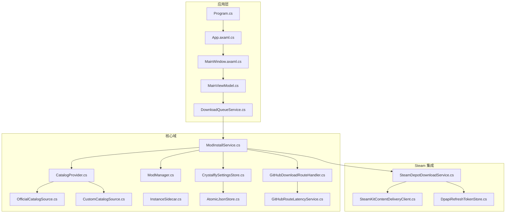
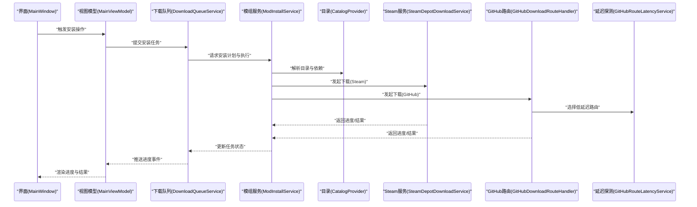
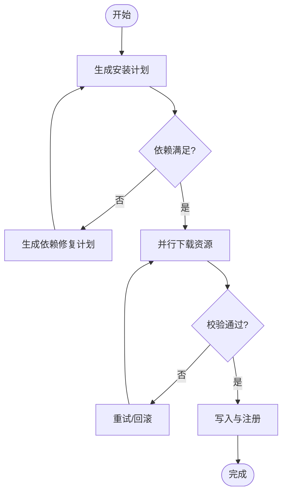
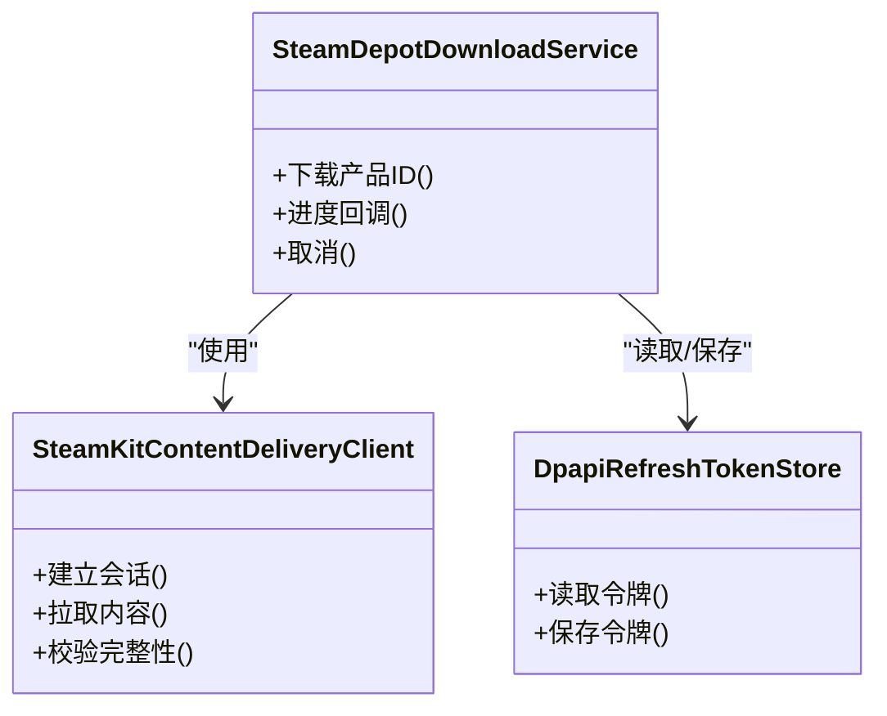
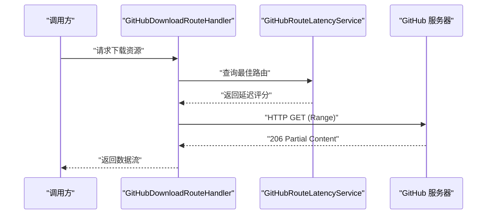
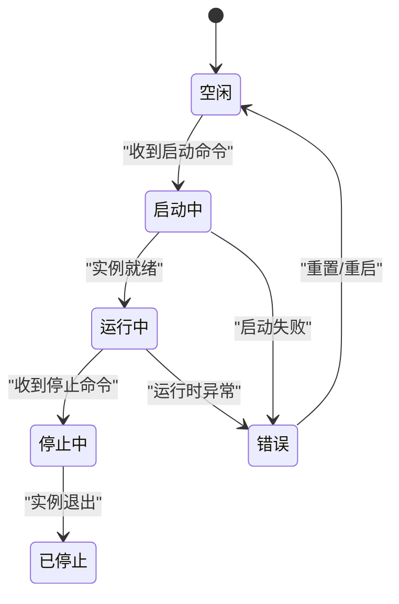
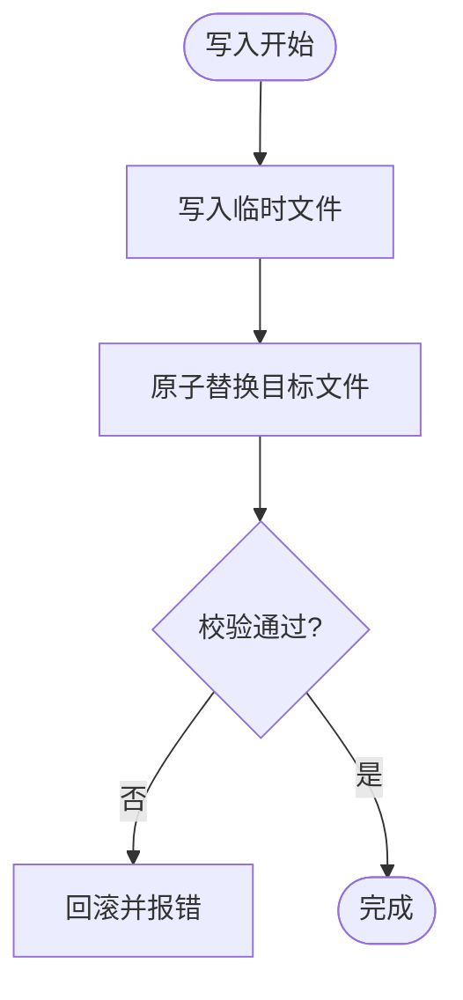
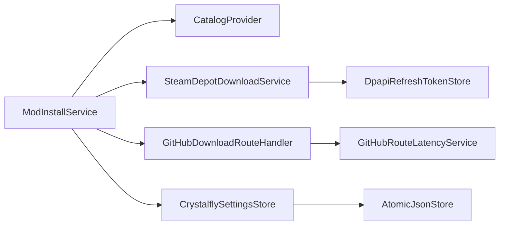

# API 参考

<cite>
**本文引用的文件**   
- [Program.cs](file://src/Crystalfly.App/Program.cs)
- [App.axaml.cs](file://src/Crystalfly.App/App.axaml.cs)
- [MainWindow.axaml.cs](file://src/Crystalfly.App/Views/MainWindow.axaml.cs)
- [MainViewModel.cs](file://src/Crystalfly.App/ViewModels/MainViewModel.cs)
- [DownloadQueueService.cs](file://src/Crystalfly.App/Downloads/DownloadQueueService.cs)
- [CatalogProvider.cs](file://src/Crystalfly.Core/Catalog/CatalogProvider.cs)
- [OfficialCatalogSource.cs](file://src/Crystalfly.Core/Catalog/OfficialCatalogSource.cs)
- [CustomCatalogSource.cs](file://src/Crystalfly.Core/Catalog/CustomCatalogSource.cs)
- [ModInstallService.cs](file://src/Crystalfly.Core/Mods/ModInstallService.cs)
- [ModManager.cs](file://src/Crystalfly.Core/Mods/ModManager.cs)
- [InstanceSidecar.cs](file://src/Crystalfly.Core/Instances/InstanceSidecar.cs)
- [SteamDepotDownloadService.cs](file://src/Crystalfy.Steam/Downloads/SteamDepotDownloadService.cs)
- [SteamKitContentDeliveryClient.cs](file://src/Crystalfy.Steam/Downloads/SteamKitContentDeliveryClient.cs)
- [DpapiRefreshTokenStore.cs](file://src/Crystalfy.Steam/Security/DpapiRefreshTokenStore.cs)
- [CrystalflySettingsStore.cs](file://src/Crystalfy.Core/Configuration/CrystalflySettingsStore.cs)
- [AtomicJsonStore.cs](file://src/Crystalfy.Core/Serialization/AtomicJsonStore.cs)
- [GitHubRouteLatencyService.cs](file://src/Crystalfy.Core/Networking/GitHubRouteLatencyService.cs)
- [GitHubDownloadRouteHandler.cs](file://src/Crystalfy.Core/Networking/GitHubDownloadRouteHandler.cs)
</cite>

## 目录
1. [简介](#简介)
2. [项目结构](#项目结构)
3. [核心组件](#核心组件)
4. [架构总览](#架构总览)
5. [详细组件分析](#详细组件分析)
6. [依赖关系分析](#依赖关系分析)
7. [性能考虑](#性能考虑)
8. [故障排查指南](#故障排查指南)
9. [结论](#结论)
10. [附录](#附录)

## 简介
本 API 参考聚焦于 Crystalfly 的对外可调用接口与通信机制，包括：
- RESTful 风格的服务端路由（用于 GitHub 下载等网络能力）
- 进程间通信（IPC）侧车模式（用于实例运行时管理）
- Steam 内容分发客户端（用于模组与游戏资产下载）
- 配置与序列化存储（JSON 原子写入）
- 认证与会话（Steam 刷新令牌持久化）

文档面向开发者与集成方，提供协议、消息格式、错误处理、安全与速率限制、版本兼容性与迁移建议，以及常见用例与调试方法。

## 项目结构
Crystalfly 采用分层与按领域组织的方式：
- 应用层（UI 与入口）：负责启动、视图模型编排与用户交互
- 核心域（Core）：包含目录解析、模组安装、实例管理、网络与序列化等
- Steam 集成（Steam）：封装 Steam 下载与认证能力
- 测试与脚本：覆盖功能验证与构建流程

图表来源
- [Program.cs](file://src/Crystalfly.App/Program.cs)
- [App.axaml.cs](file://src/Crystalfly.App/App.axaml.cs)
- [MainWindow.axaml.cs](file://src/Crystalfly.App/Views/MainWindow.axaml.cs)
- [MainViewModel.cs](file://src/Crystalfly.App/ViewModels/MainViewModel.cs)
- [DownloadQueueService.cs](file://src/Crystalfly.App/Downloads/DownloadQueueService.cs)
- [CatalogProvider.cs](file://src/Crystalfly.Core/Catalog/CatalogProvider.cs)
- [OfficialCatalogSource.cs](file://src/Crystalfy.Core/Catalog/OfficialCatalogSource.cs)
- [CustomCatalogSource.cs](file://src/Crystalfy.Core/Catalog/CustomCatalogSource.cs)
- [ModInstallService.cs](file://src/Crystalfy.Core/Mods/ModInstallService.cs)
- [ModManager.cs](file://src/Crystalfy.Core/Mods/ModManager.cs)
- [InstanceSidecar.cs](file://src/Crystalfy.Core/Instances/InstanceSidecar.cs)
- [SteamDepotDownloadService.cs](file://src/Crystalfy.Steam/Downloads/SteamDepotDownloadService.cs)
- [SteamKitContentDeliveryClient.cs](file://src/Crystalfy.Steam/Downloads/SteamKitContentDeliveryClient.cs)
- [DpapiRefreshTokenStore.cs](file://src/Crystalfy.Steam/Security/DpapiRefreshTokenStore.cs)
- [CrystalflySettingsStore.cs](file://src/Crystalfy.Core/Configuration/CrystalflySettingsStore.cs)
- [AtomicJsonStore.cs](file://src/Crystalfy.Core/Serialization/AtomicJsonStore.cs)
- [GitHubRouteLatencyService.cs](file://src/Crystalfy.Core/Networking/GitHubRouteLatencyService.cs)
- [GitHubDownloadRouteHandler.cs](file://src/Crystalfy.Core/Networking/GitHubDownloadRouteHandler.cs)

章节来源
- [Program.cs](file://src/Crystalfly.App/Program.cs)
- [App.axaml.cs](file://src/Crystalfly.App/App.axaml.cs)
- [MainWindow.axaml.cs](file://src/Crystalfly.App/Views/MainWindow.axaml.cs)
- [MainViewModel.cs](file://src/Crystalfly.App/ViewModels/MainViewModel.cs)
- [DownloadQueueService.cs](file://src/Crystalfly.App/Downloads/DownloadQueueService.cs)
- [CatalogProvider.cs](file://src/Crystalfy.Core/Catalog/CatalogProvider.cs)
- [OfficialCatalogSource.cs](file://src/Crystalfy.Core/Catalog/OfficialCatalogSource.cs)
- [CustomCatalogSource.cs](file://src/Crystalfy.Core/Catalog/CustomCatalogSource.cs)
- [ModInstallService.cs](file://src/Crystalfy.Core/Mods/ModInstallService.cs)
- [ModManager.cs](file://src/Crystalfy.Core/Mods/ModManager.cs)
- [InstanceSidecar.cs](file://src/Crystalfy.Core/Instances/InstanceSidecar.cs)
- [SteamDepotDownloadService.cs](file://src/Crystalfy.Steam/Downloads/SteamDepotDownloadService.cs)
- [SteamKitContentDeliveryClient.cs](file://src/Crystalfy.Steam/Downloads/SteamKitContentDeliveryClient.cs)
- [DpapiRefreshTokenStore.cs](file://src/Crystalfy.Steam/Security/DpapiRefreshTokenStore.cs)
- [CrystalflySettingsStore.cs](file://src/Crystalfy.Core/Configuration/CrystalflySettingsStore.cs)
- [AtomicJsonStore.cs](file://src/Crystalfy.Core/Serialization/AtomicJsonStore.cs)
- [GitHubRouteLatencyService.cs](file://src/Crystalfy.Core/Networking/GitHubRouteLatencyService.cs)
- [GitHubDownloadRouteHandler.cs](file://src/Crystalfy.Core/Networking/GitHubDownloadRouteHandler.cs)

## 核心组件
本节概述对外暴露的关键服务与接口职责，便于快速定位 API 边界与使用方式。

- 目录与资源发现
  - CatalogProvider：聚合官方与自定义目录源，提供统一查询入口
  - OfficialCatalogSource：解析并缓存官方目录数据
  - CustomCatalogSource：加载本地或远程自定义目录定义
- 模组安装与管理
  - ModInstallService：编排模组安装计划、依赖修复、下载与安装
  - ModManager：维护已安装模组清单与状态
- 实例运行期管理
  - InstanceSidecar：以“侧车”进程形式与游戏实例进行 IPC 协作
- 下载与网络
  - DownloadQueueService：队列化下载任务，协调并发与重试
  - SteamDepotDownloadService：通过 Steam 渠道拉取内容
  - SteamKitContentDeliveryClient：基于 SteamKit 的底层传输实现
  - GitHubDownloadRouteHandler：对 GitHub 资源的下载路由与优化
  - GitHubRouteLatencyService：探测与选择低延迟路由
- 配置与持久化
  - CrystalflySettingsStore：应用设置读写
  - AtomicJsonStore：保证 JSON 文件原子写入与一致性
- 认证与安全
  - DpapiRefreshTokenStore：使用 DPAPI 安全存储刷新令牌

章节来源
- [CatalogProvider.cs](file://src/Crystalfy.Core/Catalog/CatalogProvider.cs)
- [OfficialCatalogSource.cs](file://src/Crystalfy.Core/Catalog/OfficialCatalogSource.cs)
- [CustomCatalogSource.cs](file://src/Crystalfy.Core/Catalog/CustomCatalogSource.cs)
- [ModInstallService.cs](file://src/Crystalfy.Core/Mods/ModInstallService.cs)
- [ModManager.cs](file://src/Crystalfy.Core/Mods/ModManager.cs)
- [InstanceSidecar.cs](file://src/Crystalfy.Core/Instances/InstanceSidecar.cs)
- [DownloadQueueService.cs](file://src/Crystalfy.App/Downloads/DownloadQueueService.cs)
- [SteamDepotDownloadService.cs](file://src/Crystalfy.Steam/Downloads/SteamDepotDownloadService.cs)
- [SteamKitContentDeliveryClient.cs](file://src/Crystalfy.Steam/Downloads/SteamKitContentDeliveryClient.cs)
- [GitHubDownloadRouteHandler.cs](file://src/Crystalfy.Core/Networking/GitHubDownloadRouteHandler.cs)
- [GitHubRouteLatencyService.cs](file://src/Crystalfy.Core/Networking/GitHubRouteLatencyService.cs)
- [CrystalflySettingsStore.cs](file://src/Crystalfy.Core/Configuration/CrystalflySettingsStore.cs)
- [AtomicJsonStore.cs](file://src/Crystalfy.Core/Serialization/AtomicJsonStore.cs)
- [DpapiRefreshTokenStore.cs](file://src/Crystalfy.Steam/Security/DpapiRefreshTokenStore.cs)

## 架构总览
下图展示从 UI 到核心服务的调用链，以及外部系统（Steam、GitHub）的集成点。

图表来源
- [MainWindow.axaml.cs](file://src/Crystalfly.App/Views/MainWindow.axaml.cs)
- [MainViewModel.cs](file://src/Crystalfly.App/ViewModels/MainViewModel.cs)
- [DownloadQueueService.cs](file://src/Crystalfly.App/Downloads/DownloadQueueService.cs)
- [ModInstallService.cs](file://src/Crystalfy.Core/Mods/ModInstallService.cs)
- [CatalogProvider.cs](file://src/Crystalfy.Core/Catalog/CatalogProvider.cs)
- [SteamDepotDownloadService.cs](file://src/Crystalfy.Steam/Downloads/SteamDepotDownloadService.cs)
- [GitHubDownloadRouteHandler.cs](file://src/Crystalfy.Core/Networking/GitHubDownloadRouteHandler.cs)
- [GitHubRouteLatencyService.cs](file://src/Crystalfy.Core/Networking/GitHubRouteLatencyService.cs)

## 详细组件分析

### 组件 A：模组安装服务（ModInstallService）
职责与边界
- 输入：目标模组标识、安装上下文（实例路径、依赖策略）
- 输出：安装计划、执行结果、进度事件
- 副作用：文件系统变更、日志记录、配置更新

关键方法与契约
- 生成安装计划：根据目录与依赖图计算最小变更集
- 执行安装：按阶段下载、校验、写入、注册
- 依赖修复：检测缺失/冲突并生成修复计划
- 取消与重试：支持中断与幂等恢复

错误处理
- 网络异常：指数退避重试、失败回滚
- 校验失败：重新下载并比对哈希
- 权限不足：提示用户提升权限或切换路径

性能优化
- 并行下载：按带宽与磁盘 I/O 自适应并发度
- 增量更新：仅变更受影响文件
- 缓存命中：复用已校验包体

图表来源
- [ModInstallService.cs](file://src/Crystalfy.Core/Mods/ModInstallService.cs)
- [ModManager.cs](file://src/Crystalfy.Core/Mods/ModManager.cs)
- [CatalogProvider.cs](file://src/Crystalfy.Core/Catalog/CatalogProvider.cs)

章节来源
- [ModInstallService.cs](file://src/Crystalfy.Core/Mods/ModInstallService.cs)
- [ModManager.cs](file://src/Crystalfy.Core/Mods/ModManager.cs)
- [CatalogProvider.cs](file://src/Crystalfy.Core/Catalog/CatalogProvider.cs)

### 组件 B：Steam 内容分发（SteamDepotDownloadService + SteamKitContentDeliveryClient）
职责与边界
- 通过 Steam 渠道获取模组或游戏资产
- 封装 SteamKit 客户端，提供进度回调与断点续传

连接与认证
- 使用刷新令牌建立会话
- 令牌由 DPAPI 安全存储

下载协议要点
- 分块传输、校验和验证
- 失败自动重试与限速

图表来源
- [SteamDepotDownloadService.cs](file://src/Crystalfy.Steam/Downloads/SteamDepotDownloadService.cs)
- [SteamKitContentDeliveryClient.cs](file://src/Crystalfy.Steam/Downloads/SteamKitContentDeliveryClient.cs)
- [DpapiRefreshTokenStore.cs](file://src/Crystalfy.Steam/Security/DpapiRefreshTokenStore.cs)

章节来源
- [SteamDepotDownloadService.cs](file://src/Crystalfy.Steam/Downloads/SteamDepotDownloadService.cs)
- [SteamKitContentDeliveryClient.cs](file://src/Crystalfy.Steam/Downloads/SteamKitContentDeliveryClient.cs)
- [DpapiRefreshTokenStore.cs](file://src/Crystalfy.Steam/Security/DpapiRefreshTokenStore.cs)

### 组件 C：GitHub 下载路由（GitHubDownloadRouteHandler + GitHubRouteLatencyService）
职责与边界
- 为 GitHub 资源选择最优下载路径
- 探测多路由延迟，动态切换

协议与帧
- HTTP GET 流式下载
- 支持 Range 请求与断点续传

错误与限流
- 429/5xx 退避重试
- 全局速率限制与每域名配额

图表来源
- [GitHubDownloadRouteHandler.cs](file://src/Crystalfy.Core/Networking/GitHubDownloadRouteHandler.cs)
- [GitHubRouteLatencyService.cs](file://src/Crystalfy.Core/Networking/GitHubRouteLatencyService.cs)

章节来源
- [GitHubDownloadRouteHandler.cs](file://src/Crystalfy.Core/Networking/GitHubDownloadRouteHandler.cs)
- [GitHubRouteLatencyService.cs](file://src/Crystalfy.Core/Networking/GitHubRouteLatencyService.cs)

### 组件 D：实例侧车 IPC（InstanceSidecar）
职责与边界
- 以独立子进程运行，与主进程通过 IPC 通道通信
- 负责实例生命周期管理与沙箱隔离

IPC 协议要点
- 消息类型：启动、停止、健康检查、日志订阅
- 帧格式：长度前缀 + JSON 头部 + 可选二进制负载
- 状态机：空闲、启动中、运行中、停止中、已停止、错误

图表来源
- [InstanceSidecar.cs](file://src/Crystalfy.Core/Instances/InstanceSidecar.cs)

章节来源
- [InstanceSidecar.cs](file://src/Crystalfy.Core/Instances/InstanceSidecar.cs)

### 组件 E：配置与序列化（CrystalflySettingsStore + AtomicJsonStore）
职责与边界
- 提供线程安全的设置读写
- 保证 JSON 文件的原子写入与崩溃恢复

写入流程
- 写入临时文件 -> 原子替换 -> 校验摘要

图表来源
- [CrystalflySettingsStore.cs](file://src/Crystalfy.Core/Configuration/CrystalflySettingsStore.cs)
- [AtomicJsonStore.cs](file://src/Crystalfy.Core/Serialization/AtomicJsonStore.cs)

章节来源
- [CrystalflySettingsStore.cs](file://src/Crystalfy.Core/Configuration/CrystalflySettingsStore.cs)
- [AtomicJsonStore.cs](file://src/Crystalfy.Core/Serialization/AtomicJsonStore.cs)

## 依赖关系分析
- 松耦合设计：服务之间通过接口与组合注入，降低耦合
- 外部依赖：SteamKit、HTTP 客户端、文件系统
- 潜在循环：避免在模块间直接相互引用，必要时引入抽象层

图表来源
- [ModInstallService.cs](file://src/Crystalfy.Core/Mods/ModInstallService.cs)
- [CatalogProvider.cs](file://src/Crystalfy.Core/Catalog/CatalogProvider.cs)
- [SteamDepotDownloadService.cs](file://src/Crystalfy.Steam/Downloads/SteamDepotDownloadService.cs)
- [GitHubDownloadRouteHandler.cs](file://src/Crystalfy.Core/Networking/GitHubDownloadRouteHandler.cs)
- [GitHubRouteLatencyService.cs](file://src/Crystalfy.Core/Networking/GitHubRouteLatencyService.cs)
- [DpapiRefreshTokenStore.cs](file://src/Crystalfy.Steam/Security/DpapiRefreshTokenStore.cs)
- [CrystalflySettingsStore.cs](file://src/Crystalfy.Core/Configuration/CrystalflySettingsStore.cs)
- [AtomicJsonStore.cs](file://src/Crystalfy.Core/Serialization/AtomicJsonStore.cs)

章节来源
- [ModInstallService.cs](file://src/Crystalfy.Core/Mods/ModInstallService.cs)
- [CatalogProvider.cs](file://src/Crystalfy.Core/Catalog/CatalogProvider.cs)
- [SteamDepotDownloadService.cs](file://src/Crystalfy.Steam/Downloads/SteamDepotDownloadService.cs)
- [GitHubDownloadRouteHandler.cs](file://src/Crystalfy.Core/Networking/GitHubDownloadRouteHandler.cs)
- [GitHubRouteLatencyService.cs](file://src/Crystalfy.Core/Networking/GitHubRouteLatencyService.cs)
- [DpapiRefreshTokenStore.cs](file://src/Crystalfy.Steam/Security/DpapiRefreshTokenStore.cs)
- [CrystalflySettingsStore.cs](file://src/Crystalfy.Core/Configuration/CrystalflySettingsStore.cs)
- [AtomicJsonStore.cs](file://src/Crystalfy.Core/Serialization/AtomicJsonStore.cs)

## 性能考虑
- 并发控制：下载队列按带宽与磁盘 I/O 自适应并发度，避免争用
- 缓存与去重：重复包体跳过下载；目录元数据缓存减少解析开销
- 增量更新：仅变更受影响文件，缩短安装时间
- 路由优化：GitHub 多路由延迟探测，选择最优路径
- 内存占用：流式下载与分块处理，避免一次性加载大文件

[本节为通用指导，不直接分析具体文件]

## 故障排查指南
- 下载失败
  - 检查网络连通性与代理设置
  - 查看重试次数与退避策略是否生效
  - 确认校验和匹配与文件完整性
- 认证问题
  - 刷新令牌是否过期或被撤销
  - DPAPI 存储是否受系统账户影响
- 实例侧车异常
  - 检查子进程日志与退出码
  - 验证 IPC 通道是否被防火墙拦截
- 配置损坏
  - 使用原子写入的备份文件恢复
  - 校验 JSON 结构与必填字段

章节来源
- [SteamDepotDownloadService.cs](file://src/Crystalfy.Steam/Downloads/SteamDepotDownloadService.cs)
- [DpapiRefreshTokenStore.cs](file://src/Crystalfy.Steam/Security/DpapiRefreshTokenStore.cs)
- [InstanceSidecar.cs](file://src/Crystalfy.Core/Instances/InstanceSidecar.cs)
- [AtomicJsonStore.cs](file://src/Crystalfy.Core/Serialization/AtomicJsonStore.cs)

## 结论
Crystalfly 的 API 围绕模组安装、实例管理与内容分发三大场景展开，采用清晰的层次与模块化设计。通过 Steam 与 GitHub 的多通道下载、原子写入的配置存储、以及侧车进程的 IPC 管理，系统在可靠性与性能上具备良好平衡。建议在集成时遵循错误重试、幂等与回滚策略，并结合监控与日志完善可观测性。

[本节为总结，不直接分析具体文件]

## 附录

### 协议与消息规范速览
- HTTP（GitHub 下载）
  - 方法：GET
  - 头：Range、Accept-Ranges
  - 响应：200/206，流式数据
- IPC（侧车）
  - 帧：长度前缀 + JSON 头部 + 可选二进制负载
  - 事件：启动、停止、健康检查、日志订阅
- Steam 下载
  - 会话：刷新令牌
  - 传输：分块、校验、断点续传

[本节为概念性说明，不直接分析具体文件]

### 安全与合规
- 令牌存储：使用 DPAPI 加密，避免明文
- 权限最小化：按需访问文件系统与网络
- 输入校验：严格校验路径、URL 与参数

[本节为通用指导，不直接分析具体文件]

### 版本与兼容性
- 向后兼容：新增字段默认值，弃用字段保留解析逻辑
- 迁移指南：逐步替换旧接口，提供适配器层过渡

[本节为通用指导，不直接分析具体文件]