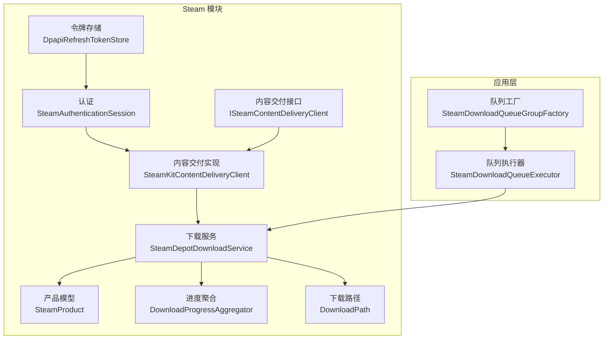
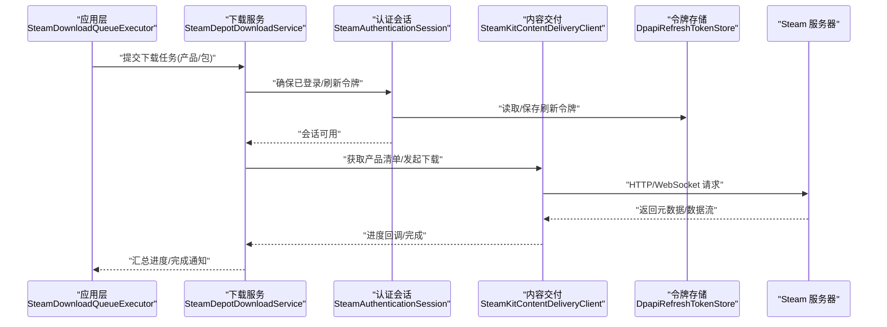
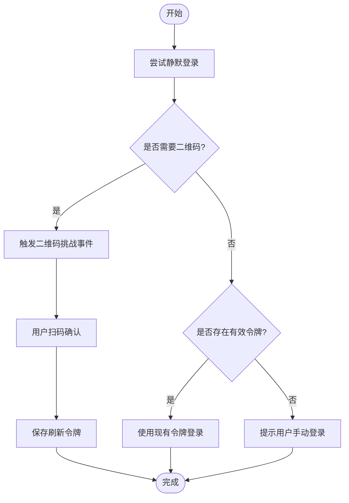
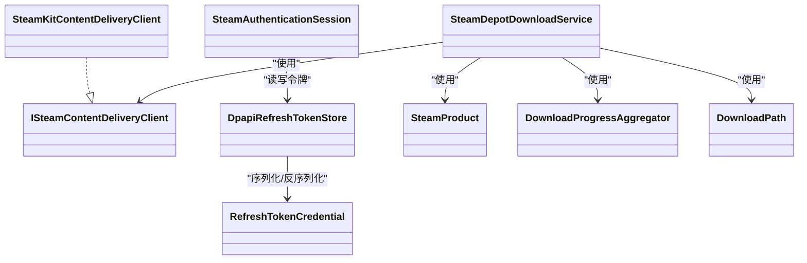

# Steam 客户端接口

<cite>
**本文引用的文件**   
- [ISteamContentDeliveryClient.cs](file://src/Crystalfly.Steam/Downloads/ISteamContentDeliveryClient.cs)
- [SteamKitContentDeliveryClient.cs](file://src/Crystalfly.Steam/Downloads/SteamKitContentDeliveryClient.cs)
- [SteamDepotDownloadService.cs](file://src/Crystalfly.Steam/Downloads/SteamDepotDownloadService.cs)
- [SteamProduct.cs](file://src/Crystalfly.Steam/Downloads/SteamProduct.cs)
- [SteamDownloadProgress.cs](file://src/Crystalfly.Steam/Downloads/SteamDownloadProgress.cs)
- [DownloadPath.cs](file://src/Crystalfly.Steam/Downloads/DownloadPath.cs)
- [DownloadProgressAggregator.cs](file://src/Crystalfly.Steam/Downloads/DownloadProgressAggregator.cs)
- [SteamAuthenticationSession.cs](file://src/Crystalfly.Steam/Authentication/SteamAuthenticationSession.cs)
- [QrChallengeEventArgs.cs](file://src/Crystalfly.Steam/Authentication/QrChallengeEventArgs.cs)
- [DpapiRefreshTokenStore.cs](file://src/Crystalfly.Steam/Security/DpapiRefreshTokenStore.cs)
- [RefreshTokenCredential.cs](file://src/Crystalfly.Steam/Security/RefreshTokenCredential.cs)
- [CrystalflySettings.cs](file://src/Crystalfly.Core/Configuration/CrystalflySettings.cs)
- [CrystalflyPaths.cs](file://src/Crystalfly.Core/Configuration/CrystalflyPaths.cs)
- [SteamDownloadQueueExecutor.cs](file://src/Crystalfly.App/Downloads/SteamDownloadQueueExecutor.cs)
- [SteamDownloadQueueGroupFactory.cs](file://src/Crystalfly.App/Downloads/SteamDownloadQueueGroupFactory.cs)
</cite>

## 目录
1. [简介](#简介)
2. [项目结构](#项目结构)
3. [核心组件](#核心组件)
4. [架构总览](#架构总览)
5. [详细组件分析](#详细组件分析)
6. [依赖关系分析](#依赖关系分析)
7. [性能与配置建议](#性能与配置建议)
8. [故障排查指南](#故障排查指南)
9. [结论](#结论)
10. [附录：API 参考](#附录api-参考)

## 简介
本文件为 Steam 客户端接口的权威文档，聚焦于 ISteamContentDeliveryClient 接口及其实现、认证流程（含会话生命周期与二维码挑战事件）、令牌持久化（DPAPI）以及下载服务集成。文档提供方法签名说明、参数类型、返回值约定、异常处理策略，并给出初始化、认证挑战处理、内容下载与错误处理的完整示例路径与最佳实践（连接池、超时、重试）。

## 项目结构
与 Steam 客户端相关的关键代码位于 Crystalfly.Steam 与上层应用集成层中：
- 认证与会话：Authentication 目录
- 内容交付与下载：Downloads 目录
- 安全与令牌存储：Security 目录
- 应用层队列执行器：App/Downloads 目录

图表来源
- [SteamAuthenticationSession.cs](file://src/Crystalfly.Steam/Authentication/SteamAuthenticationSession.cs)
- [DpapiRefreshTokenStore.cs](file://src/Crystalfly.Steam/Security/DpapiRefreshTokenStore.cs)
- [ISteamContentDeliveryClient.cs](file://src/Crystalfly.Steam/Downloads/ISteamContentDeliveryClient.cs)
- [SteamKitContentDeliveryClient.cs](file://src/Crystalfly.Steam/Downloads/SteamKitContentDeliveryClient.cs)
- [SteamDepotDownloadService.cs](file://src/Crystalfly.Steam/Downloads/SteamDepotDownloadService.cs)
- [SteamProduct.cs](file://src/Crystalfly.Steam/Downloads/SteamProduct.cs)
- [DownloadProgressAggregator.cs](file://src/Crystalfly.Steam/Downloads/DownloadProgressAggregator.cs)
- [DownloadPath.cs](file://src/Crystalfly.Steam/Downloads/DownloadPath.cs)
- [SteamDownloadQueueExecutor.cs](file://src/Crystalfly.App/Downloads/SteamDownloadQueueExecutor.cs)
- [SteamDownloadQueueGroupFactory.cs](file://src/Crystalfly.App/Downloads/SteamDownloadQueueGroupFactory.cs)

章节来源
- [ISteamContentDeliveryClient.cs](file://src/Crystalfly.Steam/Downloads/ISteamContentDeliveryClient.cs)
- [SteamKitContentDeliveryClient.cs](file://src/Crystalfly.Steam/Downloads/SteamKitContentDeliveryClient.cs)
- [SteamDepotDownloadService.cs](file://src/Crystalfly.Steam/Downloads/SteamDepotDownloadService.cs)
- [SteamProduct.cs](file://src/Crystalfly.Steam/Downloads/SteamProduct.cs)
- [SteamDownloadProgress.cs](file://src/Crystalfly.Steam/Downloads/SteamDownloadProgress.cs)
- [DownloadPath.cs](file://src/Crystalfly.Steam/Downloads/DownloadPath.cs)
- [DownloadProgressAggregator.cs](file://src/Crystalfly.Steam/Downloads/DownloadProgressAggregator.cs)
- [SteamAuthenticationSession.cs](file://src/Crystalfly.Steam/Authentication/SteamAuthenticationSession.cs)
- [QrChallengeEventArgs.cs](file://src/Crystalfly.Steam/Authentication/QrChallengeEventArgs.cs)
- [DpapiRefreshTokenStore.cs](file://src/Crystalfly.Steam/Security/DpapiRefreshTokenStore.cs)
- [RefreshTokenCredential.cs](file://src/Crystalfly.Steam/Security/RefreshTokenCredential.cs)
- [CrystalflySettings.cs](file://src/Crystalfly.Core/Configuration/CrystalflySettings.cs)
- [CrystalflyPaths.cs](file://src/Crystalfly.Core/Configuration/CrystalflyPaths.cs)
- [SteamDownloadQueueExecutor.cs](file://src/Crystalfly.App/Downloads/SteamDownloadQueueExecutor.cs)
- [SteamDownloadQueueGroupFactory.cs](file://src/Crystalfly.App/Downloads/SteamDownloadQueueGroupFactory.cs)

## 核心组件
- ISteamContentDeliveryClient：定义内容交付能力（如获取产品清单、发起 Depot 下载、查询进度等）的抽象接口。
- SteamKitContentDeliveryClient：基于 SteamKit 的具体实现，负责与 Steam 网络交互、管理会话与下载任务。
- SteamDepotDownloadService：面向业务的高层下载服务，封装产品解析、分片/并发控制、进度聚合与结果落盘。
- SteamAuthenticationSession：管理 Steam 登录会话，包括二维码挑战事件、刷新令牌加载/保存。
- DpapiRefreshTokenStore：使用 DPAPI 对刷新令牌进行本地安全持久化。
- 辅助模型与工具：SteamProduct、SteamDownloadProgress、DownloadPath、DownloadProgressAggregator。

章节来源
- [ISteamContentDeliveryClient.cs](file://src/Crystalfly.Steam/Downloads/ISteamContentDeliveryClient.cs)
- [SteamKitContentDeliveryClient.cs](file://src/Crystalfly.Steam/Downloads/SteamKitContentDeliveryClient.cs)
- [SteamDepotDownloadService.cs](file://src/Crystalfly.Steam/Downloads/SteamDepotDownloadService.cs)
- [SteamAuthenticationSession.cs](file://src/Crystalfly.Steam/Authentication/SteamAuthenticationSession.cs)
- [DpapiRefreshTokenStore.cs](file://src/Crystalfly.Steam/Security/DpapiRefreshTokenStore.cs)
- [SteamProduct.cs](file://src/Crystalfly.Steam/Downloads/SteamProduct.cs)
- [SteamDownloadProgress.cs](file://src/Crystalfly.Steam/Downloads/SteamDownloadProgress.cs)
- [DownloadPath.cs](file://src/Crystalfly.Steam/Downloads/DownloadPath.cs)
- [DownloadProgressAggregator.cs](file://src/Crystalfly.Steam/Downloads/DownloadProgressAggregator.cs)

## 架构总览
下图展示了从应用层到 Steam 网络的端到端调用链：应用通过队列执行器触发下载，下载服务协调认证与会话，内容交付客户端完成实际的网络请求与数据写入。

图表来源
- [SteamDownloadQueueExecutor.cs](file://src/Crystalfly.App/Downloads/SteamDownloadQueueExecutor.cs)
- [SteamDepotDownloadService.cs](file://src/Crystalfly.Steam/Downloads/SteamDepotDownloadService.cs)
- [SteamAuthenticationSession.cs](file://src/Crystalfly.Steam/Authentication/SteamAuthenticationSession.cs)
- [DpapiRefreshTokenStore.cs](file://src/Crystalfly.Steam/Security/DpapiRefreshTokenStore.cs)
- [SteamKitContentDeliveryClient.cs](file://src/Crystalfly.Steam/Downloads/SteamKitContentDeliveryClient.cs)

## 详细组件分析

### ISteamContentDeliveryClient 接口
- 职责：定义内容交付的核心操作，如列出产品、获取 Depot 信息、启动下载、查询下载状态、取消下载等。
- 典型方法族（以接口为准）：
  - 产品与清单：获取产品详情、获取 Depot 列表、获取文件清单
  - 下载控制：开始下载、暂停/恢复、取消下载
  - 进度与状态：查询当前下载进度、累计统计
  - 资源管理：初始化、释放
- 参数与返回值：
  - 输入通常包含产品标识、目标路径、并发度、校验选项等
  - 输出通常为任务句柄、进度事件或最终结果对象
- 异常处理：
  - 网络异常、认证失败、权限不足、磁盘空间不足、校验失败等应抛出明确异常或返回错误码
  - 建议在调用方统一捕获并重试/降级

章节来源
- [ISteamContentDeliveryClient.cs](file://src/Crystalfly.Steam/Downloads/ISteamContentDeliveryClient.cs)

### SteamKitContentDeliveryClient 实现
- 职责：对接 SteamKit，维护底层连接、会话、下载任务与回调。
- 关键行为：
  - 根据接口契约实现产品/Depot 查询与下载
  - 将进度事件转发给上层服务
  - 处理重连、超时与重试
- 与认证协作：
  - 在需要时触发二维码挑战事件
  - 自动刷新过期令牌（若配置了刷新令牌存储）

章节来源
- [SteamKitContentDeliveryClient.cs](file://src/Crystalfly.Steam/Downloads/SteamKitContentDeliveryClient.cs)

### SteamDepotDownloadService 下载服务
- 职责：面向业务的下载编排，包括：
  - 解析产品与版本
  - 生成下载路径与分片策略
  - 聚合多任务进度
  - 处理失败重试与回滚
- 与内容交付协作：
  - 通过 ISteamContentDeliveryClient 发起下载
  - 订阅进度事件并更新 UI/日志
- 与认证协作：
  - 在需要时委托 SteamAuthenticationSession 完成登录与刷新

章节来源
- [SteamDepotDownloadService.cs](file://src/Crystalfly.Steam/Downloads/SteamDepotDownloadService.cs)
- [SteamProduct.cs](file://src/Crystalfly.Steam/Downloads/SteamProduct.cs)
- [DownloadPath.cs](file://src/Crystalfly.Steam/Downloads/DownloadPath.cs)
- [DownloadProgressAggregator.cs](file://src/Crystalfly.Steam/Downloads/DownloadProgressAggregator.cs)

### 认证与会话：SteamAuthenticationSession
- 生命周期：
  - 创建会话 -> 尝试静默登录 -> 如需交互则触发二维码挑战 -> 用户扫码后完成登录 -> 保存刷新令牌 -> 后续自动刷新
  - 会话销毁时清理资源
- 事件：
  - QrChallengeEventArgs：携带二维码数据与交互提示，供 UI 展示
- 令牌管理：
  - 优先从 DpapiRefreshTokenStore 读取刷新令牌
  - 登录成功后持久化新令牌
- 异常与恢复：
  - 网络抖动、令牌失效、二次验证失败等场景需重试或引导用户重新扫码

章节来源
- [SteamAuthenticationSession.cs](file://src/Crystalfly.Steam/Authentication/SteamAuthenticationSession.cs)
- [QrChallengeEventArgs.cs](file://src/Crystalfly.Steam/Authentication/QrChallengeEventArgs.cs)
- [DpapiRefreshTokenStore.cs](file://src/Crystalfly.Steam/Security/DpapiRefreshTokenStore.cs)
- [RefreshTokenCredential.cs](file://src/Crystalfly.Steam/Security/RefreshTokenCredential.cs)

#### 认证流程图（含二维码挑战）

图表来源
- [SteamAuthenticationSession.cs](file://src/Crystalfly.Steam/Authentication/SteamAuthenticationSession.cs)
- [QrChallengeEventArgs.cs](file://src/Crystalfly.Steam/Authentication/QrChallengeEventArgs.cs)
- [DpapiRefreshTokenStore.cs](file://src/Crystalfly.Steam/Security/DpapiRefreshTokenStore.cs)

### 令牌持久化：DpapiRefreshTokenStore
- 职责：使用操作系统 DPAPI 对刷新令牌进行加密存储，避免明文泄露。
- 主要操作：
  - 读取令牌：解密并返回凭证对象
  - 保存令牌：序列化并加密写入
  - 删除令牌：用于登出或强制重新认证
- 安全要点：
  - 仅允许当前用户访问
  - 定期轮换与最小权限原则

章节来源
- [DpapiRefreshTokenStore.cs](file://src/Crystalfly.Steam/Security/DpapiRefreshTokenStore.cs)
- [RefreshTokenCredential.cs](file://src/Crystalfly.Steam/Security/RefreshTokenCredential.cs)

### 应用层集成：队列执行器与工厂
- SteamDownloadQueueExecutor：将下载任务入队、调度执行、监控状态。
- SteamDownloadQueueGroupFactory：按产品/包维度组织任务组，便于批量管理与进度聚合。

章节来源
- [SteamDownloadQueueExecutor.cs](file://src/Crystalfly.App/Downloads/SteamDownloadQueueExecutor.cs)
- [SteamDownloadQueueGroupFactory.cs](file://src/Crystalfly.App/Downloads/SteamDownloadQueueGroupFactory.cs)

## 依赖关系分析
- 松耦合设计：
  - 应用层通过接口 ISteamContentDeliveryClient 与具体实现解耦
  - 下载服务组合认证与会话，不直接依赖底层网络库
- 外部依赖：
  - SteamKit（由实现类引入）
  - DPAPI（由令牌存储引入）
- 可能的循环依赖：
  - 应避免下载服务反向依赖认证细节；通过事件与回调隔离

图表来源
- [ISteamContentDeliveryClient.cs](file://src/Crystalfly.Steam/Downloads/ISteamContentDeliveryClient.cs)
- [SteamKitContentDeliveryClient.cs](file://src/Crystalfly.Steam/Downloads/SteamKitContentDeliveryClient.cs)
- [SteamDepotDownloadService.cs](file://src/Crystalfly.Steam/Downloads/SteamDepotDownloadService.cs)
- [SteamProduct.cs](file://src/Crystalfly.Steam/Downloads/SteamProduct.cs)
- [DownloadProgressAggregator.cs](file://src/Crystalfly.Steam/Downloads/DownloadProgressAggregator.cs)
- [DownloadPath.cs](file://src/Crystalfly.Steam/Downloads/DownloadPath.cs)
- [SteamAuthenticationSession.cs](file://src/Crystalfly.Steam/Authentication/SteamAuthenticationSession.cs)
- [DpapiRefreshTokenStore.cs](file://src/Crystalfly.Steam/Security/DpapiRefreshTokenStore.cs)
- [RefreshTokenCredential.cs](file://src/Crystalfly.Steam/Security/RefreshTokenCredential.cs)

## 性能与配置建议
- 连接池与并发
  - 合理设置最大并发下载数，避免压垮 Steam 服务端或本机 IO
  - 对大文件启用分块/并行下载（若实现支持）
- 超时与重试
  - 设置合理的请求超时与重试次数，指数退避策略更稳健
  - 针对认证失败的特定错误码采用快速重试，网络错误采用慢速重试
- 令牌刷新
  - 在令牌即将过期前主动刷新，减少中断
  - 失败时回退至二维码挑战流程
- 进度与内存
  - 使用增量进度上报，避免一次性加载全部元数据
  - 及时释放临时缓冲与句柄
- 配置项参考
  - 可结合全局设置与路径配置（如 CrystalflySettings、CrystalflyPaths）集中管理

章节来源
- [CrystalflySettings.cs](file://src/Crystalfly.Core/Configuration/CrystalflySettings.cs)
- [CrystalflyPaths.cs](file://src/Crystalfly.Core/Configuration/CrystalflyPaths.cs)

## 故障排查指南
- 常见问题
  - 二维码无法显示：检查事件订阅与 UI 线程上下文
  - 令牌无效/过期：检查刷新逻辑与 DPAPI 可用性
  - 下载失败：查看网络错误码、磁盘空间、路径权限
- 定位步骤
  - 开启详细日志，记录认证阶段与下载阶段的关键事件
  - 复现最小用例，逐步缩小范围
- 恢复策略
  - 自动重试 + 人工干预提示（如要求重新扫码）
  - 断点续传（若实现支持）

章节来源
- [SteamAuthenticationSession.cs](file://src/Crystalfly.Steam/Authentication/SteamAuthenticationSession.cs)
- [DpapiRefreshTokenStore.cs](file://src/Crystalfly.Steam/Security/DpapiRefreshTokenStore.cs)
- [SteamDepotDownloadService.cs](file://src/Crystalfly.Steam/Downloads/SteamDepotDownloadService.cs)

## 结论
本接口体系通过清晰的职责分层与事件驱动机制，实现了稳定的 Steam 内容交付能力。认证与会话管理、令牌持久化与下载服务相互独立且可替换，便于扩展与维护。遵循本文的性能与配置建议，可获得更好的用户体验与系统稳定性。

## 附录：API 参考

### ISteamContentDeliveryClient 方法参考
- 说明：以下为接口层面的方法分类与用途说明，具体签名请以源码为准。
- 类别与用途
  - 产品与清单
    - 获取产品详情：返回产品基本信息与可用渠道
    - 获取 Depot 列表：返回可下载的 Depot 集合
    - 获取文件清单：返回指定版本的文件列表与校验信息
  - 下载控制
    - 开始下载：返回任务句柄，支持进度回调
    - 暂停/恢复：对进行中任务进行控制
    - 取消下载：终止任务并清理资源
  - 进度与状态
    - 查询进度：返回当前任务的百分比、速度、剩余时间等
    - 累计统计：返回整体下载统计
  - 资源管理
    - 初始化：建立必要上下文
    - 释放：关闭连接与释放资源

章节来源
- [ISteamContentDeliveryClient.cs](file://src/Crystalfly.Steam/Downloads/ISteamContentDeliveryClient.cs)

### 认证流程与事件
- SteamAuthenticationSession
  - 生命周期：创建 -> 静默登录 -> 二维码挑战（可选）-> 保存刷新令牌 -> 自动刷新
  - 事件：QrChallengeEventArgs 用于 UI 展示二维码与交互提示
- DpapiRefreshTokenStore
  - 读取/保存/删除刷新令牌，使用 DPAPI 加密保护

章节来源
- [SteamAuthenticationSession.cs](file://src/Crystalfly.Steam/Authentication/SteamAuthenticationSession.cs)
- [QrChallengeEventArgs.cs](file://src/Crystalfly.Steam/Authentication/QrChallengeEventArgs.cs)
- [DpapiRefreshTokenStore.cs](file://src/Crystalfly.Steam/Security/DpapiRefreshTokenStore.cs)
- [RefreshTokenCredential.cs](file://src/Crystalfly.Steam/Security/RefreshTokenCredential.cs)

### 下载服务与模型
- SteamDepotDownloadService
  - 编排下载任务、聚合进度、处理失败重试
- 模型与工具
  - SteamProduct：产品信息
  - DownloadPath：下载路径规划
  - DownloadProgressAggregator：多任务进度聚合
  - SteamDownloadProgress：单次下载进度

章节来源
- [SteamDepotDownloadService.cs](file://src/Crystalfly.Steam/Downloads/SteamDepotDownloadService.cs)
- [SteamProduct.cs](file://src/Crystalfly.Steam/Downloads/SteamProduct.cs)
- [DownloadPath.cs](file://src/Crystalfly.Steam/Downloads/DownloadPath.cs)
- [DownloadProgressAggregator.cs](file://src/Crystalfly.Steam/Downloads/DownloadProgressAggregator.cs)
- [SteamDownloadProgress.cs](file://src/Crystalfly.Steam/Downloads/SteamDownloadProgress.cs)

### 应用层集成
- SteamDownloadQueueExecutor：任务入队、调度与监控
- SteamDownloadQueueGroupFactory：按产品/包分组管理

章节来源
- [SteamDownloadQueueExecutor.cs](file://src/Crystalfly.App/Downloads/SteamDownloadQueueExecutor.cs)
- [SteamDownloadQueueGroupFactory.cs](file://src/Crystalfly.App/Downloads/SteamDownloadQueueGroupFactory.cs)

### 完整示例路径（无代码片段）
- 初始化客户端
  - 参考：[SteamKitContentDeliveryClient.cs](file://src/Crystalfly.Steam/Downloads/SteamKitContentDeliveryClient.cs)
- 处理认证挑战
  - 参考：[SteamAuthenticationSession.cs](file://src/Crystalfly.Steam/Authentication/SteamAuthenticationSession.cs)、[QrChallengeEventArgs.cs](file://src/Crystalfly.Steam/Authentication/QrChallengeEventArgs.cs)
- 下载内容
  - 参考：[SteamDepotDownloadService.cs](file://src/Crystalfly.Steam/Downloads/SteamDepotDownloadService.cs)、[ISteamContentDeliveryClient.cs](file://src/Crystalfly.Steam/Downloads/ISteamContentDeliveryClient.cs)
- 错误处理与重试
  - 参考：[SteamDepotDownloadService.cs](file://src/Crystalfly.Steam/Downloads/SteamDepotDownloadService.cs)
- 令牌持久化
  - 参考：[DpapiRefreshTokenStore.cs](file://src/Crystalfly.Steam/Security/DpapiRefreshTokenStore.cs)、[RefreshTokenCredential.cs](file://src/Crystalfly.Steam/Security/RefreshTokenCredential.cs)