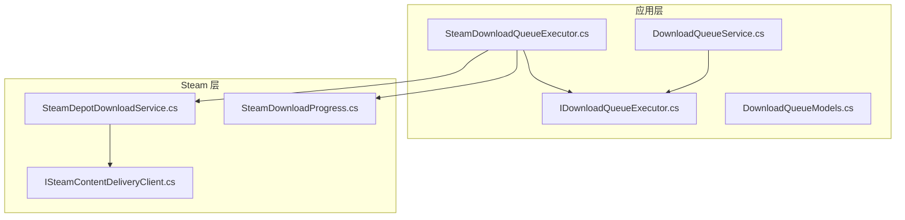
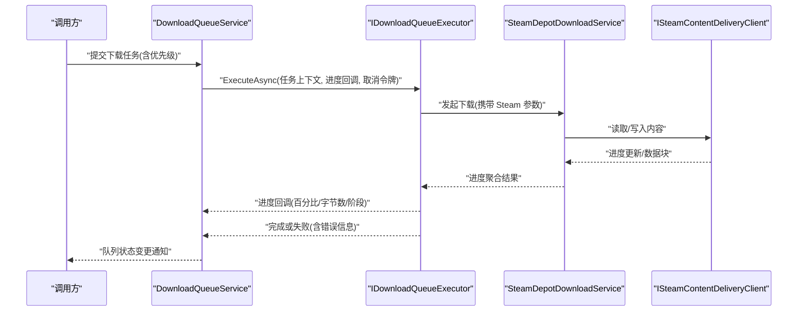
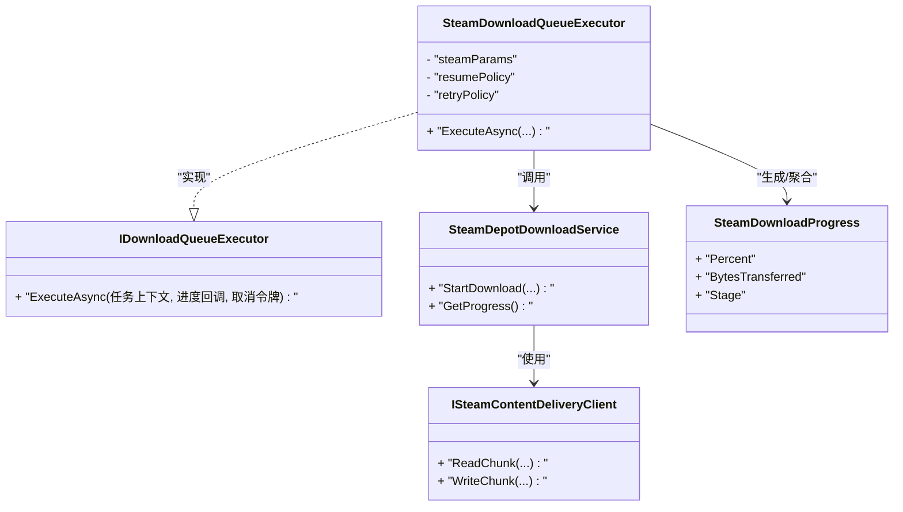
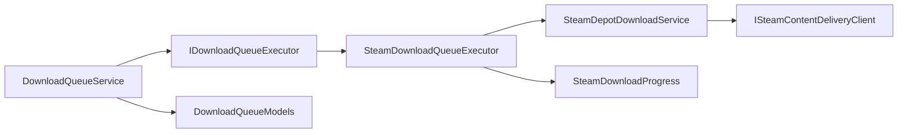

# 下载执行器接口

<cite>
**本文引用的文件**   
- [IDownloadQueueExecutor.cs](file://src/Crystalfly.App/Downloads/IDownloadQueueExecutor.cs)
- [DownloadQueueService.cs](file://src/Crystalfly.App/Downloads/DownloadQueueService.cs)
- [SteamDownloadQueueExecutor.cs](file://src/Crystalfly.App/Downloads/SteamDownloadQueueExecutor.cs)
- [DownloadQueueModels.cs](file://src/Crystalfly.App/Downloads/DownloadQueueModels.cs)
- [SteamDepotDownloadService.cs](file://src/Crystalfly.Steam/Downloads/SteamDepotDownloadService.cs)
- [ISteamContentDeliveryClient.cs](file://src/Crystalfly.Steam/Downloads/ISteamContentDeliveryClient.cs)
- [SteamDownloadProgress.cs](file://src/Crystalfly.Steam/Downloads/SteamDownloadProgress.cs)
</cite>

## 目录
1. [简介](#简介)
2. [项目结构](#项目结构)
3. [核心组件](#核心组件)
4. [架构总览](#架构总览)
5. [详细组件分析](#详细组件分析)
6. [依赖关系分析](#依赖关系分析)
7. [性能考虑](#性能考虑)
8. [故障排查指南](#故障排查指南)
9. [结论](#结论)
10. [附录](#附录)

## 简介
本文件为“下载执行器系统”的 API 文档，聚焦以下目标：
- 定义并说明 IDownloadQueueExecutor 接口的职责、ExecuteAsync 方法参数结构、进度回调与取消令牌处理。
- 记录 DownloadQueueService 的队列管理接口能力：任务添加、优先级控制、并发限制与状态监控。
- 解析 SteamDownloadQueueExecutor 的具体实现细节：Steam 特定参数、断点续传支持与错误恢复机制。
- 提供自定义下载执行器的开发指南：需要实现的抽象方法、关键约定与最佳实践。

## 项目结构
下载相关代码主要分布在应用层与 Steam 集成层：
- 应用层（Crystalfly.App）
  - Downloads 目录包含下载队列接口、服务、模型以及具体执行器实现。
- Steam 层（Crystalfly.Steam）
  - Downloads 目录包含与 Steam 内容分发相关的客户端与服务。

图表来源
- [IDownloadQueueExecutor.cs](file://src/Crystalfly.App/Downloads/IDownloadQueueExecutor.cs)
- [DownloadQueueService.cs](file://src/Crystalfly.App/Downloads/DownloadQueueService.cs)
- [SteamDownloadQueueExecutor.cs](file://src/Crystalfly.App/Downloads/SteamDownloadQueueExecutor.cs)
- [DownloadQueueModels.cs](file://src/Crystalfly.App/Downloads/DownloadQueueModels.cs)
- [SteamDepotDownloadService.cs](file://src/Crystalfly.Steam/Downloads/SteamDepotDownloadService.cs)
- [ISteamContentDeliveryClient.cs](file://src/Crystalfly.Steam/Downloads/ISteamContentDeliveryClient.cs)
- [SteamDownloadProgress.cs](file://src/Crystalfly.Steam/Downloads/SteamDownloadProgress.cs)

章节来源
- [IDownloadQueueExecutor.cs](file://src/Crystalfly.App/Downloads/IDownloadQueueExecutor.cs)
- [DownloadQueueService.cs](file://src/Crystalfly.App/Downloads/DownloadQueueService.cs)
- [SteamDownloadQueueExecutor.cs](file://src/Crystalfly.App/Downloads/SteamDownloadQueueExecutor.cs)
- [DownloadQueueModels.cs](file://src/Crystalfly.App/Downloads/DownloadQueueModels.cs)
- [SteamDepotDownloadService.cs](file://src/Crystalfly.Steam/Downloads/SteamDepotDownloadService.cs)
- [ISteamContentDeliveryClient.cs](file://src/Crystalfly.Steam/Downloads/ISteamContentDeliveryClient.cs)
- [SteamDownloadProgress.cs](file://src/Crystalfly.Steam/Downloads/SteamDownloadProgress.cs)

## 核心组件
本节概述下载执行器系统的核心角色与职责边界：
- IDownloadQueueExecutor：定义单个下载任务的执行契约，包括异步执行、进度上报与取消支持。
- DownloadQueueService：负责下载任务的入队、出队、优先级调度、并发度控制与整体状态监控。
- SteamDownloadQueueExecutor：基于 Steam 内容分发的具体执行器，封装 Steam 特有参数、断点续传与错误恢复策略。
- DownloadQueueModels：定义队列项、进度事件等数据模型。
- Steam 层服务与客户端：提供底层下载能力与进度聚合。

章节来源
- [IDownloadQueueExecutor.cs](file://src/Crystalfly.App/Downloads/IDownloadQueueExecutor.cs)
- [DownloadQueueService.cs](file://src/Crystalfly.App/Downloads/DownloadQueueService.cs)
- [SteamDownloadQueueExecutor.cs](file://src/Crystalfly.App/Downloads/SteamDownloadQueueExecutor.cs)
- [DownloadQueueModels.cs](file://src/Crystalfly.App/Downloads/DownloadQueueModels.cs)
- [SteamDepotDownloadService.cs](file://src/Crystalfly.Steam/Downloads/SteamDepotDownloadService.cs)
- [ISteamContentDeliveryClient.cs](file://src/Crystalfly.Steam/Downloads/ISteamContentDeliveryClient.cs)
- [SteamDownloadProgress.cs](file://src/Crystalfly.Steam/Downloads/SteamDownloadProgress.cs)

## 架构总览
下图展示了从上层队列服务到具体执行器再到 Steam 底层服务的调用链路与数据流。

图表来源
- [DownloadQueueService.cs](file://src/Crystalfly.App/Downloads/DownloadQueueService.cs)
- [IDownloadQueueExecutor.cs](file://src/Crystalfly.App/Downloads/IDownloadQueueExecutor.cs)
- [SteamDownloadQueueExecutor.cs](file://src/Crystalfly.App/Downloads/SteamDownloadQueueExecutor.cs)
- [SteamDepotDownloadService.cs](file://src/Crystalfly.Steam/Downloads/SteamDepotDownloadService.cs)
- [ISteamContentDeliveryClient.cs](file://src/Crystalfly.Steam/Downloads/ISteamContentDeliveryClient.cs)

## 详细组件分析

### IDownloadQueueExecutor 接口
职责与要求
- 定义单个下载任务的执行入口 ExecuteAsync。
- 必须支持：
  - 任务上下文参数：包含目标资源标识、存储路径、校验信息等。
  - 进度回调：以事件或委托形式周期性上报下载进度（如百分比、已下载字节数、当前阶段）。
  - 取消令牌：在外部请求取消时及时中止下载并释放资源。
- 返回值：通常返回表示任务最终状态的类型（成功/失败及原因）。

参数结构与约定
- 任务上下文：应包含唯一任务标识、目标地址或包标识、本地落盘路径、校验值（如哈希）、重试策略等。
- 进度回调：建议采用不可变进度对象，避免频繁 GC；回调线程安全由调用方保证或由执行器内部同步。
- 取消令牌：应在网络 I/O、文件写入、计算校验等耗时操作前检查令牌是否已取消。

异常与错误处理
- 对可恢复错误（如网络抖动）进行指数退避重试。
- 对不可恢复错误（如权限不足、磁盘空间不足）立即失败并上报明确错误码。
- 确保在异常路径上清理临时文件与句柄。

章节来源
- [IDownloadQueueExecutor.cs](file://src/Crystalfly.App/Downloads/IDownloadQueueExecutor.cs)

### DownloadQueueService 队列管理接口
功能概览
- 任务添加：支持按优先级插入，维护先进先出与优先级混合策略。
- 并发限制：通过最大并行度控制同时运行的下载任务数量。
- 状态监控：暴露队列长度、运行中任务、已完成/失败统计与实时进度聚合。
- 生命周期：启动、暂停、停止与优雅关闭。

关键行为
- 入队：根据优先级决定调度顺序；重复任务去重策略需明确。
- 出队：当有可用槽位时从队头取出任务交由执行器执行。
- 进度聚合：汇总各任务进度，对外提供统一视图。
- 取消传播：上层取消时向所有运行中任务下发取消信号。

扩展点
- 可通过注入不同 IDownloadQueueExecutor 实现切换下载后端（如 Steam、HTTP 等）。

章节来源
- [DownloadQueueService.cs](file://src/Crystalfly.App/Downloads/DownloadQueueService.cs)
- [DownloadQueueModels.cs](file://src/Crystalfly.App/Downloads/DownloadQueueModels.cs)

### SteamDownloadQueueExecutor 实现细节
职责
- 将通用下载任务适配到 Steam 内容分发流程。
- 封装 Steam 特定参数（如产品/仓库/构建号、安装目录、验证选项等）。
- 实现断点续传与错误恢复。

Steam 特定参数
- 产品标识、仓库与构建号用于定位内容。
- 本地安装根目录与相对路径用于落盘。
- 校验与完整性检查开关。

断点续传支持
- 利用 Steam 客户端的增量下载能力，避免重复传输。
- 在任务中断后恢复时，优先查询已有片段并继续下载缺失部分。
- 对不完整的中间文件进行一致性校验，必要时回滚并重试。

错误恢复机制
- 网络错误：指数退避 + 有限次重试。
- 权限/磁盘错误：立即失败并提示用户。
- 校验失败：自动重新拉取受影响片段。
- 取消：快速退出并保留可恢复状态以便后续续传。

与下层服务交互
- 通过 SteamDepotDownloadService 发起下载。
- 使用 ISteamContentDeliveryClient 访问内容分发端点。
- 使用 SteamDownloadProgress 聚合进度并上报给上层。

图表来源
- [IDownloadQueueExecutor.cs](file://src/Crystalfly.App/Downloads/IDownloadQueueExecutor.cs)
- [SteamDownloadQueueExecutor.cs](file://src/Crystalfly.App/Downloads/SteamDownloadQueueExecutor.cs)
- [SteamDepotDownloadService.cs](file://src/Crystalfly.Steam/Downloads/SteamDepotDownloadService.cs)
- [ISteamContentDeliveryClient.cs](file://src/Crystalfly.Steam/Downloads/ISteamContentDeliveryClient.cs)
- [SteamDownloadProgress.cs](file://src/Crystalfly.Steam/Downloads/SteamDownloadProgress.cs)

章节来源
- [SteamDownloadQueueExecutor.cs](file://src/Crystalfly.App/Downloads/SteamDownloadQueueExecutor.cs)
- [SteamDepotDownloadService.cs](file://src/Crystalfly.Steam/Downloads/SteamDepotDownloadService.cs)
- [ISteamContentDeliveryClient.cs](file://src/Crystalfly.Steam/Downloads/ISteamContentDeliveryClient.cs)
- [SteamDownloadProgress.cs](file://src/Crystalfly.Steam/Downloads/SteamDownloadProgress.cs)

### 自定义下载执行器开发指南
必要实现
- 实现 IDownloadQueueExecutor.ExecuteAsync，遵循以下约定：
  - 接收任务上下文、进度回调与取消令牌。
  - 在长耗时操作中定期检查取消令牌并及时退出。
  - 定期触发进度回调，保持 UI 响应与状态可见性。
  - 返回明确的完成状态，并在失败时附带错误信息。

推荐模式
- 重试与退避：对瞬态错误采用指数退避与最大重试次数。
- 幂等与可恢复：确保多次执行不会产生副作用；保存可恢复状态以便续传。
- 资源管理：使用 try/finally 或 using 语义确保文件句柄、网络连接正确释放。
- 线程安全：进度回调可能跨线程，注意并发写保护。

最佳实践
- 将 Steam 特定逻辑与通用逻辑解耦，便于替换与测试。
- 使用不可变的进度对象，减少分配与锁竞争。
- 对关键路径增加日志与指标，便于问题定位。
- 为常见错误分类并提供用户友好的错误消息。

章节来源
- [IDownloadQueueExecutor.cs](file://src/Crystalfly.App/Downloads/IDownloadQueueExecutor.cs)
- [DownloadQueueModels.cs](file://src/Crystalfly.App/Downloads/DownloadQueueModels.cs)

## 依赖关系分析
组件耦合与内聚
- DownloadQueueService 仅依赖 IDownloadQueueExecutor 抽象，具备良好内聚与低耦合。
- SteamDownloadQueueExecutor 依赖 Steam 层服务与客户端，形成清晰的后端边界。
- 进度模型集中在 DownloadQueueModels 与 SteamDownloadProgress，便于复用。

潜在循环依赖
- 当前结构未见循环引用；若新增执行器，应避免反向依赖队列服务。

外部依赖
- Steam 内容分发客户端作为外部子系统，其可用性影响下载成功率与延迟。

图表来源
- [DownloadQueueService.cs](file://src/Crystalfly.App/Downloads/DownloadQueueService.cs)
- [IDownloadQueueExecutor.cs](file://src/Crystalfly.App/Downloads/IDownloadQueueExecutor.cs)
- [SteamDownloadQueueExecutor.cs](file://src/Crystalfly.App/Downloads/SteamDownloadQueueExecutor.cs)
- [DownloadQueueModels.cs](file://src/Crystalfly.App/Downloads/DownloadQueueModels.cs)
- [SteamDepotDownloadService.cs](file://src/Crystalfly.Steam/Downloads/SteamDepotDownloadService.cs)
- [ISteamContentDeliveryClient.cs](file://src/Crystalfly.Steam/Downloads/ISteamContentDeliveryClient.cs)
- [SteamDownloadProgress.cs](file://src/Crystalfly.Steam/Downloads/SteamDownloadProgress.cs)

章节来源
- [DownloadQueueService.cs](file://src/Crystalfly.App/Downloads/DownloadQueueService.cs)
- [IDownloadQueueExecutor.cs](file://src/Crystalfly.App/Downloads/IDownloadQueueExecutor.cs)
- [SteamDownloadQueueExecutor.cs](file://src/Crystalfly.App/Downloads/SteamDownloadQueueExecutor.cs)
- [DownloadQueueModels.cs](file://src/Crystalfly.App/Downloads/DownloadQueueModels.cs)
- [SteamDepotDownloadService.cs](file://src/Crystalfly.Steam/Downloads/SteamDepotDownloadService.cs)
- [ISteamContentDeliveryClient.cs](file://src/Crystalfly.Steam/Downloads/ISteamContentDeliveryClient.cs)
- [SteamDownloadProgress.cs](file://src/Crystalfly.Steam/Downloads/SteamDownloadProgress.cs)

## 性能考虑
- 并发度调优：根据磁盘 I/O 与网络带宽设置合适的最大并行度，避免争用导致吞吐下降。
- 进度回调节流：在高频率回调场景下合并或限频，降低 UI 刷新压力。
- 内存占用：避免一次性加载大文件到内存，采用流式读写。
- 重试策略：合理设置退避上限与超时时间，防止雪崩效应。
- 缓存与复用：复用连接与缓冲区，减少分配与握手开销。

[本节为通用指导，无需源码引用]

## 故障排查指南
常见问题与定位要点
- 无法开始下载：检查队列是否已满、并发度是否为 0、任务上下文是否完整。
- 进度停滞：确认进度回调是否被触发、是否存在长时间阻塞的 I/O。
- 取消无效：检查是否在关键路径检查了取消令牌。
- 校验失败：查看是否启用完整性检查，确认源与目标一致。
- 权限/磁盘错误：检查目标目录权限与剩余空间。

建议日志与指标
- 记录每次入队/出队、开始/结束、重试与失败原因。
- 统计平均吞吐、失败率与重试次数，辅助容量规划。

章节来源
- [DownloadQueueService.cs](file://src/Crystalfly.App/Downloads/DownloadQueueService.cs)
- [SteamDownloadQueueExecutor.cs](file://src/Crystalfly.App/Downloads/SteamDownloadQueueExecutor.cs)

## 结论
本 API 通过清晰的接口抽象与分层设计，实现了可扩展的下载执行体系。IDownloadQueueExecutor 定义了统一的执行契约，DownloadQueueService 提供稳定的队列管理能力，而 SteamDownloadQueueExecutor 则封装了 Steam 特定的复杂逻辑。遵循本文的开发指南与最佳实践，可以快速实现新的下载后端并保持系统的一致性与可维护性。

[本节为总结性内容，无需源码引用]

## 附录
- 术语
  - 任务上下文：描述一次下载所需的全部输入信息。
  - 进度回调：周期性上报下载进度的机制。
  - 取消令牌：用于通知执行器尽快终止操作的信号。
  - 断点续传：在中断后从上次位置继续下载的能力。

[本节为概念性补充，无需源码引用]