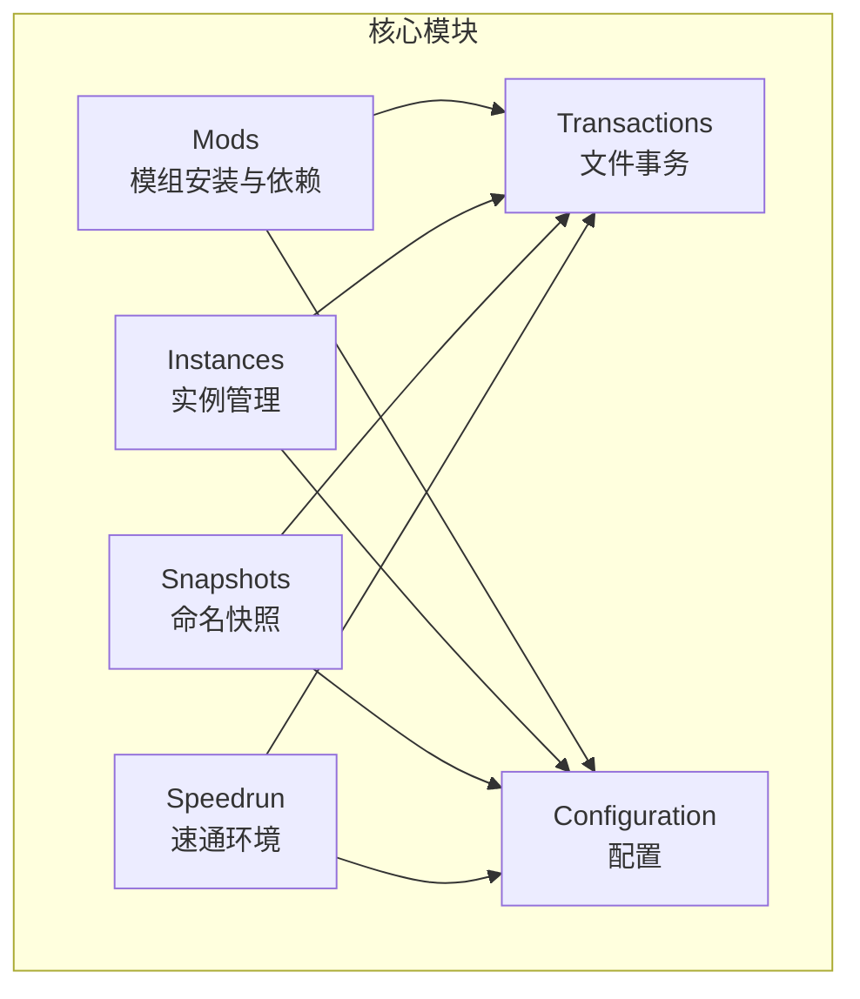
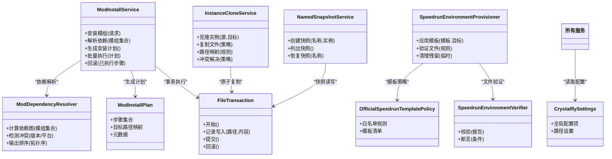
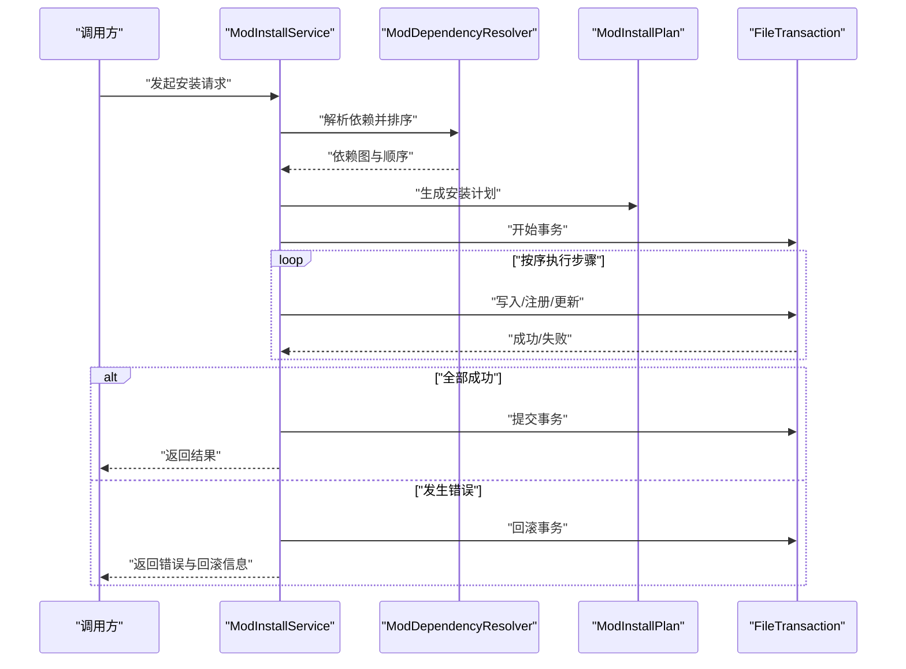
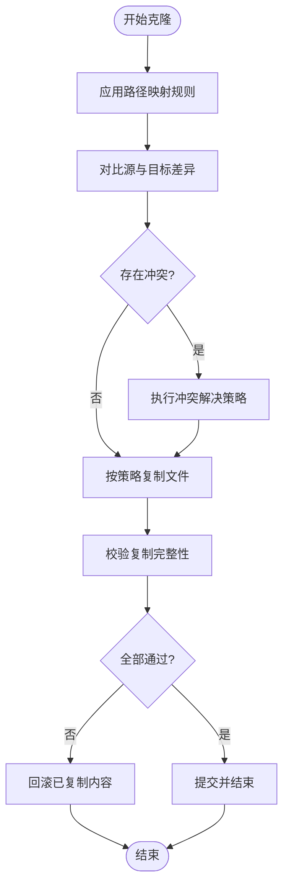
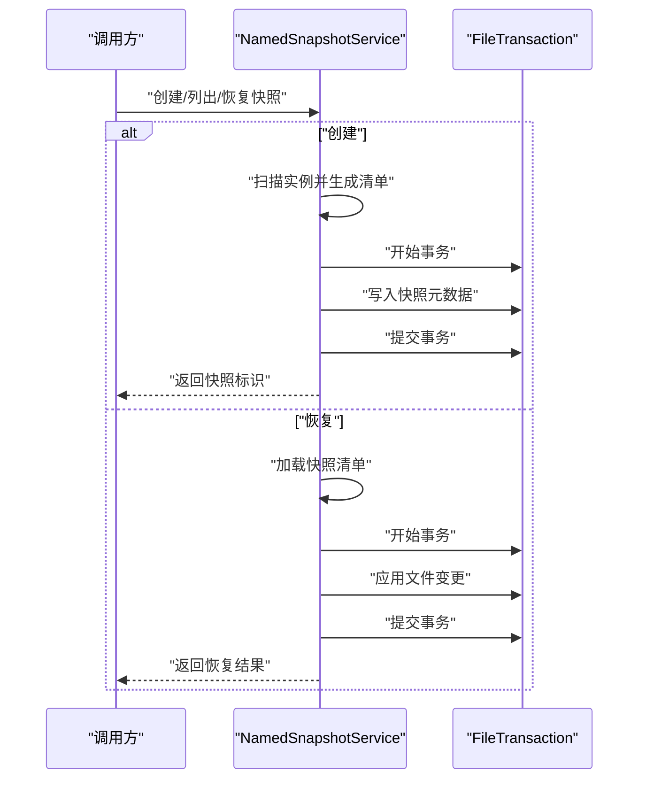
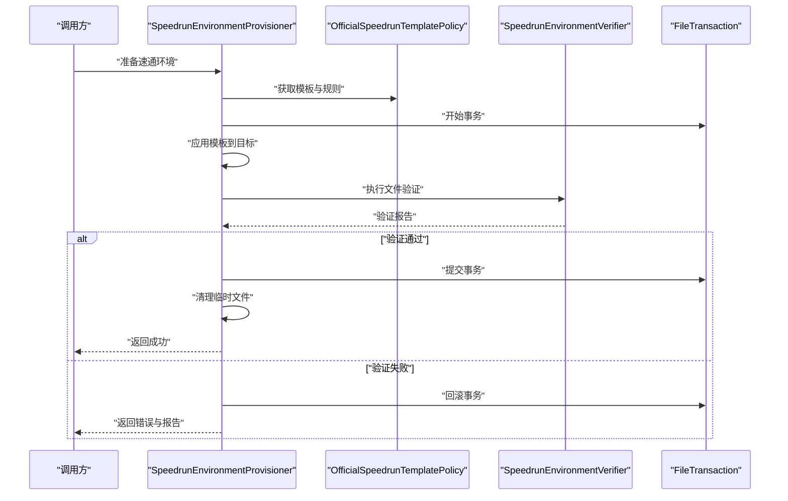
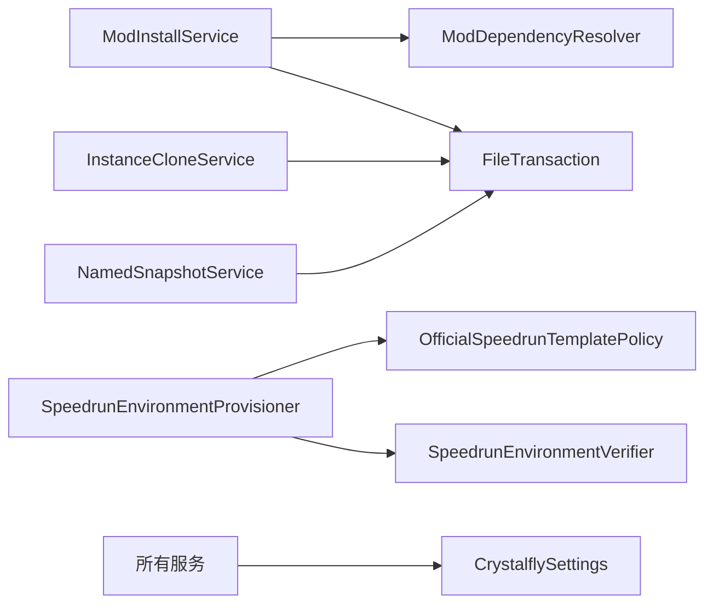

# 核心服务接口

<cite>
**本文引用的文件**   
- [ModInstallService.cs](file://src/Crystalfly.Core/Mods/ModInstallService.cs)
- [ModDependencyResolver.cs](file://src/Crystalfly.Core/Mods/ModDependencyResolver.cs)
- [ModInstallPlan.cs](file://src/Crystalfly.Core/Mods/ModInstallPlan.cs)
- [FileTransaction.cs](file://src/Crystalfly.Core/Transactions/FileTransaction.cs)
- [InstanceCloneService.cs](file://src/Crystalfly.Core/Instances/InstanceCloneService.cs)
- [NamedSnapshotService.cs](file://src/Crystalfly.Core/Snapshots/NamedSnapshotService.cs)
- [SpeedrunEnvironmentProvisioner.cs](file://src/Crystalfly.Core/Speedrun/SpeedrunEnvironmentProvisioner.cs)
- [OfficialSpeedrunTemplatePolicy.cs](file://src/Crystalfly.Core/Speedrun/OfficialSpeedrunTemplatePolicy.cs)
- [SpeedrunEnvironmentVerifier.cs](file://src/Crystalfly.Core/Speedrun/SpeedrunEnvironmentVerifier.cs)
- [CrystalflySettings.cs](file://src/Crystalfly.Core/Configuration/CrystalflySettings.cs)
</cite>

## 目录
1. [简介](#简介)
2. [项目结构](#项目结构)
3. [核心组件](#核心组件)
4. [架构总览](#架构总览)
5. [详细组件分析](#详细组件分析)
6. [依赖关系分析](#依赖关系分析)
7. [性能考虑](#性能考虑)
8. [故障排查指南](#故障排查指南)
9. [结论](#结论)
10. [附录](#附录)

## 简介
本文件为“核心业务服务”的 API 文档，聚焦以下四个服务的对外能力与内部实现要点：
- ModInstallService：模组安装接口，覆盖依赖解析、批量操作与事务回滚。
- InstanceCloneService：实例克隆方法，覆盖文件复制策略、路径映射与冲突解决。
- NamedSnapshotService：快照管理接口，覆盖快照创建、列表查询与恢复。
- SpeedrunEnvironmentProvisioner：速通环境准备接口，覆盖模板应用、文件验证与清理机制。

同时提供各服务的配置选项、异步操作模式与错误处理最佳实践，帮助使用者正确集成与排障。

## 项目结构
上述服务均位于 Crystalfly.Core 模块中，按功能域划分到 Mods、Instances、Snapshots、Speedrun 等子目录；事务与配置分别由 Transactions 与 Configuration 提供支撑。

[本节未直接分析具体源文件，故无“章节来源”]

## 核心组件
- ModInstallService：面向模组的安装编排器，负责依赖解析、计划生成、批量执行与失败回滚。
- InstanceCloneService：面向游戏实例的克隆器，负责安全复制、路径映射与冲突处理。
- NamedSnapshotService：面向实例状态的命名快照管理器，支持创建、列举与恢复。
- SpeedrunEnvironmentProvisioner：面向速通环境的预置器，基于模板进行文件准备、校验与清理。

这些组件通过统一的文件事务与配置抽象，保证一致性与可观测性。

**章节来源**
- [ModInstallService.cs](file://src/Crystalfly.Core/Mods/ModInstallService.cs)
- [InstanceCloneService.cs](file://src/Crystalfly.Core/Instances/InstanceCloneService.cs)
- [NamedSnapshotService.cs](file://src/Crystalfly.Core/Snapshots/NamedSnapshotService.cs)
- [SpeedrunEnvironmentProvisioner.cs](file://src/Crystalfly.Core/Speedrun/SpeedrunEnvironmentProvisioner.cs)

## 架构总览
下图展示四大核心服务与其关键依赖的关系，以及事务与配置的贯穿式作用。

**图表来源**
- [ModInstallService.cs](file://src/Crystalfly.Core/Mods/ModInstallService.cs)
- [ModDependencyResolver.cs](file://src/Crystalfly.Core/Mods/ModDependencyResolver.cs)
- [ModInstallPlan.cs](file://src/Crystalfly.Core/Mods/ModInstallPlan.cs)
- [FileTransaction.cs](file://src/Crystalfly.Core/Transactions/FileTransaction.cs)
- [InstanceCloneService.cs](file://src/Crystalfly.Core/Instances/InstanceCloneService.cs)
- [NamedSnapshotService.cs](file://src/Crystalfly.Core/Snapshots/NamedSnapshotService.cs)
- [SpeedrunEnvironmentProvisioner.cs](file://src/Crystalfly.Core/Speedrun/SpeedrunEnvironmentProvisioner.cs)
- [OfficialSpeedrunTemplatePolicy.cs](file://src/Crystalfly.Core/Speedrun/OfficialSpeedrunTemplatePolicy.cs)
- [SpeedrunEnvironmentVerifier.cs](file://src/Crystalfly.Core/Speedrun/SpeedrunEnvironmentVerifier.cs)
- [CrystalflySettings.cs](file://src/Crystalfly.Core/Configuration/CrystalflySettings.cs)

## 详细组件分析

### ModInstallService（模组安装服务）
- 职责边界
  - 接收安装请求，调用依赖解析器构建依赖图并生成安装计划。
  - 在事务上下文中批量执行文件写入、注册与元数据更新。
  - 任一阶段失败时触发回滚，确保文件系统与状态一致性。
- 关键流程
  - 依赖解析：对输入模组集合进行版本/平台兼容性检查与拓扑排序。
  - 计划生成：将依赖顺序转换为可执行的步骤序列，包含目标路径映射。
  - 批量执行：在事务内依次执行步骤，记录日志与进度。
  - 事务回滚：异常或中断时，按逆序撤销已变更的文件与元数据。
- 异步模式
  - 建议以异步方式暴露安装入口，支持取消令牌与进度回调。
  - 长耗时任务（如下载、解压）应分片上报进度，避免 UI 阻塞。
- 错误处理
  - 区分可重试错误（网络抖动）与不可重试错误（权限不足）。
  - 回滚后需清理中间产物，防止脏状态残留。
- 配置选项
  - 最大并发度、重试次数、超时时间、回滚深度等可通过配置注入。

**图表来源**
- [ModInstallService.cs](file://src/Crystalfly.Core/Mods/ModInstallService.cs)
- [ModDependencyResolver.cs](file://src/Crystalfly.Core/Mods/ModDependencyResolver.cs)
- [ModInstallPlan.cs](file://src/Crystalfly.Core/Mods/ModInstallPlan.cs)
- [FileTransaction.cs](file://src/Crystalfly.Core/Transactions/FileTransaction.cs)

**章节来源**
- [ModInstallService.cs](file://src/Crystalfly.Core/Mods/ModInstallService.cs)
- [ModDependencyResolver.cs](file://src/Crystalfly.Core/Mods/ModDependencyResolver.cs)
- [ModInstallPlan.cs](file://src/Crystalfly.Core/Mods/ModInstallPlan.cs)
- [FileTransaction.cs](file://src/Crystalfly.Core/Transactions/FileTransaction.cs)

### InstanceCloneService（实例克隆服务）
- 职责边界
  - 将源实例完整复制到目标位置，保持目录结构与文件一致性。
  - 支持路径映射规则，允许在克隆过程中调整部分路径。
  - 冲突解决策略包括跳过、覆盖、重命名或提示用户选择。
- 复制策略
  - 增量对比：仅复制差异文件以提升效率。
  - 大文件优化：分块复制与校验和比对，确保完整性。
  - 符号链接与硬链接：根据平台特性决定是否保留或展开。
- 路径映射
  - 基于规则表进行前缀替换、文件名重写与选择性忽略。
  - 映射过程需在事务外完成，以避免误写。
- 冲突解决
  - 默认策略：遇到同名文件时优先保留目标侧已有版本，并提供可选覆盖。
  - 可插拔策略：允许扩展自定义冲突处理器。
- 异步与回滚
  - 长耗时复制采用异步流式处理，支持取消。
  - 若中途失败，尽量回滚已复制的部分文件或标记不一致状态。

**图表来源**
- [InstanceCloneService.cs](file://src/Crystalfly.Core/Instances/InstanceCloneService.cs)

**章节来源**
- [InstanceCloneService.cs](file://src/Crystalfly.Core/Instances/InstanceCloneService.cs)

### NamedSnapshotService（命名快照服务）
- 职责边界
  - 为指定实例创建命名快照，保存当前文件状态与元数据。
  - 支持列出所有快照及其基本信息。
  - 支持从指定快照恢复到目标实例，覆盖或合并策略可配置。
- 快照创建
  - 扫描实例目录，记录文件清单与哈希摘要。
  - 将快照元数据持久化，便于后续恢复与审计。
- 列表查询
  - 按名称、时间范围或标签过滤。
  - 返回分页结果，避免一次性加载过多条目。
- 恢复操作
  - 将快照中的文件应用到目标实例，必要时先备份当前状态。
  - 恢复过程在事务中进行，失败则自动回滚。
- 异步与并发
  - 创建与恢复均为 I/O 密集型，建议异步执行。
  - 同一实例的快照操作串行化，避免竞态。

**图表来源**
- [NamedSnapshotService.cs](file://src/Crystalfly.Core/Snapshots/NamedSnapshotService.cs)
- [FileTransaction.cs](file://src/Crystalfly.Core/Transactions/FileTransaction.cs)

**章节来源**
- [NamedSnapshotService.cs](file://src/Crystalfly.Core/Snapshots/NamedSnapshotService.cs)

### SpeedrunEnvironmentProvisioner（速通环境准备服务）
- 职责边界
  - 依据官方模板策略，为目标实例准备速通所需的环境与文件。
  - 提供文件验证能力，确保环境符合速通规则。
  - 支持清理临时文件与中间产物，保持目标环境整洁。
- 模板应用
  - 基于模板清单与白名单规则，选择性复制/替换文件。
  - 支持变量替换与条件分支，适配不同游戏版本。
- 文件验证
  - 使用验证器对关键文件进行完整性与合规性检查。
  - 生成验证报告，供上层决策是否继续或回退。
- 清理机制
  - 清理下载缓存、解压临时目录与无效软链接。
  - 清理失败不影响主流程，但需记录告警。
- 异步与容错
  - 模板应用与验证可并行执行，提升整体吞吐。
  - 任何阶段失败应尽可能回滚已变更内容，保证环境一致性。

**图表来源**
- [SpeedrunEnvironmentProvisioner.cs](file://src/Crystalfly.Core/Speedrun/SpeedrunEnvironmentProvisioner.cs)
- [OfficialSpeedrunTemplatePolicy.cs](file://src/Crystalfly.Core/Speedrun/OfficialSpeedrunTemplatePolicy.cs)
- [SpeedrunEnvironmentVerifier.cs](file://src/Crystalfly.Core/Speedrun/SpeedrunEnvironmentVerifier.cs)
- [FileTransaction.cs](file://src/Crystalfly.Core/Transactions/FileTransaction.cs)

**章节来源**
- [SpeedrunEnvironmentProvisioner.cs](file://src/Crystalfly.Core/Speedrun/SpeedrunEnvironmentProvisioner.cs)
- [OfficialSpeedrunTemplatePolicy.cs](file://src/Crystalfly.Core/Speedrun/OfficialSpeedrunTemplatePolicy.cs)
- [SpeedrunEnvironmentVerifier.cs](file://src/Crystalfly.Core/Speedrun/SpeedrunEnvironmentVerifier.cs)

## 依赖关系分析
- 组件耦合
  - ModInstallService 强依赖 ModDependencyResolver 与 FileTransaction，弱依赖 CrystalflySettings。
  - InstanceCloneService 与 NamedSnapshotService 均依赖 FileTransaction 保障原子性。
  - SpeedrunEnvironmentProvisioner 依赖模板策略与验证器，形成“策略+验证”的组合。
- 外部依赖
  - 文件系统 I/O、磁盘空间与权限模型直接影响各服务行为。
  - 配置项集中管理，便于在不同运行环境中切换策略。
- 循环依赖
  - 当前设计无循环依赖，服务间通过接口与数据对象解耦。

**图表来源**
- [ModInstallService.cs](file://src/Crystalfly.Core/Mods/ModInstallService.cs)
- [ModDependencyResolver.cs](file://src/Crystalfly.Core/Mods/ModDependencyResolver.cs)
- [FileTransaction.cs](file://src/Crystalfly.Core/Transactions/FileTransaction.cs)
- [InstanceCloneService.cs](file://src/Crystalfly.Core/Instances/InstanceCloneService.cs)
- [NamedSnapshotService.cs](file://src/Crystalfly.Core/Snapshots/NamedSnapshotService.cs)
- [SpeedrunEnvironmentProvisioner.cs](file://src/Crystalfly.Core/Speedrun/SpeedrunEnvironmentProvisioner.cs)
- [OfficialSpeedrunTemplatePolicy.cs](file://src/Crystalfly.Core/Speedrun/OfficialSpeedrunTemplatePolicy.cs)
- [SpeedrunEnvironmentVerifier.cs](file://src/Crystalfly.Core/Speedrun/SpeedrunEnvironmentVerifier.cs)
- [CrystalflySettings.cs](file://src/Crystalfly.Core/Configuration/CrystalflySettings.cs)

**章节来源**
- [ModInstallService.cs](file://src/Crystalfly.Core/Mods/ModInstallService.cs)
- [InstanceCloneService.cs](file://src/Crystalfly.Core/Instances/InstanceCloneService.cs)
- [NamedSnapshotService.cs](file://src/Crystalfly.Core/Snapshots/NamedSnapshotService.cs)
- [SpeedrunEnvironmentProvisioner.cs](file://src/Crystalfly.Core/Speedrun/SpeedrunEnvironmentProvisioner.cs)
- [CrystalflySettings.cs](file://src/Crystalfly.Core/Configuration/CrystalflySettings.cs)

## 性能考虑
- 批量与并行
  - 模组安装与实例克隆应限制并发度，避免磁盘争用。
  - 速通环境准备可对独立文件组并行处理，但需保证最终一致性。
- I/O 优化
  - 使用流式复制与校验，减少内存占用。
  - 利用差异对比减少不必要的数据移动。
- 事务粒度
  - 合理划分事务边界，既保证一致性又避免长时间持有锁。
- 资源回收
  - 及时释放临时文件与句柄，避免泄漏。

[本节提供通用指导，不直接分析具体文件，故无“章节来源”]

## 故障排查指南
- 常见错误类型
  - 权限不足：检查目标路径访问控制与用户权限。
  - 磁盘空间不足：在执行前评估剩余空间并给出明确提示。
  - 依赖冲突：查看依赖解析报告，定位版本不兼容项。
  - 验证失败：对照速通验证报告，逐项修复违规文件。
- 回滚与恢复
  - 确认事务是否正确提交或回滚，检查中间状态。
  - 对于快照恢复失败，尝试先创建新快照再重试。
- 日志与诊断
  - 开启详细日志，记录关键步骤与异常堆栈。
  - 导出依赖图、安装计划与验证报告用于离线分析。

**章节来源**
- [FileTransaction.cs](file://src/Crystalfly.Core/Transactions/FileTransaction.cs)
- [SpeedrunEnvironmentVerifier.cs](file://src/Crystalfly.Core/Speedrun/SpeedrunEnvironmentVerifier.cs)

## 结论
四大核心服务围绕“一致性、可观测、可扩展”的目标设计：
- ModInstallService 通过依赖解析与事务回滚保障安装可靠性。
- InstanceCloneService 以灵活的复制策略与冲突解决提升克隆体验。
- NamedSnapshotService 提供稳定的快照生命周期管理能力。
- SpeedrunEnvironmentProvisioner 结合模板与验证，确保速通环境合规。

配合统一配置与异步模式，可在复杂场景下获得稳定且高效的运行表现。

[本节为总结性内容，不直接分析具体文件，故无“章节来源”]

## 附录
- 配置参考
  - 全局路径、并发度、超时、重试策略等均可通过 CrystalflySettings 注入。
- 最佳实践
  - 始终在事务中执行文件变更，失败即回滚。
  - 对长耗时操作提供取消令牌与进度回调。
  - 对关键路径增加幂等性保护，避免重复执行导致的状态漂移。

**章节来源**
- [CrystalflySettings.cs](file://src/Crystalfly.Core/Configuration/CrystalflySettings.cs)