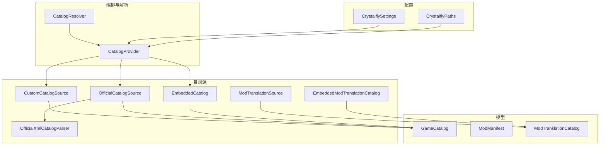
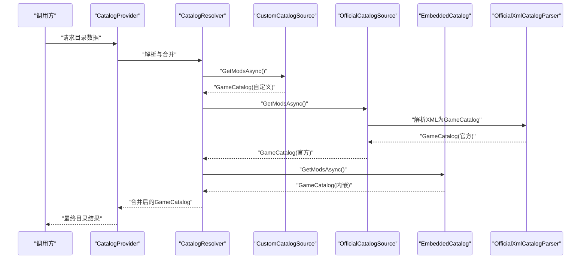
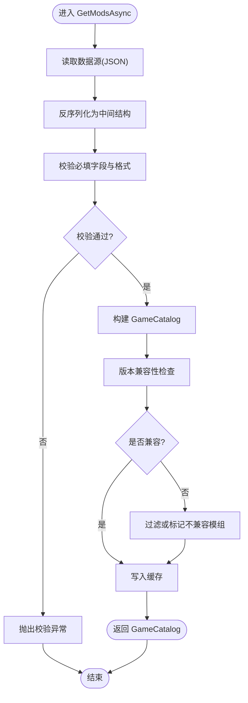
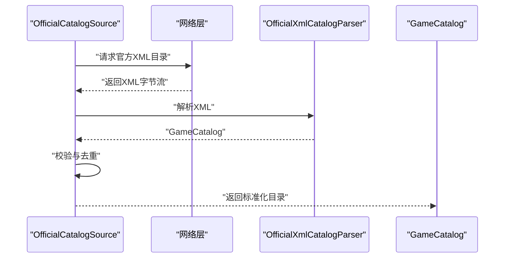
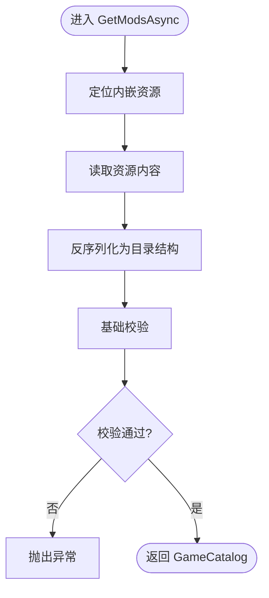
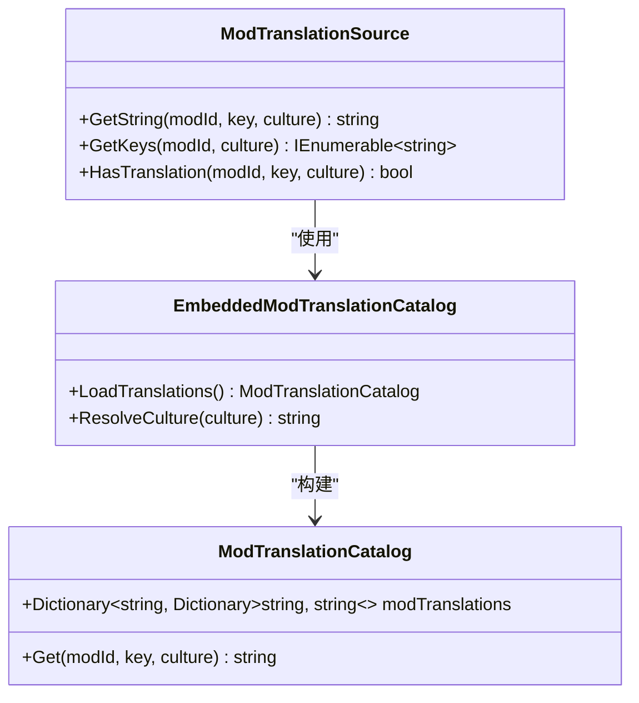
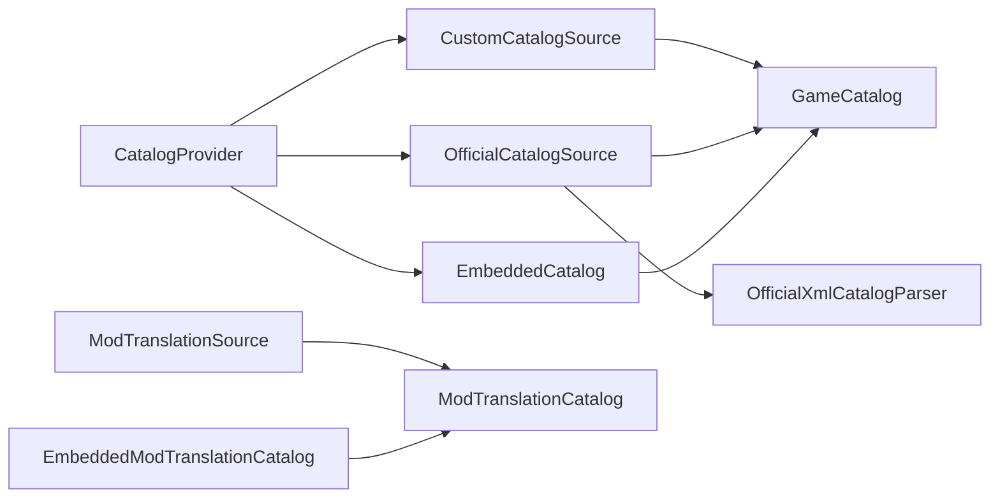

# 目录源接口

<cite>
**本文引用的文件**   
- [CustomCatalogSource.cs](file://src/Crystalfly.Core/Catalog/CustomCatalogSource.cs)
- [OfficialCatalogSource.cs](file://src/Crystalfly.Core/Catalog/OfficialCatalogSource.cs)
- [EmbeddedCatalog.cs](file://src/Crystalfly.Core/Catalog/EmbeddedCatalog.cs)
- [ModTranslationSource.cs](file://src/Crystalfly.Core/Catalog/ModTranslationSource.cs)
- [EmbeddedModTranslationCatalog.cs](file://src/Crystalfly.Core/Catalog/EmbeddedModTranslationCatalog.cs)
- [OfficialXmlCatalogParser.cs](file://src/Crystalfly.Core/Catalog/OfficialXmlCatalogParser.cs)
- [CatalogProvider.cs](file://src/Crystalfly.Core/Catalog/CatalogProvider.cs)
- [CatalogResolver.cs](file://src/Crystalfly.Core/Catalog/CatalogResolver.cs)
- [GameCatalog.cs](file://src/Crystalfly.Core/Models/GameCatalog.cs)
- [ModManifest.cs](file://src/Crystalfly.Core/Models/ModManifest.cs)
- [ModTranslationCatalog.cs](file://src/Crystalfly.Core/Models/ModTranslationCatalog.cs)
- [CrystalflySettings.cs](file://src/Crystalfly.Core/Configuration/CrystalflySettings.cs)
- [CrystalflyPaths.cs](file://src/Crystalfly.Core/Configuration/CrystalflyPaths.cs)
- [CustomCatalogSourceTests.cs](file://tests/Crystalfly.Core.Tests/Catalog/CustomCatalogSourceTests.cs)
- [OfficialCatalogSourceTests.cs](file://tests/Crystalfly.Core.Tests/Catalog/OfficialCatalogSourceTests.cs)
- [EmbeddedCatalogTests.cs](file://tests/Crystalfly.Core.Tests/Catalog/EmbeddedCatalogTests.cs)
- [ModTranslationSourceTests.cs](file://tests/Crystalfly.Core.Tests/Catalog/ModTranslationSourceTests.cs)
</cite>

## 目录
1. [简介](#简介)
2. [项目结构](#项目结构)
3. [核心组件](#核心组件)
4. [架构总览](#架构总览)
5. [详细组件分析](#详细组件分析)
6. [依赖关系分析](#依赖关系分析)
7. [性能考虑](#性能考虑)
8. [故障排查指南](#故障排查指南)
9. [结论](#结论)
10. [附录](#附录)

## 简介
本文件面向模组目录源系统，聚焦以下目标：
- 定义并说明 CustomCatalogSource 接口的实现规范，包括 GetModsAsync 方法的数据格式、版本兼容性检查与元数据处理。
- 解析 OfficialCatalogSource 的官方目录解析逻辑。
- 说明 EmbeddedCatalog 的内置资源加载机制。
- 记录 ModTranslationSource 的多语言支持接口，涵盖翻译键值映射和本地化字符串获取。
- 提供自定义目录源的扩展开发指南，包含数据源注册、缓存策略与错误处理模式。

## 项目结构
目录源相关代码位于 Crystalfly.Core/Catalog 下，配套模型在 Models 中，配置与路径在 Configuration 中，测试用例在 tests/Crystalfly.Core.Tests/Catalog 中。

图表来源
- [CustomCatalogSource.cs:1-200](file://src/Crystalfly.Core/Catalog/CustomCatalogSource.cs#L1-L200)
- [OfficialCatalogSource.cs:1-200](file://src/Crystalfly.Core/Catalog/OfficialCatalogSource.cs#L1-L200)
- [EmbeddedCatalog.cs:1-200](file://src/Crystalfly.Core/Catalog/EmbeddedCatalog.cs#L1-L200)
- [ModTranslationSource.cs:1-200](file://src/Crystalfly.Core/Catalog/ModTranslationSource.cs#L1-L200)
- [EmbeddedModTranslationCatalog.cs:1-200](file://src/Crystalfly.Core/Catalog/EmbeddedModTranslationCatalog.cs#L1-L200)
- [OfficialXmlCatalogParser.cs:1-200](file://src/Crystalfly.Core/Catalog/OfficialXmlCatalogParser.cs#L1-L200)
- [CatalogProvider.cs:1-200](file://src/Crystalfly.Core/Catalog/CatalogProvider.cs#L1-L200)
- [CatalogResolver.cs:1-200](file://src/Crystalfly.Core/Catalog/CatalogResolver.cs#L1-L200)
- [GameCatalog.cs:1-200](file://src/Crystalfly.Core/Models/GameCatalog.cs#L1-L200)
- [ModManifest.cs:1-200](file://src/Crystalfly.Core/Models/ModManifest.cs#L1-L200)
- [ModTranslationCatalog.cs:1-200](file://src/Crystalfly.Core/Models/ModTranslationCatalog.cs#L1-L200)
- [CrystalflySettings.cs:1-200](file://src/Crystalfly.Core/Configuration/CrystalflySettings.cs#L1-L200)
- [CrystalflyPaths.cs:1-200](file://src/Crystalfly.Core/Configuration/CrystalflyPaths.cs#L1-L200)

章节来源
- [CustomCatalogSource.cs:1-200](file://src/Crystalfly.Core/Catalog/CustomCatalogSource.cs#L1-L200)
- [OfficialCatalogSource.cs:1-200](file://src/Crystalfly.Core/Catalog/OfficialCatalogSource.cs#L1-L200)
- [EmbeddedCatalog.cs:1-200](file://src/Crystalfly.Core/Catalog/EmbeddedCatalog.cs#L1-L200)
- [ModTranslationSource.cs:1-200](file://src/Crystalfly.Core/Catalog/ModTranslationSource.cs#L1-L200)
- [EmbeddedModTranslationCatalog.cs:1-200](file://src/Crystalfly.Core/Catalog/EmbeddedModTranslationCatalog.cs#L1-L200)
- [OfficialXmlCatalogParser.cs:1-200](file://src/Crystalfly.Core/Catalog/OfficialXmlCatalogParser.cs#L1-L200)
- [CatalogProvider.cs:1-200](file://src/Crystalfly.Core/Catalog/CatalogProvider.cs#L1-L200)
- [CatalogResolver.cs:1-200](file://src/Crystalfly.Core/Catalog/CatalogResolver.cs#L1-L200)
- [GameCatalog.cs:1-200](file://src/Crystalfly.Core/Models/GameCatalog.cs#L1-L200)
- [ModManifest.cs:1-200](file://src/Crystalfly.Core/Models/ModManifest.cs#L1-L200)
- [ModTranslationCatalog.cs:1-200](file://src/Crystalfly.Core/Models/ModTranslationCatalog.cs#L1-L200)
- [CrystalflySettings.cs:1-200](file://src/Crystalfly.Core/Configuration/CrystalflySettings.cs#L1-L200)
- [CrystalflyPaths.cs:1-200](file://src/Crystalfly.Core/Configuration/CrystalflyPaths.cs#L1-L200)

## 核心组件
- CustomCatalogSource：用于加载自定义目录源（如本地 JSON），对外暴露异步获取模组列表的方法，要求返回符合 GameCatalog 结构的模组集合，并进行版本兼容性与元数据校验。
- OfficialCatalogSource：负责从官方渠道拉取或解析 XML 目录，内部使用 OfficialXmlCatalogParser 将 XML 转换为 GameCatalog。
- EmbeddedCatalog：从程序集内嵌资源读取预置目录数据，构建 GameCatalog，适用于离线或快速启动场景。
- ModTranslationSource：提供多语言翻译查询能力，基于 ModTranslationCatalog 进行键值映射与本地化字符串检索；EmbeddedModTranslationCatalog 作为其默认实现，从内嵌资源加载翻译包。
- CatalogProvider/CatalogResolver：组合多个目录源，统一提供目录访问与解析服务。

章节来源
- [CustomCatalogSource.cs:1-200](file://src/Crystalfly.Core/Catalog/CustomCatalogSource.cs#L1-L200)
- [OfficialCatalogSource.cs:1-200](file://src/Crystalfly.Core/Catalog/OfficialCatalogSource.cs#L1-L200)
- [EmbeddedCatalog.cs:1-200](file://src/Crystalfly.Core/Catalog/EmbeddedCatalog.cs#L1-L200)
- [ModTranslationSource.cs:1-200](file://src/Crystalfly.Core/Catalog/ModTranslationSource.cs#L1-L200)
- [EmbeddedModTranslationCatalog.cs:1-200](file://src/Crystalfly.Core/Catalog/EmbeddedModTranslationCatalog.cs#L1-L200)
- [OfficialXmlCatalogParser.cs:1-200](file://src/Crystalfly.Core/Catalog/OfficialXmlCatalogParser.cs#L1-L200)
- [CatalogProvider.cs:1-200](file://src/Crystalfly.Core/Catalog/CatalogProvider.cs#L1-L200)
- [CatalogResolver.cs:1-200](file://src/Crystalfly.Core/Catalog/CatalogResolver.cs#L1-L200)

## 架构总览
下图展示了目录源的整体协作方式：上层通过 CatalogProvider 聚合多个源，CatalogResolver 负责选择与合并；各源分别实现不同的数据加载策略（网络、XML、内嵌资源等）。

图表来源
- [CatalogProvider.cs:1-200](file://src/Crystalfly.Core/Catalog/CatalogProvider.cs#L1-L200)
- [CatalogResolver.cs:1-200](file://src/Crystalfly.Core/Catalog/CatalogResolver.cs#L1-L200)
- [CustomCatalogSource.cs:1-200](file://src/Crystalfly.Core/Catalog/CustomCatalogSource.cs#L1-L200)
- [OfficialCatalogSource.cs:1-200](file://src/Crystalfly.Core/Catalog/OfficialCatalogSource.cs#L1-L200)
- [EmbeddedCatalog.cs:1-200](file://src/Crystalfly.Core/Catalog/EmbeddedCatalog.cs#L1-L200)
- [OfficialXmlCatalogParser.cs:1-200](file://src/Crystalfly.Core/Catalog/OfficialXmlCatalogParser.cs#L1-L200)

## 详细组件分析

### CustomCatalogSource 实现规范
- 职责
  - 从指定数据源（通常为本地 JSON）加载模组清单。
  - 将原始数据转换为 GameCatalog 结构。
  - 执行版本兼容性检查与元数据校验。
- GetModsAsync 数据格式要求
  - 输入：可序列化的目录数据（例如 JSON）。
  - 输出：GameCatalog 实例，包含模组列表及必要元信息。
  - 字段约束：模组标识、名称、版本、依赖、平台、下载链接等需满足 GameCatalog/ModManifest 的约定。
- 版本兼容性检查
  - 对比模组声明的目标游戏版本与当前运行环境版本。
  - 对不兼容的模组进行过滤或标记，避免安装失败。
- 元数据处理
  - 校验必填字段、枚举取值范围、URL 合法性等。
  - 对缺失或非法字段抛出明确异常，便于上层捕获与提示。
- 错误处理模式
  - 文件不存在/不可读：返回具体 IO 异常。
  - 解析失败：返回序列化/反序列化异常。
  - 校验失败：返回业务异常，附带问题字段与修复建议。
- 缓存策略建议
  - 对已解析的 GameCatalog 进行内存缓存，设置过期时间或失效事件。
  - 当底层数据变更时主动失效缓存。

图表来源
- [CustomCatalogSource.cs:1-200](file://src/Crystalfly.Core/Catalog/CustomCatalogSource.cs#L1-L200)
- [GameCatalog.cs:1-200](file://src/Crystalfly.Core/Models/GameCatalog.cs#L1-L200)
- [ModManifest.cs:1-200](file://src/Crystalfly.Core/Models/ModManifest.cs#L1-L200)

章节来源
- [CustomCatalogSource.cs:1-200](file://src/Crystalfly.Core/Catalog/CustomCatalogSource.cs#L1-L200)
- [CustomCatalogSourceTests.cs:1-200](file://tests/Crystalfly.Core.Tests/Catalog/CustomCatalogSourceTests.cs#L1-L200)
- [GameCatalog.cs:1-200](file://src/Crystalfly.Core/Models/GameCatalog.cs#L1-L200)
- [ModManifest.cs:1-200](file://src/Crystalfly.Core/Models/ModManifest.cs#L1-L200)

### OfficialCatalogSource 官方目录解析逻辑
- 职责
  - 从官方地址获取 XML 目录。
  - 使用 OfficialXmlCatalogParser 将 XML 转换为 GameCatalog。
  - 对解析结果进行基础校验与去重。
- 解析流程
  - 发起网络请求获取 XML。
  - 交由解析器生成 GameCatalog。
  - 执行字段完整性与版本范围校验。
- 错误处理
  - 网络异常：包装为明确的网络错误类型。
  - XML 格式错误：返回解析异常。
  - 数据不一致：返回业务异常并记录日志。

图表来源
- [OfficialCatalogSource.cs:1-200](file://src/Crystalfly.Core/Catalog/OfficialCatalogSource.cs#L1-L200)
- [OfficialXmlCatalogParser.cs:1-200](file://src/Crystalfly.Core/Catalog/OfficialXmlCatalogParser.cs#L1-L200)
- [GameCatalog.cs:1-200](file://src/Crystalfly.Core/Models/GameCatalog.cs#L1-L200)

章节来源
- [OfficialCatalogSource.cs:1-200](file://src/Crystalfly.Core/Catalog/OfficialCatalogSource.cs#L1-L200)
- [OfficialXmlCatalogParser.cs:1-200](file://src/Crystalfly.Core/Catalog/OfficialXmlCatalogParser.cs#L1-L200)
- [OfficialCatalogSourceTests.cs:1-200](file://tests/Crystalfly.Core.Tests/Catalog/OfficialCatalogSourceTests.cs#L1-L200)

### EmbeddedCatalog 内置资源加载机制
- 职责
  - 从程序集内嵌资源读取预置目录数据。
  - 直接构建 GameCatalog，无需网络访问。
- 加载流程
  - 定位内嵌资源路径。
  - 读取并反序列化为目录结构。
  - 执行基本校验后返回。
- 适用场景
  - 离线环境、快速启动、演示与测试。

图表来源
- [EmbeddedCatalog.cs:1-200](file://src/Crystalfly.Core/Catalog/EmbeddedCatalog.cs#L1-L200)
- [GameCatalog.cs:1-200](file://src/Crystalfly.Core/Models/GameCatalog.cs#L1-L200)

章节来源
- [EmbeddedCatalog.cs:1-200](file://src/Crystalfly.Core/Catalog/EmbeddedCatalog.cs#L1-L200)
- [EmbeddedCatalogTests.cs:1-200](file://tests/Crystalfly.Core.Tests/Catalog/EmbeddedCatalogTests.cs#L1-L200)

### ModTranslationSource 多语言支持与本地化
- 职责
  - 提供按模组与语言获取本地化字符串的能力。
  - 维护翻译键值映射，支持默认回退语言。
- 接口要点
  - 根据模组标识与键名获取对应语言的字符串。
  - 若目标语言缺失，回退到默认语言或返回空占位。
- 默认实现
  - EmbeddedModTranslationCatalog：从内嵌资源加载翻译包，构建 ModTranslationCatalog。
- 数据结构
  - ModTranslationCatalog：存储模组维度的翻译键值表。

图表来源
- [ModTranslationSource.cs:1-200](file://src/Crystalfly.Core/Catalog/ModTranslationSource.cs#L1-L200)
- [EmbeddedModTranslationCatalog.cs:1-200](file://src/Crystalfly.Core/Catalog/EmbeddedModTranslationCatalog.cs#L1-L200)
- [ModTranslationCatalog.cs:1-200](file://src/Crystalfly.Core/Models/ModTranslationCatalog.cs#L1-L200)

章节来源
- [ModTranslationSource.cs:1-200](file://src/Crystalfly.Core/Catalog/ModTranslationSource.cs#L1-L200)
- [EmbeddedModTranslationCatalog.cs:1-200](file://src/Crystalfly.Core/Catalog/EmbeddedModTranslationCatalog.cs#L1-L200)
- [ModTranslationCatalog.cs:1-200](file://src/Crystalfly.Core/Models/ModTranslationCatalog.cs#L1-L200)
- [ModTranslationSourceTests.cs:1-200](file://tests/Crystalfly.Core.Tests/Catalog/ModTranslationSourceTests.cs#L1-L200)

### 自定义目录源扩展开发指南
- 数据源注册
  - 在 CatalogProvider 中注册自定义源实例，确保其优先级与覆盖范围符合预期。
  - 参考现有源的实现风格，保持统一的异常与返回值约定。
- 缓存策略
  - 对解析结果进行短期内存缓存，避免重复 IO 与解析开销。
  - 提供显式失效接口，以便在检测到数据更新时刷新缓存。
- 错误处理模式
  - 区分网络、IO、解析、校验四类错误，返回具体异常类型。
  - 在异常消息中包含关键上下文（如源标识、文件路径、键名等），便于定位问题。
- 最佳实践
  - 严格遵循 GameCatalog/ModManifest 的字段约定。
  - 对可选字段提供合理默认值，避免上层出现空引用。
  - 单元测试覆盖正常路径、边界条件与异常分支。

章节来源
- [CatalogProvider.cs:1-200](file://src/Crystalfly.Core/Catalog/CatalogProvider.cs#L1-L200)
- [CustomCatalogSource.cs:1-200](file://src/Crystalfly.Core/Catalog/CustomCatalogSource.cs#L1-L200)
- [CustomCatalogSourceTests.cs:1-200](file://tests/Crystalfly.Core.Tests/Catalog/CustomCatalogSourceTests.cs#L1-L200)

## 依赖关系分析
- 组件耦合
  - CatalogProvider 聚合多个目录源，降低上层对具体实现的依赖。
  - OfficialCatalogSource 依赖 OfficialXmlCatalogParser，解耦 XML 解析细节。
  - EmbeddedCatalog 与 EmbeddedModTranslationCatalog 均依赖内嵌资源，适合离线场景。
- 外部依赖
  - 文件系统与程序集内嵌资源。
  - 网络请求（官方目录）。
- 循环依赖
  - 目录源之间无直接循环依赖，通过模型与提供者进行松耦合交互。

图表来源
- [CatalogProvider.cs:1-200](file://src/Crystalfly.Core/Catalog/CatalogProvider.cs#L1-L200)
- [CustomCatalogSource.cs:1-200](file://src/Crystalfly.Core/Catalog/CustomCatalogSource.cs#L1-L200)
- [OfficialCatalogSource.cs:1-200](file://src/Crystalfly.Core/Catalog/OfficialCatalogSource.cs#L1-L200)
- [EmbeddedCatalog.cs:1-200](file://src/Crystalfly.Core/Catalog/EmbeddedCatalog.cs#L1-L200)
- [OfficialXmlCatalogParser.cs:1-200](file://src/Crystalfly.Core/Catalog/OfficialXmlCatalogParser.cs#L1-L200)
- [GameCatalog.cs:1-200](file://src/Crystalfly.Core/Models/GameCatalog.cs#L1-L200)
- [ModTranslationSource.cs:1-200](file://src/Crystalfly.Core/Catalog/ModTranslationSource.cs#L1-L200)
- [EmbeddedModTranslationCatalog.cs:1-200](file://src/Crystalfly.Core/Catalog/EmbeddedModTranslationCatalog.cs#L1-L200)
- [ModTranslationCatalog.cs:1-200](file://src/Crystalfly.Core/Models/ModTranslationCatalog.cs#L1-L200)

章节来源
- [CatalogProvider.cs:1-200](file://src/Crystalfly.Core/Catalog/CatalogProvider.cs#L1-L200)
- [CatalogResolver.cs:1-200](file://src/Crystalfly.Core/Catalog/CatalogResolver.cs#L1-L200)
- [CustomCatalogSource.cs:1-200](file://src/Crystalfly.Core/Catalog/CustomCatalogSource.cs#L1-L200)
- [OfficialCatalogSource.cs:1-200](file://src/Crystalfly.Core/Catalog/OfficialCatalogSource.cs#L1-L200)
- [EmbeddedCatalog.cs:1-200](file://src/Crystalfly.Core/Catalog/EmbeddedCatalog.cs#L1-L200)
- [ModTranslationSource.cs:1-200](file://src/Crystalfly.Core/Catalog/ModTranslationSource.cs#L1-L200)
- [EmbeddedModTranslationCatalog.cs:1-200](file://src/Crystalfly.Core/Catalog/EmbeddedModTranslationCatalog.cs#L1-L200)
- [OfficialXmlCatalogParser.cs:1-200](file://src/Crystalfly.Core/Catalog/OfficialXmlCatalogParser.cs#L1-L200)
- [GameCatalog.cs:1-200](file://src/Crystalfly.Core/Models/GameCatalog.cs#L1-L200)
- [ModTranslationCatalog.cs:1-200](file://src/Crystalfly.Core/Models/ModTranslationCatalog.cs#L1-L200)

## 性能考虑
- 减少重复解析：对 JSON/XML 解析结果进行缓存，避免频繁 IO。
- 并行加载：多个目录源可并行初始化与加载，缩短冷启动时间。
- 增量更新：仅对变更的源进行重新解析与合并。
- 内存占用：控制 GameCatalog 与翻译表的体积，必要时分页或按需加载。

## 故障排查指南
- 常见问题
  - 自定义目录 JSON 字段缺失或类型错误：检查 GameCatalog/ModManifest 的字段约束。
  - 官方 XML 解析失败：确认网络可达与 XML 格式正确。
  - 内嵌资源未找到：核对资源命名与嵌入配置。
  - 翻译键缺失：确认 ModTranslationCatalog 包含目标语言条目。
- 定位步骤
  - 查看异常类型与消息，定位具体阶段（IO、解析、校验、网络）。
  - 启用调试日志，记录源标识、键名、版本号等上下文。
  - 使用最小复现数据集验证问题。

章节来源
- [CustomCatalogSource.cs:1-200](file://src/Crystalfly.Core/Catalog/CustomCatalogSource.cs#L1-L200)
- [OfficialCatalogSource.cs:1-200](file://src/Crystalfly.Core/Catalog/OfficialCatalogSource.cs#L1-L200)
- [EmbeddedCatalog.cs:1-200](file://src/Crystalfly.Core/Catalog/EmbeddedCatalog.cs#L1-L200)
- [ModTranslationSource.cs:1-200](file://src/Crystalfly.Core/Catalog/ModTranslationSource.cs#L1-L200)

## 结论
目录源系统通过清晰的接口与分层设计，实现了多数据源的统一接入与解析。CustomCatalogSource 提供了灵活的自定义能力，OfficialCatalogSource 与 EmbeddedCatalog 覆盖了在线与离线场景，ModTranslationSource 完善了多语言体验。配合合理的缓存与错误处理策略，可在保证稳定性的同时提升性能与可维护性。

## 附录
- 配置项参考
  - CrystalflySettings：目录源开关、超时、重试次数等。
  - CrystalflyPaths：目录源数据文件路径、内嵌资源命名约定。

章节来源
- [CrystalflySettings.cs:1-200](file://src/Crystalfly.Core/Configuration/CrystalflySettings.cs#L1-L200)
- [CrystalflyPaths.cs:1-200](file://src/Crystalfly.Core/Configuration/CrystalflyPaths.cs#L1-L200)