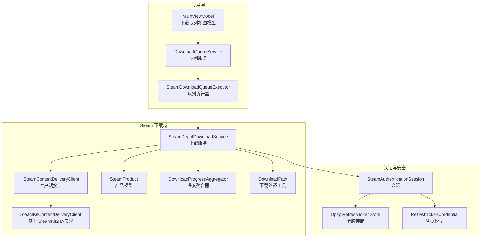
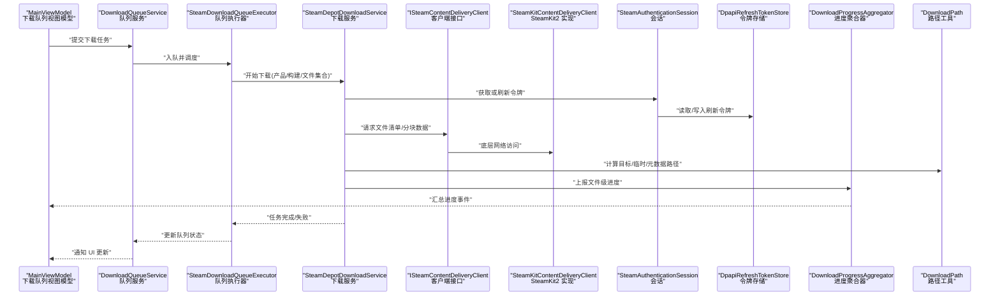
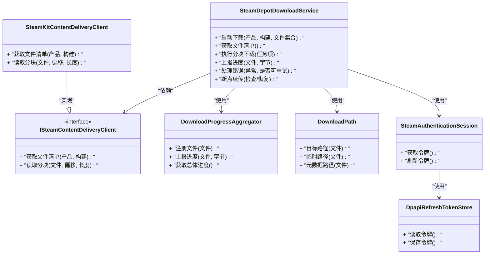
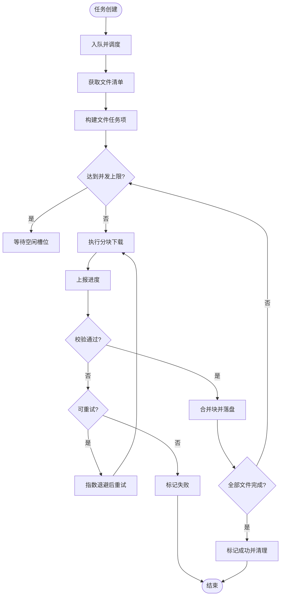
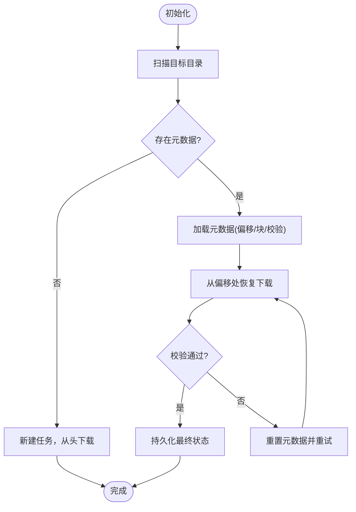
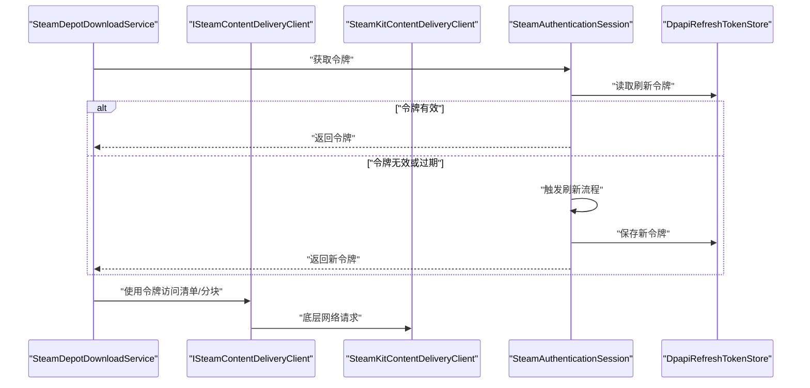
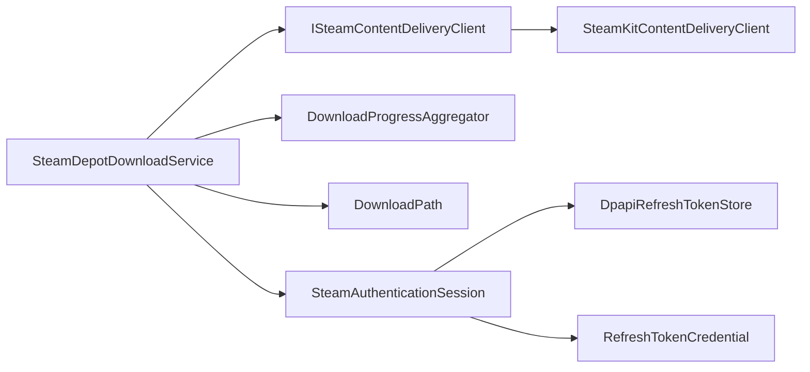

# Depot 下载服务

<cite>
**本文引用的文件**   
- [SteamDepotDownloadService.cs](file://src/Crystalfly.Steam/Downloads/SteamDepotDownloadService.cs)
- [ISteamContentDeliveryClient.cs](file://src/Crystalfly.Steam/Downloads/ISteamContentDeliveryClient.cs)
- [SteamKitContentDeliveryClient.cs](file://src/Crystalfly.Steam/Downloads/SteamKitContentDeliveryClient.cs)
- [SteamProduct.cs](file://src/Crystalfly.Steam/Downloads/SteamProduct.cs)
- [DownloadProgressAggregator.cs](file://src/Crystalfly.Steam/Downloads/DownloadProgressAggregator.cs)
- [SteamDownloadProgress.cs](file://src/Crystalfly.Steam/Downloads/SteamDownloadProgress.cs)
- [DownloadPath.cs](file://src/Crystalfly.Steam/Downloads/DownloadPath.cs)
- [SteamAuthenticationSession.cs](file://src/Crystalfly.Steam/Authentication/SteamAuthenticationSession.cs)
- [DpapiRefreshTokenStore.cs](file://src/Crystalfly.Steam/Security/DpapiRefreshTokenStore.cs)
- [RefreshTokenCredential.cs](file://src/Crystalfly.Steam/Security/RefreshTokenCredential.cs)
- [SteamDownloadQueueExecutor.cs](file://src/Crystalfly.App/Downloads/SteamDownloadQueueExecutor.cs)
- [DownloadQueueService.cs](file://src/Crystalfly.App/Downloads/DownloadQueueService.cs)
- [MainViewModel.DownloadQueue.cs](file://src/Crystalfly.App/ViewModels/MainViewModel.DownloadQueue.cs)
- [SteamDepotDownloadServiceTests.cs](file://tests/Crystalfly.Steam.Tests/Downloads/SteamDepotDownloadServiceTests.cs)
</cite>

## 目录
1. [简介](#简介)
2. [项目结构](#项目结构)
3. [核心组件](#核心组件)
4. [架构总览](#架构总览)
5. [详细组件分析](#详细组件分析)
6. [依赖关系分析](#依赖关系分析)
7. [性能考虑](#性能考虑)
8. [故障排查指南](#故障排查指南)
9. [结论](#结论)
10. [附录](#附录)

## 简介
本文件围绕 Depot 下载服务展开，重点解析 SteamDepotDownloadService 的核心实现与使用方式。内容涵盖：
- Depot 文件列表获取流程
- 分块下载策略与并发控制机制
- 下载任务生命周期管理（创建、调度、执行、完成）
- 断点续传的实现原理（状态持久化与恢复）
- 初始化、参数配置与事件处理示例路径
- 错误处理策略、重试逻辑与性能优化技巧
- 与 SteamKit2 的集成方式及认证令牌管理

## 项目结构
与 Depot 下载相关的代码主要分布在以下模块：
- Crystalfly.Steam/Downloads：下载服务、进度聚合、客户端抽象与实现、产品模型、下载路径等
- Crystalfly.Steam/Authentication：Steam 会话与认证回调
- Crystalfly.Steam/Security：刷新令牌存储与凭据模型
- Crystalfly.App/Downloads：队列执行器与服务，负责将下载任务编排到后台执行
- Crystalfly.App/ViewModels：UI 层对下载队列的绑定与展示
- tests/Crystalfly.Steam.Tests/Downloads：针对下载服务的单元测试

图表来源
- [SteamDepotDownloadService.cs](file://src/Crystalfly.Steam/Downloads/SteamDepotDownloadService.cs)
- [ISteamContentDeliveryClient.cs](file://src/Crystalfly.Steam/Downloads/ISteamContentDeliveryClient.cs)
- [SteamKitContentDeliveryClient.cs](file://src/Crystalfly.Steam/Downloads/SteamKitContentDeliveryClient.cs)
- [SteamProduct.cs](file://src/Crystalfly.Steam/Downloads/SteamProduct.cs)
- [DownloadProgressAggregator.cs](file://src/Crystalfly.Steam/Downloads/DownloadProgressAggregator.cs)
- [DownloadPath.cs](file://src/Crystalfly.Steam/Downloads/DownloadPath.cs)
- [SteamAuthenticationSession.cs](file://src/Crystalfly.Steam/Authentication/SteamAuthenticationSession.cs)
- [DpapiRefreshTokenStore.cs](file://src/Crystalfly.Steam/Security/DpapiRefreshTokenStore.cs)
- [RefreshTokenCredential.cs](file://src/Crystalfly.Steam/Security/RefreshTokenCredential.cs)
- [SteamDownloadQueueExecutor.cs](file://src/Crystalfly.App/Downloads/SteamDownloadQueueExecutor.cs)
- [DownloadQueueService.cs](file://src/Crystalfly.App/Downloads/DownloadQueueService.cs)
- [MainViewModel.DownloadQueue.cs](file://src/Crystalfly.App/ViewModels/MainViewModel.DownloadQueue.cs)

章节来源
- [SteamDepotDownloadService.cs](file://src/Crystalfly.Steam/Downloads/SteamDepotDownloadService.cs)
- [ISteamContentDeliveryClient.cs](file://src/Crystalfly.Steam/Downloads/ISteamContentDeliveryClient.cs)
- [SteamKitContentDeliveryClient.cs](file://src/Crystalfly.Steam/Downloads/SteamKitContentDeliveryClient.cs)
- [SteamProduct.cs](file://src/Crystalfly.Steam/Downloads/SteamProduct.cs)
- [DownloadProgressAggregator.cs](file://src/Crystalfly.Steam/Downloads/DownloadProgressAggregator.cs)
- [DownloadPath.cs](file://src/Crystalfly.Steam/Downloads/DownloadPath.cs)
- [SteamAuthenticationSession.cs](file://src/Crystalfly.Steam/Authentication/SteamAuthenticationSession.cs)
- [DpapiRefreshTokenStore.cs](file://src/Crystalfly.Steam/Security/DpapiRefreshTokenStore.cs)
- [RefreshTokenCredential.cs](file://src/Crystalfly.Steam/Security/RefreshTokenCredential.cs)
- [SteamDownloadQueueExecutor.cs](file://src/Crystalfly.App/Downloads/SteamDownloadQueueExecutor.cs)
- [DownloadQueueService.cs](file://src/Crystalfly.App/Downloads/DownloadQueueService.cs)
- [MainViewModel.DownloadQueue.cs](file://src/Crystalfly.App/ViewModels/MainViewModel.DownloadQueue.cs)

## 核心组件
- SteamDepotDownloadService：提供面向上层的 Depot 下载能力，封装了文件清单获取、分块下载、并发控制、进度上报、错误与重试、断点续传等关键逻辑。
- ISteamContentDeliveryClient / SteamKitContentDeliveryClient：定义并实现与 Steam 内容分发网络的交互，负责实际的数据流读取与校验。
- DownloadProgressAggregator：汇总多个文件的下载进度，向上层暴露统一的进度事件。
- DownloadPath：计算目标文件路径、临时文件路径、断点续传元数据路径等。
- SteamProduct：描述产品与构建信息，用于定位 Depot 与文件清单。
- SteamAuthenticationSession / DpapiRefreshTokenStore / RefreshTokenCredential：管理与 Steam 的会话与刷新令牌，确保下载时具备有效凭证。
- SteamDownloadQueueExecutor / DownloadQueueService / MainViewModel.DownloadQueue：在应用层组织下载任务、驱动执行、与 UI 同步。

章节来源
- [SteamDepotDownloadService.cs](file://src/Crystalfly.Steam/Downloads/SteamDepotDownloadService.cs)
- [ISteamContentDeliveryClient.cs](file://src/Crystalfly.Steam/Downloads/ISteamContentDeliveryClient.cs)
- [SteamKitContentDeliveryClient.cs](file://src/Crystalfly.Steam/Downloads/SteamKitContentDeliveryClient.cs)
- [DownloadProgressAggregator.cs](file://src/Crystalfly.Steam/Downloads/DownloadProgressAggregator.cs)
- [DownloadPath.cs](file://src/Crystalfly.Steam/Downloads/DownloadPath.cs)
- [SteamProduct.cs](file://src/Crystalfly.Steam/Downloads/SteamProduct.cs)
- [SteamAuthenticationSession.cs](file://src/Crystalfly.Steam/Authentication/SteamAuthenticationSession.cs)
- [DpapiRefreshTokenStore.cs](file://src/Crystalfly.Steam/Security/DpapiRefreshTokenStore.cs)
- [RefreshTokenCredential.cs](file://src/Crystalfly.Steam/Security/RefreshTokenCredential.cs)
- [SteamDownloadQueueExecutor.cs](file://src/Crystalfly.App/Downloads/SteamDownloadQueueExecutor.cs)
- [DownloadQueueService.cs](file://src/Crystalfly.App/Downloads/DownloadQueueService.cs)
- [MainViewModel.DownloadQueue.cs](file://src/Crystalfly.App/ViewModels/MainViewModel.DownloadQueue.cs)

## 架构总览
下图展示了从应用层到 Steam 内容分发的完整调用链，以及进度、路径、认证等支撑组件的协作关系。

图表来源
- [SteamDepotDownloadService.cs](file://src/Crystalfly.Steam/Downloads/SteamDepotDownloadService.cs)
- [ISteamContentDeliveryClient.cs](file://src/Crystalfly.Steam/Downloads/ISteamContentDeliveryClient.cs)
- [SteamKitContentDeliveryClient.cs](file://src/Crystalfly.Steam/Downloads/SteamKitContentDeliveryClient.cs)
- [SteamAuthenticationSession.cs](file://src/Crystalfly.Steam/Authentication/SteamAuthenticationSession.cs)
- [DpapiRefreshTokenStore.cs](file://src/Crystalfly.Steam/Security/DpapiRefreshTokenStore.cs)
- [DownloadProgressAggregator.cs](file://src/Crystalfly.Steam/Downloads/DownloadProgressAggregator.cs)
- [DownloadPath.cs](file://src/Crystalfly.Steam/Downloads/DownloadPath.cs)
- [SteamDownloadQueueExecutor.cs](file://src/Crystalfly.App/Downloads/SteamDownloadQueueExecutor.cs)
- [DownloadQueueService.cs](file://src/Crystalfly.App/Downloads/DownloadQueueService.cs)
- [MainViewModel.DownloadQueue.cs](file://src/Crystalfly.App/ViewModels/MainViewModel.DownloadQueue.cs)

## 详细组件分析

### SteamDepotDownloadService 核心实现
- 职责边界
  - 对外暴露下载入口，接收产品/构建/文件集合等参数
  - 内部协调清单获取、分块下载、并发控制、进度聚合、错误与重试、断点续传
- 关键流程
  - 清单获取：通过客户端接口拉取 Depot 文件清单，过滤出需要下载的文件集
  - 分块下载：按文件大小与并发限制切分为若干块，逐块读取并写入目标文件
  - 并发控制：维护最大并发数与每文件并发度，避免资源争用
  - 进度上报：以文件为单位上报字节进度，由聚合器汇总为整体进度
  - 错误与重试：对可重试错误进行指数退避重试，不可重试错误直接失败
  - 断点续传：记录已下载的偏移量与校验结果，支持中断后恢复
- 典型方法（概念性说明）
  - 启动下载：根据产品/构建/文件集合创建任务上下文，进入调度循环
  - 获取清单：调用客户端接口获取文件清单，转换为内部任务项
  - 执行分块：按块大小与并发策略执行下载，合并块并校验完整性
  - 完成处理：清理临时文件、持久化状态、触发完成事件

图表来源
- [SteamDepotDownloadService.cs](file://src/Crystalfly.Steam/Downloads/SteamDepotDownloadService.cs)
- [ISteamContentDeliveryClient.cs](file://src/Crystalfly.Steam/Downloads/ISteamContentDeliveryClient.cs)
- [SteamKitContentDeliveryClient.cs](file://src/Crystalfly.Steam/Downloads/SteamKitContentDeliveryClient.cs)
- [DownloadProgressAggregator.cs](file://src/Crystalfly.Steam/Downloads/DownloadProgressAggregator.cs)
- [DownloadPath.cs](file://src/Crystalfly.Steam/Downloads/DownloadPath.cs)
- [SteamAuthenticationSession.cs](file://src/Crystalfly.Steam/Authentication/SteamAuthenticationSession.cs)
- [DpapiRefreshTokenStore.cs](file://src/Crystalfly.Steam/Security/DpapiRefreshTokenStore.cs)

章节来源
- [SteamDepotDownloadService.cs](file://src/Crystalfly.Steam/Downloads/SteamDepotDownloadService.cs)
- [ISteamContentDeliveryClient.cs](file://src/Crystalfly.Steam/Downloads/ISteamContentDeliveryClient.cs)
- [SteamKitContentDeliveryClient.cs](file://src/Crystalfly.Steam/Downloads/SteamKitContentDeliveryClient.cs)
- [DownloadProgressAggregator.cs](file://src/Crystalfly.Steam/Downloads/DownloadProgressAggregator.cs)
- [DownloadPath.cs](file://src/Crystalfly.Steam/Downloads/DownloadPath.cs)
- [SteamAuthenticationSession.cs](file://src/Crystalfly.Steam/Authentication/SteamAuthenticationSession.cs)
- [DpapiRefreshTokenStore.cs](file://src/Crystalfly.Steam/Security/DpapiRefreshTokenStore.cs)

### 下载任务生命周期管理
- 任务创建
  - 上层通过队列服务提交下载任务，包含产品/构建/文件集合等参数
  - 队列执行器将任务入队并分配工作线程
- 任务执行
  - 下载服务获取清单，生成文件级任务项
  - 按并发限制并行执行分块下载
  - 实时上报进度，聚合器汇总为总体进度
- 任务完成
  - 所有文件校验通过后标记成功，清理临时文件
  - 失败则记录错误原因，必要时触发重试
- 任务取消
  - 支持外部取消信号，及时释放资源并回滚未完成状态

图表来源
- [SteamDepotDownloadService.cs](file://src/Crystalfly.Steam/Downloads/SteamDepotDownloadService.cs)
- [SteamDownloadQueueExecutor.cs](file://src/Crystalfly.App/Downloads/SteamDownloadQueueExecutor.cs)
- [DownloadQueueService.cs](file://src/Crystalfly.App/Downloads/DownloadQueueService.cs)

章节来源
- [SteamDepotDownloadService.cs](file://src/Crystalfly.Steam/Downloads/SteamDepotDownloadService.cs)
- [SteamDownloadQueueExecutor.cs](file://src/Crystalfly.App/Downloads/SteamDownloadQueueExecutor.cs)
- [DownloadQueueService.cs](file://src/Crystalfly.App/Downloads/DownloadQueueService.cs)

### 断点续传实现原理
- 状态持久化
  - 每个文件维护一个元数据文件，记录已下载偏移、块大小、校验摘要等
  - 元数据与临时文件在同一目录下，便于原子操作与一致性保证
- 恢复机制
  - 启动时扫描目标目录，发现未完成的元数据即视为可恢复任务
  - 根据元数据中的偏移继续读取分块，跳过已完成部分
- 一致性保障
  - 写入采用临时文件+原子重命名策略，避免部分写入导致损坏
  - 校验失败时丢弃临时文件并重置元数据，重新下载

图表来源
- [SteamDepotDownloadService.cs](file://src/Crystalfly.Steam/Downloads/SteamDepotDownloadService.cs)
- [DownloadPath.cs](file://src/Crystalfly.Steam/Downloads/DownloadPath.cs)

章节来源
- [SteamDepotDownloadService.cs](file://src/Crystalfly.Steam/Downloads/SteamDepotDownloadService.cs)
- [DownloadPath.cs](file://src/Crystalfly.Steam/Downloads/DownloadPath.cs)

### 与 SteamKit2 的集成与认证令牌管理
- 客户端集成
  - ISteamContentDeliveryClient 定义清单获取与分块读取接口
  - SteamKitContentDeliveryClient 基于 SteamKit2 实现具体网络访问
- 认证与会话
  - SteamAuthenticationSession 负责获取与刷新令牌
  - DpapiRefreshTokenStore 使用 DPAPI 安全存储刷新令牌
  - RefreshTokenCredential 表示令牌凭据模型
- 令牌管理流程
  - 首次登录获取刷新令牌并持久化
  - 后续下载前检查令牌有效性，必要时自动刷新
  - 令牌失效或网络异常时提示用户重新登录

图表来源
- [ISteamContentDeliveryClient.cs](file://src/Crystalfly.Steam/Downloads/ISteamContentDeliveryClient.cs)
- [SteamKitContentDeliveryClient.cs](file://src/Crystalfly.Steam/Downloads/SteamKitContentDeliveryClient.cs)
- [SteamAuthenticationSession.cs](file://src/Crystalfly.Steam/Authentication/SteamAuthenticationSession.cs)
- [DpapiRefreshTokenStore.cs](file://src/Crystalfly.Steam/Security/DpapiRefreshTokenStore.cs)
- [RefreshTokenCredential.cs](file://src/Crystalfly.Steam/Security/RefreshTokenCredential.cs)

章节来源
- [ISteamContentDeliveryClient.cs](file://src/Crystalfly.Steam/Downloads/ISteamContentDeliveryClient.cs)
- [SteamKitContentDeliveryClient.cs](file://src/Crystalfly.Steam/Downloads/SteamKitContentDeliveryClient.cs)
- [SteamAuthenticationSession.cs](file://src/Crystalfly.Steam/Authentication/SteamAuthenticationSession.cs)
- [DpapiRefreshTokenStore.cs](file://src/Crystalfly.Steam/Security/DpapiRefreshTokenStore.cs)
- [RefreshTokenCredential.cs](file://src/Crystalfly.Steam/Security/RefreshTokenCredential.cs)

### 使用示例（路径指引）
- 初始化下载服务
  - 参考：[SteamDepotDownloadService.cs](file://src/Crystalfly.Steam/Downloads/SteamDepotDownloadService.cs)
- 配置下载参数（并发、分块大小、重试次数等）
  - 参考：[SteamDepotDownloadService.cs](file://src/Crystalfly.Steam/Downloads/SteamDepotDownloadService.cs)
- 处理下载事件（进度、完成、失败）
  - 参考：[DownloadProgressAggregator.cs](file://src/Crystalfly.Steam/Downloads/DownloadProgressAggregator.cs)、[SteamDownloadProgress.cs](file://src/Crystalfly.Steam/Downloads/SteamDownloadProgress.cs)
- 队列执行与 UI 绑定
  - 参考：[SteamDownloadQueueExecutor.cs](file://src/Crystalfly.App/Downloads/SteamDownloadQueueExecutor.cs)、[DownloadQueueService.cs](file://src/Crystalfly.App/Downloads/DownloadQueueService.cs)、[MainViewModel.DownloadQueue.cs](file://src/Crystalfly.App/ViewModels/MainViewModel.DownloadQueue.cs)
- 单元测试用例
  - 参考：[SteamDepotDownloadServiceTests.cs](file://tests/Crystalfly.Steam.Tests/Downloads/SteamDepotDownloadServiceTests.cs)

章节来源
- [SteamDepotDownloadService.cs](file://src/Crystalfly.Steam/Downloads/SteamDepotDownloadService.cs)
- [DownloadProgressAggregator.cs](file://src/Crystalfly.Steam/Downloads/DownloadProgressAggregator.cs)
- [SteamDownloadProgress.cs](file://src/Crystalfly.Steam/Downloads/SteamDownloadProgress.cs)
- [SteamDownloadQueueExecutor.cs](file://src/Crystalfly.App/Downloads/SteamDownloadQueueExecutor.cs)
- [DownloadQueueService.cs](file://src/Crystalfly.App/Downloads/DownloadQueueService.cs)
- [MainViewModel.DownloadQueue.cs](file://src/Crystalfly.App/ViewModels/MainViewModel.DownloadQueue.cs)
- [SteamDepotDownloadServiceTests.cs](file://tests/Crystalfly.Steam.Tests/Downloads/SteamDepotDownloadServiceTests.cs)

## 依赖关系分析
- 组件耦合
  - SteamDepotDownloadService 与 ISteamContentDeliveryClient 松耦合，便于替换实现
  - 进度聚合与路径工具作为独立组件，降低主服务复杂度
  - 认证与会话通过令牌存储解耦，支持不同持久化后端
- 外部依赖
  - SteamKitContentDeliveryClient 依赖 SteamKit2 进行网络访问
  - DPAPI 用于本地安全存储刷新令牌
- 潜在循环依赖
  - 当前分层清晰，未见明显循环依赖；建议保持“服务→接口→实现”的单向依赖

图表来源
- [SteamDepotDownloadService.cs](file://src/Crystalfly.Steam/Downloads/SteamDepotDownloadService.cs)
- [ISteamContentDeliveryClient.cs](file://src/Crystalfly.Steam/Downloads/ISteamContentDeliveryClient.cs)
- [SteamKitContentDeliveryClient.cs](file://src/Crystalfly.Steam/Downloads/SteamKitContentDeliveryClient.cs)
- [DownloadProgressAggregator.cs](file://src/Crystalfly.Steam/Downloads/DownloadProgressAggregator.cs)
- [DownloadPath.cs](file://src/Crystalfly.Steam/Downloads/DownloadPath.cs)
- [SteamAuthenticationSession.cs](file://src/Crystalfly.Steam/Authentication/SteamAuthenticationSession.cs)
- [DpapiRefreshTokenStore.cs](file://src/Crystalfly.Steam/Security/DpapiRefreshTokenStore.cs)
- [RefreshTokenCredential.cs](file://src/Crystalfly.Steam/Security/RefreshTokenCredential.cs)

章节来源
- [SteamDepotDownloadService.cs](file://src/Crystalfly.Steam/Downloads/SteamDepotDownloadService.cs)
- [ISteamContentDeliveryClient.cs](file://src/Crystalfly.Steam/Downloads/ISteamContentDeliveryClient.cs)
- [SteamKitContentDeliveryClient.cs](file://src/Crystalfly.Steam/Downloads/SteamKitContentDeliveryClient.cs)
- [DownloadProgressAggregator.cs](file://src/Crystalfly.Steam/Downloads/DownloadProgressAggregator.cs)
- [DownloadPath.cs](file://src/Crystalfly.Steam/Downloads/DownloadPath.cs)
- [SteamAuthenticationSession.cs](file://src/Crystalfly.Steam/Authentication/SteamAuthenticationSession.cs)
- [DpapiRefreshTokenStore.cs](file://src/Crystalfly.Steam/Security/DpapiRefreshTokenStore.cs)
- [RefreshTokenCredential.cs](file://src/Crystalfly.Steam/Security/RefreshTokenCredential.cs)

## 性能考虑
- 并发控制
  - 合理设置全局并发与每文件并发度，避免磁盘与网络争用
  - 大文件优先采用较大分块以减少系统调用开销
- 缓存与复用
  - 复用连接与缓冲区，减少对象分配与 GC 压力
  - 对频繁访问的清单信息进行短期缓存
- I/O 优化
  - 使用异步 I/O 与零拷贝策略（如适用）
  - 落盘采用顺序写与预分配，减少碎片
- 网络优化
  - 启用超时与重试，配合指数退避避免雪崩
  - 监控带宽与延迟，动态调整并发与分块大小

## 故障排查指南
- 常见问题
  - 令牌失效：检查刷新令牌存储与会话刷新逻辑
  - 清单获取失败：确认产品/构建 ID 与权限
  - 分块校验失败：检查临时文件与元数据一致性
  - 磁盘空间不足：在下载前进行容量检查
- 诊断手段
  - 启用详细日志，记录关键节点耗时与错误堆栈
  - 使用单元测试覆盖异常分支与边界条件
  - 观察进度聚合器的总体进度与文件级进度差异

章节来源
- [SteamDepotDownloadService.cs](file://src/Crystalfly.Steam/Downloads/SteamDepotDownloadService.cs)
- [SteamDepotDownloadServiceTests.cs](file://tests/Crystalfly.Steam.Tests/Downloads/SteamDepotDownloadServiceTests.cs)

## 结论
SteamDepotDownloadService 提供了完整的 Depot 下载能力，涵盖清单获取、分块下载、并发控制、进度上报、错误重试与断点续传。通过与 ISteamContentDeliveryClient 的解耦设计以及与 SteamKit2 的集成，系统在可扩展性与稳定性方面表现良好。结合队列执行器与 UI 绑定，可实现端到端的可靠下载体验。

## 附录
- 术语
  - Depot：Steam 的内容分发单元，包含游戏或资源的文件集合
  - 分块下载：将大文件拆分为多个块并行下载，提升吞吐与容错
  - 断点续传：在中断后从上次位置继续下载，避免重复传输
- 相关模型
  - SteamProduct：产品与构建信息
  - SteamDownloadProgress：下载进度数据结构