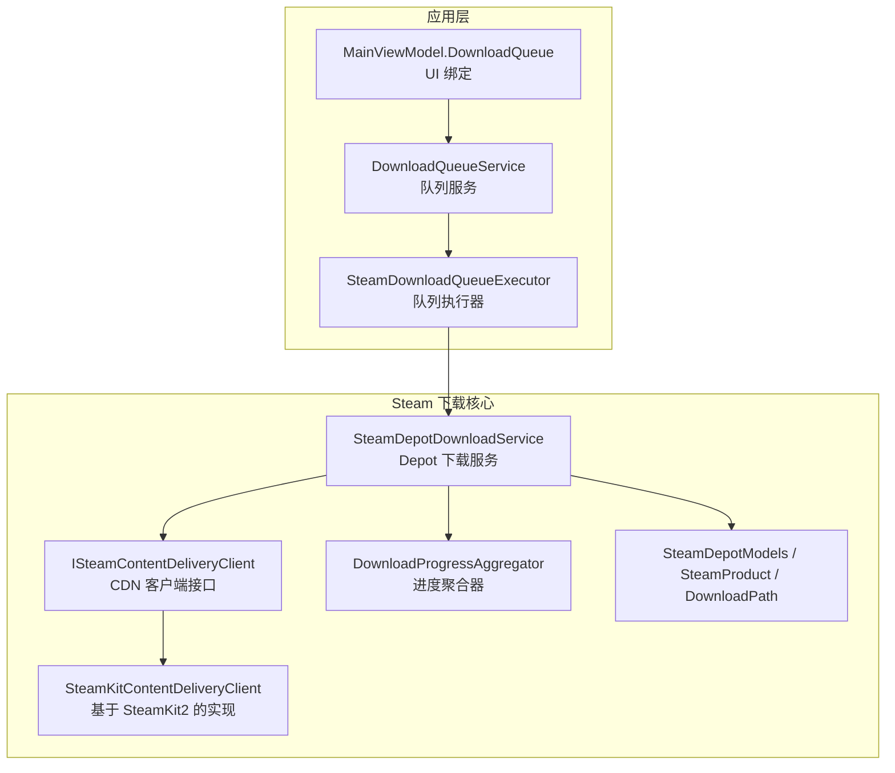
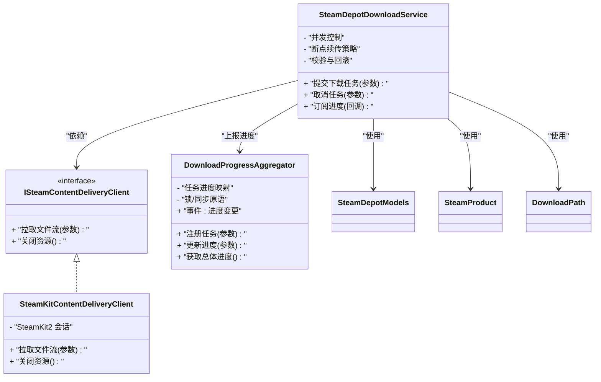
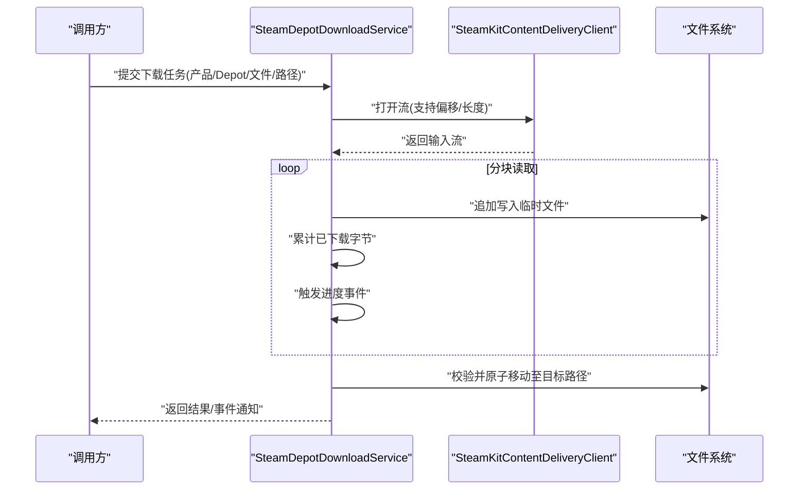
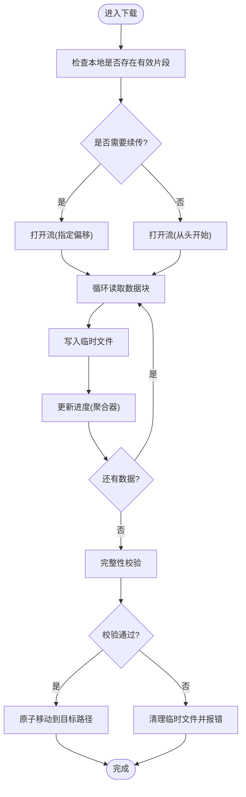
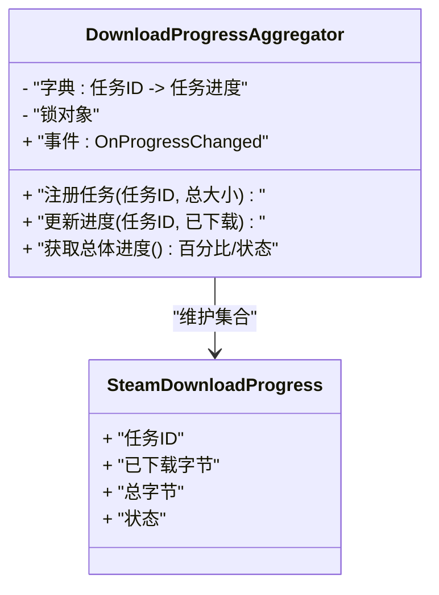
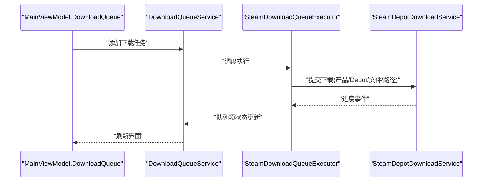
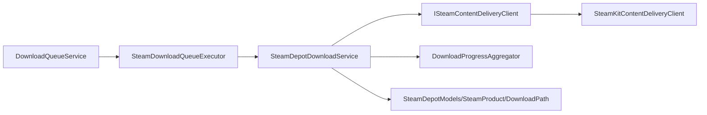

# Steam 下载服务

<cite>
**本文引用的文件**   
- [SteamDepotDownloadService.cs](file://src/Crystalfly.Steam/Downloads/SteamDepotDownloadService.cs)
- [ISteamContentDeliveryClient.cs](file://src/Crystalfly.Steam/Downloads/ISteamContentDeliveryClient.cs)
- [SteamKitContentDeliveryClient.cs](file://src/Crystalfly.Steam/Downloads/SteamKitContentDeliveryClient.cs)
- [DownloadProgressAggregator.cs](file://src/Crystalfly.Steam/Downloads/DownloadProgressAggregator.cs)
- [SteamDownloadProgress.cs](file://src/Crystalfly.Steam/Downloads/SteamDownloadProgress.cs)
- [SteamDepotModels.cs](file://src/Crystalfly.Steam/Downloads/SteamDepotModels.cs)
- [SteamProduct.cs](file://src/Crystalfly.Steam/Downloads/SteamProduct.cs)
- [DownloadPath.cs](file://src/Crystalfly.Steam/Downloads/DownloadPath.cs)
- [SteamDownloadQueueExecutor.cs](file://src/Crystalfly.App/Downloads/SteamDownloadQueueExecutor.cs)
- [DownloadQueueService.cs](file://src/Crystalfly.App/Downloads/DownloadQueueService.cs)
- [IDownloadQueueExecutor.cs](file://src/Crystalfly.App/Downloads/IDownloadQueueExecutor.cs)
- [DownloadQueueModels.cs](file://src/Crystalfly.App/Downloads/DownloadQueueModels.cs)
- [MainViewModel.DownloadQueue.cs](file://src/Crystalfly.App/ViewModels/MainViewModel.DownloadQueue.cs)
- [SteamDepotDownloadServiceTests.cs](file://tests/Crystalfly.Steam.Tests/Downloads/SteamDepotDownloadServiceTests.cs)
- [SteamKitContentDeliveryClientTests.cs](file://tests/Crystalfly.Steam.Tests/Downloads/SteamKitContentDeliveryClientTests.cs)
- [DownloadProgressAggregatorTests.cs](file://tests/Crystalfly.Steam.Tests/Downloads/DownloadProgressAggregatorTests.cs)
</cite>

## 目录
1. [简介](#简介)
2. [项目结构](#项目结构)
3. [核心组件](#核心组件)
4. [架构总览](#架构总览)
5. [详细组件分析](#详细组件分析)
6. [依赖关系分析](#依赖关系分析)
7. [性能考虑](#性能考虑)
8. [故障排查指南](#故障排查指南)
9. [结论](#结论)
10. [附录：使用示例与最佳实践](#附录使用示例与最佳实践)

## 简介
本文件面向需要集成或扩展 Steam 内容下载的开发者，聚焦以下目标：
- 深入解释内容分发网络客户端、下载队列管理与进度聚合机制。
- 详细说明 SteamDepotDownloadService 的实现原理，包括 Depot 文件下载、并发控制与断点续传。
- 记录 SteamKitContentDeliveryClient 的工作流程，展示如何使用 SteamKit2 库进行内容获取。
- 提供 DownloadProgressAggregator 的进度监控实现，包含多任务进度合并与状态同步。
- 记录 ISteamContentDeliveryClient 接口设计与扩展方式。
- 给出具体代码示例路径，演示如何发起下载任务、监控进度和处理完成事件。
- 解释错误处理、重试机制与性能优化策略。

## 项目结构
与 Steam 下载相关的核心代码位于 Crystalfly.Steam 与 Crystalfly.App 两个项目中：
- Crystalfly.Steam/Downloads：定义下载服务、CDN 客户端抽象与实现、进度聚合器、模型与路径工具。
- Crystalfly.App/Downloads：将下载能力接入应用层，提供队列执行器与服务编排。
- tests/Crystalfly.Steam.Tests/Downloads：覆盖关键组件的行为与边界条件。

图表来源
- [SteamDownloadQueueExecutor.cs](file://src/Crystalfly.App/Downloads/SteamDownloadQueueExecutor.cs)
- [DownloadQueueService.cs](file://src/Crystalfly.App/Downloads/DownloadQueueService.cs)
- [MainViewModel.DownloadQueue.cs](file://src/Crystalfly.App/ViewModels/MainViewModel.DownloadQueue.cs)
- [SteamDepotDownloadService.cs](file://src/Crystalfly.Steam/Downloads/SteamDepotDownloadService.cs)
- [ISteamContentDeliveryClient.cs](file://src/Crystalfly.Steam/Downloads/ISteamContentDeliveryClient.cs)
- [SteamKitContentDeliveryClient.cs](file://src/Crystalfly.Steam/Downloads/SteamKitContentDeliveryClient.cs)
- [DownloadProgressAggregator.cs](file://src/Crystalfly.Steam/Downloads/DownloadProgressAggregator.cs)
- [SteamDepotModels.cs](file://src/Crystalfly.Steam/Downloads/SteamDepotModels.cs)
- [SteamProduct.cs](file://src/Crystalfly.Steam/Downloads/SteamProduct.cs)
- [DownloadPath.cs](file://src/Crystalfly.Steam/Downloads/DownloadPath.cs)

章节来源
- [SteamDepotDownloadService.cs](file://src/Crystalfly.Steam/Downloads/SteamDepotDownloadService.cs)
- [ISteamContentDeliveryClient.cs](file://src/Crystalfly.Steam/Downloads/ISteamContentDeliveryClient.cs)
- [SteamKitContentDeliveryClient.cs](file://src/Crystalfly.Steam/Downloads/SteamKitContentDeliveryClient.cs)
- [DownloadProgressAggregator.cs](file://src/Crystalfly.Steam/Downloads/DownloadProgressAggregator.cs)
- [SteamDownloadProgress.cs](file://src/Crystalfly.Steam/Downloads/SteamDownloadProgress.cs)
- [SteamDepotModels.cs](file://src/Crystalfly.Steam/Downloads/SteamDepotModels.cs)
- [SteamProduct.cs](file://src/Crystalfly.Steam/Downloads/SteamProduct.cs)
- [DownloadPath.cs](file://src/Crystalfly.Steam/Downloads/DownloadPath.cs)
- [SteamDownloadQueueExecutor.cs](file://src/Crystalfly.App/Downloads/SteamDownloadQueueExecutor.cs)
- [DownloadQueueService.cs](file://src/Crystalfly.App/Downloads/DownloadQueueService.cs)
- [IDownloadQueueExecutor.cs](file://src/Crystalfly.App/Downloads/IDownloadQueueExecutor.cs)
- [DownloadQueueModels.cs](file://src/Crystalfly.App/Downloads/DownloadQueueModels.cs)
- [MainViewModel.DownloadQueue.cs](file://src/Crystalfly.App/ViewModels/MainViewModel.DownloadQueue.cs)

## 核心组件
- ISteamContentDeliveryClient：定义统一的 CDN 客户端契约，屏蔽底层实现差异，便于替换或扩展（如模拟客户端）。
- SteamKitContentDeliveryClient：基于 SteamKit2 的具体实现，负责与 Steam 服务器交互，拉取 Depot 文件流。
- SteamDepotDownloadService：封装 Depot 下载业务逻辑，协调并发、断点续传、校验与进度上报。
- DownloadProgressAggregator：聚合多个下载任务的进度，计算总体百分比与状态，驱动 UI 更新。
- 模型与路径：SteamDepotModels、SteamProduct、DownloadPath 等用于描述下载项、产物与落盘路径。

章节来源
- [ISteamContentDeliveryClient.cs](file://src/Crystalfly.Steam/Downloads/ISteamContentDeliveryClient.cs)
- [SteamKitContentDeliveryClient.cs](file://src/Crystalfly.Steam/Downloads/SteamKitContentDeliveryClient.cs)
- [SteamDepotDownloadService.cs](file://src/Crystalfly.Steam/Downloads/SteamDepotDownloadService.cs)
- [DownloadProgressAggregator.cs](file://src/Crystalfly.Steam/Downloads/DownloadProgressAggregator.cs)
- [SteamDepotModels.cs](file://src/Crystalfly.Steam/Downloads/SteamDepotModels.cs)
- [SteamProduct.cs](file://src/Crystalfly.Steam/Downloads/SteamProduct.cs)
- [DownloadPath.cs](file://src/Crystalfly.Steam/Downloads/DownloadPath.cs)

## 架构总览
整体采用“接口 + 实现”的分层设计：上层通过接口调用下载服务，服务内部组合 CDN 客户端、进度聚合器与模型对象，完成从请求到落盘的完整流程。

图表来源
- [ISteamContentDeliveryClient.cs](file://src/Crystalfly.Steam/Downloads/ISteamContentDeliveryClient.cs)
- [SteamKitContentDeliveryClient.cs](file://src/Crystalfly.Steam/Downloads/SteamKitContentDeliveryClient.cs)
- [SteamDepotDownloadService.cs](file://src/Crystalfly.Steam/Downloads/SteamDepotDownloadService.cs)
- [DownloadProgressAggregator.cs](file://src/Crystalfly.Steam/Downloads/DownloadProgressAggregator.cs)
- [SteamDepotModels.cs](file://src/Crystalfly.Steam/Downloads/SteamDepotModels.cs)
- [SteamProduct.cs](file://src/Crystalfly.Steam/Downloads/SteamProduct.cs)
- [DownloadPath.cs](file://src/Crystalfly.Steam/Downloads/DownloadPath.cs)

## 详细组件分析

### ISteamContentDeliveryClient 接口设计与扩展
- 职责：定义统一的“拉取远程内容流”的契约，屏蔽底层协议细节。
- 扩展方式：新增自定义客户端（例如代理、缓存、限速）只需实现该接口并注入到下载服务中。
- 典型方法：拉取文件流、资源释放、可选的错误码/异常约定。

章节来源
- [ISteamContentDeliveryClient.cs](file://src/Crystalfly.Steam/Downloads/ISteamContentDeliveryClient.cs)

### SteamKitContentDeliveryClient 工作流程
- 基于 SteamKit2 建立会话，解析产品/Depot 信息，定位文件块。
- 按块或分段读取数据流，支持部分读取以配合断点续传。
- 将流式数据写入本地临时文件，完成后原子性重命名至最终路径。
- 对网络异常进行捕获与转换，向上层抛出统一异常类型。

图表来源
- [SteamKitContentDeliveryClient.cs](file://src/Crystalfly.Steam/Downloads/SteamKitContentDeliveryClient.cs)
- [SteamDepotDownloadService.cs](file://src/Crystalfly.Steam/Downloads/SteamDepotDownloadService.cs)

章节来源
- [SteamKitContentDeliveryClient.cs](file://src/Crystalfly.Steam/Downloads/SteamKitContentDeliveryClient.cs)
- [SteamDepotDownloadService.cs](file://src/Crystalfly.Steam/Downloads/SteamDepotDownloadService.cs)

### SteamDepotDownloadService 实现原理
- 并发控制：通过线程池/信号量限制同时进行的下载数，避免耗尽带宽或句柄。
- 断点续传：根据本地已有文件大小与远端期望大小，设置读取偏移；若不一致则从头开始。
- 校验与回滚：下载完成后进行完整性校验（如哈希），失败则清理临时文件并标记失败。
- 进度上报：每写入一定字节后向聚合器上报增量，聚合器汇总为总体进度。
- 取消与超时：支持任务级取消与网络超时，确保资源及时释放。

图表来源
- [SteamDepotDownloadService.cs](file://src/Crystalfly.Steam/Downloads/SteamDepotDownloadService.cs)
- [DownloadProgressAggregator.cs](file://src/Crystalfly.Steam/Downloads/DownloadProgressAggregator.cs)

章节来源
- [SteamDepotDownloadService.cs](file://src/Crystalfly.Steam/Downloads/SteamDepotDownloadService.cs)
- [DownloadProgressAggregator.cs](file://src/Crystalfly.Steam/Downloads/DownloadProgressAggregator.cs)

### DownloadProgressAggregator 进度监控实现
- 数据结构：维护每个任务的已下载字节、总字节、状态枚举（等待/进行中/完成/失败）。
- 合并算法：按权重或简单求和计算总体百分比；当所有任务完成时输出最终状态。
- 同步策略：使用锁或不可变快照保证多线程安全，避免竞态条件。
- 事件机制：在进度变化时触发事件，供 UI 或日志系统消费。

图表来源
- [DownloadProgressAggregator.cs](file://src/Crystalfly.Steam/Downloads/DownloadProgressAggregator.cs)
- [SteamDownloadProgress.cs](file://src/Crystalfly.Steam/Downloads/SteamDownloadProgress.cs)

章节来源
- [DownloadProgressAggregator.cs](file://src/Crystalfly.Steam/Downloads/DownloadProgressAggregator.cs)
- [SteamDownloadProgress.cs](file://src/Crystalfly.Steam/Downloads/SteamDownloadProgress.cs)

### 应用层队列与执行器
- DownloadQueueService：管理下载队列的生命周期，调度任务入队/出队。
- SteamDownloadQueueExecutor：将队列中的下载项转换为具体的 Depot 下载任务，并与服务对接。
- MainViewModel.DownloadQueue：将队列状态与 UI 绑定，展示进度与操作按钮。

图表来源
- [MainViewModel.DownloadQueue.cs](file://src/Crystalfly.App/ViewModels/MainViewModel.DownloadQueue.cs)
- [DownloadQueueService.cs](file://src/Crystalfly.App/Downloads/DownloadQueueService.cs)
- [SteamDownloadQueueExecutor.cs](file://src/Crystalfly.App/Downloads/SteamDownloadQueueExecutor.cs)
- [SteamDepotDownloadService.cs](file://src/Crystalfly.Steam/Downloads/SteamDepotDownloadService.cs)

章节来源
- [DownloadQueueService.cs](file://src/Crystalfly.App/Downloads/DownloadQueueService.cs)
- [SteamDownloadQueueExecutor.cs](file://src/Crystalfly.App/Downloads/SteamDownloadQueueExecutor.cs)
- [IDownloadQueueExecutor.cs](file://src/Crystalfly.App/Downloads/IDownloadQueueExecutor.cs)
- [DownloadQueueModels.cs](file://src/Crystalfly.App/Downloads/DownloadQueueModels.cs)
- [MainViewModel.DownloadQueue.cs](file://src/Crystalfly.App/ViewModels/MainViewModel.DownloadQueue.cs)

## 依赖关系分析
- 松耦合：下载服务仅依赖 ISteamContentDeliveryClient 接口，可替换不同实现。
- 内聚性：进度聚合器独立于网络栈，专注于状态合并与事件发布。
- 外部依赖：SteamKitContentDeliveryClient 依赖 SteamKit2 进行认证与内容拉取。

图表来源
- [ISteamContentDeliveryClient.cs](file://src/Crystalfly.Steam/Downloads/ISteamContentDeliveryClient.cs)
- [SteamKitContentDeliveryClient.cs](file://src/Crystalfly.Steam/Downloads/SteamKitContentDeliveryClient.cs)
- [SteamDepotDownloadService.cs](file://src/Crystalfly.Steam/Downloads/SteamDepotDownloadService.cs)
- [DownloadProgressAggregator.cs](file://src/Crystalfly.Steam/Downloads/DownloadProgressAggregator.cs)
- [SteamDepotModels.cs](file://src/Crystalfly.Steam/Downloads/SteamDepotModels.cs)
- [SteamProduct.cs](file://src/Crystalfly.Steam/Downloads/SteamProduct.cs)
- [DownloadPath.cs](file://src/Crystalfly.Steam/Downloads/DownloadPath.cs)
- [SteamDownloadQueueExecutor.cs](file://src/Crystalfly.App/Downloads/SteamDownloadQueueExecutor.cs)
- [DownloadQueueService.cs](file://src/Crystalfly.App/Downloads/DownloadQueueService.cs)

章节来源
- [ISteamContentDeliveryClient.cs](file://src/Crystalfly.Steam/Downloads/ISteamContentDeliveryClient.cs)
- [SteamKitContentDeliveryClient.cs](file://src/Crystalfly.Steam/Downloads/SteamKitContentDeliveryClient.cs)
- [SteamDepotDownloadService.cs](file://src/Crystalfly.Steam/Downloads/SteamDepotDownloadService.cs)
- [DownloadProgressAggregator.cs](file://src/Crystalfly.Steam/Downloads/DownloadProgressAggregator.cs)
- [SteamDepotModels.cs](file://src/Crystalfly.Steam/Downloads/SteamDepotModels.cs)
- [SteamProduct.cs](file://src/Crystalfly.Steam/Downloads/SteamProduct.cs)
- [DownloadPath.cs](file://src/Crystalfly.Steam/Downloads/DownloadPath.cs)
- [SteamDownloadQueueExecutor.cs](file://src/Crystalfly.App/Downloads/SteamDownloadQueueExecutor.cs)
- [DownloadQueueService.cs](file://src/Crystalfly.App/Downloads/DownloadQueueService.cs)

## 性能考虑
- 并发度调优：根据磁盘 IO 与网络带宽调整最大并发数，避免过度竞争导致吞吐下降。
- 分块大小：合理设置读取块大小，平衡内存占用与系统调用开销。
- 零拷贝/缓冲：尽量复用缓冲区，减少分配与复制次数。
- 断点续传：优先利用已有片段，减少重复传输与校验成本。
- 进度上报频率：降低高频事件触发，批量合并更新以降低 UI 压力。
- 资源释放：确保流与临时文件在异常路径下也能正确释放。

[本节为通用指导，不直接分析具体文件]

## 故障排查指南
- 常见错误
  - 网络超时/连接中断：检查网络连通性与 Steam 服务可用性，必要时启用重试。
  - 校验失败：确认源文件哈希与目标路径权限，清理损坏的临时文件后重试。
  - 磁盘空间不足：在下载前检查可用空间，失败时清理残留文件。
- 重试策略
  - 指数退避：对瞬时错误采用指数退避，避免雪崩。
  - 幂等性：确保重试不会造成重复写入或状态不一致。
- 诊断手段
  - 启用详细日志：记录每次读取/写入的字节数与时间戳。
  - 观察聚合器事件：定位卡顿或停滞的任务。

章节来源
- [SteamDepotDownloadServiceTests.cs](file://tests/Crystalfly.Steam.Tests/Downloads/SteamDepotDownloadServiceTests.cs)
- [SteamKitContentDeliveryClientTests.cs](file://tests/Crystalfly.Steam.Tests/Downloads/SteamKitContentDeliveryClientTests.cs)
- [DownloadProgressAggregatorTests.cs](file://tests/Crystalfly.Steam.Tests/Downloads/DownloadProgressAggregatorTests.cs)

## 结论
本方案通过清晰的接口分层与模块化设计，实现了可扩展、高可用的 Steam 下载服务。SteamDepotDownloadService 负责核心业务逻辑，SteamKitContentDeliveryClient 屏蔽底层协议细节，DownloadProgressAggregator 提供稳定的进度聚合能力。结合应用层的队列与执行器，形成从 UI 到网络的端到端下载链路。

[本节为总结性内容，不直接分析具体文件]

## 附录：使用示例与最佳实践
以下为示例路径，展示如何发起下载、监控进度与处理完成事件：
- 发起下载任务
  - [SteamDepotDownloadService.cs](file://src/Crystalfly.Steam/Downloads/SteamDepotDownloadService.cs)
  - [SteamDownloadQueueExecutor.cs](file://src/Crystalfly.App/Downloads/SteamDownloadQueueExecutor.cs)
- 订阅进度与完成事件
  - [DownloadProgressAggregator.cs](file://src/Crystalfly.Steam/Downloads/DownloadProgressAggregator.cs)
  - [MainViewModel.DownloadQueue.cs](file://src/Crystalfly.App/ViewModels/MainViewModel.DownloadQueue.cs)
- 自定义 CDN 客户端扩展
  - [ISteamContentDeliveryClient.cs](file://src/Crystalfly.Steam/Downloads/ISteamContentDeliveryClient.cs)
  - [SteamKitContentDeliveryClient.cs](file://src/Crystalfly.Steam/Downloads/SteamKitContentDeliveryClient.cs)
- 测试参考
  - [SteamDepotDownloadServiceTests.cs](file://tests/Crystalfly.Steam.Tests/Downloads/SteamDepotDownloadServiceTests.cs)
  - [SteamKitContentDeliveryClientTests.cs](file://tests/Crystalfly.Steam.Tests/Downloads/SteamKitContentDeliveryClientTests.cs)
  - [DownloadProgressAggregatorTests.cs](file://tests/Crystalfly.Steam.Tests/Downloads/DownloadProgressAggregatorTests.cs)