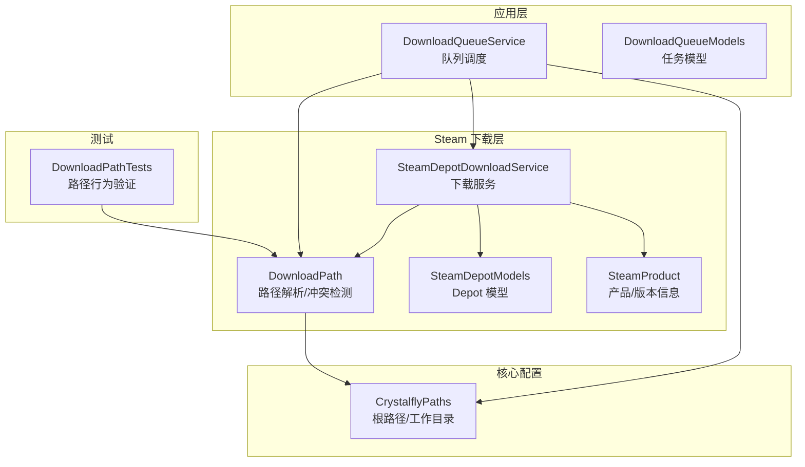
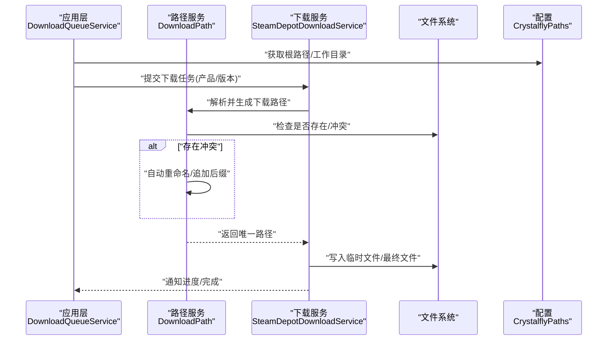
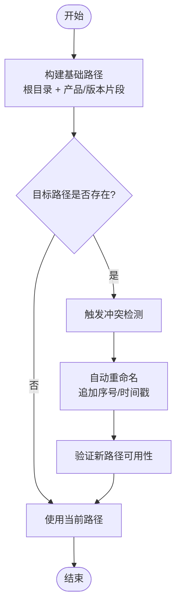
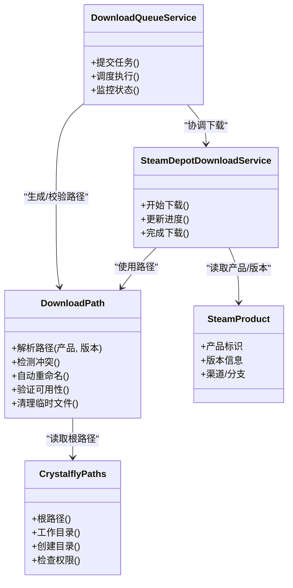

# 下载路径管理

<cite>
**本文引用的文件**   
- [DownloadPath.cs](file://src/Crystalfly.Steam/Downloads/DownloadPath.cs)
- [SteamProduct.cs](file://src/Crystalfly.Steam/Downloads/SteamProduct.cs)
- [SteamDepotModels.cs](file://src/Crystalfly.Steam/Downloads/SteamDepotModels.cs)
- [SteamDepotDownloadService.cs](file://src/Crystalfly.Steam/Downloads/SteamDepotDownloadService.cs)
- [CrystalflyPaths.cs](file://src/Crystalfly.Core/Configuration/CrystalflyPaths.cs)
- [DownloadQueueService.cs](file://src/Crystalfly.App/Downloads/DownloadQueueService.cs)
- [DownloadQueueModels.cs](file://src/Crystalfly.App/Downloads/DownloadQueueModels.cs)
- [DownloadPathTests.cs](file://tests/Crystalfly.Steam.Tests/Downloads/DownloadPathTests.cs)
</cite>

## 目录
1. [简介](#简介)
2. [项目结构](#项目结构)
3. [核心组件](#核心组件)
4. [架构总览](#架构总览)
5. [详细组件分析](#详细组件分析)
6. [依赖关系分析](#依赖关系分析)
7. [性能考虑](#性能考虑)
8. [故障排查指南](#故障排查指南)
9. [结论](#结论)
10. [附录](#附录)

## 简介
本章节聚焦“下载路径管理”主题，围绕以下目标展开：
- 深入解释 DownloadPath 类的设计思路与路径解析算法，包括临时文件命名规则与目录组织。
- 详细说明 SteamProduct 模型的字段定义与业务逻辑，涵盖产品信息映射与版本管理。
- 记录路径冲突检测与自动重命名机制。
- 提供具体代码示例（以路径引用形式），展示如何生成唯一下载路径、验证路径可用性与清理临时文件。
- 解释跨平台路径兼容性处理与文件系统权限管理。
- 包含路径监控与自动清理策略的实现要点。

## 项目结构
与下载路径管理直接相关的代码主要分布在以下模块：
- Crystalfly.Steam/Downloads：下载路径模型与服务实现（DownloadPath、SteamProduct、下载服务）。
- Crystalfly.Core/Configuration：全局路径配置（CrystalflyPaths）。
- Crystalfly.App/Downloads：下载队列编排与执行器（DownloadQueueService 等）。
- tests/Crystalfly.Steam.Tests/Downloads：针对下载路径的单元测试。

图表来源
- [DownloadPath.cs](file://src/Crystalfly.Steam/Downloads/DownloadPath.cs)
- [SteamProduct.cs](file://src/Crystalfly.Steam/Downloads/SteamProduct.cs)
- [SteamDepotModels.cs](file://src/Crystalfly.Steam/Downloads/SteamDepotModels.cs)
- [SteamDepotDownloadService.cs](file://src/Crystalfly.Steam/Downloads/SteamDepotDownloadService.cs)
- [CrystalflyPaths.cs](file://src/Crystalfly.Core/Configuration/CrystalfflyPaths.cs)
- [DownloadQueueService.cs](file://src/Crystalfly.App/Downloads/DownloadQueueService.cs)
- [DownloadQueueModels.cs](file://src/Crystalfly.App/Downloads/DownloadQueueModels.cs)
- [DownloadPathTests.cs](file://tests/Crystalfly.Steam.Tests/Downloads/DownloadPathTests.cs)

章节来源
- [DownloadPath.cs](file://src/Crystalfly.Steam/Downloads/DownloadPath.cs)
- [SteamProduct.cs](file://src/Crystalfly.Steam/Downloads/SteamProduct.cs)
- [SteamDepotModels.cs](file://src/Crystalfly.Steam/Downloads/SteamDepotModels.cs)
- [SteamDepotDownloadService.cs](file://src/Crystalfly.Steam/Downloads/SteamDepotDownloadService.cs)
- [CrystalflyPaths.cs](file://src/Crystalfly.Core/Configuration/CrystalflyPaths.cs)
- [DownloadQueueService.cs](file://src/Crystalfly.App/Downloads/DownloadQueueService.cs)
- [DownloadQueueModels.cs](file://src/Crystalfly.App/Downloads/DownloadQueueModels.cs)
- [DownloadPathTests.cs](file://tests/Crystalfly.Steam.Tests/Downloads/DownloadPathTests.cs)

## 核心组件
- DownloadPath：负责下载路径的解析、唯一性保证、冲突检测与自动重命名、临时文件命名与生命周期管理。
- SteamProduct：承载 Steam 产品信息与版本元数据，用于将产品/版本映射到具体的下载路径与存储位置。
- SteamDepotDownloadService：协调下载流程，调用 DownloadPath 生成并校验路径，完成文件落盘与清理。
- CrystalflyPaths：提供全局根路径与工作目录，确保跨平台一致性与权限控制。
- DownloadQueueService：在应用层编排下载任务，结合 DownloadPath 进行路径分配与并发控制。

章节来源
- [DownloadPath.cs](file://src/Crystalfly.Steam/Downloads/DownloadPath.cs)
- [SteamProduct.cs](file://src/Crystalfly.Steam/Downloads/SteamProduct.cs)
- [SteamDepotDownloadService.cs](file://src/Crystalfly.Steam/Downloads/SteamDepotDownloadService.cs)
- [CrystalflyPaths.cs](file://src/Crystalfly.Core/Configuration/CrystalflyPaths.cs)
- [DownloadQueueService.cs](file://src/Crystalfly.App/Downloads/DownloadQueueService.cs)

## 架构总览
下图展示了从应用层到下载层的调用链与路径流转过程：

图表来源
- [DownloadQueueService.cs](file://src/Crystalfly.App/Downloads/DownloadQueueService.cs)
- [DownloadPath.cs](file://src/Crystalfly.Steam/Downloads/DownloadPath.cs)
- [SteamDepotDownloadService.cs](file://src/Crystalfly.Steam/Downloads/SteamDepotDownloadService.cs)
- [CrystalflyPaths.cs](file://src/Crystalfly.Core/Configuration/CrystalflyPaths.cs)

## 详细组件分析

### DownloadPath 设计与路径解析算法
- 设计目标
  - 为每个下载任务生成稳定且唯一的本地路径。
  - 支持临时文件与最终文件的区分管理。
  - 提供冲突检测与自动重命名能力，避免覆盖已有内容。
  - 封装跨平台路径分隔符与长度限制处理。
- 关键职责
  - 基于产品标识与版本信息计算路径片段。
  - 根据任务类型选择临时或持久化目录。
  - 对已存在的路径进行冲突检测与重命名。
  - 提供路径可用性验证与清理接口。
- 路径解析算法（概念流程）

章节来源
- [DownloadPath.cs](file://src/Crystalfly.Steam/Downloads/DownloadPath.cs)
- [DownloadPathTests.cs](file://tests/Crystalfly.Steam.Tests/Downloads/DownloadPathTests.cs)

### SteamProduct 模型与版本管理
- 字段与语义
  - 产品标识：用于定位产品资源与目录结构。
  - 版本信息：用于区分不同构建与补丁，影响路径片段与缓存键。
  - 渠道/分支：可选字段，用于进一步细化版本范围。
- 业务逻辑
  - 将产品与版本组合成稳定的路径片段，确保同一版本在不同运行中保持一致。
  - 与 Depot 模型协作，确定需要下载的包与文件清单。
  - 作为 DownloadPath 的输入，参与唯一路径生成。

章节来源
- [SteamProduct.cs](file://src/Crystalfly.Steam/Downloads/SteamProduct.cs)
- [SteamDepotModels.cs](file://src/Crystalfly.Steam/Downloads/SteamDepotModels.cs)

### 路径冲突检测与自动重命名机制
- 冲突检测
  - 在生成目标路径后，立即检查文件系统是否已存在同名文件或目录。
  - 若存在，则判定为冲突，进入重命名流程。
- 自动重命名
  - 采用追加序号或时间戳的策略，确保新路径唯一且不破坏原有文件。
  - 重命名后的路径需再次验证可用性，直至通过。
- 可观测性
  - 记录冲突次数与最终路径，便于问题追踪与审计。

章节来源
- [DownloadPath.cs](file://src/Crystalfly.Steam/Downloads/DownloadPath.cs)
- [DownloadPathTests.cs](file://tests/Crystalfly.Steam.Tests/Downloads/DownloadPathTests.cs)

### 临时文件命名规则与目录结构组织
- 临时文件命名
  - 通常包含任务标识、部分哈希或序列号，确保临时文件唯一。
  - 命名规则应避免非法字符与超长路径。
- 目录组织
  - 根目录由 CrystalflyPaths 提供，按产品/版本划分子目录。
  - 临时目录与最终目录分离，便于清理与回滚。
- 生命周期
  - 下载完成后，临时文件应移动到最终目录或替换原文件。
  - 失败或中断时，保留临时文件以便重试或诊断。

章节来源
- [DownloadPath.cs](file://src/Crystalfly.Steam/Downloads/DownloadPath.cs)
- [CrystalflyPaths.cs](file://src/Crystalfly.Core/Configuration/CrystalflyPaths.cs)

### 跨平台路径兼容性与文件系统权限管理
- 跨平台兼容
  - 统一处理路径分隔符、大小写敏感性与最大路径长度。
  - 避免使用平台特定符号，确保 Windows/Linux/macOS 一致性。
- 权限管理
  - 在写入前检查目标目录的可写权限。
  - 捕获并上报权限不足错误，提示用户调整权限或更换目录。

章节来源
- [CrystalflyPaths.cs](file://src/Crystalfly.Core/Configuration/CrystalflyPaths.cs)
- [DownloadPath.cs](file://src/Crystalfly.Steam/Downloads/DownloadPath.cs)

### 路径监控与自动清理策略
- 路径监控
  - 监听下载目录变化，识别未完成或异常状态的文件。
  - 结合任务状态机，判断是否需要重试或清理。
- 自动清理
  - 定期扫描临时目录，删除超过阈值的残留文件。
  - 清理前进行锁检查，避免误删正在使用的文件。

章节来源
- [DownloadPath.cs](file://src/Crystalfly.Steam/Downloads/DownloadPath.cs)
- [DownloadQueueService.cs](file://src/Crystalfly.App/Downloads/DownloadQueueService.cs)

## 依赖关系分析

图表来源
- [CrystalflyPaths.cs](file://src/Crystalfly.Core/Configuration/CrystalflyPaths.cs)
- [DownloadPath.cs](file://src/Crystalfly.Steam/Downloads/DownloadPath.cs)
- [SteamProduct.cs](file://src/Crystalfly.Steam/Downloads/SteamProduct.cs)
- [SteamDepotDownloadService.cs](file://src/Crystalfly.Steam/Downloads/SteamDepotDownloadService.cs)
- [DownloadQueueService.cs](file://src/Crystalfly.App/Downloads/DownloadQueueService.cs)

章节来源
- [CrystalflyPaths.cs](file://src/Crystalfly.Core/Configuration/CrystalflyPaths.cs)
- [DownloadPath.cs](file://src/Crystalfly.Steam/Downloads/DownloadPath.cs)
- [SteamProduct.cs](file://src/Crystalfly.Steam/Downloads/SteamProduct.cs)
- [SteamDepotDownloadService.cs](file://src/Crystalfly.Steam/Downloads/SteamDepotDownloadService.cs)
- [DownloadQueueService.cs](file://src/Crystalfly.App/Downloads/DownloadQueueService.cs)

## 性能考虑
- 路径解析与冲突检测应尽量轻量，避免频繁 I/O；必要时引入内存缓存以减少重复检查。
- 批量下载场景下，建议预分配路径并并行校验，减少串行等待。
- 临时文件清理采用增量扫描与阈值控制，避免全量遍历带来的开销。
- 大文件写入建议使用缓冲与分块策略，降低内存峰值。

[本节为通用指导，不直接分析具体文件]

## 故障排查指南
- 常见问题
  - 路径不可用：检查目标目录权限与磁盘空间。
  - 冲突频繁：确认重命名策略是否生效，查看日志中的冲突计数。
  - 临时文件残留：检查清理策略是否被正确触发，确认是否有进程占用。
- 定位方法
  - 启用详细日志，记录路径生成、冲突检测与重命名过程。
  - 使用单元测试复现问题，参考 DownloadPathTests 的行为断言。
- 恢复步骤
  - 手动清理临时目录后重试。
  - 调整工作目录至有足够权限的位置。

章节来源
- [DownloadPathTests.cs](file://tests/Crystalfly.Steam.Tests/Downloads/DownloadPathTests.cs)
- [DownloadPath.cs](file://src/Crystalfly.Steam/Downloads/DownloadPath.cs)

## 结论
DownloadPath 与 SteamProduct 共同构成了下载路径管理的核心：前者负责路径的唯一性与稳定性，后者提供产品与版本的语义映射。配合 CrystalflyPaths 的全局配置与 DownloadQueueService 的调度，系统能够在多平台环境下安全、高效地完成下载与文件管理。通过冲突检测、自动重命名、权限校验与清理策略，系统在可靠性与可维护性方面具备良好表现。

[本节为总结性内容，不直接分析具体文件]

## 附录

### 代码示例（路径引用）
- 生成唯一下载路径
  - 参考：[DownloadPath.cs](file://src/Crystalfly.Steam/Downloads/DownloadPath.cs)
- 验证路径可用性
  - 参考：[DownloadPath.cs](file://src/Crystalfly.Steam/Downloads/DownloadPath.cs)
- 清理临时文件
  - 参考：[DownloadPath.cs](file://src/Crystalfly.Steam/Downloads/DownloadPath.cs)
- 使用产品/版本信息
  - 参考：[SteamProduct.cs](file://src/Crystalfly.Steam/Downloads/SteamProduct.cs)
- 下载服务集成
  - 参考：[SteamDepotDownloadService.cs](file://src/Crystalfly.Steam/Downloads/SteamDepotDownloadService.cs)
- 队列编排与监控
  - 参考：[DownloadQueueService.cs](file://src/Crystalfly.App/Downloads/DownloadQueueService.cs)
- 单元测试用例
  - 参考：[DownloadPathTests.cs](file://tests/Crystalfly.Steam.Tests/Downloads/DownloadPathTests.cs)