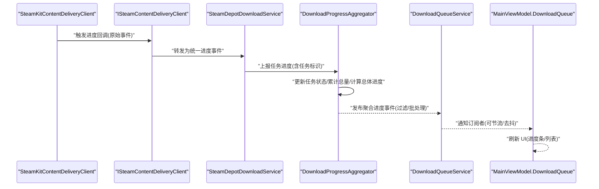
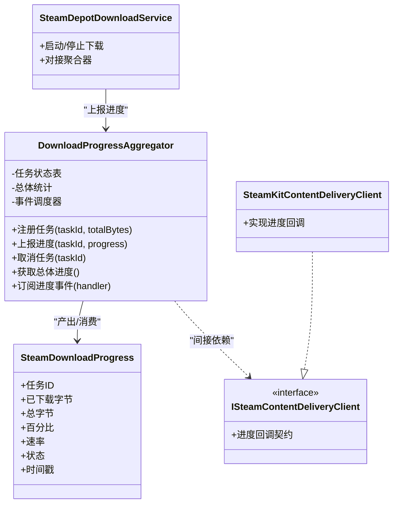
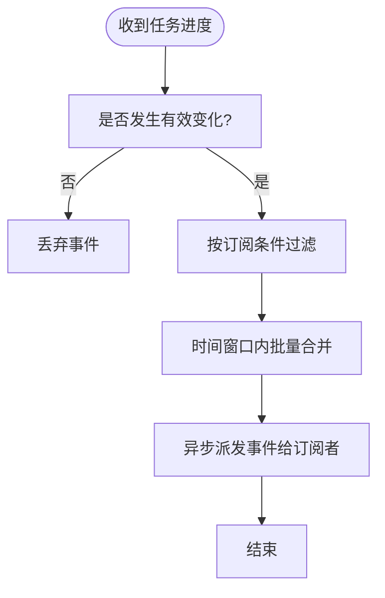
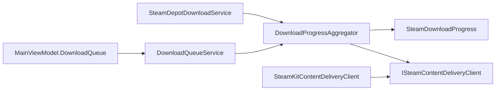

# 下载进度聚合器

<cite>
**本文引用的文件**   
- [DownloadProgressAggregator.cs](file://src/Crystalfly.Steam/Downloads/DownloadProgressAggregator.cs)
- [SteamDownloadProgress.cs](file://src/Crystalfly.Steam/Downloads/SteamDownloadProgress.cs)
- [SteamDepotDownloadService.cs](file://src/Crystalfly.Steam/Downloads/SteamDepotDownloadService.cs)
- [ISteamContentDeliveryClient.cs](file://src/Crystalfly.Steam/Downloads/ISteamContentDeliveryClient.cs)
- [SteamKitContentDeliveryClient.cs](file://src/Crystalfly.Steam/Downloads/SteamKitContentDeliveryClient.cs)
- [DownloadQueueService.cs](file://src/Crystalfly.App/Downloads/DownloadQueueService.cs)
- [MainViewModel.DownloadQueue.cs](file://src/Crystalfly.App/ViewModels/MainViewModel.DownloadQueue.cs)
- [DownloadProgressAggregatorTests.cs](file://tests/Crystalfly.Steam.Tests/Downloads/DownloadProgressAggregatorTests.cs)
</cite>

## 目录
1. [简介](#简介)
2. [项目结构](#项目结构)
3. [核心组件](#核心组件)
4. [架构总览](#架构总览)
5. [详细组件分析](#详细组件分析)
6. [依赖关系分析](#依赖关系分析)
7. [性能考虑](#性能考虑)
8. [故障排查指南](#故障排查指南)
9. [结论](#结论)
10. [附录](#附录)

## 简介
本章节面向“下载进度聚合器”的设计与实现，聚焦以下目标：
- 解释 DownloadProgressAggregator 的设计模式与实现原理
- 阐述多任务进度合并算法与状态同步机制
- 说明 SteamDownloadProgress 数据模型设计与字段含义
- 记录进度事件的发布订阅机制（事件过滤、批量处理、性能优化）
- 提供使用示例路径，展示如何监听下载进度变化、计算总体进度并更新界面
- 讨论进度计算的准确性保证与边界情况处理
- 给出进度数据的序列化与持久化策略建议

## 项目结构
围绕下载进度聚合的相关代码主要分布在 Steam 客户端层与应用 UI 层：
- Steam 层负责从底层内容投递客户端收集原始进度事件，并通过聚合器进行汇总与分发
- 应用层通过队列服务与视图模型消费聚合后的进度信息，驱动 UI 渲染

```mermaid
graph TB
subgraph "Steam 层"
A["ISteamContentDeliveryClient<br/>定义进度回调接口"]
B["SteamKitContentDeliveryClient<br/>产生原始进度事件"]
C["SteamDepotDownloadService<br/>协调下载任务"]
D["DownloadProgressAggregator<br/>聚合与分发进度"]
E["SteamDownloadProgress<br/>进度数据模型"]
end
subgraph "应用层"
F["DownloadQueueService<br/>管理下载队列"]
G["MainViewModel.DownloadQueue<br/>UI 绑定与展示"]
end
B --> A
C --> A
A --> D
D --> E
D --> F
F --> G
```

图表来源
- [ISteamContentDeliveryClient.cs](file://src/Crystalfly.Steam/Downloads/ISteamContentDeliveryClient.cs)
- [SteamKitContentDeliveryClient.cs](file://src/Crystalfly.Steam/Downloads/SteamKitContentDeliveryClient.cs)
- [SteamDepotDownloadService.cs](file://src/Crystalfly.Steam/Downloads/SteamDepotDownloadService.cs)
- [DownloadProgressAggregator.cs](file://src/Crystalfly.Steam/Downloads/DownloadProgressAggregator.cs)
- [SteamDownloadProgress.cs](file://src/Crystalfly.Steam/Downloads/SteamDownloadProgress.cs)
- [DownloadQueueService.cs](file://src/Crystalfly.App/Downloads/DownloadQueueService.cs)
- [MainViewModel.DownloadQueue.cs](file://src/Crystalfly.App/ViewModels/MainViewModel.DownloadQueue.cs)

章节来源
- [DownloadProgressAggregator.cs](file://src/Crystalfly.Steam/Downloads/DownloadProgressAggregator.cs)
- [SteamDownloadProgress.cs](file://src/Crystalfly.Steam/Downloads/SteamDownloadProgress.cs)
- [SteamDepotDownloadService.cs](file://src/Crystalfly.Steam/Downloads/SteamDepotDownloadService.cs)
- [ISteamContentDeliveryClient.cs](file://src/Crystalfly.Steam/Downloads/ISteamContentDeliveryClient.cs)
- [SteamKitContentDeliveryClient.cs](file://src/Crystalfly.Steam/Downloads/SteamKitContentDeliveryClient.cs)
- [DownloadQueueService.cs](file://src/Crystalfly.App/Downloads/DownloadQueueService.cs)
- [MainViewModel.DownloadQueue.cs](file://src/Crystalfly.App/ViewModels/MainViewModel.DownloadQueue.cs)

## 核心组件
- DownloadProgressAggregator：负责接收来自多个下载任务的原始进度事件，按任务维度维护状态，计算总体进度，并以事件形式对外发布。
- SteamDownloadProgress：表示单个任务或全局的进度快照，包含字节数、百分比、速度、状态等关键信息。
- ISteamContentDeliveryClient / SteamKitContentDeliveryClient：定义并实现底层进度回调契约，将平台侧进度事件转换为统一格式。
- SteamDepotDownloadService：组织下载任务，并将任务生命周期与进度聚合器对接。
- DownloadQueueService / MainViewModel.DownloadQueue：在应用层订阅聚合器的进度事件，驱动 UI 更新。

章节来源
- [DownloadProgressAggregator.cs](file://src/Crystalfly.Steam/Downloads/DownloadProgressAggregator.cs)
- [SteamDownloadProgress.cs](file://src/Crystalfly.Steam/Downloads/SteamDownloadProgress.cs)
- [ISteamContentDeliveryClient.cs](file://src/Crystalfly.Steam/Downloads/ISteamContentDeliveryClient.cs)
- [SteamKitContentDeliveryClient.cs](file://src/Crystalfly.Steam/Downloads/SteamKitContentDeliveryClient.cs)
- [SteamDepotDownloadService.cs](file://src/Crystalfly.Steam/Downloads/SteamDepotDownloadService.cs)
- [DownloadQueueService.cs](file://src/Crystalfly.App/Downloads/DownloadQueueService.cs)
- [MainViewModel.DownloadQueue.cs](file://src/Crystalfly.App/ViewModels/MainViewModel.DownloadQueue.cs)

## 架构总览
下图展示了从底层进度事件到 UI 更新的端到端流程：

图表来源
- [SteamKitContentDeliveryClient.cs](file://src/Crystalfly.Steam/Downloads/SteamKitContentDeliveryClient.cs)
- [ISteamContentDeliveryClient.cs](file://src/Crystalfly.Steam/Downloads/ISteamContentDeliveryClient.cs)
- [SteamDepotDownloadService.cs](file://src/Crystalfly.Steam/Downloads/SteamDepotDownloadService.cs)
- [DownloadProgressAggregator.cs](file://src/Crystalfly.Steam/Downloads/DownloadProgressAggregator.cs)
- [DownloadQueueService.cs](file://src/Crystalfly.App/Downloads/DownloadQueueService.cs)
- [MainViewModel.DownloadQueue.cs](file://src/Crystalfly.App/ViewModels/MainViewModel.DownloadQueue.cs)

## 详细组件分析

### DownloadProgressAggregator 设计模式与实现原理
- 设计模式
  - 观察者/发布订阅：聚合器作为发布者，向订阅者广播聚合后的进度事件；订阅者可按需过滤任务范围。
  - 组合模式：以任务为单位维护子进度，再组合出总体进度。
  - 单例/集中式状态：聚合器集中持有所有任务的状态，避免分散状态导致的不一致。
- 多任务进度合并算法
  - 输入：每个任务的已下载字节、总大小、当前速率、状态（进行中/完成/失败）。
  - 计算：总体进度 = 已完成字节之和 / 总字节之和；若存在未设置大小的任务，可按权重或忽略策略处理。
  - 速率聚合：对活跃任务速率求和，得到整体速率。
  - 状态归约：全部完成则总体完成；任一失败可标记为失败或保留部分成功语义（由策略决定）。
- 状态同步机制
  - 线程安全：内部状态变更需加锁或使用并发集合，确保多线程回调下的可见性与一致性。
  - 增量更新：仅当任务状态或数值发生变化时才触发事件，减少无效通知。
  - 去抖/节流：在高频率回调场景下，聚合器可对事件输出做时间窗口聚合，降低下游压力。

图表来源
- [DownloadProgressAggregator.cs](file://src/Crystalfly.Steam/Downloads/DownloadProgressAggregator.cs)
- [SteamDownloadProgress.cs](file://src/Crystalfly.Steam/Downloads/SteamDownloadProgress.cs)
- [ISteamContentDeliveryClient.cs](file://src/Crystalfly.Steam/Downloads/ISteamContentDeliveryClient.cs)
- [SteamKitContentDeliveryClient.cs](file://src/Crystalfly.Steam/Downloads/SteamKitContentDeliveryClient.cs)
- [SteamDepotDownloadService.cs](file://src/Crystalfly.Steam/Downloads/SteamDepotDownloadService.cs)

章节来源
- [DownloadProgressAggregator.cs](file://src/Crystalfly.Steam/Downloads/DownloadProgressAggregator.cs)
- [SteamDownloadProgress.cs](file://src/Crystalfly.Steam/Downloads/SteamDownloadProgress.cs)
- [ISteamContentDeliveryClient.cs](file://src/Crystalfly.Steam/Downloads/ISteamContentDeliveryClient.cs)
- [SteamKitContentDeliveryClient.cs](file://src/Crystalfly.Steam/Downloads/SteamKitContentDeliveryClient.cs)
- [SteamDepotDownloadService.cs](file://src/Crystalfly.Steam/Downloads/SteamDepotDownloadService.cs)

### SteamDownloadProgress 数据模型设计与字段含义
- 字段含义（概念性说明）
  - 任务标识：用于区分不同下载任务
  - 已下载字节：当前任务累计已写入的字节数
  - 总字节：任务总大小（可能未知）
  - 百分比：基于已下载/总字节的进度比例
  - 速率：瞬时或滑动平均速率
  - 状态：进行中、完成、失败、暂停等
  - 时间戳：最近一次进度更新时间
- 设计要点
  - 不可变性：事件对象应为只读，避免共享状态污染
  - 精度控制：百分比与速率采用合适精度，避免浮点误差累积
  - 空值处理：总字节未知时，百分比应明确为“未知”，避免误导

章节来源
- [SteamDownloadProgress.cs](file://src/Crystalfly.Steam/Downloads/SteamDownloadProgress.cs)

### 进度事件的发布订阅机制
- 事件过滤
  - 支持按任务 ID 过滤，订阅者仅关心特定任务
  - 支持按状态过滤，如仅关注“进行中”的任务
- 批量处理
  - 聚合器可在时间窗口内合并多次任务更新，生成批量事件，减少 UI 刷新次数
- 性能优化
  - 节流/去抖：限制单位时间内最大事件数量
  - 增量比较：仅在数值变化超过阈值时触发事件
  - 异步派发：事件派发在独立线程池执行，避免阻塞回调链路

图表来源
- [DownloadProgressAggregator.cs](file://src/Crystalfly.Steam/Downloads/DownloadProgressAggregator.cs)

章节来源
- [DownloadProgressAggregator.cs](file://src/Crystalfly.Steam/Downloads/DownloadProgressAggregator.cs)

### 使用示例（路径指引）
- 监听下载进度变化
  - 参考测试用例中的订阅与断言逻辑，了解如何注册事件处理器并验证行为
  - 参考路径：[DownloadProgressAggregatorTests.cs](file://tests/Crystalfly.Steam.Tests/Downloads/DownloadProgressAggregatorTests.cs)
- 计算总体进度
  - 参考聚合器中总体进度的计算方法与边界处理
  - 参考路径：[DownloadProgressAggregator.cs](file://src/Crystalfly.Steam/Downloads/DownloadProgressAggregator.cs)
- 更新用户界面
  - 参考应用层队列服务与视图模型的绑定方式，理解如何将聚合进度映射到 UI
  - 参考路径：[DownloadQueueService.cs](file://src/Crystalfly.App/Downloads/DownloadQueueService.cs)、[MainViewModel.DownloadQueue.cs](file://src/Crystalfly.App/ViewModels/MainViewModel.DownloadQueue.cs)

章节来源
- [DownloadProgressAggregatorTests.cs](file://tests/Crystalfly.Steam.Tests/Downloads/DownloadProgressAggregatorTests.cs)
- [DownloadProgressAggregator.cs](file://src/Crystalfly.Steam/Downloads/DownloadProgressAggregator.cs)
- [DownloadQueueService.cs](file://src/Crystalfly.App/Downloads/DownloadQueueService.cs)
- [MainViewModel.DownloadQueue.cs](file://src/Crystalfly.App/ViewModels/MainViewModel.DownloadQueue.cs)

### 进度计算的准确性保证与边界情况处理
- 准确性保证
  - 使用整数累加已下载字节，避免浮点误差
  - 百分比计算前校验总字节大于零，防止除零异常
  - 速率计算采用滑动窗口或指数平滑，抑制抖动
- 边界情况
  - 总字节未知：百分比显示为“未知”，总体进度按已知任务加权或跳过
  - 任务取消/失败：及时清理状态，避免参与后续总体计算
  - 重复上报：通过幂等键或时间戳去重，防止重复计数
  - 并发回调：加锁或原子操作保护内部状态

章节来源
- [DownloadProgressAggregator.cs](file://src/Crystalfly.Steam/Downloads/DownloadProgressAggregator.cs)
- [SteamDownloadProgress.cs](file://src/Crystalfly.Steam/Downloads/SteamDownloadProgress.cs)

### 进度数据的序列化与持久化策略
- 序列化
  - 将 SteamDownloadProgress 序列化为 JSON，便于日志记录与调试
  - 注意剔除敏感信息与高频字段，控制体积
- 持久化
  - 可选：将总体进度快照定期落盘，用于恢复或审计
  - 使用原子写入策略，避免损坏中间态
- 注意事项
  - 避免在热路径频繁持久化，采用批写或定时刷盘
  - 版本兼容：字段演进时需保持向后兼容

章节来源
- [SteamDownloadProgress.cs](file://src/Crystalfly.Steam/Downloads/SteamDownloadProgress.cs)
- [DownloadProgressAggregator.cs](file://src/Crystalfly.Steam/Downloads/DownloadProgressAggregator.cs)

## 依赖关系分析
- 组件耦合
  - DownloadProgressAggregator 与 SteamDownloadProgress 强耦合（数据结构）
  - 与 ISteamContentDeliveryClient 松耦合（通过抽象接口），便于替换实现
  - 与 SteamDepotDownloadService 协作（任务编排与上报）
- 外部依赖
  - 底层进度回调由 SteamKitContentDeliveryClient 提供
  - 上层 UI 通过 DownloadQueueService 与 MainViewModel 消费事件

图表来源
- [DownloadProgressAggregator.cs](file://src/Crystalfly.Steam/Downloads/DownloadProgressAggregator.cs)
- [SteamDownloadProgress.cs](file://src/Crystalfly.Steam/Downloads/SteamDownloadProgress.cs)
- [ISteamContentDeliveryClient.cs](file://src/Crystalfly.Steam/Downloads/ISteamContentDeliveryClient.cs)
- [SteamKitContentDeliveryClient.cs](file://src/Crystalfly.Steam/Downloads/SteamKitContentDeliveryClient.cs)
- [SteamDepotDownloadService.cs](file://src/Crystalfly.Steam/Downloads/SteamDepotDownloadService.cs)
- [DownloadQueueService.cs](file://src/Crystalfly.App/Downloads/DownloadQueueService.cs)
- [MainViewModel.DownloadQueue.cs](file://src/Crystalfly.App/ViewModels/MainViewModel.DownloadQueue.cs)

章节来源
- [DownloadProgressAggregator.cs](file://src/Crystalfly.Steam/Downloads/DownloadProgressAggregator.cs)
- [SteamDownloadProgress.cs](file://src/Crystalfly.Steam/Downloads/SteamDownloadProgress.cs)
- [ISteamContentDeliveryClient.cs](file://src/Crystalfly.Steam/Downloads/ISteamContentDeliveryClient.cs)
- [SteamKitContentDeliveryClient.cs](file://src/Crystalfly.Steam/Downloads/SteamKitContentDeliveryClient.cs)
- [SteamDepotDownloadService.cs](file://src/Crystalfly.Steam/Downloads/SteamDepotDownloadService.cs)
- [DownloadQueueService.cs](file://src/Crystalfly.App/Downloads/DownloadQueueService.cs)
- [MainViewModel.DownloadQueue.cs](file://src/Crystalfly.App/ViewModels/MainViewModel.DownloadQueue.cs)

## 性能考虑
- 事件节流与去抖：在高频回调场景下，聚合器应限制事件输出频率，避免 UI 卡顿
- 批量合并：在短时间窗口内合并多个任务更新，减少事件数量
- 增量比较：仅当数值变化超过阈值时触发事件，降低无用通知
- 异步派发：事件派发在后台线程执行，避免阻塞进度回调链路
- 内存占用：及时清理已完成或失败任务的状态，避免长期驻留

## 故障排查指南
- 常见问题
  - 进度不更新：检查订阅是否正确注册，事件过滤条件是否过严
  - 总体进度异常：确认总字节是否为正，是否存在未设置大小的任务
  - UI 卡顿：评估事件频率，启用节流/去抖与批量合并
- 定位方法
  - 查看测试用例中的断言与模拟数据，复现问题场景
  - 在聚合器入口与出口添加日志，对比输入与输出差异
- 参考路径
  - 测试用例：[DownloadProgressAggregatorTests.cs](file://tests/Crystalfly.Steam.Tests/Downloads/DownloadProgressAggregatorTests.cs)
  - 聚合器实现：[DownloadProgressAggregator.cs](file://src/Crystalfly.Steam/Downloads/DownloadProgressAggregator.cs)

章节来源
- [DownloadProgressAggregatorTests.cs](file://tests/Crystalfly.Steam.Tests/Downloads/DownloadProgressAggregatorTests.cs)
- [DownloadProgressAggregator.cs](file://src/Crystalfly.Steam/Downloads/DownloadProgressAggregator.cs)

## 结论
DownloadProgressAggregator 通过发布订阅与组合模式，实现了多任务进度的可靠聚合与高效分发。配合 SteamDownloadProgress 的数据模型与严格的边界处理，能够在高并发与高频回调场景下保持准确性与稳定性。应用层通过队列服务与视图模型消费事件，实现流畅的 UI 体验。建议在热路径中谨慎持久化，采用批写与节流策略，进一步提升系统性能与可靠性。

## 附录
- 术语
  - 任务：一次独立的下载单元，具有唯一标识与总大小
  - 聚合：将多个任务的进度合并为总体进度
  - 节流/去抖：限制事件输出频率的技术手段
- 扩展建议
  - 增加历史趋势图：保存近期速率与进度快照，绘制曲线
  - 支持优先级与带宽分配：根据任务优先级动态调整资源
  - 增强错误恢复：失败重试与断点续传策略