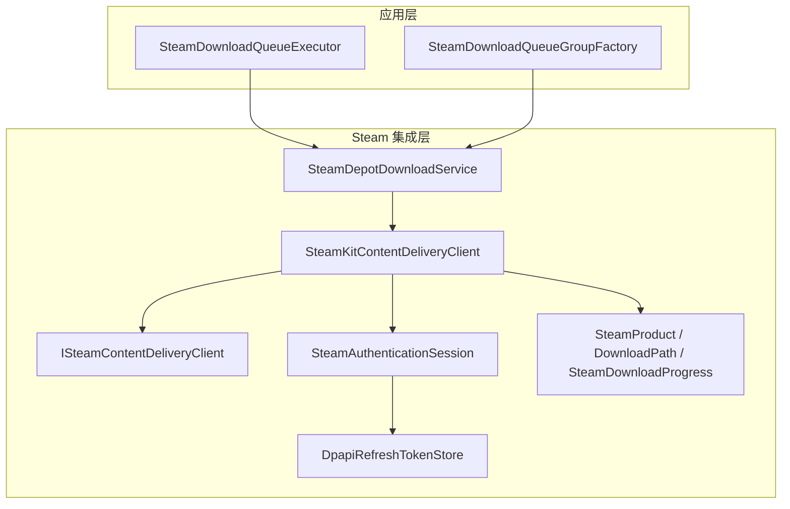
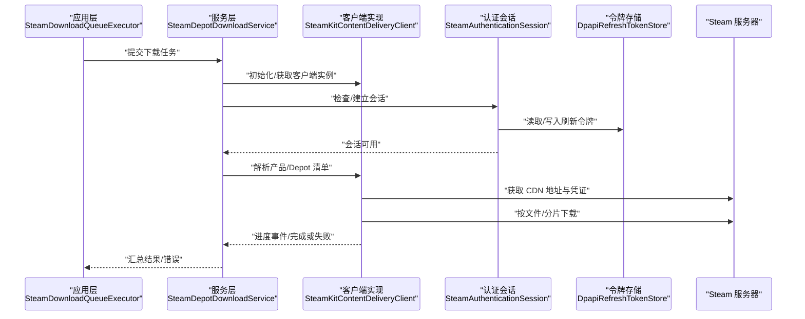
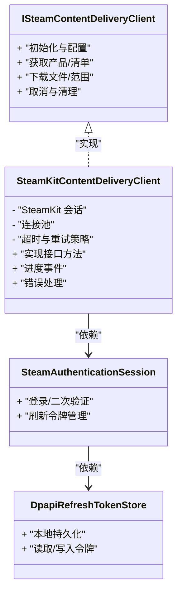
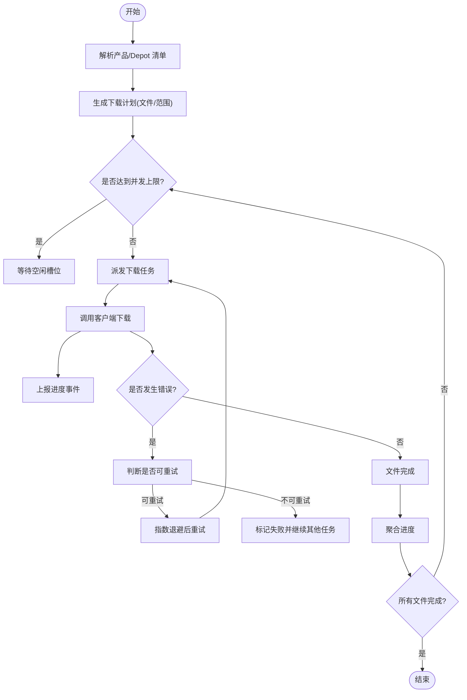
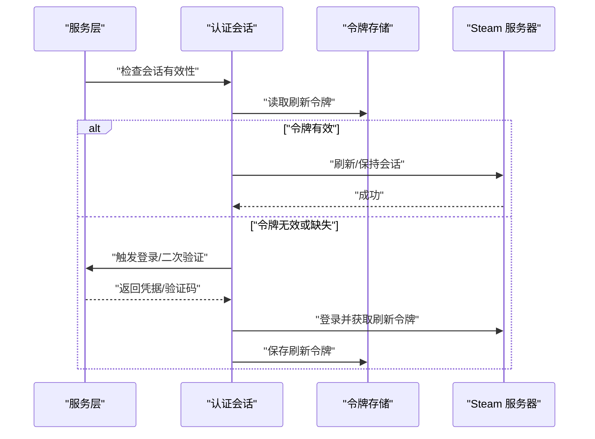
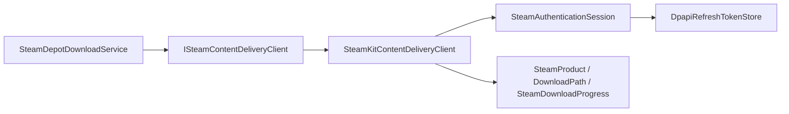

# 内容交付客户端

<cite>
**本文引用的文件**   
- [ISteamContentDeliveryClient.cs](file://src/Crystalfly.Steam/Downloads/ISteamContentDeliveryClient.cs)
- [SteamKitContentDeliveryClient.cs](file://src/Crystalfly.Steam/Downloads/SteamKitContentDeliveryClient.cs)
- [SteamDepotDownloadService.cs](file://src/Crystalfly.Steam/Downloads/SteamDepotDownloadService.cs)
- [SteamDownloadProgress.cs](file://src/Crystalfly.Steam/Downloads/SteamDownloadProgress.cs)
- [DownloadPath.cs](file://src/Crystalfly.Steam/Downloads/DownloadPath.cs)
- [SteamProduct.cs](file://src/Crystalfly.Steam/Downloads/SteamProduct.cs)
- [SteamAuthenticationSession.cs](file://src/Crystalfly.Steam/Authentication/SteamAuthenticationSession.cs)
- [DpapiRefreshTokenStore.cs](file://src/Crystalfly.Steam/Security/DpapiRefreshTokenStore.cs)
- [RefreshTokenCredential.cs](file://src/Crystalfly.Steam/Security/RefreshTokenCredential.cs)
- [Crystalfly.Steam.csproj](file://src/Crystalfly.Steam/Crystalfly.Steam.csproj)
- [SteamDownloadQueueExecutor.cs](file://src/Crystalfly.App/Downloads/SteamDownloadQueueExecutor.cs)
- [SteamDownloadQueueGroupFactory.cs](file://src/Crystalfly.App/Downloads/SteamDownloadQueueGroupFactory.cs)
- [SteamDepotDownloadServiceTests.cs](file://tests/Crystalfly.Steam.Tests/Downloads/SteamDepotDownloadServiceTests.cs)
- [SteamKitContentDeliveryClientTests.cs](file://tests/Crystalfly.Steam.Tests/Downloads/SteamKitContentDeliveryClientTests.cs)
</cite>

## 目录
1. [简介](#简介)
2. [项目结构](#项目结构)
3. [核心组件](#核心组件)
4. [架构总览](#架构总览)
5. [详细组件分析](#详细组件分析)
6. [依赖关系分析](#依赖关系分析)
7. [性能与资源管理](#性能与资源管理)
8. [故障排查指南](#故障排查指南)
9. [结论](#结论)
10. [附录：使用示例与扩展点](#附录使用示例与扩展点)

## 简介
本文件面向“内容交付客户端”的设计与实现，聚焦于 ISteamContentDeliveryClient 接口设计与 SteamKitContentDeliveryClient 的具体实现。文档将系统阐述如何使用 SteamKit2 库访问 Steam 内容分发网络（CDN），涵盖连接建立、身份验证、数据传输、连接池管理与资源释放、异常处理、超时控制与重试策略，以及客户端扩展点与插件化设计的应用。同时提供基于测试与上层队列执行器的使用示例路径，帮助读者快速上手并安全扩展。

## 项目结构
与内容交付相关的代码主要分布在以下模块：
- Crystalfly.Steam/Downloads：定义内容交付接口与基于 SteamKit 的实现，封装 Depot 下载流程与进度聚合。
- Crystalfly.Steam/Authentication：Steam 登录与会话管理。
- Crystalfly.Steam/Security：刷新令牌持久化与凭据模型。
- Crystalfly.App/Downloads：应用层下载队列执行器，负责调度与协调具体下载任务。
- tests/Crystalfly.Steam.Tests/Downloads：针对服务与客户端的单元测试，体现典型用法与边界行为。

图表来源
- [SteamDownloadQueueExecutor.cs](file://src/Crystalfly.App/Downloads/SteamDownloadQueueExecutor.cs)
- [SteamDownloadQueueGroupFactory.cs](file://src/Crystalfly.App/Downloads/SteamDownloadQueueGroupFactory.cs)
- [SteamDepotDownloadService.cs](file://src/Crystalfly.Steam/Downloads/SteamDepotDownloadService.cs)
- [SteamKitContentDeliveryClient.cs](file://src/Crystalfly.Steam/Downloads/SteamKitContentDeliveryClient.cs)
- [ISteamContentDeliveryClient.cs](file://src/Crystalfly.Steam/Downloads/ISteamContentDeliveryClient.cs)
- [SteamAuthenticationSession.cs](file://src/Crystalfly.Steam/Authentication/SteamAuthenticationSession.cs)
- [DpapiRefreshTokenStore.cs](file://src/Crystalfly.Steam/Security/DpapiRefreshTokenStore.cs)
- [SteamProduct.cs](file://src/Crystalfly.Steam/Downloads/SteamProduct.cs)
- [DownloadPath.cs](file://src/Crystalfly.Steam/Downloads/DownloadPath.cs)
- [SteamDownloadProgress.cs](file://src/Crystalfly.Steam/Downloads/SteamDownloadProgress.cs)

章节来源
- [SteamDownloadQueueExecutor.cs](file://src/Crystalfly.App/Downloads/SteamDownloadQueueExecutor.cs)
- [SteamDownloadQueueGroupFactory.cs](file://src/Crystalfly.App/Downloads/SteamDownloadQueueGroupFactory.cs)
- [SteamDepotDownloadService.cs](file://src/Crystalfly.Steam/Downloads/SteamDepotDownloadService.cs)
- [SteamKitContentDeliveryClient.cs](file://src/Crystalfly.Steam/Downloads/SteamKitContentDeliveryClient.cs)
- [ISteamContentDeliveryClient.cs](file://src/Crystalfly.Steam/Downloads/ISteamContentDeliveryClient.cs)
- [SteamAuthenticationSession.cs](file://src/Crystalfly.Steam/Authentication/SteamAuthenticationSession.cs)
- [DpapiRefreshTokenStore.cs](file://src/Crystalfly.Steam/Security/DpapiRefreshTokenStore.cs)
- [SteamProduct.cs](file://src/Crystalfly.Steam/Downloads/SteamProduct.cs)
- [DownloadPath.cs](file://src/Crystalfly.Steam/Downloads/DownloadPath.cs)
- [SteamDownloadProgress.cs](file://src/Crystalfly.Steam/Downloads/SteamDownloadProgress.cs)

## 核心组件
- ISteamContentDeliveryClient：抽象内容交付客户端能力，屏蔽底层差异，向上暴露统一的下载与元数据查询接口。
- SteamKitContentDeliveryClient：基于 SteamKit2 的具体实现，负责与 Steam 服务器交互、认证、获取 CDN 地址、发起下载、进度上报与错误处理。
- SteamDepotDownloadService：面向业务的服务层，编排 Depot 清单解析、分片/文件级下载、并发控制、重试与结果聚合。
- SteamAuthenticationSession：封装 Steam 登录与会话生命周期，支持刷新令牌与二次验证回调。
- DpapiRefreshTokenStore：本地持久化刷新令牌，保障跨进程/重启后的会话恢复。
- 模型与工具：SteamProduct、DownloadPath、SteamDownloadProgress 等用于描述产品、下载路径与进度事件。

章节来源
- [ISteamContentDeliveryClient.cs](file://src/Crystalfly.Steam/Downloads/ISteamContentDeliveryClient.cs)
- [SteamKitContentDeliveryClient.cs](file://src/Crystalfly.Steam/Downloads/SteamKitContentDeliveryClient.cs)
- [SteamDepotDownloadService.cs](file://src/Crystalfly.Steam/Downloads/SteamDepotDownloadService.cs)
- [SteamAuthenticationSession.cs](file://src/Crystalfly.Steam/Authentication/SteamAuthenticationSession.cs)
- [DpapiRefreshTokenStore.cs](file://src/Crystalfly.Steam/Security/DpapiRefreshTokenStore.cs)
- [SteamProduct.cs](file://src/Crystalfly.Steam/Downloads/SteamProduct.cs)
- [DownloadPath.cs](file://src/Crystalfly.Steam/Downloads/DownloadPath.cs)
- [SteamDownloadProgress.cs](file://src/Crystalfly.Steam/Downloads/SteamDownloadProgress.cs)

## 架构总览
整体采用分层与插件化设计：
- 应用层通过队列执行器提交下载任务，交由服务层编排。
- 服务层调用内容交付客户端进行实际的网络请求与数据传输。
- 客户端内部维护与 SteamKit 的连接与会话，必要时复用连接池以提升吞吐。
- 认证与会话由独立模块管理，支持刷新令牌与二次验证回调。

图表来源
- [SteamDownloadQueueExecutor.cs](file://src/Crystalfly.App/Downloads/SteamDownloadQueueExecutor.cs)
- [SteamDepotDownloadService.cs](file://src/Crystalfly.Steam/Downloads/SteamDepotDownloadService.cs)
- [SteamKitContentDeliveryClient.cs](file://src/Crystalfly.Steam/Downloads/SteamKitContentDeliveryClient.cs)
- [SteamAuthenticationSession.cs](file://src/Crystalfly.Steam/Authentication/SteamAuthenticationSession.cs)
- [DpapiRefreshTokenStore.cs](file://src/Crystalfly.Steam/Security/DpapiRefreshTokenStore.cs)

## 详细组件分析

### ISteamContentDeliveryClient 接口设计
职责与契约要点：
- 统一抽象：屏蔽不同底层实现差异，提供一致的下载与元数据查询方法。
- 可替换性：允许注入自定义实现以适配不同网络栈或协议。
- 事件与状态：对外暴露进度事件与错误信号，便于上层聚合与展示。
- 资源语义：明确创建/销毁生命周期，避免连接泄漏。

建议的接口能力（概念性说明）：
- 初始化与配置：设置用户凭据、代理、超时、并发度等。
- 产品与清单：根据产品 ID 获取版本/Depot 信息。
- 下载：按文件或范围发起下载，支持断点续传与并发。
- 取消与清理：支持取消进行中任务与释放资源。

章节来源
- [ISteamContentDeliveryClient.cs](file://src/Crystalfly.Steam/Downloads/ISteamContentDeliveryClient.cs)

### SteamKitContentDeliveryClient 实现
实现要点：
- 基于 SteamKit2 构建连接与会话，负责与 Steam 服务器通信。
- 认证流程：结合 SteamAuthenticationSession 完成登录、二次验证与刷新令牌恢复。
- CDN 访问：先获取 CDN 授权与地址，再发起 HTTP/TCP 下载。
- 进度上报：将下载进度转换为统一事件，供服务层聚合。
- 错误处理：对网络异常、认证失败、权限不足等进行分类与重试决策。
- 资源管理：在构造/析构中管理连接池与临时资源，确保释放。

关键流程（概念性说明）：
- 初始化：加载配置，建立或复用 SteamKit 会话。
- 认证：若未登录则触发登录流程；必要时提示二次验证。
- 清单解析：拉取产品/Depot 清单，计算需要下载的文件集合。
- 下载执行：按并发限制发起下载，记录进度与错误。
- 收尾：关闭连接、释放资源、上报最终状态。

章节来源
- [SteamKitContentDeliveryClient.cs](file://src/Crystalfly.Steam/Downloads/SteamKitContentDeliveryClient.cs)
- [SteamDownloadProgress.cs](file://src/Crystalfly.Steam/Downloads/SteamDownloadProgress.cs)
- [SteamProduct.cs](file://src/Crystalfly.Steam/Downloads/SteamProduct.cs)
- [DownloadPath.cs](file://src/Crystalfly.Steam/Downloads/DownloadPath.cs)

#### 类图（概念映射到源码）

图表来源
- [ISteamContentDeliveryClient.cs](file://src/Crystalfly.Steam/Downloads/ISteamContentDeliveryClient.cs)
- [SteamKitContentDeliveryClient.cs](file://src/Crystalfly.Steam/Downloads/SteamKitContentDeliveryClient.cs)
- [SteamAuthenticationSession.cs](file://src/Crystalfly.Steam/Authentication/SteamAuthenticationSession.cs)
- [DpapiRefreshTokenStore.cs](file://src/Crystalfly.Steam/Security/DpapiRefreshTokenStore.cs)

### SteamDepotDownloadService 服务层
职责与流程：
- 任务编排：接收来自应用层的下载任务，解析产品与 Depot 清单。
- 并发控制：限制并行下载数，避免压垮网络与服务端。
- 重试策略：对瞬时错误进行指数退避重试，区分可重试与不可重试错误。
- 进度聚合：合并多个文件的进度，向上传递总体进度。
- 结果校验：可选地校验文件完整性，失败则重新下载。

图表来源
- [SteamDepotDownloadService.cs](file://src/Crystalfly.Steam/Downloads/SteamDepotDownloadService.cs)
- [SteamKitContentDeliveryClient.cs](file://src/Crystalfly.Steam/Downloads/SteamKitContentDeliveryClient.cs)

章节来源
- [SteamDepotDownloadService.cs](file://src/Crystalfly.Steam/Downloads/SteamDepotDownloadService.cs)

### 认证与会话管理
- SteamAuthenticationSession：封装登录流程、二次验证回调、会话保活与失效处理。
- DpapiRefreshTokenStore：使用 DPAPI 本地加密存储刷新令牌，提升安全性与可用性。
- RefreshTokenCredential：表示刷新令牌的结构体/模型，供存储与传输使用。

图表来源
- [SteamAuthenticationSession.cs](file://src/Crystalfly.Steam/Authentication/SteamAuthenticationSession.cs)
- [DpapiRefreshTokenStore.cs](file://src/Crystalfly.Steam/Security/DpapiRefreshTokenStore.cs)
- [RefreshTokenCredential.cs](file://src/Crystalfly.Steam/Security/RefreshTokenCredential.cs)

章节来源
- [SteamAuthenticationSession.cs](file://src/Crystalfly.Steam/Authentication/SteamAuthenticationSession.cs)
- [DpapiRefreshTokenStore.cs](file://src/Crystalfly.Steam/Security/DpapiRefreshTokenStore.cs)
- [RefreshTokenCredential.cs](file://src/Crystalfly.Steam/Security/RefreshTokenCredential.cs)

## 依赖关系分析
- 外部依赖：SteamKit2 作为底层 SDK，提供与 Steam 服务器的通信能力。
- 内部依赖：服务层依赖客户端接口；客户端实现依赖认证与会话模块；模型贯穿各层传递。
- 耦合与内聚：接口与实现解耦，服务层仅依赖接口，利于替换与测试；认证与存储分离，提高内聚性。

图表来源
- [ISteamContentDeliveryClient.cs](file://src/Crystalfly.Steam/Downloads/ISteamContentDeliveryClient.cs)
- [SteamKitContentDeliveryClient.cs](file://src/Crystalfly.Steam/Downloads/SteamKitContentDeliveryClient.cs)
- [SteamDepotDownloadService.cs](file://src/Crystalfly.Steam/Downloads/SteamDepotDownloadService.cs)
- [SteamAuthenticationSession.cs](file://src/Crystalfly.Steam/Authentication/SteamAuthenticationSession.cs)
- [DpapiRefreshTokenStore.cs](file://src/Crystalfly.Steam/Security/DpapiRefreshTokenStore.cs)
- [SteamProduct.cs](file://src/Crystalfly.Steam/Downloads/SteamProduct.cs)
- [DownloadPath.cs](file://src/Crystalfly.Steam/Downloads/DownloadPath.cs)
- [SteamDownloadProgress.cs](file://src/Crystalfly.Steam/Downloads/SteamDownloadProgress.cs)

章节来源
- [Crystalfly.Steam.csproj](file://src/Crystalfly.Steam/Crystalfly.Steam.csproj)

## 性能与资源管理
- 连接池管理：客户端实现应维护与 SteamKit 的连接池，复用 TCP/HTTP 连接以降低握手开销；在服务启动时预热，在退出时优雅关闭。
- 并发控制：服务层限制并发下载数，避免拥塞；可按文件大小与网络质量动态调整。
- 超时控制：为认证、清单拉取、下载阶段分别设置合理超时；对慢响应进行降级与重试。
- 重试策略：对瞬时错误（如网络抖动、服务端限流）采用指数退避与最大重试次数；对权限/版本不匹配等错误直接失败。
- 资源释放：在下载取消或异常时及时释放句柄、套接字与内存缓冲；确保事件订阅被正确注销。

[本节为通用指导，无需特定文件引用]

## 故障排查指南
常见问题与定位思路：
- 认证失败：检查刷新令牌是否过期或被吊销；确认二次验证回调是否被正确处理；查看日志中的错误码与消息。
- 无法获取 CDN 地址：核对产品/Depot 权限与区域限制；检查代理与 DNS 解析；尝试切换网络环境。
- 下载中断：关注进度事件与错误类型；区分可重试与不可重试错误；适当降低并发或增大超时。
- 资源泄漏：监控连接数与句柄数；确保取消与异常路径均释放资源；在单元测试中模拟长时间运行场景。

参考测试用例（用于理解典型用法与边界行为）：
- [SteamDepotDownloadServiceTests.cs](file://tests/Crystalfly.Steam.Tests/Downloads/SteamDepotDownloadServiceTests.cs)
- [SteamKitContentDeliveryClientTests.cs](file://tests/Crystalfly.Steam.Tests/Downloads/SteamKitContentDeliveryClientTests.cs)

章节来源
- [SteamDepotDownloadServiceTests.cs](file://tests/Crystalfly.Steam.Tests/Downloads/SteamDepotDownloadServiceTests.cs)
- [SteamKitContentDeliveryClientTests.cs](file://tests/Crystalfly.Steam.Tests/Downloads/SteamKitContentDeliveryClientTests.cs)

## 结论
本方案通过清晰的接口抽象与可插拔实现，实现了基于 SteamKit2 的内容交付能力。服务层负责编排与容错，客户端实现专注网络细节，认证与会话模块提供安全的凭据管理。配合合理的连接池、超时与重试策略，可在复杂网络环境下稳定高效地完成大规模内容分发。

[本节为总结性内容，无需特定文件引用]

## 附录：使用示例与扩展点

### 注册自定义客户端实现
- 在依赖注入容器中注册 ISteamContentDeliveryClient 的自定义实现，以便替换默认 SteamKit 实现。
- 自定义实现需遵循接口契约，妥善处理进度事件与错误，并确保资源释放。
- 参考现有实现与测试用例，了解典型用法与边界条件。

章节来源
- [ISteamContentDeliveryClient.cs](file://src/Crystalfly.Steam/Downloads/ISteamContentDeliveryClient.cs)
- [SteamKitContentDeliveryClient.cs](file://src/Crystalfly.Steam/Downloads/SteamKitContentDeliveryClient.cs)
- [SteamKitContentDeliveryClientTests.cs](file://tests/Crystalfly.Steam.Tests/Downloads/SteamKitContentDeliveryClientTests.cs)

### 处理不同类型的下载请求
- 单文件下载：适用于小体积补丁或配置文件。
- 多文件批量下载：适用于完整游戏包或大型 DLC，需考虑并发与顺序依赖。
- 增量更新：基于清单差异计算最小变更集，减少带宽占用。
- 断点续传：利用已下载片段与校验和，从断点处继续。

章节来源
- [SteamDepotDownloadService.cs](file://src/Crystalfly.Steam/Downloads/SteamDepotDownloadService.cs)
- [SteamDownloadProgress.cs](file://src/Crystalfly.Steam/Downloads/SteamDownloadProgress.cs)
- [DownloadPath.cs](file://src/Crystalfly.Steam/Downloads/DownloadPath.cs)

### 应用层集成与队列执行
- 使用 SteamDownloadQueueExecutor 将下载任务加入队列，统一管理优先级与并发。
- 通过 SteamDownloadQueueGroupFactory 创建下载组，按产品/版本组织任务。
- 监听进度与完成事件，更新 UI 与持久化状态。

章节来源
- [SteamDownloadQueueExecutor.cs](file://src/Crystalfly.App/Downloads/SteamDownloadQueueExecutor.cs)
- [SteamDownloadQueueGroupFactory.cs](file://src/Crystalfly.App/Downloads/SteamDownloadQueueGroupFactory.cs)

### 网络异常处理、超时控制与重试策略
- 异常分类：网络错误、认证错误、服务端错误、客户端取消。
- 超时配置：连接超时、请求超时、下载超时，按阶段差异化设置。
- 重试策略：指数退避、最大重试次数、抖动因子；对幂等操作可安全重试。

章节来源
- [SteamDepotDownloadService.cs](file://src/Crystalfly.Steam/Downloads/SteamDepotDownloadService.cs)
- [SteamKitContentDeliveryClient.cs](file://src/Crystalfly.Steam/Downloads/SteamKitContentDeliveryClient.cs)

### 连接池管理与资源释放机制
- 连接池：在客户端实现中维护连接池，按主机/端口复用连接，减少握手成本。
- 生命周期：服务启动时初始化，应用退出时优雅关闭；下载任务结束时释放局部资源。
- 监控与诊断：暴露连接池指标（活跃连接、等待队列、错误率），辅助容量规划与问题定位。

章节来源
- [SteamKitContentDeliveryClient.cs](file://src/Crystalfly.Steam/Downloads/SteamKitContentDeliveryClient.cs)