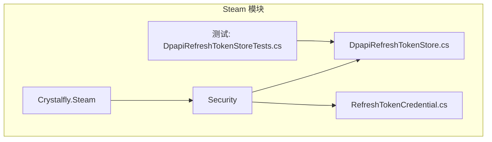
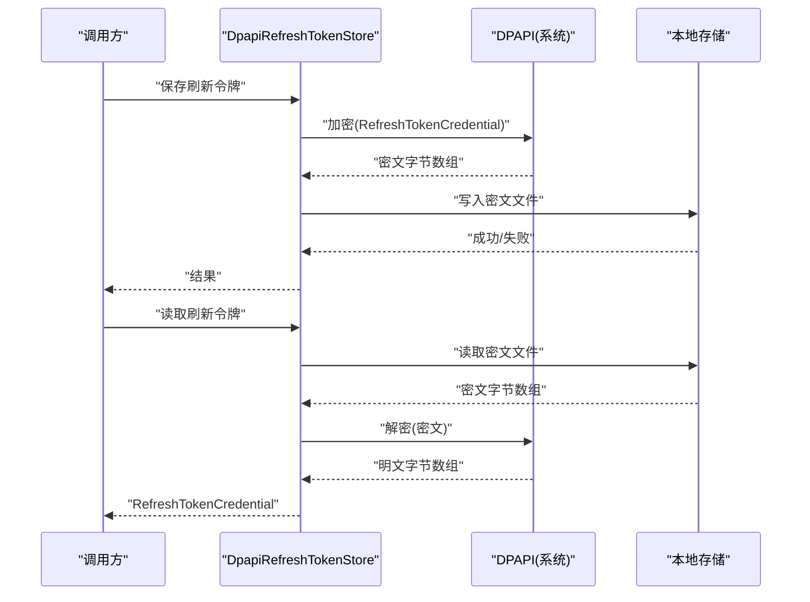
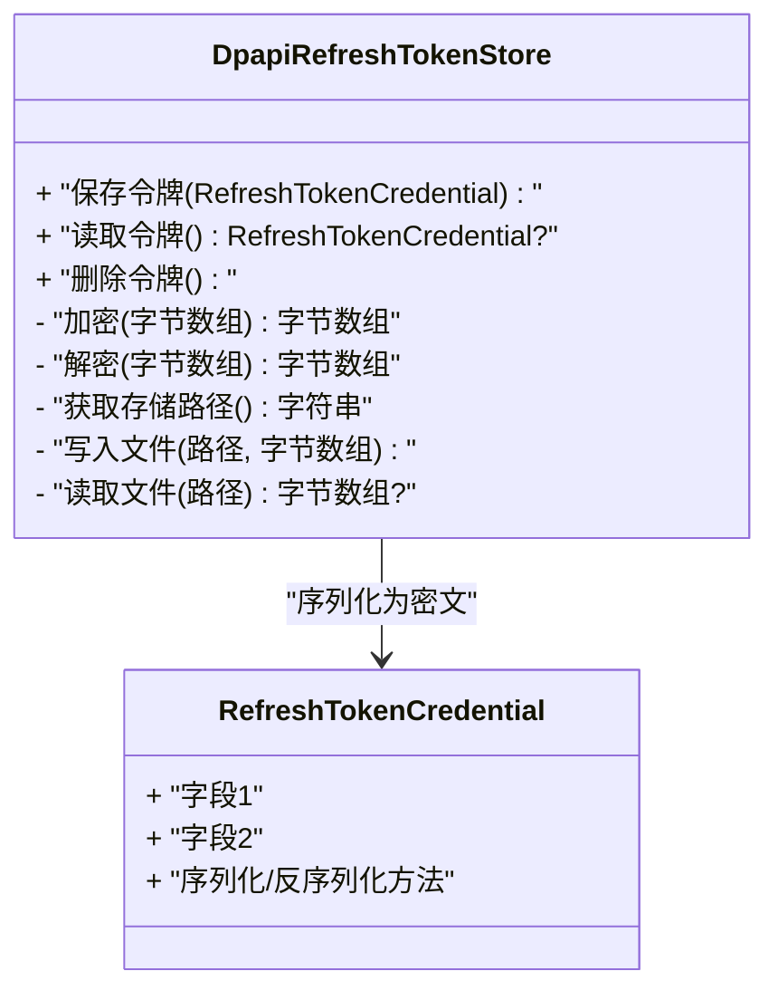
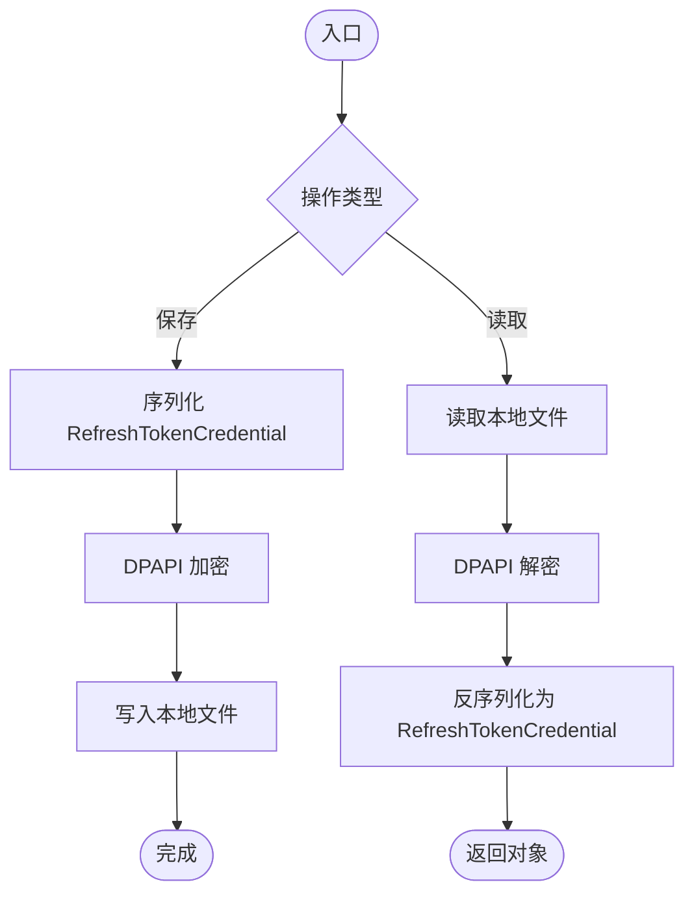
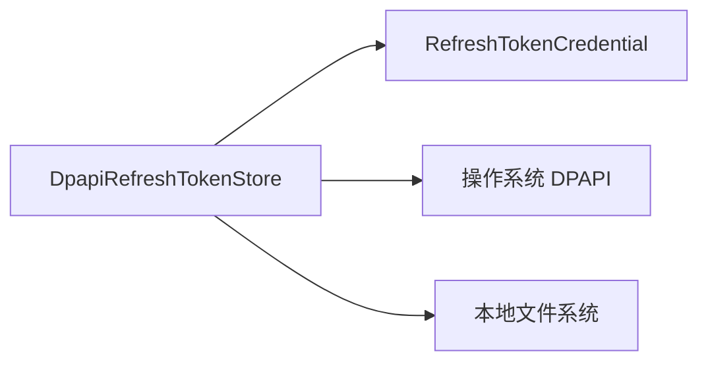

# Steam 安全存储

<cite>
**本文引用的文件**   
- [DpapiRefreshTokenStore.cs](file://src/Crystalfly.Steam/Security/DpapiRefreshTokenStore.cs)
- [RefreshTokenCredential.cs](file://src/Crystalfly.Steam/Security/RefreshTokenCredential.cs)
- [DpapiRefreshTokenStoreTests.cs](file://tests/Crystalfly.Steam.Tests/Security/DpapiRefreshTokenStoreTests.cs)
</cite>

## 目录
1. [简介](#简介)
2. [项目结构](#项目结构)
3. [核心组件](#核心组件)
4. [架构总览](#架构总览)
5. [详细组件分析](#详细组件分析)
6. [依赖关系分析](#依赖关系分析)
7. [性能考虑](#性能考虑)
8. [故障排查指南](#故障排查指南)
9. [结论](#结论)
10. [附录](#附录)

## 简介
本文件面向需要理解并正确使用 Steam 安全存储机制的开发者与运维人员，重点围绕 Windows DPAPI（数据保护 API）在本地凭据持久化中的应用。文档深入解释：
- DPAPI 加密存储机制与安全令牌管理策略
- DpapiRefreshTokenStore 的实现原理：令牌的加密、解密与持久化
- RefreshTokenCredential 数据模型的设计要点与安全考量
- 如何安全地存储和检索用户凭据的实践示例（以路径引用代替代码片段）
- Windows DPAPI 的使用方式与跨平台兼容性注意事项
- 安全最佳实践、密钥管理与数据迁移策略
- 常见安全问题及其解决方案

## 项目结构
与安全存储相关的核心代码位于 Crystalfly.Steam 模块的 Security 子目录中，包含：
- DpapiRefreshTokenStore：基于 DPAPI 的刷新令牌存储实现
- RefreshTokenCredential：用于表示刷新令牌的序列化数据模型
- 单元测试覆盖：针对 DpapiRefreshTokenStore 的行为验证

图表来源
- [DpapiRefreshTokenStore.cs](file://src/Crystalfly.Steam/Security/DpapiRefreshTokenStore.cs)
- [RefreshTokenCredential.cs](file://src/Crystalfly.Steam/Security/RefreshTokenCredential.cs)
- [DpapiRefreshTokenStoreTests.cs](file://tests/Crystalfly.Steam.Tests/Security/DpapiRefreshTokenStoreTests.cs)

章节来源
- [DpapiRefreshTokenStore.cs](file://src/Crystalfly.Steam/Security/DpapiRefreshTokenStore.cs)
- [RefreshTokenCredential.cs](file://src/Crystalfly.Steam/Security/RefreshTokenCredential.cs)
- [DpapiRefreshTokenStoreTests.cs](file://tests/Crystalfly.Steam.Tests/Security/DpapiRefreshTokenStoreTests.cs)

## 核心组件
- DpapiRefreshTokenStore
  - 职责：封装刷新令牌的加密、解密与持久化操作，对外暴露统一的存取接口
  - 关键能力：
    - 使用 DPAPI 对敏感数据进行加解密
    - 将密文写入本地文件系统或受保护的存储位置
    - 提供读取、更新、删除等基础操作
- RefreshTokenCredential
  - 职责：定义刷新令牌的序列化结构，便于持久化与传输
  - 设计要点：
    - 仅承载必要字段，避免冗余
    - 支持版本演进（如增加字段时保持向后兼容）
    - 不包含明文密钥或可逆算法参数

章节来源
- [DpapiRefreshTokenStore.cs](file://src/Crystalfly.Steam/Security/DpapiRefreshTokenStore.cs)
- [RefreshTokenCredential.cs](file://src/Crystalfly.Steam/Security/RefreshTokenCredential.cs)

## 架构总览
下图展示了从调用方到 DPAPI 的端到端流程，包括令牌的加密写入与解密读取过程。

图表来源
- [DpapiRefreshTokenStore.cs](file://src/Crystalfly.Steam/Security/DpapiRefreshTokenStore.cs)
- [RefreshTokenCredential.cs](file://src/Crystalfly.Steam/Security/RefreshTokenCredential.cs)

## 详细组件分析

### DpapiRefreshTokenStore 类图

图表来源
- [DpapiRefreshTokenStore.cs](file://src/Crystalfly.Steam/Security/DpapiRefreshTokenStore.cs)
- [RefreshTokenCredential.cs](file://src/Crystalfly.Steam/Security/RefreshTokenCredential.cs)

章节来源
- [DpapiRefreshTokenStore.cs](file://src/Crystalfly.Steam/Security/DpapiRefreshTokenStore.cs)
- [RefreshTokenCredential.cs](file://src/Crystalfly.Steam/Security/RefreshTokenCredential.cs)

### 保存与读取流程（算法流程图）

图表来源
- [DpapiRefreshTokenStore.cs](file://src/Crystalfly.Steam/Security/DpapiRefreshTokenStore.cs)
- [RefreshTokenCredential.cs](file://src/Crystalfly.Steam/Security/RefreshTokenCredential.cs)

章节来源
- [DpapiRefreshTokenStore.cs](file://src/Crystalfly.Steam/Security/DpapiRefreshTokenStore.cs)
- [RefreshTokenCredential.cs](file://src/Crystalfly.Steam/Security/RefreshTokenCredential.cs)

### 安全令牌管理策略
- 最小权限原则：仅存储必要的令牌字段，避免附带无关信息
- 生命周期管理：明确令牌的有效期与轮换策略，过期后及时清理
- 访问控制：结合操作系统级权限限制，确保只有当前用户进程可访问
- 错误处理：对解密失败、文件损坏、权限不足等情况进行统一处理与日志记录

章节来源
- [DpapiRefreshTokenStore.cs](file://src/Crystalfly.Steam/Security/DpapiRefreshTokenStore.cs)
- [RefreshTokenCredential.cs](file://src/Crystalfly.Steam/Security/RefreshTokenCredential.cs)

### 具体使用示例（以路径引用代替代码）
- 保存刷新令牌
  - 参考：[保存刷新令牌示例](file://tests/Crystalfly.Steam.Tests/Security/DpapiRefreshTokenStoreTests.cs)
- 读取刷新令牌
  - 参考：[读取刷新令牌示例](file://tests/Crystalfly.Steam.Tests/Security/DpapiRefreshTokenStoreTests.cs)
- 删除刷新令牌
  - 参考：[删除刷新令牌示例](file://tests/Crystalfly.Steam.Tests/Security/DpapiRefreshTokenStoreTests.cs)

章节来源
- [DpapiRefreshTokenStoreTests.cs](file://tests/Crystalfly.Steam.Tests/Security/DpapiRefreshTokenStoreTests.cs)

## 依赖关系分析
- 内部依赖
  - DpapiRefreshTokenStore 依赖 RefreshTokenCredential 作为数据载体
  - 两者均位于同一命名空间下，耦合度低，职责清晰
- 外部依赖
  - 依赖操作系统提供的 DPAPI 服务进行加解密
  - 依赖本地文件系统用于持久化密文

图表来源
- [DpapiRefreshTokenStore.cs](file://src/Crystalfly.Steam/Security/DpapiRefreshTokenStore.cs)
- [RefreshTokenCredential.cs](file://src/Crystalfly.Steam/Security/RefreshTokenCredential.cs)

章节来源
- [DpapiRefreshTokenStore.cs](file://src/Crystalfly.Steam/Security/DpapiRefreshTokenStore.cs)
- [RefreshTokenCredential.cs](file://src/Crystalfly.Steam/Security/RefreshTokenCredential.cs)

## 性能考虑
- 加解密开销：DPAPI 加解密为轻量级操作，但应避免频繁读写大对象
- I/O 优化：合并多次写入，减少磁盘抖动；必要时引入内存缓存（注意内存中的明文驻留时间）
- 并发安全：若存在多线程访问，需保证文件操作的原子性与一致性
- 资源释放：确保文件句柄与临时缓冲区正确释放，避免泄漏

## 故障排查指南
- 常见问题
  - 解密失败：可能由于文件被篡改、权限变更或 DPAPI 上下文不一致
  - 文件不存在：初始化阶段未创建或已被删除
  - 权限不足：当前用户无权访问目标路径或 DPAPI 上下文受限
- 定位步骤
  - 检查存储路径是否存在且可写
  - 确认 DPAPI 调用是否抛出异常及异常类型
  - 查看日志中关于序列化/反序列化的错误信息
- 恢复建议
  - 重新登录以生成新的刷新令牌
  - 清理损坏的本地密文文件后重试
  - 校验操作系统账户与权限设置

章节来源
- [DpapiRefreshTokenStore.cs](file://src/Crystalfly.Steam/Security/DpapiRefreshTokenStore.cs)
- [DpapiRefreshTokenStoreTests.cs](file://tests/Crystalfly.Steam.Tests/Security/DpapiRefreshTokenStoreTests.cs)

## 结论
通过 DpapiRefreshTokenStore 与 RefreshTokenCredential 的配合，系统在 Windows 平台上实现了安全的刷新令牌本地存储。该方案利用 DPAPI 提供的基础加密能力，结合严格的访问控制与错误处理，有效降低了凭据泄露风险。建议在跨平台场景下评估替代方案，并在生产环境中遵循最小权限与定期轮换的安全策略。

## 附录

### Windows DPAPI 使用方法与跨平台兼容性
- Windows DPAPI
  - 适合本地用户上下文下的敏感数据保护
  - 无需自行管理密钥，由操作系统负责密钥派生与保护
- 跨平台兼容性
  - DPAPI 仅在 Windows 上可用
  - 在非 Windows 平台应提供抽象层与备选实现（例如使用平台特定的 Keychain/Keystore）
  - 通过配置开关或运行时检测选择合适实现

### 安全最佳实践
- 最小化敏感数据：仅存储必要字段，避免冗余
- 短期驻留：尽量缩短明文在内存中的停留时间
- 完整性校验：对密文附加校验值，防止篡改
- 定期轮换：建立令牌轮换与清理策略
- 审计与日志：记录关键操作但不输出敏感内容

### 密钥管理与数据迁移策略
- 密钥管理
  - 优先使用系统提供的密钥管理服务（如 DPAPI、Keychain）
  - 避免硬编码或外置密钥文件
- 数据迁移
  - 为数据模型引入版本号，支持向前/向后兼容
  - 迁移脚本应在应用启动时自动执行，并提供回滚机制
  - 迁移前备份原始数据，确保可恢复