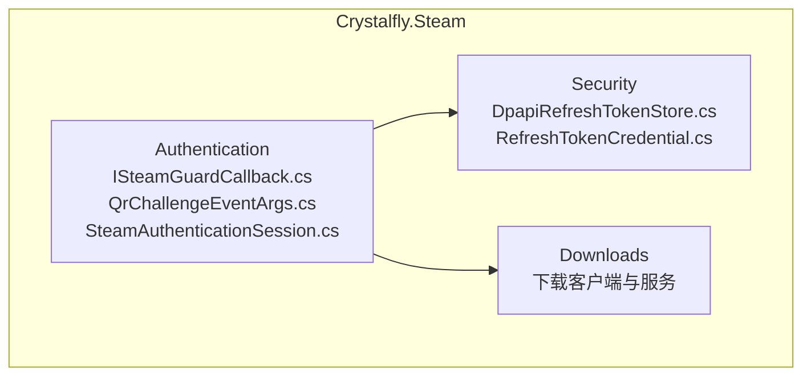
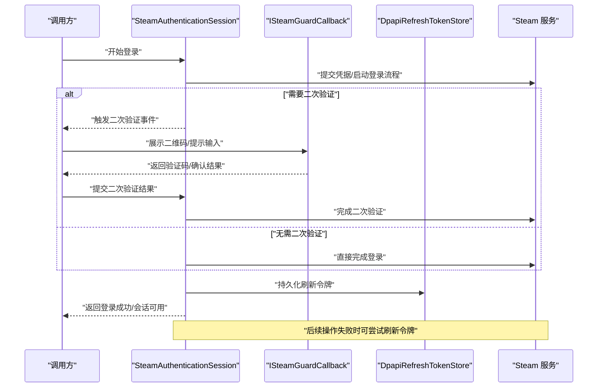
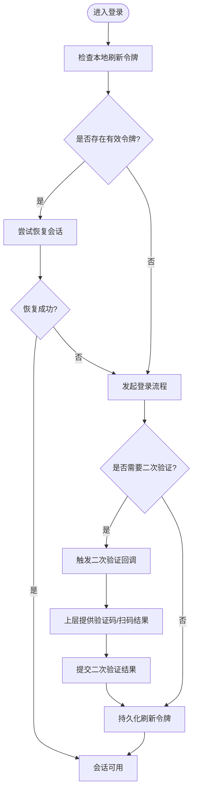
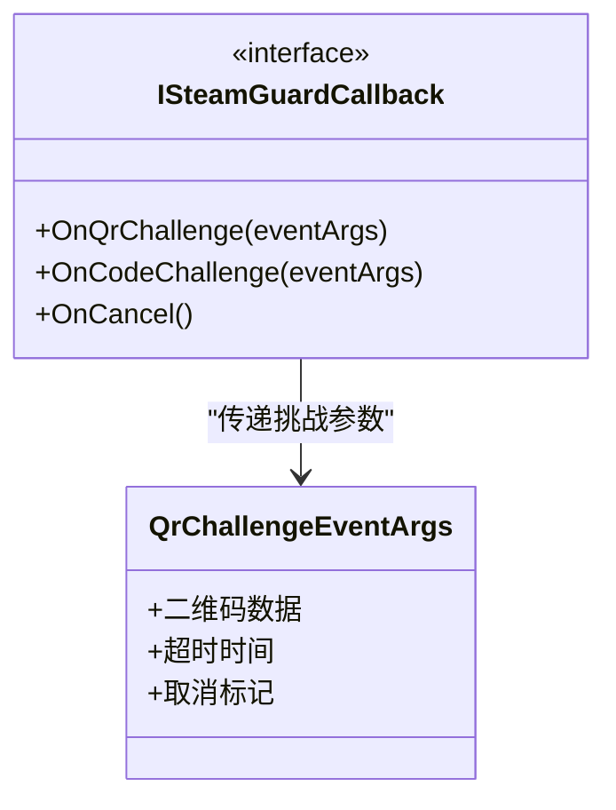
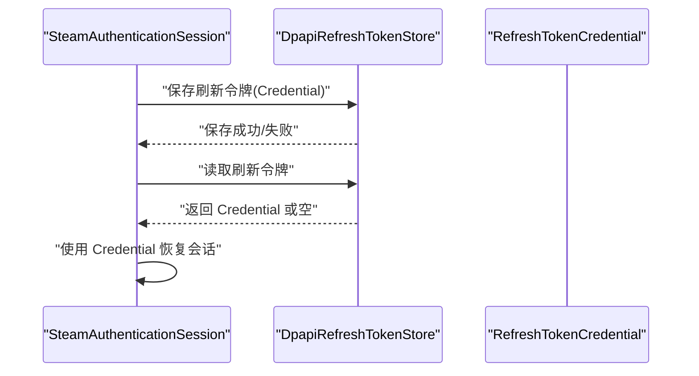
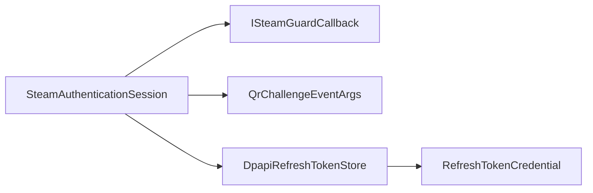

# Steam 认证系统

<cite>
**本文引用的文件**   
- [ISteamGuardCallback.cs](file://src/Crystalfly.Steam/Authentication/ISteamGuardCallback.cs)
- [QrChallengeEventArgs.cs](file://src/Crystalfly.Steam/Authentication/QrChallengeEventArgs.cs)
- [SteamAuthenticationSession.cs](file://src/Crystalfly.Steam/Authentication/SteamAuthenticationSession.cs)
- [DpapiRefreshTokenStore.cs](file://src/Crystalfly.Steam/Security/DpapiRefreshTokenStore.cs)
- [RefreshTokenCredential.cs](file://src/Crystalfly.Steam/Security/RefreshTokenCredential.cs)
- [Crystalfly.Steam.csproj](file://src/Crystalfly.Steam/Crystalfly.Steam.csproj)
</cite>

## 目录
1. [简介](#简介)
2. [项目结构](#项目结构)
3. [核心组件](#核心组件)
4. [架构总览](#架构总览)
5. [详细组件分析](#详细组件分析)
6. [依赖关系分析](#依赖关系分析)
7. [性能考虑](#性能考虑)
8. [故障排查指南](#故障排查指南)
9. [结论](#结论)
10. [附录](#附录)

## 简介
本文件面向需要集成或扩展 Steam 认证能力的开发者，聚焦以下目标：
- 用户认证流程、会话管理与双重验证（Steam Guard）处理机制
- SteamAuthenticationSession 类的工作原理：登录状态维护、令牌刷新与会话恢复
- ISteamGuardCallback 接口的设计与实现要点：二维码挑战与用户交互
- 具体使用示例路径：如何进行用户认证、处理回调与管理认证状态
- 与核心模块的集成方式与错误处理策略
- 常见问题排查与解决方案

## 项目结构
Steam 认证相关代码位于 Crystalfly.Steam 项目中，主要包含：
- Authentication：认证会话与二次验证回调
- Security：刷新令牌的安全存储与凭据模型
- Downloads：下载子系统（与认证间接相关，用于登录后访问受保护资源）

图表来源
- [Crystalfly.Steam.csproj](file://src/Crystalfly.Steam/Crystalfly.Steam.csproj)

章节来源
- [Crystalfly.Steam.csproj](file://src/Crystalfly.Steam/Crystalfly.Steam.csproj)

## 核心组件
- SteamAuthenticationSession：封装完整的 Steam 登录生命周期，包括发起登录、处理二次验证、维护会话状态、刷新令牌与会话恢复。
- ISteamGuardCallback：定义二次验证（如二维码扫描）的用户交互契约，供上层 UI 或自动化流程实现。
- QrChallengeEventArgs：承载二维码挑战事件的数据载体。
- DpapiRefreshTokenStore：基于 DPAPI 安全持久化刷新令牌。
- RefreshTokenCredential：刷新令牌的序列化模型。

章节来源
- [SteamAuthenticationSession.cs](file://src/Crystalfly.Steam/Authentication/SteamAuthenticationSession.cs)
- [ISteamGuardCallback.cs](file://src/Crystalfly.Steam/Authentication/ISteamGuardCallback.cs)
- [QrChallengeEventArgs.cs](file://src/Crystalfly.Steam/Authentication/QrChallengeEventArgs.cs)
- [DpapiRefreshTokenStore.cs](file://src/Crystalfly.Steam/Security/DpapiRefreshTokenStore.cs)
- [RefreshTokenCredential.cs](file://src/Crystalfly.Steam/Security/RefreshTokenCredential.cs)

## 架构总览
下图展示了认证主流程中关键对象之间的协作关系：调用方通过会话发起登录；当触发二次验证时，会话抛出回调事件由上层处理；成功后会话保存刷新令牌并对外暴露可用状态；后续请求可自动刷新令牌以维持会话。

图表来源
- [SteamAuthenticationSession.cs](file://src/Crystalfly.Steam/Authentication/SteamAuthenticationSession.cs)
- [ISteamGuardCallback.cs](file://src/Crystalfly.Steam/Authentication/ISteamGuardCallback.cs)
- [DpapiRefreshTokenStore.cs](file://src/Crystalfly.Steam/Security/DpapiRefreshTokenStore.cs)

## 详细组件分析

### SteamAuthenticationSession 工作原理
职责概览
- 登录状态维护：跟踪是否已登录、是否需要二次验证、当前令牌有效性等。
- 令牌刷新：在访问受限资源失败或令牌过期时，使用持久化的刷新令牌获取新的访问令牌。
- 会话恢复：应用重启后从安全存储加载刷新令牌，快速恢复可用会话。
- 二次验证处理：当服务端要求二次验证时，通过回调通知上层进行用户交互。

关键行为
- 初始化：加载本地刷新令牌（若存在），尝试静默恢复会话。
- 登录流程：根据是否需要二次验证分流到不同分支；完成后持久化刷新令牌。
- 刷新流程：捕获令牌失效错误，使用刷新令牌换取新令牌并更新内部状态。
- 退出清理：清除内存中的敏感信息，必要时移除本地持久化数据。

图表来源
- [SteamAuthenticationSession.cs](file://src/Crystalfly.Steam/Authentication/SteamAuthenticationSession.cs)
- [DpapiRefreshTokenStore.cs](file://src/Crystalfly.Steam/Security/DpapiRefreshTokenStore.cs)

章节来源
- [SteamAuthenticationSession.cs](file://src/Crystalfly.Steam/Authentication/SteamAuthenticationSession.cs)
- [DpapiRefreshTokenStore.cs](file://src/Crystalfly.Steam/Security/DpapiRefreshTokenStore.cs)

### ISteamGuardCallback 接口设计
设计目标
- 解耦二次验证的用户交互逻辑与认证核心流程。
- 支持多种交互形式：二维码展示、手动输入验证码、推送通知确认等。
- 提供明确的事件语义与超时/取消能力，便于上层管理用户体验。

典型方法约定（概念性说明）
- OnQrChallenge：收到二维码挑战时，向用户展示二维码并等待扫描结果。
- OnCodeChallenge：收到一次性验证码时，提示用户输入。
- OnCancel：允许上层取消当前认证流程。

图表来源
- [ISteamGuardCallback.cs](file://src/Crystalfly.Steam/Authentication/ISteamGuardCallback.cs)
- [QrChallengeEventArgs.cs](file://src/Crystalfly.Steam/Authentication/QrChallengeEventArgs.cs)

章节来源
- [ISteamGuardCallback.cs](file://src/Crystalfly.Steam/Authentication/ISteamGuardCallback.cs)
- [QrChallengeEventArgs.cs](file://src/Crystalfly.Steam/Authentication/QrChallengeEventArgs.cs)

### 刷新令牌与安全存储
职责划分
- DpapiRefreshTokenStore：负责将刷新令牌安全地写入操作系统级加密存储，避免明文落盘。
- RefreshTokenCredential：表示刷新令牌的序列化结构，便于跨进程/重启读取。

典型流程
- 登录成功后，将刷新令牌写入安全存储。
- 应用启动时尝试读取并恢复会话。
- 令牌刷新失败时，清理无效凭据并引导重新登录。

图表来源
- [DpapiRefreshTokenStore.cs](file://src/Crystalfly.Steam/Security/DpapiRefreshTokenStore.cs)
- [RefreshTokenCredential.cs](file://src/Crystalfly.Steam/Security/RefreshTokenCredential.cs)
- [SteamAuthenticationSession.cs](file://src/Crystalfly.Steam/Authentication/SteamAuthenticationSession.cs)

章节来源
- [DpapiRefreshTokenStore.cs](file://src/Crystalfly.Steam/Security/DpapiRefreshTokenStore.cs)
- [RefreshTokenCredential.cs](file://src/Crystalfly.Steam/Security/RefreshTokenCredential.cs)
- [SteamAuthenticationSession.cs](file://src/Crystalfly.Steam/Authentication/SteamAuthenticationSession.cs)

### 使用示例（路径指引）
以下为常见用法的“代码片段路径”指引，请根据实际文件定位对应实现与调用点：
- 发起用户认证
  - 参考路径：[SteamAuthenticationSession.cs](file://src/Crystalfly.Steam/Authentication/SteamAuthenticationSession.cs)
- 处理二次验证回调（二维码/验证码）
  - 参考路径：[ISteamGuardCallback.cs](file://src/Crystalfly.Steam/Authentication/ISteamGuardCallback.cs)、[QrChallengeEventArgs.cs](file://src/Crystalfly.Steam/Authentication/QrChallengeEventArgs.cs)
- 管理认证状态（登录成功/失败/已过期）
  - 参考路径：[SteamAuthenticationSession.cs](file://src/Crystalfly.Steam/Authentication/SteamAuthenticationSession.cs)
- 刷新令牌与会话恢复
  - 参考路径：[DpapiRefreshTokenStore.cs](file://src/Crystalfly.Steam/Security/DpapiRefreshTokenStore.cs)、[RefreshTokenCredential.cs](file://src/Crystalfly.Steam/Security/RefreshTokenCredential.cs)

章节来源
- [SteamAuthenticationSession.cs](file://src/Crystalfly.Steam/Authentication/SteamAuthenticationSession.cs)
- [ISteamGuardCallback.cs](file://src/Crystalfly.Steam/Authentication/ISteamGuardCallback.cs)
- [QrChallengeEventArgs.cs](file://src/Crystalfly.Steam/Authentication/QrChallengeEventArgs.cs)
- [DpapiRefreshTokenStore.cs](file://src/Crystalfly.Steam/Security/DpapiRefreshTokenStore.cs)
- [RefreshTokenCredential.cs](file://src/Crystalfly.Steam/Security/RefreshTokenCredential.cs)

## 依赖关系分析
- 组件内聚
  - Authentication 层专注于认证流程编排与事件驱动交互。
  - Security 层专注凭据的安全存取，降低认证层的复杂度。
- 外部依赖
  - 底层依赖 SteamKit 提供的 Steam 协议能力（通过会话内部使用）。
  - 依赖操作系统 DPAPI 进行本地凭据加密存储。
- 耦合点
  - 会话与回调接口松耦合，便于替换不同的二次验证交互实现。
  - 会话与存储抽象清晰，便于更换存储后端（当前为 DPAPI）。

图表来源
- [SteamAuthenticationSession.cs](file://src/Crystalfly.Steam/Authentication/SteamAuthenticationSession.cs)
- [ISteamGuardCallback.cs](file://src/Crystalfly.Steam/Authentication/ISteamGuardCallback.cs)
- [QrChallengeEventArgs.cs](file://src/Crystalfly.Steam/Authentication/QrChallengeEventArgs.cs)
- [DpapiRefreshTokenStore.cs](file://src/Crystalfly.Steam/Security/DpapiRefreshTokenStore.cs)
- [RefreshTokenCredential.cs](file://src/Crystalfly.Steam/Security/RefreshTokenCredential.cs)

章节来源
- [Crystalfly.Steam.csproj](file://src/Crystalfly.Steam/Crystalfly.Steam.csproj)

## 性能考虑
- 减少不必要的网络往返：优先使用本地刷新令牌恢复会话，仅在失败时再走完整登录流程。
- 异步与超时控制：二次验证回调应支持超时与取消，避免阻塞主线程。
- 最小化敏感数据驻留内存：认证成功后尽快将敏感信息转入安全存储，并在不需要时释放引用。
- 重试与退避：令牌刷新失败时应采用指数退避与最大重试次数限制，避免雪崩。

## 故障排查指南
常见问题与定位建议
- 无法显示二维码或二维码无效
  - 检查回调实现是否正确消费 QrChallengeEventArgs 并返回有效结果。
  - 参考路径：[QrChallengeEventArgs.cs](file://src/Crystalfly.Steam/Authentication/QrChallengeEventArgs.cs)、[ISteamGuardCallback.cs](file://src/Crystalfly.Steam/Authentication/ISteamGuardCallback.cs)
- 二次验证超时或被取消
  - 确保上层在超时前完成用户交互，或在取消时正确终止会话流程。
  - 参考路径：[SteamAuthenticationSession.cs](file://src/Crystalfly.Steam/Authentication/SteamAuthenticationSession.cs)
- 刷新令牌无效或丢失
  - 检查 DPAPI 存储权限与平台兼容性；确认凭据模型未损坏。
  - 参考路径：[DpapiRefreshTokenStore.cs](file://src/Crystalfly.Steam/Security/DpapiRefreshTokenStore.cs)、[RefreshTokenCredential.cs](file://src/Crystalfly.Steam/Security/RefreshTokenCredential.cs)
- 登录成功但后续请求仍被拒绝
  - 确认会话是否成功刷新令牌并更新内部状态；必要时强制重新登录。
  - 参考路径：[SteamAuthenticationSession.cs](file://src/Crystalfly.Steam/Authentication/SteamAuthenticationSession.cs)

章节来源
- [SteamAuthenticationSession.cs](file://src/Crystalfly.Steam/Authentication/SteamAuthenticationSession.cs)
- [ISteamGuardCallback.cs](file://src/Crystalfly.Steam/Authentication/ISteamGuardCallback.cs)
- [QrChallengeEventArgs.cs](file://src/Crystalfly.Steam/Authentication/QrChallengeEventArgs.cs)
- [DpapiRefreshTokenStore.cs](file://src/Crystalfly.Steam/Security/DpapiRefreshTokenStore.cs)
- [RefreshTokenCredential.cs](file://src/Crystalfly.Steam/Security/RefreshTokenCredential.cs)

## 结论
本认证子系统围绕 SteamAuthenticationSession 构建，结合 ISteamGuardCallback 的回调机制与 DPAPI 安全存储，实现了完整的用户认证、二次验证、令牌刷新与会话恢复能力。通过清晰的职责分离与事件驱动设计，既保证了安全性，也提供了良好的可扩展性与可测试性。

## 附录
- 术语
  - 刷新令牌：用于在访问令牌过期时换取新令牌的长期凭证。
  - 二次验证：登录过程中额外的身份校验步骤，如二维码扫描或一次性验证码。
- 最佳实践
  - 始终在失败路径上清理敏感数据。
  - 为所有外部交互设置合理的超时与重试策略。
  - 对二次验证交互提供明确的取消与回退路径。