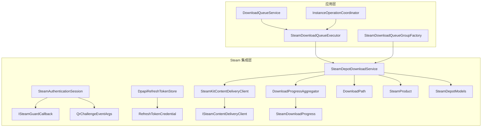
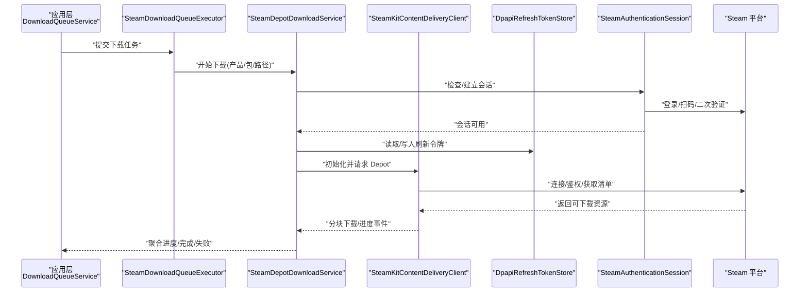
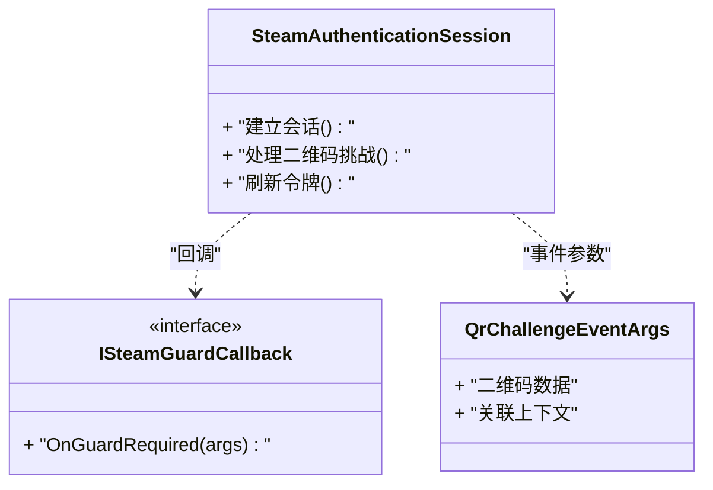
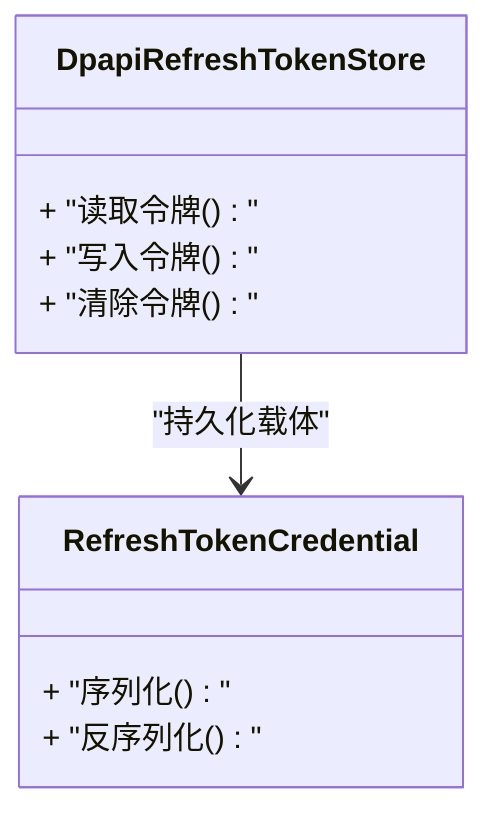
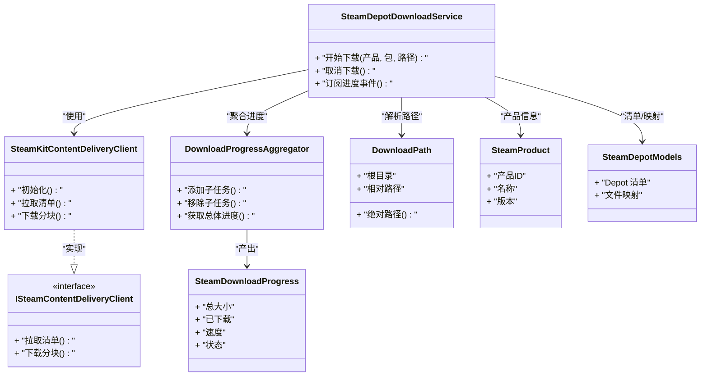
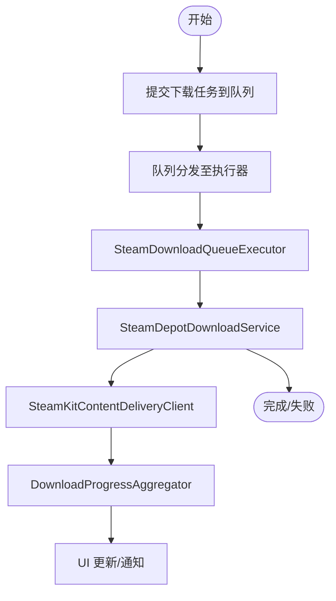
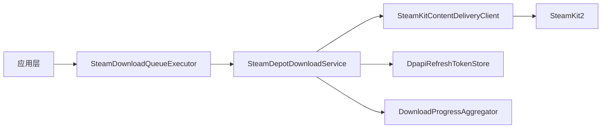

# Steam 集成

<cite>
**本文引用的文件**   
- [Crystalfly.Steam.csproj](file://src/Crystalfly.Steam/Crystalfly.Steam.csproj)
- [SteamAuthenticationSession.cs](file://src/Crystalfly.Steam/Authentication/SteamAuthenticationSession.cs)
- [ISteamGuardCallback.cs](file://src/Crystalfly.Steam/Authentication/ISteamGuardCallback.cs)
- [QrChallengeEventArgs.cs](file://src/Crystalfly.Steam/Authentication/QrChallengeEventArgs.cs)
- [DpapiRefreshTokenStore.cs](file://src/Crystalfly.Steam/Security/DpapiRefreshTokenStore.cs)
- [RefreshTokenCredential.cs](file://src/Crystalfly.Steam/Security/RefreshTokenCredential.cs)
- [SteamDepotDownloadService.cs](file://src/Crystalfly.Steam/Downloads/SteamDepotDownloadService.cs)
- [SteamKitContentDeliveryClient.cs](file://src/Crystalfly.Steam/Downloads/SteamKitContentDeliveryClient.cs)
- [ISteamContentDeliveryClient.cs](file://src/Crystalfly.Steam/Downloads/ISteamContentDeliveryClient.cs)
- [SteamProduct.cs](file://src/Crystalfly.Steam/Downloads/SteamProduct.cs)
- [SteamDepotModels.cs](file://src/Crystalfly.Steam/Downloads/SteamDepotModels.cs)
- [DownloadProgressAggregator.cs](file://src/Crystalfly.Steam/Downloads/DownloadProgressAggregator.cs)
- [SteamDownloadProgress.cs](file://src/Crystalfly.Steam/Downloads/SteamDownloadProgress.cs)
- [DownloadPath.cs](file://src/Crystalfly.Steam/Downloads/DownloadPath.cs)
- [SteamDownloadQueueExecutor.cs](file://src/Crystalfly.App/Downloads/SteamDownloadQueueExecutor.cs)
- [SteamDownloadQueueGroupFactory.cs](file://src/Crystalfly.App/Downloads/SteamDownloadQueueGroupFactory.cs)
- [CatalogPackageQueueExecutor.cs](file://src/Crystalfly.App/Downloads/CatalogPackageQueueExecutor.cs)
- [DownloadQueueService.cs](file://src/Crystalfly.App/Downloads/DownloadQueueService.cs)
- [InstanceOperationCoordinator.cs](file://src/Crystalfly.App/Downloads/InstanceOperationCoordinator.cs)
- [ModInstallQueueGroupFactory.cs](file://src/Crystalfly.App/Downloads/ModInstallQueueGroupFactory.cs)
- [ModDependencyRepairQueueGroupFactory.cs](file://src/Crystalfly.App/Downloads/ModDependencyRepairQueueGroupFactory.cs)
- [IDownloadQueueExecutor.cs](file://src/Crystalfly.App/Downloads/IDownloadQueueExecutor.cs)
- [DownloadQueueModels.cs](file://src/Crystalfly.App/Downloads/DownloadQueueModels.cs)
</cite>

## 目录
1. [简介](#简介)
2. [项目结构](#项目结构)
3. [核心组件](#核心组件)
4. [架构总览](#架构总览)
5. [详细组件分析](#详细组件分析)
6. [依赖关系分析](#依赖关系分析)
7. [性能考虑](#性能考虑)
8. [故障排查指南](#故障排查指南)
9. [结论](#结论)
10. [附录](#附录)

## 简介
本章节面向需要集成 Steam 平台能力的开发者，系统性说明 Crystalfly 的 Steam 集成模块。内容涵盖：
- Steam 认证流程、授权机制与安全令牌管理
- 基于 SteamKit2 的内容下载服务（Depot 下载）、进度监控与错误处理
- 与 Crystalfly 应用层下载队列及实例操作的集成方式
- API 接口、配置选项与异常处理策略
- 常见问题与解决方案

## 项目结构
Steam 集成主要位于 src/Crystalfly.Steam 工程内，按职责划分为 Authentication、Security、Downloads 三个子域；应用层在 Crystalfly.App 中提供下载队列执行器与工厂，将 Steam 能力接入统一下载编排。

图表来源
- [SteamDownloadQueueExecutor.cs](file://src/Crystalfly.App/Downloads/SteamDownloadQueueExecutor.cs)
- [SteamDownloadQueueGroupFactory.cs](file://src/Crystalfly.App/Downloads/SteamDownloadQueueGroupFactory.cs)
- [DownloadQueueService.cs](file://src/Crystalfly.App/Downloads/DownloadQueueService.cs)
- [InstanceOperationCoordinator.cs](file://src/Crystalfly.App/Downloads/InstanceOperationCoordinator.cs)
- [SteamDepotDownloadService.cs](file://src/Crystalfly.Steam/Downloads/SteamDepotDownloadService.cs)
- [SteamKitContentDeliveryClient.cs](file://src/Crystalfly.Steam/Downloads/SteamKitContentDeliveryClient.cs)
- [ISteamContentDeliveryClient.cs](file://src/Crystalfly.Steam/Downloads/ISteamContentDeliveryClient.cs)
- [DownloadProgressAggregator.cs](file://src/Crystalfly.Steam/Downloads/DownloadProgressAggregator.cs)
- [SteamDownloadProgress.cs](file://src/Crystalfly.Steam/Downloads/SteamDownloadProgress.cs)
- [DownloadPath.cs](file://src/Crystalfly.Steam/Downloads/DownloadPath.cs)
- [SteamProduct.cs](file://src/Crystalfly.Steam/Downloads/SteamProduct.cs)
- [SteamDepotModels.cs](file://src/Crystalfly.Steam/Downloads/SteamDepotModels.cs)
- [SteamAuthenticationSession.cs](file://src/Crystalfly.Steam/Authentication/SteamAuthenticationSession.cs)
- [ISteamGuardCallback.cs](file://src/Crystalfly.Steam/Authentication/ISteamGuardCallback.cs)
- [QrChallengeEventArgs.cs](file://src/Crystalfly.Steam/Authentication/QrChallengeEventArgs.cs)
- [DpapiRefreshTokenStore.cs](file://src/Crystalfly.Steam/Security/DpapiRefreshTokenStore.cs)
- [RefreshTokenCredential.cs](file://src/Crystalfly.Steam/Security/RefreshTokenCredential.cs)

章节来源
- [Crystalfly.Steam.csproj](file://src/Crystalfly.Steam/Crystalfly.Steam.csproj)

## 核心组件
- 认证与会话
  - 会话管理：负责发起登录、处理二维码挑战、维护会话生命周期。
  - 安全回调：定义二次验证事件契约，便于上层 UI 或自动化流程响应。
  - 二维码挑战参数：封装二维码相关事件数据。
- 安全令牌存储
  - DPAPI 刷新令牌存储：使用系统级加密持久化刷新令牌，降低泄露风险。
  - 刷新令牌凭据：抽象令牌数据结构与序列化边界。
- 内容下载服务
  - Depot 下载服务：协调 SteamKit 客户端、产品与路径解析、聚合进度、触发下载任务。
  - SteamKit 交付客户端：封装对 SteamKit2 的调用，屏蔽底层细节。
  - 交付客户端接口：为测试与替换实现提供契约。
  - 进度聚合器与模型：汇总多文件/多包下载进度，暴露稳定事件。
  - 下载路径与产品模型：标准化目标路径与产品信息。
- 应用层集成
  - Steam 下载队列执行器：将 Steam 下载能力接入统一队列执行框架。
  - Steam 下载队列组工厂：根据业务场景创建下载组。
  - 通用下载服务与实例操作协调器：驱动队列、编排安装/修复等实例操作。

章节来源
- [SteamAuthenticationSession.cs](file://src/Crystalfly.Steam/Authentication/SteamAuthenticationSession.cs)
- [ISteamGuardCallback.cs](file://src/Crystalfly.Steam/Authentication/ISteamGuardCallback.cs)
- [QrChallengeEventArgs.cs](file://src/Crystalfly.Steam/Authentication/QrChallengeEventArgs.cs)
- [DpapiRefreshTokenStore.cs](file://src/Crystalfly.Steam/Security/DpapiRefreshTokenStore.cs)
- [RefreshTokenCredential.cs](file://src/Crystalfly.Steam/Security/RefreshTokenCredential.cs)
- [SteamDepotDownloadService.cs](file://src/Crystalfly.Steam/Downloads/SteamDepotDownloadService.cs)
- [SteamKitContentDeliveryClient.cs](file://src/Crystalfly.Steam/Downloads/SteamKitContentDeliveryClient.cs)
- [ISteamContentDeliveryClient.cs](file://src/Crystalfly.Steam/Downloads/ISteamContentDeliveryClient.cs)
- [DownloadProgressAggregator.cs](file://src/Crystalfly.Steam/Downloads/DownloadProgressAggregator.cs)
- [SteamDownloadProgress.cs](file://src/Crystalfly.Steam/Downloads/SteamDownloadProgress.cs)
- [DownloadPath.cs](file://src/Crystalfly.Steam/Downloads/DownloadPath.cs)
- [SteamProduct.cs](file://src/Crystalfly.Steam/Downloads/SteamProduct.cs)
- [SteamDepotModels.cs](file://src/Crystalfly.Steam/Downloads/SteamDepotModels.cs)
- [SteamDownloadQueueExecutor.cs](file://src/Crystalfly.App/Downloads/SteamDownloadQueueExecutor.cs)
- [SteamDownloadQueueGroupFactory.cs](file://src/Crystalfly.App/Downloads/SteamDownloadQueueGroupFactory.cs)
- [DownloadQueueService.cs](file://src/Crystalfly.App/Downloads/DownloadQueueService.cs)
- [InstanceOperationCoordinator.cs](file://src/Crystalfly.App/Downloads/InstanceOperationCoordinator.cs)

## 架构总览
下图展示从应用层到 Steam 平台的端到端交互：应用通过下载队列调度任务，Steam 下载服务协调认证、令牌、产品与路径信息，最终由 SteamKit 客户端完成 Depot 内容拉取并上报进度。

图表来源
- [DownloadQueueService.cs](file://src/Crystalfly.App/Downloads/DownloadQueueService.cs)
- [SteamDownloadQueueExecutor.cs](file://src/Crystalfly.App/Downloads/SteamDownloadQueueExecutor.cs)
- [SteamDepotDownloadService.cs](file://src/Crystalfly.Steam/Downloads/SteamDepotDownloadService.cs)
- [SteamKitContentDeliveryClient.cs](file://src/Crystalfly.Steam/Downloads/SteamKitContentDeliveryClient.cs)
- [DpapiRefreshTokenStore.cs](file://src/Crystalfly.Steam/Security/DpapiRefreshTokenStore.cs)
- [SteamAuthenticationSession.cs](file://src/Crystalfly.Steam/Authentication/SteamAuthenticationSession.cs)

## 详细组件分析

### 认证与会话
- 会话管理
  - 负责启动登录流程、处理二维码挑战、维持会话有效性。
  - 与二次验证回调协作，向 UI 或自动化流程推送扫码/验证码输入提示。
- 安全回调与二维码参数
  - 回调接口用于解耦认证过程与上层展示逻辑。
  - 二维码事件参数携带必要上下文，便于生成二维码或引导用户操作。
- 最佳实践
  - 在首次登录时引导用户完成二次验证，后续尽量复用刷新令牌减少交互。
  - 对二维码挑战进行超时与重试控制，避免阻塞主线程。

图表来源
- [SteamAuthenticationSession.cs](file://src/Crystalfly.Steam/Authentication/SteamAuthenticationSession.cs)
- [ISteamGuardCallback.cs](file://src/Crystalfly.Steam/Authentication/ISteamGuardCallback.cs)
- [QrChallengeEventArgs.cs](file://src/Crystalfly.Steam/Authentication/QrChallengeEventArgs.cs)

章节来源
- [SteamAuthenticationSession.cs](file://src/Crystalfly.Steam/Authentication/SteamAuthenticationSession.cs)
- [ISteamGuardCallback.cs](file://src/Crystalfly.Steam/Authentication/ISteamGuardCallback.cs)
- [QrChallengeEventArgs.cs](file://src/Crystalfly.Steam/Authentication/QrChallengeEventArgs.cs)

### 安全令牌管理
- DPAPI 刷新令牌存储
  - 使用操作系统提供的 DPAPI 对刷新令牌进行加密持久化，降低明文泄露风险。
  - 提供统一的读写接口，供认证与会话模块访问。
- 刷新令牌凭据
  - 定义令牌的序列化和传输边界，确保在不同进程/重启后仍可恢复会话。
- 最佳实践
  - 仅在必要时更新令牌，避免频繁 IO。
  - 对解密失败、权限不足等异常进行明确分类与日志记录。

图表来源
- [DpapiRefreshTokenStore.cs](file://src/Crystalfly.Steam/Security/DpapiRefreshTokenStore.cs)
- [RefreshTokenCredential.cs](file://src/Crystalfly.Steam/Security/RefreshTokenCredential.cs)

章节来源
- [DpapiRefreshTokenStore.cs](file://src/Crystalfly.Steam/Security/DpapiRefreshTokenStore.cs)
- [RefreshTokenCredential.cs](file://src/Crystalfly.Steam/Security/RefreshTokenCredential.cs)

### 内容下载服务（Depot）
- 设计要点
  - 以“产品+包+路径”为核心维度组织下载任务。
  - 通过 SteamKit 客户端与 Steam 平台交互，拉取 Depot 清单与分块数据。
  - 使用进度聚合器汇总多文件/多包的下载状态，向上层暴露稳定事件。
- 关键类职责
  - 下载服务：协调认证、令牌、产品与路径，调度下载任务。
  - 交付客户端：封装 SteamKit2 调用，屏蔽网络与协议细节。
  - 进度聚合器：合并多个子任务的进度，计算总体百分比与速率。
  - 路径与产品模型：标准化输出目录与产品信息。
- 错误处理
  - 区分网络错误、认证失效、Depot 不可用、磁盘空间不足等错误类型。
  - 支持断点续传与重试策略，提升鲁棒性。

图表来源
- [SteamDepotDownloadService.cs](file://src/Crystalfly.Steam/Downloads/SteamDepotDownloadService.cs)
- [SteamKitContentDeliveryClient.cs](file://src/Crystalfly.Steam/Downloads/SteamKitContentDeliveryClient.cs)
- [ISteamContentDeliveryClient.cs](file://src/Crystalfly.Steam/Downloads/ISteamContentDeliveryClient.cs)
- [DownloadProgressAggregator.cs](file://src/Crystalfly.Steam/Downloads/DownloadProgressAggregator.cs)
- [SteamDownloadProgress.cs](file://src/Crystalfly.Steam/Downloads/SteamDownloadProgress.cs)
- [DownloadPath.cs](file://src/Crystalfly.Steam/Downloads/DownloadPath.cs)
- [SteamProduct.cs](file://src/Crystalfly.Steam/Downloads/SteamProduct.cs)
- [SteamDepotModels.cs](file://src/Crystalfly.Steam/Downloads/SteamDepotModels.cs)

章节来源
- [SteamDepotDownloadService.cs](file://src/Crystalfly.Steam/Downloads/SteamDepotDownloadService.cs)
- [SteamKitContentDeliveryClient.cs](file://src/Crystalfly.Steam/Downloads/SteamKitContentDeliveryClient.cs)
- [ISteamContentDeliveryClient.cs](file://src/Crystalfly.Steam/Downloads/ISteamContentDeliveryClient.cs)
- [DownloadProgressAggregator.cs](file://src/Crystalfly.Steam/Downloads/DownloadProgressAggregator.cs)
- [SteamDownloadProgress.cs](file://src/Crystalfly.Steam/Downloads/SteamDownloadProgress.cs)
- [DownloadPath.cs](file://src/Crystalfly.Steam/Downloads/DownloadPath.cs)
- [SteamProduct.cs](file://src/Crystalfly.Steam/Downloads/SteamProduct.cs)
- [SteamDepotModels.cs](file://src/Crystalfly.Steam/Downloads/SteamDepotModels.cs)

### 应用层集成（下载队列与实例操作）
- 下载队列执行器
  - 将 Steam 下载能力作为具体执行器注册到统一队列框架。
  - 负责任务入队、并发控制、取消与重试。
- 下载队列组工厂
  - 根据业务场景（如模组安装、依赖修复、目录包安装）创建下载组。
- 通用下载服务与实例操作协调器
  - 驱动队列运行，编排安装/修复等实例操作，保证一致性。

图表来源
- [SteamDownloadQueueExecutor.cs](file://src/Crystalfly.App/Downloads/SteamDownloadQueueExecutor.cs)
- [SteamDownloadQueueGroupFactory.cs](file://src/Crystalfly.App/Downloads/SteamDownloadQueueGroupFactory.cs)
- [DownloadQueueService.cs](file://src/Crystalfly.App/Downloads/DownloadQueueService.cs)
- [InstanceOperationCoordinator.cs](file://src/Crystalfly.App/Downloads/InstanceOperationCoordinator.cs)
- [SteamDepotDownloadService.cs](file://src/Crystalfly.Steam/Downloads/SteamDepotDownloadService.cs)
- [SteamKitContentDeliveryClient.cs](file://src/Crystalfly.Steam/Downloads/SteamKitContentDeliveryClient.cs)
- [DownloadProgressAggregator.cs](file://src/Crystalfly.Steam/Downloads/DownloadProgressAggregator.cs)

章节来源
- [SteamDownloadQueueExecutor.cs](file://src/Crystalfly.App/Downloads/SteamDownloadQueueExecutor.cs)
- [SteamDownloadQueueGroupFactory.cs](file://src/Crystalfly.App/Downloads/SteamDownloadQueueGroupFactory.cs)
- [DownloadQueueService.cs](file://src/Crystalfly.App/Downloads/DownloadQueueService.cs)
- [InstanceOperationCoordinator.cs](file://src/Crystalfly.App/Downloads/InstanceOperationCoordinator.cs)

### 其他执行器与模型（参考）
- 目录包执行器：用于非 Steam 资源的批量下载与安装。
- 模组安装/依赖修复队列组工厂：针对模组生态的专用下载编排。
- 下载队列模型：描述任务、分组、状态等元数据。

章节来源
- [CatalogPackageQueueExecutor.cs](file://src/Crystalfly.App/Downloads/CatalogPackageQueueExecutor.cs)
- [ModInstallQueueGroupFactory.cs](file://src/Crystalfly.App/Downloads/ModInstallQueueGroupFactory.cs)
- [ModDependencyRepairQueueGroupFactory.cs](file://src/Crystalfly.App/Downloads/ModDependencyRepairQueueGroupFactory.cs)
- [DownloadQueueModels.cs](file://src/Crystalfly.App/Downloads/DownloadQueueModels.cs)

## 依赖关系分析
- 内部依赖
  - 应用层通过接口与工厂解耦具体执行器，便于扩展与替换。
  - Steam 下载服务依赖交付客户端接口，便于单元测试与模拟。
- 外部依赖
  - 使用 SteamKit2 与 Steam 平台通信，需关注版本兼容性与许可证。
- 潜在耦合点
  - 认证与会话的生命周期管理需与令牌存储紧密配合。
  - 进度聚合器与 UI 的绑定应避免高频更新导致的卡顿。

图表来源
- [SteamDownloadQueueExecutor.cs](file://src/Crystalfly.App/Downloads/SteamDownloadQueueExecutor.cs)
- [SteamDepotDownloadService.cs](file://src/Crystalfly.Steam/Downloads/SteamDepotDownloadService.cs)
- [SteamKitContentDeliveryClient.cs](file://src/Crystalfly.Steam/Downloads/SteamKitContentDeliveryClient.cs)
- [DpapiRefreshTokenStore.cs](file://src/Crystalfly.Steam/Security/DpapiRefreshTokenStore.cs)
- [DownloadProgressAggregator.cs](file://src/Crystalfly.Steam/Downloads/DownloadProgressAggregator.cs)

章节来源
- [Crystalfly.Steam.csproj](file://src/Crystalfly.Steam/Crystalfly.Steam.csproj)

## 性能考虑
- 并发与限流
  - 合理设置并发下载数，避免带宽拥塞与 Steam 服务端限流。
  - 对大文件采用分块下载与并行校验，提高吞吐与可靠性。
- 内存与 IO
  - 使用流式写入，避免一次性加载大文件到内存。
  - 预分配缓冲区，减少 GC 压力。
- 进度上报
  - 节流 UI 更新频率，避免频繁重绘导致卡顿。
- 缓存与复用
  - 复用 SteamKit 客户端实例与会话，减少握手开销。
  - 利用本地缓存清单与索引，加速重复安装。

## 故障排查指南
- 认证失败
  - 现象：无法登录或会话过期。
  - 排查：检查刷新令牌是否有效、DPAPI 解密是否成功、二次验证是否完成。
  - 建议：捕获并记录具体错误码，提示用户重新扫码或输入验证码。
- 下载中断
  - 现象：下载中途失败或卡住。
  - 排查：确认网络连接、磁盘空间、Steam 服务器状态；检查 Depot 清单是否完整。
  - 建议：启用断点续传与自动重试，限制重试次数与退避时间。
- 权限与路径问题
  - 现象：无法写入目标目录。
  - 排查：确认路径存在且具备写入权限，避免被杀毒软件拦截。
  - 建议：提前校验路径并给出友好提示。
- 进度不更新
  - 现象：UI 长时间无变化。
  - 排查：检查进度聚合器是否正确接收子任务事件，是否存在死锁或异常吞没。
  - 建议：增加调试日志与心跳检测。

章节来源
- [SteamAuthenticationSession.cs](file://src/Crystalfly.Steam/Authentication/SteamAuthenticationSession.cs)
- [DpapiRefreshTokenStore.cs](file://src/Crystalfly.Steam/Security/DpapiRefreshTokenStore.cs)
- [SteamDepotDownloadService.cs](file://src/Crystalfly.Steam/Downloads/SteamDepotDownloadService.cs)
- [DownloadProgressAggregator.cs](file://src/Crystalfly.Steam/Downloads/DownloadProgressAggregator.cs)

## 结论
本模块通过清晰的职责划分与接口抽象，将 Steam 认证、令牌管理与 Depot 下载能力整合到统一的应用下载框架中。借助进度聚合与错误分类，提供了良好的用户体验与可观测性。建议在后续迭代中持续优化并发策略、增强错误诊断与完善文档示例。

## 附录

### API 与配置要点
- 认证与会话
  - 入口：会话建立与二维码挑战处理。
  - 配置：二次验证策略、会话超时与刷新策略。
- 令牌存储
  - 入口：读取/写入/清除刷新令牌。
  - 配置：存储位置、加密策略、备份与迁移。
- 下载服务
  - 入口：开始下载、取消下载、订阅进度。
  - 配置：并发度、重试策略、路径模板、校验策略。
- 应用集成
  - 入口：队列执行器与组工厂。
  - 配置：队列容量、优先级、取消与清理策略。

章节来源
- [SteamAuthenticationSession.cs](file://src/Crystalfly.Steam/Authentication/SteamAuthenticationSession.cs)
- [DpapiRefreshTokenStore.cs](file://src/Crystalfly.Steam/Security/DpapiRefreshTokenStore.cs)
- [SteamDepotDownloadService.cs](file://src/Crystalfly.Steam/Downloads/SteamDepotDownloadService.cs)
- [SteamDownloadQueueExecutor.cs](file://src/Crystalfly.App/Downloads/SteamDownloadQueueExecutor.cs)
- [SteamDownloadQueueGroupFactory.cs](file://src/Crystalfly.App/Downloads/SteamDownloadQueueGroupFactory.cs)

### 常见 Steam 平台问题与解决方案
- 账号二次验证未配置
  - 解决：引导用户开启并绑定手机令牌，完成首次扫码登录。
- 网络受限或代理
  - 解决：配置合适的代理或切换网络环境，避免连接超时。
- Depot 不可用或权限不足
  - 解决：确认游戏所有权与区域限制，必要时联系平台支持。
- 磁盘空间不足
  - 解决：在下载前进行空间预估与校验，预留冗余空间。

[本节为概念性指导，无需源码引用]