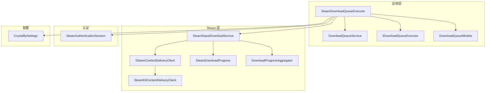
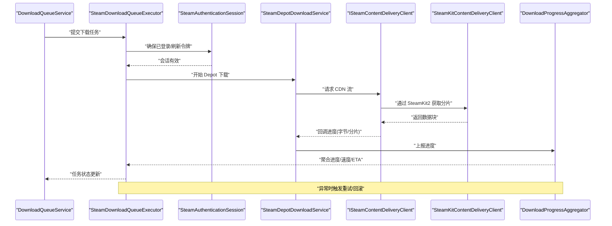
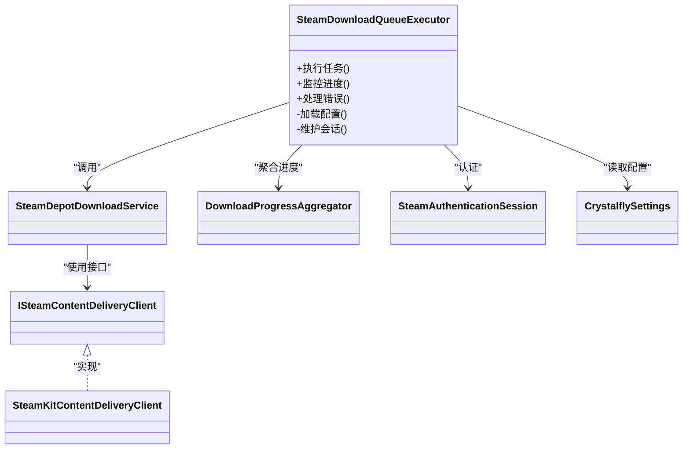
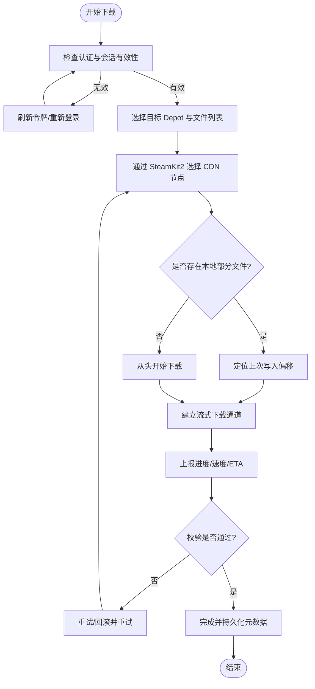
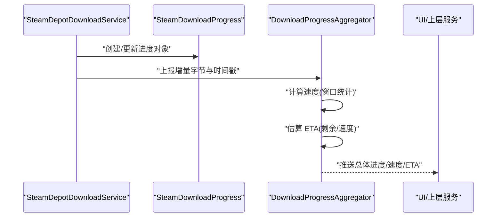
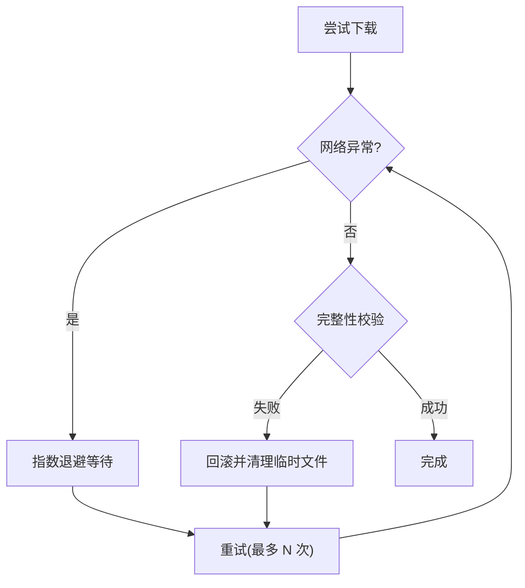
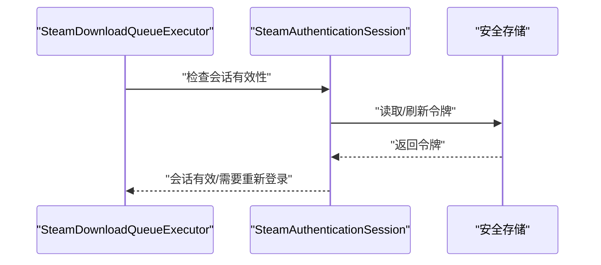
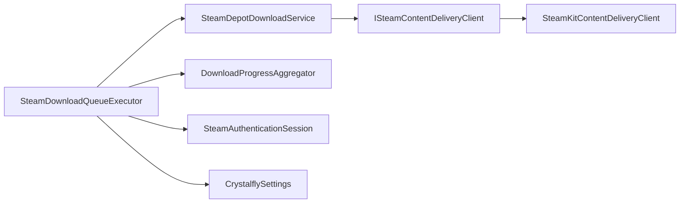

# Steam 下载执行器

<cite>
**本文引用的文件**   
- [SteamDownloadQueueExecutor.cs](file://src/Crystalfly.App/Downloads/SteamDownloadQueueExecutor.cs)
- [IDownloadQueueExecutor.cs](file://src/Crystalfly.App/Downloads/IDownloadQueueExecutor.cs)
- [DownloadQueueService.cs](file://src/Crystalfly.App/Downloads/DownloadQueueService.cs)
- [DownloadQueueModels.cs](file://src/Crystalfly.App/Downloads/DownloadQueueModels.cs)
- [SteamDepotDownloadService.cs](file://src/Crystalfly.Steam/Downloads/SteamDepotDownloadService.cs)
- [ISteamContentDeliveryClient.cs](file://src/Crystalfly.Steam/Downloads/ISteamContentDeliveryClient.cs)
- [SteamKitContentDeliveryClient.cs](file://src/Crystalfly.Steam/Downloads/SteamKitContentDeliveryClient.cs)
- [SteamDownloadProgress.cs](file://src/Crystalfly.Steam/Downloads/SteamDownloadProgress.cs)
- [DownloadProgressAggregator.cs](file://src/Crystalfly.Steam/Downloads/DownloadProgressAggregator.cs)
- [SteamAuthenticationSession.cs](file://src/Crystalfly.Steam/Authentication/SteamAuthenticationSession.cs)
- [CrystalflySettings.cs](file://src/Crystalfly.Core/Configuration/CrystalflySettings.cs)
</cite>

## 目录
1. [简介](#简介)
2. [项目结构](#项目结构)
3. [核心组件](#核心组件)
4. [架构总览](#架构总览)
5. [详细组件分析](#详细组件分析)
6. [依赖关系分析](#依赖关系分析)
7. [性能考虑](#性能考虑)
8. [故障排除指南](#故障排除指南)
9. [结论](#结论)
10. [附录](#附录)

## 简介
本文件围绕 Steam 下载执行器展开，重点解析 SteamDownloadQueueExecutor 的 SteamKit2 集成实现与整体架构。内容涵盖：
- 内容分发网络（CDN）访问流程：Depot 文件下载、CDN 选择策略与断点续传机制
- 进度监控系统：实时进度更新、速度计算与预计时间估算
- 错误恢复机制：网络异常处理、重试策略与失败回滚
- 配置选项：并发连接数、超时设置与缓存策略
- 性能优化技巧与故障排除指南
- 与 Steam 认证系统的集成方式

## 项目结构
本项目采用分层组织方式，Steam 下载相关代码主要分布在以下位置：
- App 层：队列执行器与 UI 交互协调
  - src/Crystalfly.App/Downloads/SteamDownloadQueueExecutor.cs
  - src/Crystalfly.App/Downloads/IDownloadQueueExecutor.cs
  - src/Crystalfly.App/Downloads/DownloadQueueService.cs
  - src/Crystalfly.App/Downloads/DownloadQueueModels.cs
- Steam 层：SteamKit2 集成与 CDN 客户端
  - src/Crystalfly.Steam/Downloads/SteamDepotDownloadService.cs
  - src/Crystalfly.Steam/Downloads/ISteamContentDeliveryClient.cs
  - src/Crystalfly.Steam/Downloads/SteamKitContentDeliveryClient.cs
  - src/Crystalfly.Steam/Downloads/SteamDownloadProgress.cs
  - src/Crystalfly.Steam/Downloads/DownloadProgressAggregator.cs
- 认证与安全
  - src/Crystalfly.Steam/Authentication/SteamAuthenticationSession.cs
- 配置
  - src/Crystalfly.Core/Configuration/CrystalflySettings.cs

图表来源
- [SteamDownloadQueueExecutor.cs](file://src/Crystalfly.App/Downloads/SteamDownloadQueueExecutor.cs)
- [DownloadQueueService.cs](file://src/Crystalfly.App/Downloads/DownloadQueueService.cs)
- [IDownloadQueueExecutor.cs](file://src/Crystalfly.App/Downloads/IDownloadQueueExecutor.cs)
- [DownloadQueueModels.cs](file://src/Crystalfly.App/Downloads/DownloadQueueModels.cs)
- [SteamDepotDownloadService.cs](file://src/Crystalfly.Steam/Downloads/SteamDepotDownloadService.cs)
- [ISteamContentDeliveryClient.cs](file://src/Crystalfly.Steam/Downloads/ISteamContentDeliveryClient.cs)
- [SteamKitContentDeliveryClient.cs](file://src/Crystalfly.Steam/Downloads/SteamKitContentDeliveryClient.cs)
- [SteamDownloadProgress.cs](file://src/Crystalfly.Steam/Downloads/SteamDownloadProgress.cs)
- [DownloadProgressAggregator.cs](file://src/Crystalfly.Steam/Downloads/DownloadProgressAggregator.cs)
- [SteamAuthenticationSession.cs](file://src/Crystalfly.Steam/Authentication/SteamAuthenticationSession.cs)
- [CrystalflySettings.cs](file://src/Crystalfly.Core/Configuration/CrystalflySettings.cs)

章节来源
- [SteamDownloadQueueExecutor.cs](file://src/Crystalfly.App/Downloads/SteamDownloadQueueExecutor.cs)
- [DownloadQueueService.cs](file://src/Crystalfly.App/Downloads/DownloadQueueService.cs)
- [IDownloadQueueExecutor.cs](file://src/Crystalfly.App/Downloads/IDownloadQueueExecutor.cs)
- [DownloadQueueModels.cs](file://src/Crystalfly.App/Downloads/DownloadQueueModels.cs)
- [SteamDepotDownloadService.cs](file://src/Crystalfly.Steam/Downloads/SteamDepotDownloadService.cs)
- [ISteamContentDeliveryClient.cs](file://src/Crystalfly.Steam/Downloads/ISteamContentDeliveryClient.cs)
- [SteamKitContentDeliveryClient.cs](file://src/Crystalfly.Steam/Downloads/SteamKitContentDeliveryClient.cs)
- [SteamDownloadProgress.cs](file://src/Crystalfly.Steam/Downloads/SteamDownloadProgress.cs)
- [DownloadProgressAggregator.cs](file://src/Crystalfly.Steam/Downloads/DownloadProgressAggregator.cs)
- [SteamAuthenticationSession.cs](file://src/Crystalfly.Steam/Authentication/SteamAuthenticationSession.cs)
- [CrystalflySettings.cs](file://src/Crystalfly.Core/Configuration/CrystalflySettings.cs)

## 核心组件
- SteamDownloadQueueExecutor：负责将下载任务编排为队列执行，协调认证、CDN 客户端、进度聚合与错误恢复。
- SteamDepotDownloadService：封装 Depot 下载逻辑，调用 ISteamContentDeliveryClient 进行实际数据拉取。
- ISteamContentDeliveryClient / SteamKitContentDeliveryClient：抽象并实现基于 SteamKit2 的 CDN 访问能力。
- DownloadProgressAggregator：汇总多个文件的下载进度，提供总体进度、速度与 ETA。
- SteamDownloadProgress：表示单个文件或分片的进度模型。
- SteamAuthenticationSession：管理 Steam 登录会话与令牌刷新。
- CrystalflySettings：集中管理下载相关的配置项（如并发、超时、缓存等）。

章节来源
- [SteamDownloadQueueExecutor.cs](file://src/Crystalfly.App/Downloads/SteamDownloadQueueExecutor.cs)
- [SteamDepotDownloadService.cs](file://src/Crystalfly.Steam/Downloads/SteamDepotDownloadService.cs)
- [ISteamContentDeliveryClient.cs](file://src/Crystalfly.Steam/Downloads/ISteamContentDeliveryClient.cs)
- [SteamKitContentDeliveryClient.cs](file://src/Crystalfly.Steam/Downloads/SteamKitContentDeliveryClient.cs)
- [DownloadProgressAggregator.cs](file://src/Crystalfly.Steam/Downloads/DownloadProgressAggregator.cs)
- [SteamDownloadProgress.cs](file://src/Crystalfly.Steam/Downloads/SteamDownloadProgress.cs)
- [SteamAuthenticationSession.cs](file://src/Crystalfly.Steam/Authentication/SteamAuthenticationSession.cs)
- [CrystalflySettings.cs](file://src/Crystalfly.Core/Configuration/CrystalflySettings.cs)

## 架构总览
下图展示了从队列调度到 SteamKit2 CDN 下载的端到端流程，包括认证、进度聚合与错误恢复路径。

图表来源
- [DownloadQueueService.cs](file://src/Crystalfly.App/Downloads/DownloadQueueService.cs)
- [SteamDownloadQueueExecutor.cs](file://src/Crystalfly.App/Downloads/SteamDownloadQueueExecutor.cs)
- [SteamAuthenticationSession.cs](file://src/Crystalfly.Steam/Authentication/SteamAuthenticationSession.cs)
- [SteamDepotDownloadService.cs](file://src/Crystalfly.Steam/Downloads/SteamDepotDownloadService.cs)
- [ISteamContentDeliveryClient.cs](file://src/Crystalfly.Steam/Downloads/ISteamContentDeliveryClient.cs)
- [SteamKitContentDeliveryClient.cs](file://src/Crystalfly.Steam/Downloads/SteamKitContentDeliveryClient.cs)
- [DownloadProgressAggregator.cs](file://src/Crystalfly.Steam/Downloads/DownloadProgressAggregator.cs)

## 详细组件分析

### SteamDownloadQueueExecutor 组件分析
职责与行为
- 任务编排：接收来自队列服务的下载任务，按组或优先级调度执行。
- 认证集成：在执行前检查并维护 Steam 会话，必要时触发重新登录或令牌刷新。
- 下载协调：调用 SteamDepotDownloadService 完成 Depot 内容下载，并监听进度事件。
- 进度聚合：通过 DownloadProgressAggregator 汇总多文件进度，向 UI 或上层服务推送总体进度、速度与 ETA。
- 错误恢复：捕获网络异常、认证失效、校验失败等错误，执行重试与回滚策略。
- 配置读取：从 CrystalflySettings 中读取并发、超时、缓存等参数，影响下载行为。

图表来源
- [SteamDownloadQueueExecutor.cs](file://src/Crystalfly.App/Downloads/SteamDownloadQueueExecutor.cs)
- [SteamDepotDownloadService.cs](file://src/Crystalfly.Steam/Downloads/SteamDepotDownloadService.cs)
- [ISteamContentDeliveryClient.cs](file://src/Crystalfly.Steam/Downloads/ISteamContentDeliveryClient.cs)
- [SteamKitContentDeliveryClient.cs](file://src/Crystalfly.Steam/Downloads/SteamKitContentDeliveryClient.cs)
- [DownloadProgressAggregator.cs](file://src/Crystalfly.Steam/Downloads/DownloadProgressAggregator.cs)
- [SteamAuthenticationSession.cs](file://src/Crystalfly.Steam/Authentication/SteamAuthenticationSession.cs)
- [CrystalflySettings.cs](file://src/Crystalfly.Core/Configuration/CrystalflySettings.cs)

章节来源
- [SteamDownloadQueueExecutor.cs](file://src/Crystalfly.App/Downloads/SteamDownloadQueueExecutor.cs)

### CDN 访问流程（Depot 下载、CDN 选择与断点续传）
- Depot 文件下载：SteamDepotDownloadService 根据产品与 Depot 信息发起下载，内部通过 ISteamContentDeliveryClient 抽象出具体实现。
- CDN 选择策略：SteamKitContentDeliveryClient 借助 SteamKit2 的 CDN 发现机制，自动选择最优节点；可在配置中调整超时与重试以应对不同区域网络质量。
- 断点续传：对大文件分片下载，记录已写入偏移量；当网络中断后恢复时，从上次成功偏移继续拉取，避免重复传输。

图表来源
- [SteamDepotDownloadService.cs](file://src/Crystalfly.Steam/Downloads/SteamDepotDownloadService.cs)
- [ISteamContentDeliveryClient.cs](file://src/Crystalfly.Steam/Downloads/ISteamContentDeliveryClient.cs)
- [SteamKitContentDeliveryClient.cs](file://src/Crystalfly.Steam/Downloads/SteamKitContentDeliveryClient.cs)
- [SteamDownloadProgress.cs](file://src/Crystalfly.Steam/Downloads/SteamDownloadProgress.cs)
- [DownloadProgressAggregator.cs](file://src/Crystalfly.Steam/Downloads/DownloadProgressAggregator.cs)

章节来源
- [SteamDepotDownloadService.cs](file://src/Crystalfly.Steam/Downloads/SteamDepotDownloadService.cs)
- [ISteamContentDeliveryClient.cs](file://src/Crystalfly.Steam/Downloads/ISteamContentDeliveryClient.cs)
- [SteamKitContentDeliveryClient.cs](file://src/Crystalfly.Steam/Downloads/SteamKitContentDeliveryClient.cs)
- [SteamDownloadProgress.cs](file://src/Crystalfly.Steam/Downloads/SteamDownloadProgress.cs)
- [DownloadProgressAggregator.cs](file://src/Crystalfly.Steam/Downloads/DownloadProgressAggregator.cs)

### 进度监控系统（实时进度、速度计算与 ETA）
- 实时进度：每个文件下载完成后，通过 SteamDownloadProgress 上报累计字节数与分片状态。
- 速度计算：DownloadProgressAggregator 在固定时间窗口内统计增量字节，计算瞬时与平均速度。
- 预计时间（ETA）：基于剩余字节与当前速度估算完成时间，周期性更新给上层 UI。

图表来源
- [SteamDownloadProgress.cs](file://src/Crystalfly.Steam/Downloads/SteamDownloadProgress.cs)
- [DownloadProgressAggregator.cs](file://src/Crystalfly.Steam/Downloads/DownloadProgressAggregator.cs)
- [SteamDepotDownloadService.cs](file://src/Crystalfly.Steam/Downloads/SteamDepotDownloadService.cs)

章节来源
- [SteamDownloadProgress.cs](file://src/Crystalfly.Steam/Downloads/SteamDownloadProgress.cs)
- [DownloadProgressAggregator.cs](file://src/Crystalfly.Steam/Downloads/DownloadProgressAggregator.cs)

### 错误恢复机制（网络异常、重试与回滚）
- 网络异常：捕获连接超时、DNS 解析失败、TLS 握手错误等，触发重试与 CDN 切换。
- 重试策略：指数退避与最大重试次数限制，避免雪崩效应。
- 失败回滚：若校验失败或中途损坏，清理未完成文件并回滚元数据，保证一致性。

图表来源
- [SteamDownloadQueueExecutor.cs](file://src/Crystalfly.App/Downloads/SteamDownloadQueueExecutor.cs)
- [SteamDepotDownloadService.cs](file://src/Crystalfly.Steam/Downloads/SteamDepotDownloadService.cs)

章节来源
- [SteamDownloadQueueExecutor.cs](file://src/Crystalfly.App/Downloads/SteamDownloadQueueExecutor.cs)
- [SteamDepotDownloadService.cs](file://src/Crystalfly.Steam/Downloads/SteamDepotDownloadService.cs)

### 配置选项说明（并发、超时、缓存）
- 并发连接数：控制同时进行的下载任务数量，影响吞吐与资源占用。
- 超时设置：包括连接超时、读写超时与 CDN 选择超时，用于快速失败与重试。
- 缓存策略：对 CDN 响应头、分片索引与校验结果进行短期缓存，减少重复开销。
- 其他：代理与 DNS 解析策略、日志级别与采样率。

章节来源
- [CrystalflySettings.cs](file://src/Crystalfly.Core/Configuration/CrystalflySettings.cs)
- [SteamDownloadQueueExecutor.cs](file://src/Crystalfly.App/Downloads/SteamDownloadQueueExecutor.cs)

### 与 Steam 认证系统集成
- 会话管理：SteamAuthenticationSession 负责登录、令牌存储与刷新。
- 自动刷新：在下载前检测会话有效期，必要时触发静默刷新。
- 安全存储：结合安全存储（如 DPAPI）保存敏感凭据，降低泄露风险。

图表来源
- [SteamAuthenticationSession.cs](file://src/Crystalfly.Steam/Authentication/SteamAuthenticationSession.cs)
- [SteamDownloadQueueExecutor.cs](file://src/Crystalfly.App/Downloads/SteamDownloadQueueExecutor.cs)

章节来源
- [SteamAuthenticationSession.cs](file://src/Crystalfly.Steam/Authentication/SteamAuthenticationSession.cs)
- [SteamDownloadQueueExecutor.cs](file://src/Crystalfly.App/Downloads/SteamDownloadQueueExecutor.cs)

## 依赖关系分析
- 松耦合设计：通过 ISteamContentDeliveryClient 抽象 CDN 客户端，便于替换实现与测试。
- 明确边界：App 层负责编排与 UI 交互，Steam 层专注 SteamKit2 集成与下载细节。
- 外部依赖：SteamKit2 作为底层库提供 CDN 发现与流式传输能力。

图表来源
- [SteamDownloadQueueExecutor.cs](file://src/Crystalfly.App/Downloads/SteamDownloadQueueExecutor.cs)
- [SteamDepotDownloadService.cs](file://src/Crystalfly.Steam/Downloads/SteamDepotDownloadService.cs)
- [ISteamContentDeliveryClient.cs](file://src/Crystalfly.Steam/Downloads/ISteamContentDeliveryClient.cs)
- [SteamKitContentDeliveryClient.cs](file://src/Crystalfly.Steam/Downloads/SteamKitContentDeliveryClient.cs)
- [DownloadProgressAggregator.cs](file://src/Crystalfly.Steam/Downloads/DownloadProgressAggregator.cs)
- [SteamAuthenticationSession.cs](file://src/Crystalfly.Steam/Authentication/SteamAuthenticationSession.cs)
- [CrystalflySettings.cs](file://src/Crystalfly.Core/Configuration/CrystalflySettings.cs)

章节来源
- [SteamDownloadQueueExecutor.cs](file://src/Crystalfly.App/Downloads/SteamDownloadQueueExecutor.cs)
- [SteamDepotDownloadService.cs](file://src/Crystalfly.Steam/Downloads/SteamDepotDownloadService.cs)
- [ISteamContentDeliveryClient.cs](file://src/Crystalfly.Steam/Downloads/ISteamContentDeliveryClient.cs)
- [SteamKitContentDeliveryClient.cs](file://src/Crystalfly.Steam/Downloads/SteamKitContentDeliveryClient.cs)
- [DownloadProgressAggregator.cs](file://src/Crystalfly.Steam/Downloads/DownloadProgressAggregator.cs)
- [SteamAuthenticationSession.cs](file://src/Crystalfly.Steam/Authentication/SteamAuthenticationSession.cs)
- [CrystalflySettings.cs](file://src/Crystalfly.Core/Configuration/CrystalflySettings.cs)

## 性能考虑
- 并发调优：根据磁盘 I/O 与 CPU 能力调整并发连接数，避免过度竞争导致抖动。
- 分片大小：合理设置分片大小，平衡内存占用与网络效率。
- 缓存命中：对频繁访问的分片索引与校验结果启用缓存，减少重复计算。
- 速率限制：对 CDN 请求施加合理的速率限制，避免被限流或封禁。
- 异步 IO：充分利用异步流式下载，提升吞吐与响应性。

[本节为通用指导，不直接分析具体文件]

## 故障排除指南
常见问题与排查步骤
- 认证失败：检查会话有效期与令牌刷新逻辑，确认安全存储可读写。
- CDN 不可达：观察 CDN 选择日志，尝试切换区域或手动指定备用节点。
- 断点续传异常：验证本地偏移量与文件大小一致性，必要时清理临时文件并全量重下。
- 校验失败：核对哈希算法与校验范围，确认磁盘空间与权限。
- 进度停滞：检查进度上报频率与聚合窗口，确认无死锁或阻塞 IO。

章节来源
- [SteamDownloadQueueExecutor.cs](file://src/Crystalfly.App/Downloads/SteamDownloadQueueExecutor.cs)
- [SteamDepotDownloadService.cs](file://src/Crystalfly.Steam/Downloads/SteamDepotDownloadService.cs)
- [DownloadProgressAggregator.cs](file://src/Crystalfly.Steam/Downloads/DownloadProgressAggregator.cs)

## 结论
SteamDownloadQueueExecutor 通过清晰的层次划分与接口抽象，实现了稳定的 SteamKit2 集成与高效的 Depot 下载流程。配合完善的进度监控与错误恢复机制，能够在复杂网络环境下保持高可用性与良好用户体验。建议在生产环境中结合业务需求调优并发与超时参数，并完善日志与指标采集以便持续改进。

[本节为总结性内容，不直接分析具体文件]

## 附录
- 术语表
  - Depot：Steam 内容分发单元，包含游戏或 DLC 的文件集合。
  - CDN：内容分发网络，由 SteamKit2 自动选择最优节点。
  - 断点续传：在网络中断后从上次成功位置继续下载。
- 参考文件
  - [SteamDownloadQueueExecutor.cs](file://src/Crystalfly.App/Downloads/SteamDownloadQueueExecutor.cs)
  - [SteamDepotDownloadService.cs](file://src/Crystalfly.Steam/Downloads/SteamDepotDownloadService.cs)
  - [ISteamContentDeliveryClient.cs](file://src/Crystalfly.Steam/Downloads/ISteamContentDeliveryClient.cs)
  - [SteamKitContentDeliveryClient.cs](file://src/Crystalfly.Steam/Downloads/SteamKitContentDeliveryClient.cs)
  - [DownloadProgressAggregator.cs](file://src/Crystalfly.Steam/Downloads/DownloadProgressAggregator.cs)
  - [SteamDownloadProgress.cs](file://src/Crystalfly.Steam/Downloads/SteamDownloadProgress.cs)
  - [SteamAuthenticationSession.cs](file://src/Crystalfly.Steam/Authentication/SteamAuthenticationSession.cs)
  - [CrystalflySettings.cs](file://src/Crystalfly.Core/Configuration/CrystalflySettings.cs)