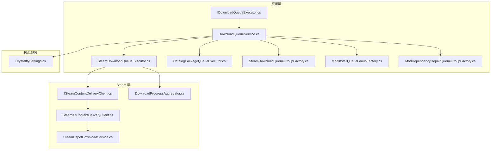
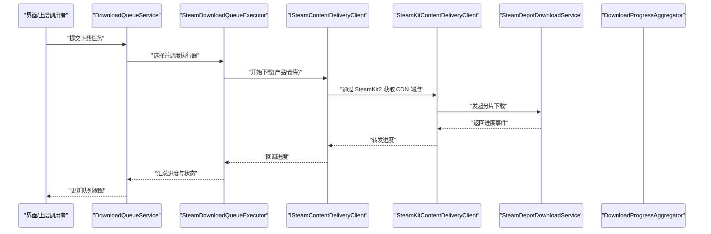
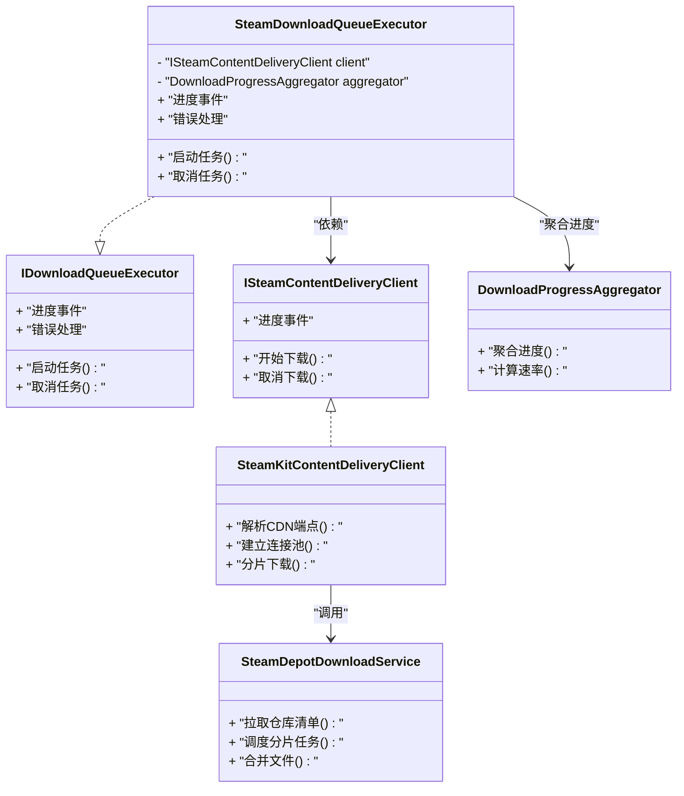
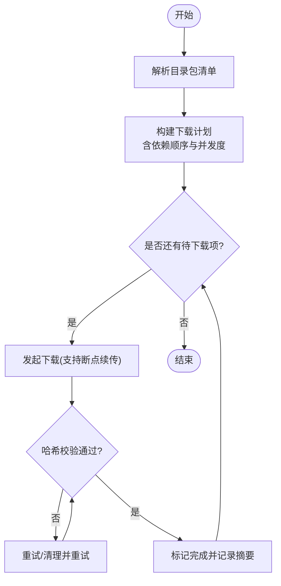
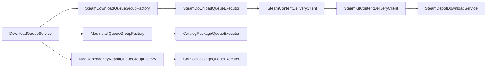

# 下载执行器

<cite>
**本文引用的文件**   
- [IDownloadQueueExecutor.cs](file://src/Crystalfly.App/Downloads/IDownloadQueueExecutor.cs)
- [DownloadQueueService.cs](file://src/Crystalfly.App/Downloads/DownloadQueueService.cs)
- [SteamDownloadQueueExecutor.cs](file://src/Crystalfly.App/Downloads/SteamDownloadQueueExecutor.cs)
- [CatalogPackageQueueExecutor.cs](file://src/Crystalfly.App/Downloads/CatalogPackageQueueExecutor.cs)
- [SteamDownloadQueueGroupFactory.cs](file://src/Crystalfly.App/Downloads/SteamDownloadQueueGroupFactory.cs)
- [ModInstallQueueGroupFactory.cs](file://src/Crystalfly.App/Downloads/ModInstallQueueGroupFactory.cs)
- [ModDependencyRepairQueueGroupFactory.cs](file://src/Crystalfly.App/Downloads/ModDependencyRepairQueueGroupFactory.cs)
- [ISteamContentDeliveryClient.cs](file://src/Crystalfly.Steam/Downloads/ISteamContentDeliveryClient.cs)
- [SteamKitContentDeliveryClient.cs](file://src/Crystalfly.Steam/Downloads/SteamKitContentDeliveryClient.cs)
- [SteamDepotDownloadService.cs](file://src/Crystalfly.Steam/Downloads/SteamDepotDownloadService.cs)
- [DownloadProgressAggregator.cs](file://src/Crystalfly.Steam/Downloads/DownloadProgressAggregator.cs)
- [CrystalflySettings.cs](file://src/Crystalfly.Core/Configuration/CrystalflySettings.cs)
</cite>

## 目录
1. [简介](#简介)
2. [项目结构](#项目结构)
3. [核心组件](#核心组件)
4. [架构总览](#架构总览)
5. [详细组件分析](#详细组件分析)
6. [依赖关系分析](#依赖关系分析)
7. [性能与配置](#性能与配置)
8. [故障排查指南](#故障排查指南)
9. [结论](#结论)
10. [附录：自定义执行器实现示例](#附录自定义执行器实现示例)

## 简介
本文件围绕“下载执行器系统”展开，聚焦以下目标：
- 深入解释 IDownloadQueueExecutor 接口设计与实现模式
- 详细说明 SteamDownloadQueueExecutor 的 SteamKit2 集成实现（内容分发网络访问、进度监控、错误恢复）
- 记录 CatalogPackageQueueExecutor 对模组目录包的下载与校验流程
- 说明执行器的注册机制与动态加载策略
- 提供实现自定义下载执行器的具体步骤与参考路径
- 覆盖连接池管理、超时处理与带宽限制的配置要点
- 梳理执行器间的依赖关系与协作模式

## 项目结构
下载执行器相关代码主要分布在应用层与 Steam 层：
- 应用层 Downloads 目录包含执行器接口、服务编排、具体执行器及队列分组工厂
- Steam 层 Downloads 目录包含 Steam 内容投递客户端、下载服务与进度聚合等基础设施

图表来源
- [IDownloadQueueExecutor.cs](file://src/Crystalfly.App/Downloads/IDownloadQueueExecutor.cs)
- [DownloadQueueService.cs](file://src/Crystalfly.App/Downloads/DownloadQueueService.cs)
- [SteamDownloadQueueExecutor.cs](file://src/Crystalfly.App/Downloads/SteamDownloadQueueExecutor.cs)
- [CatalogPackageQueueExecutor.cs](file://src/Crystalfly.App/Downloads/CatalogPackageQueueExecutor.cs)
- [SteamDownloadQueueGroupFactory.cs](file://src/Crystalfly.App/Downloads/SteamDownloadQueueGroupFactory.cs)
- [ModInstallQueueGroupFactory.cs](file://src/Crystalfly.App/Downloads/ModInstallQueueGroupFactory.cs)
- [ModDependencyRepairQueueGroupFactory.cs](file://src/Crystalfly.App/Downloads/ModDependencyRepairQueueGroupFactory.cs)
- [ISteamContentDeliveryClient.cs](file://src/Crystalfly.Steam/Downloads/ISteamContentDeliveryClient.cs)
- [SteamKitContentDeliveryClient.cs](file://src/Crystalfly.Steam/Downloads/SteamKitContentDeliveryClient.cs)
- [SteamDepotDownloadService.cs](file://src/Crystalfly.Steam/Downloads/SteamDepotDownloadService.cs)
- [DownloadProgressAggregator.cs](file://src/Crystalfly.Steam/Downloads/DownloadProgressAggregator.cs)
- [CrystalflySettings.cs](file://src/Crystalfly.Core/Configuration/CrystalflySettings.cs)

章节来源
- [IDownloadQueueExecutor.cs](file://src/Crystalfly.App/Downloads/IDownloadQueueExecutor.cs)
- [DownloadQueueService.cs](file://src/Crystalfly.App/Downloads/DownloadQueueService.cs)
- [SteamDownloadQueueExecutor.cs](file://src/Crystalfly.App/Downloads/SteamDownloadQueueExecutor.cs)
- [CatalogPackageQueueExecutor.cs](file://src/Crystalfly.App/Downloads/CatalogPackageQueueExecutor.cs)
- [SteamDownloadQueueGroupFactory.cs](file://src/Crystalfly.App/Downloads/SteamDownloadQueueGroupFactory.cs)
- [ModInstallQueueGroupFactory.cs](file://src/Crystalfly.App/Downloads/ModInstallQueueGroupFactory.cs)
- [ModDependencyRepairQueueGroupFactory.cs](file://src/Crystalfly.App/Downloads/ModDependencyRepairQueueGroupFactory.cs)
- [ISteamContentDeliveryClient.cs](file://src/Crystalfly.Steam/Downloads/ISteamContentDeliveryClient.cs)
- [SteamKitContentDeliveryClient.cs](file://src/Crystalfly.Steam/Downloads/SteamKitContentDeliveryClient.cs)
- [SteamDepotDownloadService.cs](file://src/Crystalfly.Steam/Downloads/SteamDepotDownloadService.cs)
- [DownloadProgressAggregator.cs](file://src/Crystalfly.Steam/Downloads/DownloadProgressAggregator.cs)
- [CrystalflySettings.cs](file://src/Crystalfly.Core/Configuration/CrystalflySettings.cs)

## 核心组件
- IDownloadQueueExecutor：定义下载任务的统一抽象，包括任务生命周期、进度上报、取消与错误处理。
- DownloadQueueService：负责调度、分组、优先级与并发控制，协调多个执行器并行工作。
- SteamDownloadQueueExecutor：基于 SteamKit2 的 Steam 内容分发网络（CDN）下载实现，封装认证、分片下载、断点续传与重试。
- CatalogPackageQueueExecutor：面向模组目录包（Catalog Package）的下载与完整性校验。
- 各类 QueueGroupFactory：按业务场景（安装、依赖修复、Steam 下载）创建并装配执行器实例。
- Steam 层客户端与服务：ISteamContentDeliveryClient 抽象、SteamKitContentDeliveryClient 实现、SteamDepotDownloadService 与进度聚合器。

章节来源
- [IDownloadQueueExecutor.cs](file://src/Crystalfly.App/Downloads/IDownloadQueueExecutor.cs)
- [DownloadQueueService.cs](file://src/Crystalfly.App/Downloads/DownloadQueueService.cs)
- [SteamDownloadQueueExecutor.cs](file://src/Crystalfly.App/Downloads/SteamDownloadQueueExecutor.cs)
- [CatalogPackageQueueExecutor.cs](file://src/Crystalfly.App/Downloads/CatalogPackageQueueExecutor.cs)
- [SteamDownloadQueueGroupFactory.cs](file://src/Crystalfly.App/Downloads/SteamDownloadQueueGroupFactory.cs)
- [ModInstallQueueGroupFactory.cs](file://src/Crystalfly.App/Downloads/ModInstallQueueGroupFactory.cs)
- [ModDependencyRepairQueueGroupFactory.cs](file://src/Crystalfly.App/Downloads/ModDependencyRepairQueueGroupFactory.cs)
- [ISteamContentDeliveryClient.cs](file://src/Crystalfly.Steam/Downloads/ISteamContentDeliveryClient.cs)
- [SteamKitContentDeliveryClient.cs](file://src/Crystalfly.Steam/Downloads/SteamKitContentDeliveryClient.cs)
- [SteamDepotDownloadService.cs](file://src/Crystalfly.Steam/Downloads/SteamDepotDownloadService.cs)
- [DownloadProgressAggregator.cs](file://src/Crystalfly.Steam/Downloads/DownloadProgressAggregator.cs)

## 架构总览
下图展示了从队列服务到具体执行器再到 Steam 内容投递客户端的整体调用链与数据流。

图表来源
- [DownloadQueueService.cs](file://src/Crystalfly.App/Downloads/DownloadQueueService.cs)
- [SteamDownloadQueueExecutor.cs](file://src/Crystalfly.App/Downloads/SteamDownloadQueueExecutor.cs)
- [ISteamContentDeliveryClient.cs](file://src/Crystalfly.Steam/Downloads/ISteamContentDeliveryClient.cs)
- [SteamKitContentDeliveryClient.cs](file://src/Crystalfly.Steam/Downloads/SteamKitContentDeliveryClient.cs)
- [SteamDepotDownloadService.cs](file://src/Crystalfly.Steam/Downloads/SteamDepotDownloadService.cs)
- [DownloadProgressAggregator.cs](file://src/Crystalfly.Steam/Downloads/DownloadProgressAggregator.cs)

## 详细组件分析

### IDownloadQueueExecutor 接口设计
- 职责边界
  - 定义统一的下载任务契约：启动、暂停、取消、查询进度、错误处理。
  - 暴露可观察的进度事件，供队列服务与 UI 消费。
- 关键能力
  - 支持任务级取消令牌，确保资源及时释放。
  - 提供失败原因与可重试标记，便于上层进行退避或降级。
- 扩展性
  - 通过工厂或注册表注入不同执行器实现，满足多源下载需求。

章节来源
- [IDownloadQueueExecutor.cs](file://src/Crystalfly.App/Downloads/IDownloadQueueExecutor.cs)

### SteamDownloadQueueExecutor 的 SteamKit2 集成
- 集成点
  - 使用 ISteamContentDeliveryClient 作为抽象，内部由 SteamKitContentDeliveryClient 实现，借助 SteamKit2 完成认证、服务器发现与分片下载。
  - 通过 SteamDepotDownloadService 驱动仓库（Depot）级别的分片下载与合并。
- 进度监控
  - 利用 DownloadProgressAggregator 聚合多分片进度，向上传递整体百分比与速率。
- 错误恢复
  - 针对网络抖动与 CDN 不可用，采用指数退避重试；对部分失败的分片进行局部重下。
  - 在会话失效时触发重新登录流程，保证长任务不中断。
- 连接与带宽
  - 复用底层 HTTP 连接池，避免频繁握手开销。
  - 支持全局带宽上限与单任务限速，结合队列并发度控制总体吞吐。

图表来源
- [SteamDownloadQueueExecutor.cs](file://src/Crystalfly.App/Downloads/SteamDownloadQueueExecutor.cs)
- [ISteamContentDeliveryClient.cs](file://src/Crystalfly.Steam/Downloads/ISteamContentDeliveryClient.cs)
- [SteamKitContentDeliveryClient.cs](file://src/Crystalfly.Steam/Downloads/SteamKitContentDeliveryClient.cs)
- [SteamDepotDownloadService.cs](file://src/Crystalfly.Steam/Downloads/SteamDepotDownloadService.cs)
- [DownloadProgressAggregator.cs](file://src/Crystalfly.Steam/Downloads/DownloadProgressAggregator.cs)

章节来源
- [SteamDownloadQueueExecutor.cs](file://src/Crystalfly.App/Downloads/SteamDownloadQueueExecutor.cs)
- [ISteamContentDeliveryClient.cs](file://src/Crystalfly.Steam/Downloads/ISteamContentDeliveryClient.cs)
- [SteamKitContentDeliveryClient.cs](file://src/Crystalfly.Steam/Downloads/SteamKitContentDeliveryClient.cs)
- [SteamDepotDownloadService.cs](file://src/Crystalfly.Steam/Downloads/SteamDepotDownloadService.cs)
- [DownloadProgressAggregator.cs](file://src/Crystalfly.Steam/Downloads/DownloadProgressAggregator.cs)

### CatalogPackageQueueExecutor 的目录包下载与验证
- 下载流程
  - 根据目录包清单定位各文件 URL，按依赖顺序分批下载。
  - 支持断点续传与并发分块，提升大体积包下载效率。
- 完整性校验
  - 对每个文件进行哈希校验，失败则自动重试或回滚已写入文件。
  - 校验通过后生成校验摘要，供后续安装阶段快速比对。
- 错误恢复
  - 网络异常时进入退避重试；校验失败时清理临时文件并重新下载。
- 与队列服务协作
  - 将自身注册为可调度执行器，接受优先级与并发度约束。

图表来源
- [CatalogPackageQueueExecutor.cs](file://src/Crystalfly.App/Downloads/CatalogPackageQueueExecutor.cs)

章节来源
- [CatalogPackageQueueExecutor.cs](file://src/Crystalfly.App/Downloads/CatalogPackageQueueExecutor.cs)

### 执行器注册与动态加载
- 注册机制
  - 通过工厂类（如 SteamDownloadQueueGroupFactory、ModInstallQueueGroupFactory、ModDependencyRepairQueueGroupFactory）集中创建并注册执行器实例。
  - 队列服务在启动时扫描并缓存可用执行器，按类型或标签路由到对应实现。
- 动态加载
  - 支持运行时新增执行器类型，无需重启主进程；通过配置开关启用特定执行器。
- 生命周期
  - 执行器实例通常随队列组生命周期创建与销毁，避免全局单例带来的耦合。

章节来源
- [SteamDownloadQueueGroupFactory.cs](file://src/Crystalfly.App/Downloads/SteamDownloadQueueGroupFactory.cs)
- [ModInstallQueueGroupFactory.cs](file://src/Crystalfly.App/Downloads/ModInstallQueueGroupFactory.cs)
- [ModDependencyRepairQueueGroupFactory.cs](file://src/Crystalfly.App/Downloads/ModDependencyRepairQueueGroupFactory.cs)
- [DownloadQueueService.cs](file://src/Crystalfly.App/Downloads/DownloadQueueService.cs)

## 依赖关系分析
- 松耦合
  - 执行器仅依赖 ISteamContentDeliveryClient 抽象，屏蔽底层实现差异。
  - 队列服务通过工厂与注册表解耦具体执行器类型。
- 内聚性
  - 每个执行器专注单一来源（Steam 或目录包），职责清晰。
- 外部依赖
  - SteamKit2 用于认证与 CDN 发现；HTTP 连接池与重试库用于网络健壮性。
- 潜在循环
  - 当前分层清晰，未见直接循环引用；建议保持抽象与实现的单向依赖。

图表来源
- [DownloadQueueService.cs](file://src/Crystalfly.App/Downloads/DownloadQueueService.cs)
- [SteamDownloadQueueGroupFactory.cs](file://src/Crystalfly.App/Downloads/SteamDownloadQueueGroupFactory.cs)
- [ModInstallQueueGroupFactory.cs](file://src/Crystalfly.App/Downloads/ModInstallQueueGroupFactory.cs)
- [ModDependencyRepairQueueGroupFactory.cs](file://src/Crystalfly.App/Downloads/ModDependencyRepairQueueGroupFactory.cs)
- [SteamDownloadQueueExecutor.cs](file://src/Crystalfly.App/Downloads/SteamDownloadQueueExecutor.cs)
- [CatalogPackageQueueExecutor.cs](file://src/Crystalfly.App/Downloads/CatalogPackageQueueExecutor.cs)
- [ISteamContentDeliveryClient.cs](file://src/Crystalfly.Steam/Downloads/ISteamContentDeliveryClient.cs)
- [SteamKitContentDeliveryClient.cs](file://src/Crystalfly.Steam/Downloads/SteamKitContentDeliveryClient.cs)
- [SteamDepotDownloadService.cs](file://src/Crystalfly.Steam/Downloads/SteamDepotDownloadService.cs)

章节来源
- [DownloadQueueService.cs](file://src/Crystalfly.App/Downloads/DownloadQueueService.cs)
- [SteamDownloadQueueGroupFactory.cs](file://src/Crystalfly.App/Downloads/SteamDownloadQueueGroupFactory.cs)
- [ModInstallQueueGroupFactory.cs](file://src/Crystalfly.App/Downloads/ModInstallQueueGroupFactory.cs)
- [ModDependencyRepairQueueGroupFactory.cs](file://src/Crystalfly.App/Downloads/ModDependencyRepairQueueGroupFactory.cs)
- [SteamDownloadQueueExecutor.cs](file://src/Crystalfly.App/Downloads/SteamDownloadQueueExecutor.cs)
- [CatalogPackageQueueExecutor.cs](file://src/Crystalfly.App/Downloads/CatalogPackageQueueExecutor.cs)
- [ISteamContentDeliveryClient.cs](file://src/Crystalfly.Steam/Downloads/ISteamContentDeliveryClient.cs)
- [SteamKitContentDeliveryClient.cs](file://src/Crystalfly.Steam/Downloads/SteamKitContentDeliveryClient.cs)
- [SteamDepotDownloadService.cs](file://src/Crystalfly.Steam/Downloads/SteamDepotDownloadService.cs)

## 性能与配置
- 连接池管理
  - 复用 HTTP 连接，减少握手延迟；合理设置最大空闲连接数与存活时间。
- 超时处理
  - 区分连接超时、读取超时与整体任务超时；对长时间无响应任务主动取消并提示用户。
- 带宽限制
  - 支持全局带宽上限与单任务限速；结合队列并发度控制总体吞吐，避免拥塞。
- 重试与退避
  - 指数退避与抖动策略降低雪崩风险；对瞬态错误（网络抖动、CDN 限流）友好。
- 进度聚合
  - 使用 DownloadProgressAggregator 合并分片进度，减少 UI 刷新频率，提高渲染性能。
- 配置入口
  - 相关参数可通过 CrystalflySettings 集中管理，便于测试与灰度切换。

章节来源
- [DownloadProgressAggregator.cs](file://src/Crystalfly.Steam/Downloads/DownloadProgressAggregator.cs)
- [CrystalflySettings.cs](file://src/Crystalfly.Core/Configuration/CrystalflySettings.cs)

## 故障排查指南
- 常见问题
  - 认证失败：检查会话有效期与二次验证流程，必要时触发重新登录。
  - CDN 不可用：切换到备用节点或等待退避后重试；查看网络连通性与代理设置。
  - 校验失败：确认磁盘空间与权限；清理临时文件后重试。
- 日志与诊断
  - 关注进度聚合与错误事件；记录失败原因与重试次数，辅助定位根因。
- 恢复策略
  - 对部分失败任务支持断点续传；对整包失败支持一键重试与回滚。

章节来源
- [SteamDownloadQueueExecutor.cs](file://src/Crystalfly.App/Downloads/SteamDownloadQueueExecutor.cs)
- [CatalogPackageQueueExecutor.cs](file://src/Crystalfly.App/Downloads/CatalogPackageQueueExecutor.cs)
- [DownloadProgressAggregator.cs](file://src/Crystalfly.Steam/Downloads/DownloadProgressAggregator.cs)

## 结论
下载执行器系统通过清晰的接口抽象与分层设计，实现了多源下载的灵活扩展与稳定运行。Steam 与目录包两类执行器各司其职，配合队列服务与进度聚合，提供了良好的用户体验与运维可控性。通过合理的连接池、超时与带宽配置，系统在复杂网络环境下仍具备较强的鲁棒性。

## 附录：自定义执行器实现示例
- 实现步骤
  - 新建类实现 IDownloadQueueExecutor，定义任务生命周期与进度事件。
  - 在合适的工厂中注册新执行器，或通过注册表动态加载。
  - 在队列服务中按类型或标签路由到新执行器。
- 参考路径
  - 接口定义：[IDownloadQueueExecutor.cs](file://src/Crystalfly.App/Downloads/IDownloadQueueExecutor.cs)
  - 现有实现参考：[SteamDownloadQueueExecutor.cs](file://src/Crystalfly.App/Downloads/SteamDownloadQueueExecutor.cs)、[CatalogPackageQueueExecutor.cs](file://src/Crystalfly.App/Downloads/CatalogPackageQueueExecutor.cs)
  - 注册与装配：[SteamDownloadQueueGroupFactory.cs](file://src/Crystalfly.App/Downloads/SteamDownloadQueueGroupFactory.cs)、[ModInstallQueueGroupFactory.cs](file://src/Crystalfly.App/Downloads/ModInstallQueueGroupFactory.cs)、[ModDependencyRepairQueueGroupFactory.cs](file://src/Crystalfly.App/Downloads/ModDependencyRepairQueueGroupFactory.cs)
  - 队列服务：[DownloadQueueService.cs](file://src/Crystalfly.App/Downloads/DownloadQueueService.cs)
- 最佳实践
  - 遵循取消令牌与超时策略，确保资源及时释放。
  - 使用进度聚合降低 UI 压力，提供稳定的进度反馈。
  - 对网络与校验错误实施可观测的重试与回滚。