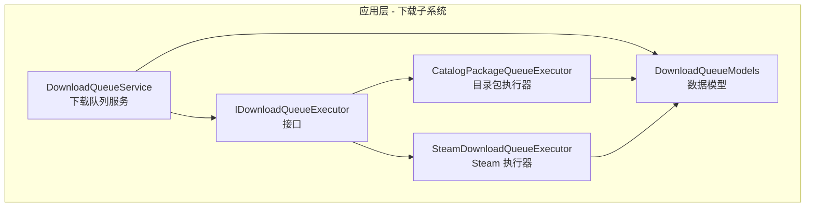
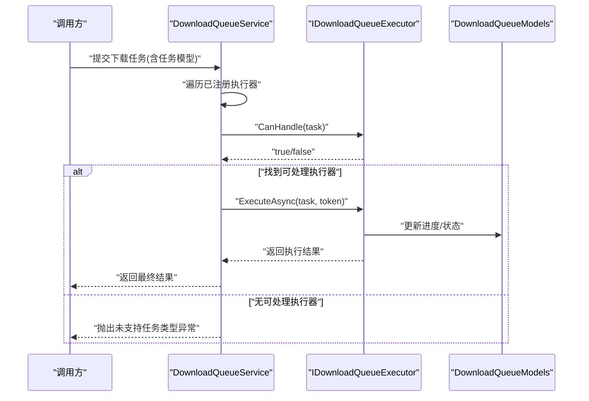
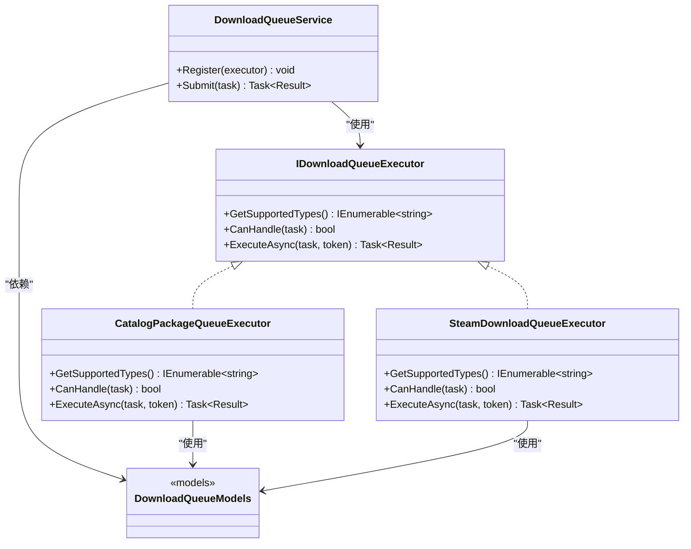

# 下载执行器接口

<cite>
**本文引用的文件**   
- [IDownloadQueueExecutor.cs](file://src/Crystalfly.App/Downloads/IDownloadQueueExecutor.cs)
- [CatalogPackageQueueExecutor.cs](file://src/Crystalfly.App/Downloads/CatalogPackageQueueExecutor.cs)
- [SteamDownloadQueueExecutor.cs](file://src/Crystalfly.App/Downloads/SteamDownloadQueueExecutor.cs)
- [DownloadQueueService.cs](file://src/Crystalfly.App/Downloads/DownloadQueueService.cs)
- [DownloadQueueModels.cs](file://src/Crystalfly.App/Downloads/DownloadQueueModels.cs)
- [CatalogPackageQueueExecutorTests.cs](file://tests/Crystalfly.App.Tests/Downloads/CatalogPackageQueueExecutorTests.cs)
- [SteamDownloadQueueExecutorTests.cs](file://tests/Crystalfly.App.Tests/Downloads/SteamDownloadQueueExecutorTests.cs)
</cite>

## 目录
1. [简介](#简介)
2. [项目结构](#项目结构)
3. [核心组件](#核心组件)
4. [架构总览](#架构总览)
5. [详细组件分析](#详细组件分析)
6. [依赖关系分析](#依赖关系分析)
7. [性能考虑](#性能考虑)
8. [故障排查指南](#故障排查指南)
9. [结论](#结论)
10. [附录](#附录)

## 简介
本文件围绕“下载执行器接口”进行系统化文档化，重点解释 IDownloadQueueExecutor 接口的设计理念与抽象层次，详述其核心方法（ExecuteAsync、CanHandle、GetSupportedTypes）的参数与返回值规范，记录生命周期管理与资源清理机制，说明错误处理模式与异常类型约定，并提供实现自定义下载执行器的实践示例。同时涵盖线程安全与并发访问模式、扩展点与最佳实践，帮助读者快速理解并正确扩展下载队列的执行能力。

## 项目结构
下载执行器相关代码位于应用层模块的 Downloads 目录中，包含接口定义、具体执行器实现、队列服务以及模型定义；测试覆盖主要执行器行为与集成场景。

图表来源
- [IDownloadQueueExecutor.cs](file://src/Crystalfly.App/Downloads/IDownloadQueueExecutor.cs)
- [CatalogPackageQueueExecutor.cs](file://src/Crystalfly.App/Downloads/CatalogPackageQueueExecutor.cs)
- [SteamDownloadQueueExecutor.cs](file://src/Crystalfly.App/Downloads/SteamDownloadQueueExecutor.cs)
- [DownloadQueueService.cs](file://src/Crystalfly.App/Downloads/DownloadQueueService.cs)
- [DownloadQueueModels.cs](file://src/Crystalfly.App/Downloads/DownloadQueueModels.cs)

章节来源
- [IDownloadQueueExecutor.cs](file://src/Crystalfly.App/Downloads/IDownloadQueueExecutor.cs)
- [CatalogPackageQueueExecutor.cs](file://src/Crystalfly.App/Downloads/CatalogPackageQueueExecutor.cs)
- [SteamDownloadQueueExecutor.cs](file://src/Crystalfly.App/Downloads/SteamDownloadQueueExecutor.cs)
- [DownloadQueueService.cs](file://src/Crystalfly.App/Downloads/DownloadQueueService.cs)
- [DownloadQueueModels.cs](file://src/Crystalfly.App/Downloads/DownloadQueueModels.cs)

## 核心组件
- IDownloadQueueExecutor：下载执行器统一抽象，用于声明某执行器能处理的任务类型、是否可处理特定任务，以及异步执行任务的入口。
- CatalogPackageQueueExecutor：基于目录包的下载执行器实现，负责解析目录包清单并驱动相应下载流程。
- SteamDownloadQueueExecutor：基于 Steam 平台的下载执行器实现，通过 Steam 内容分发能力完成下载。
- DownloadQueueService：下载队列服务，负责调度、编排与生命周期管理，按策略选择合适执行器并协调执行。
- DownloadQueueModels：下载相关的模型定义，包括任务描述、进度、结果等数据结构。

章节来源
- [IDownloadQueueExecutor.cs](file://src/Crystalfly.App/Downloads/IDownloadQueueExecutor.cs)
- [CatalogPackageQueueExecutor.cs](file://src/Crystalfly.App/Downloads/CatalogPackageQueueExecutor.cs)
- [SteamDownloadQueueExecutor.cs](file://src/Crystalfly.App/Downloads/SteamDownloadQueueExecutor.cs)
- [DownloadQueueService.cs](file://src/Crystalfly.App/Downloads/DownloadQueueService.cs)
- [DownloadQueueModels.cs](file://src/Crystalfly.App/Downloads/DownloadQueueModels.cs)

## 架构总览
下图展示了下载队列服务如何根据任务类型选择合适的执行器，并调用其 ExecuteAsync 完成下载任务。

图表来源
- [DownloadQueueService.cs](file://src/Crystalfly.App/Downloads/DownloadQueueService.cs)
- [IDownloadQueueExecutor.cs](file://src/Crystalfly.App/Downloads/IDownloadQueueExecutor.cs)
- [DownloadQueueModels.cs](file://src/Crystalfly.App/Downloads/DownloadQueueModels.cs)

## 详细组件分析

### IDownloadQueueExecutor 接口设计
- 设计理念
  - 解耦：将“任务类型识别”和“任务执行”从队列服务中抽离，便于扩展新的下载源或协议。
  - 明确职责：每个执行器只关注自身支持的类型与执行细节，降低耦合度。
  - 可扩展：通过 CanHandle 与 GetSupportedTypes 组合，提供灵活的任务路由与能力发现。
- 抽象层次
  - 能力声明：GetSupportedTypes 暴露该执行器支持的任务类型集合，供上层进行能力匹配与展示。
  - 任务判定：CanHandle 对具体任务实例进行细粒度判断，避免仅凭类型误判。
  - 执行入口：ExecuteAsync 是异步执行的唯一入口，负责推进进度、处理错误与返回结果。
- 关键方法规范
  - ExecuteAsync
    - 参数：任务模型对象、取消令牌（可选）。
    - 返回值：异步任务包装的执行结果（如成功/失败、统计信息、产物路径等）。
    - 行为：在内部维护进度回调、错误上报与资源释放；支持取消。
  - CanHandle
    - 参数：任务模型对象。
    - 返回值：布尔值，表示当前执行器是否能处理该任务。
    - 行为：应轻量且幂等，避免阻塞与副作用。
  - GetSupportedTypes
    - 参数：无。
    - 返回值：任务类型枚举或字符串集合。
    - 行为：静态能力查询，不依赖运行时状态。
- 生命周期与资源清理
  - 建议实现 IDisposable 或在 ExecuteAsync 中使用 using/finally 确保临时资源释放。
  - 长连接或句柄应在执行完成后主动关闭，避免泄漏。
- 错误处理与异常约定
  - 网络/IO 错误：使用标准异常类型（如网络超时、权限不足、文件不存在等），并在任务模型中反映失败原因。
  - 业务错误：封装为领域异常或错误码，便于上层统一处理与重试策略。
  - 取消：当取消令牌触发时，及时中止并返回取消结果。
- 线程安全与并发
  - ExecuteAsync 应为线程安全，避免共享可变状态；如需共享状态，需加锁或使用不可变对象。
  - 进度更新与日志输出需保证线程安全。
- 扩展点与最佳实践
  - 新增执行器：实现接口并注册到队列服务的能力表；优先实现 CanHandle 以快速短路。
  - 幂等性：重复提交相同任务应能安全重试或去重。
  - 可观测性：提供进度事件或回调，便于 UI 与监控。

章节来源
- [IDownloadQueueExecutor.cs](file://src/Crystalfly.App/Downloads/IDownloadQueueExecutor.cs)

### CatalogPackageQueueExecutor 实现要点
- 职责：解析目录包清单，按清单项发起下载，聚合进度与结果。
- 关键点
  - 清单校验：校验包元数据完整性与版本兼容性。
  - 分片/并行：根据清单项数量与系统资源限制控制并发度。
  - 断点续传：若底层支持，记录已下载片段以避免重复传输。
- 错误处理
  - 单项失败：记录失败项并继续其他项，最后汇总失败报告。
  - 整体失败：当关键项失败时，回滚或标记任务失败。
- 线程安全
  - 使用线程安全的进度聚合器与结果收集器。
  - 避免对同一目标路径的并发写入。

章节来源
- [CatalogPackageQueueExecutor.cs](file://src/Crystalfly.App/Downloads/CatalogPackageQueueExecutor.cs)
- [CatalogPackageQueueExecutorTests.cs](file://tests/Crystalfly.App.Tests/Downloads/CatalogPackageQueueExecutorTests.cs)

### SteamDownloadQueueExecutor 实现要点
- 职责：通过 Steam 内容分发客户端完成下载，适配 Steam 认证与会话。
- 关键点
  - 会话管理：复用或创建 Steam 会话，处理鉴权与刷新。
  - 产品/Depot 映射：将任务模型映射到 Steam 产品与 Depot 标识。
  - 进度同步：将 Steam 进度转换为统一的进度模型。
- 错误处理
  - 认证失败：提示重新登录或刷新令牌。
  - 网络抖动：自动重试与退避策略。
- 线程安全
  - 会话对象通常非线程安全，需在单线程上下文中使用或通过锁保护。

章节来源
- [SteamDownloadQueueExecutor.cs](file://src/Crystalfly.App/Downloads/SteamDownloadQueueExecutor.cs)
- [SteamDownloadQueueExecutorTests.cs](file://tests/Crystalfly.App.Tests/Downloads/SteamDownloadQueueExecutorTests.cs)

### DownloadQueueService 调度逻辑
- 职责：注册执行器、选择执行器、编排任务执行、汇总结果。
- 关键点
  - 执行器注册：支持动态注册与卸载。
  - 路由策略：先按 GetSupportedTypes 粗筛，再用 CanHandle 精判。
  - 并发控制：限制全局并发度，避免资源争用。
- 错误处理
  - 未找到执行器：抛出“不支持的任务类型”异常。
  - 执行器异常：捕获并包装为任务级错误，不影响其他任务。
- 生命周期
  - 服务启动时初始化执行器列表；停止时释放所有执行器资源。

章节来源
- [DownloadQueueService.cs](file://src/Crystalfly.App/Downloads/DownloadQueueService.cs)
- [DownloadQueueModels.cs](file://src/Crystalfly.App/Downloads/DownloadQueueModels.cs)

### 自定义下载执行器实现指南
- 步骤
  - 新建类实现 IDownloadQueueExecutor。
  - 实现 GetSupportedTypes：返回该执行器支持的任务类型集合。
  - 实现 CanHandle：根据任务模型字段判断是否可处理。
  - 实现 ExecuteAsync：完成下载逻辑，更新进度，处理错误与取消。
  - 资源管理：在 ExecuteAsync 内或实现 IDisposable 确保资源释放。
  - 注册：将新执行器注册到 DownloadQueueService。
- 注意事项
  - CanHandle 必须高效且无副作用。
  - ExecuteAsync 需支持取消令牌，并及时响应。
  - 进度更新要线程安全，避免 UI 卡顿。
  - 错误信息要清晰，便于定位问题。

章节来源
- [IDownloadQueueExecutor.cs](file://src/Crystalfly.App/Downloads/IDownloadQueueExecutor.cs)
- [DownloadQueueService.cs](file://src/Crystalfly.App/Downloads/DownloadQueueService.cs)

## 依赖关系分析

图表来源
- [IDownloadQueueExecutor.cs](file://src/Crystalfly.App/Downloads/IDownloadQueueExecutor.cs)
- [CatalogPackageQueueExecutor.cs](file://src/Crystalfly.App/Downloads/CatalogPackageQueueExecutor.cs)
- [SteamDownloadQueueExecutor.cs](file://src/Crystalfly.App/Downloads/SteamDownloadQueueExecutor.cs)
- [DownloadQueueService.cs](file://src/Crystalfly.App/Downloads/DownloadQueueService.cs)
- [DownloadQueueModels.cs](file://src/Crystalfly.App/Downloads/DownloadQueueModels.cs)

章节来源
- [IDownloadQueueExecutor.cs](file://src/Crystalfly.App/Downloads/IDownloadQueueExecutor.cs)
- [CatalogPackageQueueExecutor.cs](file://src/Crystalfly.App/Downloads/CatalogPackageQueueExecutor.cs)
- [SteamDownloadQueueExecutor.cs](file://src/Crystalfly.App/Downloads/SteamDownloadQueueExecutor.cs)
- [DownloadQueueService.cs](file://src/Crystalfly.App/Downloads/DownloadQueueService.cs)
- [DownloadQueueModels.cs](file://src/Crystalfly.App/Downloads/DownloadQueueModels.cs)

## 性能考虑
- 并发度控制：根据 CPU、磁盘 IO 与网络带宽设置合理的最大并发数，避免过载。
- 进度聚合：使用高效的原子操作或无锁结构聚合进度，减少锁竞争。
- 缓存与去重：对重复任务进行去重，避免重复下载。
- 流式处理：大文件采用流式读写，降低内存占用。
- 重试与退避：对瞬时错误实施指数退避重试，提高成功率。

[本节为通用指导，无需源码引用]

## 故障排查指南
- 常见问题
  - 未找到执行器：检查 GetSupportedTypes 与 CanHandle 的实现是否正确，确认任务类型匹配。
  - 认证失败：验证 Steam 会话状态与令牌有效性，必要时触发重新登录。
  - 进度不更新：检查进度回调是否线程安全，是否存在阻塞调用。
  - 资源泄漏：确认 ExecuteAsync 中打开的文件句柄、网络连接是否关闭。
- 诊断建议
  - 增加详细日志：记录任务进入、执行开始、进度变化、错误堆栈与退出原因。
  - 单元测试：针对 CanHandle 与 ExecuteAsync 编写边界用例，覆盖取消与异常路径。
  - 压力测试：模拟高并发与弱网环境，验证稳定性与吞吐。

章节来源
- [CatalogPackageQueueExecutorTests.cs](file://tests/Crystalfly.App.Tests/Downloads/CatalogPackageQueueExecutorTests.cs)
- [SteamDownloadQueueExecutorTests.cs](file://tests/Crystalfly.App.Tests/Downloads/SteamDownloadQueueExecutorTests.cs)

## 结论
IDownloadQueueExecutor 提供了清晰的下载执行抽象，使下载子系统具备良好的可扩展性与可维护性。通过 GetSupportedTypes 与 CanHandle 的组合，结合 ExecuteAsync 的统一执行入口，能够灵活接入多种下载源与协议。遵循本文提供的生命周期管理、错误处理、线程安全与最佳实践，可实现稳定高效的自定义下载执行器。

[本节为总结性内容，无需源码引用]

## 附录
- 术语
  - 任务模型：描述一次下载请求的结构化数据。
  - 执行器：实现 IDownloadQueueExecutor 的具体类。
  - 队列服务：负责调度与编排下载任务的中心组件。
- 参考
  - 接口定义与实现文件见“本文引用的文件”。

[本节为补充信息，无需源码引用]