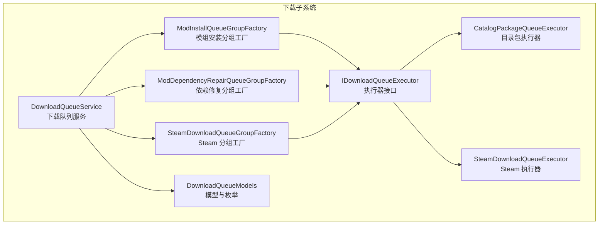
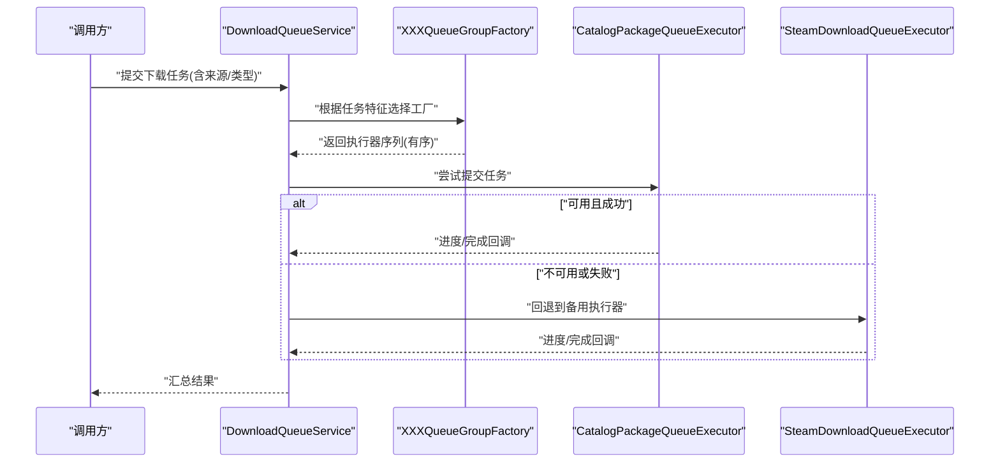
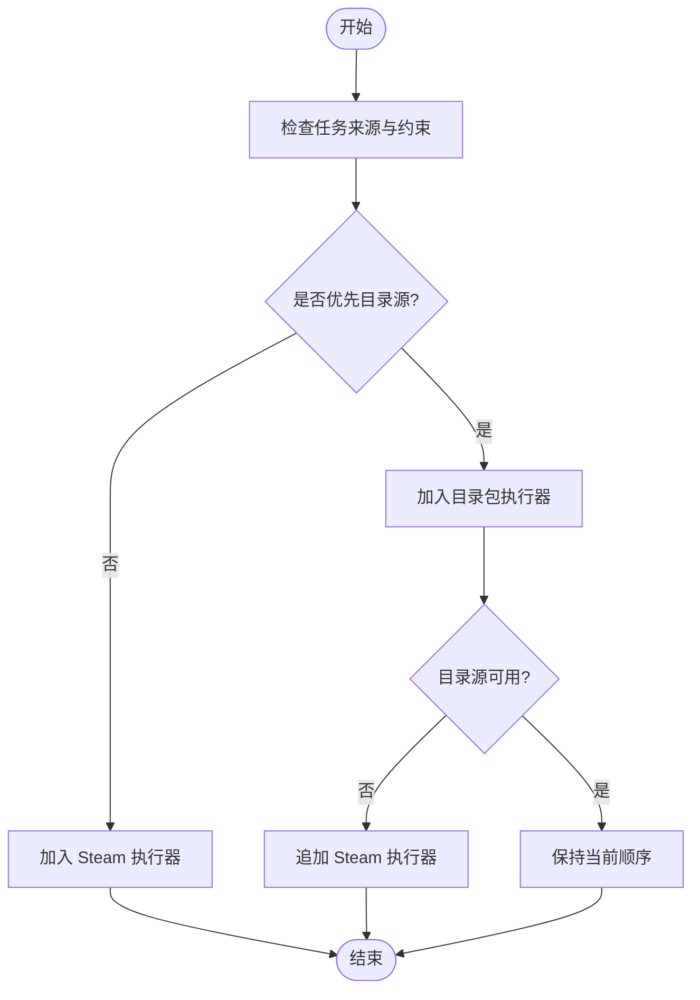
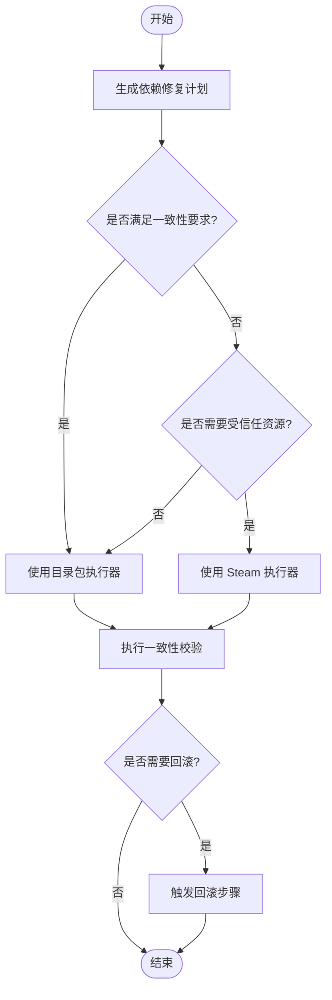
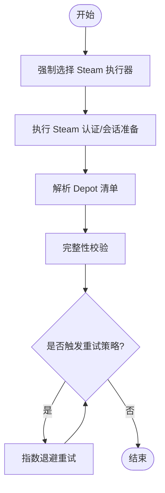
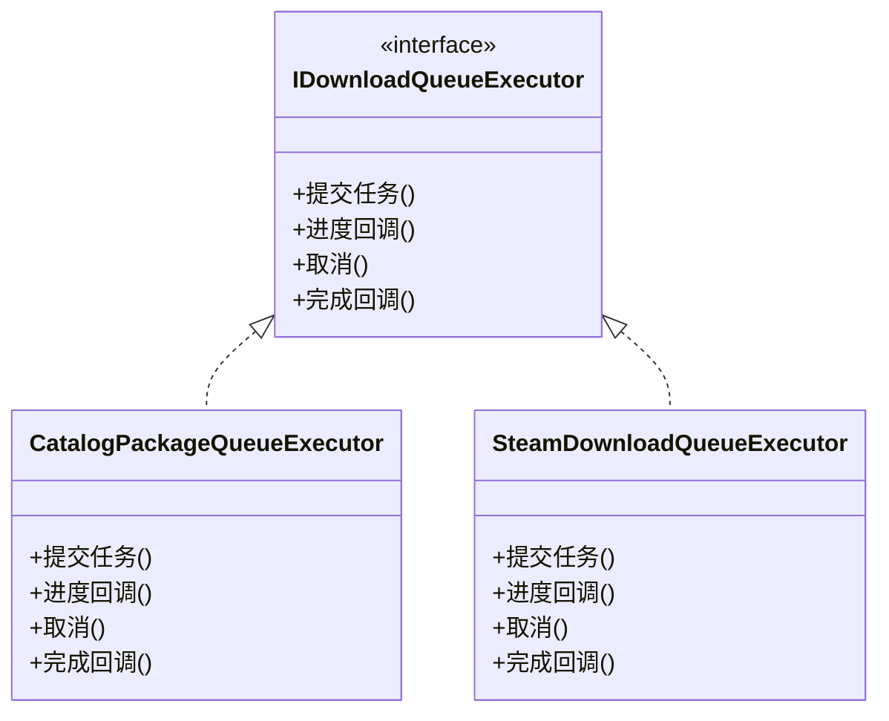
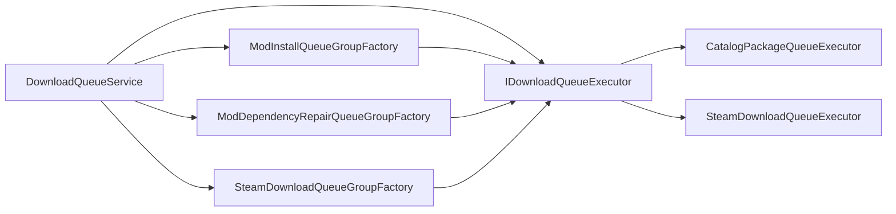

# 执行器工厂模式

<cite>
**本文引用的文件**   
- [IDownloadQueueExecutor.cs](file://src/Crystalfly.App/Downloads/IDownloadQueueExecutor.cs)
- [DownloadQueueService.cs](file://src/Crystalfly.App/Downloads/DownloadQueueService.cs)
- [ModInstallQueueGroupFactory.cs](file://src/Crystalfly.App/Downloads/ModInstallQueueGroupFactory.cs)
- [ModDependencyRepairQueueGroupFactory.cs](file://src/Crystalfly.App/Downloads/ModDependencyRepairQueueGroupFactory.cs)
- [SteamDownloadQueueGroupFactory.cs](file://src/Crystalfly.App/Downloads/SteamDownloadQueueGroupFactory.cs)
- [CatalogPackageQueueExecutor.cs](file://src/Crystalfly.App/Downloads/CatalogPackageQueueExecutor.cs)
- [SteamDownloadQueueExecutor.cs](file://src/Crystalfly.App/Downloads/SteamDownloadQueueExecutor.cs)
- [DownloadQueueModels.cs](file://src/Crystalfly.App/Downloads/DownloadQueueModels.cs)
</cite>

## 目录
1. [简介](#简介)
2. [项目结构](#项目结构)
3. [核心组件](#核心组件)
4. [架构总览](#架构总览)
5. [详细组件分析](#详细组件分析)
6. [依赖关系分析](#依赖关系分析)
7. [性能与负载均衡](#性能与负载均衡)
8. [故障排查指南](#故障排查指南)
9. [结论](#结论)
10. [附录：扩展点与自定义实现指南](#附录扩展点与自定义实现指南)

## 简介
本文件围绕“执行器工厂模式”在模组安装、依赖修复与 Steam 内容下载等场景中的设计与实现进行深入说明。重点解析以下三类 QueueGroupFactory：
- ModInstallQueueGroupFactory：根据模组安装需求选择最合适的下载执行器
- ModDependencyRepairQueueGroupFactory：在依赖修复场景下制定执行器选择策略
- SteamDownloadQueueGroupFactory：针对 Steam 内容的特殊处理逻辑

同时，文档提供注册新执行器类型与配置工厂行为的实践路径，并总结执行器优先级排序与负载均衡机制，帮助读者快速扩展系统能力。

## 项目结构
与执行器工厂相关的代码集中在应用层的 Downloads 目录中，采用“接口 + 具体执行器 + 分组工厂 + 调度服务”的分层组织方式：
- 接口定义：统一执行器契约
- 具体执行器：按来源或协议区分（如 Catalog、Steam）
- 分组工厂：按业务场景组装一组执行器，形成可执行的队列组
- 调度服务：负责队列组的创建、调度与生命周期管理

图表来源
- [IDownloadQueueExecutor.cs](file://src/Crystalfly.App/Downloads/IDownloadQueueExecutor.cs)
- [CatalogPackageQueueExecutor.cs](file://src/Crystalfly.App/Downloads/CatalogPackageQueueExecutor.cs)
- [SteamDownloadQueueExecutor.cs](file://src/Crystalfly.App/Downloads/SteamDownloadQueueExecutor.cs)
- [ModInstallQueueGroupFactory.cs](file://src/Crystalfly.App/Downloads/ModInstallQueueGroupFactory.cs)
- [ModDependencyRepairQueueGroupFactory.cs](file://src/Crystalfly.App/Downloads/ModDependencyRepairQueueGroupFactory.cs)
- [SteamDownloadQueueGroupFactory.cs](file://src/Crystalfly.App/Downloads/SteamDownloadQueueGroupFactory.cs)
- [DownloadQueueService.cs](file://src/Crystalfly.App/Downloads/DownloadQueueService.cs)
- [DownloadQueueModels.cs](file://src/Crystalfly.App/Downloads/DownloadQueueModels.cs)

章节来源
- [IDownloadQueueExecutor.cs](file://src/Crystalfly.App/Downloads/IDownloadQueueExecutor.cs)
- [DownloadQueueService.cs](file://src/Crystalfly.App/Downloads/DownloadQueueService.cs)
- [ModInstallQueueGroupFactory.cs](file://src/Crystalfly.App/Downloads/ModInstallQueueGroupFactory.cs)
- [ModDependencyRepairQueueGroupFactory.cs](file://src/Crystalfly.App/Downloads/ModDependencyRepairQueueGroupFactory.cs)
- [SteamDownloadQueueGroupFactory.cs](file://src/Crystalfly.App/Downloads/SteamDownloadQueueGroupFactory.cs)
- [CatalogPackageQueueExecutor.cs](file://src/Crystalfly.App/Downloads/CatalogPackageQueueExecutor.cs)
- [SteamDownloadQueueExecutor.cs](file://src/Crystalfly.App/Downloads/SteamDownloadQueueExecutor.cs)
- [DownloadQueueModels.cs](file://src/Crystalfly.App/Downloads/DownloadQueueModels.cs)

## 核心组件
- 执行器接口 IDownloadQueueExecutor：定义统一的下载任务执行契约，包括任务提交、进度上报、取消与完成回调等。所有具体执行器均需实现该接口，确保被工厂与调度服务一致对待。
- 目录包执行器 CatalogPackageQueueExecutor：面向目录化包资源的下载执行器，通常用于从官方或自定义目录源拉取资源。
- Steam 执行器 SteamDownloadQueueExecutor：面向 Steam 平台内容的专用执行器，封装了 Steam 特定的认证、Depot 下载与进度聚合等逻辑。
- 分组工厂族：
  - ModInstallQueueGroupFactory：为“模组安装”场景生成一组执行器，优先使用目录包执行器，必要时回退到 Steam 执行器。
  - ModDependencyRepairQueueGroupFactory：为“依赖修复”场景生成一组执行器，侧重最小变更与一致性校验。
  - SteamDownloadQueueGroupFactory：为“Steam 内容”场景生成一组执行器，强制使用 Steam 执行器，并附加 Steam 专属的校验与重试策略。
- 下载队列服务 DownloadQueueService：作为上层入口，接收业务请求，委托对应工厂生成执行器组，并进行调度、监控与结果汇总。
- 模型 DownloadQueueModels：定义任务类型、来源标识、状态枚举等，供工厂与执行器之间传递上下文信息。

章节来源
- [IDownloadQueueExecutor.cs](file://src/Crystalfly.App/Downloads/IDownloadQueueExecutor.cs)
- [CatalogPackageQueueExecutor.cs](file://src/Crystalfly.App/Downloads/CatalogPackageQueueExecutor.cs)
- [SteamDownloadQueueExecutor.cs](file://src/Crystalfly.App/Downloads/SteamDownloadQueueExecutor.cs)
- [ModInstallQueueGroupFactory.cs](file://src/Crystalfly.App/Downloads/ModInstallQueueGroupFactory.cs)
- [ModDependencyRepairQueueGroupFactory.cs](file://src/Crystalfly.App/Downloads/ModDependencyRepairQueueGroupFactory.cs)
- [SteamDownloadQueueGroupFactory.cs](file://src/Crystalfly.App/Downloads/SteamDownloadQueueGroupFactory.cs)
- [DownloadQueueService.cs](file://src/Crystalfly.App/Downloads/DownloadQueueService.cs)
- [DownloadQueueModels.cs](file://src/Crystalfly.App/Downloads/DownloadQueueModels.cs)

## 架构总览
下图展示了从业务调用到执行器选择的整体流程：服务层根据任务类型与来源，选择合适的分组工厂；工厂依据规则构建执行器列表；调度服务将任务分发至各执行器，并聚合进度与结果。

图表来源
- [DownloadQueueService.cs](file://src/Crystalfly.App/Downloads/DownloadQueueService.cs)
- [ModInstallQueueGroupFactory.cs](file://src/Crystalfly.App/Downloads/ModInstallQueueGroupFactory.cs)
- [ModDependencyRepairQueueGroupFactory.cs](file://src/Crystalfly.App/Downloads/ModDependencyRepairQueueGroupFactory.cs)
- [SteamDownloadQueueGroupFactory.cs](file://src/Crystalfly.App/Downloads/SteamDownloadQueueGroupFactory.cs)
- [CatalogPackageQueueExecutor.cs](file://src/Crystalfly.App/Downloads/CatalogPackageQueueExecutor.cs)
- [SteamDownloadQueueExecutor.cs](file://src/Crystalfly.App/Downloads/SteamDownloadQueueExecutor.cs)

## 详细组件分析

### 模组安装分组工厂 ModInstallQueueGroupFactory
职责与策略
- 目标：为模组安装任务选择最优执行器序列
- 首选：目录包执行器（CatalogPackageQueueExecutor），因其通常具备更高的可用性与更低的延迟
- 回退：当目录源不可用或任务标记为必须走 Steam 时，切换至 Steam 执行器（SteamDownloadQueueExecutor）
- 条件判断：基于任务来源标识、可用性探测与配置开关决定最终顺序

关键行为
- 根据任务元数据（来源、是否强制 Steam、网络可达性）生成有序执行器列表
- 支持动态回退与重试，保证安装成功率
- 与 DownloadQueueService 协作，进行并发控制与进度聚合

图表来源
- [ModInstallQueueGroupFactory.cs](file://src/Crystalfly.App/Downloads/ModInstallQueueGroupFactory.cs)
- [CatalogPackageQueueExecutor.cs](file://src/Crystalfly.App/Downloads/CatalogPackageQueueExecutor.cs)
- [SteamDownloadQueueExecutor.cs](file://src/Crystalfly.App/Downloads/SteamDownloadQueueExecutor.cs)
- [DownloadQueueModels.cs](file://src/Crystalfly.App/Downloads/DownloadQueueModels.cs)

章节来源
- [ModInstallQueueGroupFactory.cs](file://src/Crystalfly.App/Downloads/ModInstallQueueGroupFactory.cs)
- [DownloadQueueModels.cs](file://src/Crystalfly.App/Downloads/DownloadQueueModels.cs)

### 依赖修复分组工厂 ModDependencyRepairQueueGroupFactory
职责与策略
- 目标：在依赖修复场景中，以“最小变更、强一致性”为原则选择执行器
- 策略要点：
  - 优先选择能保障版本一致性的执行器（通常为目录包执行器）
  - 对存在冲突或损坏的依赖，引入额外校验步骤与回滚保护
  - 若目录源缺失特定修复包，则回退到 Steam 执行器获取受信任资源
- 输出：一个包含主执行器与可选校验/回滚辅助步骤的执行器序列

图表来源
- [ModDependencyRepairQueueGroupFactory.cs](file://src/Crystalfly.App/Downloads/ModDependencyRepairQueueGroupFactory.cs)
- [CatalogPackageQueueExecutor.cs](file://src/Crystalfly.App/Downloads/CatalogPackageQueueExecutor.cs)
- [SteamDownloadQueueExecutor.cs](file://src/Crystalfly.App/Downloads/SteamDownloadQueueExecutor.cs)
- [DownloadQueueModels.cs](file://src/Crystalfly.App/Downloads/DownloadQueueModels.cs)

章节来源
- [ModDependencyRepairQueueGroupFactory.cs](file://src/Crystalfly.App/Downloads/ModDependencyRepairQueueGroupFactory.cs)
- [DownloadQueueModels.cs](file://src/Crystalfly.App/Downloads/DownloadQueueModels.cs)

### Steam 分组工厂 SteamDownloadQueueGroupFactory
职责与策略
- 目标：为 Steam 内容下载提供专用执行器序列
- 策略要点：
  - 强制使用 Steam 执行器，避免非受信任来源
  - 附加 Steam 专属的认证、Depot 清单解析与完整性校验
  - 针对 Steam 限流与重试策略进行优化，提升稳定性
- 适用场景：游戏本体更新、DLC、创意工坊内容等

图表来源
- [SteamDownloadQueueGroupFactory.cs](file://src/Crystalfly.App/Downloads/SteamDownloadQueueGroupFactory.cs)
- [SteamDownloadQueueExecutor.cs](file://src/Crystalfly.App/Downloads/SteamDownloadQueueExecutor.cs)
- [DownloadQueueModels.cs](file://src/Crystalfly.App/Downloads/DownloadQueueModels.cs)

章节来源
- [SteamDownloadQueueGroupFactory.cs](file://src/Crystalfly.App/Downloads/SteamDownloadQueueGroupFactory.cs)
- [DownloadQueueModels.cs](file://src/Crystalfly.App/Downloads/DownloadQueueModels.cs)

### 执行器接口与具体实现
- 接口 IDownloadQueueExecutor：定义统一的执行契约，便于工厂与调度服务解耦
- 目录包执行器 CatalogPackageQueueExecutor：面向目录源的批量下载，适合稳定、高吞吐场景
- Steam 执行器 SteamDownloadQueueExecutor：面向 Steam 平台的受限下载，强调认证与完整性

图表来源
- [IDownloadQueueExecutor.cs](file://src/Crystalfly.App/Downloads/IDownloadQueueExecutor.cs)
- [CatalogPackageQueueExecutor.cs](file://src/Crystalfly.App/Downloads/CatalogPackageQueueExecutor.cs)
- [SteamDownloadQueueExecutor.cs](file://src/Crystalfly.App/Downloads/SteamDownloadQueueExecutor.cs)

章节来源
- [IDownloadQueueExecutor.cs](file://src/Crystalfly.App/Downloads/IDownloadQueueExecutor.cs)
- [CatalogPackageQueueExecutor.cs](file://src/Crystalfly.App/Downloads/CatalogPackageQueueExecutor.cs)
- [SteamDownloadQueueExecutor.cs](file://src/Crystalfly.App/Downloads/SteamDownloadQueueExecutor.cs)

## 依赖关系分析
- 低耦合：工厂仅依赖执行器接口，不感知具体实现细节
- 可扩展：新增执行器只需实现接口，并在相应工厂中注册即可
- 可替换：通过调整工厂内部顺序与条件，灵活改变执行器优先级
- 集中调度：DownloadQueueService 统一管理队列组生命周期，屏蔽底层差异

图表来源
- [DownloadQueueService.cs](file://src/Crystalfly.App/Downloads/DownloadQueueService.cs)
- [IDownloadQueueExecutor.cs](file://src/Crystalfly.App/Downloads/IDownloadQueueExecutor.cs)
- [ModInstallQueueGroupFactory.cs](file://src/Crystalfly.App/Downloads/ModInstallQueueGroupFactory.cs)
- [ModDependencyRepairQueueGroupFactory.cs](file://src/Crystalfly.App/Downloads/ModDependencyRepairQueueGroupFactory.cs)
- [SteamDownloadQueueGroupFactory.cs](file://src/Crystalfly.App/Downloads/SteamDownloadQueueGroupFactory.cs)
- [CatalogPackageQueueExecutor.cs](file://src/Crystalfly.App/Downloads/CatalogPackageQueueExecutor.cs)
- [SteamDownloadQueueExecutor.cs](file://src/Crystalfly.App/Downloads/SteamDownloadQueueExecutor.cs)

章节来源
- [DownloadQueueService.cs](file://src/Crystalfly.App/Downloads/DownloadQueueService.cs)
- [IDownloadQueueExecutor.cs](file://src/Crystalfly.App/Downloads/IDownloadQueueExecutor.cs)
- [ModInstallQueueGroupFactory.cs](file://src/Crystalfly.App/Downloads/ModInstallQueueGroupFactory.cs)
- [ModDependencyRepairQueueGroupFactory.cs](file://src/Crystalfly.App/Downloads/ModDependencyRepairQueueGroupFactory.cs)
- [SteamDownloadQueueGroupFactory.cs](file://src/Crystalfly.App/Downloads/SteamDownloadQueueGroupFactory.cs)
- [CatalogPackageQueueExecutor.cs](file://src/Crystalfly.App/Downloads/CatalogPackageQueueExecutor.cs)
- [SteamDownloadQueueExecutor.cs](file://src/Crystalfly.App/Downloads/SteamDownloadQueueExecutor.cs)

## 性能与负载均衡
- 优先级排序
  - 默认优先目录包执行器，因其通常具备更高吞吐与更低延迟
  - 在依赖修复与 Steam 场景下，按一致性或受信任来源优先调整顺序
- 负载均衡
  - 同一任务可在多个执行器间并行尝试，但需避免重复下载同一资源
  - 通过任务去重与共享缓存减少冗余 IO 与网络开销
- 重试与退避
  - 针对 Steam 限流与不稳定网络，采用指数退避与最大重试次数限制
  - 目录源失败时快速回退，降低总体等待时间
- 并发控制
  - 由 DownloadQueueService 统一协调并发度，避免资源争用
  - 结合任务优先级与队列容量，平滑峰值流量

[本节为通用指导，不涉及具体文件分析]

## 故障排查指南
- 常见问题定位
  - 执行器未生效：检查工厂是否正确注册与选择顺序
  - 下载失败无回退：确认回退条件与可用性探测逻辑
  - Steam 认证失败：核对会话准备与凭据刷新流程
- 日志与诊断
  - 关注任务来源、执行器选择原因与回退触发点
  - 记录重试次数、退避时间与最终错误码
- 恢复建议
  - 临时禁用问题执行器，切换到备用执行器
  - 清理缓存与中间文件，重新触发一致性校验

章节来源
- [DownloadQueueService.cs](file://src/Crystalfly.App/Downloads/DownloadQueueService.cs)
- [ModInstallQueueGroupFactory.cs](file://src/Crystalfly.App/Downloads/ModInstallQueueGroupFactory.cs)
- [ModDependencyRepairQueueGroupFactory.cs](file://src/Crystalfly.App/Downloads/ModDependencyRepairQueueGroupFactory.cs)
- [SteamDownloadQueueGroupFactory.cs](file://src/Crystalfly.App/Downloads/SteamDownloadQueueGroupFactory.cs)

## 结论
通过执行器工厂模式，系统在模组安装、依赖修复与 Steam 内容下载等复杂场景中实现了高内聚、低耦合与强扩展性。分层设计使执行器可插拔、工厂可组合、调度可统一，既保证了稳定性，又提升了可维护性与演进能力。

[本节为总结性内容，不涉及具体文件分析]

## 附录：扩展点与自定义实现指南
- 新增执行器类型
  - 实现 IDownloadQueueExecutor 接口，提供任务提交、进度与完成回调
  - 在相关工厂中注册新执行器，并设置优先级与回退条件
- 配置工厂行为
  - 通过任务元数据与全局配置控制执行器选择顺序
  - 针对不同场景（安装、修复、Steam）定制策略
- 示例路径参考
  - 执行器接口定义：[IDownloadQueueExecutor.cs](file://src/Crystalfly.App/Downloads/IDownloadQueueExecutor.cs)
  - 目录包执行器实现：[CatalogPackageQueueExecutor.cs](file://src/Crystalfly.App/Downloads/CatalogPackageQueueExecutor.cs)
  - Steam 执行器实现：[SteamDownloadQueueExecutor.cs](file://src/Crystalfly.App/Downloads/SteamDownloadQueueExecutor.cs)
  - 模组安装工厂：[ModInstallQueueGroupFactory.cs](file://src/Crystalfly.App/Downloads/ModInstallQueueGroupFactory.cs)
  - 依赖修复工厂：[ModDependencyRepairQueueGroupFactory.cs](file://src/Crystalfly.App/Downloads/ModDependencyRepairQueueGroupFactory.cs)
  - Steam 分组工厂：[SteamDownloadQueueGroupFactory.cs](file://src/Crystalfly.App/Downloads/SteamDownloadQueueGroupFactory.cs)
  - 调度服务：[DownloadQueueService.cs](file://src/Crystalfly.App/Downloads/DownloadQueueService.cs)
  - 模型与枚举：[DownloadQueueModels.cs](file://src/Crystalfly.App/Downloads/DownloadQueueModels.cs)

章节来源
- [IDownloadQueueExecutor.cs](file://src/Crystalfly.App/Downloads/IDownloadQueueExecutor.cs)
- [CatalogPackageQueueExecutor.cs](file://src/Crystalfly.App/Downloads/CatalogPackageQueueExecutor.cs)
- [SteamDownloadQueueExecutor.cs](file://src/Crystalfly.App/Downloads/SteamDownloadQueueExecutor.cs)
- [ModInstallQueueGroupFactory.cs](file://src/Crystalfly.App/Downloads/ModInstallQueueGroupFactory.cs)
- [ModDependencyRepairQueueGroupFactory.cs](file://src/Crystalfly.App/Downloads/ModDependencyRepairQueueGroupFactory.cs)
- [SteamDownloadQueueGroupFactory.cs](file://src/Crystalfly.App/Downloads/SteamDownloadQueueGroupFactory.cs)
- [DownloadQueueService.cs](file://src/Crystalfly.App/Downloads/DownloadQueueService.cs)
- [DownloadQueueModels.cs](file://src/Crystalfly.App/Downloads/DownloadQueueModels.cs)