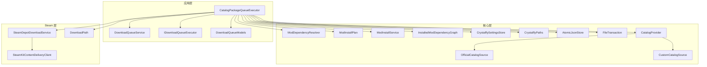
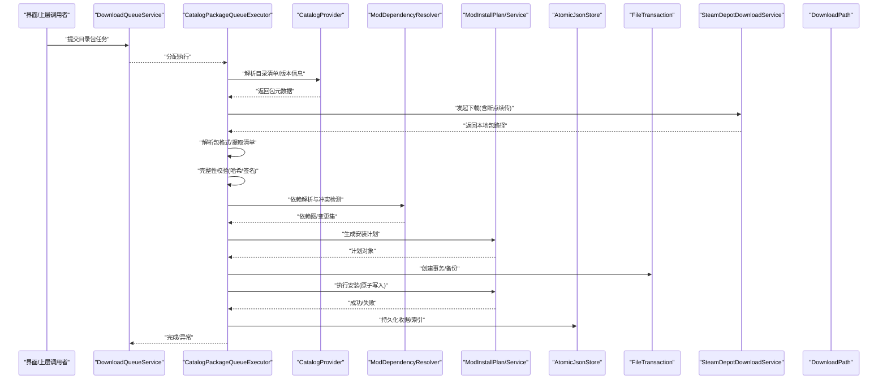
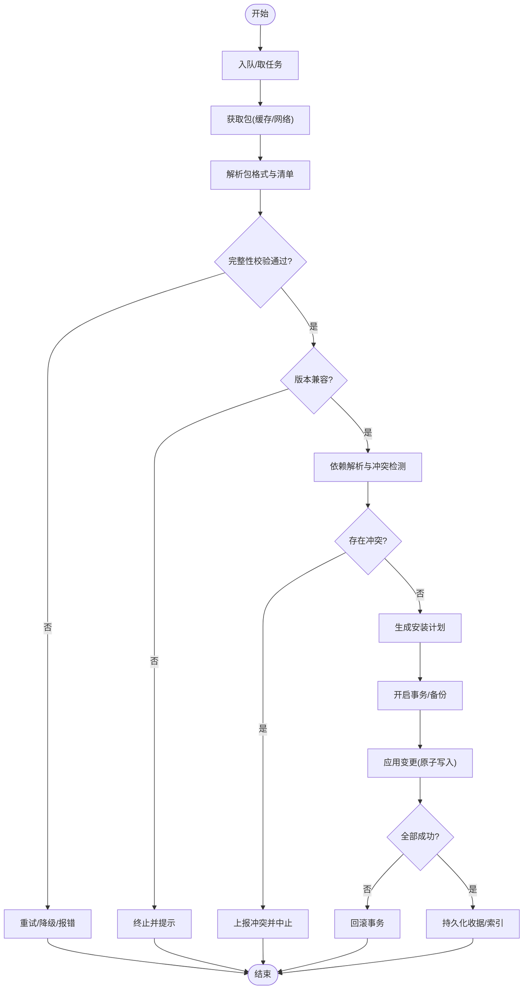
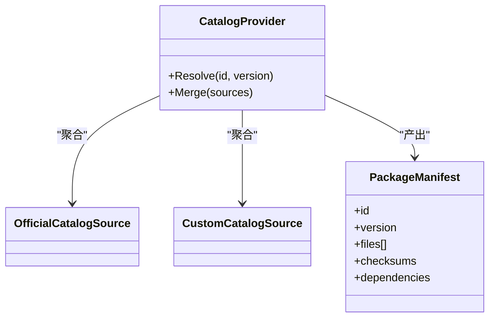
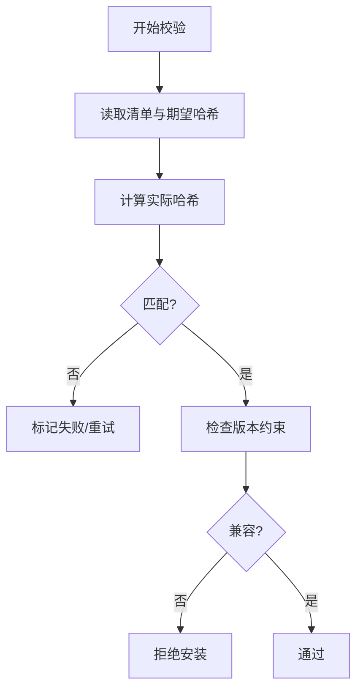
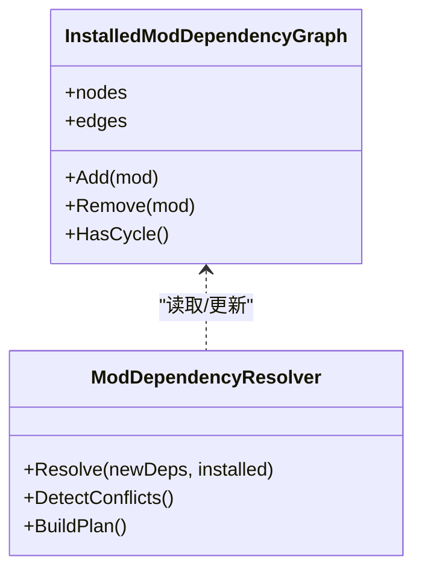
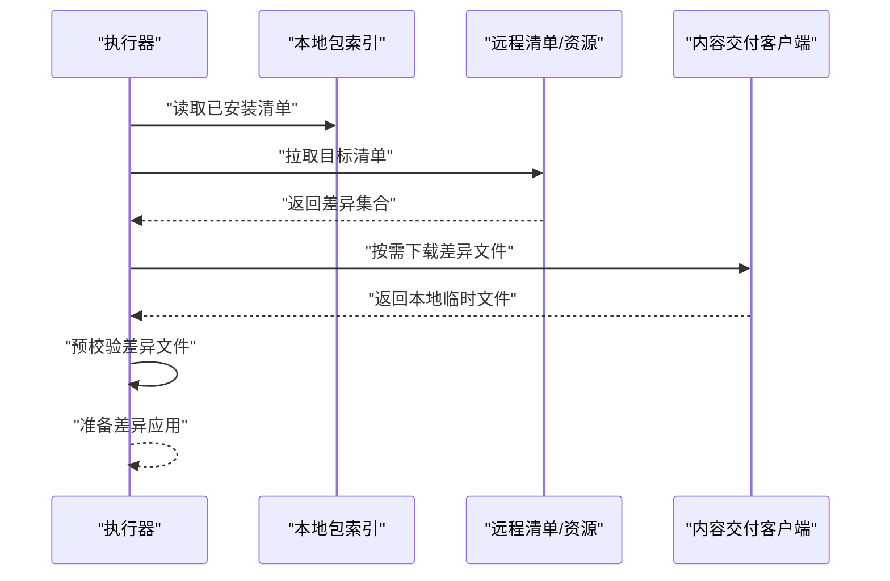
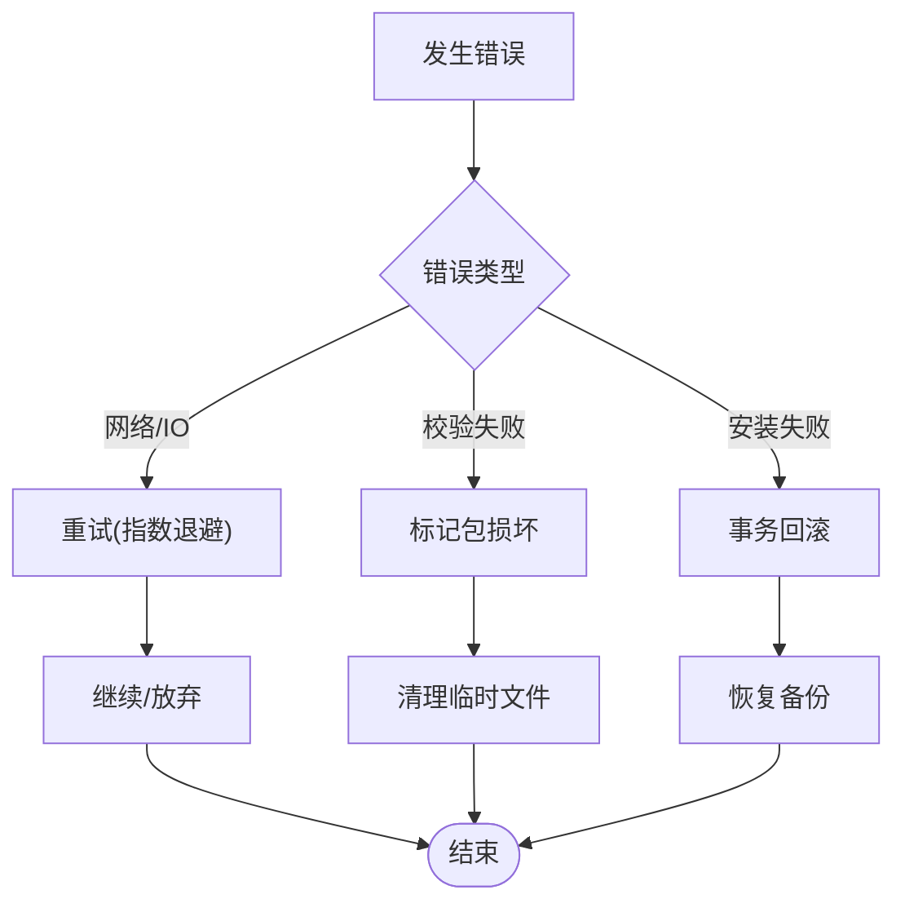
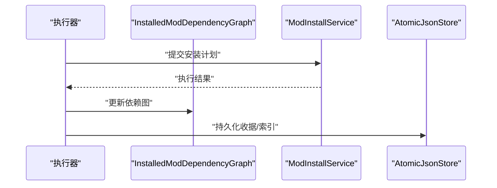
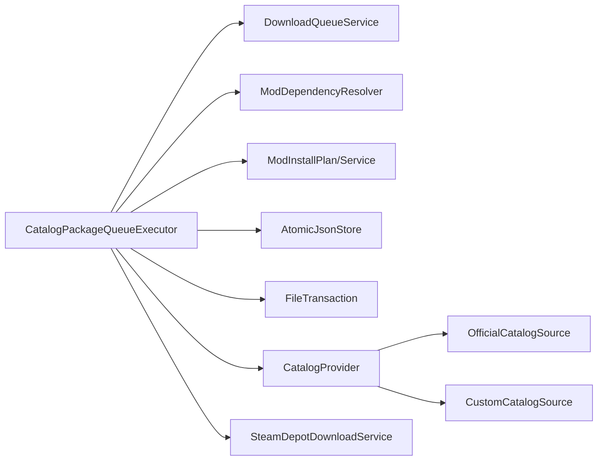

# 模组目录包执行器

<cite>
**本文引用的文件**   
- [CatalogPackageQueueExecutor.cs](file://src/Crystalfly.App/Downloads/CatalogPackageQueueExecutor.cs)
- [IDownloadQueueExecutor.cs](file://src/Crystalfly.App/Downloads/IDownloadQueueExecutor.cs)
- [DownloadQueueService.cs](file://src/Crystalfly.App/Downloads/DownloadQueueService.cs)
- [DownloadQueueModels.cs](file://src/Crystalfly.App/Downloads/DownloadQueueModels.cs)
- [ModDependencyResolver.cs](file://src/Crystalfly.Core/Mods/ModDependencyResolver.cs)
- [ModInstallPlan.cs](file://src/Crystalfly.Core/Mods/ModInstallPlan.cs)
- [ModInstallService.cs](file://src/Crystalfly.Core/Mods/ModInstallService.cs)
- [InstalledModDependencyGraph.cs](file://src/Crystalfly.Core/Mods/InstalledModDependencyGraph.cs)
- [CrystalflySettingsStore.cs](file://src/Crystalfly.Core/Configuration/CrystalflySettingsStore.cs)
- [CrystalflyPaths.cs](file://src/Crystalfly.Core/Configuration/CrystalflyPaths.cs)
- [AtomicJsonStore.cs](file://src/Crystalfly.Core/Serialization/AtomicJsonStore.cs)
- [FileTransaction.cs](file://src/Crystalfly.Core/Transactions/FileTransaction.cs)
- [OfficialCatalogSource.cs](file://src/Crystalfly.Core/Catalog/OfficialCatalogSource.cs)
- [CustomCatalogSource.cs](file://src/Crystalfly.Core/Catalog/CustomCatalogSource.cs)
- [CatalogProvider.cs](file://src/Crystalfly.Core/Catalog/CatalogProvider.cs)
- [SteamDepotDownloadService.cs](file://src/Crystalfly.Steam/Downloads/SteamDepotDownloadService.cs)
- [SteamKitContentDeliveryClient.cs](file://src/Crystalfly.Steam/Downloads/SteamKitContentDeliveryClient.cs)
- [DownloadPath.cs](file://src/Crystalfly.Steam/Downloads/DownloadPath.cs)
</cite>

## 目录
1. [简介](#简介)
2. [项目结构](#项目结构)
3. [核心组件](#核心组件)
4. [架构总览](#架构总览)
5. [详细组件分析](#详细组件分析)
6. [依赖关系分析](#依赖关系分析)
7. [性能考虑](#性能考虑)
8. [故障排查指南](#故障排查指南)
9. [结论](#结论)
10. [附录](#附录)

## 简介
本文件围绕“模组目录包执行器”展开，重点解析 CatalogPackageQueueExecutor 在模组目录包下载与验证中的职责与流程。文档涵盖：
- 包格式解析、完整性校验与版本兼容性检查机制
- 包依赖关系的自动解析与冲突检测
- 增量更新策略与差异下载算法
- 配置项（包源优先级、缓存策略、验证规则）
- 错误处理与恢复（损坏包重试、备份恢复）
- 与模组管理系统的集成与数据同步

## 项目结构
与目录包执行相关的代码主要分布在以下模块：
- App 层：队列执行器、队列服务、模型定义
- Core 层：依赖解析、安装计划与服务、设置与路径、序列化与事务
- Steam 层：内容交付客户端与下载路径

图表来源
- [CatalogPackageQueueExecutor.cs:1-200](file://src/Crystalfly.App/Downloads/CatalogPackageQueueExecutor.cs#L1-L200)
- [DownloadQueueService.cs:1-200](file://src/Crystalfly.App/Downloads/DownloadQueueService.cs#L1-L200)
- [IDownloadQueueExecutor.cs:1-100](file://src/Crystalfly.App/Downloads/IDownloadQueueExecutor.cs#L1-L100)
- [DownloadQueueModels.cs:1-200](file://src/Crystalfly.App/Downloads/DownloadQueueModels.cs#L1-L200)
- [ModDependencyResolver.cs:1-200](file://src/Crystalfly.Core/Mods/ModDependencyResolver.cs#L1-L200)
- [ModInstallPlan.cs:1-200](file://src/Crystalfly.Core/Mods/ModInstallPlan.cs#L1-L200)
- [ModInstallService.cs:1-200](file://src/Crystalfly.Core/Mods/ModInstallService.cs#L1-L200)
- [InstalledModDependencyGraph.cs:1-200](file://src/Crystalfly.Core/Mods/InstalledModDependencyGraph.cs#L1-L200)
- [CrystalflySettingsStore.cs:1-200](file://src/Crystalfly.Core/Configuration/CrystalflySettingsStore.cs#L1-L200)
- [CrystalflyPaths.cs:1-200](file://src/Crystalfly.Core/Configuration/CrystalflyPaths.cs#L1-L200)
- [AtomicJsonStore.cs:1-200](file://src/Crystalfly.Core/Serialization/AtomicJsonStore.cs#L1-L200)
- [FileTransaction.cs:1-200](file://src/Crystalfly.Core/Transactions/FileTransaction.cs#L1-L200)
- [CatalogProvider.cs:1-200](file://src/Crystalfly.Core/Catalog/CatalogProvider.cs#L1-L200)
- [OfficialCatalogSource.cs:1-200](file://src/Crystalfly.Core/Catalog/OfficialCatalogSource.cs#L1-L200)
- [CustomCatalogSource.cs:1-200](file://src/Crystalfly.Core/Catalog/CustomCatalogSource.cs#L1-L200)
- [SteamDepotDownloadService.cs:1-200](file://src/Crystalfly.Steam/Downloads/SteamDepotDownloadService.cs#L1-L200)
- [SteamKitContentDeliveryClient.cs:1-200](file://src/Crystalfly.Steam/Downloads/SteamKitContentDeliveryClient.cs#L1-L200)
- [DownloadPath.cs:1-200](file://src/Crystalfly.Steam/Downloads/DownloadPath.cs#L1-L200)

章节来源
- [CatalogPackageQueueExecutor.cs:1-200](file://src/Crystalfly.App/Downloads/CatalogPackageQueueExecutor.cs#L1-L200)
- [DownloadQueueService.cs:1-200](file://src/Crystalfly.App/Downloads/DownloadQueueService.cs#L1-L200)
- [IDownloadQueueExecutor.cs:1-100](file://src/Crystalfly.App/Downloads/IDownloadQueueExecutor.cs#L1-L100)
- [DownloadQueueModels.cs:1-200](file://src/Crystalfly.App/Downloads/DownloadQueueModels.cs#L1-L200)

## 核心组件
- CatalogPackageQueueExecutor：负责将目录包任务纳入下载队列，协调下载、校验、依赖解析、安装计划生成与执行，以及结果持久化与回滚。
- DownloadQueueService：提供队列的入队、出队、并发控制与进度聚合。
- IDownloadQueueExecutor：统一执行器接口，便于扩展不同来源的执行器。
- ModDependencyResolver：基于已安装图与目录清单解析依赖、构建有向无环图并检测冲突。
- ModInstallPlan/ModInstallService：封装安装计划与原子化安装步骤。
- CrystalflySettingsStore/CrystalflyPaths：集中管理与读取配置与路径。
- AtomicJsonStore/FileTransaction：保证元数据与事务性文件操作的可靠性。
- CatalogProvider/OfficialCatalogSource/CustomCatalogSource：目录源提供者与合并策略。
- SteamDepotDownloadService/SteamKitContentDeliveryClient/DownloadPath：Steam 内容交付与下载路径管理。

章节来源
- [CatalogPackageQueueExecutor.cs:1-200](file://src/Crystalfly.App/Downloads/CatalogPackageQueueExecutor.cs#L1-L200)
- [DownloadQueueService.cs:1-200](file://src/Crystalfly.App/Downloads/DownloadQueueService.cs#L1-L200)
- [IDownloadQueueExecutor.cs:1-100](file://src/Crystalfly.App/Downloads/IDownloadQueueExecutor.cs#L1-L100)
- [ModDependencyResolver.cs:1-200](file://src/Crystalfly.Core/Mods/ModDependencyResolver.cs#L1-L200)
- [ModInstallPlan.cs:1-200](file://src/Crystalfly.Core/Mods/ModInstallPlan.cs#L1-L200)
- [ModInstallService.cs:1-200](file://src/Crystalfly.Core/Mods/ModInstallService.cs#L1-L200)
- [CrystalflySettingsStore.cs:1-200](file://src/Crystalfly.Core/Configuration/CrystalflySettingsStore.cs#L1-L200)
- [CrystalflyPaths.cs:1-200](file://src/Crystalfly.Core/Configuration/CrystalflyPaths.cs#L1-L200)
- [AtomicJsonStore.cs:1-200](file://src/Crystalfly.Core/Serialization/AtomicJsonStore.cs#L1-L200)
- [FileTransaction.cs:1-200](file://src/Crystalfly.Core/Transactions/FileTransaction.cs#L1-L200)
- [CatalogProvider.cs:1-200](file://src/Crystalfly.Core/Catalog/CatalogProvider.cs#L1-L200)
- [OfficialCatalogSource.cs:1-200](file://src/Crystalfly.Core/Catalog/OfficialCatalogSource.cs#L1-L200)
- [CustomCatalogSource.cs:1-200](file://src/Crystalfly.Core/Catalog/CustomCatalogSource.cs#L1-L200)
- [SteamDepotDownloadService.cs:1-200](file://src/Crystalfly.Steam/Downloads/SteamDepotDownloadService.cs#L1-L200)
- [SteamKitContentDeliveryClient.cs:1-200](file://src/Crystalfly.Steam/Downloads/SteamKitContentDeliveryClient.cs#L1-L200)
- [DownloadPath.cs:1-200](file://src/Crystalfly.Steam/Downloads/DownloadPath.cs#L1-L200)

## 架构总览
目录包执行的整体流程从队列调度开始，依次完成包获取、解析、校验、依赖解析、安装计划与执行，最终落盘并持久化状态。

图表来源
- [CatalogPackageQueueExecutor.cs:1-200](file://src/Crystalfly.App/Downloads/CatalogPackageQueueExecutor.cs#L1-L200)
- [DownloadQueueService.cs:1-200](file://src/Crystalfly.App/Downloads/DownloadQueueService.cs#L1-L200)
- [CatalogProvider.cs:1-200](file://src/Crystalfly.Core/Catalog/CatalogProvider.cs#L1-L200)
- [ModDependencyResolver.cs:1-200](file://src/Crystalfly.Core/Mods/ModDependencyResolver.cs#L1-L200)
- [ModInstallPlan.cs:1-200](file://src/Crystalfly.Core/Mods/ModInstallPlan.cs#L1-L200)
- [ModInstallService.cs:1-200](file://src/Crystalfly.Core/Mods/ModInstallService.cs#L1-L200)
- [AtomicJsonStore.cs:1-200](file://src/Crystalfly.Core/Serialization/AtomicJsonStore.cs#L1-L200)
- [FileTransaction.cs:1-200](file://src/Crystalfly.Core/Transactions/FileTransaction.cs#L1-L200)
- [SteamDepotDownloadService.cs:1-200](file://src/Crystalfly.Steam/Downloads/SteamDepotDownloadService.cs#L1-L200)
- [DownloadPath.cs:1-200](file://src/Crystalfly.Steam/Downloads/DownloadPath.cs#L1-L200)

## 详细组件分析

### CatalogPackageQueueExecutor 执行流程
- 任务入队与调度：由 DownloadQueueService 分发到具体执行器；执行器内部维护任务上下文与状态机。
- 包获取：优先使用本地缓存或断点续传；若为 Steam 内容，通过 SteamDepotDownloadService 与 SteamKitContentDeliveryClient 协作。
- 包格式解析：根据目录清单与包内清单进行解析，识别包标识、版本、资源清单与元数据。
- 完整性校验：对包内容与清单进行哈希校验，必要时进行签名验证。
- 版本兼容性检查：对比目标实例/加载器的版本约束，拒绝不兼容版本。
- 依赖解析与冲突检测：基于 InstalledModDependencyGraph 与 ModDependencyResolver 构建依赖图，检测循环与冲突。
- 安装计划与执行：生成 ModInstallPlan，使用 FileTransaction 进行原子写入，失败时回滚。
- 持久化与通知：更新 AtomicJsonStore 中的收据与索引，向上层报告进度与结果。

图表来源
- [CatalogPackageQueueExecutor.cs:1-200](file://src/Crystalfly.App/Downloads/CatalogPackageQueueExecutor.cs#L1-L200)
- [DownloadQueueService.cs:1-200](file://src/Crystalfly.App/Downloads/DownloadQueueService.cs#L1-L200)
- [ModDependencyResolver.cs:1-200](file://src/Crystalfly.Core/Mods/ModDependencyResolver.cs#L1-L200)
- [ModInstallPlan.cs:1-200](file://src/Crystalfly.Core/Mods/ModInstallPlan.cs#L1-L200)
- [FileTransaction.cs:1-200](file://src/Crystalfly.Core/Transactions/FileTransaction.cs#L1-L200)
- [AtomicJsonStore.cs:1-200](file://src/Crystalfly.Core/Serialization/AtomicJsonStore.cs#L1-L200)

章节来源
- [CatalogPackageQueueExecutor.cs:1-200](file://src/Crystalfly.App/Downloads/CatalogPackageQueueExecutor.cs#L1-L200)
- [DownloadQueueService.cs:1-200](file://src/Crystalfly.App/Downloads/DownloadQueueService.cs#L1-L200)

### 包格式解析与清单模型
- 目录清单：由 CatalogProvider 聚合 OfficialCatalogSource 与 CustomCatalogSource，提供统一的包元数据视图。
- 包内清单：包含资源列表、版本、依赖、校验值等；用于后续解析与校验。
- 解析流程：先解析目录清单定位包，再打开包文件解析内部清单，建立资源映射。

图表来源
- [CatalogProvider.cs:1-200](file://src/Crystalfly.Core/Catalog/CatalogProvider.cs#L1-L200)
- [OfficialCatalogSource.cs:1-200](file://src/Crystalfly.Core/Catalog/OfficialCatalogSource.cs#L1-L200)
- [CustomCatalogSource.cs:1-200](file://src/Crystalfly.Core/Catalog/CustomCatalogSource.cs#L1-L200)

章节来源
- [CatalogProvider.cs:1-200](file://src/Crystalfly.Core/Catalog/CatalogProvider.cs#L1-L200)
- [OfficialCatalogSource.cs:1-200](file://src/Crystalfly.Core/Catalog/OfficialCatalogSource.cs#L1-L200)
- [CustomCatalogSource.cs:1-200](file://src/Crystalfly.Core/Catalog/CustomCatalogSource.cs#L1-L200)

### 完整性校验与版本兼容性检查
- 完整性校验：对包内容与清单计算哈希，比对预期值；支持分块校验与增量校验。
- 版本兼容性：依据目标环境（游戏/加载器）的版本范围与包声明的约束进行判定。
- 失败策略：校验失败触发重试或标记不可用；版本不兼容直接中止并提示。

图表来源
- [CatalogPackageQueueExecutor.cs:1-200](file://src/Crystalfly.App/Downloads/CatalogPackageQueueExecutor.cs#L1-L200)

章节来源
- [CatalogPackageQueueExecutor.cs:1-200](file://src/Crystalfly.App/Downloads/CatalogPackageQueueExecutor.cs#L1-L200)

### 依赖解析与冲突检测
- 依赖图：基于 InstalledModDependencyGraph 记录已安装包的依赖关系。
- 解析过程：ModDependencyResolver 将新包依赖与现有图合并，构建新的有向无环图。
- 冲突检测：检测循环依赖、版本冲突、覆盖冲突；输出冲突详情供用户确认或自动修复。

图表来源
- [InstalledModDependencyGraph.cs:1-200](file://src/Crystalfly.Core/Mods/InstalledModDependencyGraph.cs#L1-L200)
- [ModDependencyResolver.cs:1-200](file://src/Crystalfly.Core/Mods/ModDependencyResolver.cs#L1-L200)

章节来源
- [InstalledModDependencyGraph.cs:1-200](file://src/Crystalfly.Core/Mods/InstalledModDependencyGraph.cs#L1-L200)
- [ModDependencyResolver.cs:1-200](file://src/Crystalfly.Core/Mods/ModDependencyResolver.cs#L1-L200)

### 增量更新与差异下载
- 差异计算：比较本地已安装包与目标包清单，仅拉取变更文件。
- 断点续传：结合 DownloadPath 与 SteamKitContentDeliveryClient 实现大文件分段下载与恢复。
- 一致性保障：差异应用前进行预校验，确保局部失败不影响整体一致性。

图表来源
- [CatalogPackageQueueExecutor.cs:1-200](file://src/Crystalfly.App/Downloads/CatalogPackageQueueExecutor.cs#L1-L200)
- [SteamKitContentDeliveryClient.cs:1-200](file://src/Crystalfly.Steam/Downloads/SteamKitContentDeliveryClient.cs#L1-L200)
- [DownloadPath.cs:1-200](file://src/Crystalfly.Steam/Downloads/DownloadPath.cs#L1-L200)

章节来源
- [CatalogPackageQueueExecutor.cs:1-200](file://src/Crystalfly.App/Downloads/CatalogPackageQueueExecutor.cs#L1-L200)
- [SteamKitContentDeliveryClient.cs:1-200](file://src/Crystalfly.Steam/Downloads/SteamKitContentDeliveryClient.cs#L1-L200)
- [DownloadPath.cs:1-200](file://src/Crystalfly.Steam/Downloads/DownloadPath.cs#L1-L200)

### 配置选项与策略
- 包源优先级：通过 CatalogProvider 聚合多个源，按优先级顺序解析与合并。
- 缓存策略：本地缓存命中优先，未命中则下载；支持校验后入库。
- 验证规则：可配置是否强制签名校验、严格模式（拒绝任何不兼容）、宽松模式（允许警告继续）。
- 路径与存储：CrystalflyPaths 提供下载、缓存、事务与持久化路径；AtomicJsonStore 负责元数据持久化。

章节来源
- [CatalogProvider.cs:1-200](file://src/Crystalfly.Core/Catalog/CatalogProvider.cs#L1-L200)
- [CrystalflySettingsStore.cs:1-200](file://src/Crystalfly.Core/Configuration/CrystalflySettingsStore.cs#L1-L200)
- [CrystalflyPaths.cs:1-200](file://src/Crystalfly.Core/Configuration/CrystalflyPaths.cs#L1-L200)
- [AtomicJsonStore.cs:1-200](file://src/Crystalfly.Core/Serialization/AtomicJsonStore.cs#L1-L200)

### 错误处理与恢复机制
- 损坏包重试：下载失败或校验失败时，按指数退避策略重试，超过阈值标记失败。
- 事务与回滚：使用 FileTransaction 包裹所有写操作，失败时自动回滚至一致状态。
- 备份恢复：在安装前创建快照/备份，失败时恢复到备份点。
- 状态持久化：AtomicJsonStore 保存任务状态与收据，崩溃后可恢复进度。

图表来源
- [FileTransaction.cs:1-200](file://src/Crystalfly.Core/Transactions/FileTransaction.cs#L1-L200)
- [AtomicJsonStore.cs:1-200](file://src/Crystalfly.Core/Serialization/AtomicJsonStore.cs#L1-L200)
- [CatalogPackageQueueExecutor.cs:1-200](file://src/Crystalfly.App/Downloads/CatalogPackageQueueExecutor.cs#L1-L200)

章节来源
- [FileTransaction.cs:1-200](file://src/Crystalfly.Core/Transactions/FileTransaction.cs#L1-L200)
- [AtomicJsonStore.cs:1-200](file://src/Crystalfly.Core/Serialization/AtomicJsonStore.cs#L1-L200)
- [CatalogPackageQueueExecutor.cs:1-200](file://src/Crystalfly.App/Downloads/CatalogPackageQueueExecutor.cs#L1-L200)

### 与模组管理系统的集成与数据同步
- 依赖图同步：安装完成后更新 InstalledModDependencyGraph，保持全局依赖视图一致。
- 收据与索引：持久化 InstalledPackageReceipt 与相关索引，供查询与审计。
- 计划与执行：ModInstallPlan 与 ModInstallService 提供标准化安装流程，确保与其他子系统（如运行时、快照）协同。

图表来源
- [InstalledModDependencyGraph.cs:1-200](file://src/Crystalfly.Core/Mods/InstalledModDependencyGraph.cs#L1-L200)
- [ModInstallService.cs:1-200](file://src/Crystalfly.Core/Mods/ModInstallService.cs#L1-L200)
- [AtomicJsonStore.cs:1-200](file://src/Crystalfly.Core/Serialization/AtomicJsonStore.cs#L1-L200)

章节来源
- [InstalledModDependencyGraph.cs:1-200](file://src/Crystalfly.Core/Mods/InstalledModDependencyGraph.cs#L1-L200)
- [ModInstallService.cs:1-200](file://src/Crystalfly.Core/Mods/ModInstallService.cs#L1-L200)
- [AtomicJsonStore.cs:1-200](file://src/Crystalfly.Core/Serialization/AtomicJsonStore.cs#L1-L200)

## 依赖关系分析
- 耦合度：执行器与队列服务、依赖解析、安装服务、存储与事务紧密耦合，但通过接口与分层降低直接依赖。
- 外部依赖：Steam 内容交付作为可选来源，通过抽象客户端接入。
- 潜在循环：依赖解析需避免与安装服务形成循环调用，当前以计划对象解耦。

图表来源
- [CatalogPackageQueueExecutor.cs:1-200](file://src/Crystalfly.App/Downloads/CatalogPackageQueueExecutor.cs#L1-L200)
- [DownloadQueueService.cs:1-200](file://src/Crystalfly.App/Downloads/DownloadQueueService.cs#L1-L200)
- [ModDependencyResolver.cs:1-200](file://src/Crystalfly.Core/Mods/ModDependencyResolver.cs#L1-L200)
- [ModInstallPlan.cs:1-200](file://src/Crystalfly.Core/Mods/ModInstallPlan.cs#L1-L200)
- [ModInstallService.cs:1-200](file://src/Crystalfly.Core/Mods/ModInstallService.cs#L1-L200)
- [AtomicJsonStore.cs:1-200](file://src/Crystalfly.Core/Serialization/AtomicJsonStore.cs#L1-L200)
- [FileTransaction.cs:1-200](file://src/Crystalfly.Core/Transactions/FileTransaction.cs#L1-L200)
- [CatalogProvider.cs:1-200](file://src/Crystalfly.Core/Catalog/CatalogProvider.cs#L1-L200)
- [OfficialCatalogSource.cs:1-200](file://src/Crystalfly.Core/Catalog/OfficialCatalogSource.cs#L1-L200)
- [CustomCatalogSource.cs:1-200](file://src/Crystalfly.Core/Catalog/CustomCatalogSource.cs#L1-L200)
- [SteamDepotDownloadService.cs:1-200](file://src/Crystalfly.Steam/Downloads/SteamDepotDownloadService.cs#L1-L200)

章节来源
- [CatalogPackageQueueExecutor.cs:1-200](file://src/Crystalfly.App/Downloads/CatalogPackageQueueExecutor.cs#L1-L200)
- [DownloadQueueService.cs:1-200](file://src/Crystalfly.App/Downloads/DownloadQueueService.cs#L1-L200)
- [ModDependencyResolver.cs:1-200](file://src/Crystalfly.Core/Mods/ModDependencyResolver.cs#L1-L200)
- [ModInstallPlan.cs:1-200](file://src/Crystalfly.Core/Mods/ModInstallPlan.cs#L1-L200)
- [ModInstallService.cs:1-200](file://src/Crystalfly.Core/Mods/ModInstallService.cs#L1-L200)
- [AtomicJsonStore.cs:1-200](file://src/Crystalfly.Core/Serialization/AtomicJsonStore.cs#L1-L200)
- [FileTransaction.cs:1-200](file://src/Crystalfly.Core/Transactions/FileTransaction.cs#L1-L200)
- [CatalogProvider.cs:1-200](file://src/Crystalfly.Core/Catalog/CatalogProvider.cs#L1-L200)
- [OfficialCatalogSource.cs:1-200](file://src/Crystalfly.Core/Catalog/OfficialCatalogSource.cs#L1-L200)
- [CustomCatalogSource.cs:1-200](file://src/Crystalfly.Core/Catalog/CustomCatalogSource.cs#L1-L200)
- [SteamDepotDownloadService.cs:1-200](file://src/Crystalfly.Steam/Downloads/SteamDepotDownloadService.cs#L1-L200)

## 性能考虑
- 并行下载：利用队列服务的并发能力，合理限制并发数以避免带宽拥塞。
- 增量下载：优先差异更新，减少网络与磁盘 IO。
- 缓存命中：提高本地缓存命中率，缩短启动与安装时间。
- 校验优化：采用分块校验与流式哈希，避免全量重算。
- 事务批处理：批量写入减少系统调用开销。

[本节为通用指导，无需特定文件引用]

## 故障排查指南
- 下载失败：检查网络连通性与 Steam 客户端状态；查看重试次数与退避策略。
- 校验失败：确认清单哈希与签名是否正确；清理临时文件后重试。
- 依赖冲突：查看冲突详情，调整依赖版本或卸载冲突包。
- 安装回滚：检查事务日志与备份点，确认回滚是否成功。
- 状态不一致：核对 AtomicJsonStore 中的收据与索引，必要时重建索引。

章节来源
- [CatalogPackageQueueExecutor.cs:1-200](file://src/Crystalfly.App/Downloads/CatalogPackageQueueExecutor.cs#L1-L200)
- [FileTransaction.cs:1-200](file://src/Crystalfly.Core/Transactions/FileTransaction.cs#L1-L200)
- [AtomicJsonStore.cs:1-200](file://src/Crystalfly.Core/Serialization/AtomicJsonStore.cs#L1-L200)

## 结论
CatalogPackageQueueExecutor 通过队列调度、可靠下载、严格校验、依赖解析与原子安装，构建了稳健的模组目录包执行链路。配合配置化策略与完善的错误恢复机制，能够在复杂环境下保证模组生态的一致性与可用性。

[本节为总结，无需特定文件引用]

## 附录
- 术语
  - 目录包：由目录清单描述的模组包集合，支持多源聚合与版本选择。
  - 事务：一组文件操作的原子单元，失败时整体回滚。
  - 收据：安装结果的持久化凭证，用于审计与恢复。

[本节为概念说明，无需特定文件引用]