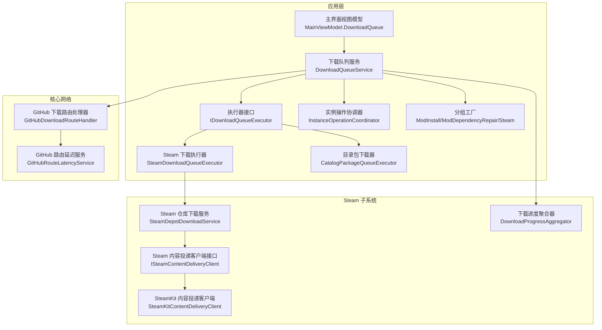
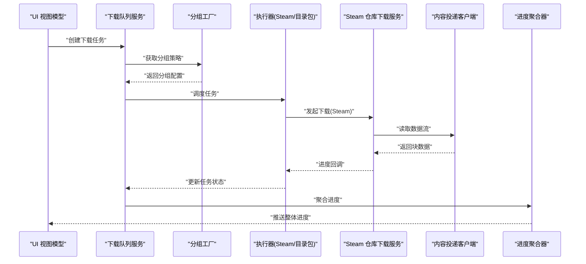
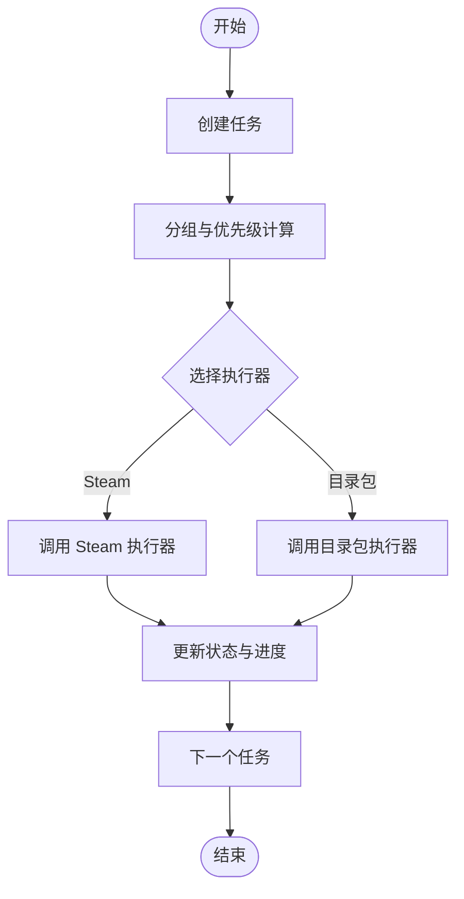
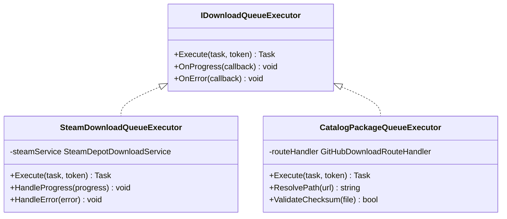
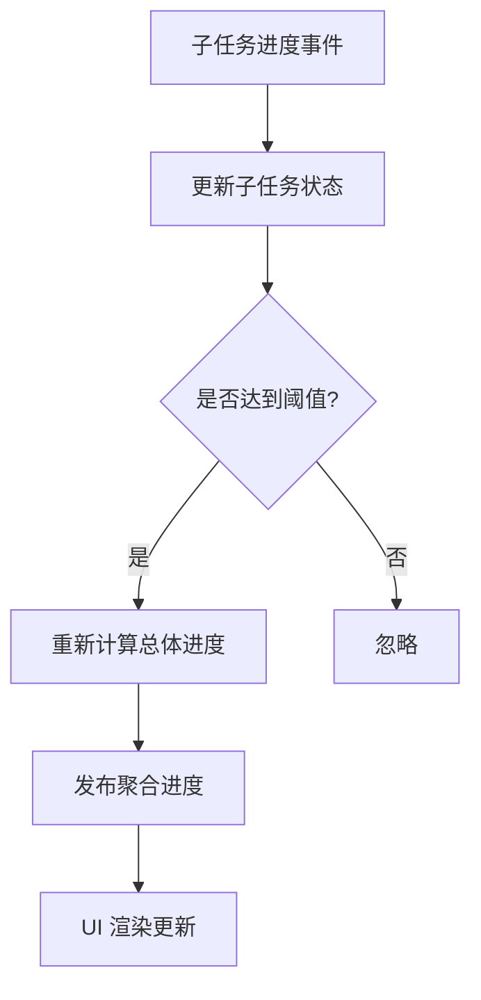
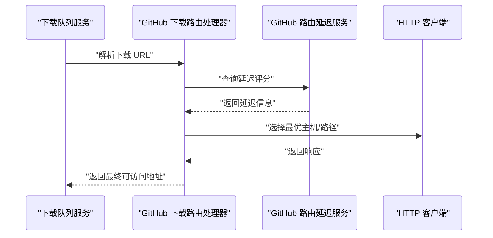
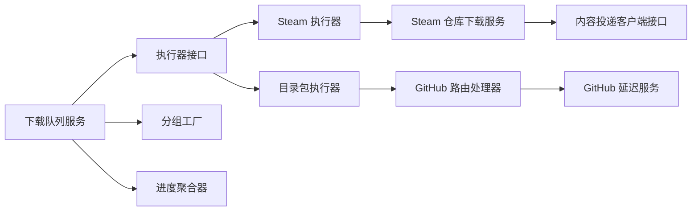
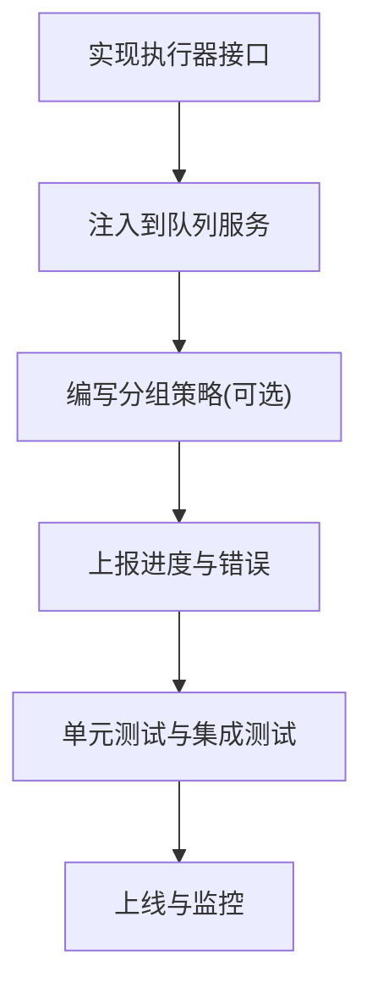

# 下载系统

<cite>
**本文引用的文件**   
- [DownloadQueueService.cs](file://src/Crystalfly.App/Downloads/DownloadQueueService.cs)
- [IDownloadQueueExecutor.cs](file://src/Crystalfly.App/Downloads/IDownloadQueueExecutor.cs)
- [SteamDownloadQueueExecutor.cs](file://src/Crystalfly.App/Downloads/SteamDownloadQueueExecutor.cs)
- [CatalogPackageQueueExecutor.cs](file://src/Crystalfly.App/Downloads/CatalogPackageQueueExecutor.cs)
- [InstanceOperationCoordinator.cs](file://src/Crystalfly.App/Downloads/InstanceOperationCoordinator.cs)
- [DownloadQueueModels.cs](file://src/Crystalfly.App/Downloads/DownloadQueueModels.cs)
- [ModInstallQueueGroupFactory.cs](file://src/Crystalfly.App/Downloads/ModInstallQueueGroupFactory.cs)
- [ModDependencyRepairQueueGroupFactory.cs](file://src/Crystalfly.App/Downloads/ModDependencyRepairQueueGroupFactory.cs)
- [SteamDownloadQueueGroupFactory.cs](file://src/Crystalfly.App/Downloads/SteamDownloadQueueGroupFactory.cs)
- [MainViewModel.DownloadQueue.cs](file://src/Crystalfly.App/ViewModels/MainViewModel.DownloadQueue.cs)
- [DownloadProgressAggregator.cs](file://src/Crystalfly.Steam/Downloads/DownloadProgressAggregator.cs)
- [SteamDepotDownloadService.cs](file://src/Crystalfly.Steam/Downloads/SteamDepotDownloadService.cs)
- [ISteamContentDeliveryClient.cs](file://src/Crystalfly.Steam/Downloads/ISteamContentDeliveryClient.cs)
- [SteamKitContentDeliveryClient.cs](file://src/Crystalfly.Steam/Downloads/SteamKitContentDeliveryClient.cs)
- [GitHubDownloadRouteHandler.cs](file://src/Crystalfly.Core/Networking/GitHubDownloadRouteHandler.cs)
- [GitHubRouteLatencyService.cs](file://src/Crystalfly.Core/Networking/GitHubRouteLatencyService.cs)
</cite>

## 目录
1. [简介](#简介)
2. [项目结构](#项目结构)
3. [核心组件](#核心组件)
4. [架构总览](#架构总览)
5. [详细组件分析](#详细组件分析)
6. [依赖关系分析](#依赖关系分析)
7. [性能与并发控制](#性能与并发控制)
8. [故障排查指南](#故障排查指南)
9. [结论](#结论)
10. [附录：扩展新执行器示例](#附录扩展新执行器示例)

## 简介
本文件面向下载系统的实现与使用，重点覆盖以下主题：
- 下载队列架构、多执行器支持与进度聚合机制
- Steam 下载执行器、目录包下载器与实例操作协调器的设计与实现
- 下载任务的创建、调度、监控与错误处理
- 网络路由处理、延迟服务与连接池管理
- 并发控制、断点续传与带宽限制
- 网络异常、重试策略与超时处理
- 如何扩展新的下载执行器

## 项目结构
下载系统主要分布在应用层（App）与 Steam 子系统（Steam），并依赖核心网络能力（Core）。关键目录与职责如下：
- App/Downloads：下载队列服务、执行器接口与具体实现、任务分组工厂、实例操作协调器
- Steam/Downloads：Steam 内容投递客户端、下载进度聚合、仓库下载服务
- Core/Networking：GitHub 下载路由处理器与延迟服务

图表来源
- [DownloadQueueService.cs:1-200](file://src/Crystalfly.App/Downloads/DownloadQueueService.cs#L1-L200)
- [IDownloadQueueExecutor.cs:1-120](file://src/Crystalfly.App/Downloads/IDownloadQueueExecutor.cs#L1-L120)
- [SteamDownloadQueueExecutor.cs:1-200](file://src/Crystalfly.App/Downloads/SteamDownloadQueueExecutor.cs#L1-L200)
- [CatalogPackageQueueExecutor.cs:1-200](file://src/Crystalfly.App/Downloads/CatalogPackageQueueExecutor.cs#L1-L200)
- [InstanceOperationCoordinator.cs:1-200](file://src/Crystalfly.App/Downloads/InstanceOperationCoordinator.cs#L1-L200)
- [DownloadProgressAggregator.cs:1-200](file://src/Crystalfly.Steam/Downloads/DownloadProgressAggregator.cs#L1-L200)
- [SteamDepotDownloadService.cs:1-200](file://src/Crystalfly.Steam/Downloads/SteamDepotDownloadService.cs#L1-L200)
- [ISteamContentDeliveryClient.cs:1-120](file://src/Crystalfly.Steam/Downloads/ISteamContentDeliveryClient.cs#L1-L120)
- [SteamKitContentDeliveryClient.cs:1-200](file://src/Crystalfly.Steam/Downloads/SteamKitContentDeliveryClient.cs#L1-L200)
- [GitHubDownloadRouteHandler.cs:1-200](file://src/Crystalfly.Core/Networking/GitHubDownloadRouteHandler.cs#L1-L200)
- [GitHubRouteLatencyService.cs:1-200](file://src/Crystalfly.Core/Networking/GitHubRouteLatencyService.cs#L1-L200)

章节来源
- [DownloadQueueService.cs:1-200](file://src/Crystalfly.App/Downloads/DownloadQueueService.cs#L1-L200)
- [IDownloadQueueExecutor.cs:1-120](file://src/Crystalfly.App/Downloads/IDownloadQueueExecutor.cs#L1-L120)
- [SteamDownloadQueueExecutor.cs:1-200](file://src/Crystalfly.App/Downloads/SteamDownloadQueueExecutor.cs#L1-L200)
- [CatalogPackageQueueExecutor.cs:1-200](file://src/Crystalfly.App/Downloads/CatalogPackageQueueExecutor.cs#L1-L200)
- [InstanceOperationCoordinator.cs:1-200](file://src/Crystalfly.App/Downloads/InstanceOperationCoordinator.cs#L1-L200)
- [DownloadProgressAggregator.cs:1-200](file://src/Crystalfly.Steam/Downloads/DownloadProgressAggregator.cs#L1-L200)
- [SteamDepotDownloadService.cs:1-200](file://src/Crystalfly.Steam/Downloads/SteamDepotDownloadService.cs#L1-L200)
- [ISteamContentDeliveryClient.cs:1-120](file://src/Crystalfly.Steam/Downloads/ISteamContentDeliveryClient.cs#L1-L120)
- [SteamKitContentDeliveryClient.cs:1-200](file://src/Crystalfly.Steam/Downloads/SteamKitContentDeliveryClient.cs#L1-L200)
- [GitHubDownloadRouteHandler.cs:1-200](file://src/Crystalfly.Core/Networking/GitHubDownloadRouteHandler.cs#L1-L200)
- [GitHubRouteLatencyService.cs:1-200](file://src/Crystalfly.Core/Networking/GitHubRouteLatencyService.cs#L1-L200)

## 核心组件
- 下载队列服务：负责任务生命周期管理、分组调度、状态同步与事件上报。
- 执行器接口与实现：统一抽象不同下载源（Steam、目录包等）的执行细节。
- 进度聚合器：汇总多个子任务的进度，提供整体百分比与速率统计。
- 实例操作协调器：在实例相关操作中协调下载顺序与资源占用。
- 网络路由与延迟服务：为 GitHub 等外部源提供路由选择与延迟评估。

章节来源
- [DownloadQueueService.cs:1-200](file://src/Crystalfly.App/Downloads/DownloadQueueService.cs#L1-L200)
- [IDownloadQueueExecutor.cs:1-120](file://src/Crystalfly.App/Downloads/IDownloadQueueExecutor.cs#L1-L120)
- [DownloadProgressAggregator.cs:1-200](file://src/Crystalfly.Steam/Downloads/DownloadProgressAggregator.cs#L1-L200)
- [InstanceOperationCoordinator.cs:1-200](file://src/Crystalfly.App/Downloads/InstanceOperationCoordinator.cs#L1-L200)
- [GitHubDownloadRouteHandler.cs:1-200](file://src/Crystalfly.Core/Networking/GitHubDownloadRouteHandler.cs#L1-L200)
- [GitHubRouteLatencyService.cs:1-200](file://src/Crystalfly.Core/Networking/GitHubRouteLatencyService.cs#L1-L200)

## 架构总览
下载系统采用“队列 + 多执行器”的架构模式：
- 上层通过队列服务提交任务，按分组与优先级进行调度
- 执行器根据任务类型委派到具体下载实现（Steam、目录包等）
- 进度聚合器将各子任务进度合并，供 UI 展示
- 网络层提供路由与延迟信息，辅助选择最优路径或节点

图表来源
- [DownloadQueueService.cs:1-200](file://src/Crystalfly.App/Downloads/DownloadQueueService.cs#L1-L200)
- [SteamDownloadQueueExecutor.cs:1-200](file://src/Crystalfly.App/Downloads/SteamDownloadQueueExecutor.cs#L1-L200)
- [SteamDepotDownloadService.cs:1-200](file://src/Crystalfly.Steam/Downloads/SteamDepotDownloadService.cs#L1-L200)
- [ISteamContentDeliveryClient.cs:1-120](file://src/Crystalfly.Steam/Downloads/ISteamContentDeliveryClient.cs#L1-L120)
- [DownloadProgressAggregator.cs:1-200](file://src/Crystalfly.Steam/Downloads/DownloadProgressAggregator.cs#L1-L200)

## 详细组件分析

### 下载队列服务
职责与要点：
- 任务创建与入队：接收来自 UI 的任务请求，生成内部任务对象并加入队列
- 分组与调度：依据分组工厂的策略对任务进行分组，按组内优先级与依赖关系调度
- 执行器分发：根据任务类型选择对应执行器执行
- 进度与状态同步：监听执行器回调，更新任务状态并通知 UI
- 错误处理：捕获异常，记录日志，触发重试或失败分支

图表来源
- [DownloadQueueService.cs:1-200](file://src/Crystalfly.App/Downloads/DownloadQueueService.cs#L1-L200)

章节来源
- [DownloadQueueService.cs:1-200](file://src/Crystalfly.App/Downloads/DownloadQueueService.cs#L1-L200)
- [DownloadQueueModels.cs:1-200](file://src/Crystalfly.App/Downloads/DownloadQueueModels.cs#L1-L200)

### 执行器接口与实现
- 接口定义：统一执行方法、取消令牌支持、进度回调与错误上报
- Steam 下载执行器：封装 Steam 仓库下载流程，处理认证、分块读取与校验
- 目录包下载器：从本地或远端目录拉取包文件，支持增量与断点续传

图表来源
- [IDownloadQueueExecutor.cs:1-120](file://src/Crystalfly.App/Downloads/IDownloadQueueExecutor.cs#L1-L120)
- [SteamDownloadQueueExecutor.cs:1-200](file://src/Crystalfly.App/Downloads/SteamDownloadQueueExecutor.cs#L1-L200)
- [CatalogPackageQueueExecutor.cs:1-200](file://src/Crystalfly.App/Downloads/CatalogPackageQueueExecutor.cs#L1-L200)

章节来源
- [IDownloadQueueExecutor.cs:1-120](file://src/Crystalfly.App/Downloads/IDownloadQueueExecutor.cs#L1-L120)
- [SteamDownloadQueueExecutor.cs:1-200](file://src/Crystalfly.App/Downloads/SteamDownloadQueueExecutor.cs#L1-L200)
- [CatalogPackageQueueExecutor.cs:1-200](file://src/Crystalfly.App/Downloads/CatalogPackageQueueExecutor.cs#L1-L200)

### 进度聚合机制
- 聚合器维护多个子任务进度，计算总体完成百分比与瞬时速率
- 支持权重配置，允许重要文件占更高权重
- 提供去抖与节流，避免频繁 UI 刷新

图表来源
- [DownloadProgressAggregator.cs:1-200](file://src/Crystalfly.Steam/Downloads/DownloadProgressAggregator.cs#L1-L200)

章节来源
- [DownloadProgressAggregator.cs:1-200](file://src/Crystalfly.Steam/Downloads/DownloadProgressAggregator.cs#L1-L200)

### 实例操作协调器
- 在实例安装、修复等操作中，协调下载与其他资源访问的顺序
- 防止并发冲突，确保文件写入互斥
- 与队列服务协作，保证任务原子性与一致性

章节来源
- [InstanceOperationCoordinator.cs:1-200](file://src/Crystalfly.App/Downloads/InstanceOperationCoordinator.cs#L1-L200)

### 分组工厂
- ModInstallQueueGroupFactory：按模组安装依赖关系构建分组
- ModDependencyRepairQueueGroupFactory：按依赖修复计划构建分组
- SteamDownloadQueueGroupFactory：按 Steam 产品与仓库维度构建分组

章节来源
- [ModInstallQueueGroupFactory.cs:1-200](file://src/Crystalfly.App/Downloads/ModInstallQueueGroupFactory.cs#L1-L200)
- [ModDependencyRepairQueueGroupFactory.cs:1-200](file://src/Crystalfly.App/Downloads/ModDependencyRepairQueueGroupFactory.cs#L1-L200)
- [SteamDownloadQueueGroupFactory.cs:1-200](file://src/Crystalfly.App/Downloads/SteamDownloadQueueGroupFactory.cs#L1-L200)

### 网络路由与延迟服务
- GitHubDownloadRouteHandler：根据目标地址与延迟信息选择最佳路由
- GitHubRouteLatencyService：定期探测延迟，缓存结果并用于路由决策

图表来源
- [GitHubDownloadRouteHandler.cs:1-200](file://src/Crystalfly.Core/Networking/GitHubDownloadRouteHandler.cs#L1-L200)
- [GitHubRouteLatencyService.cs:1-200](file://src/Crystalfly.Core/Networking/GitHubRouteLatencyService.cs#L1-L200)

章节来源
- [GitHubDownloadRouteHandler.cs:1-200](file://src/Crystalfly.Core/Networking/GitHubDownloadRouteHandler.cs#L1-L200)
- [GitHubRouteLatencyService.cs:1-200](file://src/Crystalfly.Core/Networking/GitHubRouteLatencyService.cs#L1-L200)

## 依赖关系分析
- 下载队列服务依赖执行器接口与分组工厂，解耦具体下载实现
- Steam 执行器依赖 Steam 仓库下载服务与内容投递客户端
- 目录包执行器依赖网络路由处理器与延迟服务
- 进度聚合器独立于执行器，仅消费进度事件

图表来源
- [DownloadQueueService.cs:1-200](file://src/Crystalfly.App/Downloads/DownloadQueueService.cs#L1-L200)
- [IDownloadQueueExecutor.cs:1-120](file://src/Crystalfly.App/Downloads/IDownloadQueueExecutor.cs#L1-L120)
- [SteamDownloadQueueExecutor.cs:1-200](file://src/Crystalfly.App/Downloads/SteamDownloadQueueExecutor.cs#L1-L200)
- [CatalogPackageQueueExecutor.cs:1-200](file://src/Crystalfly.App/Downloads/CatalogPackageQueueExecutor.cs#L1-L200)
- [SteamDepotDownloadService.cs:1-200](file://src/Crystalfly.Steam/Downloads/SteamDepotDownloadService.cs#L1-L200)
- [ISteamContentDeliveryClient.cs:1-120](file://src/Crystalfly.Steam/Downloads/ISteamContentDeliveryClient.cs#L1-L120)
- [GitHubDownloadRouteHandler.cs:1-200](file://src/Crystalfly.Core/Networking/GitHubDownloadRouteHandler.cs#L1-L200)
- [GitHubRouteLatencyService.cs:1-200](file://src/Crystalfly.Core/Networking/GitHubRouteLatencyService.cs#L1-L200)

章节来源
- [DownloadQueueService.cs:1-200](file://src/Crystalfly.App/Downloads/DownloadQueueService.cs#L1-L200)
- [IDownloadQueueExecutor.cs:1-120](file://src/Crystalfly.App/Downloads/IDownloadQueueExecutor.cs#L1-L120)
- [SteamDownloadQueueExecutor.cs:1-200](file://src/Crystalfly.App/Downloads/SteamDownloadQueueExecutor.cs#L1-L200)
- [CatalogPackageQueueExecutor.cs:1-200](file://src/Crystalfly.App/Downloads/CatalogPackageQueueExecutor.cs#L1-L200)
- [SteamDepotDownloadService.cs:1-200](file://src/Crystalfly.Steam/Downloads/SteamDepotDownloadService.cs#L1-L200)
- [ISteamContentDeliveryClient.cs:1-120](file://src/Crystalfly.Steam/Downloads/ISteamContentDeliveryClient.cs#L1-L120)
- [GitHubDownloadRouteHandler.cs:1-200](file://src/Crystalfly.Core/Networking/GitHubDownloadRouteHandler.cs#L1-L200)
- [GitHubRouteLatencyService.cs:1-200](file://src/Crystalfly.Core/Networking/GitHubRouteLatencyService.cs#L1-L200)

## 性能与并发控制
- 并发控制：队列服务按分组并行度限制并发任务数，避免资源争用
- 断点续传：执行器在下载前检查已存在片段，支持从断点继续
- 带宽限制：通过限速器或传输层参数限制吞吐，保障用户体验
- 连接池管理：复用 HTTP 连接，减少握手开销；Steam 客户端复用会话
- 重试策略：对瞬态错误（如网络抖动、服务器限流）进行指数退避重试
- 超时处理：设置合理的请求与读取超时，避免长时间阻塞

章节来源
- [DownloadQueueService.cs:1-200](file://src/Crystalfly.App/Downloads/DownloadQueueService.cs#L1-L200)
- [SteamDownloadQueueExecutor.cs:1-200](file://src/Crystalfly.App/Downloads/SteamDownloadQueueExecutor.cs#L1-L200)
- [CatalogPackageQueueExecutor.cs:1-200](file://src/Crystalfly.App/Downloads/CatalogPackageQueueExecutor.cs#L1-L200)
- [SteamDepotDownloadService.cs:1-200](file://src/Crystalfly.Steam/Downloads/SteamDepotDownloadService.cs#L1-L200)
- [ISteamContentDeliveryClient.cs:1-120](file://src/Crystalfly.Steam/Downloads/ISteamContentDeliveryClient.cs#L1-L120)

## 故障排查指南
常见问题与定位步骤：
- 下载失败：查看任务状态与错误码，确认是否为认证失败或权限不足
- 进度不更新：检查进度聚合器订阅是否正确，是否存在去抖导致延迟显示
- 网络异常：验证路由处理器选择的地址是否可达，延迟服务是否过期
- 超时问题：调整超时参数，检查服务端响应时间与带宽限制
- 重试风暴：观察重试次数与间隔，避免雪崩效应

章节来源
- [DownloadQueueService.cs:1-200](file://src/Crystalfly.App/Downloads/DownloadQueueService.cs#L1-L200)
- [DownloadProgressAggregator.cs:1-200](file://src/Crystalfly.Steam/Downloads/DownloadProgressAggregator.cs#L1-L200)
- [GitHubDownloadRouteHandler.cs:1-200](file://src/Crystalfly.Core/Networking/GitHubDownloadRouteHandler.cs#L1-L200)
- [GitHubRouteLatencyService.cs:1-200](file://src/Crystalfly.Core/Networking/GitHubRouteLatencyService.cs#L1-L200)

## 结论
下载系统通过清晰的队列与服务分层、多执行器抽象与进度聚合机制，实现了可扩展、高可用的下载能力。结合网络路由与延迟服务，系统在稳定性与性能方面具备良好表现。未来可在更细粒度的带宽控制与智能重试策略上进一步优化。

## 附录：扩展新执行器示例
步骤概览：
- 实现执行器接口：定义 Execute 方法与进度/错误回调
- 注册到队列服务：在初始化时注入新执行器，使其参与调度
- 编写分组策略（可选）：如需特定分组行为，实现相应分组工厂
- 集成进度聚合：确保新执行器正确上报进度事件
- 测试与验证：覆盖成功、失败、中断与重试场景

章节来源
- [IDownloadQueueExecutor.cs:1-120](file://src/Crystalfly.App/Downloads/IDownloadQueueExecutor.cs#L1-L120)
- [DownloadQueueService.cs:1-200](file://src/Crystalfly.App/Downloads/DownloadQueueService.cs#L1-L200)
- [DownloadProgressAggregator.cs:1-200](file://src/Crystalfly.Steam/Downloads/DownloadProgressAggregator.cs#L1-L200)