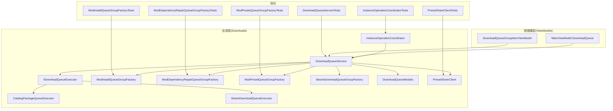
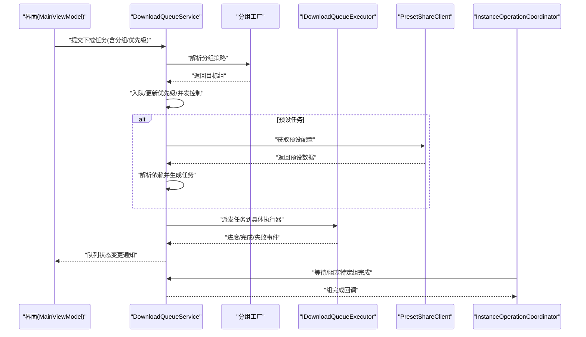
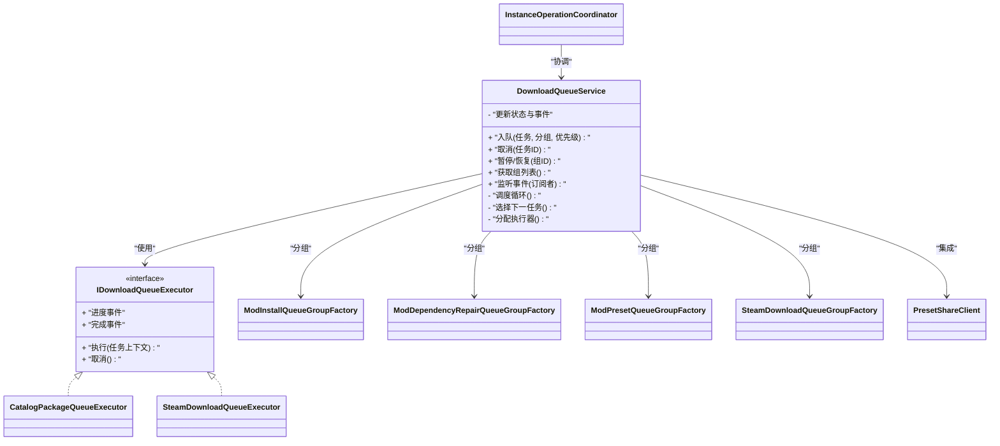
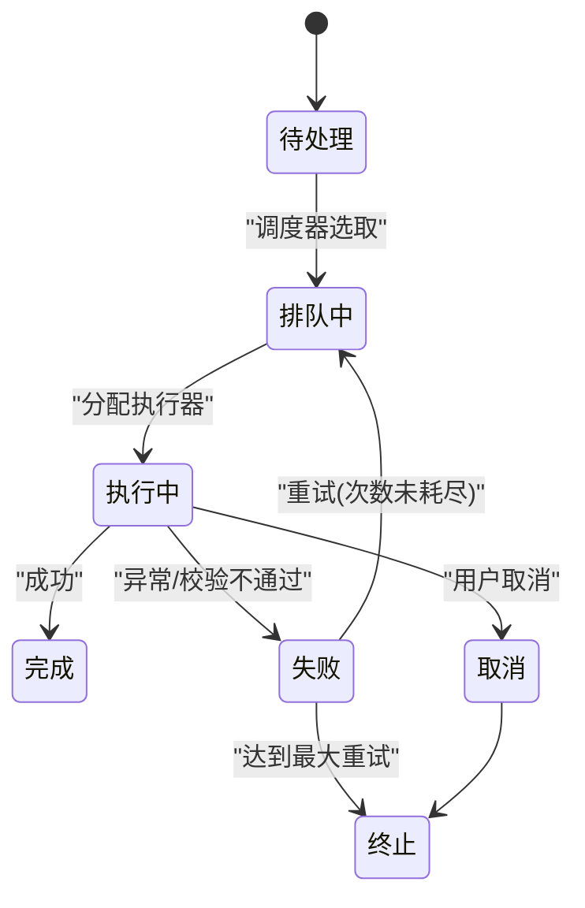
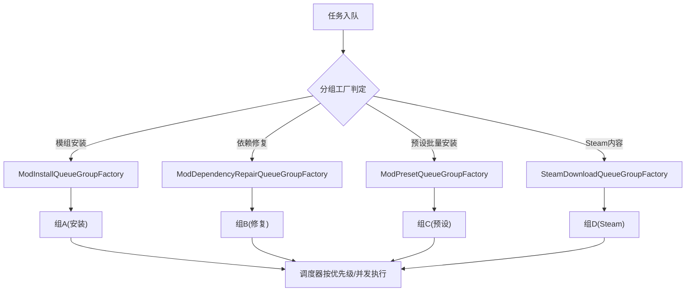
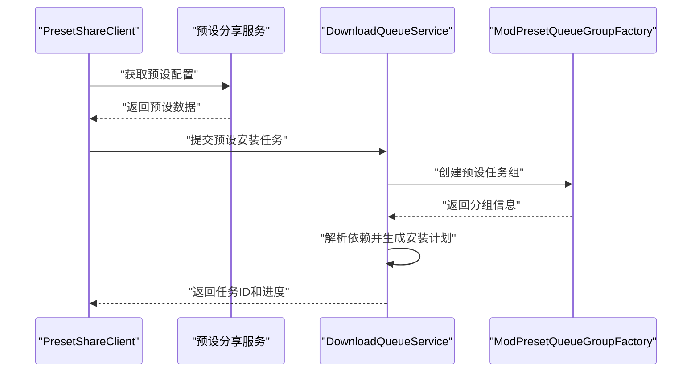
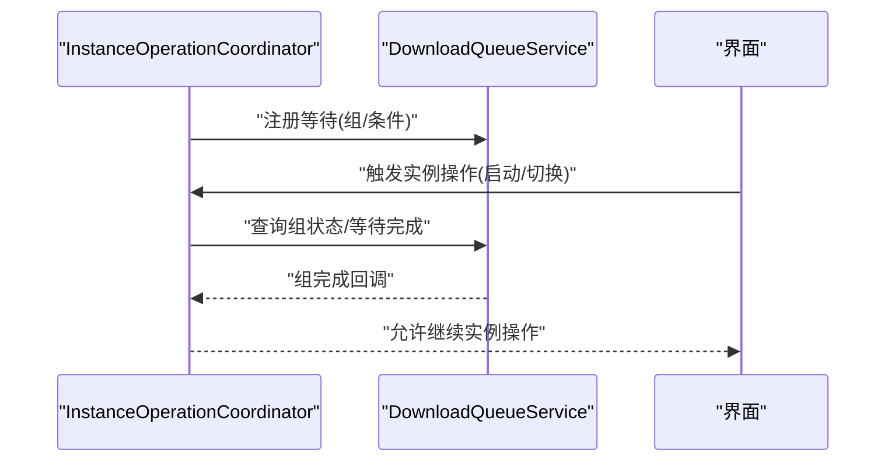
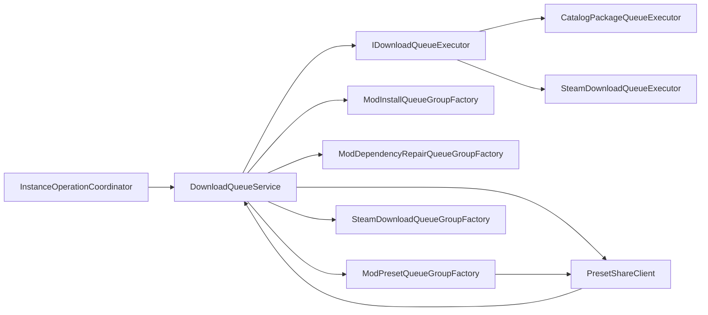

# 下载队列服务

<cite>
**本文引用的文件**   
- [DownloadQueueService.cs](file://src/Crystalfly.App/Downloads/DownloadQueueService.cs)
- [IDownloadQueueExecutor.cs](file://src/Crystalfly.App/Downloads/IDownloadQueueExecutor.cs)
- [CatalogPackageQueueExecutor.cs](file://src/Crystalfly.App/Downloads/CatalogPackageQueueExecutor.cs)
- [SteamDownloadQueueExecutor.cs](file://src/Crystalfly.App/Downloads/SteamDownloadQueueExecutor.cs)
- [DownloadQueueModels.cs](file://src/Crystalfly.App/Downloads/DownloadQueueModels.cs)
- [ModInstallQueueGroupFactory.cs](file://src/Crystalfly.App/Downloads/ModInstallQueueGroupFactory.cs)
- [ModDependencyRepairQueueGroupFactory.cs](file://src/Crystalfly.App/Downloads/ModDependencyRepairQueueGroupFactory.cs)
- [ModPresetQueueGroupFactory.cs](file://src/Crystalfly.App/Downloads/ModPresetQueueGroupFactory.cs)
- [SteamDownloadQueueGroupFactory.cs](file://src/Crystalfly.App/Downloads/SteamDownloadQueueGroupFactory.cs)
- [PresetShareClient.cs](file://src/Crystalfly.App/Downloads/PresetShareClient.cs)
- [InstanceOperationCoordinator.cs](file://src/Crystalfly.App/Downloads/InstanceOperationCoordinator.cs)
- [MainViewModel.DownloadQueue.cs](file://src/Crystalfly.App/ViewModels/MainViewModel.DownloadQueue.cs)
- [DownloadQueueGroupItemViewModel.cs](file://src/Crystalfly.App/ViewModels/DownloadQueueGroupItemViewModel.cs)
- [DownloadQueueServiceTests.cs](file://tests/Crystalfly.App.Tests/Downloads/DownloadQueueServiceTests.cs)
- [ModInstallQueueGroupFactoryTests.cs](file://tests/Crystalfly.App.Tests/Downloads/ModInstallQueueGroupFactoryTests.cs)
- [ModDependencyRepairQueueGroupFactoryTests.cs](file://tests/Crystalfly.App.Tests/Downloads/ModDependencyRepairQueueGroupFactoryTests.cs)
- [ModPresetQueueGroupFactoryTests.cs](file://tests/Crystalfly.App.Tests/Downloads/ModPresetQueueGroupFactoryTests.cs)
- [PresetShareClientTests.cs](file://tests/Crystalfly.App.Tests/Downloads/PresetShareClientTests.cs)
- [InstanceOperationCoordinatorTests.cs](file://tests/Crystalfly.App.Tests/Downloads/InstanceOperationCoordinatorTests.cs)
</cite>

## 更新摘要
**变更内容**   
- DownloadQueueService类得到显著增强，提供更高效的下载队列管理
- Steam下载功能通过SteamDownloadQueueExecutor和SteamDownloadQueueGroupFactory得到改进
- 支持自定义Steam清单和更好的错误恢复机制
- 新增ModPresetQueueGroupFactory支持预设批量安装任务分组
- 集成PresetShareClient实现预设分享客户端功能
- 增强下载系统对预设任务的依赖解析和进度聚合能力

## 目录
1. [简介](#简介)
2. [项目结构](#项目结构)
3. [核心组件](#核心组件)
4. [架构总览](#架构总览)
5. [详细组件分析](#详细组件分析)
6. [依赖关系分析](#依赖关系分析)
7. [性能考虑](#性能考虑)
8. [故障排查指南](#故障排查指南)
9. [结论](#结论)
10. [附录](#附录)

## 简介
本文件面向下载队列服务，系统性阐述 DownloadQueueService 的核心架构与运行机制，包括任务调度、优先级管理、并发控制与资源分配；详述下载任务的创建、状态跟踪与生命周期管理；记录队列分组策略（ModInstallQueueGroupFactory、ModDependencyRepairQueueGroupFactory、ModPresetQueueGroupFactory）的实现原理；解释 InstanceOperationCoordinator 如何协调实例操作与下载任务的同步。文档同时提供扩展新任务类型与处理队列事件的实践指引，并总结错误处理、重试机制与性能优化策略。

**更新** DownloadQueueService类得到显著增强，Steam下载功能通过SteamDownloadQueueExecutor和SteamDownloadQueueGroupFactory得到改进，支持自定义Steam清单和更好的错误恢复机制。新增对预设批量安装、依赖解析和进度聚合功能的详细说明，以及 ModPresetQueueGroupFactory 和 PresetShareClient 的集成方案。

## 项目结构
下载队列相关代码位于应用层模块 Crystalfly.App/Downloads 下，配套 ViewModel 位于 ViewModels，测试用例位于 tests/Crystalfly.App.Tests/Downloads。

图表来源
- [DownloadQueueService.cs](file://src/Crystalfly.App/Downloads/DownloadQueueService.cs)
- [IDownloadQueueExecutor.cs](file://src/Crystalfly.App/Downloads/IDownloadQueueExecutor.cs)
- [CatalogPackageQueueExecutor.cs](file://src/Crystalfly.App/Downloads/CatalogPackageQueueExecutor.cs)
- [SteamDownloadQueueExecutor.cs](file://src/Crystalfly.App/Downloads/SteamDownloadQueueExecutor.cs)
- [ModInstallQueueGroupFactory.cs](file://src/Crystalfly.App/Downloads/ModInstallQueueGroupFactory.cs)
- [ModDependencyRepairQueueGroupFactory.cs](file://src/Crystalfly.App/Downloads/ModDependencyRepairQueueGroupFactory.cs)
- [ModPresetQueueGroupFactory.cs](file://src/Crystalfly.App/Downloads/ModPresetQueueGroupFactory.cs)
- [SteamDownloadQueueGroupFactory.cs](file://src/Crystalfly.App/Downloads/SteamDownloadQueueGroupFactory.cs)
- [PresetShareClient.cs](file://src/Crystalfly.App/Downloads/PresetShareClient.cs)
- [InstanceOperationCoordinator.cs](file://src/Crystalfly.App/Downloads/InstanceOperationCoordinator.cs)
- [DownloadQueueModels.cs](file://src/Crystalfly.App/Downloads/DownloadQueueModels.cs)
- [MainViewModel.DownloadQueue.cs](file://src/Crystalfly.App/ViewModels/MainViewModel.DownloadQueue.cs)
- [DownloadQueueGroupItemViewModel.cs](file://src/Crystalfly.App/ViewModels/DownloadQueueGroupItemViewModel.cs)
- [DownloadQueueServiceTests.cs](file://tests/Crystalfly.App.Tests/Downloads/DownloadQueueServiceTests.cs)
- [ModInstallQueueGroupFactoryTests.cs](file://tests/Crystalfly.App.Tests/Downloads/ModInstallQueueGroupFactoryTests.cs)
- [ModDependencyRepairQueueGroupFactoryTests.cs](file://tests/Crystalfly.App.Tests/Downloads/ModDependencyRepairQueueGroupFactoryTests.cs)
- [ModPresetQueueGroupFactoryTests.cs](file://tests/Crystalfly.App.Tests/Downloads/ModPresetQueueGroupFactoryTests.cs)
- [PresetShareClientTests.cs](file://tests/Crystalfly.App.Tests/Downloads/PresetShareClientTests.cs)
- [InstanceOperationCoordinatorTests.cs](file://tests/Crystalfly.App.Tests/Downloads/InstanceOperationCoordinatorTests.cs)

章节来源
- [DownloadQueueService.cs](file://src/Crystalfly.App/Downloads/DownloadQueueService.cs)
- [IDownloadQueueExecutor.cs](file://src/Crystalfly.App/Downloads/IDownloadQueueExecutor.cs)
- [DownloadQueueModels.cs](file://src/Crystalfly.App/Downloads/DownloadQueueModels.cs)
- [ModInstallQueueGroupFactory.cs](file://src/Crystalfly.App/Downloads/ModInstallQueueGroupFactory.cs)
- [ModDependencyRepairQueueGroupFactory.cs](file://src/Crystalfly.App/Downloads/ModDependencyRepairQueueGroupFactory.cs)
- [ModPresetQueueGroupFactory.cs](file://src/Crystalfly.App/Downloads/ModPresetQueueGroupFactory.cs)
- [SteamDownloadQueueGroupFactory.cs](file://src/Crystalfly.App/Downloads/SteamDownloadQueueGroupFactory.cs)
- [PresetShareClient.cs](file://src/Crystalfly.App/Downloads/PresetShareClient.cs)
- [InstanceOperationCoordinator.cs](file://src/Crystalfly.App/Downloads/InstanceOperationCoordinator.cs)
- [MainViewModel.DownloadQueue.cs](file://src/Crystalfly.App/ViewModels/MainViewModel.DownloadQueue.cs)
- [DownloadQueueGroupItemViewModel.cs](file://src/Crystalfly.App/ViewModels/DownloadQueueGroupItemViewModel.cs)

## 核心组件
- DownloadQueueService：下载队列服务的核心编排器，负责任务入队、出队、调度、优先级与并发控制、分组执行、事件广播与生命周期管理。经过显著增强，提供更高效的下载队列管理能力。
- IDownloadQueueExecutor：下载执行器抽象接口，定义具体下载源（如 Steam、目录包等）的执行契约。
- CatalogPackageQueueExecutor / SteamDownloadQueueExecutor：具体下载执行器实现，分别对接不同数据源与传输协议。SteamDownloadQueueExecutor得到改进，支持自定义Steam清单和更好的错误恢复机制。
- ModInstallQueueGroupFactory / ModDependencyRepairQueueGroupFactory / ModPresetQueueGroupFactory / SteamDownloadQueueGroupFactory：队列分组工厂，按业务域或技术栈将任务组织为可独立调度的组。
- PresetShareClient：预设分享客户端，负责与预设分享服务通信，获取和上传预设配置。
- InstanceOperationCoordinator：实例操作协调器，确保实例级操作（如启动、切换、清理）与下载任务之间的顺序与一致性。
- DownloadQueueModels：队列模型与状态枚举，用于描述任务元数据、进度、结果与分组信息。
- MainViewModel.DownloadQueue / DownloadQueueGroupItemViewModel：UI 侧对队列的订阅与展示。

**更新** DownloadQueueService类得到显著增强，SteamDownloadQueueExecutor和SteamDownloadQueueGroupFactory得到改进，新增 ModPresetQueueGroupFactory 和 PresetShareClient 组件，支持预设批量安装和分享功能。

章节来源
- [DownloadQueueService.cs](file://src/Crystalfly.App/Downloads/DownloadQueueService.cs)
- [IDownloadQueueExecutor.cs](file://src/Crystalfly.App/Downloads/IDownloadQueueExecutor.cs)
- [CatalogPackageQueueExecutor.cs](file://src/Crystalfly.App/Downloads/CatalogPackageQueueExecutor.cs)
- [SteamDownloadQueueExecutor.cs](file://src/Crystalfly.App/Downloads/SteamDownloadQueueExecutor.cs)
- [ModInstallQueueGroupFactory.cs](file://src/Crystalfly.App/Downloads/ModInstallQueueGroupFactory.cs)
- [ModDependencyRepairQueueGroupFactory.cs](file://src/Crystalfly.App/Downloads/ModDependencyRepairQueueGroupFactory.cs)
- [ModPresetQueueGroupFactory.cs](file://src/Crystalfly.App/Downloads/ModPresetQueueGroupFactory.cs)
- [SteamDownloadQueueGroupFactory.cs](file://src/Crystalfly.App/Downloads/SteamDownloadQueueGroupFactory.cs)
- [PresetShareClient.cs](file://src/Crystalfly.App/Downloads/PresetShareClient.cs)
- [DownloadQueueModels.cs](file://src/Crystalfly.App/Downloads/DownloadQueueModels.cs)
- [MainViewModel.DownloadQueue.cs](file://src/Crystalfly.App/ViewModels/MainViewModel.DownloadQueue.cs)
- [DownloadQueueGroupItemViewModel.cs](file://src/Crystalfly.App/ViewModels/DownloadQueueGroupItemViewModel.cs)

## 架构总览
DownloadQueueService 采用"中心调度 + 多执行器 + 分组并行"的架构模式。任务通过统一入口入队，由调度器依据优先级与分组策略选择执行器，并在受控并发度内推进任务。InstanceOperationCoordinator 作为外部协调者，在关键实例操作前后挂接下载任务，保证一致性与幂等性。

**更新** DownloadQueueService类得到显著增强，Steam下载功能通过SteamDownloadQueueExecutor和SteamDownloadQueueGroupFactory得到改进，支持自定义Steam清单和更好的错误恢复机制。新增预设分享客户端集成，支持从远程服务获取预设配置并批量安装模组。

图表来源
- [DownloadQueueService.cs](file://src/Crystalfly.App/Downloads/DownloadQueueService.cs)
- [ModInstallQueueGroupFactory.cs](file://src/Crystalfly.App/Downloads/ModInstallQueueGroupFactory.cs)
- [ModDependencyRepairQueueGroupFactory.cs](file://src/Crystalfly.App/Downloads/ModDependencyRepairQueueGroupFactory.cs)
- [ModPresetQueueGroupFactory.cs](file://src/Crystalfly.App/Downloads/ModPresetQueueGroupFactory.cs)
- [SteamDownloadQueueGroupFactory.cs](file://src/Crystalfly.App/Downloads/SteamDownloadQueueGroupFactory.cs)
- [PresetShareClient.cs](file://src/Crystalfly.App/Downloads/PresetShareClient.cs)
- [IDownloadQueueExecutor.cs](file://src/Crystalfly.App/Downloads/IDownloadQueueExecutor.cs)
- [InstanceOperationCoordinator.cs](file://src/Crystalfly.App/Downloads/InstanceOperationCoordinator.cs)
- [MainViewModel.DownloadQueue.cs](file://src/Crystalfly.App/ViewModels/MainViewModel.DownloadQueue.cs)

## 详细组件分析

### DownloadQueueService 核心架构
- 任务调度与生命周期
  - 入队：接收任务请求，生成唯一标识，写入内部队列结构，初始状态为待处理。
  - 调度：根据分组与优先级选择下一个可执行任务，检查执行器可用性与资源配额。
  - 执行：调用对应 IDownloadQueueExecutor 执行，监听进度与完成事件。
  - 收尾：更新任务状态（成功/失败），触发组完成回调，释放资源。
- 优先级管理
  - 支持基于业务语义的优先级（例如修复类优先于安装类）。
  - 同优先级内可按时间戳或稳定性权重排序。
- 并发控制与资源分配
  - 全局最大并发数限制，避免 I/O 拥塞。
  - 分组维度并发隔离，防止某类任务独占资源。
  - 执行器级别限流（如网络带宽、磁盘写入速率）。
- 事件与状态跟踪
  - 任务级事件：开始、进度、完成、失败。
  - 组级事件：组开始、组完成、组失败。
  - 对外暴露可观察集合或事件总线供 UI 订阅。

**更新** DownloadQueueService类得到显著增强，提供更高效的下载队列管理能力，包括改进的任务调度算法和资源分配策略。

图表来源
- [DownloadQueueService.cs](file://src/Crystalfly.App/Downloads/DownloadQueueService.cs)
- [IDownloadQueueExecutor.cs](file://src/Crystalfly.App/Downloads/IDownloadQueueExecutor.cs)
- [CatalogPackageQueueExecutor.cs](file://src/Crystalfly.App/Downloads/CatalogPackageQueueExecutor.cs)
- [SteamDownloadQueueExecutor.cs](file://src/Crystalfly.App/Downloads/SteamDownloadQueueExecutor.cs)
- [ModInstallQueueGroupFactory.cs](file://src/Crystalfly.App/Downloads/ModInstallQueueGroupFactory.cs)
- [ModDependencyRepairQueueGroupFactory.cs](file://src/Crystalfly.App/Downloads/ModDependencyRepairQueueGroupFactory.cs)
- [ModPresetQueueGroupFactory.cs](file://src/Crystalfly.App/Downloads/ModPresetQueueGroupFactory.cs)
- [SteamDownloadQueueGroupFactory.cs](file://src/Crystalfly.App/Downloads/SteamDownloadQueueGroupFactory.cs)
- [PresetShareClient.cs](file://src/Crystalfly.App/Downloads/PresetShareClient.cs)
- [InstanceOperationCoordinator.cs](file://src/Crystalfly.App/Downloads/InstanceOperationCoordinator.cs)

章节来源
- [DownloadQueueService.cs](file://src/Crystalfly.App/Downloads/DownloadQueueService.cs)
- [IDownloadQueueExecutor.cs](file://src/Crystalfly.App/Downloads/IDownloadQueueExecutor.cs)

### 任务模型与状态机
- 任务模型
  - 包含任务类型、所属分组、优先级、目标执行器、参数、创建时间与更新时间等。
- 状态流转
  - 待处理 → 排队中 → 执行中 → 完成/失败
  - 支持取消与重试分支，失败后可进入重试队列。

**更新** 新增预设任务相关的状态和属性，支持批量安装场景下的进度聚合和依赖追踪。

图表来源
- [DownloadQueueModels.cs](file://src/Crystalfly.App/Downloads/DownloadQueueModels.cs)

章节来源
- [DownloadQueueModels.cs](file://src/Crystalfly.App/Downloads/DownloadQueueModels.cs)

### 队列分组策略
- ModInstallQueueGroupFactory
  - 将模组安装类任务归入同一组，保证安装顺序与依赖完整性。
  - 通常具有较高优先级，避免被其他任务抢占。
- ModDependencyRepairQueueGroupFactory
  - 将依赖修复类任务单独分组，可在安装前或冲突时触发。
  - 具备强一致性要求，必要时串行执行。
- ModPresetQueueGroupFactory
  - **新增** 将预设批量安装任务归入专用组，支持复杂的依赖解析和进度聚合。
  - 自动解析预设中的模组依赖关系，生成有序的安装计划。
  - 提供统一的进度反馈，便于用户了解整体安装进度。
- SteamDownloadQueueGroupFactory
  - 将 Steam 内容分发任务分组，便于与网络限流策略结合。**更新** 支持自定义Steam清单和更好的错误恢复机制。

**更新** 新增 ModPresetQueueGroupFactory，专门处理预设批量安装场景，支持依赖解析和进度聚合功能。SteamDownloadQueueGroupFactory得到改进，支持自定义Steam清单和更好的错误恢复机制。

图表来源
- [ModInstallQueueGroupFactory.cs](file://src/Crystalfly.App/Downloads/ModInstallQueueGroupFactory.cs)
- [ModDependencyRepairQueueGroupFactory.cs](file://src/Crystalfly.App/Downloads/ModDependencyRepairQueueGroupFactory.cs)
- [ModPresetQueueGroupFactory.cs](file://src/Crystalfly.App/Downloads/ModPresetQueueGroupFactory.cs)
- [SteamDownloadQueueGroupFactory.cs](file://src/Crystalfly.App/Downloads/SteamDownloadQueueGroupFactory.cs)

章节来源
- [ModInstallQueueGroupFactory.cs](file://src/Crystalfly.App/Downloads/ModInstallQueueGroupFactory.cs)
- [ModDependencyRepairQueueGroupFactory.cs](file://src/Crystalfly.App/Downloads/ModDependencyRepairQueueGroupFactory.cs)
- [ModPresetQueueGroupFactory.cs](file://src/Crystalfly.App/Downloads/ModPresetQueueGroupFactory.cs)
- [SteamDownloadQueueGroupFactory.cs](file://src/Crystalfly.App/Downloads/SteamDownloadQueueGroupFactory.cs)

### 预设分享客户端集成
PresetShareClient 是与预设分享服务通信的客户端组件，主要功能包括：
- 从远程服务器获取预设配置
- 上传本地预设到分享服务
- 处理预设版本管理和冲突解决
- 提供预设验证和完整性检查

**新增** 该组件与下载队列服务深度集成，支持从分享服务直接获取预设并批量安装模组。

图表来源
- [PresetShareClient.cs](file://src/Crystalfly.App/Downloads/PresetShareClient.cs)
- [DownloadQueueService.cs](file://src/Crystalfly.App/Downloads/DownloadQueueService.cs)
- [ModPresetQueueGroupFactory.cs](file://src/Crystalfly.App/Downloads/ModPresetQueueGroupFactory.cs)

章节来源
- [PresetShareClient.cs](file://src/Crystalfly.App/Downloads/PresetShareClient.cs)

### 实例操作协调器
InstanceOperationCoordinator 负责在实例生命周期关键节点与下载队列进行同步，确保：
- 在实例启动前，等待必要下载任务完成。
- 在实例切换或销毁时，安全中止或挂起相关下载任务。
- 对跨实例共享资源（如缓存目录）进行互斥访问。

**更新** 增强了对预设安装任务的协调支持，确保预设批量安装过程中的实例状态一致性。

图表来源
- [InstanceOperationCoordinator.cs](file://src/Crystalfly.App/Downloads/InstanceOperationCoordinator.cs)
- [DownloadQueueService.cs](file://src/Crystalfly.App/Downloads/DownloadQueueService.cs)

章节来源
- [InstanceOperationCoordinator.cs](file://src/Crystalfly.App/Downloads/InstanceOperationCoordinator.cs)

### 执行器实现要点
- CatalogPackageQueueExecutor
  - 针对目录包形式的下载源，侧重本地文件系统操作与校验。
- SteamDownloadQueueExecutor
  - 对接 Steam 内容分发通道，关注网络吞吐、断点续传与认证会话。**更新** 得到显著改进，支持自定义Steam清单和更好的错误恢复机制。

**更新** 两个执行器都增强了对预设任务的支持，提供更好的进度报告和错误处理。SteamDownloadQueueExecutor特别改进了Steam清单支持和错误恢复机制。

章节来源
- [CatalogPackageQueueExecutor.cs](file://src/Crystalfly.App/Downloads/CatalogPackageQueueExecutor.cs)
- [SteamDownloadQueueExecutor.cs](file://src/Crystalfly.App/Downloads/SteamDownloadQueueExecutor.cs)

### 扩展指南：新增下载任务类型与处理队列事件
- 新增任务类型步骤
  - 定义任务模型字段（若需要）：在模型文件中补充必要的属性与校验规则。
  - 实现执行器：新建类实现 IDownloadQueueExecutor，封装具体下载逻辑与事件上报。
  - 注册分组策略：如需独立分组，新增分组工厂并在服务初始化时注册。
  - 接入调度：在任务创建处指定分组与优先级，交由 DownloadQueueService 调度。
- 处理队列事件
  - 订阅任务级事件：用于进度条、日志与提示。
  - 订阅组级事件：用于批量操作反馈与 UI 刷新。
  - 在 InstanceOperationCoordinator 中注册等待条件，确保实例操作与下载同步。

**更新** 新增了预设任务类型的完整示例，包括 ModPresetQueueGroupFactory 的实现模式和 PresetShareClient 的集成方式。

章节来源
- [DownloadQueueModels.cs](file://src/Crystalfly.App/Downloads/DownloadQueueModels.cs)
- [IDownloadQueueExecutor.cs](file://src/Crystalfly.App/Downloads/IDownloadQueueExecutor.cs)
- [DownloadQueueService.cs](file://src/Crystalfly.App/Downloads/DownloadQueueService.cs)
- [ModPresetQueueGroupFactory.cs](file://src/Crystalfly.App/Downloads/ModPresetQueueGroupFactory.cs)
- [PresetShareClient.cs](file://src/Crystalfly.App/Downloads/PresetShareClient.cs)
- [MainViewModel.DownloadQueue.cs](file://src/Crystalfly.App/ViewModels/MainViewModel.DownloadQueue.cs)
- [DownloadQueueGroupItemViewModel.cs](file://src/Crystalfly.App/ViewModels/DownloadQueueGroupItemViewModel.cs)

## 依赖关系分析
- 组件耦合
  - DownloadQueueService 与分组工厂低耦合，通过策略模式动态选择分组。
  - 执行器通过接口解耦，便于替换与扩展。
  - PresetShareClient 与 DownloadQueueService 松耦合，通过事件机制通信。
- 外部依赖
  - 文件系统、网络客户端、Steam SDK 等通过执行器注入。
  - 预设分享服务通过 HTTP 客户端访问。
- 潜在环依赖
  - 当前设计以单向依赖为主，未见明显循环引用风险。

**更新** 新增 PresetShareClient 的依赖关系，以及与 ModPresetQueueGroupFactory 的协作模式。

图表来源
- [DownloadQueueService.cs](file://src/Crystalfly.App/Downloads/DownloadQueueService.cs)
- [IDownloadQueueExecutor.cs](file://src/Crystalfly.App/Downloads/IDownloadQueueExecutor.cs)
- [ModInstallQueueGroupFactory.cs](file://src/Crystalfly.App/Downloads/ModInstallQueueGroupFactory.cs)
- [ModDependencyRepairQueueGroupFactory.cs](file://src/Crystalfly.App/Downloads/ModDependencyRepairQueueGroupFactory.cs)
- [ModPresetQueueGroupFactory.cs](file://src/Crystalfly.App/Downloads/ModPresetQueueGroupFactory.cs)
- [SteamDownloadQueueGroupFactory.cs](file://src/Crystalfly.App/Downloads/SteamDownloadQueueGroupFactory.cs)
- [PresetShareClient.cs](file://src/Crystalfly.App/Downloads/PresetShareClient.cs)
- [CatalogPackageQueueExecutor.cs](file://src/Crystalfly.App/Downloads/CatalogPackageQueueExecutor.cs)
- [SteamDownloadQueueExecutor.cs](file://src/Crystalfly.App/Downloads/SteamDownloadQueueExecutor.cs)
- [InstanceOperationCoordinator.cs](file://src/Crystalfly.App/Downloads/InstanceOperationCoordinator.cs)

章节来源
- [DownloadQueueService.cs](file://src/Crystalfly.App/Downloads/DownloadQueueService.cs)
- [IDownloadQueueExecutor.cs](file://src/Crystalfly.App/Downloads/IDownloadQueueExecutor.cs)

## 性能考虑
- 并发与限流
  - 设置全局并发上限，避免磁盘与网络争用。
  - 分组维度并发隔离，防止热点任务导致饥饿。
- 优先级与公平性
  - 高优先级任务优先调度，但需引入老化机制避免长期饥饿。
- 资源复用
  - 连接池、缓冲池与临时目录复用，减少开销。
- 进度聚合与 UI 刷新
  - 合并细粒度事件，降低 UI 压力。
  - **新增** 预设批量安装场景下的进度聚合算法，提供更准确的总体进度反馈。
- 重试与退避
  - 指数退避与抖动，避免雪崩效应。
- 监控与指标
  - 统计吞吐量、延迟、失败率，指导容量规划。

**更新** DownloadQueueService类得到显著增强，提供了更高效的下载队列管理。增强了预设批量安装场景的性能优化，包括进度聚合算法和资源复用策略。Steam下载功能通过SteamDownloadQueueExecutor和SteamDownloadQueueGroupFactory得到改进，支持自定义Steam清单和更好的错误恢复机制。

## 故障排查指南
- 常见问题定位
  - 任务长时间排队：检查分组优先级与并发配置，确认是否存在阻塞任务。
  - 执行器失败：查看执行器日志与错误码，区分网络、权限与校验问题。
  - 组未完成导致实例卡住：确认 InstanceOperationCoordinator 等待条件是否正确注册。
  - **新增** 预设安装失败：检查预设分享服务连接状态和预设数据完整性。
  - **新增** Steam下载失败：检查Steam清单配置和网络连接状态。
- 重试与回滚
  - 失败任务自动重试，超过阈值后标记终止；必要时触发回滚或补偿流程。
- 调试技巧
  - 启用详细日志，输出任务生命周期关键节点。
  - 使用单元测试覆盖边界场景，验证调度与事件传播。

**更新** 新增了预设分享客户端和Steam下载相关的故障排查指南，包括网络连接、数据格式、服务可用性问题和Steam清单配置问题的诊断方法。

章节来源
- [DownloadQueueServiceTests.cs](file://tests/Crystalfly.App.Tests/Downloads/DownloadQueueServiceTests.cs)
- [ModInstallQueueGroupFactoryTests.cs](file://tests/Crystalfly.App.Tests/Downloads/ModInstallQueueGroupFactoryTests.cs)
- [ModDependencyRepairQueueGroupFactoryTests.cs](file://tests/Crystalfly.App.Tests/Downloads/ModDependencyRepairQueueGroupFactoryTests.cs)
- [ModPresetQueueGroupFactoryTests.cs](file://tests/Crystalfly.App.Tests/Downloads/ModPresetQueueGroupFactoryTests.cs)
- [PresetShareClientTests.cs](file://tests/Crystalfly.App.Tests/Downloads/PresetShareClientTests.cs)
- [InstanceOperationCoordinatorTests.cs](file://tests/Crystalfly.App.Tests/Downloads/InstanceOperationCoordinatorTests.cs)

## 结论
DownloadQueueService 通过统一的调度内核、灵活的分组策略与可扩展的执行器接口，实现了稳定高效的下载任务管理。配合 InstanceOperationCoordinator，系统能够在复杂实例操作场景中保持数据一致性与用户体验流畅。通过合理的优先级、并发控制与重试退避策略，系统在可靠性与性能之间取得良好平衡。

**更新** DownloadQueueService类得到显著增强，Steam下载功能通过SteamDownloadQueueExecutor和SteamDownloadQueueGroupFactory得到改进，支持自定义Steam清单和更好的错误恢复机制。新增的 ModPresetQueueGroupFactory 和 PresetShareClient 进一步增强了系统的功能性和可靠性，特别是对于预设批量安装场景提供了完整的解决方案。

## 附录
- 术语
  - 任务：一次具体的下载工作单元。
  - 分组：按业务或技术维度划分的任务集合。
  - 执行器：实现具体下载逻辑的组件。
  - 协调器：在实例操作与下载任务间进行同步的组件。
  - **新增** 预设：预配置的模组组合，支持批量安装和分享。
  - **新增** 预设分享：通过网络服务共享和获取预设配置的功能。
  - **新增** Steam清单：Steam平台上的内容清单文件，定义了下载内容和依赖关系。
- 参考路径
  - 模型定义：[DownloadQueueModels.cs](file://src/Crystalfly.App/Downloads/DownloadQueueModels.cs)
  - 服务核心：[DownloadQueueService.cs](file://src/Crystalfly.App/Downloads/DownloadQueueService.cs)
  - 执行器接口：[IDownloadQueueExecutor.cs](file://src/Crystalfly.App/Downloads/IDownloadQueueExecutor.cs)
  - 分组工厂：[ModInstallQueueGroupFactory.cs](file://src/Crystalfly.App/Downloads/ModInstallQueueGroupFactory.cs)、[ModDependencyRepairQueueGroupFactory.cs](file://src/Crystalfly.App/Downloads/ModDependencyRepairQueueGroupFactory.cs)、[ModPresetQueueGroupFactory.cs](file://src/Crystalfly.App/Downloads/ModPresetQueueGroupFactory.cs)、[SteamDownloadQueueGroupFactory.cs](file://src/Crystalfly.App/Downloads/SteamDownloadQueueGroupFactory.cs)
  - 预设客户端：[PresetShareClient.cs](file://src/Crystalfly.App/Downloads/PresetShareClient.cs)
  - 协调器：[InstanceOperationCoordinator.cs](file://src/Crystalfly.App/Downloads/InstanceOperationCoordinator.cs)
  - UI 集成：[MainViewModel.DownloadQueue.cs](file://src/Crystalfly.App/ViewModels/MainViewModel.DownloadQueue.cs)、[DownloadQueueGroupItemViewModel.cs](file://src/Crystalfly.App/ViewModels/DownloadQueueGroupItemViewModel.cs)