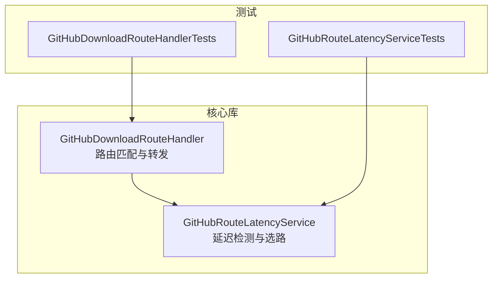
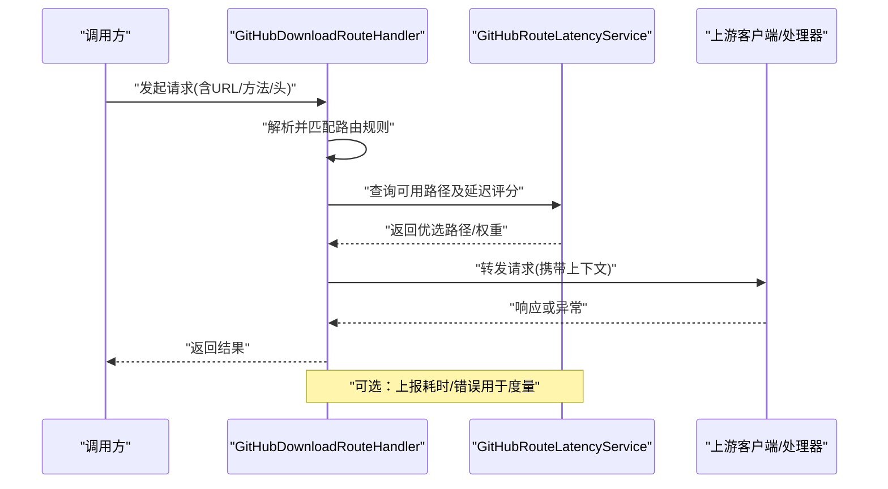
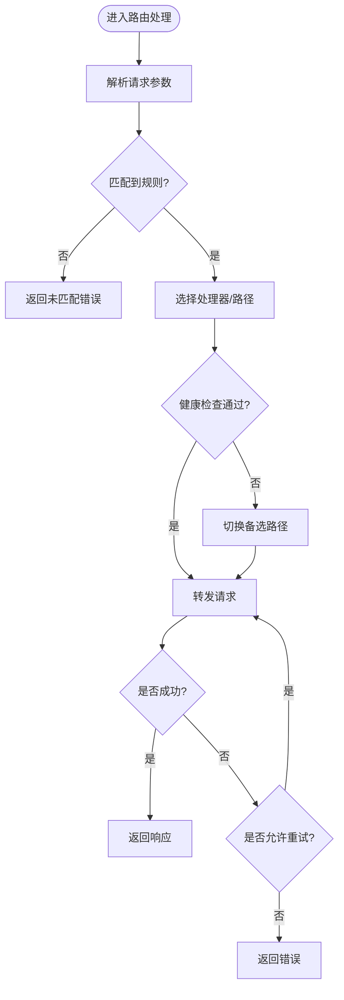
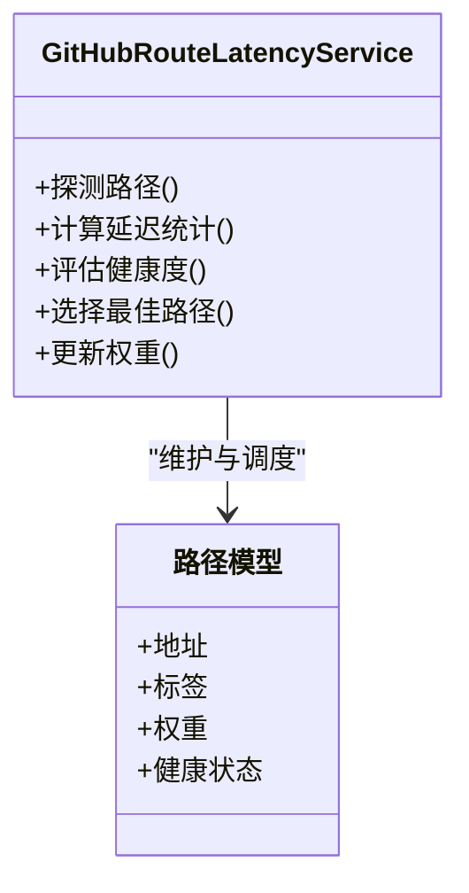
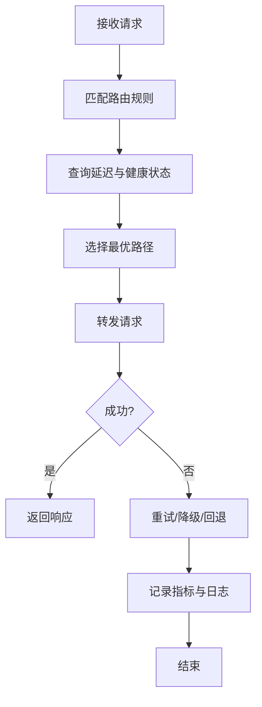

# 网络路由处理

<cite>
**本文引用的文件**
- [GitHubDownloadRouteHandler.cs](file://src/Crystalfly.Core/Networking/GitHubDownloadRouteHandler.cs)
- [GitHubRouteLatencyService.cs](file://src/Crystalfly.Core/Networking/GitHubRouteLatencyService.cs)
- [GitHubDownloadRouteHandlerTests.cs](file://tests/Crystalfly.Core.Tests/Networking/GitHubDownloadRouteHandlerTests.cs)
- [GitHubRouteLatencyServiceTests.cs](file://tests/Crystalfly.Core.Tests/Networking/GitHubRouteLatencyServiceTests.cs)
</cite>

## 目录
1. [简介](#简介)
2. [项目结构](#项目结构)
3. [核心组件](#核心组件)
4. [架构总览](#架构总览)
5. [详细组件分析](#详细组件分析)
6. [依赖分析](#依赖分析)
7. [性能考虑](#性能考虑)
8. [故障排查指南](#故障排查指南)
9. [结论](#结论)
10. [附录](#附录)

## 简介
本文件聚焦于网络路由处理子系统，围绕以下目标展开：
- 深入解释 GitHubDownloadRouteHandler 的路由匹配与请求转发机制。
- 详细说明 GitHubRouteLatencyService 的延迟检测算法与路由选择策略。
- 记录网络路径的健康检查、故障转移与负载均衡实现思路。
- 解释路由配置的动态更新与缓存机制。
- 提供添加新网络路由处理器的实践指引（以代码片段路径形式）。
- 覆盖代理支持、SSL 证书验证与请求重试策略。
- 记录网络监控指标收集与性能分析工具的使用建议。

## 项目结构
网络路由相关代码位于 Crystalfly.Core 的 Networking 命名空间下，包含两个核心类及其单元测试：
- GitHubDownloadRouteHandler：负责将特定来源的请求路由到合适的下载通道或上游服务。
- GitHubRouteLatencyService：负责测量各网络路径的延迟，并据此进行路由决策。

图表来源
- [GitHubDownloadRouteHandler.cs](file://src/Crystalfly.Core/Networking/GitHubDownloadRouteHandler.cs)
- [GitHubRouteLatencyService.cs](file://src/Crystalfly.Core/Networking/GitHubRouteLatencyService.cs)
- [GitHubDownloadRouteHandlerTests.cs](file://tests/Crystalfly.Core.Tests/Networking/GitHubDownloadRouteHandlerTests.cs)
- [GitHubRouteLatencyServiceTests.cs](file://tests/Crystalfly.Core.Tests/Networking/GitHubRouteLatencyServiceTests.cs)

章节来源
- [GitHubDownloadRouteHandler.cs](file://src/Crystalfly.Core/Networking/GitHubDownloadRouteHandler.cs)
- [GitHubRouteLatencyService.cs](file://src/Crystalfly.Core/Networking/GitHubRouteLatencyService.cs)

## 核心组件
- GitHubDownloadRouteHandler
  - 职责：根据请求特征（如域名、路径、协议等）进行匹配，并将请求转发至具体处理器或下游客户端。
  - 关键点：匹配规则可配置；转发过程可结合健康状态与延迟信息做决策；支持扩展新的处理器。
- GitHubRouteLatencyService
  - 职责：周期性或按需探测各网络路径的延迟，维护延迟统计与权重，为路由选择提供依据。
  - 关键点：延迟采样窗口、平滑算法、阈值判定、失败回退策略。

章节来源
- [GitHubDownloadRouteHandler.cs](file://src/Crystalfly.Core/Networking/GitHubDownloadRouteHandler.cs)
- [GitHubRouteLatencyService.cs](file://src/Crystalfly.Core/Networking/GitHubRouteLatencyService.cs)

## 架构总览
下图展示了请求从进入路由层到最终转发的整体流程，以及延迟服务对选路的反馈闭环。

图表来源
- [GitHubDownloadRouteHandler.cs](file://src/Crystalfly.Core/Networking/GitHubDownloadRouteHandler.cs)
- [GitHubRouteLatencyService.cs](file://src/Crystalfly.Core/Networking/GitHubRouteLatencyService.cs)

## 详细组件分析

### GitHubDownloadRouteHandler 分析
- 路由匹配
  - 输入：请求对象（包含 URL、HTTP 方法、头部等）。
  - 匹配维度：域名前缀、路径前缀、协议、自定义谓词等。
  - 优先级：按注册顺序或显式优先级排序，首个命中即采用。
- 请求转发
  - 选择处理器：基于匹配结果定位具体处理器实例。
  - 上下文传递：透传超时、重试、代理、TLS 设置等上下文。
  - 结果封装：统一包装成功响应或标准化异常。
- 扩展点
  - 新增处理器：实现统一的处理器接口，并在路由表中注册。
  - 新增匹配器：实现匹配逻辑，支持组合多个条件。
- 健壮性
  - 短路：在已知不可用路径上快速失败。
  - 降级：当首选路径失败时，按策略切换到备选路径。

图表来源
- [GitHubDownloadRouteHandler.cs](file://src/Crystalfly.Core/Networking/GitHubDownloadRouteHandler.cs)

章节来源
- [GitHubDownloadRouteHandler.cs](file://src/Crystalfly.Core/Networking/GitHubDownloadRouteHandler.cs)
- [GitHubDownloadRouteHandlerTests.cs](file://tests/Crystalfly.Core.Tests/Networking/GitHubDownloadRouteHandlerTests.cs)

### GitHubRouteLatencyService 分析
- 延迟检测算法
  - 探针：对每条路径执行轻量级探测（如 HEAD 或小体积 GET），记录往返时间。
  - 滑动窗口：维护最近 N 次探测结果的均值、方差、P95/P99 等分位数。
  - 平滑：使用指数移动平均或加权平均抑制抖动。
  - 阈值：超过阈值标记为“慢”，连续失败标记为“不健康”。
- 路由选择策略
  - 权重计算：基于延迟、成功率、容量等指标计算权重。
  - 择优：优先选择低延迟且高可用的路径；必要时引入随机化避免热点。
  - 回退：当最优路径不可用时，按权重降序尝试其他路径。
- 健康检查与故障转移
  - 健康状态：综合延迟、错误率、熔断计数决定健康度。
  - 故障转移：自动剔除不健康路径，恢复后重新纳入选路池。
- 负载均衡
  - 轮询/加权轮询：在多路径间均匀分布流量。
  - 自适应：根据实时延迟动态调整权重。

图表来源
- [GitHubRouteLatencyService.cs](file://src/Crystalfly.Core/Networking/GitHubRouteLatencyService.cs)

章节来源
- [GitHubRouteLatencyService.cs](file://src/Crystalfly.Core/Networking/GitHubRouteLatencyService.cs)
- [GitHubRouteLatencyServiceTests.cs](file://tests/Crystalfly.Core.Tests/Networking/GitHubRouteLatencyServiceTests.cs)

### 概念性概览
以下为通用网络路由工作流的概念图，便于理解整体思想，不直接映射到具体源码。

[此图为概念示意，无需图表来源]

## 依赖分析
- 内部依赖
  - GitHubDownloadRouteHandler 依赖 GitHubRouteLatencyService 获取路径质量信息。
  - 两者均可能依赖配置模块、日志与度量基础设施（在本仓库中未见显式定义，实际实现以源码为准）。
- 外部依赖
  - HTTP 客户端、TLS/SSL 栈、系统网络栈。
  - 可能的第三方库用于序列化、并发控制与指标采集。

图表来源
- [GitHubDownloadRouteHandler.cs](file://src/Crystalfly.Core/Networking/GitHubDownloadRouteHandler.cs)
- [GitHubRouteLatencyService.cs](file://src/Crystalfly.Core/Networking/GitHubRouteLatencyService.cs)

章节来源
- [GitHubDownloadRouteHandler.cs](file://src/Crystalfly.Core/Networking/GitHubDownloadRouteHandler.cs)
- [GitHubRouteLatencyService.cs](file://src/Crystalfly.Core/Networking/GitHubRouteLatencyService.cs)

## 性能考虑
- 减少不必要的探测：合并探测任务、复用连接、限制并发。
- 合理窗口大小：平衡灵敏度与稳定性，避免频繁震荡。
- 指标采样：对高频指标采用采样或聚合，降低开销。
- 缓存命中：对只读或幂等请求启用短期缓存，降低后端压力。
- 背压与限流：在高负载场景下保护上游服务。

[本节为通用指导，无需章节来源]

## 故障排查指南
- 常见问题
  - 路由未命中：检查规则优先级与匹配条件。
  - 路径持续不健康：查看延迟阈值、错误率与熔断计数。
  - 重试风暴：确认重试上限与退避策略。
- 诊断步骤
  - 开启详细日志，关注匹配与转发链路。
  - 导出延迟统计与健康状态快照，观察趋势。
  - 隔离问题路径，逐步缩小范围。
- 参考用例
  - 单元测试覆盖了典型匹配、失败回退与延迟变化场景，可作为复现与回归基线。

章节来源
- [GitHubDownloadRouteHandlerTests.cs](file://tests/Crystalfly.Core.Tests/Networking/GitHubDownloadRouteHandlerTests.cs)
- [GitHubRouteLatencyServiceTests.cs](file://tests/Crystalfly.Core.Tests/Networking/GitHubRouteLatencyServiceTests.cs)

## 结论
该路由子系统通过“匹配—选路—转发—度量”的闭环，实现了面向 GitHub 下载场景的高可用与高性能访问。GitHubRouteLatencyService 提供的延迟与健康信息使 GitHubDownloadRouteHandler 能够做出更稳健的决策。建议在后续迭代中完善动态配置热更新、细粒度指标暴露与可视化面板，进一步提升可观测性与运维效率。

[本节为总结，无需章节来源]

## 附录

### 如何添加新的网络路由处理器（实践指引）
- 步骤
  - 新建处理器实现：遵循现有处理器接口约定，实现发送请求与处理响应的逻辑。
  - 注册路由规则：在路由表中增加一条或多条匹配规则，指向新处理器。
  - 注入延迟服务：如需基于延迟做决策，读取 GitHubRouteLatencyService 的结果。
  - 编写单测：覆盖正常路径、异常路径与边界条件。
- 参考位置（代码片段路径）
  - 处理器与路由表注册入口：[GitHubDownloadRouteHandler.cs](file://src/Crystalfly.Core/Networking/GitHubDownloadRouteHandler.cs)
  - 延迟服务与选路策略：[GitHubRouteLatencyService.cs](file://src/Crystalfly.Core/Networking/GitHubRouteLatencyService.cs)
  - 处理器测试示例：[GitHubDownloadRouteHandlerTests.cs](file://tests/Crystalfly.Core.Tests/Networking/GitHubDownloadRouteHandlerTests.cs)
  - 延迟服务测试示例：[GitHubRouteLatencyServiceTests.cs](file://tests/Crystalfly.Core.Tests/Networking/GitHubRouteLatencyServiceTests.cs)

[本节为操作指引，无需章节来源]

### 代理支持、SSL 证书验证与请求重试策略
- 代理支持
  - 全局代理：通过系统或应用级代理配置生效。
  - 按路径代理：在路由上下文中指定代理服务器。
- SSL 证书验证
  - 默认启用严格校验；仅在受控环境可临时关闭（不建议）。
  - 支持自定义 CA 证书链与主机名校验策略。
- 请求重试策略
  - 重试条件：仅对幂等或可安全重试的错误进行重试。
  - 退避算法：指数退避+抖动，避免雪崩。
  - 最大次数与超时：结合业务 SLA 设定上限。

[本节为通用说明，无需章节来源]

### 网络监控指标与性能分析工具
- 指标建议
  - 请求量、成功率、P50/P95/P99 延迟、错误分类、重试次数、熔断触发次数。
  - 路径健康度、权重变化、探测频率与耗时。
- 采集与导出
  - 使用内置计数器与直方图，定期导出到监控系统。
  - 关键路径打点，关联请求 ID 以便追踪。
- 分析工具
  - 时序数据库与可视化面板（如 Grafana）。
  - 分布式追踪（如 OpenTelemetry）串联端到端链路。

[本节为通用说明，无需章节来源]