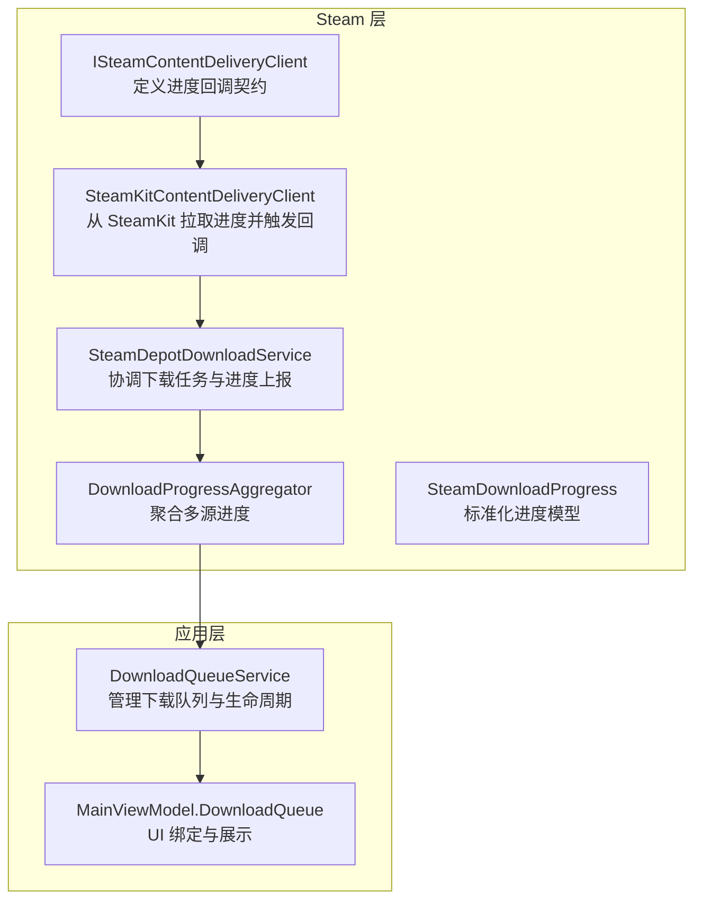
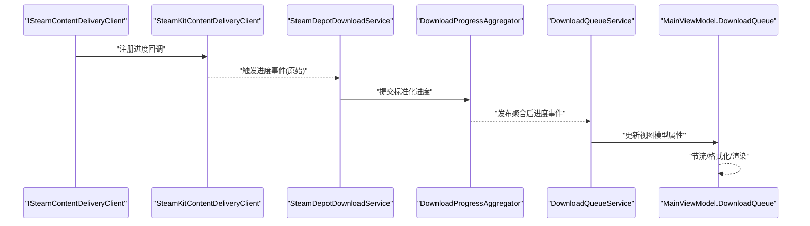
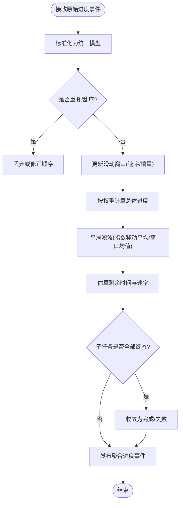
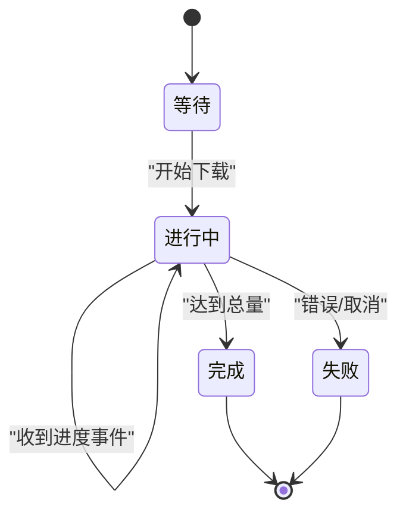
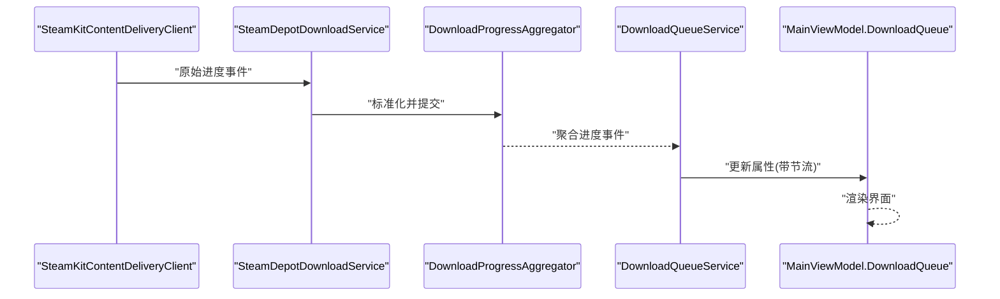
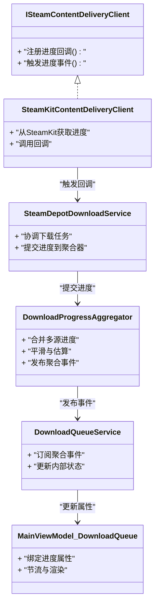

# 进度监控

<cite>
**本文引用的文件**   
- [DownloadProgressAggregator.cs](file://src/Crystalfly.Steam/Downloads/DownloadProgressAggregator.cs)
- [SteamDownloadProgress.cs](file://src/Crystalfly.Steam/Downloads/SteamDownloadProgress.cs)
- [SteamDepotDownloadService.cs](file://src/Crystalfly.Steam/Downloads/SteamDepotDownloadService.cs)
- [SteamKitContentDeliveryClient.cs](file://src/Crystalfly.Steam/Downloads/SteamKitContentDeliveryClient.cs)
- [ISteamContentDeliveryClient.cs](file://src/Crystalfly.Steam/Downloads/ISteamContentDeliveryClient.cs)
- [DownloadQueueService.cs](file://src/Crystalfly.App/Downloads/DownloadQueueService.cs)
- [MainViewModel.DownloadQueue.cs](file://src/Crystalfly.App/ViewModels/MainViewModel.DownloadQueue.cs)
- [DownloadProgressAggregatorTests.cs](file://tests/Crystalfly.Steam.Tests/Downloads/DownloadProgressAggregatorTests.cs)
</cite>

## 目录
1. [简介](#简介)
2. [项目结构](#项目结构)
3. [核心组件](#核心组件)
4. [架构总览](#架构总览)
5. [详细组件分析](#详细组件分析)
6. [依赖关系分析](#依赖关系分析)
7. [性能考量](#性能考量)
8. [故障排查指南](#故障排查指南)
9. [结论](#结论)
10. [附录](#附录)

## 简介
本文件围绕下载进度监控系统，重点阐述以下方面：
- DownloadProgressAggregator 的进度聚合算法与多源数据合并机制
- SteamDownloadProgress 的数据结构与状态同步策略
- 进度事件的发布订阅模式与实时通知机制
- 进度计算的准确性保证与数据一致性处理
- 集成到用户界面的示例路径与最佳实践
- 进度估算、剩余时间计算与速度统计的实现思路
- 进度数据的持久化与历史追踪机制

## 项目结构
与进度监控相关的代码主要分布在以下模块：
- Crystalfly.Steam/Downloads：包含进度聚合器、Steam 下载服务、内容投递客户端接口与实现等
- Crystalfly.App/Downloads 与 ViewModels：队列服务与 UI 绑定层，负责消费进度事件并驱动界面更新
- tests/Crystalfly.Steam.Tests/Downloads：针对进度聚合器的单元测试，用于验证聚合逻辑与边界条件

图表来源
- [ISteamContentDeliveryClient.cs](file://src/Crystalfly.Steam/Downloads/ISteamContentDeliveryClient.cs)
- [SteamKitContentDeliveryClient.cs](file://src/Crystalfly.Steam/Downloads/SteamKitContentDeliveryClient.cs)
- [SteamDepotDownloadService.cs](file://src/Crystalfly.Steam/Downloads/SteamDepotDownloadService.cs)
- [DownloadProgressAggregator.cs](file://src/Crystalfly.Steam/Downloads/DownloadProgressAggregator.cs)
- [SteamDownloadProgress.cs](file://src/Crystalfly.Steam/Downloads/SteamDownloadProgress.cs)
- [DownloadQueueService.cs](file://src/Crystalfly.App/Downloads/DownloadQueueService.cs)
- [MainViewModel.DownloadQueue.cs](file://src/Crystalfly.App/ViewModels/MainViewModel.DownloadQueue.cs)

章节来源
- [DownloadProgressAggregator.cs](file://src/Crystalfly.Steam/Downloads/DownloadProgressAggregator.cs)
- [SteamDownloadProgress.cs](file://src/Crystalfly.Steam/Downloads/SteamDownloadProgress.cs)
- [SteamDepotDownloadService.cs](file://src/Crystalfly.Steam/Downloads/SteamDepotDownloadService.cs)
- [SteamKitContentDeliveryClient.cs](file://src/Crystalfly.Steam/Downloads/SteamKitContentDeliveryClient.cs)
- [ISteamContentDeliveryClient.cs](file://src/Crystalfly.Steam/Downloads/ISteamContentDeliveryClient.cs)
- [DownloadQueueService.cs](file://src/Crystalfly.App/Downloads/DownloadQueueService.cs)
- [MainViewModel.DownloadQueue.cs](file://src/Crystalfly.App/ViewModels/MainViewModel.DownloadQueue.cs)

## 核心组件
- DownloadProgressAggregator：负责将来自多个下载源的原始进度事件归一化、去抖、平滑与加权汇总，输出稳定的整体进度与速率指标。
- SteamDownloadProgress：标准化的进度数据结构，封装已下载字节、总量、百分比、瞬时速率、累计时长、剩余时间估计等字段，并提供状态语义（如等待、进行中、完成、失败）。
- ISteamContentDeliveryClient / SteamKitContentDeliveryClient：定义进度回调契约，并由具体实现从底层库（如 SteamKit）获取真实进度并触发回调。
- SteamDepotDownloadService：协调具体的下载任务，将各任务的进度事件转发给聚合器。
- DownloadQueueService：在应用层维护下载队列，订阅聚合器事件，驱动业务状态与 UI 更新。
- MainViewModel.DownloadQueue：将进度数据绑定到界面，提供刷新频率控制与显示格式化。

章节来源
- [DownloadProgressAggregator.cs](file://src/Crystalfly.Steam/Downloads/DownloadProgressAggregator.cs)
- [SteamDownloadProgress.cs](file://src/Crystalfly.Steam/Downloads/SteamDownloadProgress.cs)
- [ISteamContentDeliveryClient.cs](file://src/Crystalfly.Steam/Downloads/ISteamContentDeliveryClient.cs)
- [SteamKitContentDeliveryClient.cs](file://src/Crystalfly.Steam/Downloads/SteamKitContentDeliveryClient.cs)
- [SteamDepotDownloadService.cs](file://src/Crystalfly.Steam/Downloads/SteamDepotDownloadService.cs)
- [DownloadQueueService.cs](file://src/Crystalfly.App/Downloads/DownloadQueueService.cs)
- [MainViewModel.DownloadQueue.cs](file://src/Crystalfly.App/ViewModels/MainViewModel.DownloadQueue.cs)

## 架构总览
下图展示了从底层进度采集到 UI 展示的完整链路，以及关键组件之间的交互关系。

图表来源
- [ISteamContentDeliveryClient.cs](file://src/Crystalfly.Steam/Downloads/ISteamContentDeliveryClient.cs)
- [SteamKitContentDeliveryClient.cs](file://src/Crystalfly.Steam/Downloads/SteamKitContentDeliveryClient.cs)
- [SteamDepotDownloadService.cs](file://src/Crystalfly.Steam/Downloads/SteamDepotDownloadService.cs)
- [DownloadProgressAggregator.cs](file://src/Crystalfly.Steam/Downloads/DownloadProgressAggregator.cs)
- [DownloadQueueService.cs](file://src/Crystalfly.App/Downloads/DownloadQueueService.cs)
- [MainViewModel.DownloadQueue.cs](file://src/Crystalfly.App/ViewModels/MainViewModel.DownloadQueue.cs)

## 详细组件分析

### DownloadProgressAggregator：进度聚合算法与多源合并
- 输入来源
  - 多任务/多分片进度事件，可能来自不同下载通道或并行任务组
  - 事件粒度不一，存在抖动与乱序
- 核心职责
  - 去重与合并：按任务标识合并同一来源的多条事件
  - 平滑与滤波：对瞬时速率与百分比进行滑动窗口平滑，降低抖动
  - 加权汇总：根据任务权重（如文件大小占比）计算总体进度
  - 速率与剩余时间估计：基于最近窗口内的增量与耗时计算平均速率，并推算剩余时间
  - 状态收敛：当所有子任务达到终态时，聚合结果收敛为完成或失败
- 关键设计点
  - 时间窗口：固定长度滑动窗口用于速率与剩余时间估计
  - 幂等性：相同时间戳与序列号的事件重复提交不改变结果
  - 线程安全：并发提交事件时的锁或无锁结构保障一致性
  - 容错：缺失总量或异常值会被忽略或回退到保守估计

图表来源
- [DownloadProgressAggregator.cs](file://src/Crystalfly.Steam/Downloads/DownloadProgressAggregator.cs)

章节来源
- [DownloadProgressAggregator.cs](file://src/Crystalfly.Steam/Downloads/DownloadProgressAggregator.cs)
- [DownloadProgressAggregatorTests.cs](file://tests/Crystalfly.Steam.Tests/Downloads/DownloadProgressAggregatorTests.cs)

### SteamDownloadProgress：数据结构与状态同步
- 数据结构要点
  - 已下载字节数与总量：用于计算百分比与剩余量
  - 百分比与状态：表示当前阶段（等待、进行中、完成、失败）
  - 瞬时速率与平均速率：分别反映最新变化与长期趋势
  - 累计时长与剩余时间估计：基于速率与剩余量推算
  - 任务标识与来源信息：用于聚合与溯源
- 状态同步策略
  - 单调递增：已下载字节数与百分比非递减（除非重置）
  - 终态锁定：进入完成或失败后不再变更
  - 事件驱动：通过事件总线对外广播，避免轮询
  - 幂等更新：相同快照重复推送不影响最终状态

图表来源
- [SteamDownloadProgress.cs](file://src/Crystalfly.Steam/Downloads/SteamDownloadProgress.cs)

章节来源
- [SteamDownloadProgress.cs](file://src/Crystalfly.Steam/Downloads/SteamDownloadProgress.cs)

### 进度事件发布订阅与实时通知
- 发布端
  - 底层客户端（SteamKitContentDeliveryClient）从系统回调中获取原始进度，转换为标准事件
  - 下载服务（SteamDepotDownloadService）将任务级进度提交给聚合器
- 订阅端
  - 聚合器（DownloadProgressAggregator）发布聚合后的进度事件
  - 队列服务（DownloadQueueService）订阅事件，更新内部状态并触发 UI 刷新
  - 视图模型（MainViewModel.DownloadQueue）绑定属性，控制刷新频率与显示格式
- 实时性保障
  - 事件批处理与节流：避免高频事件导致 UI 卡顿
  - 主线程调度：确保 UI 更新在合适的线程执行

图表来源
- [SteamKitContentDeliveryClient.cs](file://src/Crystalfly.Steam/Downloads/SteamKitContentDeliveryClient.cs)
- [SteamDepotDownloadService.cs](file://src/Crystalfly.Steam/Downloads/SteamDepotDownloadService.cs)
- [DownloadProgressAggregator.cs](file://src/Crystalfly.Steam/Downloads/DownloadProgressAggregator.cs)
- [DownloadQueueService.cs](file://src/Crystalfly.App/Downloads/DownloadQueueService.cs)
- [MainViewModel.DownloadQueue.cs](file://src/Crystalfly.App/ViewModels/MainViewModel.DownloadQueue.cs)

章节来源
- [SteamKitContentDeliveryClient.cs](file://src/Crystalfly.Steam/Downloads/SteamKitContentDeliveryClient.cs)
- [SteamDepotDownloadService.cs](file://src/Crystalfly.Steam/Downloads/SteamDepotDownloadService.cs)
- [DownloadProgressAggregator.cs](file://src/Crystalfly.Steam/Downloads/DownloadProgressAggregator.cs)
- [DownloadQueueService.cs](file://src/Crystalfly.App/Downloads/DownloadQueueService.cs)
- [MainViewModel.DownloadQueue.cs](file://src/Crystalfly.App/ViewModels/MainViewModel.DownloadQueue.cs)

### 进度计算的准确性与数据一致性
- 准确性保证
  - 使用滑动窗口计算平均速率，减少突发波动影响
  - 对缺失总量或异常增量进行回退与校验
  - 幂等事件处理，防止重复计数
- 一致性处理
  - 原子更新：在同一事务内更新相关字段（已下载、百分比、速率）
  - 顺序修复：对乱序事件进行排序或丢弃
  - 终态不可逆：完成/失败后禁止再修改
- 估算策略
  - 剩余时间 = 剩余字节 / 平均速率（若速率接近零则延后估算）
  - 速度统计采用指数移动平均与窗口均值结合，兼顾响应性与稳定性

章节来源
- [DownloadProgressAggregator.cs](file://src/Crystalfly.Steam/Downloads/DownloadProgressAggregator.cs)
- [SteamDownloadProgress.cs](file://src/Crystalfly.Steam/Downloads/SteamDownloadProgress.cs)

### 集成到用户界面的示例路径
- 订阅聚合器事件
  - 在队列服务中订阅进度事件，更新内部状态
  - 将状态暴露为可绑定的属性
- 视图模型绑定
  - 在 MainViewModel.DownloadQueue 中定义进度相关属性
  - 使用节流机制限制 UI 刷新频率
- 参考路径
  - 订阅与状态更新：[DownloadQueueService.cs](file://src/Crystalfly.App/Downloads/DownloadQueueService.cs)
  - 视图模型属性与绑定：[MainViewModel.DownloadQueue.cs](file://src/Crystalfly.App/ViewModels/MainViewModel.DownloadQueue.cs)

章节来源
- [DownloadQueueService.cs](file://src/Crystalfly.App/Downloads/DownloadQueueService.cs)
- [MainViewModel.DownloadQueue.cs](file://src/Crystalfly.App/ViewModels/MainViewModel.DownloadQueue.cs)

### 进度估算、剩余时间与速度统计
- 估算算法
  - 滑动窗口：记录最近 N 秒的增量与耗时，计算平均速率
  - 指数移动平均：对新旧速率进行加权融合，提升稳定性
  - 剩余时间：基于剩余字节与平均速率估算，设置最小阈值避免除零
- 速度统计
  - 瞬时速率：最近一次增量除以时间差
  - 平均速率：窗口均值或 EMA 结果
  - 峰值速率：可选记录窗口内最大值用于展示
- 参考实现位置
  - 聚合器中的速率与剩余时间计算：[DownloadProgressAggregator.cs](file://src/Crystalfly.Steam/Downloads/DownloadProgressAggregator.cs)
  - 进度模型字段定义：[SteamDownloadProgress.cs](file://src/Crystalfly.Steam/Downloads/SteamDownloadProgress.cs)

章节来源
- [DownloadProgressAggregator.cs](file://src/Crystalfly.Steam/Downloads/DownloadProgressAggregator.cs)
- [SteamDownloadProgress.cs](file://src/Crystalfly.Steam/Downloads/SteamDownloadProgress.cs)

### 进度数据的持久化与历史追踪
- 持久化目标
  - 保存每次聚合后的快照，便于回放与审计
  - 记录关键事件（开始、完成、失败、取消）的时间戳
- 历史追踪
  - 环形缓冲区存储最近 K 个快照，支持折线图渲染
  - 导出功能：将历史数据序列化为 JSON 供外部分析
- 建议实现位置
  - 在聚合器或队列服务中增加快照写入逻辑
  - 使用原子写入避免损坏历史文件
  - 注意磁盘 I/O 节流，避免影响下载性能

章节来源
- [DownloadProgressAggregator.cs](file://src/Crystalfly.Steam/Downloads/DownloadProgressAggregator.cs)
- [DownloadQueueService.cs](file://src/Crystalfly.App/Downloads/DownloadQueueService.cs)

## 依赖关系分析
- 组件耦合
  - SteamKitContentDeliveryClient 依赖底层库，仅通过接口暴露进度回调
  - SteamDepotDownloadService 依赖聚合器，屏蔽多源差异
  - DownloadQueueService 依赖聚合器事件，解耦 UI 与下载逻辑
- 外部依赖
  - SteamKit：提供真实的下载进度与网络状态
  - 序列化库：用于持久化历史数据
- 潜在循环依赖
  - 通过接口与事件总线解耦，避免直接双向引用

图表来源
- [ISteamContentDeliveryClient.cs](file://src/Crystalfly.Steam/Downloads/ISteamContentDeliveryClient.cs)
- [SteamKitContentDeliveryClient.cs](file://src/Crystalfly.Steam/Downloads/SteamKitContentDeliveryClient.cs)
- [SteamDepotDownloadService.cs](file://src/Crystalfly.Steam/Downloads/SteamDepotDownloadService.cs)
- [DownloadProgressAggregator.cs](file://src/Crystalfly.Steam/Downloads/DownloadProgressAggregator.cs)
- [DownloadQueueService.cs](file://src/Crystalfly.App/Downloads/DownloadQueueService.cs)
- [MainViewModel.DownloadQueue.cs](file://src/Crystalfly.App/ViewModels/MainViewModel.DownloadQueue.cs)

章节来源
- [ISteamContentDeliveryClient.cs](file://src/Crystalfly.Steam/Downloads/ISteamContentDeliveryClient.cs)
- [SteamKitContentDeliveryClient.cs](file://src/Crystalfly.Steam/Downloads/SteamKitContentDeliveryClient.cs)
- [SteamDepotDownloadService.cs](file://src/Crystalfly.Steam/Downloads/SteamDepotDownloadService.cs)
- [DownloadProgressAggregator.cs](file://src/Crystalfly.Steam/Downloads/DownloadProgressAggregator.cs)
- [DownloadQueueService.cs](file://src/Crystalfly.App/Downloads/DownloadQueueService.cs)
- [MainViewModel.DownloadQueue.cs](file://src/Crystalfly.App/ViewModels/MainViewModel.DownloadQueue.cs)

## 性能考量
- 事件节流：在 UI 层限制刷新频率，避免频繁重绘
- 滑动窗口大小：平衡响应性与稳定性，过大导致延迟，过小导致抖动
- 内存占用：历史快照使用环形缓冲，限制最大条目数
- I/O 节流：持久化写入批量或异步，避免阻塞下载线程
- CPU 开销：平滑与估算算法尽量轻量，避免复杂运算

## 故障排查指南
- 常见问题
  - 进度不更新：检查回调注册与事件发布链路
  - 百分比跳变：确认幂等与顺序修复逻辑
  - 剩余时间为负或无穷大：检查速率接近零的处理与阈值
  - UI 卡顿：调整节流间隔与渲染批次
- 定位步骤
  - 查看聚合器日志与快照
  - 对比原始事件与聚合后事件
  - 检查队列服务状态与视图模型属性
- 参考测试用例
  - 聚合器行为验证：[DownloadProgressAggregatorTests.cs](file://tests/Crystalfly.Steam.Tests/Downloads/DownloadProgressAggregatorTests.cs)

章节来源
- [DownloadProgressAggregatorTests.cs](file://tests/Crystalfly.Steam.Tests/Downloads/DownloadProgressAggregatorTests.cs)

## 结论
本进度监控系统通过清晰的组件分层与事件驱动架构，实现了多源进度的稳定聚合与实时通知。DownloadProgressAggregator 提供了可靠的平滑与估算能力，SteamDownloadProgress 定义了统一的进度模型，配合队列服务与视图模型的解耦设计，使得进度监控既准确又高效。建议在后续迭代中完善持久化与历史追踪，进一步提升可观测性与用户体验。

## 附录
- 术语
  - 滑动窗口：固定长度的时间段，用于统计近期数据
  - 指数移动平均：对新旧数据进行加权融合，提升稳定性
  - 幂等：重复操作不会改变最终结果
- 最佳实践
  - 明确事件语义与顺序要求
  - 在 UI 层实施节流与批量更新
  - 对异常与缺失数据进行回退与保护