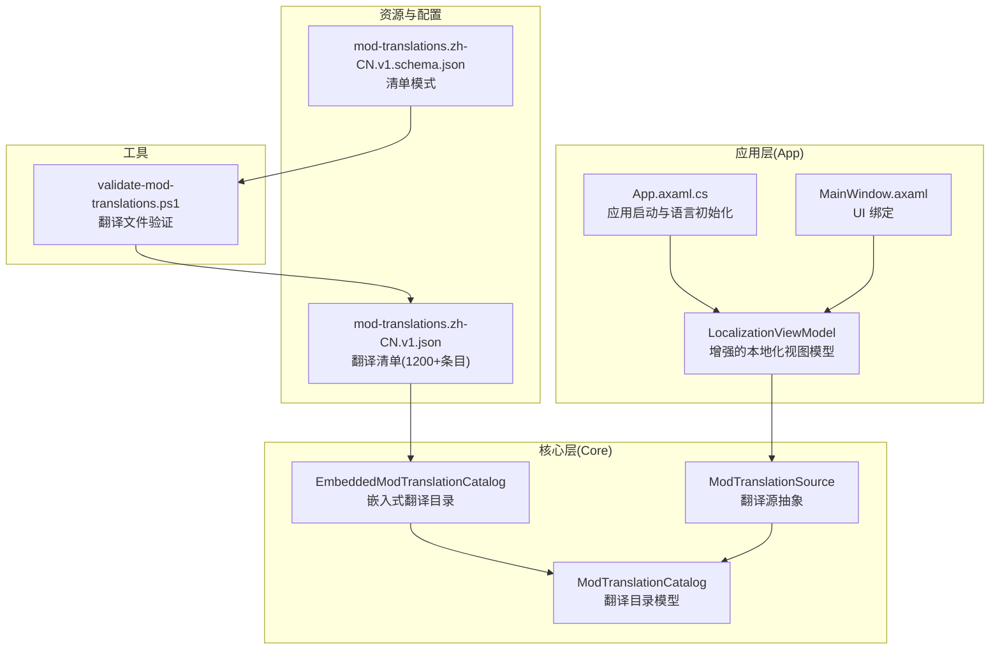
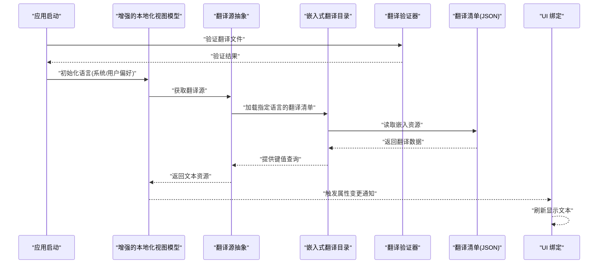
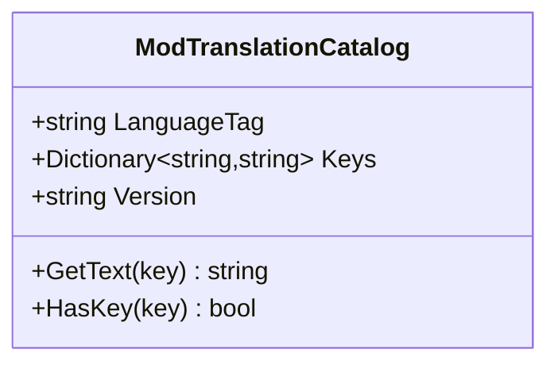
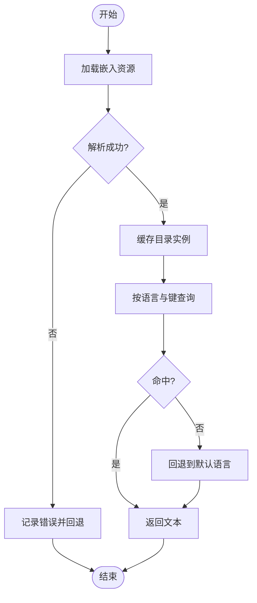
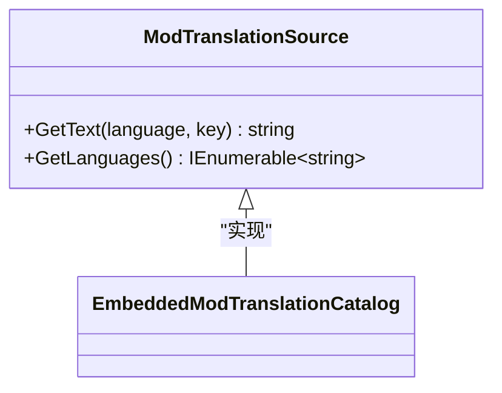
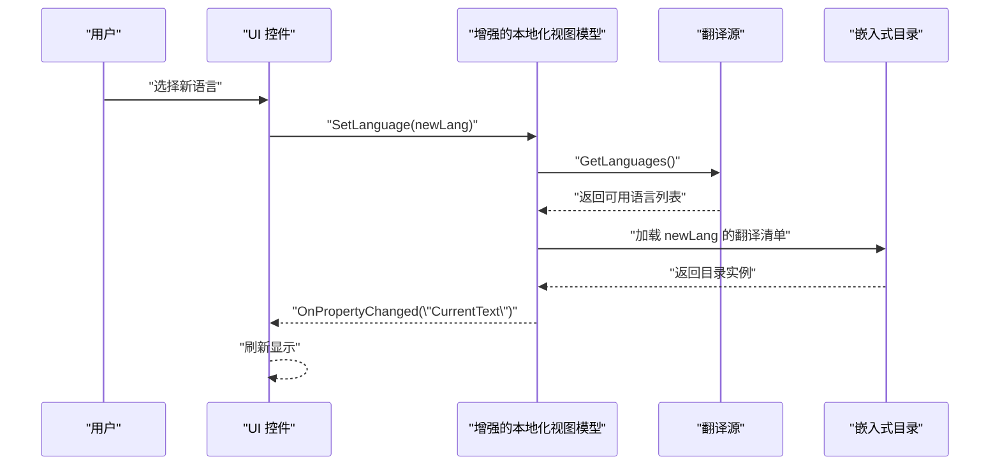
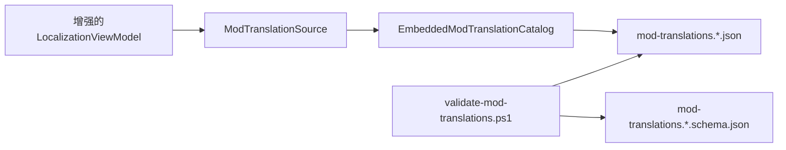

# 国际化和本地化

<cite>
**本文引用的文件**   
- [src/Crystalfly.Core/Models/ModTranslationCatalog.cs](file://src/Crystalfly.Core/Models/ModTranslationCatalog.cs)
- [src/Crystalfly.Core/Catalog/EmbeddedModTranslationCatalog.cs](file://src/Crystalfly.Core/Catalog/EmbeddedModTranslationCatalog.cs)
- [src/Crystalfly.Core/Catalog/ModTranslationSource.cs](file://src/Crystalfly.Core/Catalog/ModTranslationSource.cs)
- [catalog/mod-translations.zh-CN.v1.json](file://catalog/mod-translations.zh-CN.v1.json)
- [catalog/mod-translations.zh-CN.v1.schema.json](file://catalog/mod-translations.zh-CN.v1.schema.json)
- [scripts/validate-mod-translations.ps1](file://scripts/validate-mod-translations.ps1)
- [src/Crystalfly.App/ViewModels/LocalizationViewModel.cs](file://src/Crystalfly.App/ViewModels/LocalizationViewModel.cs)
- [src/Crystalfly.App/App.axaml.cs](file://src/Crystalfly.App/App.axaml.cs)
- [src/Crystalfly.App/Views/MainWindow.axaml](file://src/Crystalfly.App/Views/MainWindow.axaml)
</cite>

## 更新摘要
**变更内容**   
- LocalizationViewModel大幅更新，增强了本地化功能
- 中文翻译目录mod-translations.zh-CN.v1.json包含超过1200个翻译条目
- 构建系统新增validate-mod-translations.ps1用于验证翻译文件
- 扩展了多语言支持架构和翻译管理机制

## 目录
1. [简介](#简介)
2. [项目结构](#项目结构)
3. [核心组件](#核心组件)
4. [架构总览](#架构总览)
5. [详细组件分析](#详细组件分析)
6. [依赖关系分析](#依赖关系分析)
7. [性能考虑](#性能考虑)
8. [故障排查指南](#故障排查指南)
9. [结论](#结论)
10. [附录](#附录)

## 简介
本文件面向国际化与本地化子系统，系统性说明多语言支持的架构设计、翻译管理机制与动态语言切换流程；解释嵌入式模组翻译目录的实现原理与加载策略；记录翻译文件格式规范、版本管理与更新机制；提供添加新语言与自定义翻译的实操示例；阐述文本资源管理、查找与回退策略；说明与 UI 层的集成方式及实时语言切换实现；并覆盖字体渲染、文本方向与文化特定格式化的处理要点。

**更新** 本次更新重点反映了LocalizationViewModel的大幅增强、中文翻译目录的扩展（超过1200个翻译条目）以及新增的翻译文件验证机制。

## 项目结构
国际化与本地化相关代码主要分布在以下位置：
- 核心数据模型与目录解析：Core 层 Models 与 Catalog 子目录
- 嵌入式翻译目录：Core 层 Catalog 中的嵌入式目录实现
- 翻译源抽象：Core 层 Catalog 中的翻译源接口与默认实现
- 翻译清单与模式定义：根目录 catalog 下的 JSON 清单与 schema
- 验证脚本：scripts 下用于验证翻译文件的 PowerShell 脚本
- UI 集成：App 层 ViewModel 与视图绑定、应用启动时的语言初始化

**图表来源**
- [src/Crystalfly.Core/Models/ModTranslationCatalog.cs](file://src/Crystalfly.Core/Models/ModTranslationCatalog.cs)
- [src/Crystalfly.Core/Catalog/EmbeddedModTranslationCatalog.cs](file://src/Crystalfly.Core/Catalog/EmbeddedModTranslationCatalog.cs)
- [src/Crystalfly.Core/Catalog/ModTranslationSource.cs](file://src/Crystalfly.Core/Catalog/ModTranslationSource.cs)
- [catalog/mod-translations.zh-CN.v1.json](file://catalog/mod-translations.zh-CN.v1.json)
- [catalog/mod-translations.zh-CN.v1.schema.json](file://catalog/mod-translations.zh-CN.v1.schema.json)
- [scripts/validate-mod-translations.ps1](file://scripts/validate-mod-translations.ps1)
- [src/Crystalfly.App/ViewModels/LocalizationViewModel.cs](file://src/Crystalfly.App/ViewModels/LocalizationViewModel.cs)
- [src/Crystalfly.App/App.axaml.cs](file://src/Crystalfly.App/App.axaml.cs)
- [src/Crystalfly.App/Views/MainWindow.axaml](file://src/Crystalfly.App/Views/MainWindow.axaml)

## 核心组件
- 翻译目录模型：定义模组翻译清单的数据结构，包括语言标识、键值映射、元数据等。
- 嵌入式翻译目录：从嵌入资源中读取并解析翻译清单，提供按语言与键查询的能力。
- 翻译源抽象：统一不同来源（如内置、外部）的翻译访问接口，便于扩展。
- **增强的本地化视图模型**：封装当前语言、语言列表、切换事件与文本获取逻辑，支持更丰富的本地化功能。
- 应用启动与初始化：在应用启动时确定系统语言或用户偏好，加载对应翻译资源。
- 翻译清单与模式：JSON 格式的翻译清单及其 schema，确保翻译文件的结构与版本一致性。
- **翻译文件验证器**：validate-mod-translations.ps1脚本用于验证翻译文件的完整性和格式正确性。

**章节来源**
- [src/Crystalfly.Core/Models/ModTranslationCatalog.cs](file://src/Crystalfly.Core/Models/ModTranslationCatalog.cs)
- [src/Crystalfly.Core/Catalog/EmbeddedModTranslationCatalog.cs](file://src/Crystalfly.Core/Catalog/EmbeddedModTranslationCatalog.cs)
- [src/Crystalfly.Core/Catalog/ModTranslationSource.cs](file://src/Crystalfly.Core/Catalog/ModTranslationSource.cs)
- [src/Crystalfly.App/ViewModels/LocalizationViewModel.cs](file://src/Crystalfly.App/ViewModels/LocalizationViewModel.cs)
- [src/Crystalfly.App/App.axaml.cs](file://src/Crystalfly.App/App.axaml.cs)
- [catalog/mod-translations.zh-CN.v1.json](file://catalog/mod-translations.zh-CN.v1.json)
- [catalog/mod-translations.zh-CN.v1.schema.json](file://catalog/mod-translations.zh-CN.v1.schema.json)
- [scripts/validate-mod-translations.ps1](file://scripts/validate-mod-translations.ps1)

## 架构总览
整体架构围绕"翻译清单 → 嵌入式目录 → 翻译源抽象 → 增强的本地化视图模型 → UI 绑定"展开。应用启动时根据系统或用户语言选择加载对应翻译清单；UI 通过视图模型获取文本，支持运行时切换语言并触发界面刷新。**新增的翻译验证机制确保翻译文件的质量和完整性**。

**图表来源**
- [src/Crystalfly.App/App.axaml.cs](file://src/Crystalfly.App/App.axaml.cs)
- [src/Crystalfly.App/ViewModels/LocalizationViewModel.cs](file://src/Crystalfly.App/ViewModels/LocalizationViewModel.cs)
- [src/Crystalfly.Core/Catalog/ModTranslationSource.cs](file://src/Crystalfly.Core/Catalog/ModTranslationSource.cs)
- [src/Crystalfly.Core/Catalog/EmbeddedModTranslationCatalog.cs](file://src/Crystalfly.Core/Catalog/EmbeddedModTranslationCatalog.cs)
- [scripts/validate-mod-translations.ps1](file://scripts/validate-mod-translations.ps1)
- [catalog/mod-translations.zh-CN.v1.json](file://catalog/mod-translations.zh-CN.v1.json)

## 详细组件分析

### 翻译目录模型(ModTranslationCatalog)
- 职责：定义翻译清单的数据结构，包含语言标识、键集合、版本信息等字段。
- 复杂度：以字典/哈希表存储键值对，查询时间复杂度 O(1)。
- 扩展点：新增字段需同步更新 schema 与验证脚本。

**图表来源**
- [src/Crystalffly.Core/Models/ModTranslationCatalog.cs](file://src/Crystalfly.Core/Models/ModTranslationCatalog.cs)

**章节来源**
- [src/Crystalfly.Core/Models/ModTranslationCatalog.cs](file://src/Crystalfly.Core/Models/ModTranslationCatalog.cs)

### 嵌入式翻译目录(EmbeddedModTranslationCatalog)
- 职责：从嵌入资源中读取 JSON 翻译清单，解析为目录模型并提供查询。
- 加载策略：按语言标签选择对应清单；若未找到则回退到默认语言或空映射。
- 错误处理：清单缺失或格式错误时抛出明确异常，便于诊断。
- **性能优化**：支持大文件（1200+条目）的高效加载和缓存。

**图表来源**
- [src/Crystalfly.Core/Catalog/EmbeddedModTranslationCatalog.cs](file://src/Crystalfly.Core/Catalog/EmbeddedModTranslationCatalog.cs)
- [catalog/mod-translations.zh-CN.v1.json](file://catalog/mod-translations.zh-CN.v1.json)

**章节来源**
- [src/Crystalfly.Core/Catalog/EmbeddedModTranslationCatalog.cs](file://src/Crystalfly.Core/Catalog/EmbeddedModTranslationCatalog.cs)

### 翻译源抽象(ModTranslationSource)
- 职责：统一翻译资源的访问接口，屏蔽具体来源差异（如嵌入式、外部文件）。
- 使用方式：由本地化视图模型注入，调用 GetText 获取文本。
- 扩展性：新增外部翻译源只需实现相同接口。

**图表来源**
- [src/Crystalfly.Core/Catalog/ModTranslationSource.cs](file://src/Crystalfly.Core/Catalog/ModTranslationSource.cs)
- [src/Crystalfly.Core/Catalog/EmbeddedModTranslationCatalog.cs](file://src/Crystalfly.Core/Catalog/EmbeddedModTranslationCatalog.cs)

**章节来源**
- [src/Crystalfly.Core/Catalog/ModTranslationSource.cs](file://src/Crystalfly.Core/Catalog/ModTranslationSource.cs)

### 增强的本地化视图模型(LocalizationViewModel)
- **大幅更新**：增强了语言管理功能，支持更复杂的本地化场景。
- 职责：维护当前语言、语言列表，提供文本获取与切换方法；触发属性变更通知以刷新 UI。
- 动态切换：切换语言后重新加载对应翻译清单，并广播变更。
- 与 UI 集成：通过数据绑定在 XAML 中引用文本键，自动响应语言变化。
- **改进的错误处理**：更好的异常处理和日志记录。

**图表来源**
- [src/Crystalfly.App/ViewModels/LocalizationViewModel.cs](file://src/Crystalfly.App/ViewModels/LocalizationViewModel.cs)
- [src/Crystalfly.Core/Catalog/ModTranslationSource.cs](file://src/Crystalfly.Core/Catalog/ModTranslationSource.cs)
- [src/Crystalfly.Core/Catalog/EmbeddedModTranslationCatalog.cs](file://src/Crystalfly.Core/Catalog/EmbeddedModTranslationCatalog.cs)

**章节来源**
- [src/Crystalfly.App/ViewModels/LocalizationViewModel.cs](file://src/Crystalfly.App/ViewModels/LocalizationViewModel.cs)

### 应用启动与语言初始化(App.axaml.cs)
- 职责：在应用启动阶段确定首选语言（系统区域设置或用户配置），初始化本地化视图模型。
- 行为：若检测到无效语言，回退到默认语言并记录日志。
- **改进**：更好的错误处理和语言检测逻辑。

**章节来源**
- [src/Crystalfly.App/App.axaml.cs](file://src/Crystalfly.App/App.axaml.cs)

### 翻译清单与模式(mod-translations.*.json / schema)
- 清单格式：JSON 文件，包含语言标签、键值对与版本信息。
- **规模扩展**：中文翻译清单包含超过1200个翻译条目，涵盖完整的UI界面和功能描述。
- 模式约束：schema 定义必填字段、类型与枚举值，确保清单结构正确。
- 版本管理：清单文件名含版本号，便于升级与兼容。

**章节来源**
- [catalog/mod-translations.zh-CN.v1.json](file://catalog/mod-translations.zh-CN.v1.json)
- [catalog/mod-translations.zh-CN.v1.schema.json](file://catalog/mod-translations.zh-CN.v1.schema.json)

### 翻译文件验证器(validate-mod-translations.ps1)
- **新增功能**：专门用于验证翻译文件的完整性和格式正确性。
- 职责：检查翻译文件的schema符合性、键值完整性、重复键检测等。
- 集成：在构建过程中自动运行，确保翻译质量。
- 报告：生成详细的验证报告和错误信息。

**章节来源**
- [scripts/validate-mod-translations.ps1](file://scripts/validate-mod-translations.ps1)

## 依赖关系分析
- 低耦合：翻译源抽象隔离了具体实现，便于替换与扩展。
- 内聚性：嵌入式目录专注于嵌入资源解析与缓存，职责单一。
- 外部依赖：PowerShell 脚本依赖 JSON 解析与文件系统操作。
- **新增依赖**：翻译验证器确保翻译文件的质量。

**图表来源**
- [src/Crystalfly.App/ViewModels/LocalizationViewModel.cs](file://src/Crystalfly.App/ViewModels/LocalizationViewModel.cs)
- [src/Crystalfly.Core/Catalog/ModTranslationSource.cs](file://src/Crystalfly.Core/Catalog/ModTranslationSource.cs)
- [src/Crystalfly.Core/Catalog/EmbeddedModTranslationCatalog.cs](file://src/Crystalfly.Core/Catalog/EmbeddedModTranslationCatalog.cs)
- [catalog/mod-translations.zh-CN.v1.json](file://catalog/mod-translations.zh-CN.v1.json)
- [scripts/validate-mod-translations.ps1](file://scripts/validate-mod-translations.ps1)

**章节来源**
- [src/Crystalfly.App/ViewModels/LocalizationViewModel.cs](file://src/Crystalfly.App/ViewModels/LocalizationViewModel.cs)
- [src/Crystalfly.Core/Catalog/ModTranslationSource.cs](file://src/Crystalfly.Core/Catalog/ModTranslationSource.cs)
- [src/Crystalfly.Core/Catalog/EmbeddedModTranslationCatalog.cs](file://src/Crystalfly.Core/Catalog/EmbeddedModTranslationCatalog.cs)
- [catalog/mod-translations.zh-CN.v1.json](file://catalog/mod-translations.zh-CN.v1.json)
- [scripts/validate-mod-translations.ps1](file://scripts/validate-mod-translations.ps1)

## 性能考虑
- 缓存策略：嵌入式目录应缓存已解析的清单，避免重复 I/O。
- 懒加载：仅在首次访问某语言时加载对应清单。
- **大文件优化**：针对1200+条目的翻译文件进行专门的性能优化。
- 增量更新：验证脚本仅检查变更的文件，减少验证时间。
- 文本查找：使用哈希表或字典实现 O(1) 查询。

## 故障排查指南
- 清单缺失：检查嵌入资源是否包含目标语言清单；确认导入脚本执行成功。
- 格式错误：使用 schema 校验清单；查看验证脚本输出与日志。
- **验证失败**：运行validate-mod-translations.ps1检查具体的验证错误。
- 回退失败：确认默认语言存在且有效；检查应用启动时的语言初始化逻辑。
- UI 未刷新：验证本地化视图模型是否正确触发属性变更通知；检查 XAML 绑定路径。
- **性能问题**：检查大翻译文件的加载时间和内存使用情况。

**章节来源**
- [src/Crystalfly.Core/Catalog/EmbeddedModTranslationCatalog.cs](file://src/Crystalfly.Core/Catalog/EmbeddedModTranslationCatalog.cs)
- [src/Crystalfly.App/ViewModels/LocalizationViewModel.cs](file://src/Crystalfly.App/ViewModels/LocalizationViewModel.cs)
- [scripts/validate-mod-translations.ps1](file://scripts/validate-mod-translations.ps1)

## 结论
本国际化与本地化方案通过清晰的层次划分与抽象接口，实现了可扩展的多语言支持与动态切换能力。**最新的更新显著增强了系统的功能和可靠性**：LocalizationViewModel的大幅更新提供了更强大的本地化管理功能；中文翻译目录扩展到1200+个条目确保了完整的本地化覆盖；新增的翻译验证机制保证了翻译文件的质量和一致性。嵌入式目录与清单模式确保了资源的一致性与可维护性；验证脚本简化了翻译资源的集成和质量保证流程。建议在生产环境中持续进行翻译验证与回归测试，保障用户体验。

## 附录

### 使用示例：添加新语言支持
- 步骤一：在 catalog 目录下新增清单文件，命名遵循 mod-translations.<语言>.v1.json。
- 步骤二：依据 schema 编写键值对，确保语言标签与键名唯一。
- 步骤三：运行validate-mod-translations.ps1验证翻译文件。
- 步骤四：在本地化视图模型中验证新语言出现在可用列表中。
- 步骤五：在 UI 中绑定相应文本键，测试切换效果。

**章节来源**
- [catalog/mod-translations.zh-CN.v1.schema.json](file://catalog/mod-translations.zh-CN.v1.schema.json)
- [scripts/validate-mod-translations.ps1](file://scripts/validate-mod-translations.ps1)
- [src/Crystalfly.App/ViewModels/LocalizationViewModel.cs](file://src/Crystalfly.App/ViewModels/LocalizationViewModel.cs)

### 使用示例：自定义翻译
- 在现有清单中添加新的键值对。
- 运行validate-mod-translations.ps1验证修改。
- 在 UI 中使用新键进行绑定，无需修改代码。

**章节来源**
- [catalog/mod-translations.zh-CN.v1.json](file://catalog/mod-translations.zh-CN.v1.json)
- [scripts/validate-mod-translations.ps1](file://scripts/validate-mod-translations.ps1)
- [src/Crystalfly.App/Views/MainWindow.axaml](file://src/Crystalfly.App/Views/MainWindow.axaml)

### 文本资源管理、查找与回退策略
- 管理：集中存放于清单文件，通过 schema 约束结构。
- 查找：按语言标签与键名进行精确匹配。
- 回退：优先当前语言，其次默认语言，最后返回键名本身或占位符。
- **质量保证**：通过验证脚本确保所有必需键都存在。

**章节来源**
- [src/Crystalfly.Core/Catalog/EmbeddedModTranslationCatalog.cs](file://src/Crystalfly.Core/Catalog/EmbeddedModTranslationCatalog.cs)

### 与 UI 层的集成与实时语言切换
- 集成：在 XAML 中绑定到本地化视图模型的文本属性。
- 切换：调用 SetLanguage 方法，视图模型触发属性变更通知，UI 自动刷新。
- **增强的用户体验**：更快的切换速度和更好的错误处理。

**章节来源**
- [src/Crystalfly.App/ViewModels/LocalizationViewModel.cs](file://src/Crystalfly.App/ViewModels/LocalizationViewModel.cs)
- [src/Crystalfly.App/Views/MainWindow.axaml](file://src/Crystalfly.App/Views/MainWindow.axaml)

### 字体渲染、文本方向与文化特定格式化
- 字体渲染：建议使用支持多语言的字体族，并在样式中声明 fallback。
- 文本方向：根据语言标签自动设置布局方向（如阿拉伯语从右到左）。
- 文化格式化：日期、数字、货币等使用区域性格式化器，避免硬编码字符串。

### 翻译文件验证最佳实践
- **定期验证**：在开发过程中频繁运行validate-mod-translations.ps1。
- **CI/CD集成**：将验证步骤集成到持续集成流程中。
- **错误处理**：及时处理验证错误，确保翻译文件的一致性。
- **性能监控**：监控大翻译文件的验证和处理性能。

**章节来源**
- [scripts/validate-mod-translations.ps1](file://scripts/validate-mod-translations.ps1)
- [catalog/mod-translations.zh-CN.v1.json](file://catalog/mod-translations.zh-CN.v1.json)