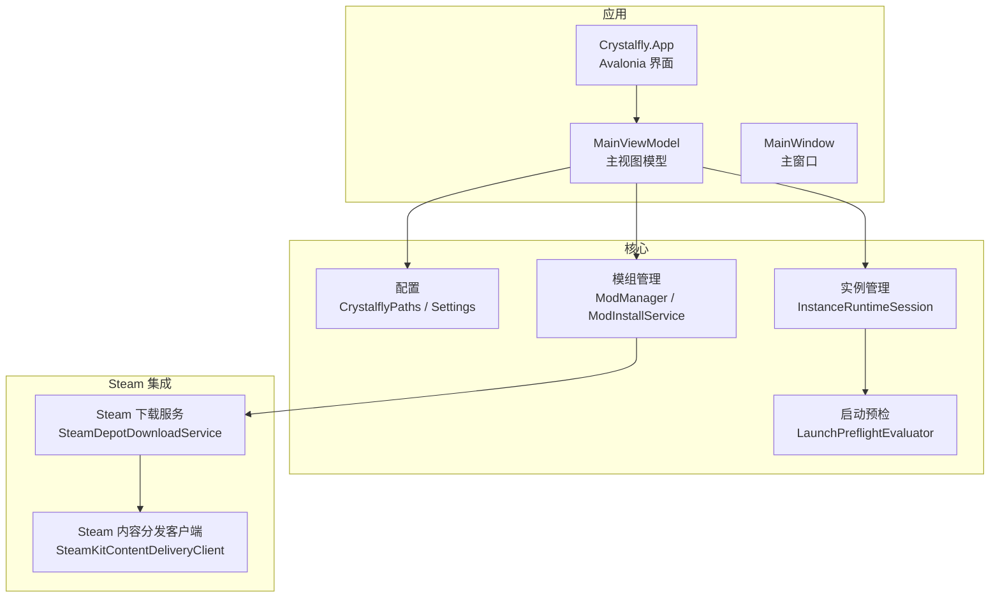
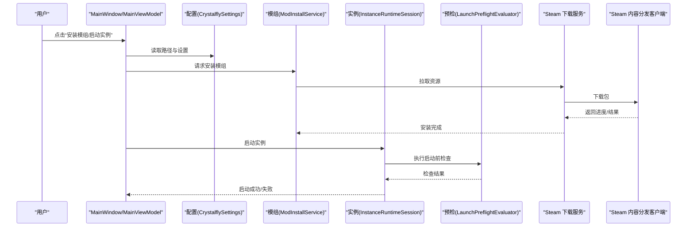
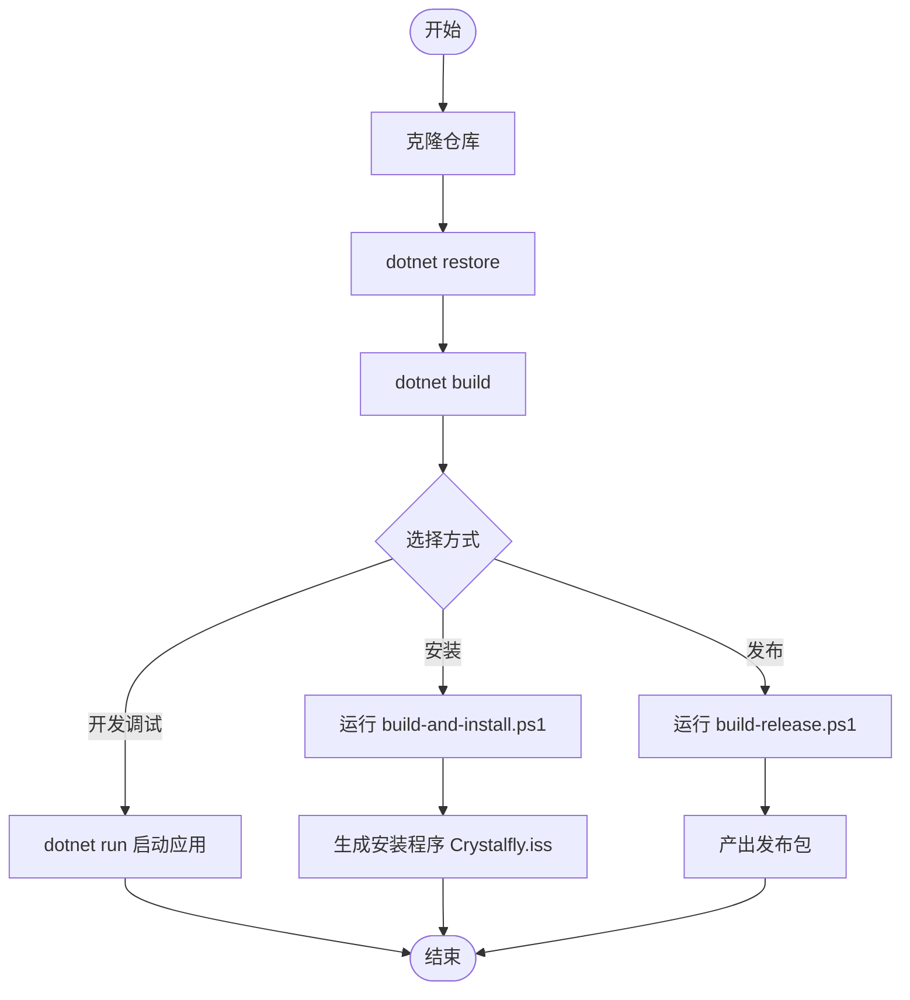
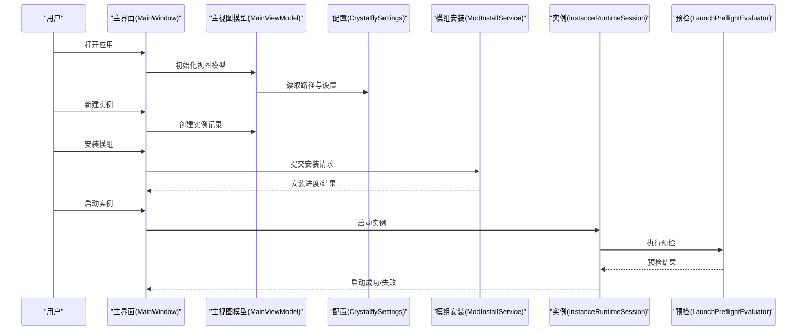
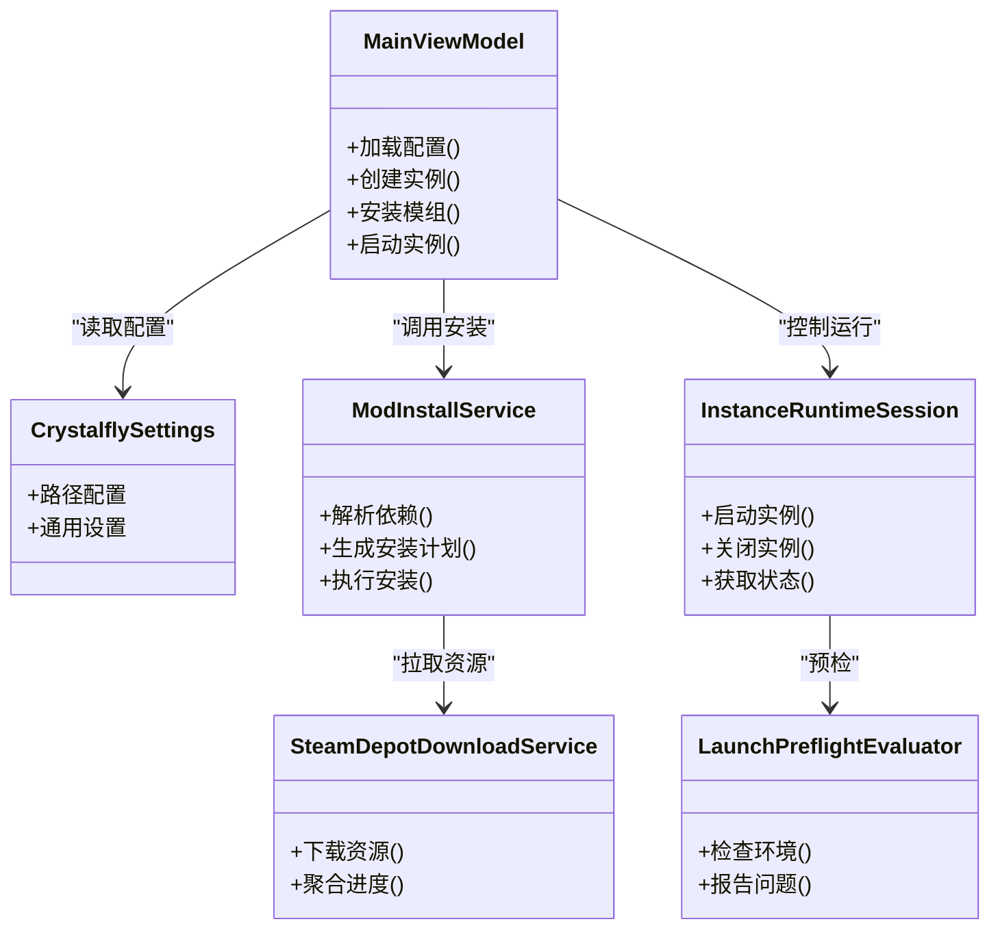
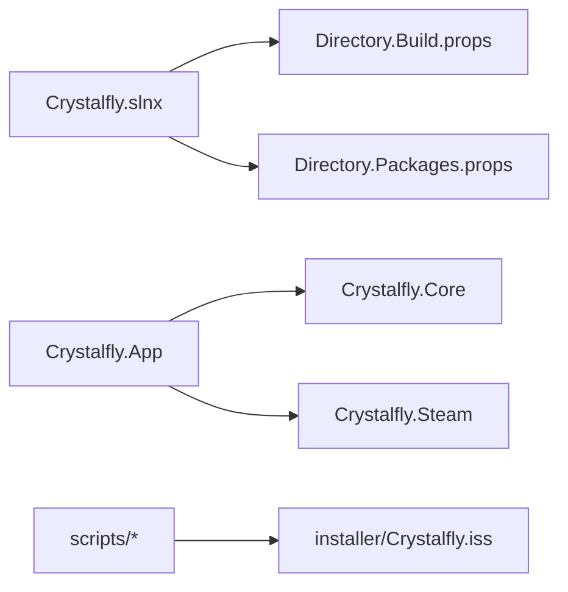

# 快速开始

<cite>
**本文引用的文件**   
- [Crystalfly.slnx](file://Crystalfly.slnx)
- [Directory.Build.props](file://Directory.Build.props)
- [Directory.Packages.props](file://Directory.Packages.props)
- [Program.cs](file://src/Crystalfly.App/Program.cs)
- [App.axaml.cs](file://src/Crystalfly.App/App.axaml.cs)
- [MainWindow.axaml.cs](file://src/Crystalfly.App/Views/MainWindow.axaml.cs)
- [MainViewModel.cs](file://src/Crystalfly.App/ViewModels/MainViewModel.cs)
- [CrystalflyPaths.cs](file://src/Crystalfly.Core/Configuration/CrystalflyPaths.cs)
- [CrystalflySettings.cs](file://src/Crystalfly.Core/Configuration/CrystalflySettings.cs)
- [CrystalflySettingsStore.cs](file://src/Crystalfly.Core/Configuration/CrystalflySettingsStore.cs)
- [ModInstallService.cs](file://src/Crystalfly.Core/Mods/ModInstallService.cs)
- [ModManager.cs](file://src/Crystalfly.Core/Mods/ModManager.cs)
- [InstanceRuntimeSession.cs](file://src/Crystalfly.Core/Runtime/InstanceRuntimeSession.cs)
- [LaunchPreflightEvaluator.cs](file://src/Crystalfly.Core/Runtime/LaunchPreflightEvaluator.cs)
- [SteamDepotDownloadService.cs](file://src/Crystalfly.Steam/Downloads/SteamDepotDownloadService.cs)
- [SteamKitContentDeliveryClient.cs](file://src/Crystalfly.Steam/Downloads/SteamKitContentDeliveryClient.cs)
- [build-and-install.ps1](file://scripts/build-and-install.ps1)
- [build-release.ps1](file://scripts/build-release.ps1)
- [Crystalfly.iss](file://installer/Crystalfly.iss)
</cite>

## 目录
1. [简介](#简介)
2. [项目结构](#项目结构)
3. [核心组件](#核心组件)
4. [架构总览](#架构总览)
5. [详细组件分析](#详细组件分析)
6. [依赖关系分析](#依赖关系分析)
7. [性能注意事项](#性能注意事项)
8. [故障排除指南](#故障排除指南)
9. [结论](#结论)
10. [附录](#附录)

## 简介
本指南面向首次接触 Crystalfly 的用户，帮助你从零开始完成环境搭建、源码克隆与构建、安装程序使用、以及创建第一个游戏实例、安装模组和启动游戏的常见操作。文档同时为高级用户提供足够的技术细节，包括关键模块的职责、数据流与错误处理要点。

## 项目结构
仓库采用多项目解决方案组织：
- 应用层（UI）：基于 Avalonia UI 的桌面应用，负责用户交互、下载队列、对话框等
- 核心库（Core）：提供配置、实例管理、模组管理、运行时会话、快照、速度跑验证等能力
- Steam 集成（Steam）：封装 Steam 认证与内容分发客户端
- 脚本与安装器：提供一键构建安装、发布打包与 Inno Setup 安装脚本
- 测试：覆盖 UI、核心逻辑与 Steam 集成的单元测试

图表来源
- [Program.cs:1-200](file://src/Crystalfly.App/Program.cs#L1-L200)
- [App.axaml.cs:1-200](file://src/Crystalfly.App/App.axaml.cs#L1-L200)
- [MainWindow.axaml.cs:1-200](file://src/Crystalfly.App/Views/MainWindow.axaml.cs#L1-L200)
- [MainViewModel.cs:1-200](file://src/Crystalfly.App/ViewModels/MainViewModel.cs#L1-L200)
- [CrystalflyPaths.cs:1-200](file://src/Crystalfly.Core/Configuration/CrystalflyPaths.cs#L1-L200)
- [CrystalflySettings.cs:1-200](file://src/Crystalfly.Core/Configuration/CrystalfflySettings.cs#L1-L200)
- [CrystalflySettingsStore.cs:1-200](file://src/Crystalfly.Core/Configuration/CrystalflySettingsStore.cs#L1-L200)
- [ModManager.cs:1-200](file://src/Crystalfly.Core/Mods/ModManager.cs#L1-L200)
- [ModInstallService.cs:1-200](file://src/Crystalfly.Core/Mods/ModInstallService.cs#L1-L200)
- [InstanceRuntimeSession.cs:1-200](file://src/Crystalfly.Core/Runtime/InstanceRuntimeSession.cs#L1-L200)
- [LaunchPreflightEvaluator.cs:1-200](file://src/Crystalfly.Core/Runtime/LaunchPreflightEvaluator.cs#L1-L200)
- [SteamDepotDownloadService.cs:1-200](file://src/Crystalfly.Steam/Downloads/SteamDepotDownloadService.cs#L1-L200)
- [SteamKitContentDeliveryClient.cs:1-200](file://src/Crystalfly.Steam/Downloads/SteamKitContentDeliveryClient.cs#L1-L200)

章节来源
- [Crystalfly.slnx:1-200](file://Crystalfly.slnx#L1-L200)
- [Directory.Build.props:1-200](file://Directory.Build.props#L1-L200)
- [Directory.Packages.props:1-200](file://Directory.Packages.props#L1-L200)

## 核心组件
- 应用入口与生命周期
  - 应用启动流程由 Program 初始化并引导 Avalonia 应用；App 负责资源与主题加载；MainWindow 承载主界面；MainViewModel 协调业务命令与状态。
- 配置系统
  - CrystalflyPaths 定义路径约定；CrystalflySettings 描述设置项；CrystalflySettingsStore 负责持久化读写。
- 模组管理
  - ModManager 提供已安装模组的查询与管理；ModInstallService 负责解析依赖、生成安装计划与执行安装。
- 实例与运行时
  - InstanceRuntimeSession 维护运行期会话；LaunchPreflightEvaluator 在启动前进行环境与依赖校验。
- Steam 集成
  - SteamDepotDownloadService 通过 SteamKitContentDeliveryClient 访问 Steam 内容分发网络，用于获取游戏或模组资源。

章节来源
- [Program.cs:1-200](file://src/Crystalfly.App/Program.cs#L1-L200)
- [App.axaml.cs:1-200](file://src/Crystalfly.App/App.axaml.cs#L1-L200)
- [MainWindow.axaml.cs:1-200](file://src/Crystalfly.App/Views/MainWindow.axaml.cs#L1-L200)
- [MainViewModel.cs:1-200](file://src/Crystalfly.App/ViewModels/MainViewModel.cs#L1-L200)
- [CrystalflyPaths.cs:1-200](file://src/Crystalfly.Core/Configuration/CrystalflyPaths.cs#L1-L200)
- [CrystalflySettings.cs:1-200](file://src/Crystalfly.Core/Configuration/CrystalflySettings.cs#L1-L200)
- [CrystalflySettingsStore.cs:1-200](file://src/Crystalfly.Core/Configuration/CrystalflySettingsStore.cs#L1-L200)
- [ModManager.cs:1-200](file://src/Crystalfly.Core/Mods/ModManager.cs#L1-L200)
- [ModInstallService.cs:1-200](file://src/Crystalfly.Core/Mods/ModInstallService.cs#L1-L200)
- [InstanceRuntimeSession.cs:1-200](file://src/Crystalfly.Core/Runtime/InstanceRuntimeSession.cs#L1-L200)
- [LaunchPreflightEvaluator.cs:1-200](file://src/Crystalfly.Core/Runtime/LaunchPreflightEvaluator.cs#L1-L200)
- [SteamDepotDownloadService.cs:1-200](file://src/Crystalfly.Steam/Downloads/SteamDepotDownloadService.cs#L1-L200)
- [SteamKitContentDeliveryClient.cs:1-200](file://src/Crystalfly.Steam/Downloads/SteamKitContentDeliveryClient.cs#L1-L200)

## 架构总览
下图展示了从 UI 到核心与 Steam 集成的调用链，体现“界面—业务—数据/外部服务”的分层协作。

图表来源
- [MainWindow.axaml.cs:1-200](file://src/Crystalfly.App/Views/MainWindow.axaml.cs#L1-L200)
- [MainViewModel.cs:1-200](file://src/Crystalfly.App/ViewModels/MainViewModel.cs#L1-L200)
- [CrystalflySettings.cs:1-200](file://src/Crystalfly.Core/Configuration/CrystalflySettings.cs#L1-L200)
- [ModInstallService.cs:1-200](file://src/Crystalfly.Core/Mods/ModInstallService.cs#L1-L200)
- [InstanceRuntimeSession.cs:1-200](file://src/Crystalfly.Core/Runtime/InstanceRuntimeSession.cs#L1-L200)
- [LaunchPreflightEvaluator.cs:1-200](file://src/Crystalfly.Core/Runtime/LaunchPreflightEvaluator.cs#L1-L200)
- [SteamDepotDownloadService.cs:1-200](file://src/Crystalfly.Steam/Downloads/SteamDepotDownloadService.cs#L1-L200)
- [SteamKitContentDeliveryClient.cs:1-200](file://src/Crystalfly.Steam/Downloads/SteamKitContentDeliveryClient.cs#L1-L200)

## 详细组件分析

### 环境搭建与构建
- 前置要求
  - .NET SDK：建议使用最新稳定版 LTS，确保支持 Avalonia 与当前项目目标框架
  - Windows 平台：安装程序与 Steam 集成主要面向 Windows
- 克隆与恢复
  - 克隆仓库后，使用 dotnet restore 恢复包引用（全局包管理由 Directory.Packages.props 统一版本）
- 构建与运行
  - 使用 dotnet build 编译解决方案
  - 使用 dotnet run --project src/Crystalfly.App 直接运行应用
- 一键构建与安装
  - scripts/build-and-install.ps1：自动化构建与本地安装流程
  - scripts/build-release.ps1：构建发布包
- 安装程序
  - installer/Crystalfly.iss：Inno Setup 脚本，用于生成安装包

图表来源
- [build-and-install.ps1:1-200](file://scripts/build-and-install.ps1#L1-L200)
- [build-release.ps1:1-200](file://scripts/build-release.ps1#L1-L200)
- [Crystalfly.iss:1-200](file://installer/Crystalfly.iss#L1-L200)
- [Directory.Packages.props:1-200](file://Directory.Packages.props#L1-L200)

章节来源
- [build-and-install.ps1:1-200](file://scripts/build-and-install.ps1#L1-L200)
- [build-release.ps1:1-200](file://scripts/build-release.ps1#L1-L200)
- [Crystalfly.iss:1-200](file://installer/Crystalfly.iss#L1-L200)
- [Directory.Packages.props:1-200](file://Directory.Packages.props#L1-L200)

### 安装程序使用方法
- 生成安装程序
  - 运行 scripts/build-and-install.ps1，将自动构建并调用 installer/Crystalfly.iss 生成安装包
- 安装步骤
  - 双击生成的安装程序，按向导完成安装
  - 安装完成后，可在开始菜单或桌面快捷方式启动 Crystalfly
- 卸载与清理
  - 通过控制面板或使用安装程序提供的卸载功能移除应用
  - 如需彻底清理，可删除用户目录下 Crystalfly 相关文件夹（参考配置路径）

章节来源
- [build-and-install.ps1:1-200](file://scripts/build-and-install.ps1#L1-L200)
- [Crystalfly.iss:1-200](file://installer/Crystalfly.iss#L1-L200)
- [CrystalflyPaths.cs:1-200](file://src/Crystalfly.Core/Configuration/CrystalflyPaths.cs#L1-L200)

### 基本使用示例
- 创建第一个游戏实例
  - 在主界面中选择“新建实例”，指定实例名称与游戏根目录（若未安装游戏，请先通过 Steam 安装）
  - 实例元数据与路径由配置系统管理
- 安装模组
  - 在模组市场或本地源中搜索目标模组，点击安装
  - 系统将解析依赖、生成安装计划并通过 Steam 下载必要资源
- 启动游戏
  - 选择实例后点击“启动”，系统会执行启动前检查（如依赖完整性、路径有效性），通过后拉起游戏进程

图表来源
- [MainWindow.axaml.cs:1-200](file://src/Crystalfly.App/Views/MainWindow.axaml.cs#L1-L200)
- [MainViewModel.cs:1-200](file://src/Crystalfly.App/ViewModels/MainViewModel.cs#L1-L200)
- [CrystalflySettings.cs:1-200](file://src/Crystalfly.Core/Configuration/CrystalflySettings.cs#L1-L200)
- [ModInstallService.cs:1-200](file://src/Crystalfly.Core/Mods/ModInstallService.cs#L1-L200)
- [InstanceRuntimeSession.cs:1-200](file://src/Crystalfly.Core/Runtime/InstanceRuntimeSession.cs#L1-L200)
- [LaunchPreflightEvaluator.cs:1-200](file://src/Crystalfly.Core/Runtime/LaunchPreflightEvaluator.cs#L1-L200)

章节来源
- [MainWindow.axaml.cs:1-200](file://src/Crystalfly.App/Views/MainWindow.axaml.cs#L1-L200)
- [MainViewModel.cs:1-200](file://src/Crystalfly.App/ViewModels/MainViewModel.cs#L1-L200)
- [CrystalflySettings.cs:1-200](file://src/Crystalfly.Core/Configuration/CrystalflySettings.cs#L1-L200)
- [ModInstallService.cs:1-200](file://src/Crystalfly.Core/Mods/ModInstallService.cs#L1-L200)
- [InstanceRuntimeSession.cs:1-200](file://src/Crystalfly.Core/Runtime/InstanceRuntimeSession.cs#L1-L200)
- [LaunchPreflightEvaluator.cs:1-200](file://src/Crystalfly.Core/Runtime/LaunchPreflightEvaluator.cs#L1-L200)

### 关键类与职责（面向对象视角）

图表来源
- [MainViewModel.cs:1-200](file://src/Crystalfly.App/ViewModels/MainViewModel.cs#L1-L200)
- [CrystalflySettings.cs:1-200](file://src/Crystalfly.Core/Configuration/CrystalflySettings.cs#L1-L200)
- [ModInstallService.cs:1-200](file://src/Crystalfly.Core/Mods/ModInstallService.cs#L1-L200)
- [InstanceRuntimeSession.cs:1-200](file://src/Crystalfly.Core/Runtime/InstanceRuntimeSession.cs#L1-L200)
- [LaunchPreflightEvaluator.cs:1-200](file://src/Crystalfly.Core/Runtime/LaunchPreflightEvaluator.cs#L1-L200)
- [SteamDepotDownloadService.cs:1-200](file://src/Crystalfly.Steam/Downloads/SteamDepotDownloadService.cs#L1-L200)

章节来源
- [MainViewModel.cs:1-200](file://src/Crystalfly.App/ViewModels/MainViewModel.cs#L1-L200)
- [CrystalflySettings.cs:1-200](file://src/Crystalfly.Core/Configuration/CrystalflySettings.cs#L1-L200)
- [ModInstallService.cs:1-200](file://src/Crystalfly.Core/Mods/ModInstallService.cs#L1-L200)
- [InstanceRuntimeSession.cs:1-200](file://src/Crystalfly.Core/Runtime/InstanceRuntimeSession.cs#L1-L200)
- [LaunchPreflightEvaluator.cs:1-200](file://src/Crystalfly.Core/Runtime/LaunchPreflightEvaluator.cs#L1-L200)
- [SteamDepotDownloadService.cs:1-200](file://src/Crystalfly.Steam/Downloads/SteamDepotDownloadService.cs#L1-L200)

## 依赖关系分析
- 解决方案与包管理
  - Crystalfly.slnx 定义解决方案结构
  - Directory.Build.props 提供公共构建属性
  - Directory.Packages.props 集中管理 NuGet 包版本
- 模块耦合
  - UI 层依赖 Core 的配置、模组与运行时服务
  - Core 通过 Steam 集成访问外部资源
  - 安装脚本与 Inno Setup 脚本构成构建与交付链路

图表来源
- [Crystalfly.slnx:1-200](file://Crystalfly.slnx#L1-L200)
- [Directory.Build.props:1-200](file://Directory.Build.props#L1-L200)
- [Directory.Packages.props:1-200](file://Directory.Packages.props#L1-L200)
- [build-and-install.ps1:1-200](file://scripts/build-and-install.ps1#L1-L200)
- [build-release.ps1:1-200](file://scripts/build-release.ps1#L1-L200)
- [Crystalfly.iss:1-200](file://installer/Crystalfly.iss#L1-L200)

章节来源
- [Crystalfly.slnx:1-200](file://Crystalfly.slnx#L1-L200)
- [Directory.Build.props:1-200](file://Directory.Build.props#L1-L200)
- [Directory.Packages.props:1-200](file://Directory.Packages.props#L1-L200)

## 性能注意事项
- 下载并发与队列
  - 模组安装涉及大量资源下载，建议合理限制并发以避免带宽拥塞
- 磁盘 I/O
  - 安装与解压过程频繁写入，建议使用 SSD 提升体验
- 预检优化
  - 启动前检查应缓存结果，避免重复扫描
- 内存占用
  - 大型模组列表渲染时注意虚拟化与懒加载

[本节为通用指导，不直接分析具体文件]

## 故障排除指南
- 无法找到 .NET SDK
  - 确认已安装与项目目标框架匹配的 .NET SDK，并在命令行可用
- 还原包失败
  - 检查网络连接与代理设置；必要时配置 NuGet 源
- Steam 登录或下载失败
  - 确认 Steam 客户端已登录且具备相应产品权限；检查防火墙与杀毒软件拦截
- 启动实例失败
  - 查看启动预检输出，确认游戏路径正确、依赖完整；尝试重新安装或修复实例
- 安装程序报错
  - 以管理员身份运行安装脚本；检查 Inno Setup 日志与临时目录权限

章节来源
- [LaunchPreflightEvaluator.cs:1-200](file://src/Crystalfly.Core/Runtime/LaunchPreflightEvaluator.cs#L1-L200)
- [SteamDepotDownloadService.cs:1-200](file://src/Crystalfly.Steam/Downloads/SteamDepotDownloadService.cs#L1-L200)
- [CrystalflyPaths.cs:1-200](file://src/Crystalfly.Core/Configuration/CrystalflyPaths.cs#L1-L200)
- [CrystalflySettingsStore.cs:1-200](file://src/Crystalfly.Core/Configuration/CrystalflySettingsStore.cs#L1-L200)

## 结论
通过本指南，你已完成 Crystalfly 的环境搭建、源码构建与安装，掌握了创建实例、安装模组与启动游戏的基本流程。对于进阶需求，可进一步研究配置系统、模组依赖解析与 Steam 内容分发的实现细节。

## 附录
- 常用命令
  - 恢复依赖：dotnet restore
  - 构建：dotnet build
  - 运行：dotnet run --project src/Crystalfly.App
  - 构建安装：powershell -ExecutionPolicy Bypass -File scripts/build-and-install.ps1
  - 构建发布：powershell -ExecutionPolicy Bypass -File scripts/build-release.ps1

章节来源
- [build-and-install.ps1:1-200](file://scripts/build-and-install.ps1#L1-L200)
- [build-release.ps1:1-200](file://scripts/build-release.ps1#L1-L200)