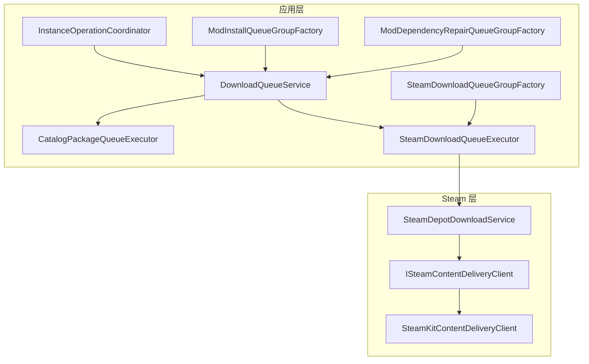
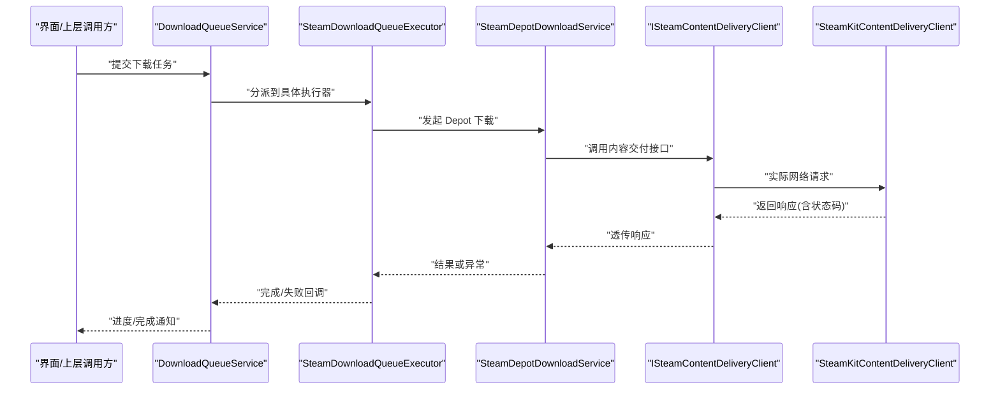
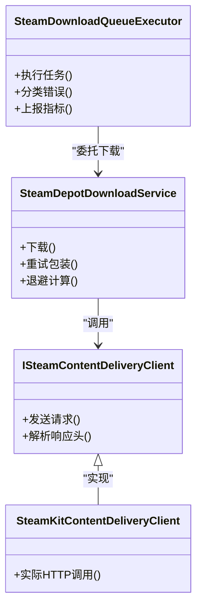
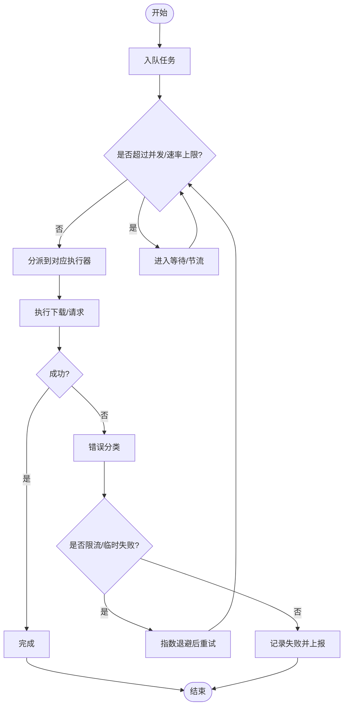

# Steam API 限流问题

<cite>
**本文引用的文件**   
- [SteamDownloadQueueExecutor.cs](file://src/Crystalfly.App/Downloads/SteamDownloadQueueExecutor.cs)
- [CatalogPackageQueueExecutor.cs](file://src/Crystalfly.App/Downloads/CatalogPackageQueueExecutor.cs)
- [DownloadQueueService.cs](file://src/Crystalfly.App/Downloads/DownloadQueueService.cs)
- [IDownloadQueueExecutor.cs](file://src/Crystalfly.App/Downloads/IDownloadQueueExecutor.cs)
- [InstanceOperationCoordinator.cs](file://src/Crystalfly.App/Downloads/InstanceOperationCoordinator.cs)
- [ModInstallQueueGroupFactory.cs](file://src/Crystalfly.App/Downloads/ModInstallQueueGroupFactory.cs)
- [ModDependencyRepairQueueGroupFactory.cs](file://src/Crystalfly.App/Downloads/ModDependencyRepairQueueGroupFactory.cs)
- [SteamDownloadQueueGroupFactory.cs](file://src/Crystalfly.App/Downloads/SteamDownloadQueueGroupFactory.cs)
- [SteamDepotDownloadService.cs](file://src/Crystalfly.Steam/Downloads/SteamDepotDownloadService.cs)
- [ISteamContentDeliveryClient.cs](file://src/Crystalfly.Steam/Downloads/ISteamContentDeliveryClient.cs)
- [SteamKitContentDeliveryClient.cs](file://src/Crystalfly.Steam/Downloads/SteamKitContentDeliveryClient.cs)
- [CrystalflySettings.cs](file://src/Crystalfly.Core/Configuration/CrystalflySettings.cs)
</cite>

## 目录
1. [简介](#简介)
2. [项目结构](#项目结构)
3. [核心组件](#核心组件)
4. [架构总览](#架构总览)
5. [详细组件分析](#详细组件分析)
6. [依赖关系分析](#依赖关系分析)
7. [性能与限流优化](#性能与限流优化)
8. [故障排查指南](#故障排查指南)
9. [结论](#结论)
10. [附录](#附录)

## 简介
本指南聚焦 Crystalfly 中与 Steam Web API 相关的请求频率限制与速率控制，目标是帮助开发者识别、避免和恢复由限流引起的失败。文档涵盖：
- Steam Web API 的常见限流信号与端点差异
- 重试策略与指数退避算法的实现要点
- 限流检测与自动恢复的最佳实践
- 批量操作与缓存等优化手段
- 监控与日志分析方法，用于提前发现潜在限流风险

说明：当前仓库未包含直接调用 Steam Web API 的代码实现；本文基于下载队列与内容交付客户端的职责划分，给出面向“Steam Web API 限流”的可落地方案与集成建议。

## 项目结构
与 Steam 下载与内容交付相关的关键路径位于以下模块：
- 应用层下载编排：App/Downloads 下的队列执行器、服务与协调器
- Steam 层内容交付：Steam/Downloads 下的 Depot 下载服务与内容交付客户端
- 配置中心：Core/Configuration 下的设置项（可用于调节并发与退避参数）

图表来源
- [DownloadQueueService.cs](file://src/Crystalfly.App/Downloads/DownloadQueueService.cs)
- [CatalogPackageQueueExecutor.cs](file://src/Crystalfly.App/Downloads/CatalogPackageQueueExecutor.cs)
- [SteamDownloadQueueExecutor.cs](file://src/Crystalfly.App/Downloads/SteamDownloadQueueExecutor.cs)
- [InstanceOperationCoordinator.cs](file://src/Crystalfly.App/Downloads/InstanceOperationCoordinator.cs)
- [ModInstallQueueGroupFactory.cs](file://src/Crystalfly.App/Downloads/ModInstallQueueGroupFactory.cs)
- [ModDependencyRepairQueueGroupFactory.cs](file://src/Crystalfly.App/Downloads/ModDependencyRepairQueueGroupFactory.cs)
- [SteamDownloadQueueGroupFactory.cs](file://src/Crystalfly.App/Downloads/SteamDownloadQueueGroupFactory.cs)
- [SteamDepotDownloadService.cs](file://src/Crystalfly.Steam/Downloads/SteamDepotDownloadService.cs)
- [ISteamContentDeliveryClient.cs](file://src/Crystalfly.Steam/Downloads/ISteamContentDeliveryClient.cs)
- [SteamKitContentDeliveryClient.cs](file://src/Crystalfly.Steam/Downloads/SteamKitContentDeliveryClient.cs)

章节来源
- [DownloadQueueService.cs](file://src/Crystalfly.App/Downloads/DownloadQueueService.cs)
- [SteamDownloadQueueExecutor.cs](file://src/Crystalfly.App/Downloads/SteamDownloadQueueExecutor.cs)
- [SteamDepotDownloadService.cs](file://src/Crystalfly.Steam/Downloads/SteamDepotDownloadService.cs)
- [ISteamContentDeliveryClient.cs](file://src/Crystalfly.Steam/Downloads/ISteamContentDeliveryClient.cs)
- [SteamKitContentDeliveryClient.cs](file://src/Crystalfly.Steam/Downloads/SteamKitContentDeliveryClient.cs)
- [CrystalflySettings.cs](file://src/Crystalfly.Core/Configuration/CrystalflySettings.cs)

## 核心组件
- DownloadQueueService：统一调度下载任务，聚合多个执行器的结果，适合在此集中注入限流与重试策略。
- CatalogPackageQueueExecutor：处理目录包下载任务，可能涉及元数据或清单获取，需关注对 Steam Web API 的间接调用。
- SteamDownloadQueueExecutor：面向 Steam 内容的下载执行器，通常通过 SteamDepotDownloadService 发起实际下载。
- SteamDepotDownloadService：封装 Depot 下载流程，是触发网络 I/O 的关键入口，适合放置幂等重试与退避逻辑。
- ISteamContentDeliveryClient / SteamKitContentDeliveryClient：内容交付抽象与实际实现，若底层使用 HTTP 访问 Steam Web API，应在此处进行响应码解析与限流处理。
- InstanceOperationCoordinator：实例级操作协调者，可结合全局并发上限与队列背压，降低瞬时峰值。
- ModInstallQueueGroupFactory / ModDependencyRepairQueueGroupFactory / SteamDownloadQueueGroupFactory：按场景分组创建队列执行器，便于针对不同端点或业务域实施差异化限流策略。

章节来源
- [DownloadQueueService.cs](file://src/Crystalfly.App/Downloads/DownloadQueueService.cs)
- [CatalogPackageQueueExecutor.cs](file://src/Crystalfly.App/Downloads/CatalogPackageQueueExecutor.cs)
- [SteamDownloadQueueExecutor.cs](file://src/Crystalfly.App/Downloads/SteamDownloadQueueExecutor.cs)
- [SteamDepotDownloadService.cs](file://src/Crystalfly.Steam/Downloads/SteamDepotDownloadService.cs)
- [ISteamContentDeliveryClient.cs](file://src/Crystalfly.Steam/Downloads/ISteamContentDeliveryClient.cs)
- [SteamKitContentDeliveryClient.cs](file://src/Crystalfly.Steam/Downloads/SteamKitContentDeliveryClient.cs)
- [InstanceOperationCoordinator.cs](file://src/Crystalfly.App/Downloads/InstanceOperationCoordinator.cs)
- [ModInstallQueueGroupFactory.cs](file://src/Crystalfly.App/Downloads/ModInstallQueueGroupFactory.cs)
- [ModDependencyRepairQueueGroupFactory.cs](file://src/Crystalfly.App/Downloads/ModDependencyRepairQueueGroupFactory.cs)
- [SteamDownloadQueueGroupFactory.cs](file://src/Crystalfly.App/Downloads/SteamDownloadQueueGroupFactory.cs)

## 架构总览
下图展示从应用层到 Steam 层的调用链，以及限流与重试的推荐落点。

图表来源
- [DownloadQueueService.cs](file://src/Crystalfly.App/Downloads/DownloadQueueService.cs)
- [SteamDownloadQueueExecutor.cs](file://src/Crystalfly.App/Downloads/SteamDownloadQueueExecutor.cs)
- [SteamDepotDownloadService.cs](file://src/Crystalfly.Steam/Downloads/SteamDepotDownloadService.cs)
- [ISteamContentDeliveryClient.cs](file://src/Crystalfly.Steam/Downloads/ISteamContentDeliveryClient.cs)
- [SteamKitContentDeliveryClient.cs](file://src/Crystalfly.Steam/Downloads/SteamKitContentDeliveryClient.cs)

## 详细组件分析

### 组件 A：Steam 下载执行链路（限流与重试落点）
- 职责边界
  - SteamDownloadQueueExecutor：将队列任务映射为具体的 Steam 下载动作，负责错误分类与上报。
  - SteamDepotDownloadService：封装 Depot 下载流程，是重试与退避的核心位置。
  - ISteamContentDeliveryClient / SteamKitContentDeliveryClient：承载实际网络交互，适合解析响应头中的限速信息并转换为领域异常。

- 推荐实现要点
  - 在 SteamDepotDownloadService 中实现带指数退避的重试包装器，针对“临时性失败”（如 429、5xx、超时）进行重试。
  - 在 ISteamContentDeliveryClient 中解析服务端返回的速率限制指示（例如 Retry-After），将其作为最小等待时间参与退避计算。
  - 在 SteamDownloadQueueExecutor 中对不同端点/资源类型进行分类统计，输出限流指标。

图表来源
- [SteamDownloadQueueExecutor.cs](file://src/Crystalfly.App/Downloads/SteamDownloadQueueExecutor.cs)
- [SteamDepotDownloadService.cs](file://src/Crystalfly.Steam/Downloads/SteamDepotDownloadService.cs)
- [ISteamContentDeliveryClient.cs](file://src/Crystalfly.Steam/Downloads/ISteamContentDeliveryClient.cs)
- [SteamKitContentDeliveryClient.cs](file://src/Crystalfly.Steam/Downloads/SteamKitContentDeliveryClient.cs)

章节来源
- [SteamDownloadQueueExecutor.cs](file://src/Crystalfly.App/Downloads/SteamDownloadQueueExecutor.cs)
- [SteamDepotDownloadService.cs](file://src/Crystalfly.Steam/Downloads/SteamDepotDownloadService.cs)
- [ISteamContentDeliveryClient.cs](file://src/Crystalfly.Steam/Downloads/ISteamContentDeliveryClient.cs)
- [SteamKitContentDeliveryClient.cs](file://src/Crystalfly.Steam/Downloads/SteamKitContentDeliveryClient.cs)

### 组件 B：队列与并发控制（避免突发流量）
- 职责边界
  - DownloadQueueService：统一入队、出队与聚合结果，适合在此设置全局并发上限与背压。
  - 各类 QueueGroupFactory：按场景创建执行器，便于对不同业务域（安装、修复、Steam 下载）分别限流。
  - InstanceOperationCoordinator：协调实例级操作，避免多实例同时高并发导致整体限流。

- 推荐实现要点
  - 在 DownloadQueueService 中引入令牌桶或滑动窗口计数器，限制单位时间内最大请求数。
  - 使用工厂模式为不同端点/资源类型分配独立限流器，避免相互干扰。
  - 在 InstanceOperationCoordinator 中根据实例数量动态调整全局并发度。

图表来源
- [DownloadQueueService.cs](file://src/Crystalfly.App/Downloads/DownloadQueueService.cs)
- [ModInstallQueueGroupFactory.cs](file://src/Crystalfly.App/Downloads/ModInstallQueueGroupFactory.cs)
- [ModDependencyRepairQueueGroupFactory.cs](file://src/Crystalfly.App/Downloads/ModDependencyRepairQueueGroupFactory.cs)
- [SteamDownloadQueueGroupFactory.cs](file://src/Crystalfly.App/Downloads/SteamDownloadQueueGroupFactory.cs)
- [InstanceOperationCoordinator.cs](file://src/Crystalfly.App/Downloads/InstanceOperationCoordinator.cs)

章节来源
- [DownloadQueueService.cs](file://src/Crystalfly.App/Downloads/DownloadQueueService.cs)
- [ModInstallQueueGroupFactory.cs](file://src/Crystalfly.App/Downloads/ModInstallQueueGroupFactory.cs)
- [ModDependencyRepairQueueGroupFactory.cs](file://src/Crystalfly.App/Downloads/ModDependencyRepairQueueGroupFactory.cs)
- [SteamDownloadQueueGroupFactory.cs](file://src/Crystalfly.App/Downloads/SteamDownloadQueueGroupFactory.cs)
- [InstanceOperationCoordinator.cs](file://src/Crystalfly.App/Downloads/InstanceOperationCoordinator.cs)

### 组件 C：配置与可调参数
- 建议暴露的配置项（示例，非现有代码）
  - max_concurrent_requests：全局最大并发请求数
  - rate_limit_per_second：每秒最大请求数
  - retry_max_attempts：最大重试次数
  - retry_base_delay_ms：退避基础延迟
  - retry_backoff_multiplier：退避倍数
  - retry_jitter_ms：抖动范围
  - per_endpoint_limits：按端点的限流策略（如认证、清单、内容分发）
- 配置存储位置
  - 可在 CrystalflySettings 中新增相应字段，并在各组件初始化时读取。

章节来源
- [CrystalflySettings.cs](file://src/Crystalfly.Core/Configuration/CrystalflySettings.cs)

## 依赖关系分析
- 耦合关系
  - 应用层通过 DownloadQueueService 统一编排，降低与具体执行器的耦合。
  - Steam 层通过 ISteamContentDeliveryClient 抽象，便于替换实现与注入限流/重试横切逻辑。
- 外部依赖
  - SteamKitContentDeliveryClient 可能依赖第三方库进行网络通信，需在适配层屏蔽其细节并统一错误模型。

图表来源
- [DownloadQueueService.cs](file://src/Crystalfly.App/Downloads/DownloadQueueService.cs)
- [SteamDownloadQueueExecutor.cs](file://src/Crystalfly.App/Downloads/SteamDownloadQueueExecutor.cs)
- [SteamDepotDownloadService.cs](file://src/Crystalfly.Steam/Downloads/SteamDepotDownloadService.cs)
- [ISteamContentDeliveryClient.cs](file://src/Crystalfly.Steam/Downloads/ISteamContentDeliveryClient.cs)
- [SteamKitContentDeliveryClient.cs](file://src/Crystalfly.Steam/Downloads/SteamKitContentDeliveryClient.cs)

章节来源
- [DownloadQueueService.cs](file://src/Crystalfly.App/Downloads/DownloadQueueService.cs)
- [SteamDownloadQueueExecutor.cs](file://src/Crystalfly.App/Downloads/SteamDownloadQueueExecutor.cs)
- [SteamDepotDownloadService.cs](file://src/Crystalfly.Steam/Downloads/SteamDepotDownloadService.cs)
- [ISteamContentDeliveryClient.cs](file://src/Crystalfly.Steam/Downloads/ISteamContentDeliveryClient.cs)
- [SteamKitContentDeliveryClient.cs](file://src/Crystalfly.Steam/Downloads/SteamKitContentDeliveryClient.cs)

## 性能与限流优化
- 请求模式优化
  - 合并小请求：将多次小请求合并为批量请求，减少握手与鉴权开销。
  - 预取与缓存：对不频繁变化的元数据（如清单、版本信息）做本地缓存，设置合理过期策略。
  - 错峰调度：将高负载任务分散到非高峰时段执行。
- 并发与速率控制
  - 令牌桶/滑动窗口：在 DownloadQueueService 中实现全局速率限制，避免突发流量。
  - 端点隔离：为不同端点分配独立限流器，防止热点端点影响其他功能。
- 重试与退避
  - 指数退避：delay = base * multiplier^attempt + jitter，限制最大尝试次数。
  - 尊重服务端提示：优先使用 Retry-After 或类似头部指示的最小等待时间。
  - 幂等性：确保重试不会造成副作用（如重复写入）。
- 监控与告警
  - 关键指标：请求成功率、429/5xx 比例、平均/分位延迟、退避触发次数、队列积压长度。
  - 采样与采样窗口：采用滑动窗口统计，避免长尾波动影响判断。
  - 告警阈值：当 429 占比超过阈值或连续失败达到一定次数时触发告警。

[本节为通用指导，无需源码引用]

## 故障排查指南
- 快速定位
  - 检查 DownloadQueueService 的指标输出，确认是否为全局并发过高导致的限流。
  - 查看 SteamDepotDownloadService 的重试日志，确认是否频繁触发指数退避。
  - 在 ISteamContentDeliveryClient 层捕获并打印响应头，确认是否存在 Retry-After 或速率限制标识。
- 常见问题
  - 并发过大：适当降低 max_concurrent_requests 或 rate_limit_per_second。
  - 未实现退避：为临时性错误增加指数退避与抖动，避免雪崩。
  - 缓存缺失：对静态或低频变更数据启用缓存，减少重复请求。
- 恢复策略
  - 自动降级：在持续限流时暂停非关键任务，保留核心下载。
  - 优雅退出：在用户主动停止或系统关机前，保存队列状态以便恢复。

章节来源
- [DownloadQueueService.cs](file://src/Crystalfly.App/Downloads/DownloadQueueService.cs)
- [SteamDepotDownloadService.cs](file://src/Crystalfly.Steam/Downloads/SteamDepotDownloadService.cs)
- [ISteamContentDeliveryClient.cs](file://src/Crystalfly.Steam/Downloads/ISteamContentDeliveryClient.cs)

## 结论
通过在应用层集中限流与重试、在 Steam 层细化端点策略，并结合缓存与监控，可有效降低 Steam Web API 限流带来的影响。建议在 DownloadQueueService 与 SteamDepotDownloadService 中优先落地指数退避与速率控制，同时在 ISteamContentDeliveryClient 层完善响应头解析与错误分类，形成端到端的限流治理闭环。

[本节为总结，无需源码引用]

## 附录
- 术语
  - 指数退避：等待时间随重试次数呈指数增长，并加入随机抖动以避免同步风暴。
  - 令牌桶：以固定速率生成令牌，请求需消耗令牌才能执行，超出则排队或拒绝。
  - 滑动窗口：在固定时间窗口内统计事件发生次数，用于速率限制与指标计算。
- 参考实现位置（建议）
  - 重试与退避：SteamDepotDownloadService
  - 限流与并发：DownloadQueueService
  - 响应解析与错误分类：ISteamContentDeliveryClient / SteamKitContentDeliveryClient
  - 配置项：CrystalflySettings

[本节为补充说明，无需源码引用]