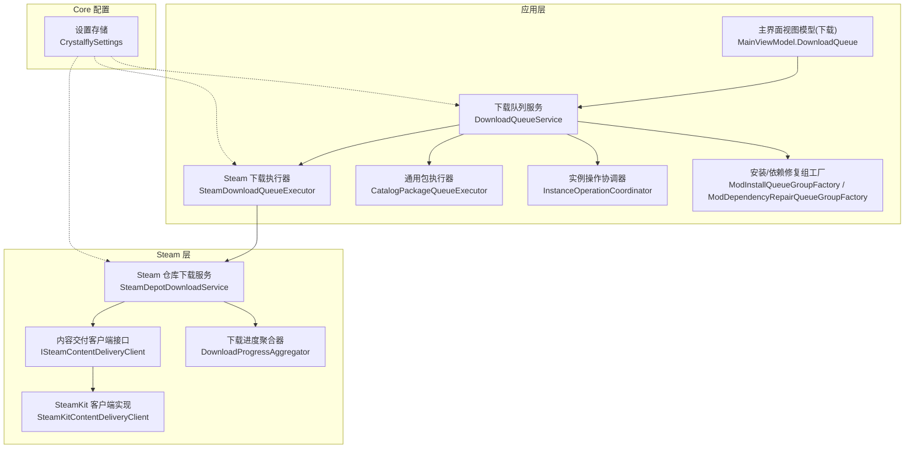
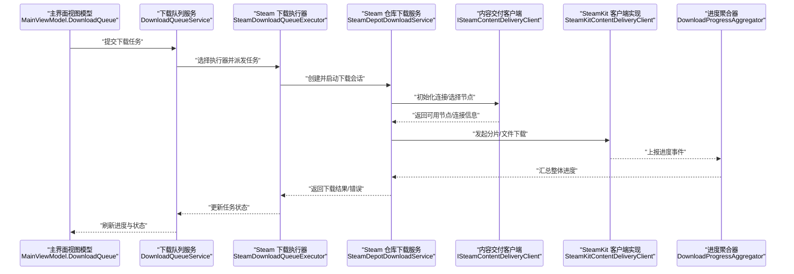
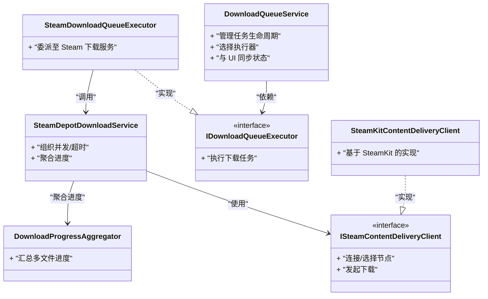

# Steam 下载问题

<cite>
**本文引用的文件**   
- [SteamDownloadQueueExecutor.cs](file://src/Crystalfly.App/Downloads/SteamDownloadQueueExecutor.cs)
- [DownloadQueueService.cs](file://src/Crystalfly.App/Downloads/DownloadQueueService.cs)
- [IDownloadQueueExecutor.cs](file://src/Crystalfly.App/Downloads/IDownloadQueueExecutor.cs)
- [CatalogPackageQueueExecutor.cs](file://src/Crystalfly.App/Downloads/CatalogPackageQueueExecutor.cs)
- [ModInstallQueueGroupFactory.cs](file://src/Crystalfly.App/Downloads/ModInstallQueueGroupFactory.cs)
- [ModDependencyRepairQueueGroupFactory.cs](file://src/Crystalfly.App/Downloads/ModDependencyRepairQueueGroupFactory.cs)
- [InstanceOperationCoordinator.cs](file://src/Crystalfly.App/Downloads/InstanceOperationCoordinator.cs)
- [MainViewModel.DownloadQueue.cs](file://src/Crystalfly.App/ViewModels/MainViewModel.DownloadQueue.cs)
- [SteamDepotDownloadService.cs](file://src/Crystalfly.Steam/Downloads/SteamDepotDownloadService.cs)
- [ISteamContentDeliveryClient.cs](file://src/Crystalfly.Steam/Downloads/ISteamContentDeliveryClient.cs)
- [SteamKitContentDeliveryClient.cs](file://src/Crystalfly.Steam/Downloads/SteamKitContentDeliveryClient.cs)
- [DownloadProgressAggregator.cs](file://src/Crystalfly.Steam/Downloads/DownloadProgressAggregator.cs)
- [CrystalflySettings.cs](file://src/Crystalfly.Core/Configuration/CrystalflySettings.cs)
</cite>

## 目录
1. [简介](#简介)
2. [项目结构](#项目结构)
3. [核心组件](#核心组件)
4. [架构总览](#架构总览)
5. [详细组件分析](#详细组件分析)
6. [依赖关系分析](#依赖关系分析)
7. [性能考虑](#性能考虑)
8. [故障排除指南](#故障排除指南)
9. [结论](#结论)

## 简介
本指南聚焦 Crystalfly 在使用 Steam 进行内容下载时可能遇到的典型问题，包括 CDN 连接失败、下载队列阻塞与任务卡住、磁盘空间不足与权限异常、大文件断点续传恢复、以及进度监控与性能调优。文档基于源码中的下载队列与 Steam 客户端实现，提供可操作的诊断步骤与修复建议，帮助快速定位并解决问题。

## 项目结构
与 Steam 下载相关的关键代码分布在应用层（App）与 Steam 集成层（Steam），并通过 Core 配置模块暴露设置项：
- 应用层负责下载队列编排、任务分组与 UI 展示
- Steam 层封装 Steam 内容分发客户端与进度聚合
- Core 层提供路径与设置访问

图表来源
- [DownloadQueueService.cs](file://src/Crystalfly.App/Downloads/DownloadQueueService.cs)
- [SteamDownloadQueueExecutor.cs](file://src/Crystalfly.App/Downloads/SteamDownloadQueueExecutor.cs)
- [CatalogPackageQueueExecutor.cs](file://src/Crystalfly.App/Downloads/CatalogPackageQueueExecutor.cs)
- [InstanceOperationCoordinator.cs](file://src/Crystalfly.App/Downloads/InstanceOperationCoordinator.cs)
- [ModInstallQueueGroupFactory.cs](file://src/Crystalfly.App/Downloads/ModInstallQueueGroupFactory.cs)
- [ModDependencyRepairQueueGroupFactory.cs](file://src/Crystalfly.App/Downloads/ModDependencyRepairQueueGroupFactory.cs)
- [MainViewModel.DownloadQueue.cs](file://src/Crystalfly.App/ViewModels/MainViewModel.DownloadQueue.cs)
- [SteamDepotDownloadService.cs](file://src/Crystalfly.Steam/Downloads/SteamDepotDownloadService.cs)
- [ISteamContentDeliveryClient.cs](file://src/Crystalfly.Steam/Downloads/ISteamContentDeliveryClient.cs)
- [SteamKitContentDeliveryClient.cs](file://src/Crystalfly.Steam/Downloads/SteamKitContentDeliveryClient.cs)
- [DownloadProgressAggregator.cs](file://src/Crystalfly.Steam/Downloads/DownloadProgressAggregator.cs)
- [CrystalflySettings.cs](file://src/Crystalfly.Core/Configuration/CrystalflySettings.cs)

章节来源
- [DownloadQueueService.cs](file://src/Crystalfly.App/Downloads/DownloadQueueService.cs)
- [SteamDownloadQueueExecutor.cs](file://src/Crystalfly.App/Downloads/SteamDownloadQueueExecutor.cs)
- [SteamDepotDownloadService.cs](file://src/Crystalfly.Steam/Downloads/SteamDepotDownloadService.cs)
- [ISteamContentDeliveryClient.cs](file://src/Crystalfly.Steam/Downloads/ISteamContentDeliveryClient.cs)
- [SteamKitContentDeliveryClient.cs](file://src/Crystalfly.Steam/Downloads/SteamKitContentDeliveryClient.cs)
- [DownloadProgressAggregator.cs](file://src/Crystalfly.Steam/Downloads/DownloadProgressAggregator.cs)
- [CrystalflySettings.cs](file://src/Crystalfly.Core/Configuration/CrystalflySettings.cs)

## 核心组件
- 下载队列服务：统一调度下载任务，管理任务状态、重试与错误传播，并与 UI 同步进度。
- Steam 下载执行器：将队列任务委派给 Steam 仓库下载服务，处理 Steam 特定参数与结果映射。
- Steam 仓库下载服务：封装对 Steam 内容分发客户端的调用，组织并发、超时与进度上报。
- 内容交付客户端接口与实现：抽象不同底层传输方式，当前由 SteamKit 客户端实现。
- 下载进度聚合器：汇总多文件/分片进度，向上传递整体完成度。
- 设置存储：提供并发控制、带宽限制等可调参数入口。

章节来源
- [DownloadQueueService.cs](file://src/Crystalfly.App/Downloads/DownloadQueueService.cs)
- [SteamDownloadQueueExecutor.cs](file://src/Crystalfly.App/Downloads/SteamDownloadQueueExecutor.cs)
- [SteamDepotDownloadService.cs](file://src/Crystalfly.Steam/Downloads/SteamDepotDownloadService.cs)
- [ISteamContentDeliveryClient.cs](file://src/Crystalfly.Steam/Downloads/ISteamContentDeliveryClient.cs)
- [SteamKitContentDeliveryClient.cs](file://src/Crystalfly.Steam/Downloads/SteamKitContentDeliveryClient.cs)
- [DownloadProgressAggregator.cs](file://src/Crystalfly.Steam/Downloads/DownloadProgressAggregator.cs)
- [CrystalflySettings.cs](file://src/Crystalfly.Core/Configuration/CrystalflySettings.cs)

## 架构总览
以下序列图展示了从 UI 触发到 Steam 实际下载的端到端流程，便于理解各层职责与数据流向。

图表来源
- [MainViewModel.DownloadQueue.cs](file://src/Crystalfly.App/ViewModels/MainViewModel.DownloadQueue.cs)
- [DownloadQueueService.cs](file://src/Crystalfly.App/Downloads/DownloadQueueService.cs)
- [SteamDownloadQueueExecutor.cs](file://src/Crystalfly.App/Downloads/SteamDownloadQueueExecutor.cs)
- [SteamDepotDownloadService.cs](file://src/Crystalfly.Steam/Downloads/SteamDepotDownloadService.cs)
- [ISteamContentDeliveryClient.cs](file://src/Crystalfly.Steam/Downloads/ISteamContentDeliveryClient.cs)
- [SteamKitContentDeliveryClient.cs](file://src/Crystalfly.Steam/Downloads/SteamKitContentDeliveryClient.cs)
- [DownloadProgressAggregator.cs](file://src/Crystalfly.Steam/Downloads/DownloadProgressAggregator.cs)

## 详细组件分析

### 下载队列服务与执行器
- 职责
  - 维护任务生命周期：入队、出队、重试、取消、完成。
  - 根据任务类型选择执行器（如 Steam 下载执行器）。
  - 与 UI 同步状态与进度，支持批量操作与分组显示。
- 关键交互
  - 通过工厂或策略模式选择具体执行器。
  - 与实例操作协调器协作，确保在正确实例上下文中执行。
- 常见问题定位
  - 任务长时间处于“排队”或“运行中”无进展：检查执行器是否成功派发任务、是否存在上游依赖未就绪。
  - 频繁重试：关注网络错误码与重试策略上限。

章节来源
- [DownloadQueueService.cs](file://src/Crystalfly.App/Downloads/DownloadQueueService.cs)
- [SteamDownloadQueueExecutor.cs](file://src/Crystalfly.App/Downloads/SteamDownloadQueueExecutor.cs)
- [IDownloadQueueExecutor.cs](file://src/Crystalfly.App/Downloads/IDownloadQueueExecutor.cs)
- [InstanceOperationCoordinator.cs](file://src/Crystalfly.App/Downloads/InstanceOperationCoordinator.cs)

### Steam 仓库下载服务与客户端
- 职责
  - 组织并发下载、超时控制、错误分类与上报。
  - 对接内容交付客户端，获取可用节点与连接参数。
  - 聚合多文件进度，驱动整体完成度计算。
- 关键交互
  - 通过接口抽象底层传输，便于替换或扩展。
  - 使用进度聚合器汇总细粒度事件为全局进度。
- 常见问题定位
  - CDN 连接失败：优先检查客户端返回的错误类型（认证、限流、路由不可达），必要时切换备用节点。
  - 进度不更新：确认进度事件是否正常上报与聚合。

章节来源
- [SteamDepotDownloadService.cs](file://src/Crystalfly.Steam/Downloads/SteamDepotDownloadService.cs)
- [ISteamContentDeliveryClient.cs](file://src/Crystalfly.Steam/Downloads/ISteamContentDeliveryClient.cs)
- [SteamKitContentDeliveryClient.cs](file://src/Crystalfly.Steam/Downloads/SteamKitContentDeliveryClient.cs)
- [DownloadProgressAggregator.cs](file://src/Crystalfly.Steam/Downloads/DownloadProgressAggregator.cs)

### 设置与配置
- 作用
  - 提供并发控制、带宽限制、超时等可调参数。
  - 影响下载执行器的行为与资源占用。
- 常见调整
  - 降低并发数以缓解服务器限流或本地 IO 瓶颈。
  - 设置合理的带宽上限以避免影响其他网络活动。

章节来源
- [CrystalflySettings.cs](file://src/Crystalfly.Core/Configuration/CrystalflySettings.cs)

## 依赖关系分析
- 松耦合设计
  - 下载执行器通过接口与队列服务解耦，便于扩展新的下载源。
  - 内容交付客户端通过接口屏蔽底层差异，提升可测试性与可替换性。
- 潜在风险
  - 若进度聚合器或客户端实现出现异常，可能导致整体进度停滞。
  - 高并发与低带宽组合不当会引发频繁重试与超时。

图表来源
- [DownloadQueueService.cs](file://src/Crystalfly.App/Downloads/DownloadQueueService.cs)
- [IDownloadQueueExecutor.cs](file://src/Crystalfly.App/Downloads/IDownloadQueueExecutor.cs)
- [SteamDownloadQueueExecutor.cs](file://src/Crystalfly.App/Downloads/SteamDownloadQueueExecutor.cs)
- [SteamDepotDownloadService.cs](file://src/Crystalfly.Steam/Downloads/SteamDepotDownloadService.cs)
- [ISteamContentDeliveryClient.cs](file://src/Crystalfly.Steam/Downloads/ISteamContentDeliveryClient.cs)
- [SteamKitContentDeliveryClient.cs](file://src/Crystalfly.Steam/Downloads/SteamKitContentDeliveryClient.cs)
- [DownloadProgressAggregator.cs](file://src/Crystalfly.Steam/Downloads/DownloadProgressAggregator.cs)

## 性能考虑
- 并发控制
  - 合理设置最大并发任务数，避免触发 Steam 侧限流或造成本地 IO 争用。
- 带宽限制
  - 为下载任务设置带宽上限，平衡与其他应用的网络需求。
- 超时与重试
  - 针对间歇性网络抖动，适当放宽超时阈值并启用指数退避重试。
- 进度聚合
  - 利用进度聚合器减少 UI 刷新频率，降低渲染开销。

[本节为通用指导，无需列出具体文件来源]

## 故障排除指南

### CDN 连接失败：原因分析与解决方案
- 常见原因
  - 认证与会话过期：需重新登录或刷新令牌。
  - 区域节点不可达：CDN 节点故障或网络路由问题。
  - 服务器限流：短时间内大量请求导致临时拒绝。
- 解决步骤
  - 检查认证状态，必要时重新登录。
  - 尝试切换备用节点或等待一段时间后重试。
  - 降低并发与带宽，观察是否因限流导致失败。
  - 查看日志中的错误码与消息，定位是认证、路由还是限流问题。

章节来源
- [SteamDepotDownloadService.cs](file://src/Crystalfly.Steam/Downloads/SteamDepotDownloadService.cs)
- [ISteamContentDeliveryClient.cs](file://src/Crystalfly.Steam/Downloads/ISteamContentDeliveryClient.cs)
- [SteamKitContentDeliveryClient.cs](file://src/Crystalfly.Steam/Downloads/SteamKitContentDeliveryClient.cs)

### 下载队列阻塞与任务卡住：诊断方法
- 现象
  - 任务长期处于“排队”或“运行中”，进度无变化。
- 诊断步骤
  - 检查是否有前置任务未完成或依赖未满足。
  - 确认执行器是否正确派发任务到 Steam 下载服务。
  - 观察进度聚合器是否收到事件；若无，可能是客户端未上报。
  - 查看实例操作协调器是否阻止了任务执行（例如实例被锁定）。
- 处理建议
  - 暂停并重启队列服务，清理无效任务。
  - 重置卡住的执行器上下文，重新派发任务。
  - 若为依赖问题，先完成依赖安装或修复。

章节来源
- [DownloadQueueService.cs](file://src/Crystalfly.App/Downloads/DownloadQueueService.cs)
- [SteamDownloadQueueExecutor.cs](file://src/Crystalfly.App/Downloads/SteamDownloadQueueExecutor.cs)
- [InstanceOperationCoordinator.cs](file://src/Crystalfly.App/Downloads/InstanceOperationCoordinator.cs)
- [DownloadProgressAggregator.cs](file://src/Crystalfly.Steam/Downloads/DownloadProgressAggregator.cs)

### 手动清理与重启下载服务
- 清理步骤
  - 停止所有正在进行的下载任务。
  - 移除无效或损坏的任务记录。
  - 清理临时下载目录中的不完整文件。
- 重启步骤
  - 重新启动下载队列服务。
  - 重新提交需要下载的任务，观察是否能正常推进。

章节来源
- [DownloadQueueService.cs](file://src/Crystalfly.App/Downloads/DownloadQueueService.cs)
- [SteamDownloadQueueExecutor.cs](file://src/Crystalfly.App/Downloads/SteamDownloadQueueExecutor.cs)

### 磁盘空间不足与权限问题：检测与修复
- 检测
  - 检查目标磁盘剩余空间是否满足下载需求。
  - 验证写入目录的权限是否允许当前用户写入。
- 修复
  - 释放磁盘空间或删除无用文件。
  - 修正目录权限，确保应用具有读写权限。
  - 更换下载路径到空间充足且权限正确的目录。

章节来源
- [CrystalflySettings.cs](file://src/Crystalfly.Core/Configuration/CrystalflySettings.cs)

### 大文件下载的断点续传机制与恢复方法
- 机制说明
  - 按分片或文件维度记录已下载字节范围。
  - 遇到中断后，从上次断点继续下载，避免重复传输。
- 恢复方法
  - 若任务失败但保留部分文件，直接重试即可续传。
  - 若临时文件损坏，删除对应临时文件后重新提交任务。
  - 检查进度聚合器是否仍能识别已有片段。

章节来源
- [SteamDepotDownloadService.cs](file://src/Crystalfly.Steam/Downloads/SteamDepotDownloadService.cs)
- [DownloadProgressAggregator.cs](file://src/Crystalfly.Steam/Downloads/DownloadProgressAggregator.cs)

### 下载进度监控与性能调优建议
- 监控
  - 通过主界面视图模型观察任务状态与整体进度。
  - 关注进度聚合器的事件频率与数值变化。
- 调优
  - 降低并发数以减少服务器压力与本地 IO 竞争。
  - 设置带宽上限，避免影响其他网络活动。
  - 调整超时与重试策略，适应不稳定网络环境。

章节来源
- [MainViewModel.DownloadQueue.cs](file://src/Crystalfly.App/ViewModels/MainViewModel.DownloadQueue.cs)
- [DownloadProgressAggregator.cs](file://src/Crystalfly.Steam/Downloads/DownloadProgressAggregator.cs)
- [CrystalflySettings.cs](file://src/Crystalfly.Core/Configuration/CrystalflySettings.cs)

## 结论
通过对下载队列、Steam 下载服务与客户端接口的分层设计与清晰职责划分，Crystalfly 能够较为稳健地处理 Steam 内容下载过程中的各类问题。结合本文提供的故障排除步骤与性能调优建议，用户可以快速定位并解决 CDN 连接失败、队列阻塞、磁盘与权限异常、断点续传恢复等问题，同时获得更稳定的下载体验。