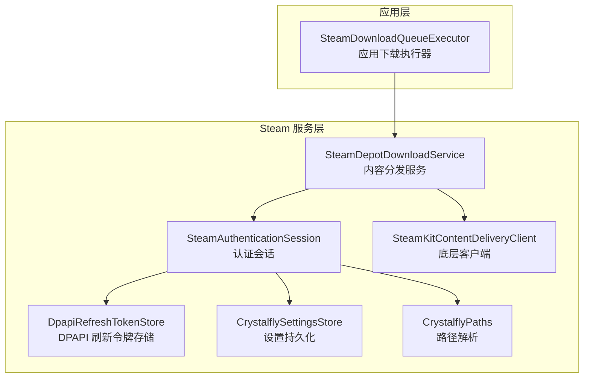
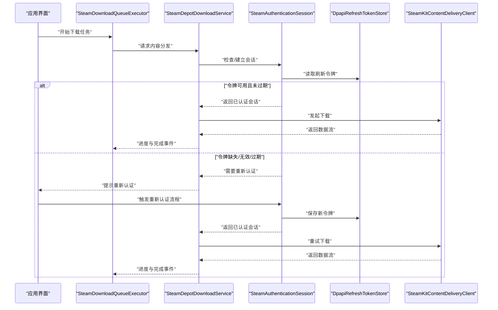
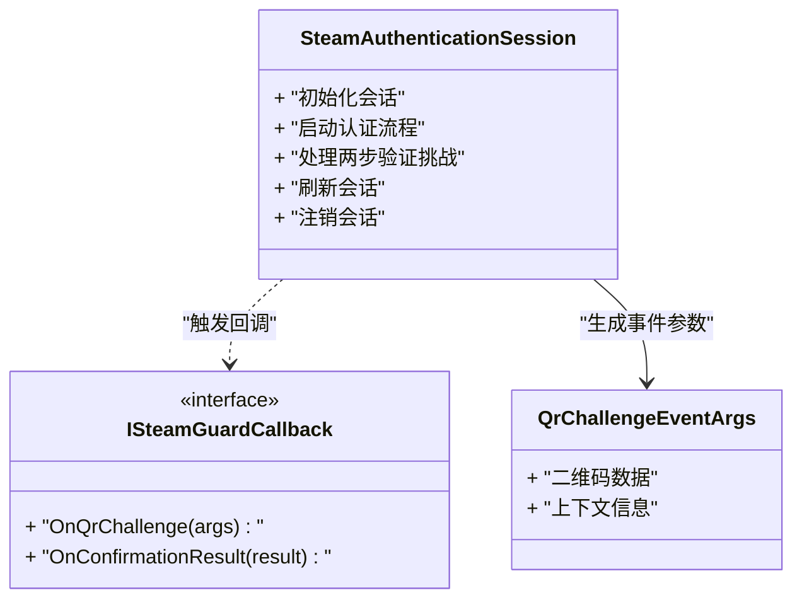
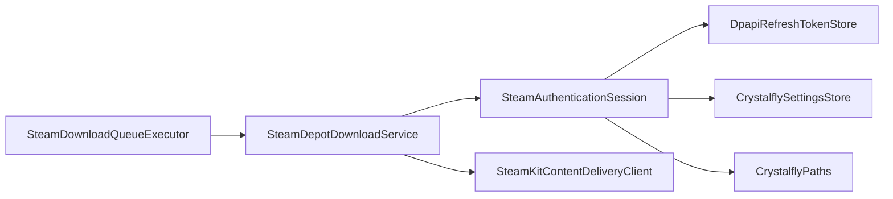
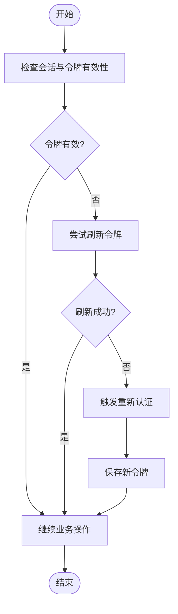

# Steam 认证问题

<cite>
**本文引用的文件**   
- [SteamAuthenticationSession.cs](file://src/Crystalfly.Steam/Authentication/SteamAuthenticationSession.cs)
- [ISteamGuardCallback.cs](file://src/Crystalfly.Steam/Authentication/ISteamGuardCallback.cs)
- [QrChallengeEventArgs.cs](file://src/Crystalfly.Steam/Authentication/QrChallengeEventArgs.cs)
- [DpapiRefreshTokenStore.cs](file://src/Crystalfly.Steam/Security/DpapiRefreshTokenStore.cs)
- [RefreshTokenCredential.cs](file://src/Crystalfly.Steam/Security/RefreshTokenCredential.cs)
- [CrystalflySettingsStore.cs](file://src/Crystalfly.Core/Configuration/CrystalflySettingsStore.cs)
- [CrystalflyPaths.cs](file://src/Crystalfly.Core/Configuration/CrystalflyPaths.cs)
- [SteamDownloadQueueExecutor.cs](file://src/Crystalfly.App/Downloads/SteamDownloadQueueExecutor.cs)
- [SteamDepotDownloadService.cs](file://src/Crystalfly.Steam/Downloads/SteamDepotDownloadService.cs)
- [SteamKitContentDeliveryClient.cs](file://src/Crystalfly.Steam/Downloads/SteamKitContentDeliveryClient.cs)
</cite>

## 目录
1. [简介](#简介)
2. [项目结构](#项目结构)
3. [核心组件](#核心组件)
4. [架构总览](#架构总览)
5. [详细组件分析](#详细组件分析)
6. [依赖关系分析](#依赖关系分析)
7. [性能与稳定性考虑](#性能与稳定性考虑)
8. [故障排除指南](#故障排除指南)
9. [结论](#结论)
10. [附录](#附录)

## 简介
本指南聚焦 Crystalfly 在使用 Steam 认证过程中可能遇到的典型问题，包括两步验证失败、Steam Guard 二维码生成与确认流程异常、会话过期与令牌失效、DPAPI 令牌存储损坏、网络超时与连接失败等。文档提供原因分析、定位步骤、修复流程以及日志分析方法，帮助用户快速恢复认证能力并稳定运行。

## 项目结构
与 Steam 认证相关的代码主要分布在以下模块：
- 认证与会话管理：位于 Crystalfly.Steam/Authentication
- 令牌安全存储：位于 Crystalfly.Steam/Security
- 配置与路径：位于 Crystalfly.Core/Configuration
- 下载与内容分发（需要有效会话）：位于 Crystalfly.Steam/Downloads 与 Crystalfly.App/Downloads

图表来源
- [SteamDownloadQueueExecutor.cs:1-200](file://src/Crystalfly.App/Downloads/SteamDownloadQueueExecutor.cs#L1-L200)
- [SteamDepotDownloadService.cs:1-200](file://src/Crystalfly.Steam/Downloads/SteamDepotDownloadService.cs#L1-L200)
- [SteamKitContentDeliveryClient.cs:1-200](file://src/Crystalfly.Steam/Downloads/SteamKitContentDeliveryClient.cs#L1-L200)
- [SteamAuthenticationSession.cs:1-200](file://src/Crystalfly.Steam/Authentication/SteamAuthenticationSession.cs#L1-L200)
- [DpapiRefreshTokenStore.cs:1-200](file://src/Crystalfly.Steam/Security/DpapiRefreshTokenStore.cs#L1-L200)
- [CrystalflySettingsStore.cs:1-200](file://src/Crystalfly.Core/Configuration/CrystalflySettingsStore.cs#L1-L200)
- [CrystalflyPaths.cs:1-200](file://src/Crystalfly.Core/Configuration/CrystalflyPaths.cs#L1-L200)

章节来源
- [SteamDownloadQueueExecutor.cs:1-200](file://src/Crystalfly.App/Downloads/SteamDownloadQueueExecutor.cs#L1-L200)
- [SteamDepotDownloadService.cs:1-200](file://src/Crystalfly.Steam/Downloads/SteamDepotDownloadService.cs#L1-L200)
- [SteamKitContentDeliveryClient.cs:1-200](file://src/Crystalfly.Steam/Downloads/SteamKitContentDeliveryClient.cs#L1-L200)
- [SteamAuthenticationSession.cs:1-200](file://src/Crystalfly.Steam/Authentication/SteamAuthenticationSession.cs#L1-L200)
- [DpapiRefreshTokenStore.cs:1-200](file://src/Crystalfly.Steam/Security/DpapiRefreshTokenStore.cs#L1-L200)
- [CrystalflySettingsStore.cs:1-200](file://src/Crystalfly.Core/Configuration/CrystalflySettingsStore.cs#L1-L200)
- [CrystalflyPaths.cs:1-200](file://src/Crystalfly.Core/Configuration/CrystalflyPaths.cs#L1-L200)

## 核心组件
- 认证会话：负责发起登录、处理两步验证挑战、维护会话状态与回调事件。
- DPAPI 令牌存储：使用系统级加密保护刷新令牌，避免明文落盘。
- 设置与路径：提供用户数据目录、配置文件位置等基础路径解析。
- 下载服务：在需要访问受保护资源时依赖有效会话进行内容拉取。

章节来源
- [SteamAuthenticationSession.cs:1-200](file://src/Crystalfly.Steam/Authentication/SteamAuthenticationSession.cs#L1-L200)
- [ISteamGuardCallback.cs:1-200](file://src/Crystalfly.Steam/Authentication/ISteamGuardCallback.cs#L1-L200)
- [QrChallengeEventArgs.cs:1-200](file://src/Crystalfly.Steam/Authentication/QrChallengeEventArgs.cs#L1-L200)
- [DpapiRefreshTokenStore.cs:1-200](file://src/Crystalfly.Steam/Security/DpapiRefreshTokenStore.cs#L1-L200)
- [RefreshTokenCredential.cs:1-200](file://src/Crystalfly.Steam/Security/RefreshTokenCredential.cs#L1-L200)
- [CrystalflySettingsStore.cs:1-200](file://src/Crystalfly.Core/Configuration/CrystalflySettingsStore.cs#L1-L200)
- [CrystalflyPaths.cs:1-200](file://src/Crystalfly.Core/Configuration/CrystalflyPaths.cs#L1-L200)
- [SteamDepotDownloadService.cs:1-200](file://src/Crystalfly.Steam/Downloads/SteamDepotDownloadService.cs#L1-L200)

## 架构总览
下图展示了从应用触发下载到认证与会话、令牌存储及底层客户端的交互关系。当认证或令牌不可用时，下载流程会被阻断并提示重新认证。

图表来源
- [SteamDownloadQueueExecutor.cs:1-200](file://src/Crystalfly.App/Downloads/SteamDownloadQueueExecutor.cs#L1-L200)
- [SteamDepotDownloadService.cs:1-200](file://src/Crystalfly.Steam/Downloads/SteamDepotDownloadService.cs#L1-L200)
- [SteamAuthenticationSession.cs:1-200](file://src/Crystalfly.Steam/Authentication/SteamAuthenticationSession.cs#L1-L200)
- [DpapiRefreshTokenStore.cs:1-200](file://src/Crystalfly.Steam/Security/DpapiRefreshTokenStore.cs#L1-L200)
- [SteamKitContentDeliveryClient.cs:1-200](file://src/Crystalfly.Steam/Downloads/SteamKitContentDeliveryClient.cs#L1-L200)

## 详细组件分析

### 认证与会话组件
- 职责
  - 启动认证流程，处理用户名/密码输入与两步验证挑战。
  - 通过回调接口向 UI 暴露二维码与验证码输入事件。
  - 维护会话生命周期，并在必要时刷新或重建会话。
- 关键类型与关系
  - 会话类负责协调认证状态与外部依赖（存储、设置、路径）。
  - 回调接口定义二维码事件与确认回调契约。
  - 二维码事件参数封装二维码数据与上下文信息。

图表来源
- [SteamAuthenticationSession.cs:1-200](file://src/Crystalfly.Steam/Authentication/SteamAuthenticationSession.cs#L1-L200)
- [ISteamGuardCallback.cs:1-200](file://src/Crystalfly.Steam/Authentication/ISteamGuardCallback.cs#L1-L200)
- [QrChallengeEventArgs.cs:1-200](file://src/Crystalfly.Steam/Authentication/QrChallengeEventArgs.cs#L1-L200)

章节来源
- [SteamAuthenticationSession.cs:1-200](file://src/Crystalfly.Steam/Authentication/SteamAuthenticationSession.cs#L1-L200)
- [ISteamGuardCallback.cs:1-200](file://src/Crystalfly.Steam/Authentication/ISteamGuardCallback.cs#L1-L200)
- [QrChallengeEventArgs.cs:1-200](file://src/Crystalfly.Steam/Authentication/QrChallengeEventArgs.cs#L1-L200)

### 令牌安全存储组件
- 职责
  - 使用 DPAPI 对刷新令牌进行加密存储，降低泄露风险。
  - 提供加载、保存、清理令牌的统一接口。
- 常见问题
  - DPAPI 密钥损坏或当前用户上下文变化导致解密失败。
  - 多用户切换后令牌无法被当前用户解密。
- 建议
  - 在检测到解密失败时，引导用户清除本地令牌并重新认证。
  - 记录错误上下文以便后续诊断。

章节来源
- [DpapiRefreshTokenStore.cs:1-200](file://src/Crystalfly.Steam/Security/DpapiRefreshTokenStore.cs#L1-L200)
- [RefreshTokenCredential.cs:1-200](file://src/Crystalfly.Steam/Security/RefreshTokenCredential.cs#L1-L200)

### 配置与路径组件
- 职责
  - 提供用户数据目录、配置文件路径等基础路径解析。
  - 为令牌存储与日志输出提供稳定的文件系统位置。
- 注意事项
  - 路径权限不足会导致写入失败，需确保应用具有相应权限。
  - 路径变更（如移动安装目录）可能导致配置丢失，应迁移或重建。

章节来源
- [CrystalflySettingsStore.cs:1-200](file://src/Crystalfly.Core/Configuration/CrystalflySettingsStore.cs#L1-L200)
- [CrystalflyPaths.cs:1-200](file://src/Crystalfly.Core/Configuration/CrystalflyPaths.cs#L1-L200)

### 下载与服务组件
- 职责
  - 协调认证与会话，调用底层客户端进行内容分发。
  - 聚合下载进度，向上层报告任务状态。
- 与认证的耦合点
  - 在会话不可用时中断下载并提示重新认证。
  - 在网络异常时进行重试与退避。

章节来源
- [SteamDownloadQueueExecutor.cs:1-200](file://src/Crystalfly.App/Downloads/SteamDownloadQueueExecutor.cs#L1-L200)
- [SteamDepotDownloadService.cs:1-200](file://src/Crystalfly.Steam/Downloads/SteamDepotDownloadService.cs#L1-L200)
- [SteamKitContentDeliveryClient.cs:1-200](file://src/Crystalfly.Steam/Downloads/SteamKitContentDeliveryClient.cs#L1-L200)

## 依赖关系分析
- 直接依赖
  - 下载服务依赖认证会话以获取访问令牌。
  - 认证会话依赖 DPAPI 令牌存储与设置/路径服务。
- 间接依赖
  - 应用层通过下载队列执行器间接依赖认证与存储。
- 潜在循环
  - 当前设计无循环依赖；若扩展时需避免下载服务反向依赖认证细节。

图表来源
- [SteamDownloadQueueExecutor.cs:1-200](file://src/Crystalfly.App/Downloads/SteamDownloadQueueExecutor.cs#L1-L200)
- [SteamDepotDownloadService.cs:1-200](file://src/Crystalfly.Steam/Downloads/SteamDepotDownloadService.cs#L1-L200)
- [SteamAuthenticationSession.cs:1-200](file://src/Crystalfly.Steam/Authentication/SteamAuthenticationSession.cs#L1-L200)
- [DpapiRefreshTokenStore.cs:1-200](file://src/Crystalfly.Steam/Security/DpapiRefreshTokenStore.cs#L1-L200)
- [CrystalflySettingsStore.cs:1-200](file://src/Crystalfly.Core/Configuration/CrystalflySettingsStore.cs#L1-L200)
- [CrystalflyPaths.cs:1-200](file://src/Crystalfly.Core/Configuration/CrystalflyPaths.cs#L1-L200)
- [SteamKitContentDeliveryClient.cs:1-200](file://src/Crystalfly.Steam/Downloads/SteamKitContentDeliveryClient.cs#L1-L200)

## 性能与稳定性考虑
- 认证缓存
  - 合理缓存刷新令牌，减少重复认证开销。
- 重试与退避
  - 对网络错误采用指数退避，避免雪崩。
- 并发控制
  - 限制并发下载数量，避免阻塞认证通道。
- 资源释放
  - 及时关闭连接与释放句柄，防止内存泄漏。

[本节为通用指导，不直接分析具体文件]

## 故障排除指南

### 两步验证失败的原因分析与解决
- 常见原因
  - 验证码输入错误或过期。
  - 设备绑定不一致或 Steam Guard 设置变更。
  - 时间不同步导致一次性码校验失败。
- 排查步骤
  - 确认系统时间与网络时间同步。
  - 检查是否在同一设备上使用相同的 Steam Guard 方法。
  - 观察回调事件是否成功触发二维码与确认结果。
- 解决方法
  - 重新生成二维码并再次确认。
  - 在 Steam 客户端中重置或重新绑定 Steam Guard。
  - 清除本地令牌后重新认证。

章节来源
- [SteamAuthenticationSession.cs:1-200](file://src/Crystalfly.Steam/Authentication/SteamAuthenticationSession.cs#L1-L200)
- [ISteamGuardCallback.cs:1-200](file://src/Crystalfly.Steam/Authentication/ISteamGuardCallback.cs#L1-L200)
- [QrChallengeEventArgs.cs:1-200](file://src/Crystalfly.Steam/Authentication/QrChallengeEventArgs.cs#L1-L200)

### Steam Guard 二维码生成与确认流程问题
- 现象
  - 二维码未显示或无法扫描。
  - 确认后无响应或报错。
- 排查步骤
  - 检查回调接口是否正确注册与调用。
  - 验证事件参数是否包含有效的二维码数据。
  - 确认 UI 线程正确渲染二维码与接收用户输入。
- 解决方法
  - 重新触发认证流程以生成新的二维码。
  - 在确认成功后刷新会话并保存令牌。

章节来源
- [SteamAuthenticationSession.cs:1-200](file://src/Crystalfly.Steam/Authentication/SteamAuthenticationSession.cs#L1-L200)
- [ISteamGuardCallback.cs:1-200](file://src/Crystalfly.Steam/Authentication/ISteamGuardCallback.cs#L1-L200)
- [QrChallengeEventArgs.cs:1-200](file://src/Crystalfly.Steam/Authentication/QrChallengeEventArgs.cs#L1-L200)

### 会话过期与令牌失效的处理机制
- 机制说明
  - 会话过期时，尝试使用刷新令牌续期。
  - 刷新令牌无效或缺失时，进入重新认证流程。
- 处理流程
  - 检测会话状态与令牌有效期。
  - 自动刷新或提示用户重新认证。
  - 保存新令牌并恢复业务操作。

图表来源
- [SteamAuthenticationSession.cs:1-200](file://src/Crystalfly.Steam/Authentication/SteamAuthenticationSession.cs#L1-L200)
- [DpapiRefreshTokenStore.cs:1-200](file://src/Crystalfly.Steam/Security/DpapiRefreshTokenStore.cs#L1-L200)

章节来源
- [SteamAuthenticationSession.cs:1-200](file://src/Crystalfly.Steam/Authentication/SteamAuthenticationSession.cs#L1-L200)
- [DpapiRefreshTokenStore.cs:1-200](file://src/Crystalfly.Steam/Security/DpapiRefreshTokenStore.cs#L1-L200)

### 重新认证的完整步骤
- 步骤
  - 停止所有需要认证的后台任务。
  - 清除本地令牌（可选，视情况而定）。
  - 启动重新认证流程，完成用户名/密码输入与两步验证。
  - 等待会话建立与令牌保存完成。
  - 重启之前暂停的任务。
- 注意事项
  - 确保网络连通与时间同步。
  - 避免在多用户环境下误用其他用户的 DPAPI 密钥。

章节来源
- [SteamAuthenticationSession.cs:1-200](file://src/Crystalfly.Steam/Authentication/SteamAuthenticationSession.cs#L1-L200)
- [DpapiRefreshTokenStore.cs:1-200](file://src/Crystalfly.Steam/Security/DpapiRefreshTokenStore.cs#L1-L200)
- [CrystalflySettingsStore.cs:1-200](file://src/Crystalfly.Core/Configuration/CrystalflySettingsStore.cs#L1-L200)
- [CrystalflyPaths.cs:1-200](file://src/Crystalfly.Core/Configuration/CrystalflyPaths.cs#L1-L200)

### DPAPI 令牌存储损坏的诊断与修复
- 诊断方法
  - 检查令牌加载是否抛出解密异常。
  - 确认当前 Windows 用户上下文是否与令牌创建时一致。
  - 查看相关错误日志中的异常堆栈与上下文信息。
- 修复流程
  - 删除损坏的令牌文件。
  - 重新执行认证流程以生成新令牌。
  - 验证新令牌可正常用于会话刷新。

章节来源
- [DpapiRefreshTokenStore.cs:1-200](file://src/Crystalfly.Steam/Security/DpapiRefreshTokenStore.cs#L1-L200)
- [CrystalflyPaths.cs:1-200](file://src/Crystalfly.Core/Configuration/CrystalflyPaths.cs#L1-L200)

### 网络超时与连接失败的排查
- 排查步骤
  - 检查代理设置是否正确，必要时禁用代理测试。
  - 确认防火墙与安全软件未拦截出站连接。
  - 使用独立工具测试目标域名可达性与延迟。
  - 调整超时与重试策略，观察是否改善。
- 常见症状
  - 长时间无响应或频繁超时。
  - 证书校验失败或握手异常。
- 解决方法
  - 修正代理地址与端口。
  - 添加白名单规则放行应用与依赖库。
  - 更新根证书与系统时间。

章节来源
- [SteamKitContentDeliveryClient.cs:1-200](file://src/Crystalfly.Steam/Downloads/SteamKitContentDeliveryClient.cs#L1-L200)
- [SteamDepotDownloadService.cs:1-200](file://src/Crystalfly.Steam/Downloads/SteamDepotDownloadService.cs#L1-L200)

### 认证日志分析方法与常见错误含义
- 日志定位
  - 查找应用日志目录下的认证相关条目。
  - 关注会话建立、令牌刷新、回调事件与网络请求的关键节点。
- 分析方法
  - 按时间顺序梳理事件链，识别断点。
  - 提取异常类型与消息，结合上下文判断根因。
- 常见错误含义
  - 令牌解密失败：DPAPI 密钥或用户上下文不匹配。
  - 会话过期：刷新令牌无效或服务器端会话失效。
  - 网络错误：代理/防火墙/证书问题导致连接失败。
  - 两步验证失败：验证码错误或设备绑定不一致。

章节来源
- [SteamAuthenticationSession.cs:1-200](file://src/Crystalfly.Steam/Authentication/SteamAuthenticationSession.cs#L1-L200)
- [DpapiRefreshTokenStore.cs:1-200](file://src/Crystalfly.Steam/Security/DpapiRefreshTokenStore.cs#L1-L200)
- [SteamKitContentDeliveryClient.cs:1-200](file://src/Crystalfly.Steam/Downloads/SteamKitContentDeliveryClient.cs#L1-L200)

## 结论
通过理解认证会话、令牌存储与下载服务的协作关系，并结合系统的日志与错误信息，可以快速定位并解决 Steam 认证相关问题。建议在部署环境中完善日志采集与告警，定期清理过期令牌，保持系统与网络环境健康，以提升整体稳定性。

## 附录
- 术语
  - 刷新令牌：用于续期会话的长期凭证。
  - DPAPI：Windows 平台的数据保护 API，用于本地敏感数据加密。
  - 会话：一次认证后的访问上下文，通常包含短期访问令牌。

[本节为概念性补充，不直接分析具体文件]