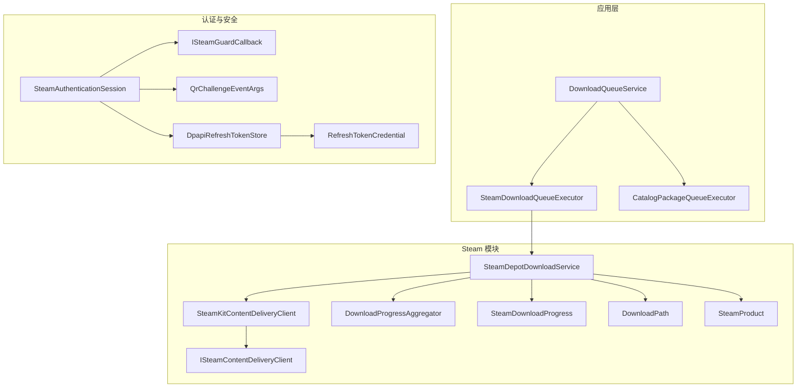
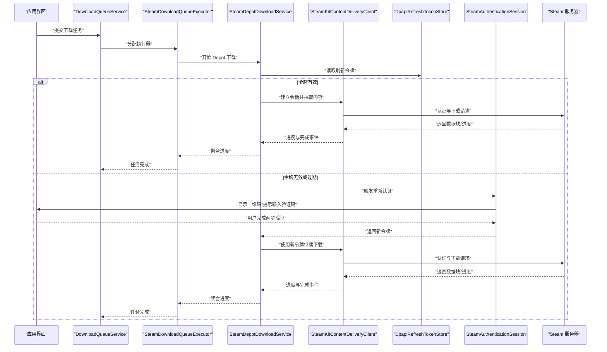
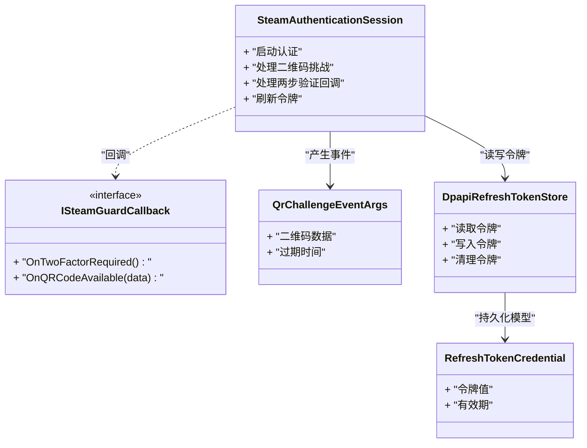
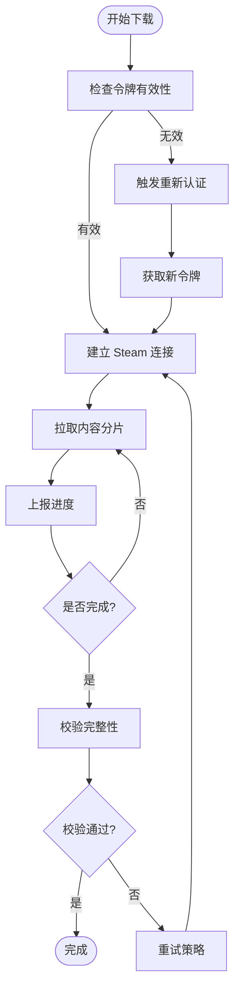
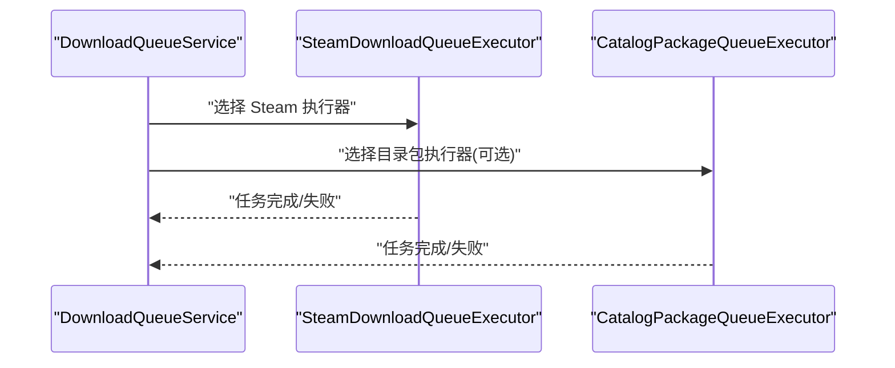
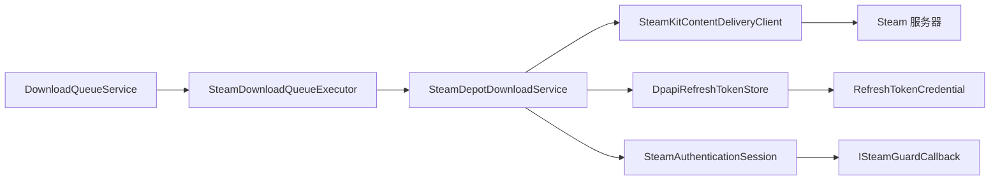

# Steam 集成问题

<cite>
**本文引用的文件**   
- [SteamAuthenticationSession.cs](file://src/Crystalfly.Steam/Authentication/SteamAuthenticationSession.cs)
- [ISteamGuardCallback.cs](file://src/Crystalfly.Steam/Authentication/ISteamGuardCallback.cs)
- [QrChallengeEventArgs.cs](file://src/Crystalfly.Steam/Authentication/QrChallengeEventArgs.cs)
- [DpapiRefreshTokenStore.cs](file://src/Crystalfly.Steam/Security/DpapiRefreshTokenStore.cs)
- [RefreshTokenCredential.cs](file://src/Crystalfly.Steam/Security/RefreshTokenCredential.cs)
- [SteamDepotDownloadService.cs](file://src/Crystalfly.Steam/Downloads/SteamDepotDownloadService.cs)
- [SteamKitContentDeliveryClient.cs](file://src/Crystalfly.Steam/Downloads/SteamKitContentDeliveryClient.cs)
- [ISteamContentDeliveryClient.cs](file://src/Crystalfly.Steam/Downloads/ISteamContentDeliveryClient.cs)
- [SteamDownloadProgress.cs](file://src/Crystalfly.Steam/Downloads/SteamDownloadProgress.cs)
- [DownloadProgressAggregator.cs](file://src/Crystalfly.Steam/Downloads/DownloadProgressAggregator.cs)
- [DownloadPath.cs](file://src/Crystalfly.Steam/Downloads/DownloadPath.cs)
- [SteamProduct.cs](file://src/Crystalfly.Steam/Downloads/SteamProduct.cs)
- [SteamDownloadQueueExecutor.cs](file://src/Crystalfly.App/Downloads/SteamDownloadQueueExecutor.cs)
- [CatalogPackageQueueExecutor.cs](file://src/Crystalfly.App/Downloads/CatalogPackageQueueExecutor.cs)
- [DownloadQueueService.cs](file://src/Crystalfly.App/Downloads/DownloadQueueService.cs)
- [IDownloadQueueExecutor.cs](file://src/Crystalfly.App/Downloads/IDownloadQueueExecutor.cs)
</cite>

## 目录
1. [简介](#简介)
2. [项目结构](#项目结构)
3. [核心组件](#核心组件)
4. [架构总览](#架构总览)
5. [详细组件分析](#详细组件分析)
6. [依赖关系分析](#依赖关系分析)
7. [性能与稳定性考虑](#性能与稳定性考虑)
8. [故障排除指南](#故障排除指南)
9. [结论](#结论)
10. [附录](#附录)

## 简介
本指南聚焦 Crystalfly 的 Steam 集成问题，覆盖认证失败、两步验证、会话过期、内容下载失败、API 限流与网络超时、令牌存储损坏修复与重新认证、以及 Steam 客户端连接异常等常见场景的诊断与解决步骤。文档以源码为依据，提供可操作的排查路径与恢复流程，并辅以架构图和流程图帮助快速定位问题。

## 项目结构
Crystalfly 的 Steam 相关能力主要分布在以下模块：
- 认证与会话：位于 Steam 模块的 Authentication 子目录，负责登录、二维码挑战、两步验证回调与会话管理。
- 安全与令牌存储：位于 Security 子目录，封装刷新令牌的安全持久化与读取。
- 内容下载：位于 Downloads 子目录，封装对 Steam 内容分发网络的访问、进度聚合与产品元数据。
- 应用层队列执行器：位于 App 模块的 Downloads 子目录，将下载任务编排到 Steam 下载执行器。

图表来源
- [SteamDownloadQueueExecutor.cs](file://src/Crystalfly.App/Downloads/SteamDownloadQueueExecutor.cs)
- [CatalogPackageQueueExecutor.cs](file://src/Crystalfly.App/Downloads/CatalogPackageQueueExecutor.cs)
- [DownloadQueueService.cs](file://src/Crystalfly.App/Downloads/DownloadQueueService.cs)
- [SteamDepotDownloadService.cs](file://src/Crystalfly.Steam/Downloads/SteamDepotDownloadService.cs)
- [SteamKitContentDeliveryClient.cs](file://src/Crystalfly.Steam/Downloads/SteamKitContentDeliveryClient.cs)
- [ISteamContentDeliveryClient.cs](file://src/Crystalfly.Steam/Downloads/ISteamContentDeliveryClient.cs)
- [DownloadProgressAggregator.cs](file://src/Crystalfly.Steam/Downloads/DownloadProgressAggregator.cs)
- [SteamDownloadProgress.cs](file://src/Crystalfly.Steam/Downloads/SteamDownloadProgress.cs)
- [DownloadPath.cs](file://src/Crystalfly.Steam/Downloads/DownloadPath.cs)
- [SteamProduct.cs](file://src/Crystalfly.Steam/Downloads/SteamProduct.cs)
- [SteamAuthenticationSession.cs](file://src/Crystalfly.Steam/Authentication/SteamAuthenticationSession.cs)
- [ISteamGuardCallback.cs](file://src/Crystalfly.Steam/Authentication/ISteamGuardCallback.cs)
- [QrChallengeEventArgs.cs](file://src/Crystalfly.Steam/Authentication/QrChallengeEventArgs.cs)
- [DpapiRefreshTokenStore.cs](file://src/Crystalfly.Steam/Security/DpapiRefreshTokenStore.cs)
- [RefreshTokenCredential.cs](file://src/Crystalfly.Steam/Security/RefreshTokenCredential.cs)

章节来源
- [SteamDownloadQueueExecutor.cs](file://src/Crystalfly.App/Downloads/SteamDownloadQueueExecutor.cs)
- [CatalogPackageQueueExecutor.cs](file://src/Crystalfly.App/Downloads/CatalogPackageQueueExecutor.cs)
- [DownloadQueueService.cs](file://src/Crystalfly.App/Downloads/DownloadQueueService.cs)
- [SteamDepotDownloadService.cs](file://src/Crystalfly.Steam/Downloads/SteamDepotDownloadService.cs)
- [SteamKitContentDeliveryClient.cs](file://src/Crystalfly.Steam/Downloads/SteamKitContentDeliveryClient.cs)
- [ISteamContentDeliveryClient.cs](file://src/Crystalfly.Steam/Downloads/ISteamContentDeliveryClient.cs)
- [DownloadProgressAggregator.cs](file://src/Crystalfly.Steam/Downloads/DownloadProgressAggregator.cs)
- [SteamDownloadProgress.cs](file://src/Crystalfly.Steam/Downloads/SteamDownloadProgress.cs)
- [DownloadPath.cs](file://src/Crystalfly.Steam/Downloads/DownloadPath.cs)
- [SteamProduct.cs](file://src/Crystalfly.Steam/Downloads/SteamProduct.cs)
- [SteamAuthenticationSession.cs](file://src/Crystalfly.Steam/Authentication/SteamAuthenticationSession.cs)
- [ISteamGuardCallback.cs](file://src/Crystalfly.Steam/Authentication/ISteamGuardCallback.cs)
- [QrChallengeEventArgs.cs](file://src/Crystalfly.Steam/Authentication/QrChallengeEventArgs.cs)
- [DpapiRefreshTokenStore.cs](file://src/Crystalfly.Steam/Security/DpapiRefreshTokenStore.cs)
- [RefreshTokenCredential.cs](file://src/Crystalfly.Steam/Security/RefreshTokenCredential.cs)

## 核心组件
- 认证与会话
  - 会话管理：负责发起登录、处理二维码挑战、接收两步验证回调、维护会话状态。
  - 两步验证回调接口：定义外部 UI 或系统如何响应两步验证请求。
  - 二维码挑战事件参数：携带二维码展示所需的数据。
- 安全与令牌存储
  - DPAPI 刷新令牌存储：使用操作系统提供的加密机制安全保存刷新令牌。
  - 刷新令牌凭据模型：表示令牌的序列化结构与生命周期信息。
- 内容下载
  - 仓库下载服务：协调 Depot 下载、重试、进度上报与错误分类。
  - SteamKit 内容交付客户端：基于 SteamKit 与 Steam 服务器交互进行实际下载。
  - 下载进度聚合器：汇总多任务进度，暴露统一进度事件。
  - 下载路径与产品模型：管理本地落盘路径与产品元数据。
- 应用层队列执行器
  - Steam 下载队列执行器：将队列中的下载项委派给 Steam 下载服务。
  - 目录包队列执行器：用于非 Steam 内容的下载编排（作为对照）。
  - 下载队列服务：统一管理下载任务的入队、调度与结果通知。

章节来源
- [SteamAuthenticationSession.cs](file://src/Crystalfly.Steam/Authentication/SteamAuthenticationSession.cs)
- [ISteamGuardCallback.cs](file://src/Crystalfly.Steam/Authentication/ISteamGuardCallback.cs)
- [QrChallengeEventArgs.cs](file://src/Crystalfly.Steam/Authentication/QrChallengeEventArgs.cs)
- [DpapiRefreshTokenStore.cs](file://src/Crystalfly.Steam/Security/DpapiRefreshTokenStore.cs)
- [RefreshTokenCredential.cs](file://src/Crystalfly.Steam/Security/RefreshTokenCredential.cs)
- [SteamDepotDownloadService.cs](file://src/Crystalfly.Steam/Downloads/SteamDepotDownloadService.cs)
- [SteamKitContentDeliveryClient.cs](file://src/Crystalfly.Steam/Downloads/SteamKitContentDeliveryClient.cs)
- [ISteamContentDeliveryClient.cs](file://src/Crystalfly.Steam/Downloads/ISteamContentDeliveryClient.cs)
- [DownloadProgressAggregator.cs](file://src/Crystalfly.Steam/Downloads/DownloadProgressAggregator.cs)
- [SteamDownloadProgress.cs](file://src/Crystalfly.Steam/Downloads/SteamDownloadProgress.cs)
- [DownloadPath.cs](file://src/Crystalfly.Steam/Downloads/DownloadPath.cs)
- [SteamProduct.cs](file://src/Crystalfly.Steam/Downloads/SteamProduct.cs)
- [SteamDownloadQueueExecutor.cs](file://src/Crystalfly.App/Downloads/SteamDownloadQueueExecutor.cs)
- [CatalogPackageQueueExecutor.cs](file://src/Crystalfly.App/Downloads/CatalogPackageQueueExecutor.cs)
- [DownloadQueueService.cs](file://src/Crystalfly.App/Downloads/DownloadQueueService.cs)

## 架构总览
下图展示了从应用层到 Steam 服务器的关键调用链，包括认证、令牌存储、下载编排与进度聚合。

图表来源
- [DownloadQueueService.cs](file://src/Crystalfly.App/Downloads/DownloadQueueService.cs)
- [SteamDownloadQueueExecutor.cs](file://src/Crystalfly.App/Downloads/SteamDownloadQueueExecutor.cs)
- [SteamDepotDownloadService.cs](file://src/Crystalfly.Steam/Downloads/SteamDepotDownloadService.cs)
- [SteamKitContentDeliveryClient.cs](file://src/Crystalfly.Steam/Downloads/SteamKitContentDeliveryClient.cs)
- [DpapiRefreshTokenStore.cs](file://src/Crystalfly.Steam/Security/DpapiRefreshTokenStore.cs)
- [SteamAuthenticationSession.cs](file://src/Crystalfly.Steam/Authentication/SteamAuthenticationSession.cs)

## 详细组件分析

### 认证与会话组件
- 职责
  - 启动认证流程，生成二维码挑战事件供 UI 展示。
  - 接收两步验证回调，更新会话状态并刷新令牌。
  - 与令牌存储协作，确保后续下载可用。
- 关键交互
  - 通过回调接口向外部传递两步验证需求。
  - 在令牌失效时主动触发重新认证。

图表来源
- [SteamAuthenticationSession.cs](file://src/Crystalfly.Steam/Authentication/SteamAuthenticationSession.cs)
- [ISteamGuardCallback.cs](file://src/Crystalfly.Steam/Authentication/ISteamGuardCallback.cs)
- [QrChallengeEventArgs.cs](file://src/Crystalfly.Steam/Authentication/QrChallengeEventArgs.cs)
- [DpapiRefreshTokenStore.cs](file://src/Crystalfly.Steam/Security/DpapiRefreshTokenStore.cs)
- [RefreshTokenCredential.cs](file://src/Crystalfly.Steam/Security/RefreshTokenCredential.cs)

章节来源
- [SteamAuthenticationSession.cs](file://src/Crystalfly.Steam/Authentication/SteamAuthenticationSession.cs)
- [ISteamGuardCallback.cs](file://src/Crystalfly.Steam/Authentication/ISteamGuardCallback.cs)
- [QrChallengeEventArgs.cs](file://src/Crystalfly.Steam/Authentication/QrChallengeEventArgs.cs)
- [DpapiRefreshTokenStore.cs](file://src/Crystalfly.Steam/Security/DpapiRefreshTokenStore.cs)
- [RefreshTokenCredential.cs](file://src/Crystalfly.Steam/Security/RefreshTokenCredential.cs)

### 内容下载组件
- 职责
  - 协调 Depot 下载任务，处理分片、校验与重试。
  - 聚合多任务进度，向上层报告整体状态。
  - 管理本地落盘路径与产品元数据。
- 关键交互
  - 通过 SteamKit 客户端与 Steam 服务器通信。
  - 在认证失败或令牌过期时回退到重新认证流程。

图表来源
- [SteamDepotDownloadService.cs](file://src/Crystalfly.Steam/Downloads/SteamDepotDownloadService.cs)
- [SteamKitContentDeliveryClient.cs](file://src/Crystalfly.Steam/Downloads/SteamKitContentDeliveryClient.cs)
- [ISteamContentDeliveryClient.cs](file://src/Crystalfly.Steam/Downloads/ISteamContentDeliveryClient.cs)
- [DownloadProgressAggregator.cs](file://src/Crystalfly.Steam/Downloads/DownloadProgressAggregator.cs)
- [SteamDownloadProgress.cs](file://src/Crystalfly.Steam/Downloads/SteamDownloadProgress.cs)
- [DownloadPath.cs](file://src/Crystalfly.Steam/Downloads/DownloadPath.cs)
- [SteamProduct.cs](file://src/Crystalfly.Steam/Downloads/SteamProduct.cs)

章节来源
- [SteamDepotDownloadService.cs](file://src/Crystalfly.Steam/Downloads/SteamDepotDownloadService.cs)
- [SteamKitContentDeliveryClient.cs](file://src/Crystalfly.Steam/Downloads/SteamKitContentDeliveryClient.cs)
- [ISteamContentDeliveryClient.cs](file://src/Crystalfly.Steam/Downloads/ISteamContentDeliveryClient.cs)
- [DownloadProgressAggregator.cs](file://src/Crystalfly.Steam/Downloads/DownloadProgressAggregator.cs)
- [SteamDownloadProgress.cs](file://src/Crystalfly.Steam/Downloads/SteamDownloadProgress.cs)
- [DownloadPath.cs](file://src/Crystalfly.Steam/Downloads/DownloadPath.cs)
- [SteamProduct.cs](file://src/Crystalfly.Steam/Downloads/SteamProduct.cs)

### 应用层队列执行器
- 职责
  - 将下载任务分配到具体执行器（如 Steam 下载执行器）。
  - 与目录包执行器协同，统一处理不同来源的内容。
- 关键交互
  - 由下载队列服务调度，执行完成后反馈结果。

图表来源
- [DownloadQueueService.cs](file://src/Crystalfly.App/Downloads/DownloadQueueService.cs)
- [SteamDownloadQueueExecutor.cs](file://src/Crystalfly.App/Downloads/SteamDownloadQueueExecutor.cs)
- [CatalogPackageQueueExecutor.cs](file://src/Crystalfly.App/Downloads/CatalogPackageQueueExecutor.cs)
- [IDownloadQueueExecutor.cs](file://src/Crystalfly.App/Downloads/IDownloadQueueExecutor.cs)

章节来源
- [DownloadQueueService.cs](file://src/Crystalfly.App/Downloads/DownloadQueueService.cs)
- [SteamDownloadQueueExecutor.cs](file://src/Crystalfly.App/Downloads/SteamDownloadQueueExecutor.cs)
- [CatalogPackageQueueExecutor.cs](file://src/Crystalfly.App/Downloads/CatalogPackageQueueExecutor.cs)
- [IDownloadQueueExecutor.cs](file://src/Crystalfly.App/Downloads/IDownloadQueueExecutor.cs)

## 依赖关系分析
- 松耦合设计
  - 下载服务通过接口与客户端解耦，便于替换实现与测试。
  - 认证与会话通过回调接口与 UI 解耦，支持多种两步验证交互方式。
- 关键依赖链
  - 应用层队列服务 -> Steam 下载执行器 -> 仓库下载服务 -> SteamKit 客户端 -> Steam 服务器。
  - 会话管理 -> 令牌存储 -> 刷新令牌凭据模型。

图表来源
- [DownloadQueueService.cs](file://src/Crystalfly.App/Downloads/DownloadQueueService.cs)
- [SteamDownloadQueueExecutor.cs](file://src/Crystalfly.App/Downloads/SteamDownloadQueueExecutor.cs)
- [SteamDepotDownloadService.cs](file://src/Crystalfly.Steam/Downloads/SteamDepotDownloadService.cs)
- [SteamKitContentDeliveryClient.cs](file://src/Crystalfly.Steam/Downloads/SteamKitContentDeliveryClient.cs)
- [DpapiRefreshTokenStore.cs](file://src/Crystalfly.Steam/Security/DpapiRefreshTokenStore.cs)
- [RefreshTokenCredential.cs](file://src/Crystalfly.Steam/Security/RefreshTokenCredential.cs)
- [SteamAuthenticationSession.cs](file://src/Crystalfly.Steam/Authentication/SteamAuthenticationSession.cs)
- [ISteamGuardCallback.cs](file://src/Crystalfly.Steam/Authentication/ISteamGuardCallback.cs)

章节来源
- [DownloadQueueService.cs](file://src/Crystalfly.App/Downloads/DownloadQueueService.cs)
- [SteamDownloadQueueExecutor.cs](file://src/Crystalfly.App/Downloads/SteamDownloadQueueExecutor.cs)
- [SteamDepotDownloadService.cs](file://src/Crystalfly.Steam/Downloads/SteamDepotDownloadService.cs)
- [SteamKitContentDeliveryClient.cs](file://src/Crystalfly.Steam/Downloads/SteamKitContentDeliveryClient.cs)
- [DpapiRefreshTokenStore.cs](file://src/Crystalfly.Steam/Security/DpapiRefreshTokenStore.cs)
- [RefreshTokenCredential.cs](file://src/Crystalfly.Steam/Security/RefreshTokenCredential.cs)
- [SteamAuthenticationSession.cs](file://src/Crystalfly.Steam/Authentication/SteamAuthenticationSession.cs)
- [ISteamGuardCallback.cs](file://src/Crystalfly.Steam/Authentication/ISteamGuardCallback.cs)

## 性能与稳定性考虑
- 并发与限速
  - 合理控制并发下载数量，避免触发 Steam 服务端限流。
  - 利用进度聚合器平滑上报，降低 UI 刷新压力。
- 重试与退避
  - 对瞬态错误（网络抖动、临时限流）采用指数退避与最大重试次数限制。
  - 对校验失败进行局部重传，减少重复下载量。
- 资源管理
  - 及时释放连接与句柄，避免长时间占用导致资源泄漏。
  - 使用原子写入与校验保证落盘一致性。

[本节为通用指导，不直接分析具体文件]

## 故障排除指南

### 一、Steam 认证失败的诊断与解决
- 常见问题
  - 用户名或密码错误、账号被锁定、地区限制。
  - 两步验证未正确配置或设备变更。
  - 会话过期或令牌失效。
- 诊断步骤
  - 确认是否出现二维码挑战事件；若未出现，检查回调接口是否正确注册。
  - 查看令牌存储中是否存在有效刷新令牌；若为空或损坏，进入“令牌存储损坏修复”流程。
  - 观察是否有两步验证回调触发；若无，检查外部 UI 或系统是否拦截了回调。
- 解决方法
  - 重新输入凭证并完成两步验证。
  - 清除旧令牌后重新登录。
  - 若账号受限，联系 Steam 支持或等待冷却期结束。

章节来源
- [SteamAuthenticationSession.cs](file://src/Crystalfly.Steam/Authentication/SteamAuthenticationSession.cs)
- [ISteamGuardCallback.cs](file://src/Crystalfly.Steam/Authentication/ISteamGuardCallback.cs)
- [QrChallengeEventArgs.cs](file://src/Crystalfly.Steam/Authentication/QrChallengeEventArgs.cs)
- [DpapiRefreshTokenStore.cs](file://src/Crystalfly.Steam/Security/DpapiRefreshTokenStore.cs)
- [RefreshTokenCredential.cs](file://src/Crystalfly.Steam/Security/RefreshTokenCredential.cs)

### 二、两步验证问题
- 症状
  - 无法完成登录，提示需要两步验证。
  - 二维码无法显示或已过期。
- 诊断步骤
  - 检查二维码挑战事件参数是否包含有效数据与过期时间。
  - 确认外部 UI 是否正确渲染二维码并在过期前提示用户操作。
  - 验证两步验证回调是否成功回写会话状态。
- 解决方法
  - 重新生成二维码并尽快完成验证。
  - 若设备更换，按 Steam 流程重置两步验证。
  - 确保回调接口未被第三方软件拦截。

章节来源
- [QrChallengeEventArgs.cs](file://src/Crystalfly.Steam/Authentication/QrChallengeEventArgs.cs)
- [ISteamGuardCallback.cs](file://src/Crystalfly.Steam/Authentication/ISteamGuardCallback.cs)
- [SteamAuthenticationSession.cs](file://src/Crystalfly.Steam/Authentication/SteamAuthenticationSession.cs)

### 三、会话过期处理
- 症状
  - 下载中途失败，提示会话或令牌无效。
- 诊断步骤
  - 检查令牌存储是否返回空或过期凭据。
  - 观察是否触发了重新认证流程。
- 解决方法
  - 自动触发重新认证，引导用户完成两步验证。
  - 成功后使用新令牌继续下载。

章节来源
- [DpapiRefreshTokenStore.cs](file://src/Crystalfly.Steam/Security/DpapiRefreshTokenStore.cs)
- [RefreshTokenCredential.cs](file://src/Crystalfly.Steam/Security/RefreshTokenCredential.cs)
- [SteamAuthenticationSession.cs](file://src/Crystalfly.Steam/Authentication/SteamAuthenticationSession.cs)

### 四、内容下载失败的原因分析与重试策略
- 常见原因
  - 网络不稳定、Steam 服务器限流、磁盘写入失败、校验不一致。
- 诊断步骤
  - 查看下载进度聚合器的失败统计与最近错误类型。
  - 检查下载路径是否可写、目标磁盘空间是否充足。
  - 核对产品元数据是否与期望一致。
- 重试策略
  - 对瞬态错误采用指数退避与最大重试次数。
  - 对校验失败进行局部重传，避免全量重下。
  - 在限流情况下降低并发度并延长间隔。

章节来源
- [SteamDepotDownloadService.cs](file://src/Crystalfly.Steam/Downloads/SteamDepotDownloadService.cs)
- [DownloadProgressAggregator.cs](file://src/Crystalfly.Steam/Downloads/DownloadProgressAggregator.cs)
- [SteamDownloadProgress.cs](file://src/Crystalfly.Steam/Downloads/SteamDownloadProgress.cs)
- [DownloadPath.cs](file://src/Crystalfly.Steam/Downloads/DownloadPath.cs)
- [SteamProduct.cs](file://src/Crystalfly.Steam/Downloads/SteamProduct.cs)

### 五、Steam API 限流和网络超时问题的处理方案
- 限流处理
  - 识别限流错误码或响应头，降低并发与请求频率。
  - 实施退避算法，避免雪崩效应。
- 超时处理
  - 区分连接超时与传输超时，分别设置合理的超时阈值。
  - 对长耗时操作启用取消令牌与超时保护。
- 监控与告警
  - 记录限流与超时的发生频率与持续时间，辅助容量规划。

章节来源
- [SteamKitContentDeliveryClient.cs](file://src/Crystalfly.Steam/Downloads/SteamKitContentDeliveryClient.cs)
- [ISteamContentDeliveryClient.cs](file://src/Crystalfly.Steam/Downloads/ISteamContentDeliveryClient.cs)
- [SteamDepotDownloadService.cs](file://src/Crystalfly.Steam/Downloads/SteamDepotDownloadService.cs)

### 六、令牌存储损坏的修复方法与重新认证流程
- 症状
  - 读取刷新令牌失败、解密错误或令牌格式不正确。
- 修复方法
  - 清理损坏的令牌条目，确保存储目录权限正常。
  - 删除后重启应用，触发完整重新认证流程。
- 重新认证流程
  - 启动认证 -> 生成二维码 -> 用户完成两步验证 -> 写入新令牌 -> 继续下载。

章节来源
- [DpapiRefreshTokenStore.cs](file://src/Crystalfly.Steam/Security/DpapiRefreshTokenStore.cs)
- [RefreshTokenCredential.cs](file://src/Crystalfly.Steam/Security/RefreshTokenCredential.cs)
- [SteamAuthenticationSession.cs](file://src/Crystalfly.Steam/Authentication/SteamAuthenticationSession.cs)

### 七、Steam 客户端连接问题的排查步骤与替代方案
- 排查步骤
  - 确认 Steam 客户端在线且处于活动会话。
  - 检查防火墙与代理设置是否阻止了 Steam 端口。
  - 尝试切换网络环境或使用有线连接。
- 替代方案
  - 若 Steam 客户端不可用，考虑使用离线模式或手动放置已下载内容到指定路径（需满足校验要求）。
  - 对于企业网络，配置可信白名单与出站规则。

章节来源
- [SteamKitContentDeliveryClient.cs](file://src/Crystalfly.Steam/Downloads/SteamKitContentDeliveryClient.cs)
- [ISteamContentDeliveryClient.cs](file://src/Crystalfly.Steam/Downloads/ISteamContentDeliveryClient.cs)

## 结论
通过对认证、令牌存储、下载编排与进度的系统化分析，可以高效定位并解决 Crystalfly 的 Steam 集成问题。建议在生产环境中完善日志与指标采集，结合本指南的排查步骤与重试策略，提升用户体验与系统稳定性。

[本节为总结性内容，不直接分析具体文件]

## 附录
- 术语表
  - 刷新令牌：用于维持长期会话的加密凭据。
  - 两步验证：增强账户安全的二次验证机制。
  - Depot：Steam 内容分发单元，包含游戏或模组的具体文件。
- 参考文件清单
  - 认证与会话：见“引用文件”列表中的 Authentication 与 Security 相关文件。
  - 内容下载：见“引用文件”列表中的 Downloads 相关文件。
  - 应用层队列：见“引用文件”列表中的 App 模块 Downloads 相关文件。

[本节为补充信息，不直接分析具体文件]