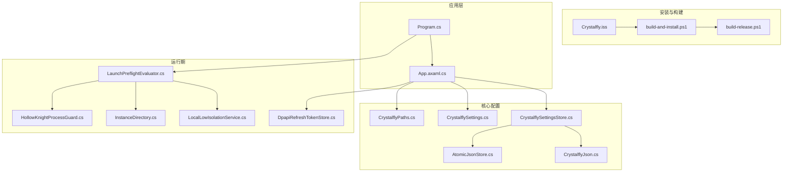
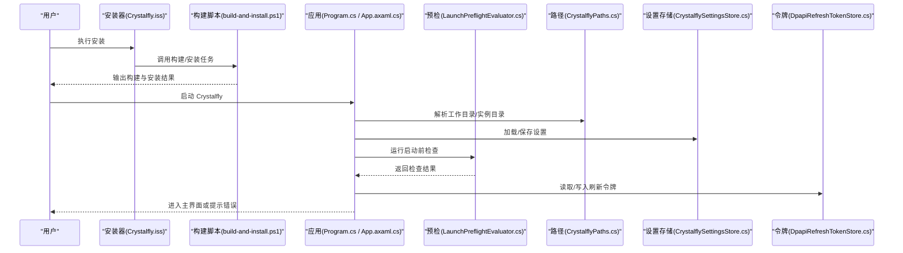
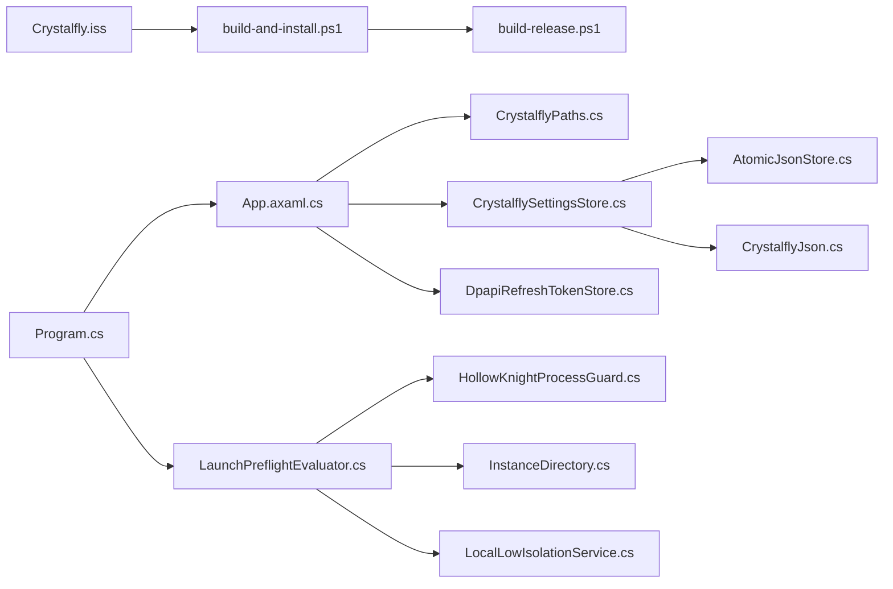
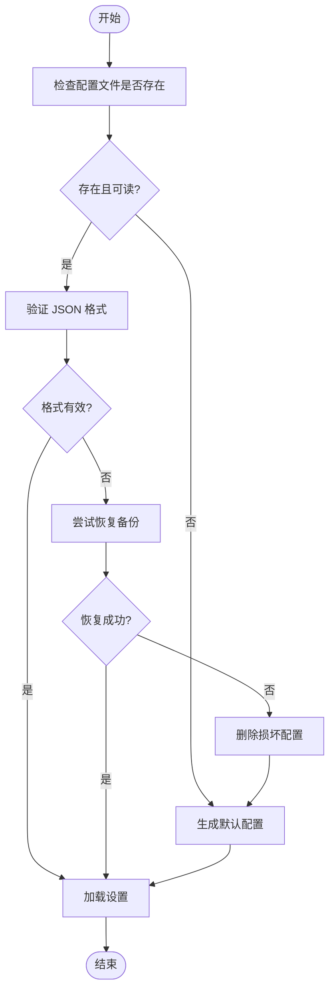

# 安装和配置问题

<cite>
**本文引用的文件**   
- [Crystalfly.iss](file://installer/Crystalfly.iss)
- [build-and-install.ps1](file://scripts/build-and-install.ps1)
- [build-release.ps1](file://scripts/build-release.ps1)
- [Program.cs](file://src/Crystalfly.App/Program.cs)
- [App.axaml.cs](file://src/Crystalfly.App/App.axaml.cs)
- [CrystalflyPaths.cs](file://src/Crystalfly.Core/Configuration/CrystalflyPaths.cs)
- [CrystalflySettings.cs](file://src/Crystalfly.Core/Configuration/CrystalflySettings.cs)
- [CrystalflySettingsStore.cs](file://src/Crystalfly.Core/Configuration/CrystalflySettingsStore.cs)
- [LaunchPreflightEvaluator.cs](file://src/Crystalfly.Core/Runtime/LaunchPreflightEvaluator.cs)
- [HollowKnightProcessGuard.cs](file://src/Crystalfly.Core/Runtime/HollowKnightProcessGuard.cs)
- [InstanceDirectory.cs](file://src/Crystalfly.Core/Instances/InstanceDirectory.cs)
- [LocalLowIsolationService.cs](file://src/Crystalfly.Core/LocalLow/LocalLowIsolationService.cs)
- [AtomicJsonStore.cs](file://src/Crystalfly.Core/Serialization/AtomicJsonStore.cs)
- [CrystalflyJson.cs](file://src/Crystalfly.Core/Serialization/CrystalflyJson.cs)
- [DpapiRefreshTokenStore.cs](file://src/Crystalfly.Steam/Security/DpapiRefreshTokenStore.cs)
</cite>

## 目录
1. [简介](#简介)
2. [项目结构](#项目结构)
3. [核心组件](#核心组件)
4. [架构总览](#架构总览)
5. [详细组件分析](#详细组件分析)
6. [依赖关系分析](#依赖关系分析)
7. [性能考虑](#性能考虑)
8. [故障排除指南](#故障排除指南)
9. [结论](#结论)
10. [附录](#附录)

## 简介
本指南聚焦于 Crystalfly 的安装与配置问题，覆盖系统要求检查、权限与路径冲突、配置文件损坏修复与重置、环境变量与路径配置错误、.NET 运行时依赖诊断、注册表项验证与清理、磁盘空间不足与文件权限错误的处理流程。内容基于源码中安装脚本、应用启动、路径与设置存储、预检评估、进程守护、本地数据隔离以及序列化等关键实现进行归纳总结，帮助快速定位并解决常见问题。

## 项目结构
与安装和配置相关的代码主要分布在以下位置：
- 安装器与构建脚本：installer、scripts
- 应用入口与初始化：src/Crystalfly.App
- 路径与设置：src/Crystalfly.Core/Configuration
- 运行期预检与进程保护：src/Crystalfly.Core/Runtime
- 实例与用户数据目录：src/Crystalfly.Core/Instances、src/Crystalfly.Core/LocalLow
- 序列化与持久化：src/Crystalfly.Core/Serialization
- Steam 安全令牌存储（DPAPI）：src/Crystalfly.Steam/Security

图表来源
- [Crystalfly.iss](file://installer/Crystalfly.iss)
- [build-and-install.ps1](file://scripts/build-and-install.ps1)
- [build-release.ps1](file://scripts/build-release.ps1)
- [Program.cs](file://src/Crystalfly.App/Program.cs)
- [App.axaml.cs](file://src/Crystalfly.App/App.axaml.cs)
- [CrystalflyPaths.cs](file://src/Crystalfly.Core/Configuration/CrystalflyPaths.cs)
- [CrystalflySettings.cs](file://src/Crystalfly.Core/Configuration/CrystalflySettings.cs)
- [CrystalflySettingsStore.cs](file://src/Crystalfly.Core/Configuration/CrystalflySettingsStore.cs)
- [LaunchPreflightEvaluator.cs](file://src/Crystalfly.Core/Runtime/LaunchPreflightEvaluator.cs)
- [HollowKnightProcessGuard.cs](file://src/Crystalfly.Core/Runtime/HollowKnightProcessGuard.cs)
- [InstanceDirectory.cs](file://src/Crystalfly.Core/Instances/InstanceDirectory.cs)
- [LocalLowIsolationService.cs](file://src/Crystalfly.Core/LocalLow/LocalLowIsolationService.cs)
- [AtomicJsonStore.cs](file://src/Crystalfly.Core/Serialization/AtomicJsonStore.cs)
- [CrystalflyJson.cs](file://src/Crystalfly.Core/Serialization/CrystalflyJson.cs)
- [DpapiRefreshTokenStore.cs](file://src/Crystalfly.Steam/Security/DpapiRefreshTokenStore.cs)

章节来源
- [Crystalfly.iss](file://installer/Crystalfly.iss)
- [build-and-install.ps1](file://scripts/build-and-install.ps1)
- [build-release.ps1](file://scripts/build-release.ps1)
- [Program.cs](file://src/Crystalfly.App/Program.cs)
- [App.axaml.cs](file://src/Crystalfly.App/App.axaml.cs)
- [CrystalflyPaths.cs](file://src/Crystalfly.Core/Configuration/CrystalflyPaths.cs)
- [CrystalflySettings.cs](file://src/Crystalfly.Core/Configuration/CrystalflySettings.cs)
- [CrystalflySettingsStore.cs](file://src/Crystalfly.Core/Configuration/CrystalflySettingsStore.cs)
- [LaunchPreflightEvaluator.cs](file://src/Crystalfly.Core/Runtime/LaunchPreflightEvaluator.cs)
- [HollowKnightProcessGuard.cs](file://src/Crystalfly.Core/Runtime/HollowKnightProcessGuard.cs)
- [InstanceDirectory.cs](file://src/Crystalfly.Core/Instances/InstanceDirectory.cs)
- [LocalLowIsolationService.cs](file://src/Crystalfly.Core/LocalLow/LocalLowIsolationService.cs)
- [AtomicJsonStore.cs](file://src/Crystalfly.Core/Serialization/AtomicJsonStore.cs)
- [CrystalflyJson.cs](file://src/Crystalfly.Core/Serialization/CrystalflyJson.cs)
- [DpapiRefreshTokenStore.cs](file://src/Crystalfly.Steam/Security/DpapiRefreshTokenStore.cs)

## 核心组件
- 安装器与构建脚本：负责打包、部署与构建产物生成，影响安装路径、依赖注入与初始环境准备。
- 应用入口与初始化：负责 .NET 运行时加载、应用生命周期、日志与异常上报、配置加载。
- 路径与设置：集中管理 Crystalfly 的工作目录、实例目录、用户数据目录、设置文件位置与读写策略。
- 运行期预检与进程保护：在启动前校验必要条件（如游戏路径、运行时、进程占用），避免并发或环境不一致导致的问题。
- 本地数据隔离：对 LocalLow 目录进行隔离与迁移，确保多实例或多用户场景下的数据安全。
- 序列化与持久化：提供原子写入与 JSON 序列化能力，降低配置损坏风险。
- Steam 安全令牌存储：使用 DPAPI 加密存储刷新令牌，受 Windows 用户上下文影响。

章节来源
- [Crystalfly.iss](file://installer/Crystalfly.iss)
- [build-and-install.ps1](file://scripts/build-and-install.ps1)
- [build-release.ps1](file://scripts/build-release.ps1)
- [Program.cs](file://src/Crystalfly.App/Program.cs)
- [App.axaml.cs](file://src/Crystalfly.App/App.axaml.cs)
- [CrystalflyPaths.cs](file://src/Crystalfly.Core/Configuration/CrystalflyPaths.cs)
- [CrystalflySettings.cs](file://src/Crystalfly.Core/Configuration/CrystalflySettings.cs)
- [CrystalflySettingsStore.cs](file://src/Crystalfly.Core/Configuration/CrystalflySettingsStore.cs)
- [LaunchPreflightEvaluator.cs](file://src/Crystalfly.Core/Runtime/LaunchPreflightEvaluator.cs)
- [HollowKnightProcessGuard.cs](file://src/Crystalfly.Core/Runtime/HollowKnightProcessGuard.cs)
- [InstanceDirectory.cs](file://src/Crystalfly.Core/Instances/InstanceDirectory.cs)
- [LocalLowIsolationService.cs](file://src/Crystalfly.Core/LocalLow/LocalLowIsolationService.cs)
- [AtomicJsonStore.cs](file://src/Crystalfly.Core/Serialization/AtomicJsonStore.cs)
- [CrystalflyJson.cs](file://src/Crystalfly.Core/Serialization/CrystalflyJson.cs)
- [DpapiRefreshTokenStore.cs](file://src/Crystalfly.Steam/Security/DpapiRefreshTokenStore.cs)

## 架构总览
下图展示了从安装到首次运行的关键路径与交互点，包括安装器、构建脚本、应用启动、预检评估、路径解析与设置存储、Steam 令牌存取等。

图表来源
- [Crystalfly.iss](file://installer/Crystalfly.iss)
- [build-and-install.ps1](file://scripts/build-and-install.ps1)
- [Program.cs](file://src/Crystalfly.App/Program.cs)
- [App.axaml.cs](file://src/Crystalfly.App/App.axaml.cs)
- [CrystalflyPaths.cs](file://src/Crystalfly.Core/Configuration/CrystalflyPaths.cs)
- [CrystalflySettingsStore.cs](file://src/Crystalfly.Core/Configuration/CrystalflySettingsStore.cs)
- [LaunchPreflightEvaluator.cs](file://src/Crystalfly.Core/Runtime/LaunchPreflightEvaluator.cs)
- [DpapiRefreshTokenStore.cs](file://src/Crystalfly.Steam/Security/DpapiRefreshTokenStore.cs)

## 详细组件分析

### 安装器与构建脚本
- 安装器定义安装行为、目标路径、注册表项与卸载逻辑，直接影响安装成功与否及后续运行环境。
- 构建脚本负责编译、打包与部署，可能涉及环境变量、SDK/工具链版本与输出目录。

常见安装失败原因与排查要点
- 目标路径不可写或存在同名文件被占用：确认安装目录权限与是否被杀毒软件锁定。
- 注册表项写入失败：检查当前用户权限与 UAC 设置；必要时以管理员身份运行安装器。
- 构建脚本依赖缺失：确认 PowerShell 版本、.NET SDK/运行时已正确安装且 PATH 包含对应可执行。

章节来源
- [Crystalfly.iss](file://installer/Crystalfly.iss)
- [build-and-install.ps1](file://scripts/build-and-install.ps1)
- [build-release.ps1](file://scripts/build-release.ps1)

### 应用入口与初始化
- 应用入口负责加载运行时、初始化日志、解析配置并触发预检。
- 若 .NET 运行时未安装或版本不匹配，将导致无法启动或功能受限。

常见启动失败原因与排查要点
- .NET 运行时缺失或版本不符：根据应用需求安装匹配的运行时；检查系统 PATH 与 dotnet 命令可用性。
- 配置文件路径不可访问：确认工作目录与用户数据目录的权限。
- 日志目录创建失败：检查磁盘空间与目录权限。

章节来源
- [Program.cs](file://src/Crystalfly.App/Program.cs)
- [App.axaml.cs](file://src/Crystalfly.App/App.axaml.cs)

### 路径与设置
- 路径模块集中计算 Crystalfly 工作目录、实例目录、用户数据目录等关键路径。
- 设置模块负责配置的加载、保存与默认值合并；序列化模块提供原子写入与 JSON 处理。

常见配置问题与排查要点
- 路径冲突：多个实例或旧版本残留导致路径指向不一致；建议统一工作目录并清理冗余目录。
- 配置文件损坏：优先尝试自动恢复（原子写入通常保留备份）；若仍失败，可按“重置步骤”重建默认配置。
- 权限错误：确保当前用户对配置目录具有读写权限。

章节来源
- [CrystalflyPaths.cs](file://src/Crystalfly.Core/Configuration/CrystalflyPaths.cs)
- [CrystalflySettings.cs](file://src/Crystalfly.Core/Configuration/CrystalflySettings.cs)
- [CrystalflySettingsStore.cs](file://src/Crystalfly.Core/Configuration/CrystalflySettingsStore.cs)
- [AtomicJsonStore.cs](file://src/Crystalfly.Core/Serialization/AtomicJsonStore.cs)
- [CrystalflyJson.cs](file://src/Crystalfly.Core/Serialization/CrystalflyJson.cs)

### 运行期预检与进程保护
- 预检评估在启动前检查必要条件，如游戏路径有效性、运行时可用性与进程占用情况。
- 进程守护用于检测并阻止同一游戏的重复运行，避免资源竞争与状态不一致。

常见运行期问题与排查要点
- 游戏路径无效或未安装：在设置中修正游戏安装路径，确保可执行文件存在。
- 进程占用：关闭正在运行的游戏或其他相关进程后重试。
- 预检失败：根据提示逐项修复，例如修复路径、释放进程或调整权限。

章节来源
- [LaunchPreflightEvaluator.cs](file://src/Crystalfly.Core/Runtime/LaunchPreflightEvaluator.cs)
- [HollowKnightProcessGuard.cs](file://src/Crystalfly.Core/Runtime/HollowKnightProcessGuard.cs)

### 实例与本地数据隔离
- 实例目录管理不同游戏实例的数据与版本信息。
- LocalLow 隔离服务对用户数据目录进行隔离与迁移，避免跨实例污染。

常见问题与排查要点
- 实例目录权限不足：为当前用户授予读写权限。
- 数据迁移失败：检查源目录是否存在与可读，目标目录是否可写；必要时手动迁移并重试。

章节来源
- [InstanceDirectory.cs](file://src/Crystalfly.Core/Instances/InstanceDirectory.cs)
- [LocalLowIsolationService.cs](file://src/Crystalfly.Core/LocalLow/LocalLowIsolationService.cs)

### Steam 安全令牌存储（DPAPI）
- 刷新令牌通过 DPAPI 加密存储，绑定当前 Windows 用户上下文。
- 切换用户或重装系统可能导致令牌解密失败。

常见问题与排查要点
- 令牌解密失败：重新登录以生成新令牌；确保在同一用户上下文下运行。
- 权限问题：确认当前用户对 DPAPI 存储位置有访问权限。

章节来源
- [DpapiRefreshTokenStore.cs](file://src/Crystalfly.Steam/Security/DpapiRefreshTokenStore.cs)

## 依赖关系分析
- 安装器与构建脚本强耦合：安装器调用构建脚本完成部署，脚本失败会直接导致安装中断。
- 应用与配置模块紧密协作：路径解析与设置存储是应用启动的关键前置条件。
- 预检与进程守护作为运行期保障：在应用主流程之前执行，决定能否继续进入主界面。
- 序列化与持久化贯穿配置与令牌存储：原子写入降低配置损坏概率。

图表来源
- [Crystalfly.iss](file://installer/Crystalfly.iss)
- [build-and-install.ps1](file://scripts/build-and-install.ps1)
- [build-release.ps1](file://scripts/build-release.ps1)
- [Program.cs](file://src/Crystalfly.App/Program.cs)
- [App.axaml.cs](file://src/Crystalfly.App/App.axaml.cs)
- [CrystalflyPaths.cs](file://src/Crystalfly.Core/Configuration/CrystalflyPaths.cs)
- [CrystalflySettingsStore.cs](file://src/Crystalfly.Core/Configuration/CrystalflySettingsStore.cs)
- [AtomicJsonStore.cs](file://src/Crystalfly.Core/Serialization/AtomicJsonStore.cs)
- [CrystalflyJson.cs](file://src/Crystalfly.Core/Serialization/CrystalflyJson.cs)
- [LaunchPreflightEvaluator.cs](file://src/Crystalfly.Core/Runtime/LaunchPreflightEvaluator.cs)
- [HollowKnightProcessGuard.cs](file://src/Crystalfly.Core/Runtime/HollowKnightProcessGuard.cs)
- [InstanceDirectory.cs](file://src/Crystalfly.Core/Instances/InstanceDirectory.cs)
- [LocalLowIsolationService.cs](file://src/Crystalfly.Core/LocalLow/LocalLowIsolationService.cs)
- [DpapiRefreshTokenStore.cs](file://src/Crystalfly.Steam/Security/DpapiRefreshTokenStore.cs)

## 性能考虑
- 安装阶段：避免同时运行大量下载或解压任务，减少 I/O 争用。
- 启动阶段：预检尽量轻量，避免频繁扫描大目录；必要时缓存检测结果。
- 配置读写：利用原子写入与批量更新，减少锁竞争与磁盘抖动。
- 日志级别：生产环境使用较低日志级别，避免过度 I/O。

[本节为通用指导，无需列出具体文件来源]

## 故障排除指南

### 一、安装失败的常见原因与解决方法
- 系统要求检查
  - 确认操作系统版本满足最低要求。
  - 确认 .NET 运行时已安装且版本匹配；可通过命令行工具验证可用性。
  - 确认磁盘空间充足，至少预留足够的安装与运行时空间。
- 权限问题
  - 安装目录需具备当前用户的写入权限；必要时以管理员身份运行安装器。
  - 杀毒软件或企业策略可能阻止写入注册表或创建目录，请添加信任或临时禁用。
- 路径冲突
  - 避免安装到系统盘根目录或受保护的 Program Files 子目录（除非需要管理员权限）。
  - 清理旧版本残留目录，防止路径解析混乱。
- 注册表项写入失败
  - 检查当前用户是否有写入 HKCU 的权限；UAC 过高时尝试提升权限。
  - 若注册表项损坏，可导出备份后删除相关键值，再重新安装。

章节来源
- [Crystalfly.iss](file://installer/Crystalfly.iss)
- [build-and-install.ps1](file://scripts/build-and-install.ps1)
- [build-release.ps1](file://scripts/build-release.ps1)

### 二、配置文件损坏的修复方法与重置步骤
- 自动恢复
  - 应用使用原子写入与 JSON 序列化，部分情况下会自动保留备份或回滚至上次有效状态。
- 手动修复
  - 定位配置目录（由路径模块计算），检查配置文件是否为空或格式错误。
  - 若存在备份文件，替换为主配置；否则删除损坏配置，让应用重建默认配置。
- 重置步骤
  - 关闭应用，备份现有配置目录。
  - 删除或重命名损坏的配置目录，重新启动应用以生成默认配置。
  - 重新输入必要设置（如游戏路径、实例目录等）。

章节来源
- [CrystalflyPaths.cs](file://src/Crystalfly.Core/Configuration/CrystalflyPaths.cs)
- [CrystalflySettings.cs](file://src/Crystalfly.Core/Configuration/CrystalflySettings.cs)
- [CrystalflySettingsStore.cs](file://src/Crystalfly.Core/Configuration/CrystalflySettingsStore.cs)
- [AtomicJsonStore.cs](file://src/Crystalfly.Core/Serialization/AtomicJsonStore.cs)
- [CrystalflyJson.cs](file://src/Crystalfly.Core/Serialization/CrystalflyJson.cs)

### 三、环境变量设置错误与路径配置解决方案
- 环境变量
  - 确认 PATH 中包含 dotnet 与必要的构建工具路径。
  - 若自定义了工作目录或实例目录，确保环境变量指向合法且可写的路径。
- 路径配置
  - 在游戏路径设置中填写绝对路径，避免相对路径导致的解析失败。
  - 若路径包含空格或特殊字符，建议使用短路径或避免特殊字符。

章节来源
- [CrystalflyPaths.cs](file://src/Crystalfly.Core/Configuration/CrystalflyPaths.cs)
- [CrystalflySettings.cs](file://src/Crystalfly.Core/Configuration/CrystalflySettings.cs)

### 四、.NET 运行时依赖问题的诊断与修复
- 诊断
  - 使用命令行工具检查已安装的运行时与 SDK 版本。
  - 查看应用启动日志，定位运行时加载失败的详细信息。
- 修复
  - 安装匹配的 .NET 运行时（通常为桌面运行时）。
  - 重启计算机以确保 PATH 与环境生效。
  - 若存在多个版本冲突，卸载不需要的版本或固定所需版本。

章节来源
- [Program.cs](file://src/Crystalfly.App/Program.cs)
- [App.axaml.cs](file://src/Crystalfly.App/App.axaml.cs)

### 五、注册表项验证与清理方法
- 验证
  - 打开注册表编辑器，导航至应用相关键值（通常在 HKCU 下）。
  - 核对键名、数据类型与值是否与预期一致。
- 清理
  - 备份相关键值后删除，再重新安装以重建注册表项。
  - 若企业策略限制修改注册表，请联系管理员或改用非管理员安装路径。

章节来源
- [Crystalfly.iss](file://installer/Crystalfly.iss)

### 六、磁盘空间不足与文件权限错误的处理流程
- 磁盘空间不足
  - 检查目标分区剩余空间，清理无用文件或迁移数据盘。
  - 在安装与运行时目录预留足够空间，避免运行时写入失败。
- 文件权限错误
  - 为当前用户授予配置目录与实例目录的完全控制权限。
  - 关闭占用文件的进程（如杀毒软件实时防护、云同步客户端）。

章节来源
- [CrystalflyPaths.cs](file://src/Crystalfly.Core/Configuration/CrystalflyPaths.cs)
- [CrystalflySettingsStore.cs](file://src/Crystalfly.Core/Configuration/CrystalflySettingsStore.cs)
- [InstanceDirectory.cs](file://src/Crystalfly.Core/Instances/InstanceDirectory.cs)

### 七、运行期问题：预检失败与进程占用
- 预检失败
  - 根据提示修复游戏路径、运行时或网络访问。
  - 若网络受限，检查代理与防火墙设置。
- 进程占用
  - 关闭正在运行的游戏或其他相关进程，避免端口或文件锁定。
  - 若进程无法结束，使用任务管理器强制终止后重试。

章节来源
- [LaunchPreflightEvaluator.cs](file://src/Crystalfly.Core/Runtime/LaunchPreflightEvaluator.cs)
- [HollowKnightProcessGuard.cs](file://src/Crystalfly.Core/Runtime/HollowKnightProcessGuard.cs)

### 八、Steam 令牌解密失败的处理
- 现象
  - 登录后立即失效或提示令牌解密失败。
- 处理
  - 在同一 Windows 用户上下文下重新登录，生成新的 DPAPI 加密令牌。
  - 避免在不同用户间共享令牌或迁移系统账户。

章节来源
- [DpapiRefreshTokenStore.cs](file://src/Crystalfly.Steam/Security/DpapiRefreshTokenStore.cs)

### 九、流程图：配置文件损坏修复流程

[此图为概念性流程，不直接映射具体源码文件，故无图表来源]

## 结论
通过系统化地检查系统要求、权限与路径、配置文件完整性、运行时依赖与注册表项，并结合预检与进程守护机制，大多数安装与配置问题都能快速定位与修复。建议在复杂环境中采用标准化安装路径与最小权限原则，配合原子写入与备份恢复策略，进一步提升稳定性与可维护性。

## 附录
- 常用命令
  - 检查 .NET 运行时：dotnet --list-runtimes
  - 检查 .NET SDK：dotnet --list-sdks
  - 查看当前用户配置目录：结合路径模块输出的目录进行定位
- 参考文件
  - 安装器与脚本：Crystalfly.iss、build-and-install.ps1、build-release.ps1
  - 应用入口：Program.cs、App.axaml.cs
  - 配置与路径：CrystalflyPaths.cs、CrystalflySettings.cs、CrystalflySettingsStore.cs
  - 预检与守护：LaunchPreflightEvaluator.cs、HollowKnightProcessGuard.cs
  - 实例与隔离：InstanceDirectory.cs、LocalLowIsolationService.cs
  - 序列化与令牌：AtomicJsonStore.cs、CrystalflyJson.cs、DpapiRefreshTokenStore.cs