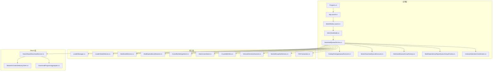
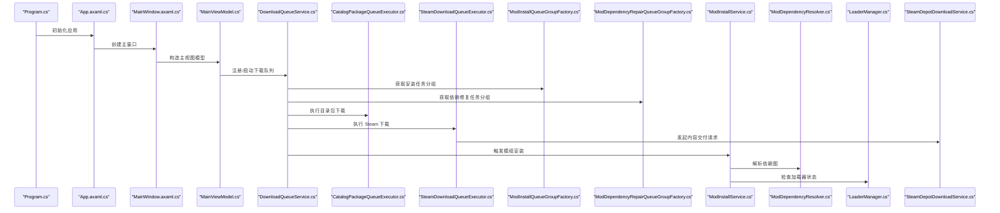
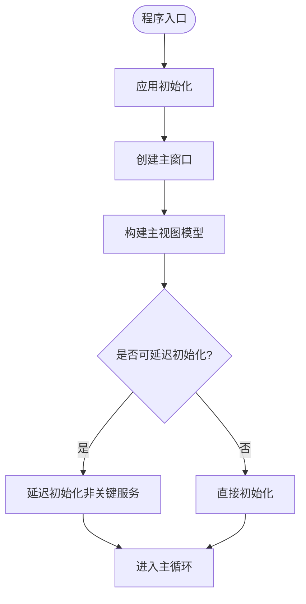
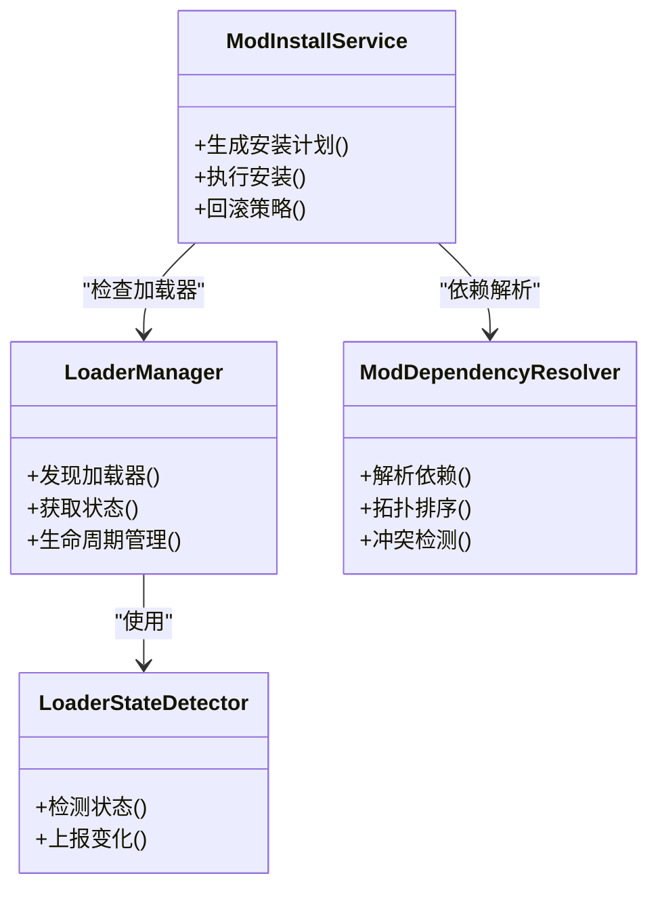
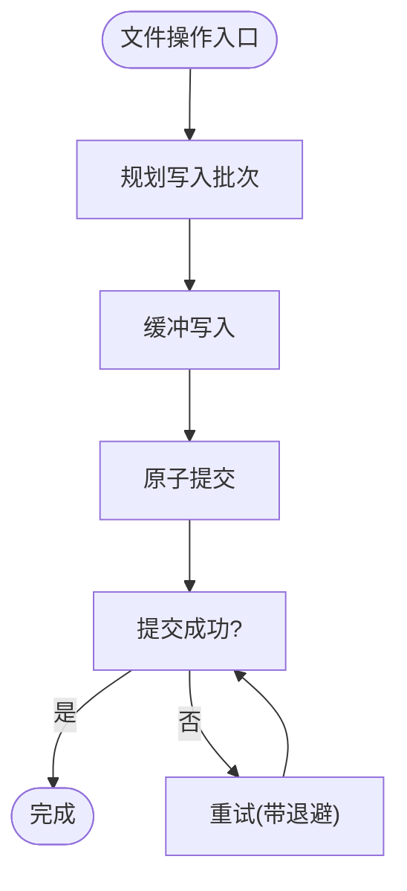
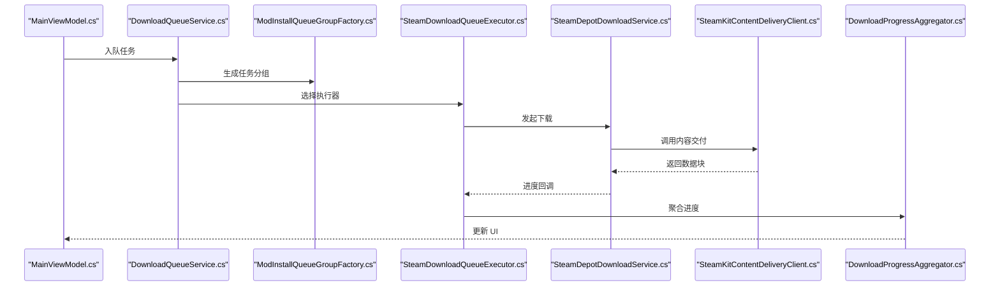
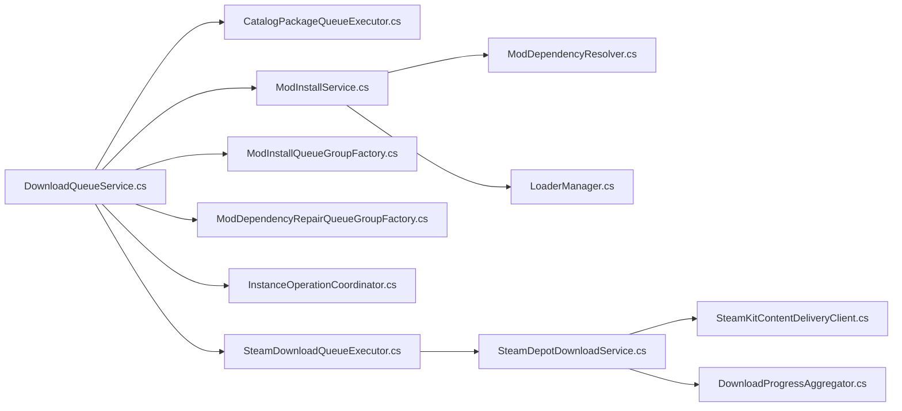

# 性能问题和优化

<cite>
**本文引用的文件**   
- [Program.cs](file://src/Crystalfly.App/Program.cs)
- [App.axaml.cs](file://src/Crystalfly.App/App.axaml.cs)
- [MainWindow.axaml.cs](file://src/Crystalfly.App/Views/MainWindow.axaml.cs)
- [MainViewModel.cs](file://src/Crystalfly.App/ViewModels/MainViewModel.cs)
- [DownloadQueueService.cs](file://src/Crystalfly.App/Downloads/DownloadQueueService.cs)
- [CatalogPackageQueueExecutor.cs](file://src/Crystalfly.App/Downloads/CatalogPackageQueueExecutor.cs)
- [SteamDownloadQueueExecutor.cs](file://src/Crystalfly.App/Downloads/SteamDownloadQueueExecutor.cs)
- [ModInstallQueueGroupFactory.cs](file://src/Crystalfly.App/Downloads/ModInstallQueueGroupFactory.cs)
- [ModDependencyRepairQueueGroupFactory.cs](file://src/Crystalfly.App/Downloads/ModDependencyRepairQueueGroupFactory.cs)
- [InstanceOperationCoordinator.cs](file://src/Crystalfly.App/Downloads/InstanceOperationCoordinator.cs)
- [LoaderManager.cs](file://src/Crystalfly.Core/Loaders/LoaderManager.cs)
- [LoaderStateDetector.cs](file://src/Crystalfly.Core/Loaders/LoaderStateDetector.cs)
- [ModInstallService.cs](file://src/Crystalfly.Core/Mods/ModInstallService.cs)
- [ModDependencyResolver.cs](file://src/Crystalfly.Core/Mods/ModDependencyResolver.cs)
- [CrystalflySettingsStore.cs](file://src/Crystalfly.Core/Configuration/CrystalflySettingsStore.cs)
- [AtomicJsonStore.cs](file://src/Crystalfly.Core/Serialization/AtomicJsonStore.cs)
- [CrystalflyPaths.cs](file://src/Crystalfly.Core/Configuration/CrystalflyPaths.cs)
- [VersionDirectoryScanner.cs](file://src/Crystalfly.Core/Instances/VersionDirectoryScanner.cs)
- [NamedSnapshotService.cs](file://src/Crystalfly.Core/Snapshots/NamedSnapshotService.cs)
- [FileTransaction.cs](file://src/Crystalfly.Core/Transactions/FileTransaction.cs)
- [SteamDepotDownloadService.cs](file://src/Crystalfly.Steam/Downloads/SteamDepotDownloadService.cs)
- [SteamKitContentDeliveryClient.cs](file://src/Crystalfly.Steam/Downloads/SteamKitContentDeliveryClient.cs)
- [DownloadProgressAggregator.cs](file://src/Crystalfly.Steam/Downloads/DownloadProgressAggregator.cs)
</cite>

## 目录
1. [简介](#简介)
2. [项目结构](#项目结构)
3. [核心组件](#核心组件)
4. [架构总览](#架构总览)
5. [详细组件分析](#详细组件分析)
6. [依赖关系分析](#依赖关系分析)
7. [性能考量](#性能考量)
8. [故障排查指南](#故障排查指南)
9. [结论](#结论)
10. [附录](#附录)

## 简介
本指南面向 Crystalfly 的性能问题诊断与优化，聚焦以下目标：
- 应用程序启动缓慢的分析与优化方法
- 模组加载性能瓶颈的识别与解决方案
- 内存使用异常的检测与泄漏定位技巧
- CPU 使用率过高的排查步骤与优化建议
- 磁盘 I/O 性能监控与文件系统操作优化
- 下载队列性能调优与资源管理最佳实践

## 项目结构
Crystalfly 采用分层与模块化组织方式：
- App 层负责 UI、应用生命周期、下载队列编排与用户交互
- Core 层提供模组安装、依赖解析、实例管理、序列化、快照、事务等核心能力
- Steam 层封装 Steam 内容分发客户端与下载进度聚合

图表来源
- [Program.cs](file://src/Crystalfly.App/Program.cs)
- [App.axaml.cs](file://src/Crystalfly.App/App.axaml.cs)
- [MainWindow.axaml.cs](file://src/Crystalfly.App/Views/MainWindow.axaml.cs)
- [MainViewModel.cs](file://src/Crystalfly.App/ViewModels/MainViewModel.cs)
- [DownloadQueueService.cs](file://src/Crystalfly.App/Downloads/DownloadQueueService.cs)
- [CatalogPackageQueueExecutor.cs](file://src/Crystalfly.App/Downloads/CatalogPackageQueueExecutor.cs)
- [SteamDownloadQueueExecutor.cs](file://src/Crystalfly.App/Downloads/SteamDownloadQueueExecutor.cs)
- [ModInstallQueueGroupFactory.cs](file://src/Crystalfly.App/Downloads/ModInstallQueueGroupFactory.cs)
- [ModDependencyRepairQueueGroupFactory.cs](file://src/Crystalfly.App/Downloads/ModDependencyRepairQueueGroupFactory.cs)
- [InstanceOperationCoordinator.cs](file://src/Crystalfly.App/Downloads/InstanceOperationCoordinator.cs)
- [LoaderManager.cs](file://src/Crystalfly.Core/Loaders/LoaderManager.cs)
- [LoaderStateDetector.cs](file://src/Crystalfly.Core/Loaders/LoaderStateDetector.cs)
- [ModInstallService.cs](file://src/Crystalfly.Core/Mods/ModInstallService.cs)
- [ModDependencyResolver.cs](file://src/Crystalfly.Core/Mods/ModDependencyResolver.cs)
- [CrystalflySettingsStore.cs](file://src/Crystalfly.Core/Configuration/CrystalflySettingsStore.cs)
- [AtomicJsonStore.cs](file://src/Crystalfly.Core/Serialization/AtomicJsonStore.cs)
- [CrystalflyPaths.cs](file://src/Crystalfly.Core/Configuration/CrystalflyPaths.cs)
- [VersionDirectoryScanner.cs](file://src/Crystalfly.Core/Instances/VersionDirectoryScanner.cs)
- [NamedSnapshotService.cs](file://src/Crystalfly.Core/Snapshots/NamedSnapshotService.cs)
- [FileTransaction.cs](file://src/Crystalfly.Core/Transactions/FileTransaction.cs)
- [SteamDepotDownloadService.cs](file://src/Crystalfly.Steam/Downloads/SteamDepotDownloadService.cs)
- [SteamKitContentDeliveryClient.cs](file://src/Crystalfly.Steam/Downloads/SteamKitContentDeliveryClient.cs)
- [DownloadProgressAggregator.cs](file://src/Crystalfly.Steam/Downloads/DownloadProgressAggregator.cs)

章节来源
- [Program.cs](file://src/Crystalfly.App/Program.cs)
- [App.axaml.cs](file://src/Crystalfly.App/App.axaml.cs)
- [MainWindow.axaml.cs](file://src/Crystalfly.App/Views/MainWindow.axaml.cs)
- [MainViewModel.cs](file://src/Crystalfly.App/ViewModels/MainViewModel.cs)
- [DownloadQueueService.cs](file://src/Crystalfly.App/Downloads/DownloadQueueService.cs)

## 核心组件
- 应用启动链：Program -> App -> MainWindow -> MainViewModel，负责初始化配置、UI 与主视图模型。
- 下载队列服务：协调多种执行器（目录包、Steam）与组工厂（模组安装、依赖修复），并协调实例操作。
- 模组安装与依赖解析：ModInstallService 与 ModDependencyResolver 共同完成安装计划与依赖图计算。
- 加载器管理：LoaderManager 与 LoaderStateDetector 负责加载器发现、状态检测与生命周期管理。
- 持久化与路径：CrystalflySettingsStore、AtomicJsonStore、CrystalflyPaths 提供设置与原子写入能力。
- 实例与快照：VersionDirectoryScanner、NamedSnapshotService 扫描版本目录与命名快照。
- Steam 下载：SteamDepotDownloadService 通过 SteamKitContentDeliveryClient 进行内容交付，DownloadProgressAggregator 汇总进度。

章节来源
- [DownloadQueueService.cs](file://src/Crystalfly.App/Downloads/DownloadQueueService.cs)
- [ModInstallService.cs](file://src/Crystalfly.Core/Mods/ModInstallService.cs)
- [ModDependencyResolver.cs](file://src/Crystalfly.Core/Mods/ModDependencyResolver.cs)
- [LoaderManager.cs](file://src/Crystalfly.Core/Loaders/LoaderManager.cs)
- [LoaderStateDetector.cs](file://src/Crystalfly.Core/Loaders/LoaderStateDetector.cs)
- [CrystalflySettingsStore.cs](file://src/Crystalfly.Core/Configuration/CrystalflySettingsStore.cs)
- [AtomicJsonStore.cs](file://src/Crystalfly.Core/Serialization/AtomicJsonStore.cs)
- [CrystalflyPaths.cs](file://src/Crystalfly.Core/Configuration/CrystalflyPaths.cs)
- [VersionDirectoryScanner.cs](file://src/Crystalfly.Core/Instances/VersionDirectoryScanner.cs)
- [NamedSnapshotService.cs](file://src/Crystalfly.Core/Snapshots/NamedSnapshotService.cs)
- [SteamDepotDownloadService.cs](file://src/Crystalfly.Steam/Downloads/SteamDepotDownloadService.cs)
- [SteamKitContentDeliveryClient.cs](file://src/Crystalfly.Steam/Downloads/SteamKitContentDeliveryClient.cs)
- [DownloadProgressAggregator.cs](file://src/Crystalfly.Steam/Downloads/DownloadProgressAggregator.cs)

## 架构总览
下图展示从应用启动到下载执行的端到端流程，以及关键子系统间的调用关系。

图表来源
- [Program.cs](file://src/Crystalfly.App/Program.cs)
- [App.axaml.cs](file://src/Crystalfly.App/App.axaml.cs)
- [MainWindow.axaml.cs](file://src/Crystalfly.App/Views/MainWindow.axaml.cs)
- [MainViewModel.cs](file://src/Crystalfly.App/ViewModels/MainViewModel.cs)
- [DownloadQueueService.cs](file://src/Crystalfly.App/Downloads/DownloadQueueService.cs)
- [CatalogPackageQueueExecutor.cs](file://src/Crystalfly.App/Downloads/CatalogPackageQueueExecutor.cs)
- [SteamDownloadQueueExecutor.cs](file://src/Crystalfly.App/Downloads/SteamDownloadQueueExecutor.cs)
- [ModInstallQueueGroupFactory.cs](file://src/Crystalfly.App/Downloads/ModInstallQueueGroupFactory.cs)
- [ModDependencyRepairQueueGroupFactory.cs](file://src/Crystalfly.App/Downloads/ModDependencyRepairQueueGroupFactory.cs)
- [ModInstallService.cs](file://src/Crystalfly.Core/Mods/ModInstallService.cs)
- [ModDependencyResolver.cs](file://src/Crystalfly.Core/Mods/ModDependencyResolver.cs)
- [LoaderManager.cs](file://src/Crystalfly.Core/Loaders/LoaderManager.cs)
- [SteamDepotDownloadService.cs](file://src/Crystalfly.Steam/Downloads/SteamDepotDownloadService.cs)

## 详细组件分析

### 应用启动链路分析与优化
- 启动阶段职责划分
  - Program：进程入口，最小化初始化
  - App：应用级初始化（主题、配置、日志等）
  - MainWindow：创建主界面
  - MainViewModel：构建业务上下文与下载队列
- 常见慢点
  - 同步阻塞初始化（如读取大量配置或扫描目录）
  - UI 线程上执行耗时任务
  - 过早实例化重型服务
- 优化策略
  - 延迟初始化：按需加载模块与服务
  - 异步预热：在后台线程预取必要数据
  - 并行化：对独立子任务进行并发处理
  - 减少首屏渲染负担：拆分视图模型初始化

章节来源
- [Program.cs](file://src/Crystalfly.App/Program.cs)
- [App.axaml.cs](file://src/Crystalfly.App/App.axaml.cs)
- [MainWindow.axaml.cs](file://src/Crystalfly.App/Views/MainWindow.axaml.cs)
- [MainViewModel.cs](file://src/Crystalfly.App/ViewModels/MainViewModel.cs)

### 模组加载性能瓶颈识别与解决
- 关键组件
  - LoaderManager：加载器发现与管理
  - LoaderStateDetector：加载器状态检测
  - ModInstallService：模组安装与校验
  - ModDependencyResolver：依赖图解析
- 典型瓶颈
  - 重复扫描与状态检测
  - 大依赖图的深度优先/广度优先遍历开销
  - 安装过程中的文件锁竞争与重试风暴
- 优化建议
  - 缓存加载器清单与状态，增量更新
  - 依赖解析结果缓存，避免重复计算
  - 批量文件操作合并，减少系统调用
  - 限制并发度，避免锁争用与抖动

图表来源
- [LoaderManager.cs](file://src/Crystalfly.Core/Loaders/LoaderManager.cs)
- [LoaderStateDetector.cs](file://src/Crystalfly.Core/Loaders/LoaderStateDetector.cs)
- [ModInstallService.cs](file://src/Crystalfly.Core/Mods/ModInstallService.cs)
- [ModDependencyResolver.cs](file://src/Crystalfly.Core/Mods/ModDependencyResolver.cs)

章节来源
- [LoaderManager.cs](file://src/Crystalfly.Core/Loaders/LoaderManager.cs)
- [LoaderStateDetector.cs](file://src/Crystalfly.Core/Loaders/LoaderStateDetector.cs)
- [ModInstallService.cs](file://src/Crystalfly.Core/Mods/ModInstallService.cs)
- [ModDependencyResolver.cs](file://src/Crystalfly.Core/Mods/ModDependencyResolver.cs)

### 内存使用异常检测与泄漏定位
- 关注点
  - 长时间运行的下载与快照服务可能持有大对象引用
  - 事件订阅未释放导致 GC 无法回收
  - 流式 I/O 未正确释放句柄
- 检测方法
  - 使用堆快照对比，观察增长趋势
  - 跟踪热点分配路径（如字符串拼接、集合扩容）
  - 审查长生命周期对象的订阅与回调
- 定位技巧
  - 为关键服务添加弱引用容器，避免意外保持
  - 确保 IDisposable 模式正确实现与调用
  - 对大数据集采用分块处理与流式读写

章节来源
- [NamedSnapshotService.cs](file://src/Crystalfly.Core/Snapshots/NamedSnapshotService.cs)
- [DownloadQueueService.cs](file://src/Crystalfly.App/Downloads/DownloadQueueService.cs)

### CPU 使用率过高排查与优化
- 常见原因
  - 频繁轮询与无退避的重试逻辑
  - 密集的文件扫描与 JSON 序列化
  - UI 线程上的重计算
- 优化手段
  - 引入指数退避与最大重试次数
  - 批量化与节流：合并小写操作、降低刷新频率
  - 将重计算移至后台线程，使用不可变数据结构减少锁

章节来源
- [AtomicJsonStore.cs](file://src/Crystalfly.Core/Serialization/AtomicJsonStore.cs)
- [VersionDirectoryScanner.cs](file://src/Crystalfly.Core/Instances/VersionDirectoryScanner.cs)

### 磁盘 I/O 监控与文件系统操作优化
- 监控指标
  - 磁盘队列长度、平均响应时间、吞吐
  - 文件句柄数量与打开时长
- 优化策略
  - 顺序写入与缓冲合并，减少随机写放大
  - 使用原子写入保障一致性同时降低碎片
  - 合理设置缓冲区大小与并发度
  - 避免在热路径上进行全量扫描，改为增量索引

图表来源
- [AtomicJsonStore.cs](file://src/Crystalfly.Core/Serialization/AtomicJsonStore.cs)
- [FileTransaction.cs](file://src/Crystalfly.Core/Transactions/FileTransaction.cs)
- [CrystalflyPaths.cs](file://src/Crystalfly.Core/Configuration/CrystalflyPaths.cs)

章节来源
- [AtomicJsonStore.cs](file://src/Crystalfly.Core/Serialization/AtomicJsonStore.cs)
- [FileTransaction.cs](file://src/Crystalfly.Core/Transactions/FileTransaction.cs)
- [CrystalflyPaths.cs](file://src/Crystalfly.Core/Configuration/CrystalflyPaths.cs)

### 下载队列性能调优与资源管理
- 关键角色
  - DownloadQueueService：队列调度与生命周期
  - CatalogPackageQueueExecutor / SteamDownloadQueueExecutor：具体执行器
  - ModInstallQueueGroupFactory / ModDependencyRepairQueueGroupFactory：任务分组
  - InstanceOperationCoordinator：实例操作协调
  - SteamDepotDownloadService / SteamKitContentDeliveryClient：底层下载
  - DownloadProgressAggregator：进度聚合
- 调优点
  - 并发度上限：根据网络与磁盘能力动态调整
  - 背压与限流：防止下游过载
  - 失败重试与去重：避免重复下载
  - 资源池：连接池、临时文件清理
- 最佳实践
  - 按优先级分组执行，保证关键任务优先
  - 进度反馈与取消支持，提升用户体验
  - 监控队列积压与执行时延，自动降级

图表来源
- [MainViewModel.cs](file://src/Crystalfly.App/ViewModels/MainViewModel.cs)
- [DownloadQueueService.cs](file://src/Crystalfly.App/Downloads/DownloadQueueService.cs)
- [ModInstallQueueGroupFactory.cs](file://src/Crystalfly.App/Downloads/ModInstallQueueGroupFactory.cs)
- [SteamDownloadQueueExecutor.cs](file://src/Crystalfly.App/Downloads/SteamDownloadQueueExecutor.cs)
- [SteamDepotDownloadService.cs](file://src/Crystalfly.Steam/Downloads/SteamDepotDownloadService.cs)
- [SteamKitContentDeliveryClient.cs](file://src/Crystalfly.Steam/Downloads/SteamKitContentDeliveryClient.cs)
- [DownloadProgressAggregator.cs](file://src/Crystalfly.Steam/Downloads/DownloadProgressAggregator.cs)

章节来源
- [DownloadQueueService.cs](file://src/Crystalfly.App/Downloads/DownloadQueueService.cs)
- [CatalogPackageQueueExecutor.cs](file://src/Crystalfly.App/Downloads/CatalogPackageQueueExecutor.cs)
- [SteamDownloadQueueExecutor.cs](file://src/Crystalfly.App/Downloads/SteamDownloadQueueExecutor.cs)
- [ModInstallQueueGroupFactory.cs](file://src/Crystalfly.App/Downloads/ModInstallQueueGroupFactory.cs)
- [ModDependencyRepairQueueGroupFactory.cs](file://src/Crystalfly.App/Downloads/ModDependencyRepairQueueGroupFactory.cs)
- [InstanceOperationCoordinator.cs](file://src/Crystalfly.App/Downloads/InstanceOperationCoordinator.cs)
- [SteamDepotDownloadService.cs](file://src/Crystalfly.Steam/Downloads/SteamDepotDownloadService.cs)
- [SteamKitContentDeliveryClient.cs](file://src/Crystalfly.Steam/Downloads/SteamKitContentDeliveryClient.cs)
- [DownloadProgressAggregator.cs](file://src/Crystalfly.Steam/Downloads/DownloadProgressAggregator.cs)

## 依赖关系分析
- 组件耦合
  - 下载队列服务对执行器与组工厂存在强依赖，需通过接口抽象降低耦合
  - 模组安装服务依赖依赖解析与加载器管理，形成安装前校验闭环
- 外部集成
  - Steam 内容交付通过客户端库访问，需关注超时、重试与速率限制
- 潜在环依赖
  - 注意视图模型与服务之间的双向通知，建议使用事件或消息总线解耦

图表来源
- [DownloadQueueService.cs](file://src/Crystalfly.App/Downloads/DownloadQueueService.cs)
- [CatalogPackageQueueExecutor.cs](file://src/Crystalfly.App/Downloads/CatalogPackageQueueExecutor.cs)
- [SteamDownloadQueueExecutor.cs](file://src/Crystalfly.App/Downloads/SteamDownloadQueueExecutor.cs)
- [ModInstallQueueGroupFactory.cs](file://src/Crystalfly.App/Downloads/ModInstallQueueGroupFactory.cs)
- [ModDependencyRepairQueueGroupFactory.cs](file://src/Crystalfly.App/Downloads/ModDependencyRepairQueueGroupFactory.cs)
- [InstanceOperationCoordinator.cs](file://src/Crystalfly.App/Downloads/InstanceOperationCoordinator.cs)
- [ModInstallService.cs](file://src/Crystalfly.Core/Mods/ModInstallService.cs)
- [ModDependencyResolver.cs](file://src/Crystalfly.Core/Mods/ModDependencyResolver.cs)
- [LoaderManager.cs](file://src/Crystalfly.Core/Loaders/LoaderManager.cs)
- [SteamDepotDownloadService.cs](file://src/Crystalfly.Steam/Downloads/SteamDepotDownloadService.cs)
- [SteamKitContentDeliveryClient.cs](file://src/Crystalfly.Steam/Downloads/SteamKitContentDeliveryClient.cs)
- [DownloadProgressAggregator.cs](file://src/Crystalfly.Steam/Downloads/DownloadProgressAggregator.cs)

章节来源
- [DownloadQueueService.cs](file://src/Crystalfly.App/Downloads/DownloadQueueService.cs)
- [ModInstallService.cs](file://src/Crystalfly.Core/Mods/ModInstallService.cs)
- [LoaderManager.cs](file://src/Crystalfly.Core/Loaders/LoaderManager.cs)
- [SteamDepotDownloadService.cs](file://src/Crystalfly.Steam/Downloads/SteamDepotDownloadService.cs)

## 性能考量
- 启动性能
  - 延迟初始化非关键服务，减少首帧耗时
  - 将配置与路径解析结果缓存
- 模组加载
  - 缓存加载器清单与状态，增量更新
  - 依赖解析结果缓存，避免重复计算
- 内存管理
  - 避免长生命周期对象持有短生命周期数据
  - 正确使用流式 I/O 与资源释放
- CPU 使用
  - 控制轮询频率，引入退避与节流
  - 批量化与合并操作，减少系统调用
- 磁盘 I/O
  - 顺序写入与原子提交，降低碎片
  - 合理设置缓冲区与并发度
- 下载队列
  - 动态并发度与背压
  - 失败重试去重与进度聚合

[本节为通用指导，不直接分析具体文件]

## 故障排查指南
- 启动缓慢
  - 检查应用初始化与视图模型构建路径中的同步阻塞点
  - 使用性能剖析工具定位热点函数
- 模组加载卡顿
  - 查看加载器状态检测频率与依赖解析复杂度
  - 确认是否存在大量文件锁竞争
- 内存异常
  - 采集堆快照，对比关键操作前后差异
  - 检查事件订阅与长生命周期对象引用
- CPU 过高
  - 监控线程占用与热点方法
  - 审查重试与轮询逻辑，增加退避
- 磁盘 I/O 瓶颈
  - 观察磁盘队列与响应时间
  - 评估写入批量化与原子提交策略
- 下载队列问题
  - 监控队列积压、执行时延与失败率
  - 检查并发度、限速与重试策略

章节来源
- [DownloadQueueService.cs](file://src/Crystalfly.App/Downloads/DownloadQueueService.cs)
- [LoaderManager.cs](file://src/Crystalfly.Core/Loaders/LoaderManager.cs)
- [LoaderStateDetector.cs](file://src/Crystalfly.Core/Loaders/LoaderStateDetector.cs)
- [AtomicJsonStore.cs](file://src/Crystalfly.Core/Serialization/AtomicJsonStore.cs)
- [VersionDirectoryScanner.cs](file://src/Crystalfly.Core/Instances/VersionDirectoryScanner.cs)
- [NamedSnapshotService.cs](file://src/Crystalfly.Core/Snapshots/NamedSnapshotService.cs)
- [SteamDepotDownloadService.cs](file://src/Crystalfly.Steam/Downloads/SteamDepotDownloadService.cs)

## 结论
通过对启动链路、模组加载、内存与 CPU、磁盘 I/O 以及下载队列的系统性分析与优化，可以显著提升 Crystalfly 的整体性能与稳定性。建议在生产环境持续监控关键指标，结合性能剖析与回归测试，确保优化效果可持续。

[本节为总结，不直接分析具体文件]

## 附录
- 常用监控指标
  - 启动耗时、首次交互时间
  - 模组加载时延、依赖解析耗时
  - 内存峰值与 GC 暂停
  - CPU 占用分布、热点方法
  - 磁盘队列长度、I/O 吞吐
  - 下载队列积压、成功率与时延
- 推荐工具
  - 性能剖析器（CPU/内存）、磁盘监控、网络抓包
  - 日志与结构化追踪，便于定位问题

[本节为补充信息，不直接分析具体文件]