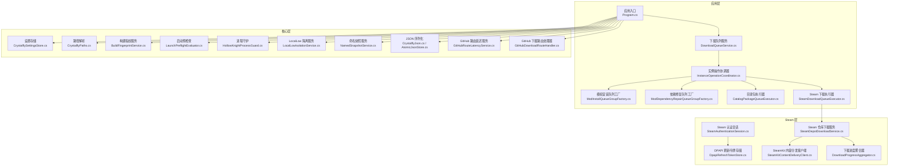
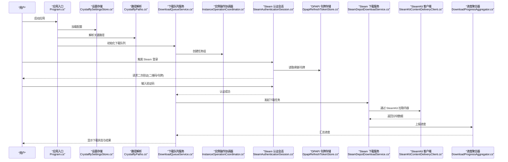
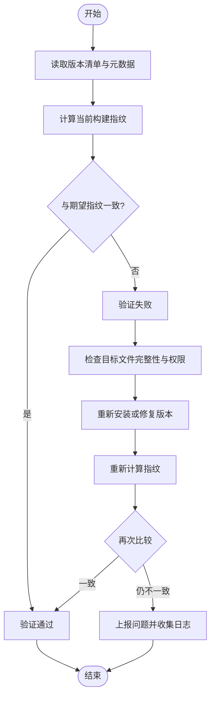
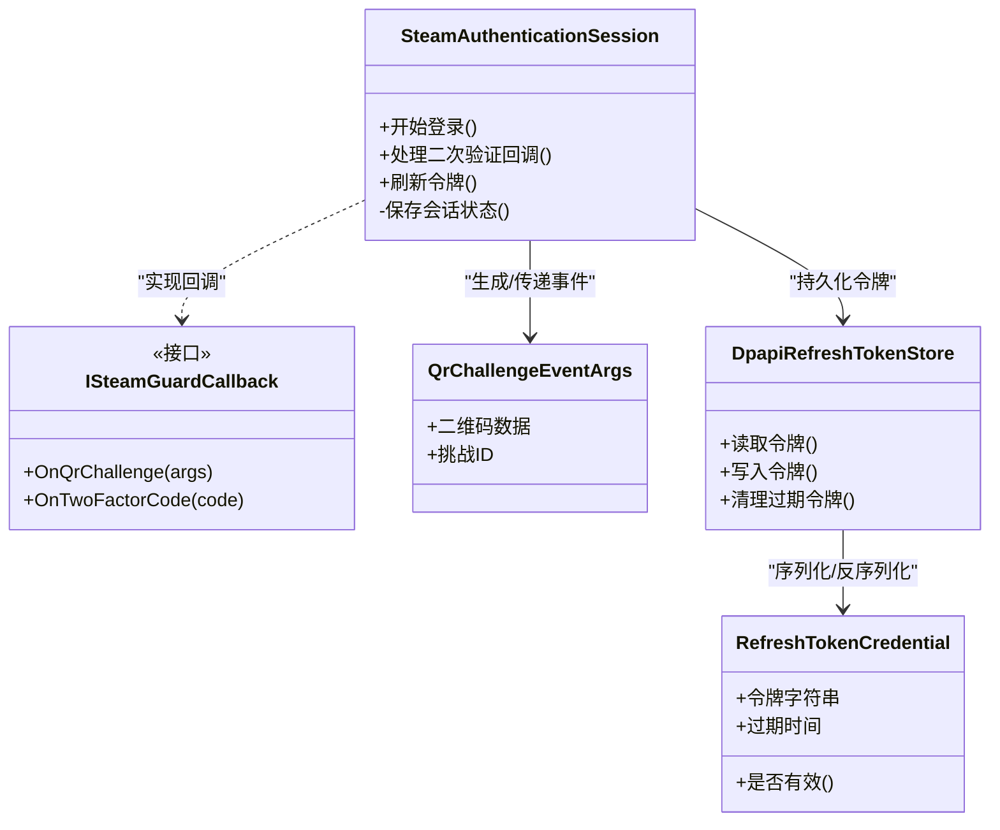
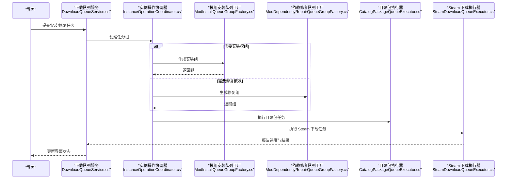
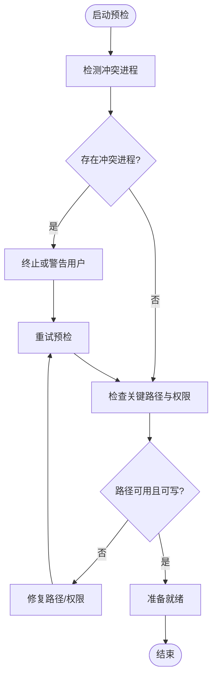
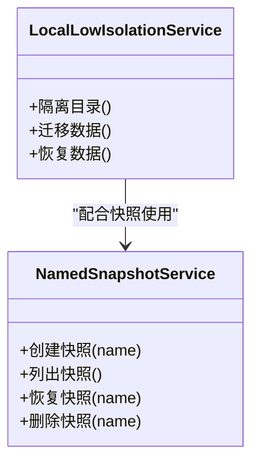
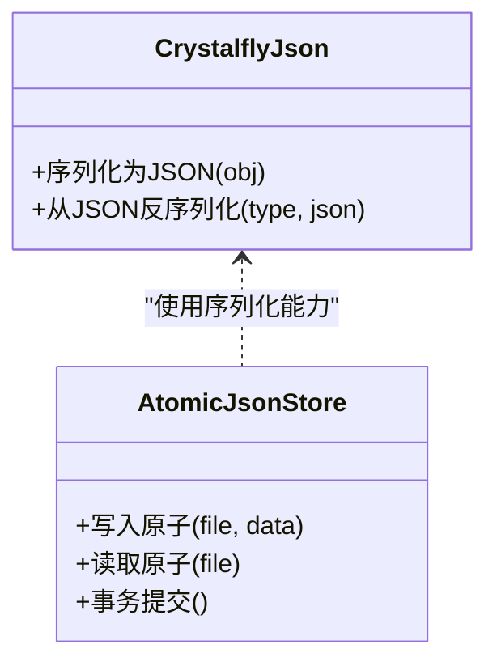
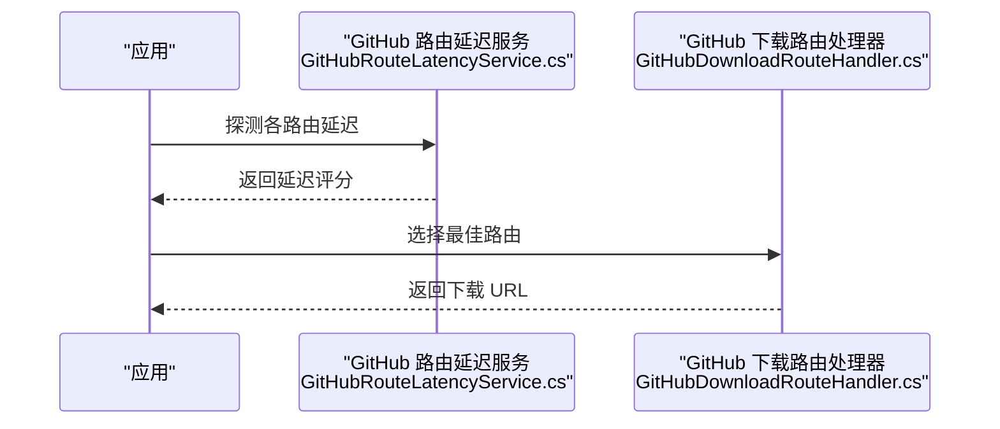
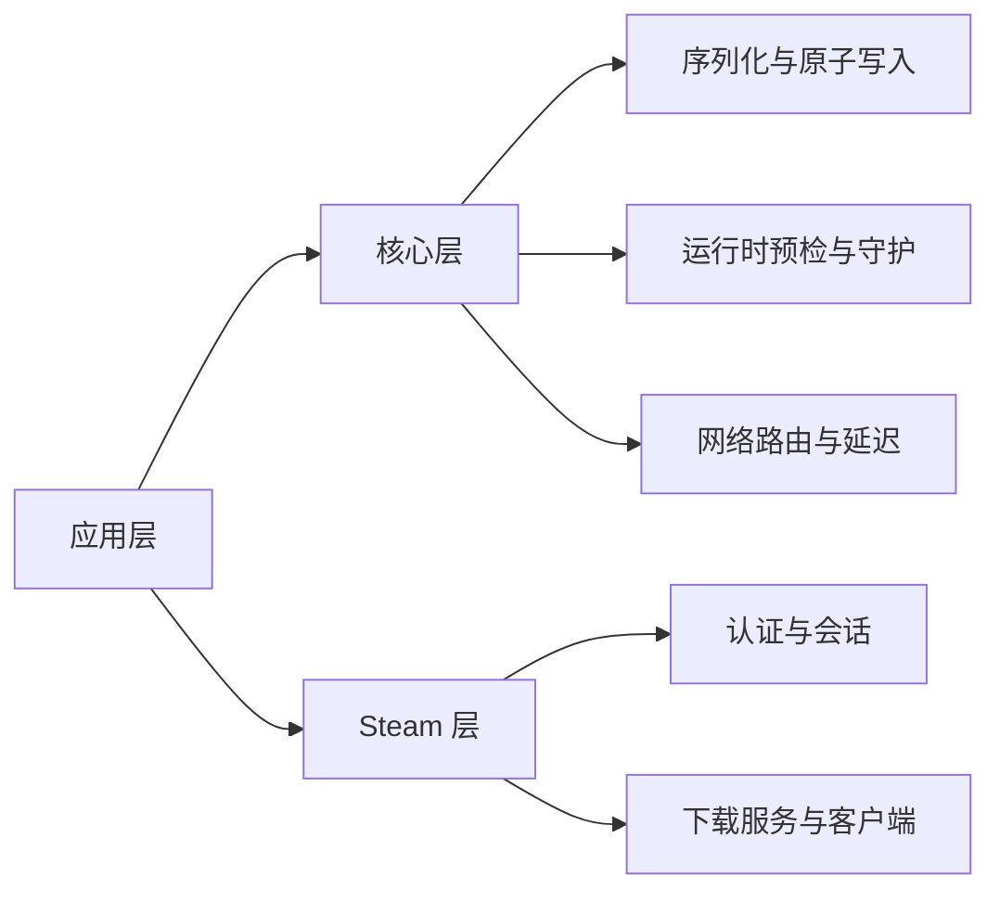

# 故障排除

<cite>
**本文引用的文件**   
- [Program.cs](file://src/Crystalfly.App/Program.cs)
- [App.axaml.cs](file://src/Crystalfly.App/App.axaml.cs)
- [CrystalflySettingsStore.cs](file://src/Crystalfly.Core/Configuration/CrystalflySettingsStore.cs)
- [CrystalflyPaths.cs](file://src/Crystalfly.Core/Configuration/CrystalflyPaths.cs)
- [BuildFingerprintService.cs](file://src/Crystalfly.Core/Instances/BuildFingerprintService.cs)
- [BuildFingerprint.cs](file://src/Crystalfly.Core/Models/BuildFingerprint.cs)
- [SteamAuthenticationSession.cs](file://src/Crystalfly.Steam/Authentication/SteamAuthenticationSession.cs)
- [ISteamGuardCallback.cs](file://src/Crystalfly.Steam/Authentication/ISteamGuardCallback.cs)
- [QrChallengeEventArgs.cs](file://src/Crystalfly.Steam/Authentication/QrChallengeEventArgs.cs)
- [DpapiRefreshTokenStore.cs](file://src/Crystalfly.Steam/Security/DpapiRefreshTokenStore.cs)
- [RefreshTokenCredential.cs](file://src/Crystalfly.Steam/Security/RefreshTokenCredential.cs)
- [SteamDepotDownloadService.cs](file://src/Crystalfly.Steam/Downloads/SteamDepotDownloadService.cs)
- [SteamKitContentDeliveryClient.cs](file://src/Crystalfly.Steam/Downloads/SteamKitContentDeliveryClient.cs)
- [DownloadProgressAggregator.cs](file://src/Crystalfly.Steam/Downloads/DownloadProgressAggregator.cs)
- [CatalogPackageQueueExecutor.cs](file://src/Crystalfly.App/Downloads/CatalogPackageQueueExecutor.cs)
- [DownloadQueueService.cs](file://src/Crystalfly.App/Downloads/DownloadQueueService.cs)
- [InstanceOperationCoordinator.cs](file://src/Crystalfly.App/Downloads/InstanceOperationCoordinator.cs)
- [ModInstallQueueGroupFactory.cs](file://src/Crystalfly.App/Downloads/ModInstallQueueGroupFactory.cs)
- [ModDependencyRepairQueueGroupFactory.cs](file://src/Crystalfly.App/Downloads/ModDependencyRepairQueueGroupFactory.cs)
- [SteamDownloadQueueExecutor.cs](file://src/Crystalfly.App/Downloads/SteamDownloadQueueExecutor.cs)
- [LaunchPreflightEvaluator.cs](file://src/Crystalfly.Core/Runtime/LaunchPreflightEvaluator.cs)
- [HollowKnightProcessGuard.cs](file://src/Crystalfly.Core/Runtime/HollowKnightProcessGuard.cs)
- [LocalLowIsolationService.cs](file://src/Crystalfly.Core/LocalLow/LocalLowIsolationService.cs)
- [NamedSnapshotService.cs](file://src/Crystalffly.Core/Snapshots/NamedSnapshotService.cs)
- [AtomicJsonStore.cs](file://src/Crystalfly.Core/Serialization/AtomicJsonStore.cs)
- [CrystalflyJson.cs](file://src/Crystalfly.Core/Serialization/CrystalflyJson.cs)
- [GitHubRouteLatencyService.cs](file://src/Crystalfly.Core/Networking/GitHubRouteLatencyService.cs)
- [GitHubDownloadRouteHandler.cs](file://src/Crystalfly.Core/Networking/GitHubDownloadRouteHandler.cs)
- [Crystalfly.iss](file://installer/Crystalfly.iss)
</cite>

## 目录
1. [简介](#简介)
2. [项目结构](#项目结构)
3. [核心组件](#核心组件)
4. [架构总览](#架构总览)
5. [详细组件分析](#详细组件分析)
6. [依赖关系分析](#依赖关系分析)
7. [性能考虑](#性能考虑)
8. [故障排除指南](#故障排除指南)
9. [结论](#结论)
10. [附录](#附录)

## 简介
本指南面向 Crystalfly 用户与维护者，聚焦于安装、配置、运行异常、构建指纹验证失败、Steam 认证问题、性能与资源使用、网络与权限、注册表错误等常见问题的诊断与修复。文档同时提供日志分析方法、调试技巧以及系统兼容性与依赖项验证流程，帮助快速定位并解决问题。

## 项目结构
Crystalfly 采用分层模块化设计：
- 应用层（App）：负责 UI、下载队列编排、实例操作协调、与 Steam 下载的集成。
- 核心层（Core）：提供配置、实例管理、模组安装与依赖解析、运行时预检、快照、序列化、网络路由延迟评估等能力。
- Steam 层（Steam）：封装 Steam 认证、令牌存储、内容分发客户端与下载服务。

图表来源
- [Program.cs:1-200](file://src/Crystalfly.App/Program.cs#L1-L200)
- [DownloadQueueService.cs:1-200](file://src/Crystalfly.App/Downloads/DownloadQueueService.cs#L1-L200)
- [InstanceOperationCoordinator.cs:1-200](file://src/Crystalfly.App/Downloads/InstanceOperationCoordinator.cs#L1-L200)
- [ModInstallQueueGroupFactory.cs:1-200](file://src/Crystalfly.App/Downloads/ModInstallQueueGroupFactory.cs#L1-L200)
- [ModDependencyRepairQueueGroupFactory.cs:1-200](file://src/Crystalfly.App/Downloads/ModDependencyRepairQueueGroupFactory.cs#L1-L200)
- [CatalogPackageQueueExecutor.cs:1-200](file://src/Crystalfly.App/Downloads/CatalogPackageQueueExecutor.cs#L1-L200)
- [SteamDownloadQueueExecutor.cs:1-200](file://src/Crystalfly.App/Downloads/SteamDownloadQueueExecutor.cs#L1-L200)
- [CrystalflySettingsStore.cs:1-200](file://src/Crystalfly.Core/Configuration/CrystalflySettingsStore.cs#L1-L200)
- [CrystalflyPaths.cs:1-200](file://src/Crystalfly.Core/Configuration/CrystalflyPaths.cs#L1-L200)
- [BuildFingerprintService.cs:1-200](file://src/Crystalfly.Core/Instances/BuildFingerprintService.cs#L1-L200)
- [LaunchPreflightEvaluator.cs:1-200](file://src/Crystalfly.Core/Runtime/LaunchPreflightEvaluator.cs#L1-L200)
- [HollowKnightProcessGuard.cs:1-200](file://src/Crystalfly.Core/Runtime/HollowKnightProcessGuard.cs#L1-L200)
- [LocalLowIsolationService.cs:1-200](file://src/Crystalfly.Core/LocalLow/LocalLowIsolationService.cs#L1-L200)
- [NamedSnapshotService.cs:1-200](file://src/Crystalfly.Core/Snapshots/NamedSnapshotService.cs#L1-L200)
- [CrystalflyJson.cs:1-200](file://src/Crystalfly.Core/Serialization/CrystalflyJson.cs#L1-L200)
- [AtomicJsonStore.cs:1-200](file://src/Crystalfly.Core/Serialization/AtomicJsonStore.cs#L1-L200)
- [GitHubRouteLatencyService.cs:1-200](file://src/Crystalfly.Core/Networking/GitHubRouteLatencyService.cs#L1-L200)
- [GitHubDownloadRouteHandler.cs:1-200](file://src/Crystalfly.Core/Networking/GitHubDownloadRouteHandler.cs#L1-L200)
- [SteamAuthenticationSession.cs:1-200](file://src/Crystalfly.Steam/Authentication/SteamAuthenticationSession.cs#L1-L200)
- [DpapiRefreshTokenStore.cs:1-200](file://src/Crystalfly.Steam/Security/DpapiRefreshTokenStore.cs#L1-L200)
- [SteamDepotDownloadService.cs:1-200](file://src/Crystalfly.Steam/Downloads/SteamDepotDownloadService.cs#L1-L200)
- [SteamKitContentDeliveryClient.cs:1-200](file://src/Crystalfly.Steam/Downloads/SteamKitContentDeliveryClient.cs#L1-L200)
- [DownloadProgressAggregator.cs:1-200](file://src/Crystalfly.Steam/Downloads/DownloadProgressAggregator.cs#L1-L200)

章节来源
- [Program.cs:1-200](file://src/Crystalfly.App/Program.cs#L1-L200)
- [App.axaml.cs:1-200](file://src/Crystalfly.App/App.axaml.cs#L1-L200)

## 核心组件
- 应用入口与初始化：负责应用生命周期、依赖注入、UI 初始化、全局异常处理与日志框架装配。
- 配置与路径：集中管理 Crystalfly 的设置与关键路径解析，确保跨平台一致性与可移植性。
- 构建指纹服务：计算并校验游戏版本构建指纹，用于完整性与一致性保障。
- Steam 认证与会话：管理 Steam 登录、二次验证回调、刷新令牌持久化与自动续期。
- 下载与队列：统一调度模组与仓库包的下载、安装与依赖修复，支持并发与重试。
- 运行时预检与进程守护：在启动前进行环境检查，防止冲突进程导致异常。
- 本地数据隔离与快照：对 LocalLow 数据进行隔离保护，并提供命名快照以回滚或恢复状态。
- JSON 序列化与原子写入：保证配置文件与清单的读写安全与一致性。
- GitHub 路由延迟与下载路由：选择最优下载源以降低延迟与失败率。

章节来源
- [Program.cs:1-200](file://src/Crystalfly.App/Program.cs#L1-L200)
- [CrystalflySettingsStore.cs:1-200](file://src/Crystalfly.Core/Configuration/CrystalflySettingsStore.cs#L1-L200)
- [CrystalflyPaths.cs:1-200](file://src/Crystalfly.Core/Configuration/CrystalflyPaths.cs#L1-L200)
- [BuildFingerprintService.cs:1-200](file://src/Crystalfly.Core/Instances/BuildFingerprintService.cs#L1-L200)
- [SteamAuthenticationSession.cs:1-200](file://src/Crystalfly.Steam/Authentication/SteamAuthenticationSession.cs#L1-L200)
- [DownloadQueueService.cs:1-200](file://src/Crystalfly.App/Downloads/DownloadQueueService.cs#L1-L200)
- [LaunchPreflightEvaluator.cs:1-200](file://src/Crystalfly.Core/Runtime/LaunchPreflightEvaluator.cs#L1-L200)
- [HollowKnightProcessGuard.cs:1-200](file://src/Crystalfly.Core/Runtime/HollowKnightProcessGuard.cs#L1-L200)
- [LocalLowIsolationService.cs:1-200](file://src/Crystalfly.Core/LocalLow/LocalLowIsolationService.cs#L1-L200)
- [NamedSnapshotService.cs:1-200](file://src/Crystalfly.Core/Snapshots/NamedSnapshotService.cs#L1-L200)
- [CrystalflyJson.cs:1-200](file://src/Crystalfly.Core/Serialization/CrystalflyJson.cs#L1-L200)
- [AtomicJsonStore.cs:1-200](file://src/Crystalfly.Core/Serialization/AtomicJsonStore.cs#L1-L200)
- [GitHubRouteLatencyService.cs:1-200](file://src/Crystalfly.Core/Networking/GitHubRouteLatencyService.cs#L1-L200)
- [GitHubDownloadRouteHandler.cs:1-200](file://src/Crystalfly.Core/Networking/GitHubDownloadRouteHandler.cs#L1-L200)

## 架构总览
下图展示从应用启动到下载与认证的端到端交互，包括关键服务与外部依赖。

图表来源
- [Program.cs:1-200](file://src/Crystalfly.App/Program.cs#L1-L200)
- [CrystalflySettingsStore.cs:1-200](file://src/Crystalfly.Core/Configuration/CrystalflySettingsStore.cs#L1-L200)
- [CrystalflyPaths.cs:1-200](file://src/Crystalfly.Core/Configuration/CrystalflyPaths.cs#L1-L200)
- [DownloadQueueService.cs:1-200](file://src/Crystalfly.App/Downloads/DownloadQueueService.cs#L1-L200)
- [InstanceOperationCoordinator.cs:1-200](file://src/Crystalfly.App/Downloads/InstanceOperationCoordinator.cs#L1-L200)
- [SteamAuthenticationSession.cs:1-200](file://src/Crystalfly.Steam/Authentication/SteamAuthenticationSession.cs#L1-L200)
- [DpapiRefreshTokenStore.cs:1-200](file://src/Crystalfly.Steam/Security/DpapiRefreshTokenStore.cs#L1-L200)
- [SteamDepotDownloadService.cs:1-200](file://src/Crystalfly.Steam/Downloads/SteamDepotDownloadService.cs#L1-L200)
- [SteamKitContentDeliveryClient.cs:1-200](file://src/Crystalfly.Steam/Downloads/SteamKitContentDeliveryClient.cs#L1-L200)
- [DownloadProgressAggregator.cs:1-200](file://src/Crystalfly.Steam/Downloads/DownloadProgressAggregator.cs#L1-L200)

## 详细组件分析

### 构建指纹验证失败
构建指纹用于校验游戏版本完整性与一致性。当指纹不匹配时，通常意味着文件损坏、版本不一致或被篡改。

图表来源
- [BuildFingerprintService.cs:1-200](file://src/Crystalfly.Core/Instances/BuildFingerprintService.cs#L1-L200)
- [BuildFingerprint.cs:1-200](file://src/Crystalfly.Core/Models/BuildFingerprint.cs#L1-L200)

章节来源
- [BuildFingerprintService.cs:1-200](file://src/Crystalfly.Core/Instances/BuildFingerprintService.cs#L1-L200)
- [BuildFingerprint.cs:1-200](file://src/Crystalfly.Core/Models/BuildFingerprint.cs#L1-L200)

### Steam 认证问题
Steam 认证涉及登录、二次验证、令牌存储与自动续期。常见问题包括无法获取二维码、二次验证失败、令牌过期或 DPAPI 解密失败。

图表来源
- [SteamAuthenticationSession.cs:1-200](file://src/Crystalfly.Steam/Authentication/SteamAuthenticationSession.cs#L1-L200)
- [ISteamGuardCallback.cs:1-200](file://src/Crystalfly.Steam/Authentication/ISteamGuardCallback.cs#L1-L200)
- [QrChallengeEventArgs.cs:1-200](file://src/Crystalfly.Steam/Authentication/QrChallengeEventArgs.cs#L1-L200)
- [DpapiRefreshTokenStore.cs:1-200](file://src/Crystalfly.Steam/Security/DpapiRefreshTokenStore.cs#L1-L200)
- [RefreshTokenCredential.cs:1-200](file://src/Crystalfly.Steam/Security/RefreshTokenCredential.cs#L1-L200)

章节来源
- [SteamAuthenticationSession.cs:1-200](file://src/Crystalfly.Steam/Authentication/SteamAuthenticationSession.cs#L1-L200)
- [ISteamGuardCallback.cs:1-200](file://src/Crystalfly.Steam/Authentication/ISteamGuardCallback.cs#L1-L200)
- [QrChallengeEventArgs.cs:1-200](file://src/Crystalfly.Steam/Authentication/QrChallengeEventArgs.cs#L1-L200)
- [DpapiRefreshTokenStore.cs:1-200](file://src/Crystalfly.Steam/Security/DpapiRefreshTokenStore.cs#L1-L200)
- [RefreshTokenCredential.cs:1-200](file://src/Crystalfly.Steam/Security/RefreshTokenCredential.cs#L1-L200)

### 下载与队列
下载队列负责编排模组与仓库包的下载、安装与依赖修复，并与 Steam 下载执行器协作。

图表来源
- [DownloadQueueService.cs:1-200](file://src/Crystalfly.App/Downloads/DownloadQueueService.cs#L1-L200)
- [InstanceOperationCoordinator.cs:1-200](file://src/Crystalfly.App/Downloads/InstanceOperationCoordinator.cs#L1-L200)
- [ModInstallQueueGroupFactory.cs:1-200](file://src/Crystalfly.App/Downloads/ModInstallQueueGroupFactory.cs#L1-L200)
- [ModDependencyRepairQueueGroupFactory.cs:1-200](file://src/Crystalfly.App/Downloads/ModDependencyRepairQueueGroupFactory.cs#L1-L200)
- [CatalogPackageQueueExecutor.cs:1-200](file://src/Crystalfly.App/Downloads/CatalogPackageQueueExecutor.cs#L1-L200)
- [SteamDownloadQueueExecutor.cs:1-200](file://src/Crystalfly.App/Downloads/SteamDownloadQueueExecutor.cs#L1-L200)

章节来源
- [DownloadQueueService.cs:1-200](file://src/Crystalfly.App/Downloads/DownloadQueueService.cs#L1-L200)
- [InstanceOperationCoordinator.cs:1-200](file://src/Crystalfly.App/Downloads/InstanceOperationCoordinator.cs#L1-L200)
- [ModInstallQueueGroupFactory.cs:1-200](file://src/Crystalfly.App/Downloads/ModInstallQueueGroupFactory.cs#L1-L200)
- [ModDependencyRepairQueueGroupFactory.cs:1-200](file://src/Crystalfly.App/Downloads/ModDependencyRepairQueueGroupFactory.cs#L1-L200)
- [CatalogPackageQueueExecutor.cs:1-200](file://src/Crystalfly.App/Downloads/CatalogPackageQueueExecutor.cs#L1-L200)
- [SteamDownloadQueueExecutor.cs:1-200](file://src/Crystalfly.App/Downloads/SteamDownloadQueueExecutor.cs#L1-L200)

### 运行时预检与进程守护
启动前的环境检查与冲突进程检测有助于避免崩溃与不稳定行为。

图表来源
- [LaunchPreflightEvaluator.cs:1-200](file://src/Crystalfly.Core/Runtime/LaunchPreflightEvaluator.cs#L1-L200)
- [HollowKnightProcessGuard.cs:1-200](file://src/Crystalfly.Core/Runtime/HollowKnightProcessGuard.cs#L1-L200)

章节来源
- [LaunchPreflightEvaluator.cs:1-200](file://src/Crystalfly.Core/Runtime/LaunchPreflightEvaluator.cs#L1-L200)
- [HollowKnightProcessGuard.cs:1-200](file://src/Crystalfly.Core/Runtime/HollowKnightProcessGuard.cs#L1-L200)

### 本地数据隔离与快照
LocalLow 隔离服务与命名快照服务用于保护用户数据并提供回滚能力。

图表来源
- [LocalLowIsolationService.cs:1-200](file://src/Crystalfly.Core/LocalLow/LocalLowIsolationService.cs#L1-L200)
- [NamedSnapshotService.cs:1-200](file://src/Crystalfly.Core/Snapshots/NamedSnapshotService.cs#L1-L200)

章节来源
- [LocalLowIsolationService.cs:1-200](file://src/Crystalfly.Core/LocalLow/LocalLowIsolationService.cs#L1-L200)
- [NamedSnapshotService.cs:1-200](file://src/Crystalfly.Core/Snapshots/NamedSnapshotService.cs#L1-L200)

### JSON 序列化与原子写入
原子写入确保配置与清单文件的读写一致性，避免部分写入导致的损坏。

图表来源
- [CrystalflyJson.cs:1-200](file://src/Crystalfly.Core/Serialization/CrystalflyJson.cs#L1-L200)
- [AtomicJsonStore.cs:1-200](file://src/Crystalfly.Core/Serialization/AtomicJsonStore.cs#L1-L200)

章节来源
- [CrystalflyJson.cs:1-200](file://src/Crystalfly.Core/Serialization/CrystalflyJson.cs#L1-L200)
- [AtomicJsonStore.cs:1-200](file://src/Crystalfly.Core/Serialization/AtomicJsonStore.cs#L1-L200)

### GitHub 路由延迟与下载路由
通过测量不同 GitHub 路由的延迟，选择最优下载源以提升稳定性与速度。

图表来源
- [GitHubRouteLatencyService.cs:1-200](file://src/Crystalfly.Core/Networking/GitHubRouteLatencyService.cs#L1-L200)
- [GitHubDownloadRouteHandler.cs:1-200](file://src/Crystalfly.Core/Networking/GitHubDownloadRouteHandler.cs#L1-L200)

章节来源
- [GitHubRouteLatencyService.cs:1-200](file://src/Crystalfly.Core/Networking/GitHubRouteLatencyService.cs#L1-L200)
- [GitHubDownloadRouteHandler.cs:1-200](file://src/Crystalfly.Core/Networking/GitHubDownloadRouteHandler.cs#L1-L200)

## 依赖关系分析
- 模块内聚与耦合：
  - 应用层依赖核心层的配置、路径、指纹、预检与快照服务；与 Steam 层通过下载执行器与服务进行松耦合交互。
  - Steam 层内部通过认证会话、令牌存储与内容分发客户端形成清晰职责边界。
- 外部依赖：
  - SteamKit 客户端用于与 Steam 内容分发服务通信。
  - GitHub 路由用于优化第三方资源下载。
- 潜在循环依赖：
  - 下载队列与协调器之间为单向调用，未发现循环依赖。
  - 认证与会话回调为事件驱动，降低直接耦合。

图表来源
- [Program.cs:1-200](file://src/Crystalfly.App/Program.cs#L1-L200)
- [CrystalflySettingsStore.cs:1-200](file://src/Crystalfly.Core/Configuration/CrystalflySettingsStore.cs#L1-L200)
- [CrystalflyPaths.cs:1-200](file://src/Crystalfly.Core/Configuration/CrystalflyPaths.cs#L1-L200)
- [LaunchPreflightEvaluator.cs:1-200](file://src/Crystalfly.Core/Runtime/LaunchPreflightEvaluator.cs#L1-L200)
- [HollowKnightProcessGuard.cs:1-200](file://src/Crystalfly.Core/Runtime/HollowKnightProcessGuard.cs#L1-L200)
- [GitHubRouteLatencyService.cs:1-200](file://src/Crystalfly.Core/Networking/GitHubRouteLatencyService.cs#L1-L200)
- [GitHubDownloadRouteHandler.cs:1-200](file://src/Crystalfly.Core/Networking/GitHubDownloadRouteHandler.cs#L1-L200)
- [SteamAuthenticationSession.cs:1-200](file://src/Crystalfly.Steam/Authentication/SteamAuthenticationSession.cs#L1-L200)
- [SteamDepotDownloadService.cs:1-200](file://src/Crystalfly.Steam/Downloads/SteamDepotDownloadService.cs#L1-L200)
- [SteamKitContentDeliveryClient.cs:1-200](file://src/Crystalfly.Steam/Downloads/SteamKitContentDeliveryClient.cs#L1-L200)

章节来源
- [Program.cs:1-200](file://src/Crystalfly.App/Program.cs#L1-L200)
- [CrystalflySettingsStore.cs:1-200](file://src/Crystalfly.Core/Configuration/CrystalflySettingsStore.cs#L1-L200)
- [CrystalflyPaths.cs:1-200](file://src/Crystalfly.Core/Configuration/CrystalflyPaths.cs#L1-L200)
- [LaunchPreflightEvaluator.cs:1-200](file://src/Crystalfly.Core/Runtime/LaunchPreflightEvaluator.cs#L1-L200)
- [HollowKnightProcessGuard.cs:1-200](file://src/Crystalfly.Core/Runtime/HollowKnightProcessGuard.cs#L1-L200)
- [GitHubRouteLatencyService.cs:1-200](file://src/Crystalfly.Core/Networking/GitHubRouteLatencyService.cs#L1-L200)
- [GitHubDownloadRouteHandler.cs:1-200](file://src/Crystalfly.Core/Networking/GitHubDownloadRouteHandler.cs#L1-L200)
- [SteamAuthenticationSession.cs:1-200](file://src/Crystalfly.Steam/Authentication/SteamAuthenticationSession.cs#L1-L200)
- [SteamDepotDownloadService.cs:1-200](file://src/Crystalfly.Steam/Downloads/SteamDepotDownloadService.cs#L1-L200)
- [SteamKitContentDeliveryClient.cs:1-200](file://src/Crystalfly.Steam/Downloads/SteamKitContentDeliveryClient.cs#L1-L200)

## 性能考虑
- 下载并发控制：合理限制并发数以避免带宽拥塞与磁盘争用。
- 进度聚合与节流：在下载过程中聚合进度并适度节流，减少 UI 重绘与日志开销。
- 路由选择：优先选择低延迟路由，提升整体下载效率。
- 原子写入与批处理：批量写入配置与清单，减少频繁 I/O。
- 预检缓存：缓存预检结果以减少重复检查。

[本节为通用指导，无需特定文件引用]

## 故障排除指南

### 安装问题
- 现象：安装后无法启动或找不到关键路径。
- 排查步骤：
  - 检查应用入口初始化与依赖注入是否正常完成。
  - 验证设置存储与路径解析是否正确加载。
  - 确认安装脚本与打包配置无误。
- 建议：
  - 查看应用日志与异常堆栈。
  - 重新运行安装程序并确保管理员权限。

章节来源
- [Program.cs:1-200](file://src/Crystalfly.App/Program.cs#L1-L200)
- [CrystalflySettingsStore.cs:1-200](file://src/Crystalfly.Core/Configuration/CrystalflySettingsStore.cs#L1-L200)
- [CrystalflyPaths.cs:1-200](file://src/Crystalfly.Core/Configuration/CrystalflyPaths.cs#L1-L200)
- [Crystalfly.iss:1-200](file://installer/Crystalfly.iss#L1-L200)

### 配置错误
- 现象：设置无法保存或读取，路径无效。
- 排查步骤：
  - 检查 JSON 序列化与原子写入是否成功。
  - 验证文件权限与磁盘空间。
  - 确认配置格式符合 schema。
- 建议：
  - 使用命名快照回滚到上一个稳定配置。
  - 重置默认设置并逐步迁移。

章节来源
- [CrystalflyJson.cs:1-200](file://src/Crystalfly.Core/Serialization/CrystalflyJson.cs#L1-L200)
- [AtomicJsonStore.cs:1-200](file://src/Crystalfly.Core/Serialization/AtomicJsonStore.cs#L1-L200)
- [NamedSnapshotService.cs:1-200](file://src/Crystalfly.Core/Snapshots/NamedSnapshotService.cs#L1-L200)

### 运行异常
- 现象：启动即崩溃或运行时错误。
- 排查步骤：
  - 检查启动预检与进程守护是否检测到冲突。
  - 查看关键路径与权限是否满足要求。
  - 捕获并记录未处理异常。
- 建议：
  - 关闭冲突进程后重试。
  - 修复路径权限并重启应用。

章节来源
- [LaunchPreflightEvaluator.cs:1-200](file://src/Crystalfly.Core/Runtime/LaunchPreflightEvaluator.cs#L1-L200)
- [HollowKnightProcessGuard.cs:1-200](file://src/Crystalfly.Core/Runtime/HollowKnightProcessGuard.cs#L1-L200)

### 构建指纹验证失败
- 现象：提示构建指纹不匹配或版本不一致。
- 排查步骤：
  - 重新计算并比对指纹。
  - 检查目标文件完整性与权限。
  - 重新安装或修复版本。
- 建议：
  - 若仍失败，收集日志并上报问题。

章节来源
- [BuildFingerprintService.cs:1-200](file://src/Crystalfly.Core/Instances/BuildFingerprintService.cs#L1-L200)
- [BuildFingerprint.cs:1-200](file://src/Crystalfly.Core/Models/BuildFingerprint.cs#L1-L200)

### Steam 认证问题
- 现象：无法登录、二次验证失败、令牌过期或 DPAPI 解密失败。
- 排查步骤：
  - 检查认证会话与回调是否正确触发。
  - 验证令牌存储与刷新逻辑。
  - 确认系统时间与区域设置正确。
- 建议：
  - 清除旧令牌并重新登录。
  - 如 DPAPI 失败，尝试以管理员身份运行或修复系统凭据。

章节来源
- [SteamAuthenticationSession.cs:1-200](file://src/Crystalfly.Steam/Authentication/SteamAuthenticationSession.cs#L1-L200)
- [ISteamGuardCallback.cs:1-200](file://src/Crystalfly.Steam/Authentication/ISteamGuardCallback.cs#L1-L200)
- [QrChallengeEventArgs.cs:1-200](file://src/Crystalfly.Steam/Authentication/QrChallengeEventArgs.cs#L1-L200)
- [DpapiRefreshTokenStore.cs:1-200](file://src/Crystalfly.Steam/Security/DpapiRefreshTokenStore.cs#L1-L200)
- [RefreshTokenCredential.cs:1-200](file://src/Crystalfly.Steam/Security/RefreshTokenCredential.cs#L1-L200)

### 下载与网络问题
- 现象：下载缓慢、中断或失败。
- 排查步骤：
  - 检查 GitHub 路由延迟与选择策略。
  - 验证 Steam 下载服务与客户端连接。
  - 观察进度聚合与重试机制。
- 建议：
  - 切换网络或代理。
  - 调整并发与超时参数。

章节来源
- [GitHubRouteLatencyService.cs:1-200](file://src/Crystalfly.Core/Networking/GitHubRouteLatencyService.cs#L1-L200)
- [GitHubDownloadRouteHandler.cs:1-200](file://src/Crystalfly.Core/Networking/GitHubDownloadRouteHandler.cs#L1-L200)
- [SteamDepotDownloadService.cs:1-200](file://src/Crystalfly.Steam/Downloads/SteamDepotDownloadService.cs#L1-L200)
- [SteamKitContentDeliveryClient.cs:1-200](file://src/Crystalfly.Steam/Downloads/SteamKitContentDeliveryClient.cs#L1-L200)
- [DownloadProgressAggregator.cs:1-200](file://src/Crystalfly.Steam/Downloads/DownloadProgressAggregator.cs#L1-L200)

### 文件权限问题
- 现象：无法写入配置或安装文件。
- 排查步骤：
  - 检查关键路径的可写权限。
  - 确认用户账户具有足够权限。
- 建议：
  - 以管理员身份运行或修改文件夹权限。

章节来源
- [CrystalflyPaths.cs:1-200](file://src/Crystalfly.Core/Configuration/CrystalflyPaths.cs#L1-L200)
- [AtomicJsonStore.cs:1-200](file://src/Crystalfly.Core/Serialization/AtomicJsonStore.cs#L1-L200)

### 注册表错误
- 现象：读取或写入注册表失败。
- 排查步骤：
  - 检查访问权限与注册表项是否存在。
  - 确认系统版本与架构兼容性。
- 建议：
  - 修复注册表项或重新安装应用。

[本节为通用指导，无需特定文件引用]

### 日志分析与调试技巧
- 日志位置：查看应用日志目录与系统事件日志。
- 关键信息：关注异常类型、堆栈跟踪、网络请求与下载进度。
- 调试技巧：
  - 启用详细日志级别。
  - 使用断点与条件断点定位问题。
  - 分离问题域（认证、下载、预检）逐一验证。

[本节为通用指导，无需特定文件引用]

### 性能问题识别与优化
- 识别方法：
  - 监控 CPU 使用率与内存占用。
  - 分析磁盘 I/O 与网络吞吐。
- 优化建议：
  - 调整并发与缓冲大小。
  - 使用路由延迟服务选择更优下载源。
  - 批处理写入与缓存热点数据。

[本节为通用指导，无需特定文件引用]

### 内存泄漏检测、CPU 使用率分析与磁盘 I/O 监控
- 内存泄漏：
  - 使用内存分析工具抓取堆快照，对比差异对象。
  - 关注长生命周期对象与事件订阅未释放。
- CPU 使用率：
  - 分析热点方法与线程阻塞。
  - 优化算法与减少锁竞争。
- 磁盘 I/O：
  - 监控文件读写频率与大小。
  - 使用异步 I/O 与批处理减少抖动。

[本节为通用指导，无需特定文件引用]

### 系统兼容性检查与依赖项验证
- 系统要求：
  - 操作系统版本与架构。
  - .NET 运行时与依赖库。
- 依赖验证：
  - 检查 NuGet 包与本地依赖。
  - 验证 Steam SDK 与 SteamKit 版本。

[本节为通用指导，无需特定文件引用]

## 结论
通过系统化地分析应用入口、配置与路径、构建指纹、Steam 认证、下载队列、运行时预检、数据隔离与快照、序列化与网络路由等核心组件，可以快速定位并解决 Crystalfly 在安装、配置、运行、认证、下载与性能方面的常见问题。结合日志分析、调试技巧与性能监控，能够进一步提升稳定性与用户体验。

## 附录
- 术语说明：
  - 构建指纹：用于校验版本完整性的唯一标识。
  - 二次验证：Steam 登录时的额外安全验证。
  - 原子写入：确保文件写入一致性的机制。
- 参考文件：
  - 应用入口与初始化：[Program.cs](file://src/Crystalfly.App/Program.cs)
  - 配置与路径：[CrystalflySettingsStore.cs](file://src/Crystalfly.Core/Configuration/CrystalflySettingsStore.cs)、[CrystalflyPaths.cs](file://src/Crystalfly.Core/Configuration/CrystalflyPaths.cs)
  - 构建指纹：[BuildFingerprintService.cs](file://src/Crystalfly.Core/Instances/BuildFingerprintService.cs)、[BuildFingerprint.cs](file://src/Crystalfly.Core/Models/BuildFingerprint.cs)
  - Steam 认证：[SteamAuthenticationSession.cs](file://src/Crystalfly.Steam/Authentication/SteamAuthenticationSession.cs)、[DpapiRefreshTokenStore.cs](file://src/Crystalfly.Steam/Security/DpapiRefreshTokenStore.cs)
  - 下载与队列：[DownloadQueueService.cs](file://src/Crystalfly.App/Downloads/DownloadQueueService.cs)、[InstanceOperationCoordinator.cs](file://src/Crystalfly.App/Downloads/InstanceOperationCoordinator.cs)
  - 运行时预检与守护：[LaunchPreflightEvaluator.cs](file://src/Crystalfly.Core/Runtime/LaunchPreflightEvaluator.cs)、[HollowKnightProcessGuard.cs](file://src/Crystalfly.Core/Runtime/HollowKnightProcessGuard.cs)
  - 数据隔离与快照：[LocalLowIsolationService.cs](file://src/Crystalfly.Core/LocalLow/LocalLowIsolationService.cs)、[NamedSnapshotService.cs](file://src/Crystalfly.Core/Snapshots/NamedSnapshotService.cs)
  - 序列化与原子写入：[CrystalflyJson.cs](file://src/Crystalfly.Core/Serialization/CrystalflyJson.cs)、[AtomicJsonStore.cs](file://src/Crystalfly.Core/Serialization/AtomicJsonStore.cs)
  - 网络路由与延迟：[GitHubRouteLatencyService.cs](file://src/Crystalfly.Core/Networking/GitHubRouteLatencyService.cs)、[GitHubDownloadRouteHandler.cs](file://src/Crystalfly.Core/Networking/GitHubDownloadRouteHandler.cs)
  - Steam 下载：[SteamDepotDownloadService.cs](file://src/Crystalfly.Steam/Downloads/SteamDepotDownloadService.cs)、[SteamKitContentDeliveryClient.cs](file://src/Crystalfly.Steam/Downloads/SteamKitContentDeliveryClient.cs)、[DownloadProgressAggregator.cs](file://src/Crystalfly.Steam/Downloads/DownloadProgressAggregator.cs)