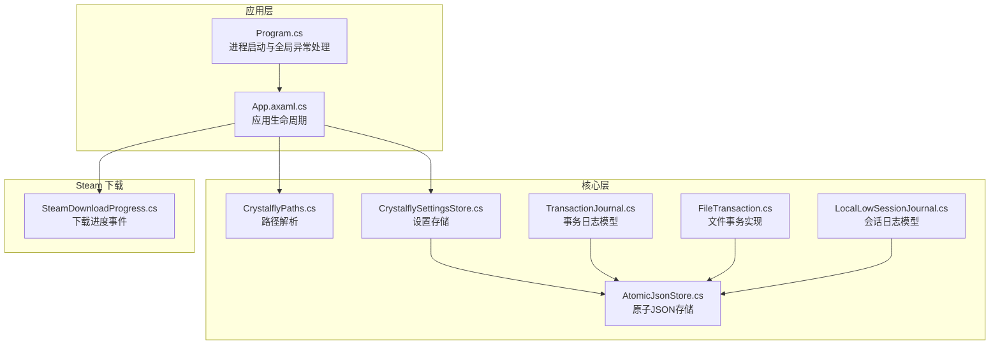
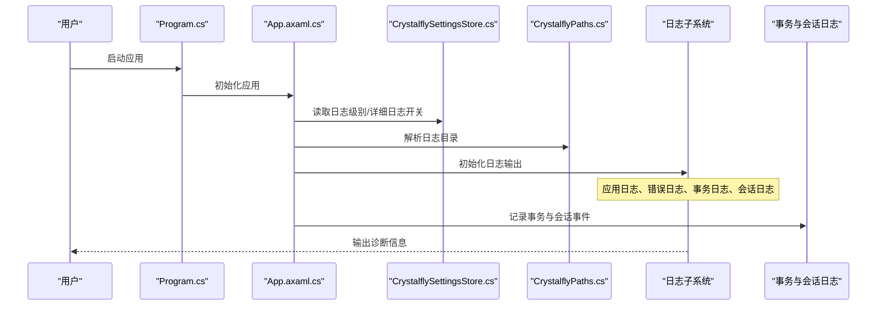
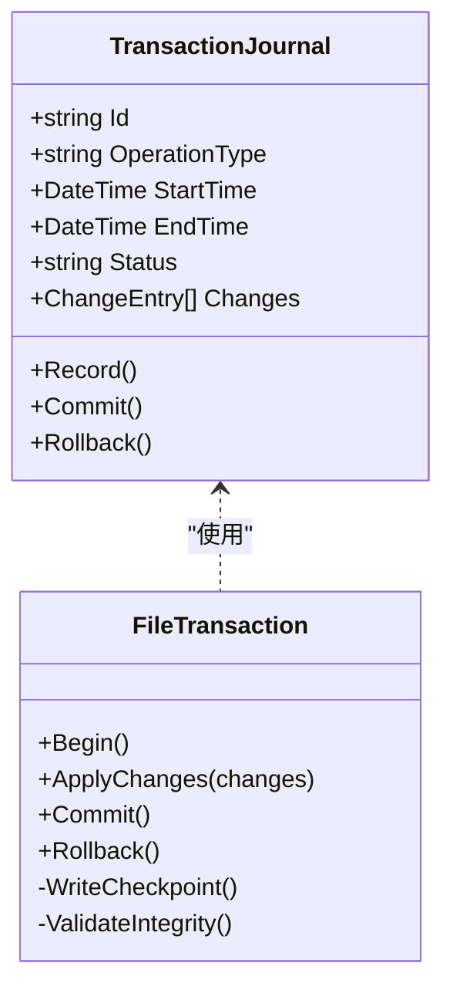
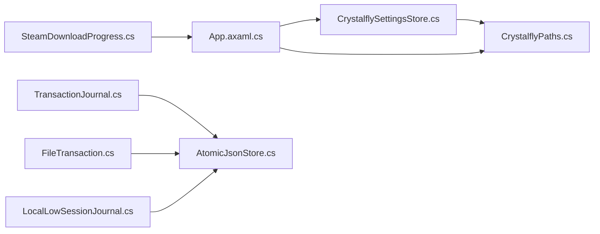

# 日志分析和调试

<cite>
**本文引用的文件**   
- [Program.cs](file://src/Crystalfly.App/Program.cs)
- [App.axaml.cs](file://src/Crystalfly.App/App.axaml.cs)
- [CrystalflySettingsStore.cs](file://src/Crystalfly.Core/Configuration/CrystalflySettingsStore.cs)
- [CrystalflyPaths.cs](file://src/Crystalfly.Core/Configuration/CrystalflyPaths.cs)
- [TransactionJournal.cs](file://src/Crystalfly.Core/Models/TransactionJournal.cs)
- [FileTransaction.cs](file://src/Crystalfly.Core/Transactions/FileTransaction.cs)
- [LocalLowSessionJournal.cs](file://src/Crystalfly.Core/Models/LocalLowSessionJournal.cs)
- [AtomicJsonStore.cs](file://src/Crystalfly.Core/Serialization/AtomicJsonStore.cs)
- [SteamDownloadProgress.cs](file://src/Crystalfly.Steam/Downloads/SteamDownloadProgress.cs)
</cite>

## 目录
1. [简介](#简介)
2. [项目结构](#项目结构)
3. [核心组件](#核心组件)
4. [架构总览](#架构总览)
5. [详细组件分析](#详细组件分析)
6. [依赖关系分析](#依赖关系分析)
7. [性能考虑](#性能考虑)
8. [故障排查指南](#故障排查指南)
9. [结论](#结论)
10. [附录](#附录)

## 简介
本指南面向 Crystalfly 项目的日志分析与调试，覆盖以下目标：
- 说明应用日志、错误日志、事务日志等关键日志文件的结构与位置
- 解释如何启用详细日志与调试模式
- 记录常见错误代码的含义及解决步骤
- 提供日志过滤与分析工具的使用建议
- 说明如何使用 Visual Studio 进行断点调试
- 给出生产环境远程调试的最佳实践与安全注意事项

## 项目结构
从源码结构看，日志相关能力分布在应用入口、配置与持久化层、事务与模型中。下图展示了与日志和调试密切相关的模块及其职责边界。

图表来源
- [Program.cs](file://src/Crystalfly.App/Program.cs)
- [App.axaml.cs](file://src/Crystalfly.App/App.axaml.cs)
- [CrystalflyPaths.cs](file://src/Crystalfly.Core/Configuration/CrystalflyPaths.cs)
- [CrystalflySettingsStore.cs](file://src/Crystalfly.Core/Configuration/CrystalflySettingsStore.cs)
- [AtomicJsonStore.cs](file://src/Crystalfly.Core/Serialization/AtomicJsonStore.cs)
- [TransactionJournal.cs](file://src/Crystalfly.Core/Models/TransactionJournal.cs)
- [FileTransaction.cs](file://src/Crystalfly.Core/Transactions/FileTransaction.cs)
- [LocalLowSessionJournal.cs](file://src/Crystalfly.Core/Models/LocalLowSessionJournal.cs)
- [SteamDownloadProgress.cs](file://src/Crystalfly.Steam/Downloads/SteamDownloadProgress.cs)

章节来源
- [Program.cs](file://src/Crystalfly.App/Program.cs)
- [App.axaml.cs](file://src/Crystalfly.App/App.axaml.cs)
- [CrystalflyPaths.cs](file://src/Crystalfly.Core/Configuration/CrystalflyPaths.cs)
- [CrystalfflySettingsStore.cs](file://src/Crystalfly.Core/Configuration/CrystalflySettingsStore.cs)
- [AtomicJsonStore.cs](file://src/Crystalfly.Core/Serialization/AtomicJsonStore.cs)
- [TransactionJournal.cs](file://src/Crystalfly.Core/Models/TransactionJournal.cs)
- [FileTransaction.cs](file://src/Crystalfly.Core/Transactions/FileTransaction.cs)
- [LocalLowSessionJournal.cs](file://src/Crystalfly.Core/Models/LocalLowSessionJournal.cs)
- [SteamDownloadProgress.cs](file://src/Crystalfly.Steam/Downloads/SteamDownloadProgress.cs)

## 核心组件
- 应用启动与全局异常捕获
  - 进程入口负责初始化应用并注册全局异常处理器，确保崩溃或未处理异常可被记录到日志系统。
  - 参考路径：[Program.cs](file://src/Crystalfly.App/Program.cs)
- 应用生命周期与 UI 初始化
  - 应用启动时加载配置、定位日志目录、初始化 UI 与主题，并在必要时输出诊断信息。
  - 参考路径：[App.axaml.cs](file://src/Crystalfly.App/App.axaml.cs)
- 配置与路径
  - 通过设置存储读取日志级别、是否开启详细日志等开关；路径解析器提供统一的日志目录定位。
  - 参考路径：[CrystalflySettingsStore.cs](file://src/Crystalfly.Core/Configuration/CrystalflySettingsStore.cs)、[CrystalflyPaths.cs](file://src/Crystalfly.Core/Configuration/CrystalflyPaths.cs)
- 事务与操作审计
  - 使用事务模型与文件事务实现来记录安装、卸载、修复等操作的前后状态，便于问题回溯。
  - 参考路径：[TransactionJournal.cs](file://src/Crystalfly.Core/Models/TransactionJournal.cs)、[FileTransaction.cs](file://src/Crystalfly.Core/Transactions/FileTransaction.cs)
- 会话与运行时日志
  - 会话日志用于记录游戏运行期关键事件（如启动、退出、崩溃），辅助定位运行时问题。
  - 参考路径：[LocalLowSessionJournal.cs](file://src/Crystalfly.Core/Models/LocalLowSessionJournal.cs)
- 下载与网络活动
  - Steam 下载进度与错误事件可用于分析下载失败、重试与超时等问题。
  - 参考路径：[SteamDownloadProgress.cs](file://src/Crystalfly.Steam/Downloads/SteamDownloadProgress.cs)

章节来源
- [Program.cs](file://src/Crystalfly.App/Program.cs)
- [App.axaml.cs](file://src/Crystalfly.App/App.axaml.cs)
- [CrystalflySettingsStore.cs](file://src/Crystalfly.Core/Configuration/CrystalfflySettingsStore.cs)
- [CrystalflyPaths.cs](file://src/Crystalfly.Core/Configuration/CrystalflyPaths.cs)
- [TransactionJournal.cs](file://src/Crystalfly.Core/Models/TransactionJournal.cs)
- [FileTransaction.cs](file://src/Crystalfly.Core/Transactions/FileTransaction.cs)
- [LocalLowSessionJournal.cs](file://src/Crystalfly.Core/Models/LocalLowSessionJournal.cs)
- [SteamDownloadProgress.cs](file://src/Crystalfly.Steam/Downloads/SteamDownloadProgress.cs)

## 架构总览
下图展示日志在系统中的流转：应用启动阶段确定日志目录与级别，业务逻辑与外部交互产生的事件写入对应日志文件，事务与会话日志提供结构化审计数据，便于后续检索与分析。

图表来源
- [Program.cs](file://src/Crystalfly.App/Program.cs)
- [App.axaml.cs](file://src/Crystalfly.App/App.axaml.cs)
- [CrystalflySettingsStore.cs](file://src/Crystalfly.Core/Configuration/CrystalflySettingsStore.cs)
- [CrystalflyPaths.cs](file://src/Crystalfly.Core/Configuration/CrystalflyPaths.cs)
- [TransactionJournal.cs](file://src/Crystalfly.Core/Models/TransactionJournal.cs)
- [LocalLowSessionJournal.cs](file://src/Crystalfly.Core/Models/LocalLowSessionJournal.cs)

## 详细组件分析

### 应用启动与全局异常处理
- 作用
  - 在进程入口处注册全局异常处理器，捕获未处理异常并写入错误日志，避免静默失败。
- 关键点
  - 异常类型分类：UI 线程异常、后台任务异常、第三方库异常
  - 日志内容：时间戳、异常类型、堆栈、上下文信息（实例ID、操作名称）
- 建议
  - 为关键路径增加 try/catch 并记录上下文，减少“黑盒”错误
  - 对频繁出现的异常进行分类统计，便于快速定位根因

章节来源
- [Program.cs](file://src/Crystalfly.App/Program.cs)

### 应用生命周期与日志目录
- 作用
  - 在应用初始化阶段加载配置、解析日志目录、初始化日志子系统，确保日志输出稳定可靠。
- 关键点
  - 日志目录由路径解析器统一提供，避免硬编码
  - 根据设置存储的日志级别控制输出粒度
- 建议
  - 在首次启动时创建日志目录并校验写入权限
  - 对日志轮转策略进行规划，避免磁盘占满

章节来源
- [App.axaml.cs](file://src/Crystalfly.App/App.axaml.cs)
- [CrystalflyPaths.cs](file://src/Crystalfly.Core/Configuration/CrystalflyPaths.cs)

### 配置与详细日志开关
- 作用
  - 提供日志级别、是否启用详细日志、是否输出调试信息等开关，支持动态调整。
- 关键点
  - 默认级别：生产环境建议 Info/Warn/Error
  - 详细日志：包含参数、中间结果、耗时等，仅用于问题复现
- 建议
  - 将详细日志开关暴露到设置界面或命令行参数
  - 结合实例标识与环境标签，便于多实例环境区分

章节来源
- [CrystalflySettingsStore.cs](file://src/Crystalfly.Core/Configuration/CrystalflySettingsStore.cs)

### 事务日志与文件事务
- 作用
  - 记录安装、卸载、修复等操作的完整流程，包括开始、变更集、提交、回滚与结果。
- 数据结构
  - 事务模型包含唯一标识、操作类型、时间线、变更摘要、状态码等字段
  - 文件事务实现保证原子性与一致性，失败自动回滚
- 分析要点
  - 通过事务日志还原操作序列，定位失败节点
  - 对比变更前后的文件指纹，确认一致性

图表来源
- [TransactionJournal.cs](file://src/Crystalfly.Core/Models/TransactionJournal.cs)
- [FileTransaction.cs](file://src/Crystalfly.Core/Transactions/FileTransaction.cs)

章节来源
- [TransactionJournal.cs](file://src/Crystalfly.Core/Models/TransactionJournal.cs)
- [FileTransaction.cs](file://src/Crystalfly.Core/Transactions/FileTransaction.cs)

### 会话日志与运行时事件
- 作用
  - 记录游戏会话的关键事件（启动、退出、崩溃、热重载），辅助定位运行时问题。
- 关键点
  - 会话日志通常位于 LocalLow 隔离目录，避免与用户数据混淆
  - 包含会话 ID、进程信息、错误码与简要堆栈
- 建议
  - 在崩溃前尽可能写入最小必要信息，提高可恢复性
  - 定期清理过期会话日志，控制磁盘占用

章节来源
- [LocalLowSessionJournal.cs](file://src/Crystalfly.Core/Models/LocalLowSessionJournal.cs)

### 下载与网络活动日志
- 作用
  - 记录 Steam 下载进度、错误与重试，帮助分析网络问题与资源完整性。
- 关键点
  - 进度事件包含包名、大小、速度、剩余时间
  - 错误事件包含错误码、重试次数、最终状态
- 建议
  - 对高频错误进行聚合统计，识别系统性问题
  - 结合网络延迟服务进行相关性分析

章节来源
- [SteamDownloadProgress.cs](file://src/Crystalfly.Steam/Downloads/SteamDownloadProgress.cs)

### 原子 JSON 存储与日志持久化
- 作用
  - 提供原子写入能力，确保日志文件在并发写入下的完整性。
- 关键点
  - 采用临时文件+原子重命名策略
  - 写入失败时保留旧版本，避免损坏
- 建议
  - 对大日志文件采用分片或滚动策略
  - 监控写入延迟，避免阻塞主流程

章节来源
- [AtomicJsonStore.cs](file://src/Crystalfly.Core/Serialization/AtomicJsonStore.cs)

## 依赖关系分析
下图展示日志相关组件之间的依赖关系，突出配置、路径、事务与持久化的耦合点。

图表来源
- [CrystalflySettingsStore.cs](file://src/Crystalfly.Core/Configuration/CrystalflySettingsStore.cs)
- [CrystalflyPaths.cs](file://src/Crystalfly.Core/Configuration/CrystalflyPaths.cs)
- [App.axaml.cs](file://src/Crystalfly.App/App.axaml.cs)
- [TransactionJournal.cs](file://src/Crystalfly.Core/Models/TransactionJournal.cs)
- [FileTransaction.cs](file://src/Crystalfly.Core/Transactions/FileTransaction.cs)
- [LocalLowSessionJournal.cs](file://src/Crystalfly.Core/Models/LocalLowSessionJournal.cs)
- [AtomicJsonStore.cs](file://src/Crystalfly.Core/Serialization/AtomicJsonStore.cs)
- [SteamDownloadProgress.cs](file://src/Crystalfly.Steam/Downloads/SteamDownloadProgress.cs)

章节来源
- [CrystalflySettingsStore.cs](file://src/Crystalfly.Core/Configuration/CrystalflySettingsStore.cs)
- [CrystalflyPaths.cs](file://src/Crystalfly.Core/Configuration/CrystalflyPaths.cs)
- [App.axaml.cs](file://src/Crystalfly.App/App.axaml.cs)
- [TransactionJournal.cs](file://src/Crystalfly.Core/Models/TransactionJournal.cs)
- [FileTransaction.cs](file://src/Crystalfly.Core/Transactions/FileTransaction.cs)
- [LocalLowSessionJournal.cs](file://src/Crystalfly.Core/Models/LocalLowSessionJournal.cs)
- [AtomicJsonStore.cs](file://src/Crystalfly.Core/Serialization/AtomicJsonStore.cs)
- [SteamDownloadProgress.cs](file://src/Crystalfly.Steam/Downloads/SteamDownloadProgress.cs)

## 性能考虑
- 日志级别控制
  - 生产环境默认关闭详细日志，仅在复现问题时临时开启
- 写入策略
  - 使用异步写入与批处理降低 I/O 开销
  - 对大对象进行序列化裁剪，避免冗余信息
- 磁盘空间管理
  - 实施日志轮转与压缩，限制单文件大小与总数
- 监控与告警
  - 对错误率、写入延迟、磁盘使用率设置阈值告警

## 故障排查指南
- 常见问题与错误代码
  - 权限不足：无法创建或写入日志目录
    - 现象：应用启动即报错，无日志生成
    - 解决：检查日志目录权限，以管理员身份运行或更改目录
  - 磁盘空间不足：日志写入失败
    - 现象：写入异常、事务回滚
    - 解决：清理历史日志或扩容磁盘
  - 网络错误：Steam 下载失败
    - 现象：下载进度中断、错误码提示
    - 解决：检查网络连接、代理设置、防火墙规则
  - 事务不一致：安装/卸载中途失败
    - 现象：事务状态异常、文件缺失
    - 解决：查看事务日志，执行回滚或手动修复
- 定位步骤
  - 收集应用日志、错误日志、事务日志与会话日志
  - 按时间窗口筛选关键事件，关联错误码与堆栈
  - 复现场景下开启详细日志，缩小范围
- 工具建议
  - 文本搜索：grep、Select-String、PowerShell 脚本
  - 结构化分析：基于 JSON 的事务与会话日志可使用 jq 或 PowerShell 解析
  - 可视化：导入至日志平台（如 ELK）进行聚合与可视化

章节来源
- [TransactionJournal.cs](file://src/Crystalfly.Core/Models/TransactionJournal.cs)
- [FileTransaction.cs](file://src/Crystalfly.Core/Transactions/FileTransaction.cs)
- [LocalLowSessionJournal.cs](file://src/Crystalfly.Core/Models/LocalLowSessionJournal.cs)
- [SteamDownloadProgress.cs](file://src/Crystalfly.Steam/Downloads/SteamDownloadProgress.cs)

## 结论
通过明确日志目录与级别、完善事务与会话审计、规范异常捕获与错误码定义，并结合合适的工具链进行分析，可以显著提升 Crystalfly 的可观测性与问题定位效率。在生产环境中，应谨慎启用详细日志，遵循安全最佳实践，确保远程调试的安全可控。

## 附录

### 日志文件结构与位置
- 应用日志
  - 位置：由路径解析器提供的统一日志目录
  - 内容：常规运行信息、警告与错误
- 错误日志
  - 位置：与应用日志同目录或独立子目录
  - 内容：未处理异常、关键错误与堆栈
- 事务日志
  - 位置：应用数据目录下的事务记录
  - 内容：操作前后状态、变更集、提交与回滚
- 会话日志
  - 位置：LocalLow 隔离目录
  - 内容：游戏会话事件、崩溃快照

章节来源
- [CrystalflyPaths.cs](file://src/Crystalfly.Core/Configuration/CrystalflyPaths.cs)
- [TransactionJournal.cs](file://src/Crystalfly.Core/Models/TransactionJournal.cs)
- [LocalLowSessionJournal.cs](file://src/Crystalfly.Core/Models/LocalLowSessionJournal.cs)

### 启用详细日志与调试模式
- 通过设置存储切换日志级别与详细日志开关
- 在应用启动参数中添加调试标志（如适用）
- 在 UI 设置界面暴露日志级别选项，便于用户自助调整

章节来源
- [CrystalflySettingsStore.cs](file://src/Crystalfly.Core/Configuration/CrystalflySettingsStore.cs)
- [App.axaml.cs](file://src/Crystalfly.App/App.axaml.cs)

### 使用 Visual Studio 调试器进行断点调试
- 附加进程
  - 启动应用后，在 VS 中选择“附加到进程”，选择 Crystalfly 进程
  - 设置断点于关键方法（如事务提交、异常捕获、下载回调）
- 条件断点
  - 针对特定实例或操作类型设置条件，减少干扰
- 日志输出
  - 在断点处观察变量与调用栈，结合日志文件交叉验证

### 生产环境远程调试最佳实践与安全考虑
- 网络与访问控制
  - 仅允许受信任 IP 访问调试端口
  - 使用 VPN 或跳板机进行连接
- 认证与授权
  - 启用强认证机制，避免匿名访问
- 最小权限原则
  - 调试账户仅具备必要权限，避免影响生产数据
- 审计与留痕
  - 记录所有调试会话的起止时间与操作者
- 风险缓解
  - 仅在紧急情况下启用远程调试
  - 完成后立即关闭调试接口并轮换敏感凭据