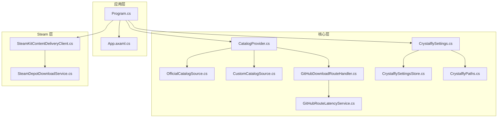
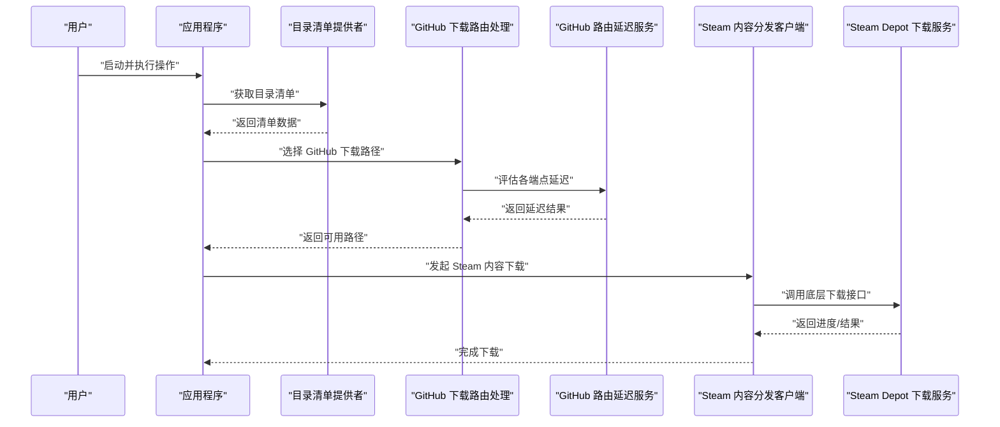
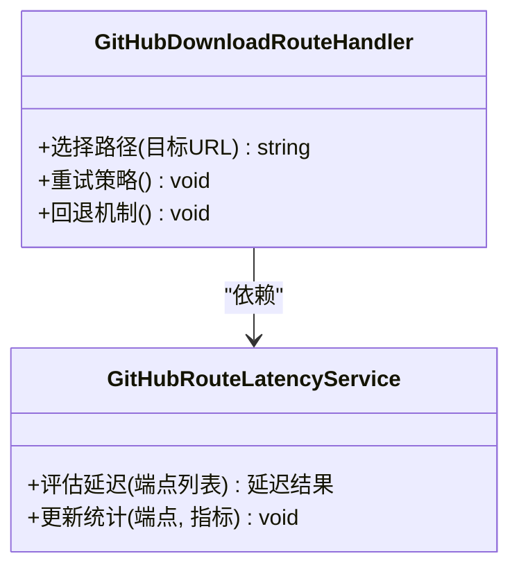
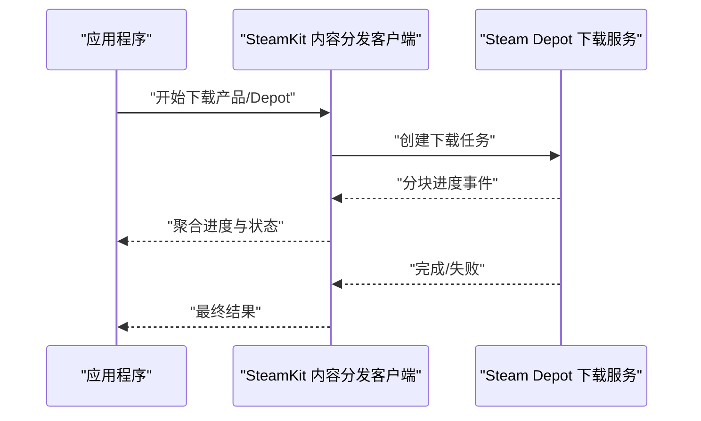
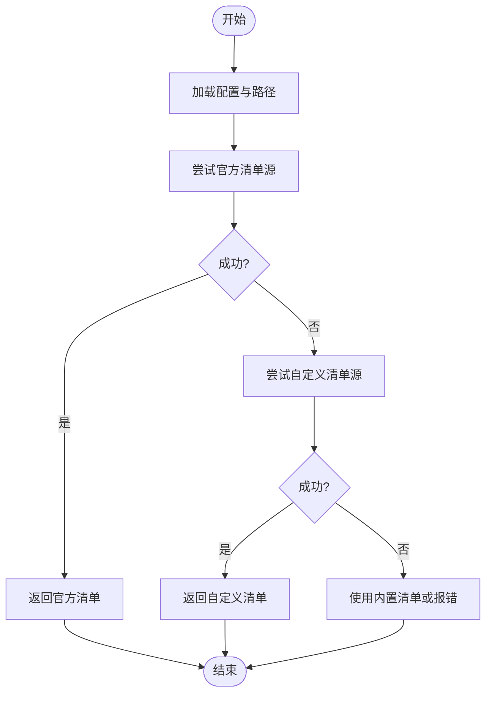
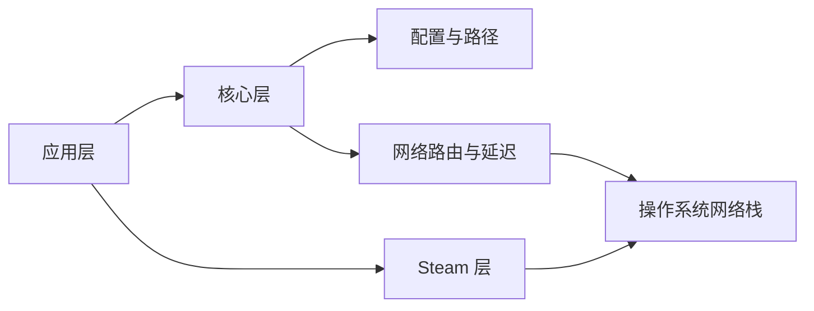

# 网络和连接问题

<cite>
**本文引用的文件**   
- [GitHubDownloadRouteHandler.cs](file://src/Crystalfly.Core/Networking/GitHubDownloadRouteHandler.cs)
- [GitHubRouteLatencyService.cs](file://src/Crystalfly.Core/Networking/GitHubRouteLatencyService.cs)
- [SteamKitContentDeliveryClient.cs](file://src/Crystalfly.Steam/Downloads/SteamKitContentDeliveryClient.cs)
- [SteamDepotDownloadService.cs](file://src/Crystalfly.Steam/Downloads/SteamDepotDownloadService.cs)
- [CatalogProvider.cs](file://src/Crystalfly.Core/Catalog/CatalogProvider.cs)
- [OfficialCatalogSource.cs](file://src/Crystalfly.Core/Catalog/OfficialCatalogSource.cs)
- [CustomCatalogSource.cs](file://src/Crystalfly.Core/Catalog/CustomCatalogSource.cs)
- [CrystalflySettings.cs](file://src/Crystalfly.Core/Configuration/CrystalflySettings.cs)
- [CrystalflySettingsStore.cs](file://src/Crystalfly.Core/Configuration/CrystalflySettingsStore.cs)
- [CrystalflyPaths.cs](file://src/Crystalfly.Core/Configuration/CrystalflyPaths.cs)
- [Program.cs](file://src/Crystalfly.App/Program.cs)
- [App.axaml.cs](file://src/Crystalfly.App/App.axaml.cs)
</cite>

## 目录
1. [简介](#简介)
2. [项目结构](#项目结构)
3. [核心组件](#核心组件)
4. [架构总览](#架构总览)
5. [详细组件分析](#详细组件分析)
6. [依赖关系分析](#依赖关系分析)
7. [性能考虑](#性能考虑)
8. [故障排查指南](#故障排查指南)
9. [结论](#结论)
10. [附录](#附录)

## 简介
本指南聚焦 Crystalfly 在网络与连接方面的常见问题，包括：
- 网络连接超时与断开的诊断方法
- GitHub API 访问失败的原因分析与代理配置
- 防火墙与安全软件拦截问题的解决步骤
- DNS 解析失败的排查与配置方法
- 网络带宽限制与下载速度优化技巧
- SSL/TLS 证书验证错误及信任配置

文档将结合源码中的网络相关模块（GitHub 路由、延迟测量、Steam 内容分发客户端等）给出可操作的排障流程与优化建议。

## 项目结构
与网络相关的代码主要分布在以下位置：
- Core 层：GitHub 下载路由处理与延迟服务、目录清单提供者与来源实现
- Steam 层：基于 SteamKit 的内容分发客户端与 Depot 下载服务
- 应用层：程序入口与应用初始化（可能包含全局网络设置）

图表来源
- [Program.cs](file://src/Crystalfly.App/Program.cs)
- [App.axaml.cs](file://src/Crystalfly.App/App.axaml.cs)
- [CatalogProvider.cs](file://src/Crystalfly.Core/Catalog/CatalogProvider.cs)
- [OfficialCatalogSource.cs](file://src/Crystalfly.Core/Catalog/OfficialCatalogSource.cs)
- [CustomCatalogSource.cs](file://src/Crystalfly.Core/Catalog/CustomCatalogSource.cs)
- [GitHubDownloadRouteHandler.cs](file://src/Crystalffly.Core/Networking/GitHubDownloadRouteHandler.cs)
- [GitHubRouteLatencyService.cs](file://src/Crystalfly.Core/Networking/GitHubRouteLatencyService.cs)
- [CrystalflySettings.cs](file://src/Crystalfly.Core/Configuration/CrystalflySettings.cs)
- [CrystalflySettingsStore.cs](file://src/Crystalfly.Core/Configuration/CrystalflySettingsStore.cs)
- [CrystalflyPaths.cs](file://src/Crystalfly.Core/Configuration/CrystalflyPaths.cs)
- [SteamKitContentDeliveryClient.cs](file://src/Crystalfly.Steam/Downloads/SteamKitContentDeliveryClient.cs)
- [SteamDepotDownloadService.cs](file://src/Crystalfly.Steam/Downloads/SteamDepotDownloadService.cs)

章节来源
- [Program.cs](file://src/Crystalfly.App/Program.cs)
- [App.axaml.cs](file://src/Crystalfly.App/App.axaml.cs)
- [CatalogProvider.cs](file://src/Crystalfly.Core/Catalog/CatalogProvider.cs)
- [OfficialCatalogSource.cs](file://src/Crystalfly.Core/Catalog/OfficialCatalogSource.cs)
- [CustomCatalogSource.cs](file://src/Crystalfly.Core/Catalog/CustomCatalogSource.cs)
- [GitHubDownloadRouteHandler.cs](file://src/Crystalfly.Core/Networking/GitHubDownloadRouteHandler.cs)
- [GitHubRouteLatencyService.cs](file://src/Crystalfly.Core/Networking/GitHubRouteLatencyService.cs)
- [CrystalflySettings.cs](file://src/Crystalfly.Core/Configuration/CrystalflySettings.cs)
- [CrystalflySettingsStore.cs](file://src/Crystalfly.Core/Configuration/CrystalflySettingsStore.cs)
- [CrystalflyPaths.cs](file://src/Crystalfly.Core/Configuration/CrystalflyPaths.cs)
- [SteamKitContentDeliveryClient.cs](file://src/Crystalfly.Steam/Downloads/SteamKitContentDeliveryClient.cs)
- [SteamDepotDownloadService.cs](file://src/Crystalfly.Steam/Downloads/SteamDepotDownloadService.cs)

## 核心组件
- GitHub 下载路由处理：负责选择最优或可用的 GitHub 下载路径，并协调重试与回退策略。
- GitHub 路由延迟服务：用于评估不同 GitHub 端点的连通性与延迟，辅助路由决策。
- Steam 内容分发客户端：封装 SteamKit 的下载能力，提供稳定的大文件传输通道。
- 目录清单提供者与来源：从官方或自定义源拉取元数据，涉及 HTTP 请求与可能的代理/DNS 行为。
- 配置与路径：集中管理网络相关设置（如代理、超时、缓存路径等）。

章节来源
- [GitHubDownloadRouteHandler.cs](file://src/Crystalfly.Core/Networking/GitHubDownloadRouteHandler.cs)
- [GitHubRouteLatencyService.cs](file://src/Crystalfly.Core/Networking/GitHubRouteLatencyService.cs)
- [SteamKitContentDeliveryClient.cs](file://src/Crystalfly.Steam/Downloads/SteamKitContentDeliveryClient.cs)
- [SteamDepotDownloadService.cs](file://src/Crystalfly.Steam/Downloads/SteamDepotDownloadService.cs)
- [CatalogProvider.cs](file://src/Crystalfly.Core/Catalog/CatalogProvider.cs)
- [OfficialCatalogSource.cs](file://src/Crystalfly.Core/Catalog/OfficialCatalogSource.cs)
- [CustomCatalogSource.cs](file://src/Crystalfly.Core/Catalog/CustomCatalogSource.cs)
- [CrystalflySettings.cs](file://src/Crystalfly.Core/Configuration/CrystalflySettings.cs)
- [CrystalflySettingsStore.cs](file://src/Crystalfly.Core/Configuration/CrystalflySettingsStore.cs)
- [CrystalflyPaths.cs](file://src/Crystalfly.Core/Configuration/CrystalflyPaths.cs)

## 架构总览
下图展示了从应用启动到网络请求的关键路径，涵盖 GitHub 与 Steam 两类外部资源访问。

图表来源
- [CatalogProvider.cs](file://src/Crystalfly.Core/Catalog/CatalogProvider.cs)
- [GitHubDownloadRouteHandler.cs](file://src/Crystalfly.Core/Networking/GitHubDownloadRouteHandler.cs)
- [GitHubRouteLatencyService.cs](file://src/Crystalfly.Core/Networking/GitHubRouteLatencyService.cs)
- [SteamKitContentDeliveryClient.cs](file://src/Crystalfly.Steam/Downloads/SteamKitContentDeliveryClient.cs)
- [SteamDepotDownloadService.cs](file://src/Crystalfly.Steam/Downloads/SteamDepotDownloadService.cs)

## 详细组件分析

### GitHub 下载路由与延迟评估
- 路由处理：根据可用性、历史成功率与延迟指标选择最佳 GitHub 镜像或 CDN 路径；在失败时自动切换与重试。
- 延迟服务：对多个候选端点进行轻量探测（如 HEAD 或小范围 GET），记录 RTT 与错误率，供路由决策使用。

图表来源
- [GitHubDownloadRouteHandler.cs](file://src/Crystalfly.Core/Networking/GitHubDownloadRouteHandler.cs)
- [GitHubRouteLatencyService.cs](file://src/Crystalfly.Core/Networking/GitHubRouteLatencyService.cs)

章节来源
- [GitHubDownloadRouteHandler.cs](file://src/Crystalfly.Core/Networking/GitHubDownloadRouteHandler.cs)
- [GitHubRouteLatencyService.cs](file://src/Crystalfly.Core/Networking/GitHubRouteLatencyService.cs)

### Steam 内容分发客户端与 Depot 下载服务
- 客户端：封装 SteamKit 的下载能力，提供统一的进度回调与错误上报。
- 服务：协调 Depot 包的分块下载、校验与恢复，确保大文件的稳定传输。

图表来源
- [SteamKitContentDeliveryClient.cs](file://src/Crystalfly.Steam/Downloads/SteamKitContentDeliveryClient.cs)
- [SteamDepotDownloadService.cs](file://src/Crystalfly.Steam/Downloads/SteamDepotDownloadService.cs)

章节来源
- [SteamKitContentDeliveryClient.cs](file://src/Crystalfly.Steam/Downloads/SteamKitContentDeliveryClient.cs)
- [SteamDepotDownloadService.cs](file://src/Crystalfly.Steam/Downloads/SteamDepotDownloadService.cs)

### 目录清单提供者与来源
- 提供者：统一调度官方与自定义清单源的读取，支持缓存与回退。
- 官方来源：通过 HTTP 访问官方清单地址，需关注代理、DNS 与证书链。
- 自定义来源：允许企业内网或镜像站点，便于绕过公网限制。

图表来源
- [CatalogProvider.cs](file://src/Crystalfly.Core/Catalog/CatalogProvider.cs)
- [OfficialCatalogSource.cs](file://src/Crystalfly.Core/Catalog/OfficialCatalogSource.cs)
- [CustomCatalogSource.cs](file://src/Crystalfly.Core/Catalog/CustomCatalogSource.cs)

章节来源
- [CatalogProvider.cs](file://src/Crystalfly.Core/Catalog/CatalogProvider.cs)
- [OfficialCatalogSource.cs](file://src/Crystalfly.Core/Catalog/OfficialCatalogSource.cs)
- [CustomCatalogSource.cs](file://src/Crystalfly.Core/Catalog/CustomCatalogSource.cs)

### 配置与路径
- 设置项：集中管理网络相关参数（例如代理、超时、并发、重试次数等）。
- 存储：持久化用户配置，支持运行时重载。
- 路径：定义缓存、日志与临时文件目录，影响 I/O 与网络交互效率。

章节来源
- [CrystalflySettings.cs](file://src/Crystalfly.Core/Configuration/CrystalflySettings.cs)
- [CrystalflySettingsStore.cs](file://src/Crystalfly.Core/Configuration/CrystalflySettingsStore.cs)
- [CrystalflyPaths.cs](file://src/Crystalfly.Core/Configuration/CrystalflyPaths.cs)

## 依赖关系分析
- 应用层依赖核心层的目录清单提供者与网络路由处理。
- 核心层依赖配置与路径模块以获取运行时参数。
- Steam 层独立于核心层，但同样受系统级网络环境（代理、DNS、证书）影响。

图表来源
- [Program.cs](file://src/Crystalfly.App/Program.cs)
- [App.axaml.cs](file://src/Crystalfly.App/App.axaml.cs)
- [CrystalflySettings.cs](file://src/Crystalfly.Core/Configuration/CrystalflySettings.cs)
- [CrystalflyPaths.cs](file://src/Crystalfly.Core/Configuration/CrystalflyPaths.cs)
- [GitHubDownloadRouteHandler.cs](file://src/Crystalfly.Core/Networking/GitHubDownloadRouteHandler.cs)
- [GitHubRouteLatencyService.cs](file://src/Crystalfly.Core/Networking/GitHubRouteLatencyService.cs)
- [SteamKitContentDeliveryClient.cs](file://src/Crystalfly.Steam/Downloads/SteamKitContentDeliveryClient.cs)

章节来源
- [Program.cs](file://src/Crystalfly.App/Program.cs)
- [App.axaml.cs](file://src/Crystalfly.App/App.axaml.cs)
- [CrystalflySettings.cs](file://src/Crystalfly.Core/Configuration/CrystalflySettings.cs)
- [CrystalflyPaths.cs](file://src/Crystalfly.Core/Configuration/CrystalflyPaths.cs)
- [GitHubDownloadRouteHandler.cs](file://src/Crystalfly.Core/Networking/GitHubDownloadRouteHandler.cs)
- [GitHubRouteLatencyService.cs](file://src/Crystalfly.Core/Networking/GitHubRouteLatencyService.cs)
- [SteamKitContentDeliveryClient.cs](file://src/Crystalfly.Steam/Downloads/SteamKitContentDeliveryClient.cs)

## 性能考虑
- 合理设置并发与超时：避免过多并发导致拥塞或频繁超时；为长连接与大文件分配更长的超时时间。
- 利用路由与延迟评估：优先选择低延迟、高可用的 GitHub 端点，减少重传与回退开销。
- 缓存与断点续传：对清单与小文件启用缓存；对大文件启用分块与断点续传，降低重复下载成本。
- 本地镜像与代理：在企业环境中部署内部镜像或透明代理，缩短链路并提升稳定性。

[本节为通用指导，不直接分析具体文件]

## 故障排查指南

### 网络连接超时与断开
- 现象：请求长时间无响应、频繁中断或握手失败。
- 排查步骤：
  - 检查系统代理与网络环境是否一致，确认代理可达且未限速。
  - 调整超时与重试参数，观察是否改善。
  - 使用路由与延迟服务评估各端点质量，切换到更优路径。
  - 查看日志中错误类型（如超时、连接重置、TLS 握手失败）定位根因。
- 参考实现：
  - [GitHubDownloadRouteHandler.cs](file://src/Crystalfly.Core/Networking/GitHubDownloadRouteHandler.cs)
  - [GitHubRouteLatencyService.cs](file://src/Crystalfly.Core/Networking/GitHubRouteLatencyService.cs)

章节来源
- [GitHubDownloadRouteHandler.cs](file://src/Crystalfly.Core/Networking/GitHubDownloadRouteHandler.cs)
- [GitHubRouteLatencyService.cs](file://src/Crystalfly.Core/Networking/GitHubRouteLatencyService.cs)

### GitHub API 访问失败与代理配置
- 常见原因：
  - 代理未正确转发 GitHub 域名或被安全策略阻断。
  - DNS 解析异常或缓存污染。
  - TLS 证书链不完整或不受信任。
- 解决步骤：
  - 在配置中设置代理服务器与认证信息，确保对 *.github.com 流量生效。
  - 使用自定义清单源指向可用镜像，规避直连问题。
  - 清理 DNS 缓存并测试解析结果。
  - 若使用自签证书，需在系统或应用信任库中添加 CA。
- 参考实现：
  - [OfficialCatalogSource.cs](file://src/Crystalfly.Core/Catalog/OfficialCatalogSource.cs)
  - [CustomCatalogSource.cs](file://src/Crystalfly.Core/Catalog/CustomCatalogSource.cs)
  - [CrystalflySettings.cs](file://src/Crystalfly.Core/Configuration/CrystalflySettings.cs)

章节来源
- [OfficialCatalogSource.cs](file://src/Crystalfly.Core/Catalog/OfficialCatalogSource.cs)
- [CustomCatalogSource.cs](file://src/Crystalfly.Core/Catalog/CustomCatalogSource.cs)
- [CrystalflySettings.cs](file://src/Crystalfly.Core/Configuration/CrystalflySettings.cs)

### 防火墙与安全软件拦截
- 现象：出站连接被拒绝、端口被封或 HTTPS 被深度检测。
- 解决步骤：
  - 在白名单中添加 Crystalfly 主程序与相关子进程。
  - 放行必要端口（HTTP/HTTPS），并确保代理出口未被二次拦截。
  - 关闭或降级安全软件的“应用控制”或“行为监控”，仅保留基础防护。
  - 在企业网络中申请例外规则或走公司统一代理。
- 参考实现：
  - [Program.cs](file://src/Crystalfly.App/Program.cs)
  - [App.axaml.cs](file://src/Crystalfly.App/App.axaml.cs)

章节来源
- [Program.cs](file://src/Crystalfly.App/Program.cs)
- [App.axaml.cs](file://src/Crystalfly.App/App.axaml.cs)

### DNS 解析失败
- 现象：域名无法解析、解析结果错误或间歇性失败。
- 解决步骤：
  - 更换公共 DNS（如 1.1.1.1、8.8.8.8）或企业 DNS，并在系统网络设置中生效。
  - 清除系统 DNS 缓存后重试。
  - 使用 nslookup/dig 验证解析结果与 TTL。
  - 若存在劫持或污染，考虑使用可信代理或隧道。
- 参考实现：
  - [OfficialCatalogSource.cs](file://src/Crystalfly.Core/Catalog/OfficialCatalogSource.cs)
  - [CustomCatalogSource.cs](file://src/Crystalfly.Core/Catalog/CustomCatalogSource.cs)

章节来源
- [OfficialCatalogSource.cs](file://src/Crystalfly.Core/Catalog/OfficialCatalogSource.cs)
- [CustomCatalogSource.cs](file://src/Crystalfly.Core/Catalog/CustomCatalogSource.cs)

### 网络带宽限制与下载速度优化
- 现象：下载缓慢、吞吐不稳定。
- 优化技巧：
  - 调整并发下载数与单连接限速，平衡 CPU 与带宽占用。
  - 启用分块与断点续传，减少重复传输。
  - 使用就近镜像或内网代理，缩短物理距离。
  - 避开高峰时段或限制其他应用的带宽占用。
- 参考实现：
  - [SteamKitContentDeliveryClient.cs](file://src/Crystalfly.Steam/Downloads/SteamKitContentDeliveryClient.cs)
  - [SteamDepotDownloadService.cs](file://src/Crystalfly.Steam/Downloads/SteamDepotDownloadService.cs)
  - [CrystalflySettings.cs](file://src/Crystalfly.Core/Configuration/CrystalflySettings.cs)

章节来源
- [SteamKitContentDeliveryClient.cs](file://src/Crystalfly.Steam/Downloads/SteamKitContentDeliveryClient.cs)
- [SteamDepotDownloadService.cs](file://src/Crystalfly.Steam/Downloads/SteamDepotDownloadService.cs)
- [CrystalflySettings.cs](file://src/Crystalfly.Core/Configuration/CrystalflySettings.cs)

### SSL/TLS 证书验证错误与信任配置
- 现象：证书不受信任、证书链不完整或主机名不匹配。
- 解决步骤：
  - 更新系统根证书与中间证书，确保 CA 链完整。
  - 在企业环境中安装内部 CA 到系统信任库。
  - 若必须跳过验证（仅限调试），请在配置中谨慎开启并尽快修复证书问题。
  - 检查代理是否进行 MITM 解密，需要在其 CA 上建立信任。
- 参考实现：
  - [OfficialCatalogSource.cs](file://src/Crystalfly.Core/Catalog/OfficialCatalogSource.cs)
  - [CustomCatalogSource.cs](file://src/Crystalfly.Core/Catalog/CustomCatalogSource.cs)
  - [CrystalflySettings.cs](file://src/Crystalfly.Core/Configuration/CrystalflySettings.cs)

章节来源
- [OfficialCatalogSource.cs](file://src/Crystalfly.Core/Catalog/OfficialCatalogSource.cs)
- [CustomCatalogSource.cs](file://src/Crystalfly.Core/Catalog/CustomCatalogSource.cs)
- [CrystalflySettings.cs](file://src/Crystalfly.Core/Configuration/CrystalflySettings.cs)

## 结论
通过合理配置代理与 DNS、优化路由与延迟评估、启用缓存与断点续传，并结合系统级证书信任与防火墙白名单，可以显著提升 Crystalfly 的网络稳定性与下载性能。建议在团队或企业环境中统一部署镜像与代理，以减少外部依赖带来的不确定性。

[本节为总结性内容，不直接分析具体文件]

## 附录
- 常用命令与工具：nslookup、dig、curl、openssl s_client、netstat、tcpdump（用于抓包与协议分析）。
- 日志位置：参考路径配置，定位应用日志与临时文件目录，便于取证与复现。

章节来源
- [CrystalflyPaths.cs](file://src/Crystalfly.Core/Configuration/CrystalflyPaths.cs)