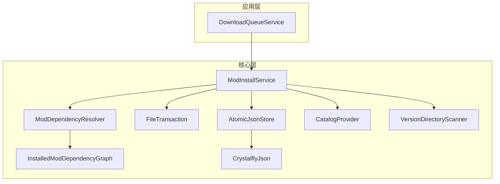
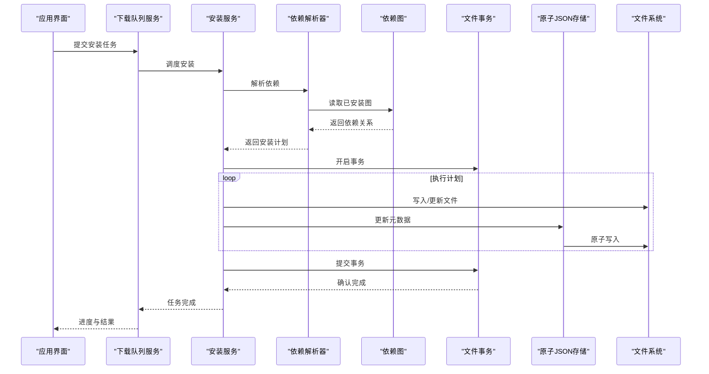
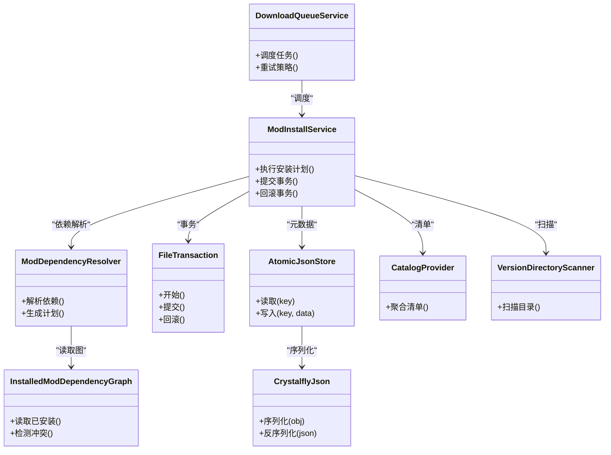

# 内存访问异常

<cite>
**本文引用的文件**   
- [AtomicJsonStore.cs](file://src/Crystalfly.Core/Serialization/AtomicJsonStore.cs)
- [CrystalflyJson.cs](file://src/Crystalfly.Core/Serialization/CrystalflyJson.cs)
- [ModDependencyResolver.cs](file://src/Crystalfly.Core/Mods/ModDependencyResolver.cs)
- [InstalledModDependencyGraph.cs](file://src/Crystalfly.Core/Mods/InstalledModDependencyGraph.cs)
- [ModInstallService.cs](file://src/Crystalfly.Core/Mods/ModInstallService.cs)
- [FileTransaction.cs](file://src/Crystalfly.Core/Transactions/FileTransaction.cs)
- [TransactionJournal.cs](file://src/Crystalfly.Core/Models/TransactionJournal.cs)
- [DownloadQueueService.cs](file://src/Crystalfly.App/Downloads/DownloadQueueService.cs)
- [CatalogProvider.cs](file://src/Crystalfly.Core/Catalog/CatalogProvider.cs)
- [VersionDirectoryScanner.cs](file://src/Crystalfly.Core/Instances/VersionDirectoryScanner.cs)
</cite>

## 目录
1. [简介](#简介)
2. [项目结构](#项目结构)
3. [核心组件](#核心组件)
4. [架构总览](#架构总览)
5. [详细组件分析](#详细组件分析)
6. [依赖关系分析](#依赖关系分析)
7. [性能考虑](#性能考虑)
8. [故障排查指南](#故障排查指南)
9. [结论](#结论)
10. [附录](#附录)

## 简介
本指南聚焦 Crystalfly 在运行期与安装流程中常见的“内存访问异常”问题，包括空引用异常、索引越界异常、并发与锁竞争导致的 JSON 原子存储异常、事务回滚与数据一致性问题，以及大文件操作引发的内存不足异常。文档提供识别方法、修复策略、诊断步骤与优化建议，帮助开发者快速定位并解决问题。

## 项目结构
与内存访问异常密切相关的代码主要分布在以下模块：
- 序列化与原子存储：AtomicJsonStore、CrystalflyJson
- 模组依赖解析：ModDependencyResolver、InstalledModDependencyGraph
- 安装服务与事务：ModInstallService、FileTransaction、TransactionJournal
- 下载队列与并发控制：DownloadQueueService
- 目录扫描与大对象处理：VersionDirectoryScanner
- 目录清单聚合：CatalogProvider

图表来源
- [DownloadQueueService.cs](file://src/Crystalfly.App/Downloads/DownloadQueueService.cs)
- [ModInstallService.cs](file://src/Crystalfly.Core/Mods/ModInstallService.cs)
- [ModDependencyResolver.cs](file://src/Crystalfly.Core/Mods/ModDependencyResolver.cs)
- [InstalledModDependencyGraph.cs](file://src/Crystalfly.Core/Mods/InstalledModDependencyGraph.cs)
- [FileTransaction.cs](file://src/Crystalfly.Core/Transactions/FileTransaction.cs)
- [AtomicJsonStore.cs](file://src/Crystalfly.Core/Serialization/AtomicJsonStore.cs)
- [CrystalflyJson.cs](file://src/Crystalfly.Core/Serialization/CrystalflyJson.cs)
- [CatalogProvider.cs](file://src/Crystalfly.Core/Catalog/CatalogProvider.cs)
- [VersionDirectoryScanner.cs](file://src/Crystalfly.Core/Instances/VersionDirectoryScanner.cs)

章节来源
- [DownloadQueueService.cs](file://src/Crystalfly.App/Downloads/DownloadQueueService.cs)
- [ModInstallService.cs](file://src/Crystalfly.Core/Mods/ModInstallService.cs)
- [ModDependencyResolver.cs](file://src/Crystalfly.Core/Mods/ModDependencyResolver.cs)
- [InstalledModDependencyGraph.cs](file://src/Crystalfly.Core/Mods/InstalledModDependencyGraph.cs)
- [FileTransaction.cs](file://src/Crystalfly.Core/Transactions/FileTransaction.cs)
- [AtomicJsonStore.cs](file://src/Crystalfly.Core/Serialization/AtomicJsonStore.cs)
- [CrystalflyJson.cs](file://src/Crystalfly.Core/Serialization/CrystalflyJson.cs)
- [CatalogProvider.cs](file://src/Crystalfly.Core/Catalog/CatalogProvider.cs)
- [VersionDirectoryScanner.cs](file://src/Crystalfly.Core/Instances/VersionDirectoryScanner.cs)

## 核心组件
- 原子 JSON 存储（AtomicJsonStore）：负责持久化数据的读写与并发安全，内部使用文件级锁避免竞态条件。
- JSON 工具（CrystalflyJson）：封装 JSON 序列化和反序列化的统一入口，集中错误处理与版本兼容逻辑。
- 依赖解析器（ModDependencyResolver）：基于已安装模组图构建依赖关系，计算可安装/升级/卸载计划。
- 依赖图（InstalledModDependencyGraph）：维护已安装模组的拓扑结构与冲突检测。
- 安装服务（ModInstallService）：编排下载、校验、写入、记录日志与事务提交。
- 文件事务（FileTransaction）：提供原子性写入与回滚能力，确保中间状态不污染磁盘。
- 事务日志（TransactionJournal）：记录事务元数据，辅助恢复与审计。
- 下载队列（DownloadQueueService）：管理并发下载任务，协调资源占用与失败重试。
- 目录扫描（VersionDirectoryScanner）：遍历游戏版本目录，收集文件信息，可能产生大对象集合。
- 目录清单聚合（CatalogProvider）：合并多源目录清单，供依赖解析使用。

章节来源
- [AtomicJsonStore.cs](file://src/Crystalfly.Core/Serialization/AtomicJsonStore.cs)
- [CrystalflyJson.cs](file://src/Crystalfly.Core/Serialization/CrystalflyJson.cs)
- [ModDependencyResolver.cs](file://src/Crystalfly.Core/Mods/ModDependencyResolver.cs)
- [InstalledModDependencyGraph.cs](file://src/Crystalfly.Core/Mods/InstalledModDependencyGraph.cs)
- [ModInstallService.cs](file://src/Crystalfly.Core/Mods/ModInstallService.cs)
- [FileTransaction.cs](file://src/Crystalfly.Core/Transactions/FileTransaction.cs)
- [TransactionJournal.cs](file://src/Crystalfly.Core/Models/TransactionJournal.cs)
- [DownloadQueueService.cs](file://src/Crystalfly.App/Downloads/DownloadQueueService.cs)
- [VersionDirectoryScanner.cs](file://src/Crystalfly.Core/Instances/VersionDirectoryScanner.cs)
- [CatalogProvider.cs](file://src/Crystalfly.Core/Catalog/CatalogProvider.cs)

## 架构总览
下图展示了从 UI 触发安装到最终落盘的关键路径，以及各组件间的交互顺序。

图表来源
- [DownloadQueueService.cs](file://src/Crystalfly.App/Downloads/DownloadQueueService.cs)
- [ModInstallService.cs](file://src/Crystalfly.Core/Mods/ModInstallService.cs)
- [ModDependencyResolver.cs](file://src/Crystalfly.Core/Mods/ModDependencyResolver.cs)
- [InstalledModDependencyGraph.cs](file://src/Crystalfly.Core/Mods/InstalledModDependencyGraph.cs)
- [FileTransaction.cs](file://src/Crystalfly.Core/Transactions/FileTransaction.cs)
- [AtomicJsonStore.cs](file://src/Crystalfly.Core/Serialization/AtomicJsonStore.cs)

## 详细组件分析

### 原子 JSON 存储与并发访问异常
- 风险点
  - 文件锁竞争：多个线程同时写入同一 JSON 文件导致锁超时或损坏。
  - 并发读多写少场景下未正确共享只读句柄，造成文件被占用。
  - 反序列化过程中对空值或未初始化字段访问引发空引用异常。
- 常见症状
  - 抛出与锁或文件占用相关的异常。
  - 出现空引用异常，堆栈指向 JSON 反序列化后的对象访问处。
  - 偶发数据不一致或脏读。
- 排查步骤
  - 检查调用 AtomicJsonStore 的并发路径，确认是否在同一 key 上并发写入。
  - 验证 CrystalflyJson 的反序列化配置是否允许空值或缺失字段。
  - 在关键路径增加带超时的锁获取与重试退避策略。
- 修复建议
  - 将同一 key 的写入串行化，必要时引入细粒度锁或队列。
  - 为所有外部输入与反序列化结果增加空值保护与默认值。
  - 对大对象进行分块写入与增量更新，减少单次锁持有时间。
- 相关实现参考
  - [AtomicJsonStore.cs](file://src/Crystalfly.Core/Serialization/AtomicJsonStore.cs)
  - [CrystalflyJson.cs](file://src/Crystalfly.Core/Serialization/CrystalflyJson.cs)

章节来源
- [AtomicJsonStore.cs](file://src/Crystalfly.Core/Serialization/AtomicJsonStore.cs)
- [CrystalflyJson.cs](file://src/Crystalfly.Core/Serialization/CrystalflyJson.cs)

### 模组依赖解析中的内存管理与异常
- 风险点
  - 依赖图过大导致 GC 压力升高，频繁分配临时集合。
  - 循环依赖或非法依赖导致解析算法陷入死循环或越界访问。
  - 空引用异常：缺失的模组条目、未加载的清单或空列表。
- 常见症状
  - 解析阶段 OOM 或卡顿。
  - 抛出索引越界或空引用异常。
  - 安装计划生成不完整或包含无效项。
- 排查步骤
  - 监控 InstalledModDependencyGraph 的大小与深度，评估是否需要分页或延迟加载。
  - 在 ModDependencyResolver 中添加环检测与边界检查。
  - 对缺失条目进行容错处理，记录警告而非直接崩溃。
- 修复建议
  - 使用有界缓存与惰性加载，避免一次性构建超大图。
  - 对数组/集合访问前进行长度与索引校验。
  - 为解析过程增加断言与单元测试覆盖异常分支。
- 相关实现参考
  - [ModDependencyResolver.cs](file://src/Crystalfly.Core/Mods/ModDependencyResolver.cs)
  - [InstalledModDependencyGraph.cs](file://src/Crystalfly.Core/Mods/InstalledModDependencyGraph.cs)

章节来源
- [ModDependencyResolver.cs](file://src/Crystalfly.Core/Mods/ModDependencyResolver.cs)
- [InstalledModDependencyGraph.cs](file://src/Crystalfly.Core/Mods/InstalledModDependencyGraph.cs)

### 事务处理与回滚机制、数据一致性
- 风险点
  - 部分写入成功后发生异常，未触发回滚导致状态不一致。
  - 事务日志丢失或损坏，无法恢复。
  - 并发事务对同一资源竞争，导致重复提交或遗漏。
- 常见症状
  - 安装中途失败后，部分文件已更新但元数据未同步。
  - 再次启动时检测到不一致，需要手动修复。
- 排查步骤
  - 检查 FileTransaction 的提交与回滚路径，确认异常捕获与清理逻辑。
  - 核对 TransactionJournal 的记录完整性与幂等性。
  - 模拟中断与并发场景，验证回滚是否正确还原所有变更。
- 修复建议
  - 采用“先写日志、再写数据、最后提交”的顺序，确保可恢复。
  - 对每个写入操作增加幂等键，避免重复应用。
  - 在提交前进行一致性校验，失败则强制回滚。
- 相关实现参考
  - [FileTransaction.cs](file://src/Crystalfly.Core/Transactions/FileTransaction.cs)
  - [TransactionJournal.cs](file://src/Crystalfly.Core/Models/TransactionJournal.cs)

章节来源
- [FileTransaction.cs](file://src/Crystalfly.Core/Transactions/FileTransaction.cs)
- [TransactionJournal.cs](file://src/Crystalfly.Core/Models/TransactionJournal.cs)

### 大文件操作与内存不足异常
- 风险点
  - 一次性加载大文件或构建大集合导致内存峰值过高。
  - 目录扫描与清单聚合产生大量字符串与对象实例。
- 常见症状
  - 抛出内存不足异常或在高负载下频繁 GC。
  - 安装/扫描过程明显卡顿。
- 排查步骤
  - 使用性能分析工具观察内存峰值与分配热点。
  - 检查 VersionDirectoryScanner 与 CatalogProvider 的数据流，确认是否存在全量加载。
- 修复建议
  - 采用流式读取与分块处理，避免一次性载入整个文件。
  - 使用对象池与复用缓冲区，减少分配次数。
  - 对目录扫描结果进行分页与惰性求值。
- 相关实现参考
  - [VersionDirectoryScanner.cs](file://src/Crystalfly.Core/Instances/VersionDirectoryScanner.cs)
  - [CatalogProvider.cs](file://src/Crystalfly.Core/Catalog/CatalogProvider.cs)

章节来源
- [VersionDirectoryScanner.cs](file://src/Crystalfly.Core/Instances/VersionDirectoryScanner.cs)
- [CatalogProvider.cs](file://src/Crystalfly.Core/Catalog/CatalogProvider.cs)

### 下载队列与并发控制
- 风险点
  - 并发下载过多导致 I/O 争用与内存抖动。
  - 任务失败重试风暴，放大锁竞争与异常概率。
- 常见症状
  - 下载队列阻塞或任务长时间挂起。
  - 伴随 JSON 存储或事务操作的异常增多。
- 排查步骤
  - 检查 DownloadQueueService 的并发度与背压策略。
  - 统计失败率与重试次数，调整退避与限流参数。
- 修复建议
  - 限制最大并发数，按磁盘与网络带宽自适应调节。
  - 对失败任务实施指数退避与熔断。
  - 将耗时操作拆分，降低单任务内存占用。
- 相关实现参考
  - [DownloadQueueService.cs](file://src/Crystalfly.App/Downloads/DownloadQueueService.cs)

章节来源
- [DownloadQueueService.cs](file://src/Crystalfly.App/Downloads/DownloadQueueService.cs)

## 依赖关系分析
下图展示关键组件之间的依赖方向，有助于理解异常传播路径与影响范围。

图表来源
- [ModInstallService.cs](file://src/Crystalfly.Core/Mods/ModInstallService.cs)
- [ModDependencyResolver.cs](file://src/Crystalfly.Core/Mods/ModDependencyResolver.cs)
- [InstalledModDependencyGraph.cs](file://src/Crystalfly.Core/Mods/InstalledModDependencyGraph.cs)
- [FileTransaction.cs](file://src/Crystalfly.Core/Transactions/FileTransaction.cs)
- [AtomicJsonStore.cs](file://src/Crystalfly.Core/Serialization/AtomicJsonStore.cs)
- [CrystalflyJson.cs](file://src/Crystalfly.Core/Serialization/CrystalflyJson.cs)
- [DownloadQueueService.cs](file://src/Crystalfly.App/Downloads/DownloadQueueService.cs)
- [CatalogProvider.cs](file://src/Crystalfly.Core/Catalog/CatalogProvider.cs)
- [VersionDirectoryScanner.cs](file://src/Crystalfly.Core/Instances/VersionDirectoryScanner.cs)

章节来源
- [ModInstallService.cs](file://src/Crystalfly.Core/Mods/ModInstallService.cs)
- [ModDependencyResolver.cs](file://src/Crystalfly.Core/Mods/ModDependencyResolver.cs)
- [InstalledModDependencyGraph.cs](file://src/Crystalfly.Core/Mods/InstalledModDependencyGraph.cs)
- [FileTransaction.cs](file://src/Crystalfly.Core/Transactions/FileTransaction.cs)
- [AtomicJsonStore.cs](file://src/Crystalfly.Core/Serialization/AtomicJsonStore.cs)
- [CrystalflyJson.cs](file://src/Crystalfly.Core/Serialization/CrystalflyJson.cs)
- [DownloadQueueService.cs](file://src/Crystalfly.App/Downloads/DownloadQueueService.cs)
- [CatalogProvider.cs](file://src/Crystalfly.Core/Catalog/CatalogProvider.cs)
- [VersionDirectoryScanner.cs](file://src/Crystalfly.Core/Instances/VersionDirectoryScanner.cs)

## 性能考虑
- 降低锁持有时间：将长耗时操作移出临界区，提高并发吞吐。
- 惰性加载与分页：按需构建依赖图与清单，减少峰值内存。
- 对象复用与缓冲池：重用缓冲区与临时对象，降低 GC 压力。
- 背压与限流：根据系统资源动态调整并发度，避免雪崩。
- 增量更新：对大文件采用追加或差异写入，缩短锁窗口。

[本节为通用指导，无需具体文件来源]

## 故障排查指南

### 空引用异常（NullReferenceException）
- 典型位置
  - JSON 反序列化后访问可选字段。
  - 依赖图中缺失节点或空集合。
- 定位方法
  - 查看堆栈，定位首次访问空引用的对象与属性。
  - 在反序列化入口增加空值保护与默认值。
- 修复建议
  - 对所有外部输入进行非空校验。
  - 为可选字段提供默认值与降级逻辑。
- 相关实现参考
  - [CrystalflyJson.cs](file://src/Crystalfly.Core/Serialization/CrystalflyJson.cs)
  - [InstalledModDependencyGraph.cs](file://src/Crystalfly.Core/Mods/InstalledModDependencyGraph.cs)

章节来源
- [CrystalflyJson.cs](file://src/Crystalfly.Core/Serialization/CrystalflyJson.cs)
- [InstalledModDependencyGraph.cs](file://src/Crystalfly.Core/Mods/InstalledModDependencyGraph.cs)

### 索引越界异常（IndexOutOfRangeException）
- 典型位置
  - 数组/集合访问未做边界检查。
  - 解析结果与预期结构不一致。
- 定位方法
  - 检查最近一次数据变更与解析逻辑。
  - 添加断言与日志输出，打印索引与长度。
- 修复建议
  - 在所有索引访问前进行长度判断。
  - 对异常分支进行容错与告警。
- 相关实现参考
  - [ModDependencyResolver.cs](file://src/Crystalfly.Core/Mods/ModDependencyResolver.cs)

章节来源
- [ModDependencyResolver.cs](file://src/Crystalfly.Core/Mods/ModDependencyResolver.cs)

### 文件锁竞争与并发访问异常
- 典型位置
  - 同一 JSON key 的并发写入。
  - 事务提交期间其他线程读取未提交数据。
- 定位方法
  - 统计锁等待时间与超时次数。
  - 复现并发路径，观察锁粒度与持有时长。
- 修复建议
  - 细化锁粒度，按 key 隔离。
  - 引入队列串行化写入，减少竞争。
- 相关实现参考
  - [AtomicJsonStore.cs](file://src/Crystalfly.Core/Serialization/AtomicJsonStore.cs)
  - [FileTransaction.cs](file://src/Crystalfly.Core/Transactions/FileTransaction.cs)

章节来源
- [AtomicJsonStore.cs](file://src/Crystalfly.Core/Serialization/AtomicJsonStore.cs)
- [FileTransaction.cs](file://src/Crystalfly.Core/Transactions/FileTransaction.cs)

### 事务回滚与数据一致性
- 典型位置
  - 部分写入成功但后续失败，未回滚。
  - 事务日志丢失导致无法恢复。
- 定位方法
  - 检查事务日志与回滚路径。
  - 模拟中断与异常，验证一致性。
- 修复建议
  - 采用预写日志与幂等提交。
  - 提交前进行一致性校验。
- 相关实现参考
  - [FileTransaction.cs](file://src/Crystalfly.Core/Transactions/FileTransaction.cs)
  - [TransactionJournal.cs](file://src/Crystalfly.Core/Models/TransactionJournal.cs)

章节来源
- [FileTransaction.cs](file://src/Crystalfly.Core/Transactions/FileTransaction.cs)
- [TransactionJournal.cs](file://src/Crystalfly.Core/Models/TransactionJournal.cs)

### 内存泄漏检测与性能分析技巧
- 常用工具
  - .NET Memory Profiler、dotnet-gcstat、PerfView、Visual Studio 诊断工具。
- 分析要点
  - 关注大对象堆（LOH）分配与保留。
  - 识别长期存活对象与未释放资源。
  - 结合 CPU 采样与 GC 事件，定位热点。
- 实践建议
  - 在关键路径插入轻量级计时与计数。
  - 对可疑对象增加弱引用或显式释放。
  - 通过回归测试验证优化效果。

[本节为通用指导，无需具体文件来源]

### 大文件操作内存不足异常
- 典型位置
  - 一次性加载完整文件到内存。
  - 目录扫描与清单聚合产生大量临时对象。
- 定位方法
  - 使用内存快照对比前后变化。
  - 检查流式读取与分块处理是否生效。
- 修复建议
  - 改用流式 API 与分块缓冲。
  - 对集合进行分页与惰性求值。
- 相关实现参考
  - [VersionDirectoryScanner.cs](file://src/Crystalfly.Core/Instances/VersionDirectoryScanner.cs)
  - [CatalogProvider.cs](file://src/Crystalfly.Core/Catalog/CatalogProvider.cs)

章节来源
- [VersionDirectoryScanner.cs](file://src/Crystalfly.Core/Instances/VersionDirectoryScanner.cs)
- [CatalogProvider.cs](file://src/Crystalfly.Core/Catalog/CatalogProvider.cs)

## 结论
通过对原子 JSON 存储、依赖解析、事务处理、下载队列与目录扫描等关键路径的系统性分析与优化，可以有效降低空引用、索引越界、锁竞争与内存不足等异常的发生概率。建议在开发流程中持续集成性能与稳定性测试，结合诊断工具进行常态化监控与回归验证。

[本节为总结性内容，无需具体文件来源]

## 附录
- 术语
  - 原子写入：保证写入要么全部成功，要么全部失败，不会出现中间状态。
  - 幂等：多次执行相同操作的结果与一次执行相同。
  - 惰性加载：仅在需要时加载数据，减少初始内存占用。
- 建议的测试用例
  - 并发写入同一 key 的 JSON 文件。
  - 依赖图中存在环与缺失节点的解析。
  - 事务中途异常的回滚与恢复。
  - 大文件流式读取与分块处理的正确性。

[本节为补充说明，无需具体文件来源]