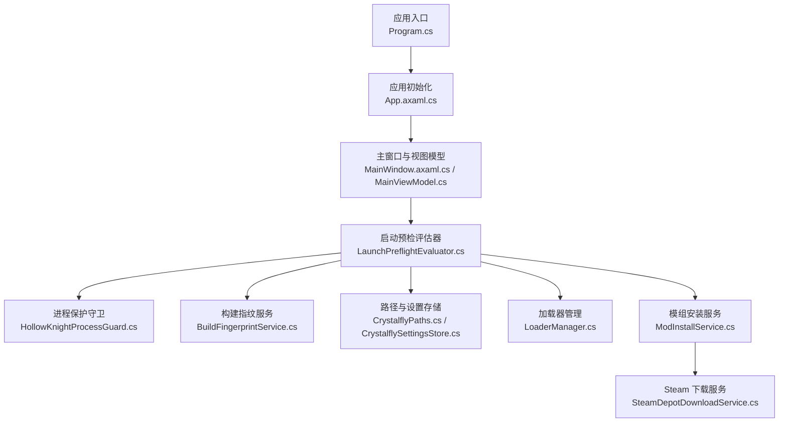
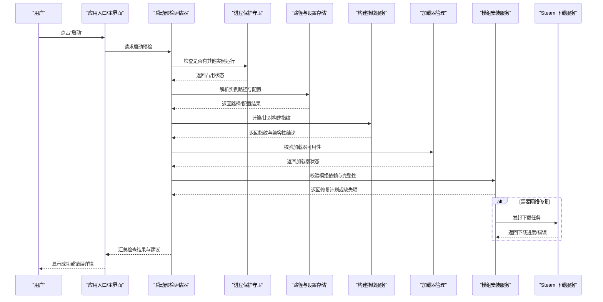
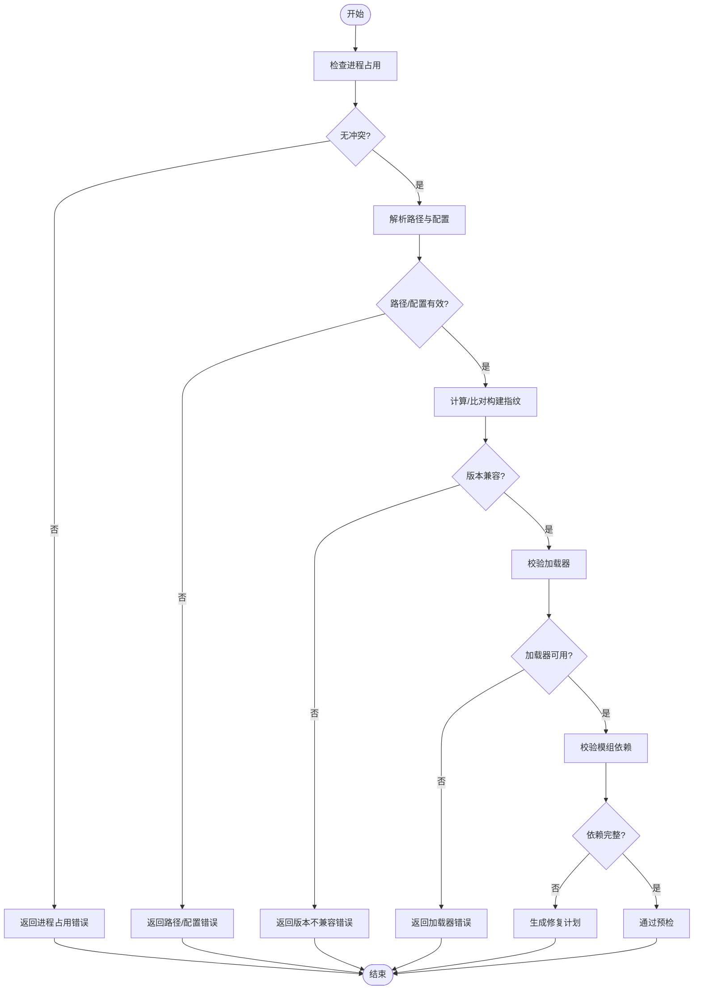
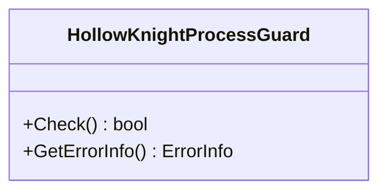
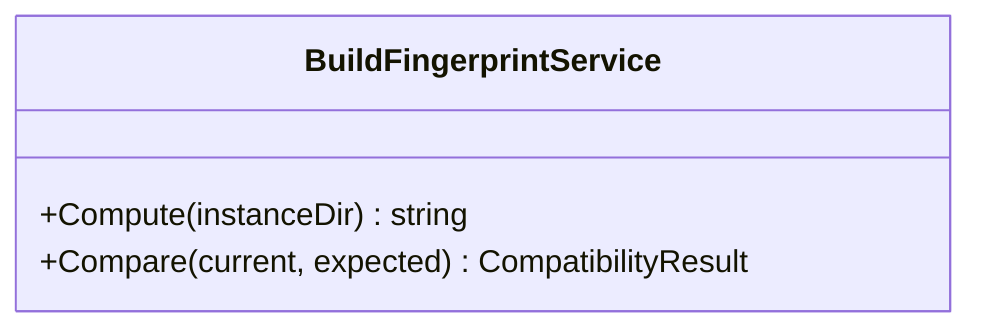
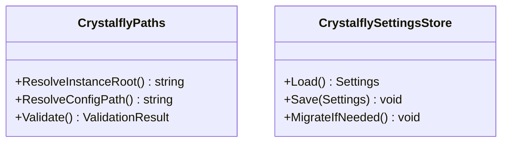
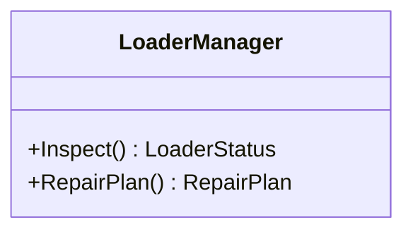
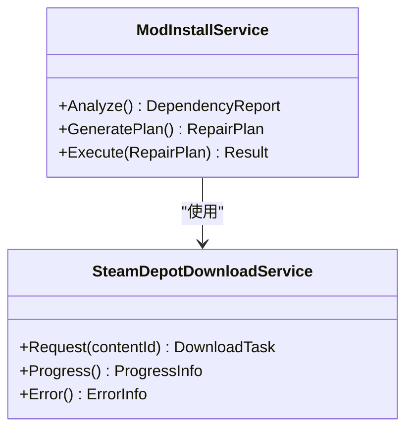
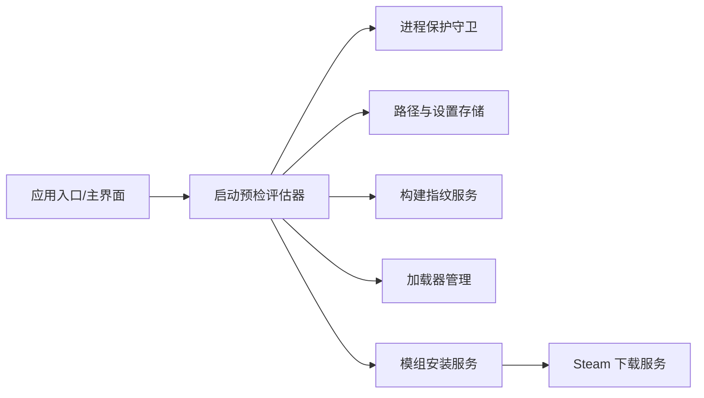
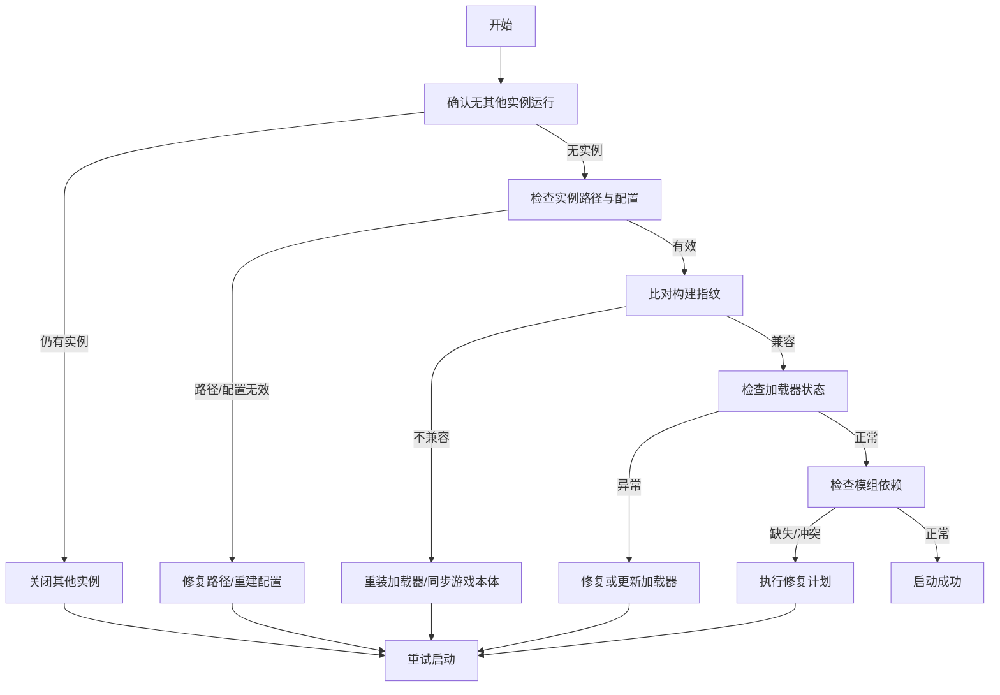

# 启动失败诊断

<cite>
**本文引用的文件**   
- [Program.cs](file://src/Crystalfly.App/Program.cs)
- [App.axaml.cs](file://src/Crystalfly.App/App.axaml.cs)
- [MainWindow.axaml.cs](file://src/Crystalfly.App/Views/MainWindow.axaml.cs)
- [MainViewModel.cs](file://src/Crystalfly.App/ViewModels/MainViewModel.cs)
- [LaunchPreflightEvaluator.cs](file://src/Crystalfly.Core/Runtime/LaunchPreflightEvaluator.cs)
- [HollowKnightProcessGuard.cs](file://src/Crystalfly.Core/Runtime/HollowKnightProcessGuard.cs)
- [BuildFingerprintService.cs](file://src/Crystalfly.Core/Instances/BuildFingerprintService.cs)
- [CrystalflyPaths.cs](file://src/Crystalfly.Core/Configuration/CrystalflyPaths.cs)
- [CrystalflySettingsStore.cs](file://src/Crystalfly.Core/Configuration/CrystalflySettingsStore.cs)
- [InstanceSidecar.cs](file://src/Crystalfly.Core/Instances/InstanceSidecar.cs)
- [LoaderManager.cs](file://src/Crystalfly.Core/Loaders/LoaderManager.cs)
- [ModInstallService.cs](file://src/Crystalfly.Core/Mods/ModInstallService.cs)
- [SteamDepotDownloadService.cs](file://src/Crystalffly.Steam/Downloads/SteamDepotDownloadService.cs)
</cite>

## 目录
1. [简介](#简介)
2. [项目结构](#项目结构)
3. [核心组件](#核心组件)
4. [架构总览](#架构总览)
5. [详细组件分析](#详细组件分析)
6. [依赖关系分析](#依赖关系分析)
7. [性能考虑](#性能考虑)
8. [故障排查指南](#故障排查指南)
9. [结论](#结论)
10. [附录](#附录)

## 简介
本指南聚焦 Crystalfly 在“启动前”阶段的诊断与排障，覆盖以下关键主题：
- 预检评估机制：依赖检查、环境验证、配置校验
- 构建指纹服务与版本兼容性检查
- 进程保护机制（防止多实例并行）
- 常见错误码含义与修复步骤
- 启动失败场景的流程图与日志定位技巧
- 手动修复损坏的实例配置与游戏文件

目标读者包括普通用户与开发者，力求以循序渐进的方式帮助快速定位并解决启动失败问题。

## 项目结构
与启动失败诊断直接相关的代码主要分布在以下模块：
- 应用入口与主界面：负责初始化、加载视图模型、触发启动流程
- 运行时预检与进程保护：负责启动前的环境、依赖、配置校验以及单实例保护
- 实例与构建指纹：负责实例路径解析、构建指纹计算与版本一致性校验
- 加载器与模组安装：负责加载器可用性检测与模组依赖修复
- Steam 下载服务：负责从 Steam 拉取缺失内容时的网络与权限处理

图表来源
- [Program.cs](file://src/Crystalfly.App/Program.cs)
- [App.axaml.cs](file://src/Crystalfly.App/App.axaml.cs)
- [MainWindow.axaml.cs](file://src/Crystalfly.App/Views/MainWindow.axaml.cs)
- [MainViewModel.cs](file://src/Crystalfly.App/ViewModels/MainViewModel.cs)
- [LaunchPreflightEvaluator.cs](file://src/Crystalfly.Core/Runtime/LaunchPreflightEvaluator.cs)
- [HollowKnightProcessGuard.cs](file://src/Crystalfly.Core/Runtime/HollowKnightProcessGuard.cs)
- [BuildFingerprintService.cs](file://src/Crystalfly.Core/Instances/BuildFingerprintService.cs)
- [CrystalflyPaths.cs](file://src/Crystalfly.Core/Configuration/CrystalflyPaths.cs)
- [CrystalflySettingsStore.cs](file://src/Crystalfly.Core/Configuration/CrystalflySettingsStore.cs)
- [LoaderManager.cs](file://src/Crystalfly.Core/Loaders/LoaderManager.cs)
- [ModInstallService.cs](file://src/Crystalfly.Core/Mods/ModInstallService.cs)
- [SteamDepotDownloadService.cs](file://src/Crystalffly.Steam/Downloads/SteamDepotDownloadService.cs)

章节来源
- [Program.cs](file://src/Crystalfly.App/Program.cs)
- [App.axaml.cs](file://src/Crystalfly.App/App.axaml.cs)
- [MainWindow.axaml.cs](file://src/Crystalfly.App/Views/MainWindow.axaml.cs)
- [MainViewModel.cs](file://src/Crystalfly.App/ViewModels/MainViewModel.cs)

## 核心组件
- 启动预检评估器：集中执行启动前的各项检查，包括依赖、环境、配置与完整性校验，并在发现问题时给出可操作的修复建议。
- 进程保护守卫：确保同一时间仅有一个游戏实例运行，避免资源冲突与状态不一致。
- 构建指纹服务：基于实例内容与加载器信息生成唯一指纹，用于版本一致性与兼容性判断。
- 路径与设置存储：提供统一的实例根目录、配置文件读写能力，保证路径解析与配置读取的一致性。
- 加载器管理：检测加载器是否可用、版本是否匹配，必要时提示修复或更新。
- 模组安装服务：在预检阶段发现模组依赖缺失或不一致时，生成修复计划并协调下载与安装。
- Steam 下载服务：当需要通过网络获取缺失内容时，负责与 Steam 交互并处理进度与错误。

章节来源
- [LaunchPreflightEvaluator.cs](file://src/Crystalfly.Core/Runtime/LaunchPreflightEvaluator.cs)
- [HollowKnightProcessGuard.cs](file://src/Crystalfly.Core/Runtime/HollowKnightProcessGuard.cs)
- [BuildFingerprintService.cs](file://src/Crystalfly.Core/Instances/BuildFingerprintService.cs)
- [CrystalflyPaths.cs](file://src/Crystalfly.Core/Configuration/CrystalflyPaths.cs)
- [CrystalflySettingsStore.cs](file://src/Crystalfly.Core/Configuration/CrystalflySettingsStore.cs)
- [LoaderManager.cs](file://src/Crystalfly.Core/Loaders/LoaderManager.cs)
- [ModInstallService.cs](file://src/Crystalfly.Core/Mods/ModInstallService.cs)
- [SteamDepotDownloadService.cs](file://src/Crystalffly.Steam/Downloads/SteamDepotDownloadService.cs)

## 架构总览
下图展示了启动前关键流程中各组件的协作关系与数据流向。

图表来源
- [Program.cs](file://src/Crystalfly.App/Program.cs)
- [MainWindow.axaml.cs](file://src/Crystalfly.App/Views/MainWindow.axaml.cs)
- [MainViewModel.cs](file://src/Crystalfly.App/ViewModels/MainViewModel.cs)
- [LaunchPreflightEvaluator.cs](file://src/Crystalfly.Core/Runtime/LaunchPreflightEvaluator.cs)
- [HollowKnightProcessGuard.cs](file://src/Crystalfly.Core/Runtime/HollowKnightProcessGuard.cs)
- [CrystalflyPaths.cs](file://src/Crystalfly.Core/Configuration/CrystalflyPaths.cs)
- [CrystalflySettingsStore.cs](file://src/Crystalfly.Core/Configuration/CrystalflySettingsStore.cs)
- [BuildFingerprintService.cs](file://src/Crystalfly.Core/Instances/BuildFingerprintService.cs)
- [LoaderManager.cs](file://src/Crystalfly.Core/Loaders/LoaderManager.cs)
- [ModInstallService.cs](file://src/Crystalfly.Core/Mods/ModInstallService.cs)
- [SteamDepotDownloadService.cs](file://src/Crystalffly.Steam/Downloads/SteamDepotDownloadService.cs)

## 详细组件分析

### 启动预检评估器（LaunchPreflightEvaluator）
职责与流程要点：
- 统一编排启动前的所有检查项，按顺序执行并收集错误与建议。
- 典型检查项包括：
  - 进程保护：是否存在正在运行的游戏实例
  - 路径与配置：实例根目录、必要文件与配置文件是否存在且可读
  - 构建指纹：当前实例内容与期望版本是否一致
  - 加载器：加载器二进制与清单是否完整、版本是否兼容
  - 模组依赖：已安装模组的依赖图是否闭合，是否存在缺失或冲突
- 对可自动修复的问题，生成修复计划；对需人工干预的问题，输出明确错误码与修复指引。

图表来源
- [LaunchPreflightEvaluator.cs](file://src/Crystalfly.Core/Runtime/LaunchPreflightEvaluator.cs)

章节来源
- [LaunchPreflightEvaluator.cs](file://src/Crystalfly.Core/Runtime/LaunchPreflightEvaluator.cs)

### 进程保护机制（HollowKnightProcessGuard）
工作原理：
- 在启动前尝试获取全局互斥对象或锁定文件，若已被占用则判定存在其他实例。
- 返回明确的“实例已运行”错误码，阻止重复启动，避免资源竞争与状态不一致。

图表来源
- [HollowKnightProcessGuard.cs](file://src/Crystalfly.Core/Runtime/HollowKnightProcessGuard.cs)

章节来源
- [HollowKnightProcessGuard.cs](file://src/Crystalfly.Core/Runtime/HollowKnightProcessGuard.cs)

### 构建指纹服务（BuildFingerprintService）
工作原理：
- 基于实例目录中的关键文件集合（如游戏本体、加载器、重要配置等）计算哈希值，形成“构建指纹”。
- 将当前指纹与期望指纹进行比对，用于判断版本一致性与兼容性。
- 当检测到差异时，给出具体差异点与修复建议（例如重新安装加载器、同步官方目录等）。

图表来源
- [BuildFingerprintService.cs](file://src/Crystalfly.Core/Instances/BuildFingerprintService.cs)

章节来源
- [BuildFingerprintService.cs](file://src/Crystalfly.Core/Instances/BuildFingerprintService.cs)

### 路径与配置（CrystalflyPaths、CrystalflySettingsStore）
职责：
- 提供统一的实例根目录、子目录与配置文件路径解析。
- 安全地读写设置，支持默认值回退与迁移策略。
- 在预检阶段验证必要路径与文件的可用性。

图表来源
- [CrystalflyPaths.cs](file://src/Crystalfly.Core/Configuration/CrystalflyPaths.cs)
- [CrystalflySettingsStore.cs](file://src/Crystalfly.Core/Configuration/CrystalflySettingsStore.cs)

章节来源
- [CrystalflyPaths.cs](file://src/Crystalfly.Core/Configuration/CrystalflyPaths.cs)
- [CrystalflySettingsStore.cs](file://src/Crystalfly.Core/Configuration/CrystalflySettingsStore.cs)

### 加载器管理（LoaderManager）
职责：
- 检测加载器二进制与清单文件是否存在、版本是否匹配。
- 在预检阶段报告加载器不可用或不兼容的错误码，并给出修复建议（如重新安装加载器包）。

图表来源
- [LoaderManager.cs](file://src/Crystalfly.Core/Loaders/LoaderManager.cs)

章节来源
- [LoaderManager.cs](file://src/Crystalfly.Core/Loaders/LoaderManager.cs)

### 模组安装服务（ModInstallService）
职责：
- 在预检阶段扫描已安装模组及其依赖图，识别缺失、冲突或不一致的依赖。
- 生成修复计划，必要时调用 Steam 下载服务获取缺失内容。
- 记录修复过程与结果，便于后续审计与回溯。

图表来源
- [ModInstallService.cs](file://src/Crystalfly.Core/Mods/ModInstallService.cs)
- [SteamDepotDownloadService.cs](file://src/Crystalffly.Steam/Downloads/SteamDepotDownloadService.cs)

章节来源
- [ModInstallService.cs](file://src/Crystalfly.Core/Mods/ModInstallService.cs)
- [SteamDepotDownloadService.cs](file://src/Crystalffly.Steam/Downloads/SteamDepotDownloadService.cs)

## 依赖关系分析
- 应用入口与主界面依赖启动预检评估器，由后者统一协调进程保护、路径配置、构建指纹、加载器与模组依赖的检查。
- 构建指纹服务与路径/设置存储为预检提供基础数据。
- 模组安装服务可能依赖 Steam 下载服务完成网络修复。
- 加载器管理与模组安装共同影响最终的可启动性。

图表来源
- [Program.cs](file://src/Crystalfly.App/Program.cs)
- [MainWindow.axaml.cs](file://src/Crystalfly.App/Views/MainWindow.axaml.cs)
- [MainViewModel.cs](file://src/Crystalfly.App/ViewModels/MainViewModel.cs)
- [LaunchPreflightEvaluator.cs](file://src/Crystalfly.Core/Runtime/LaunchPreflightEvaluator.cs)
- [HollowKnightProcessGuard.cs](file://src/Crystalfly.Core/Runtime/HollowKnightProcessGuard.cs)
- [CrystalflyPaths.cs](file://src/Crystalfly.Core/Configuration/CrystalflyPaths.cs)
- [CrystalflySettingsStore.cs](file://src/Crystalfly.Core/Configuration/CrystalflySettingsStore.cs)
- [BuildFingerprintService.cs](file://src/Crystalfly.Core/Instances/BuildFingerprintService.cs)
- [LoaderManager.cs](file://src/Crystalfly.Core/Loaders/LoaderManager.cs)
- [ModInstallService.cs](file://src/Crystalfly.Core/Mods/ModInstallService.cs)
- [SteamDepotDownloadService.cs](file://src/Crystalffly.Steam/Downloads/SteamDepotDownloadService.cs)

章节来源
- [LaunchPreflightEvaluator.cs](file://src/Crystalfly.Core/Runtime/LaunchPreflightEvaluator.cs)
- [ModInstallService.cs](file://src/Crystalfly.Core/Mods/ModInstallService.cs)

## 性能考虑
- 预检阶段应避免不必要的磁盘扫描与网络请求，优先使用缓存的指纹与清单。
- 对于大型实例，构建指纹计算可采用增量策略，仅对变更文件重算。
- 模组依赖分析应延迟到真正需要时再深度展开，减少首次启动开销。
- 网络下载任务应合并与去重，避免重复请求相同内容。

[本节为通用指导，无需源码引用]

## 故障排查指南

### 常见错误码与含义（示例）
以下为预检阶段可能返回的典型错误类别与含义说明（实际错误码以实现为准）：
- 进程占用错误：表示已有游戏实例在运行，需先关闭该实例后再试。
- 路径/配置错误：实例根目录不存在、缺少必要文件或配置文件损坏。
- 版本不兼容：构建指纹与期望版本不一致，可能是加载器或游戏本体未对齐。
- 加载器错误：加载器缺失、版本不匹配或清单异常。
- 模组依赖错误：模组依赖缺失、冲突或未正确安装。
- 网络下载错误：Steam 下载失败、权限不足或网络不可达。

章节来源
- [LaunchPreflightEvaluator.cs](file://src/Crystalfly.Core/Runtime/LaunchPreflightEvaluator.cs)
- [HollowKnightProcessGuard.cs](file://src/Crystalfly.Core/Runtime/HollowKnightProcessGuard.cs)
- [BuildFingerprintService.cs](file://src/Crystalfly.Core/Instances/BuildFingerprintService.cs)
- [LoaderManager.cs](file://src/Crystalfly.Core/Loaders/LoaderManager.cs)
- [ModInstallService.cs](file://src/Crystalfly.Core/Mods/ModInstallService.cs)
- [SteamDepotDownloadService.cs](file://src/Crystalffly.Steam/Downloads/SteamDepotDownloadService.cs)

### 启动失败排查流程图

[此图为概念流程，无需源码引用]

### 日志分析技巧
- 定位预检阶段日志：关注“启动预检评估器”相关条目，查看逐项检查的结果与错误码。
- 构建指纹差异：查找指纹计算与比对日志，确认哪些文件导致差异。
- 加载器与模组：关注加载器清单与模组依赖图的解析日志，识别缺失或冲突项。
- 网络下载：查看 Steam 下载服务的进度与错误信息，确认权限与网络连通性。

章节来源
- [LaunchPreflightEvaluator.cs](file://src/Crystalfly.Core/Runtime/LaunchPreflightEvaluator.cs)
- [BuildFingerprintService.cs](file://src/Crystalfly.Core/Instances/BuildFingerprintService.cs)
- [LoaderManager.cs](file://src/Crystalfly.Core/Loaders/LoaderManager.cs)
- [ModInstallService.cs](file://src/Crystalfly.Core/Mods/ModInstallService.cs)
- [SteamDepotDownloadService.cs](file://src/Crystalffly.Steam/Downloads/SteamDepotDownloadService.cs)

### 手动修复损坏的实例配置与游戏文件
- 清理并重建实例目录：
  - 备份现有实例目录后，删除或重命名损坏的子目录，让系统重新生成默认结构与配置。
- 修复加载器：
  - 根据加载器管理返回的错误码，重新安装或更新加载器包，确保清单与二进制一致。
- 修复模组依赖：
  - 使用模组安装服务生成的修复计划，执行依赖修复；必要时卸载冲突模组后重新安装。
- 网络修复：
  - 若涉及 Steam 下载，确认网络可达与账户权限，重试下载任务。

章节来源
- [CrystalflyPaths.cs](file://src/Crystalfly.Core/Configuration/CrystalflyPaths.cs)
- [CrystalflySettingsStore.cs](file://src/Crystalfly.Core/Configuration/CrystalflySettingsStore.cs)
- [LoaderManager.cs](file://src/Crystalfly.Core/Loaders/LoaderManager.cs)
- [ModInstallService.cs](file://src/Crystalfly.Core/Mods/ModInstallService.cs)
- [SteamDepotDownloadService.cs](file://src/Crystalffly.Steam/Downloads/SteamDepotDownloadService.cs)

## 结论
通过系统化的预检评估、严格的进程保护、可靠的构建指纹与版本兼容性检查，Crystalfly 能够在启动前尽早暴露问题并提供可操作的修复建议。结合清晰的错误码与日志定位技巧，用户可以快速恢复稳定运行。建议在复杂场景中优先依赖自动修复计划，并在必要时进行手动干预。

[本节为总结性内容，无需源码引用]

## 附录
- 术语说明：
  - 构建指纹：基于实例关键文件集合计算的唯一标识，用于版本一致性与兼容性判断。
  - 预检评估：启动前对依赖、环境、配置与完整性进行的综合检查。
  - 修复计划：针对发现的问题生成的可执行修复步骤集合。

[本节为补充说明，无需源码引用]