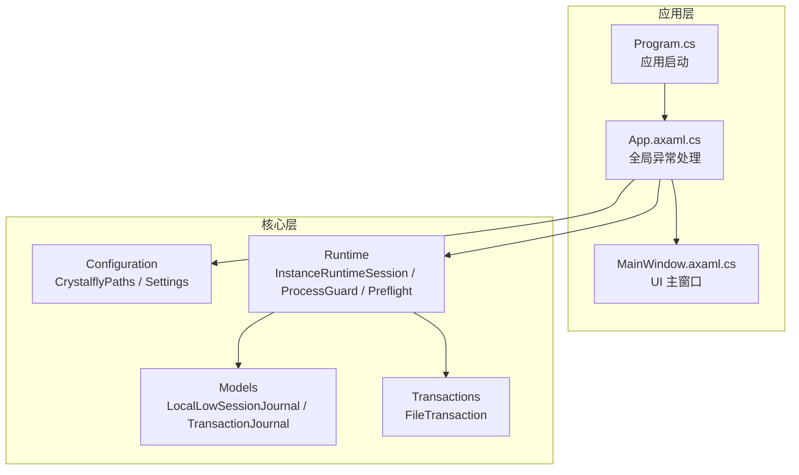
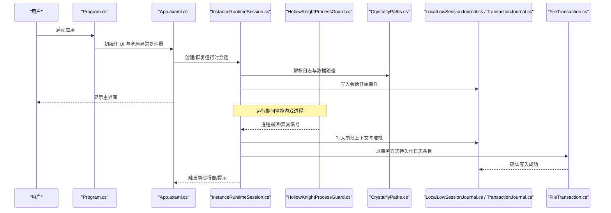
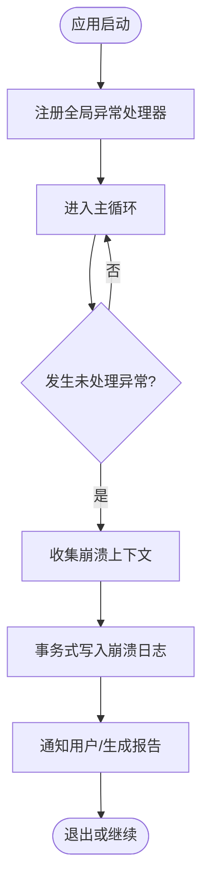
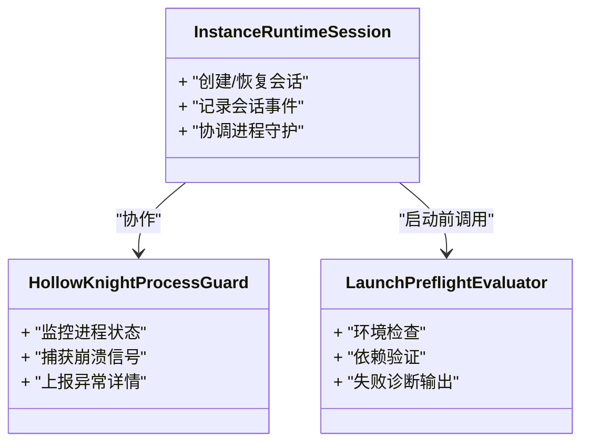
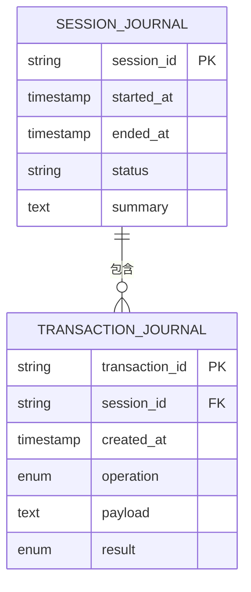
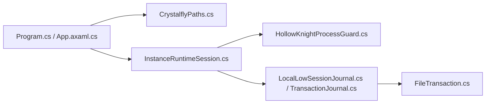

# 崩溃日志分析

<cite>
**本文引用的文件**   
- [Program.cs](file://src/Crystalfly.App/Program.cs)
- [App.axaml.cs](file://src/Crystalfly.App/App.axaml.cs)
- [MainWindow.axaml.cs](file://src/Crystalfly.App/Views/MainWindow.axaml.cs)
- [CrystalflyPaths.cs](file://src/Crystalfly.Core/Configuration/CrystalflyPaths.cs)
- [CrystalflySettings.cs](file://src/Crystalfly.Core/Configuration/CrystalflySettings.cs)
- [CrystalflySettingsStore.cs](file://src/Crystalfly.Core/Configuration/CrystalflySettingsStore.cs)
- [LocalLowSessionJournal.cs](file://src/Crystalfly.Core/Models/LocalLowSessionJournal.cs)
- [TransactionJournal.cs](file://src/Crystalfly.Core/Models/TransactionJournal.cs)
- [FileTransaction.cs](file://src/Crystalfly.Core/Transactions/FileTransaction.cs)
- [InstanceRuntimeSession.cs](file://src/Crystalfly.Core/Runtime/InstanceRuntimeSession.cs)
- [HollowKnightProcessGuard.cs](file://src/Crystalfly.Core/Runtime/HollowKnightProcessGuard.cs)
- [LaunchPreflightEvaluator.cs](file://src/Crystalfly.Core/Runtime/LaunchPreflightEvaluator.cs)
</cite>

## 目录
1. [简介](#简介)
2. [项目结构](#项目结构)
3. [核心组件](#核心组件)
4. [架构总览](#架构总览)
5. [详细组件分析](#详细组件分析)
6. [依赖关系分析](#依赖关系分析)
7. [性能考虑](#性能考虑)
8. [故障排查指南](#故障排查指南)
9. [结论](#结论)
10. [附录](#附录)

## 简介
本指南面向 Crystalfly 的维护者与高级用户，聚焦于“崩溃日志分析”。文档将系统说明：
- 应用程序日志文件的结构与格式规范
- 会话日志与事务日志的记录机制及其重要性
- 堆栈跟踪解读方法与关键错误信息识别技巧
- 常见崩溃模式的分类与修复建议
- 日志聚合分析与故障重现方法
- 使用调试器进行深度诊断的步骤
- 日志清理与归档的最佳实践

## 项目结构
Crystalfly 采用分层模块化组织方式。与崩溃日志相关的关键位置包括：
- 应用入口与全局异常处理（App、Program）
- 运行时会话与进程守护（Runtime）
- 配置与路径解析（Configuration）
- 本地存档与会话/事务模型（Models）
- 事务性文件操作（Transactions）

图表来源
- [Program.cs](file://src/Crystalfly.App/Program.cs)
- [App.axaml.cs](file://src/Crystalfly.App/App.axaml.cs)
- [MainWindow.axaml.cs](file://src/Crystalfly.App/Views/MainWindow.axaml.cs)
- [CrystalflyPaths.cs](file://src/Crystalfly.Core/Configuration/CrystalflyPaths.cs)
- [CrystalflySettings.cs](file://src/Crystalfly.Core/Configuration/CrystalflySettings.cs)
- [CrystalflySettingsStore.cs](file://src/Crystalfly.Core/Configuration/CrystalflySettingsStore.cs)
- [InstanceRuntimeSession.cs](file://src/Crystalfly.Core/Runtime/InstanceRuntimeSession.cs)
- [HollowKnightProcessGuard.cs](file://src/Crystalfly.Core/Runtime/HollowKnightProcessGuard.cs)
- [LaunchPreflightEvaluator.cs](file://src/Crystalfly.Core/Runtime/LaunchPreflightEvaluator.cs)
- [LocalLowSessionJournal.cs](file://src/Crystalfly.Core/Models/LocalLowSessionJournal.cs)
- [TransactionJournal.cs](file://src/Crystalfly.Core/Models/TransactionJournal.cs)
- [FileTransaction.cs](file://src/Crystalfly.Core/Transactions/FileTransaction.cs)

章节来源
- [Program.cs](file://src/Crystalfly.App/Program.cs)
- [App.axaml.cs](file://src/Crystalfly.App/App.axaml.cs)
- [MainWindow.axaml.cs](file://src/Crystalfly.App/Views/MainWindow.axaml.cs)
- [CrystalflyPaths.cs](file://src/Crystalfly.Core/Configuration/CrystalflyPaths.cs)
- [CrystalflySettings.cs](file://src/Crystalfly.Core/Configuration/CrystalflySettings.cs)
- [CrystalflySettingsStore.cs](file://src/Crystalfly.Core/Configuration/CrystalflySettingsStore.cs)
- [InstanceRuntimeSession.cs](file://src/Crystalfly.Core/Runtime/InstanceRuntimeSession.cs)
- [HollowKnightProcessGuard.cs](file://src/Crystalfly.Core/Runtime/HollowKnightProcessGuard.cs)
- [LaunchPreflightEvaluator.cs](file://src/Crystalfly.Core/Runtime/LaunchPreflightEvaluator.cs)
- [LocalLowSessionJournal.cs](file://src/Crystalfly.Core/Models/LocalLowSessionJournal.cs)
- [TransactionJournal.cs](file://src/Crystalfly.Core/Models/TransactionJournal.cs)
- [FileTransaction.cs](file://src/Crystalfly.Core/Transactions/FileTransaction.cs)

## 核心组件
- 应用启动与全局异常捕获
  - Program.cs：负责应用初始化与顶层异常拦截，确保未处理异常可被记录并上报。
  - App.axaml.cs：在 UI 框架生命周期中注册全局异常处理器，统一收集崩溃上下文。
  - MainWindow.axaml.cs：承载主界面逻辑，必要时触发或展示崩溃报告。

- 运行时会话与进程守护
  - InstanceRuntimeSession.cs：管理游戏实例运行期会话，记录启动、退出、异常等关键事件。
  - HollowKnightProcessGuard.cs：监控外部游戏进程状态，捕获进程崩溃信号并写入日志。
  - LaunchPreflightEvaluator.cs：启动前检查环境、依赖与一致性，失败时输出诊断信息。

- 配置与路径
  - CrystalflyPaths.cs：提供日志、数据、缓存等目录的统一解析。
  - CrystalflySettings.cs / CrystalflySettingsStore.cs：持久化设置项，包含日志级别、保留策略等开关。

- 会话与事务日志模型
  - LocalLowSessionJournal.cs：记录与本地存档相关的会话级事件（如加载、保存、校验）。
  - TransactionJournal.cs：记录事务型操作的元数据与结果，便于回滚与审计。
  - FileTransaction.cs：实现原子性文件变更，保证事务日志与文件系统的一致性。

章节来源
- [Program.cs](file://src/Crystalfly.App/Program.cs)
- [App.axaml.cs](file://src/Crystalfly.App/App.axaml.cs)
- [MainWindow.axaml.cs](file://src/Crystalfly.App/Views/MainWindow.axaml.cs)
- [CrystalflyPaths.cs](file://src/Crystalfly.Core/Configuration/CrystalflyPaths.cs)
- [CrystalflySettings.cs](file://src/Crystalfly.Core/Configuration/CrystalflySettings.cs)
- [CrystalflySettingsStore.cs](file://src/Crystalfly.Core/Configuration/CrystalflySettingsStore.cs)
- [InstanceRuntimeSession.cs](file://src/Crystalfly.Core/Runtime/InstanceRuntimeSession.cs)
- [HollowKnightProcessGuard.cs](file://src/Crystalfly.Core/Runtime/HollowKnightProcessGuard.cs)
- [LaunchPreflightEvaluator.cs](file://src/Crystalfly.Core/Runtime/LaunchPreflightEvaluator.cs)
- [LocalLowSessionJournal.cs](file://src/Crystalfly.Core/Models/LocalLowSessionJournal.cs)
- [TransactionJournal.cs](file://src/Crystalfly.Core/Models/TransactionJournal.cs)
- [FileTransaction.cs](file://src/Crystalfly.Core/Transactions/FileTransaction.cs)

## 架构总览
下图展示了从应用启动到崩溃捕获、日志落盘与后续分析的端到端流程。

图表来源
- [Program.cs](file://src/Crystalfly.App/Program.cs)
- [App.axaml.cs](file://src/Crystalfly.App/App.axaml.cs)
- [InstanceRuntimeSession.cs](file://src/Crystalfly.Core/Runtime/InstanceRuntimeSession.cs)
- [HollowKnightProcessGuard.cs](file://src/Crystalfly.Core/Runtime/HollowKnightProcessGuard.cs)
- [CrystalflyPaths.cs](file://src/Crystalfly.Core/Configuration/CrystalflyPaths.cs)
- [LocalLowSessionJournal.cs](file://src/Crystalfly.Core/Models/LocalLowSessionJournal.cs)
- [TransactionJournal.cs](file://src/Crystalfly.Core/Models/TransactionJournal.cs)
- [FileTransaction.cs](file://src/Crystalfly.Core/Transactions/FileTransaction.cs)

## 详细组件分析

### 全局异常处理与崩溃捕获
- 目标：在 UI 线程与非 UI 线程均能捕获未处理异常，避免静默崩溃。
- 关键点：
  - 在应用启动阶段注册全局异常处理器。
  - 捕获异常后提取上下文（时间戳、会话 ID、当前操作、平台信息）。
  - 通过事务式写入确保崩溃日志不丢失。
  - 向用户提供反馈（弹窗或导出报告）。

图表来源
- [Program.cs](file://src/Crystalfly.App/Program.cs)
- [App.axaml.cs](file://src/Crystalfly.App/App.axaml.cs)
- [FileTransaction.cs](file://src/Crystalfly.Core/Transactions/FileTransaction.cs)

章节来源
- [Program.cs](file://src/Crystalfly.App/Program.cs)
- [App.axaml.cs](file://src/Crystalfly.App/App.axaml.cs)
- [FileTransaction.cs](file://src/Crystalfly.Core/Transactions/FileTransaction.cs)

### 运行时会话与进程守护
- 目标：为每次游戏实例运行建立独立会话，并在进程崩溃时快速定位原因。
- 关键点：
  - 会话开始/结束事件记录，关联会话标识与时间范围。
  - 进程守护监听外部进程退出码与异常信号。
  - 预检评估在启动前发现环境问题，减少运行时崩溃概率。

图表来源
- [InstanceRuntimeSession.cs](file://src/Crystalfly.Core/Runtime/InstanceRuntimeSession.cs)
- [HollowKnightProcessGuard.cs](file://src/Crystalfly.Core/Runtime/HollowKnightProcessGuard.cs)
- [LaunchPreflightEvaluator.cs](file://src/Crystalfly.Core/Runtime/LaunchPreflightEvaluator.cs)

章节来源
- [InstanceRuntimeSession.cs](file://src/Crystalfly.Core/Runtime/InstanceRuntimeSession.cs)
- [HollowKnightProcessGuard.cs](file://src/Crystalfly.Core/Runtime/HollowKnightProcessGuard.cs)
- [LaunchPreflightEvaluator.cs](file://src/Crystalfly.Core/Runtime/LaunchPreflightEvaluator.cs)

### 会话日志与事务日志
- 会话日志（LocalLowSessionJournal）：
  - 记录与本地存档相关的会话事件，如加载、保存、校验、冲突检测等。
  - 用于还原玩家进度与定位存档损坏问题。
- 事务日志（TransactionJournal + FileTransaction）：
  - 对文件变更进行原子包装，记录事务元数据与结果。
  - 支持回滚与一致性校验，避免部分写入导致的损坏。

图表来源
- [LocalLowSessionJournal.cs](file://src/Crystalfly.Core/Models/LocalLowSessionJournal.cs)
- [TransactionJournal.cs](file://src/Crystalfly.Core/Models/TransactionJournal.cs)
- [FileTransaction.cs](file://src/Crystalfly.Core/Transactions/FileTransaction.cs)

章节来源
- [LocalLowSessionJournal.cs](file://src/Crystalfly.Core/Models/LocalLowSessionJournal.cs)
- [TransactionJournal.cs](file://src/Crystalfly.Core/Models/TransactionJournal.cs)
- [FileTransaction.cs](file://src/Crystalfly.Core/Transactions/FileTransaction.cs)

### 配置与路径
- CrystalflyPaths：集中定义日志、数据、缓存、存档等目录解析规则，确保跨平台一致性与可配置性。
- CrystalflySettings / CrystalflySettingsStore：提供日志级别、保留天数、是否启用详细日志等选项的读写接口。

章节来源
- [CrystalflyPaths.cs](file://src/Crystalfly.Core/Configuration/CrystalflyPaths.cs)
- [CrystalflySettings.cs](file://src/Crystalfly.Core/Configuration/CrystalflySettings.cs)
- [CrystalflySettingsStore.cs](file://src/Crystalfly.Core/Configuration/CrystalflySettingsStore.cs)

## 依赖关系分析
- 低耦合高内聚：
  - 全局异常处理仅依赖路径与事务写入，避免直接耦合业务逻辑。
  - 运行时会话与进程守护通过明确接口交互，便于替换与测试。
- 外部依赖点：
  - 操作系统进程监控 API（用于外部游戏进程守护）。
  - 文件系统 I/O（事务日志与会话日志落盘）。
  - 平台差异（路径分隔符、权限模型）。

图表来源
- [Program.cs](file://src/Crystalfly.App/Program.cs)
- [App.axaml.cs](file://src/Crystalfly.App/App.axaml.cs)
- [CrystalflyPaths.cs](file://src/Crystalfly.Core/Configuration/CrystalflyPaths.cs)
- [InstanceRuntimeSession.cs](file://src/Crystalfly.Core/Runtime/InstanceRuntimeSession.cs)
- [HollowKnightProcessGuard.cs](file://src/Crystalfly.Core/Runtime/HollowKnightProcessGuard.cs)
- [LocalLowSessionJournal.cs](file://src/Crystalfly.Core/Models/LocalLowSessionJournal.cs)
- [TransactionJournal.cs](file://src/Crystalfly.Core/Models/TransactionJournal.cs)
- [FileTransaction.cs](file://src/Crystalfly.Core/Transactions/FileTransaction.cs)

章节来源
- [Program.cs](file://src/Crystalfly.App/Program.cs)
- [App.axaml.cs](file://src/Crystalfly.App/App.axaml.cs)
- [CrystalflyPaths.cs](file://src/Crystalfly.Core/Configuration/CrystalflyPaths.cs)
- [InstanceRuntimeSession.cs](file://src/Crystalfly.Core/Runtime/InstanceRuntimeSession.cs)
- [HollowKnightProcessGuard.cs](file://src/Crystalfly.Core/Runtime/HollowKnightProcessGuard.cs)
- [LocalLowSessionJournal.cs](file://src/Crystalfly.Core/Models/LocalLowSessionJournal.cs)
- [TransactionJournal.cs](file://src/Crystalfly.Core/Models/TransactionJournal.cs)
- [FileTransaction.cs](file://src/Crystalfly.Core/Transactions/FileTransaction.cs)

## 性能考虑
- 日志写入频率控制：
  - 高频事件（如下载进度）应节流或批量写入，避免阻塞主线程。
  - 使用异步 I/O 与缓冲队列降低磁盘压力。
- 事务开销权衡：
  - 对关键路径（存档、安装、更新）使用事务；非关键路径可降级为普通写入以提升吞吐。
- 日志轮转与压缩：
  - 按大小或时间轮转，定期压缩归档，减少磁盘占用与检索成本。
- 路径与权限：
  - 合理选择日志目录，避免写入受限路径导致异常与重试风暴。

[本节为通用指导，无需特定文件引用]

## 故障排查指南

### 日志文件结构与格式规范
- 会话日志（LocalLowSessionJournal）：
  - 关键字段：会话 ID、开始/结束时间、状态、摘要。
  - 用途：还原玩家会话上下文，定位存档相关问题。
- 事务日志（TransactionJournal + FileTransaction）：
  - 关键字段：事务 ID、会话 ID、操作类型、负载摘要、结果。
  - 用途：审计文件变更、支持回滚与一致性校验。
- 崩溃日志：
  - 关键字段：时间戳、会话 ID、异常类型、消息、堆栈跟踪、平台信息、当前操作。
  - 格式建议：结构化 JSON 或带分隔符的文本行，便于聚合与分析。

章节来源
- [LocalLowSessionJournal.cs](file://src/Crystalfly.Core/Models/LocalLowSessionJournal.cs)
- [TransactionJournal.cs](file://src/Crystalfly.Core/Models/TransactionJournal.cs)
- [FileTransaction.cs](file://src/Crystalfly.Core/Transactions/FileTransaction.cs)

### 会话日志与事务日志的记录机制与重要性
- 记录机制：
  - 会话开始即创建会话记录，结束时更新状态与摘要。
  - 所有影响文件系统的操作包裹在事务中，先写日志再执行变更，成功后提交，失败则回滚。
- 重要性：
  - 会话日志帮助复现玩家行为序列。
  - 事务日志保障数据一致性与可恢复性。

章节来源
- [InstanceRuntimeSession.cs](file://src/Crystalfly.Core/Runtime/InstanceRuntimeSession.cs)
- [LocalLowSessionJournal.cs](file://src/Crystalfly.Core/Models/LocalLowSessionJournal.cs)
- [TransactionJournal.cs](file://src/Crystalfly.Core/Models/TransactionJournal.cs)
- [FileTransaction.cs](file://src/Crystalfly.Core/Transactions/FileTransaction.cs)

### 堆栈跟踪解读方法与关键错误信息识别
- 解读步骤：
  - 定位最上层异常类型与消息，确定崩溃类别（空引用、越界、IO、网络、权限等）。
  - 沿堆栈自顶向下追踪最近一次业务调用，结合会话日志中的“当前操作”字段缩小范围。
  - 关注事务日志中的“操作类型”与“结果”，判断是否为部分写入或回滚失败。
- 关键信息：
  - 时间戳与会话 ID：用于关联多源日志。
  - 平台与环境信息：区分不同 OS、版本、路径差异。
  - 外部进程退出码：来自进程守护，辅助定位游戏侧崩溃。

章节来源
- [HollowKnightProcessGuard.cs](file://src/Crystalfly.Core/Runtime/HollowKnightProcessGuard.cs)
- [InstanceRuntimeSession.cs](file://src/Crystalfly.Core/Runtime/InstanceRuntimeSession.cs)
- [TransactionJournal.cs](file://src/Crystalfly.Core/Models/TransactionJournal.cs)

### 常见崩溃模式分类与修复方案
- 进程崩溃类：
  - 现象：外部游戏进程异常退出，守护捕获退出码。
  - 修复：检查依赖库、补丁兼容性、内存不足、驱动问题；优化预检评估。
- 文件 I/O 类：
  - 现象：权限拒绝、路径不存在、磁盘满、锁冲突。
  - 修复：修正路径解析、提升权限、释放资源、增加重试与退避。
- 事务不一致类：
  - 现象：事务提交失败但已部分写入。
  - 修复：完善回滚逻辑、幂等设计、校验和比对。
- 会话异常类：
  - 现象：会话状态机非法转换、缺少必要上下文。
  - 修复：增强前置校验、补充缺失字段、改进状态迁移。

章节来源
- [HollowKnightProcessGuard.cs](file://src/Crystalfly.Core/Runtime/HollowKnightProcessGuard.cs)
- [CrystalflyPaths.cs](file://src/Crystalfly.Core/Configuration/CrystalflyPaths.cs)
- [FileTransaction.cs](file://src/Crystalfly.Core/Transactions/FileTransaction.cs)
- [InstanceRuntimeSession.cs](file://src/Crystalfly.Core/Runtime/InstanceRuntimeSession.cs)

### 日志聚合分析与故障重现
- 聚合分析：
  - 将多实例日志汇聚至中心存储，按会话 ID 与时间窗口聚合。
  - 使用指标统计崩溃率、事务失败率、I/O 错误分布。
- 故障重现：
  - 基于会话日志回放关键操作序列。
  - 使用事务日志重放文件变更，构建最小复现场景。
  - 注入相同环境变量与路径，确保一致性。

章节来源
- [LocalLowSessionJournal.cs](file://src/Crystalfly.Core/Models/LocalLowSessionJournal.cs)
- [TransactionJournal.cs](file://src/Crystalfly.Core/Models/TransactionJournal.cs)
- [CrystalflyPaths.cs](file://src/Crystalfly.Core/Configuration/CrystalflyPaths.cs)

### 使用调试器进行深度问题诊断
- 附加调试器：
  - 在开发环境中附加到运行中的 Crystalfly 进程，开启断点与条件断点。
- 关键断点位置：
  - 全局异常处理器入口。
  - 事务提交/回滚边界。
  - 进程守护回调。
- 抓取诊断信息：
  - 导出当前会话上下文与事务快照。
  - 采集内存快照与线程堆栈，分析死锁与泄漏。

章节来源
- [App.axaml.cs](file://src/Crystalfly.App/App.axaml.cs)
- [FileTransaction.cs](file://src/Crystalfly.Core/Transactions/FileTransaction.cs)
- [HollowKnightProcessGuard.cs](file://src/Crystalfly.Core/Runtime/HollowKnightProcessGuard.cs)

### 日志清理与归档最佳实践
- 清理策略：
  - 按保留天数与最大数量双重限制，自动删除过期日志。
  - 对大体积日志进行压缩归档，保留索引以便检索。
- 归档规范：
  - 命名包含日期与会话范围，便于回溯。
  - 元数据清单记录归档内容与哈希校验。
- 安全与隐私：
  - 脱敏敏感信息（路径、用户名、令牌片段）。
  - 限制访问权限，防止未授权读取。

章节来源
- [CrystalflySettings.cs](file://src/Crystalfly.Core/Configuration/CrystalflySettings.cs)
- [CrystalflySettingsStore.cs](file://src/Crystalfly.Core/Configuration/CrystalflySettingsStore.cs)
- [CrystalflyPaths.cs](file://src/Crystalfly.Core/Configuration/CrystalflyPaths.cs)

## 结论
通过统一的异常捕获、完善的会话与事务日志、以及稳健的进程守护，Crystalfly 能够在复杂环境下快速定位与修复崩溃问题。配合日志聚合、故障重现与调试器深度诊断，可显著提升稳定性与用户体验。建议持续优化日志粒度与性能，完善清理归档策略，形成闭环的质量保障体系。

## 附录
- 术语表：
  - 会话日志：记录一次运行周期的关键事件与状态。
  - 事务日志：记录原子性文件变更的元数据与结果。
  - 进程守护：监控外部进程状态并上报异常。
- 参考路径：
  - 日志目录解析：CrystalflyPaths.cs
  - 设置项读写：CrystalflySettings.cs / CrystalflySettingsStore.cs
  - 会话模型：LocalLowSessionJournal.cs
  - 事务模型：TransactionJournal.cs / FileTransaction.cs
  - 运行时会话：InstanceRuntimeSession.cs
  - 进程守护：HollowKnightProcessGuard.cs
  - 启动预检：LaunchPreflightEvaluator.cs
  - 全局异常处理：Program.cs / App.axaml.cs