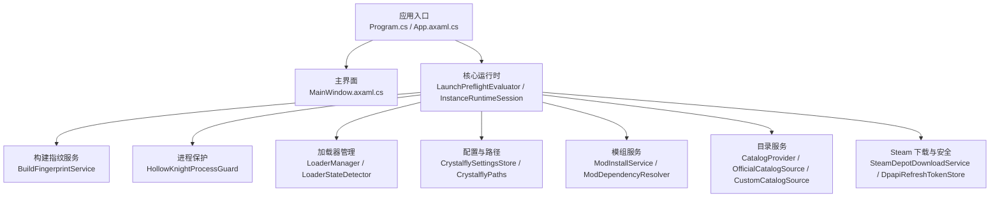
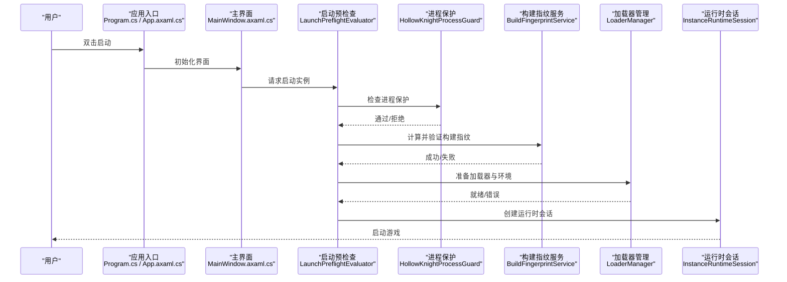
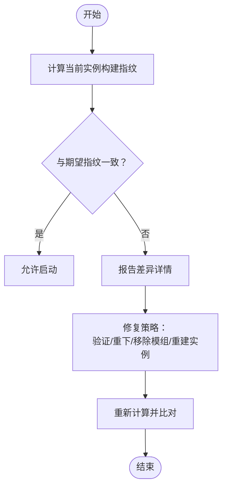
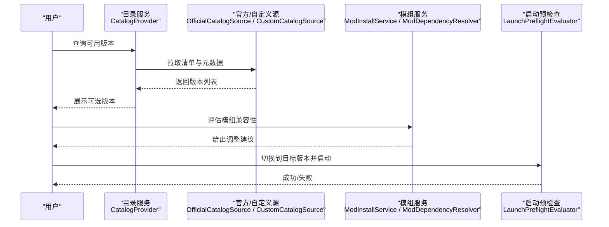
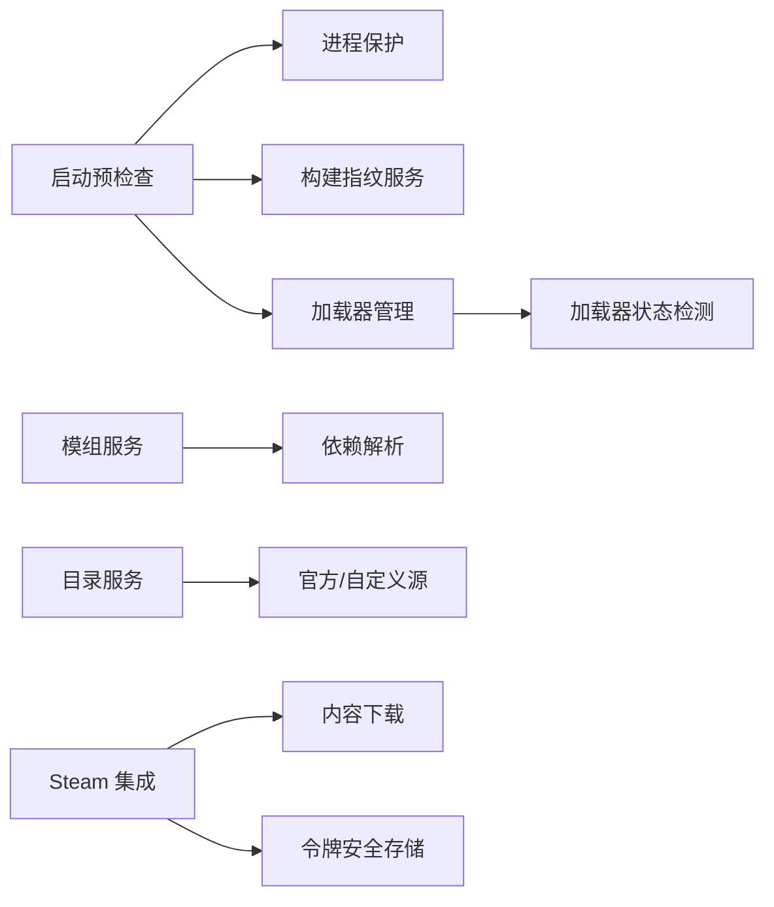

# 运行错误和异常

<cite>
**本文引用的文件**   
- [Program.cs](file://src/Crystalfly.App/Program.cs)
- [App.axaml.cs](file://src/Crystalfly.App/App.axaml.cs)
- [MainWindow.axaml.cs](file://src/Crystalfly.App/Views/MainWindow.axaml.cs)
- [BuildFingerprintService.cs](file://src/Crystalfly.Core/Instances/BuildFingerprintService.cs)
- [BuildFingerprint.cs](file://src/Crystalfly.Core/Models/BuildFingerprint.cs)
- [HollowKnightProcessGuard.cs](file://src/Crystalfly.Core/Runtime/HollowKnightProcessGuard.cs)
- [LaunchPreflightEvaluator.cs](file://src/Crystalfly.Core/Runtime/LaunchPreflightEvaluator.cs)
- [InstanceRuntimeSession.cs](file://src/Crystalfly.Core/Runtime/InstanceRuntimeSession.cs)
- [LoaderManager.cs](file://src/Crystalfly.Core/Loaders/LoaderManager.cs)
- [LoaderStateDetector.cs](file://src/Crystalfly.Core/Loaders/LoaderStateDetector.cs)
- [CrystalflySettingsStore.cs](file://src/Crystalfly.Core/Configuration/CrystalflySettingsStore.cs)
- [CrystalflyPaths.cs](file://src/Crystalfly.Core/Configuration/CrystalflyPaths.cs)
- [ModInstallService.cs](file://src/Crystalfly.Core/Mods/ModInstallService.cs)
- [ModDependencyResolver.cs](file://src/Crystalfly.Core/Mods/ModDependencyResolver.cs)
- [CatalogProvider.cs](file://src/Crystalfly.Core/Catalog/CatalogProvider.cs)
- [OfficialCatalogSource.cs](file://src/Crystalfly.Core/Catalog/OfficialCatalogSource.cs)
- [CustomCatalogSource.cs](file://src/Crystalfly.Core/Catalog/CustomCatalogSource.cs)
- [SteamDepotDownloadService.cs](file://src/Crystalfly.Steam/Downloads/SteamDepotDownloadService.cs)
- [SteamKitContentDeliveryClient.cs](file://src/Crystalfly.Steam/Downloads/SteamKitContentDeliveryClient.cs)
- [DpapiRefreshTokenStore.cs](file://src/Crystalfly.Steam/Security/DpapiRefreshTokenStore.cs)
</cite>

## 目录
1. [简介](#简介)
2. [项目结构](#项目结构)
3. [核心组件](#核心组件)
4. [架构总览](#架构总览)
5. [详细组件分析](#详细组件分析)
6. [依赖关系分析](#依赖关系分析)
7. [性能考虑](#性能考虑)
8. [故障排查指南](#故障排查指南)
9. [结论](#结论)
10. [附录](#附录)

## 简介
本指南聚焦 Crystalfly 在“启动失败、构建指纹验证失败、进程保护触发、运行时异常（内存访问/空引用）、崩溃日志与堆栈解读、版本不兼容处理”等典型问题的诊断与修复。文档以源码为依据，提供从入口到核心服务的调用链、关键校验点与常见错误定位方法，帮助快速恢复游戏实例并稳定运行。

## 项目结构
与运行错误和异常密切相关的代码主要分布在以下模块：
- 应用入口与 UI 层：负责全局异常捕获、窗口初始化与用户交互
- 核心运行时：负责预检、构建指纹校验、进程保护、会话管理、加载器状态检测
- 配置与路径：提供设置持久化与路径解析
- 模组与目录：负责依赖解析、安装计划与冲突处理
- Steam 集成：负责内容下载、认证令牌存储
- 目录清单与服务：负责官方/自定义目录源解析

图表来源
- [Program.cs](file://src/Crystalfly.App/Program.cs)
- [App.axaml.cs](file://src/Crystalfly.App/App.axaml.cs)
- [MainWindow.axaml.cs](file://src/Crystalfly.App/Views/MainWindow.axaml.cs)
- [LaunchPreflightEvaluator.cs](file://src/Crystalfly.Core/Runtime/LaunchPreflightEvaluator.cs)
- [InstanceRuntimeSession.cs](file://src/Crystalfly.Core/Runtime/InstanceRuntimeSession.cs)
- [BuildFingerprintService.cs](file://src/Crystalfly.Core/Instances/BuildFingerprintService.cs)
- [HollowKnightProcessGuard.cs](file://src/Crystalfly.Core/Runtime/HollowKnightProcessGuard.cs)
- [LoaderManager.cs](file://src/Crystalfly.Core/Loaders/LoaderManager.cs)
- [LoaderStateDetector.cs](file://src/Crystalfly.Core/Loaders/LoaderStateDetector.cs)
- [CrystalflySettingsStore.cs](file://src/Crystalfly.Core/Configuration/CrystalflySettingsStore.cs)
- [CrystalflyPaths.cs](file://src/Crystalfly.Core/Configuration/CrystalflyPaths.cs)
- [ModInstallService.cs](file://src/Crystalfly.Core/Mods/ModInstallService.cs)
- [ModDependencyResolver.cs](file://src/Crystalfly.Core/Mods/ModDependencyResolver.cs)
- [CatalogProvider.cs](file://src/Crystalfly.Core/Catalog/CatalogProvider.cs)
- [OfficialCatalogSource.cs](file://src/Crystalfly.Core/Catalog/OfficialCatalogSource.cs)
- [CustomCatalogSource.cs](file://src/Crystalfly.Core/Catalog/CustomCatalogSource.cs)
- [SteamDepotDownloadService.cs](file://src/Crystalfly.Steam/Downloads/SteamDepotDownloadService.cs)
- [DpapiRefreshTokenStore.cs](file://src/Crystalfly.Steam/Security/DpapiRefreshTokenStore.cs)

章节来源
- [Program.cs](file://src/Crystalfly.App/Program.cs)
- [App.axaml.cs](file://src/Crystalfly.App/App.axaml.cs)
- [MainWindow.axaml.cs](file://src/Crystalfly.App/Views/MainWindow.axaml.cs)

## 核心组件
- 应用入口与全局异常捕获：负责统一捕获未处理异常、记录上下文、提示用户并安全退出或重启
- 启动预检查：在启动前执行环境、依赖、权限、路径、网络等前置校验
- 构建指纹服务：计算并比对当前实例的构建指纹，确保游戏文件完整性与一致性
- 进程保护：防止重复启动、非法注入、并发访问导致的损坏
- 加载器管理：封装加载器生命周期、状态探测与错误上报
- 配置与路径：集中管理设置项与关键路径解析
- 模组服务：负责依赖解析、安装计划生成与回滚
- 目录服务：聚合官方与自定义目录源，解析可用版本与元数据
- Steam 集成：负责内容下载与令牌安全存储

章节来源
- [App.axaml.cs](file://src/Crystalfly.App/App.axaml.cs)
- [LaunchPreflightEvaluator.cs](file://src/Crystalfly.Core/Runtime/LaunchPreflightEvaluator.cs)
- [BuildFingerprintService.cs](file://src/Crystalfly.Core/Instances/BuildFingerprintService.cs)
- [HollowKnightProcessGuard.cs](file://src/Crystalfly.Core/Runtime/HollowKnightProcessGuard.cs)
- [LoaderManager.cs](file://src/Crystalfly.Core/Loaders/LoaderManager.cs)
- [LoaderStateDetector.cs](file://src/Crystalfly.Core/Loaders/LoaderStateDetector.cs)
- [CrystalflySettingsStore.cs](file://src/Crystalfly.Core/Configuration/CrystalflySettingsStore.cs)
- [CrystalflyPaths.cs](file://src/Crystalfly.Core/Configuration/CrystalflyPaths.cs)
- [ModInstallService.cs](file://src/Crystalfly.Core/Mods/ModInstallService.cs)
- [ModDependencyResolver.cs](file://src/Crystalfly.Core/Mods/ModDependencyResolver.cs)
- [CatalogProvider.cs](file://src/Crystalfly.Core/Catalog/CatalogProvider.cs)
- [OfficialCatalogSource.cs](file://src/Crystalfly.Core/Catalog/OfficialCatalogSource.cs)
- [CustomCatalogSource.cs](file://src/Crystalfly.Core/Catalog/CustomCatalogSource.cs)
- [SteamDepotDownloadService.cs](file://src/Crystalfly.Steam/Downloads/SteamDepotDownloadService.cs)
- [DpapiRefreshTokenStore.cs](file://src/Crystalfly.Steam/Security/DpapiRefreshTokenStore.cs)

## 架构总览
下图展示了从应用启动到游戏运行的关键流程，以及错误可能出现的阶段与拦截点。

图表来源
- [Program.cs](file://src/Crystalfly.App/Program.cs)
- [App.axaml.cs](file://src/Crystalfly.App/App.axaml.cs)
- [MainWindow.axaml.cs](file://src/Crystalfly.App/Views/MainWindow.axaml.cs)
- [LaunchPreflightEvaluator.cs](file://src/Crystalfly.Core/Runtime/LaunchPreflightEvaluator.cs)
- [HollowKnightProcessGuard.cs](file://src/Crystalfly.Core/Runtime/HollowKnightProcessGuard.cs)
- [BuildFingerprintService.cs](file://src/Crystalfly.Core/Instances/BuildFingerprintService.cs)
- [LoaderManager.cs](file://src/Crystalfly.Core/Loaders/LoaderManager.cs)
- [InstanceRuntimeSession.cs](file://src/Crystalfly.Core/Runtime/InstanceRuntimeSession.cs)

## 详细组件分析

### 启动失败诊断与解决
- 常见症状
  - 点击启动后无响应或立即退出
  - 弹出错误对话框但无法继续
  - 界面显示“启动失败”或“预检查失败”
- 定位要点
  - 全局异常捕获是否生效，是否记录了完整上下文
  - 启动预检查是否返回失败原因（路径、权限、依赖缺失）
  - 进程保护是否阻止了重复启动或检测到异常进程
  - 构建指纹是否不一致导致拒绝启动
- 建议步骤
  - 查看应用日志与最近一次异常信息
  - 确认游戏根目录与配置文件路径可写且存在
  - 关闭其他可能干扰的辅助工具或旧进程
  - 重新执行启动预检查并逐项修复提示的问题
  - 若为网络相关预检查失败，检查代理与防火墙设置

章节来源
- [App.axaml.cs](file://src/Crystalfly.App/App.axaml.cs)
- [MainWindow.axaml.cs](file://src/Crystalfly.App/Views/MainWindow.axaml.cs)
- [LaunchPreflightEvaluator.cs](file://src/Crystalfly.Core/Runtime/LaunchPreflightEvaluator.cs)
- [HollowKnightProcessGuard.cs](file://src/Crystalfly.Core/Runtime/HollowKnightProcessGuard.cs)

### 构建指纹验证失败的常见原因与修复
- 常见原因
  - 游戏文件被手动修改或缺失
  - 模组覆盖或替换了受保护文件
  - 磁盘写入错误或下载不完整
  - 多实例共享同一目录导致指纹漂移
- 修复方案
  - 使用内置修复或重新验证游戏文件完整性
  - 移除可疑模组或恢复到干净基线
  - 清理临时文件并重新下载受影响包
  - 为每个实例使用独立目录，避免共享
- 诊断要点
  - 查看指纹服务输出的差异摘要
  - 对比期望指纹与实际计算结果
  - 关注具体文件路径与变更类型

图表来源
- [BuildFingerprintService.cs](file://src/Crystalfly.Core/Instances/BuildFingerprintService.cs)
- [BuildFingerprint.cs](file://src/Crystalfly.Core/Models/BuildFingerprint.cs)

章节来源
- [BuildFingerprintService.cs](file://src/Crystalfly.Core/Instances/BuildFingerprintService.cs)
- [BuildFingerprint.cs](file://src/Crystalfly.Core/Models/BuildFingerprint.cs)

### 进程保护机制触发的问题与解决方法
- 触发场景
  - 重复启动同一实例
  - 检测到外部注入或不受支持的进程行为
  - 并发访问实例目录导致资源锁定
- 影响
  - 启动被拒绝，提示进程保护已启用
  - 可能导致后续操作不可用
- 解决方法
  - 确保旧进程完全退出后再启动
  - 关闭第三方注入器或调试工具
  - 避免同时打开多个客户端访问同一实例
  - 检查任务管理器中是否存在残留进程

章节来源
- [HollowKnightProcessGuard.cs](file://src/Crystalfly.Core/Runtime/HollowKnightProcessGuard.cs)

### 运行时异常（内存访问、空引用等）调试技巧
- 内存访问异常
  - 通常由模组不兼容、驱动问题或硬件不稳定引起
  - 优先尝试禁用最近安装的模组，逐步缩小范围
  - 更新显卡驱动与系统补丁
- 空引用异常
  - 多为配置缺失、路径解析失败或对象未正确初始化
  - 检查配置项是否为空、路径是否存在、必要服务是否已注册
- 通用技巧
  - 开启详细日志，复现时保留完整堆栈
  - 最小化复现场景：仅启用必要模组与功能
  - 在隔离环境中测试，排除系统级干扰

章节来源
- [CrystalflySettingsStore.cs](file://src/Crystalfly.Core/Configuration/CrystalflySettingsStore.cs)
- [CrystalflyPaths.cs](file://src/Crystalfly.Core/Configuration/CrystalflyPaths.cs)
- [LoaderManager.cs](file://src/Crystalfly.Core/Loaders/LoaderManager.cs)

### 崩溃日志分析与堆栈跟踪解读
- 收集信息
  - 应用日志、最近一次异常、崩溃转储（如有）
  - 操作系统事件查看器中的错误条目
- 分析步骤
  - 定位最后抛出的异常类型与消息
  - 自上而下阅读堆栈，识别首次进入 Crystalfly 代码的位置
  - 结合最近变更（模组、配置、系统更新）进行假设与验证
- 输出要求
  - 包含时间戳、异常类型、消息、堆栈、相关参数与上下文

章节来源
- [App.axaml.cs](file://src/Crystalfly.App/App.axaml.cs)
- [LoaderManager.cs](file://src/Crystalfly.Core/Loaders/LoaderManager.cs)

### 与游戏版本不兼容的处理流程与降级策略
- 现象
  - 启动时报错提示版本不匹配或加载器不兼容
  - 某些功能不可用或出现异常行为
- 处理流程
  - 通过目录服务查询可用版本与兼容性矩阵
  - 评估当前模组与目标版本的兼容性
  - 选择兼容版本并生成迁移计划
- 降级策略
  - 回退到上一个稳定版本
  - 逐步升级并验证关键功能
  - 对不兼容模组进行替换或禁用

图表来源
- [CatalogProvider.cs](file://src/Crystalfly.Core/Catalog/CatalogProvider.cs)
- [OfficialCatalogSource.cs](file://src/Crystalfly.Core/Catalog/OfficialCatalogSource.cs)
- [CustomCatalogSource.cs](file://src/Crystalfly.Core/Catalog/CustomCatalogSource.cs)
- [ModInstallService.cs](file://src/Crystalfly.Core/Mods/ModInstallService.cs)
- [ModDependencyResolver.cs](file://src/Crystalfly.Core/Mods/ModDependencyResolver.cs)
- [LaunchPreflightEvaluator.cs](file://src/Crystalfly.Core/Runtime/LaunchPreflightEvaluator.cs)

章节来源
- [CatalogProvider.cs](file://src/Crystalfly.Core/Catalog/CatalogProvider.cs)
- [OfficialCatalogSource.cs](file://src/Crystalfly.Core/Catalog/OfficialCatalogSource.cs)
- [CustomCatalogSource.cs](file://src/Crystalfly.Core/Catalog/CustomCatalogSource.cs)
- [ModInstallService.cs](file://src/Crystalfly.Core/Mods/ModInstallService.cs)
- [ModDependencyResolver.cs](file://src/Crystalfly.Core/Mods/ModDependencyResolver.cs)
- [LaunchPreflightEvaluator.cs](file://src/Crystalfly.Core/Runtime/LaunchPreflightEvaluator.cs)

## 依赖关系分析
- 耦合与内聚
  - 启动预检查与进程保护、指纹服务、加载器管理紧密协作，形成高内聚的启动链路
  - 目录服务与模组服务解耦良好，便于扩展自定义源与插件生态
- 外部依赖
  - Steam 下载与安全存储用于内容获取与令牌持久化
  - 文件系统与系统进程 API 用于路径与进程管理
- 潜在循环依赖
  - 应避免在启动预检查中直接依赖模组安装完成态，改为只读查询与计划生成

图表来源
- [LaunchPreflightEvaluator.cs](file://src/Crystalfly.Core/Runtime/LaunchPreflightEvaluator.cs)
- [HollowKnightProcessGuard.cs](file://src/Crystalfly.Core/Runtime/HollowKnightProcessGuard.cs)
- [BuildFingerprintService.cs](file://src/Crystalfly.Core/Instances/BuildFingerprintService.cs)
- [LoaderManager.cs](file://src/Crystalfly.Core/Loaders/LoaderManager.cs)
- [LoaderStateDetector.cs](file://src/Crystalfly.Core/Loaders/LoaderStateDetector.cs)
- [ModInstallService.cs](file://src/Crystalfly.Core/Mods/ModInstallService.cs)
- [ModDependencyResolver.cs](file://src/Crystalfly.Core/Mods/ModDependencyResolver.cs)
- [CatalogProvider.cs](file://src/Crystalfly.Core/Catalog/CatalogProvider.cs)
- [OfficialCatalogSource.cs](file://src/Crystalfly.Core/Catalog/OfficialCatalogSource.cs)
- [CustomCatalogSource.cs](file://src/Crystalfly.Core/Catalog/CustomCatalogSource.cs)
- [SteamDepotDownloadService.cs](file://src/Crystalfly.Steam/Downloads/SteamDepotDownloadService.cs)
- [DpapiRefreshTokenStore.cs](file://src/Crystalfly.Steam/Security/DpapiRefreshTokenStore.cs)

章节来源
- [LaunchPreflightEvaluator.cs](file://src/Crystalfly.Core/Runtime/LaunchPreflightEvaluator.cs)
- [HollowKnightProcessGuard.cs](file://src/Crystalfly.Core/Runtime/HollowKnightProcessGuard.cs)
- [BuildFingerprintService.cs](file://src/Crystalfly.Core/Instances/BuildFingerprintService.cs)
- [LoaderManager.cs](file://src/Crystalfly.Core/Loaders/LoaderManager.cs)
- [LoaderStateDetector.cs](file://src/Crystalfly.Core/Loaders/LoaderStateDetector.cs)
- [ModInstallService.cs](file://src/Crystalfly.Core/Mods/ModInstallService.cs)
- [ModDependencyResolver.cs](file://src/Crystalfly.Core/Mods/ModDependencyResolver.cs)
- [CatalogProvider.cs](file://src/Crystalfly.Core/Catalog/CatalogProvider.cs)
- [OfficialCatalogSource.cs](file://src/Crystalfly.Core/Catalog/OfficialCatalogSource.cs)
- [CustomCatalogSource.cs](file://src/Crystalfly.Core/Catalog/CustomCatalogSource.cs)
- [SteamDepotDownloadService.cs](file://src/Crystalfly.Steam/Downloads/SteamDepotDownloadService.cs)
- [DpapiRefreshTokenStore.cs](file://src/Crystalfly.Steam/Security/DpapiRefreshTokenStore.cs)

## 性能考虑
- 启动预检查应尽可能轻量，避免阻塞；耗时操作异步化
- 指纹计算可采用增量策略，减少全量扫描
- 目录服务缓存常用元数据，降低网络开销
- 模组依赖解析采用延迟加载与并行优化
- 日志级别按需调整，避免高频 I/O 影响性能

[本节为通用指导，无需列出章节来源]

## 故障排查指南
- 快速自检清单
  - 确认应用日志存在且可读
  - 检查游戏目录与配置文件路径是否正确
  - 关闭重复进程与外部注入工具
  - 重新执行启动预检查并逐项修复
  - 如指纹不一致，先修复再启动
- 分阶段定位
  - 启动阶段：预检查、进程保护、指纹校验
  - 加载阶段：加载器状态、依赖解析、模组冲突
  - 运行阶段：内存访问、空引用、驱动与系统兼容性
- 回滚与降级
  - 回退到上一稳定版本
  - 禁用最近变更的模组或配置
  - 逐步恢复变更并验证稳定性

章节来源
- [App.axaml.cs](file://src/Crystalfly.App/App.axaml.cs)
- [LaunchPreflightEvaluator.cs](file://src/Crystalfly.Core/Runtime/LaunchPreflightEvaluator.cs)
- [HollowKnightProcessGuard.cs](file://src/Crystalfly.Core/Runtime/HollowKnightProcessGuard.cs)
- [BuildFingerprintService.cs](file://src/Crystalfly.Core/Instances/BuildFingerprintService.cs)
- [LoaderManager.cs](file://src/Crystalfly.Core/Loaders/LoaderManager.cs)
- [ModInstallService.cs](file://src/Crystalfly.Core/Mods/ModInstallService.cs)
- [ModDependencyResolver.cs](file://src/Crystalfly.Core/Mods/ModDependencyResolver.cs)

## 结论
通过系统化地梳理启动链路、关键校验点与常见错误模式，可以快速定位并修复 Crystalfly 的运行问题。建议在日常使用中保持日志开启、谨慎变更模组与配置，并在版本升级前进行兼容性评估与回滚预案。

[本节为总结性内容，无需列出章节来源]

## 附录
- 术语说明
  - 构建指纹：基于实例文件集合计算的唯一标识，用于完整性与一致性校验
  - 进程保护：防止重复启动与非法访问的安全机制
  - 目录服务：聚合官方与自定义源，提供版本与元数据查询
- 参考路径
  - 应用入口与异常捕获：[Program.cs](file://src/Crystalfly.App/Program.cs)、[App.axaml.cs](file://src/Crystalfly.App/App.axaml.cs)
  - 启动预检查与进程保护：[LaunchPreflightEvaluator.cs](file://src/Crystalfly.Core/Runtime/LaunchPreflightEvaluator.cs)、[HollowKnightProcessGuard.cs](file://src/Crystalfly.Core/Runtime/HollowKnightProcessGuard.cs)
  - 构建指纹服务：[BuildFingerprintService.cs](file://src/Crystalfly.Core/Instances/BuildFingerprintService.cs)、[BuildFingerprint.cs](file://src/Crystalfly.Core/Models/BuildFingerprint.cs)
  - 加载器管理与状态检测：[LoaderManager.cs](file://src/Crystalfly.Core/Loaders/LoaderManager.cs)、[LoaderStateDetector.cs](file://src/Crystalfly.Core/Loaders/LoaderStateDetector.cs)
  - 配置与路径：[CrystalflySettingsStore.cs](file://src/Crystalfly.Core/Configuration/CrystalflySettingsStore.cs)、[CrystalflyPaths.cs](file://src/Crystalfly.Core/Configuration/CrystalflyPaths.cs)
  - 模组服务与依赖解析：[ModInstallService.cs](file://src/Crystalfly.Core/Mods/ModInstallService.cs)、[ModDependencyResolver.cs](file://src/Crystalfly.Core/Mods/ModDependencyResolver.cs)
  - 目录服务与源：[CatalogProvider.cs](file://src/Crystalfly.Core/Catalog/CatalogProvider.cs)、[OfficialCatalogSource.cs](file://src/Crystalfly.Core/Catalog/OfficialCatalogSource.cs)、[CustomCatalogSource.cs](file://src/Crystalfly.Core/Catalog/CustomCatalogSource.cs)
  - Steam 集成与安全存储：[SteamDepotDownloadService.cs](file://src/Crystalfly.Steam/Downloads/SteamDepotDownloadService.cs)、[DpapiRefreshTokenStore.cs](file://src/Crystalfly.Steam/Security/DpapiRefreshTokenStore.cs)