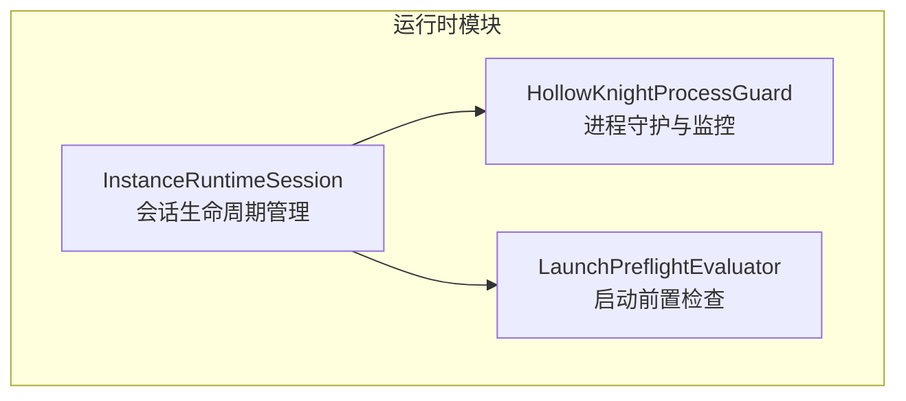
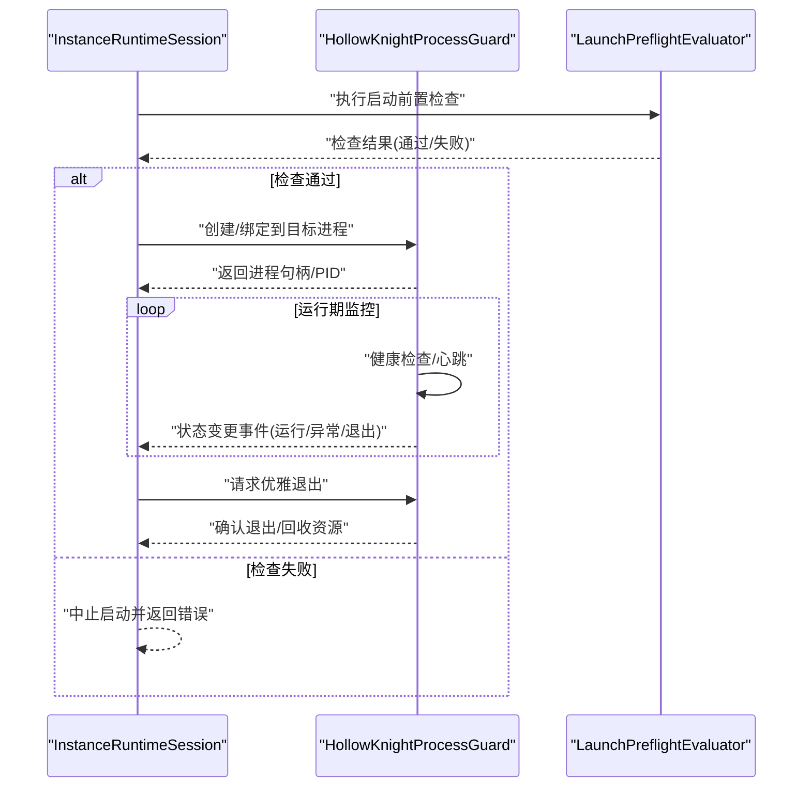
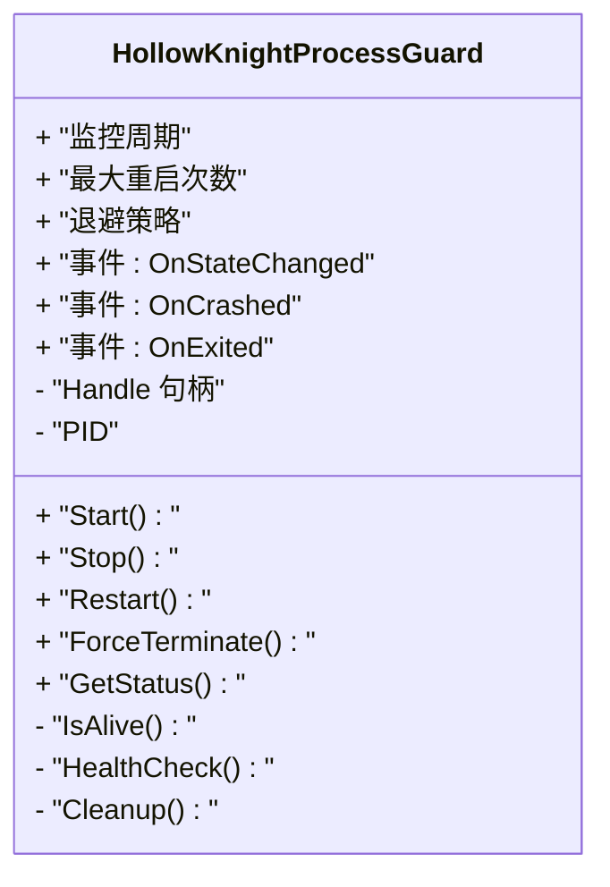
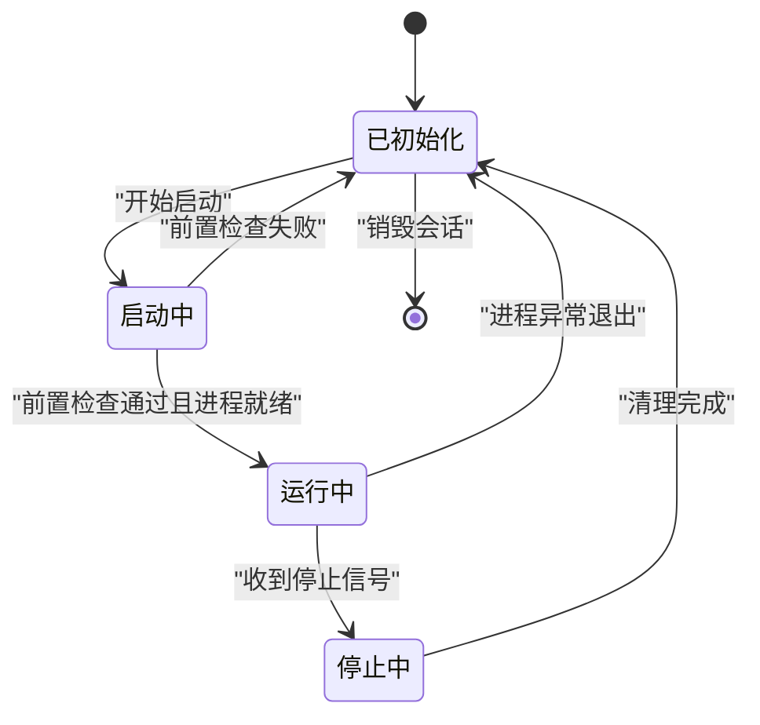
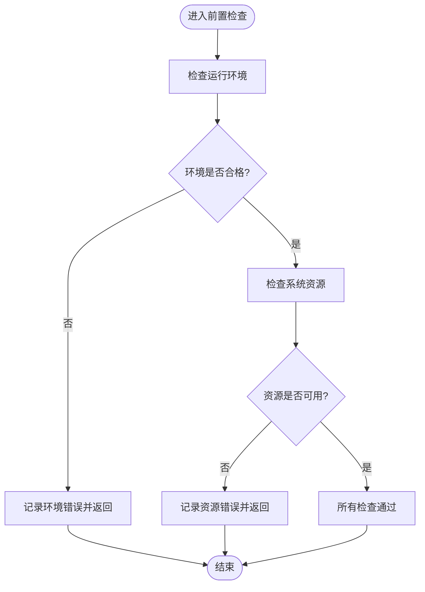
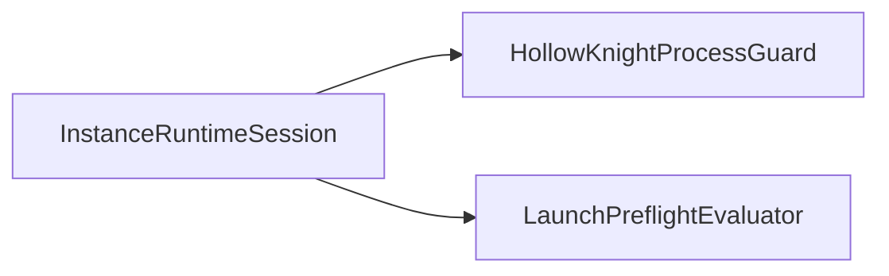
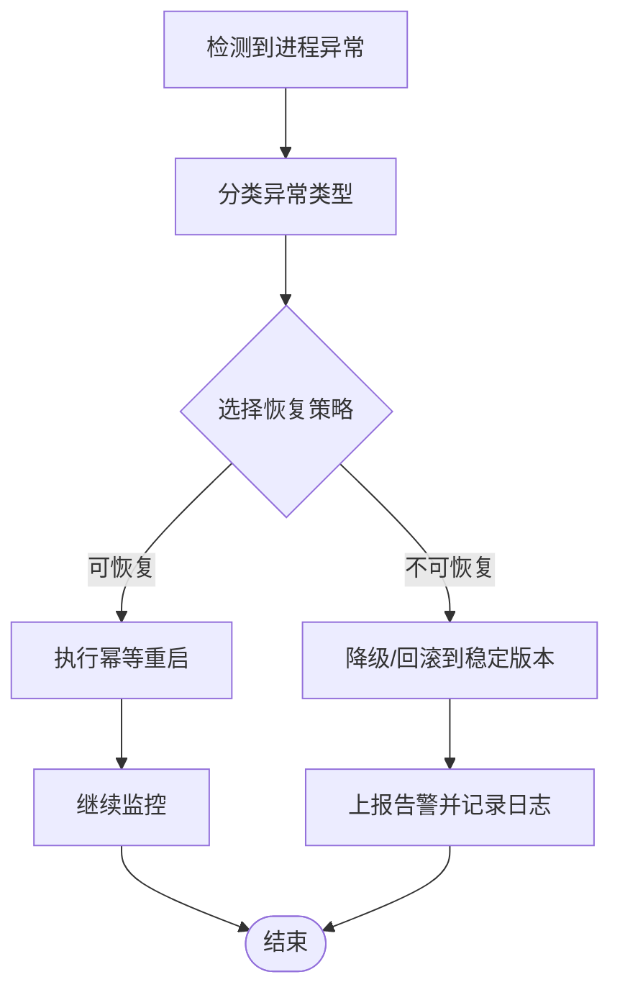

# 进程管理异常

<cite>
**本文引用的文件**   
- [HollowKnightProcessGuard.cs](file://src/Crystalfly.Core/Runtime/HollowKnightProcessGuard.cs)
- [InstanceRuntimeSession.cs](file://src/Crystalfly.Core/Runtime/InstanceRuntimeSession.cs)
- [LaunchPreflightEvaluator.cs](file://src/Crystalfly.Core/Runtime/LaunchPreflightEvaluator.cs)
</cite>

## 目录
1. [简介](#简介)
2. [项目结构](#项目结构)
3. [核心组件](#核心组件)
4. [架构总览](#架构总览)
5. [详细组件分析](#详细组件分析)
6. [依赖关系分析](#依赖关系分析)
7. [性能考虑](#性能考虑)
8. [故障排查指南](#故障排查指南)
9. [结论](#结论)
10. [附录](#附录)

## 简介
本指南聚焦 Crystalfly 在运行游戏实例时的进程管理异常处理，重点围绕 HollowKnightProcessGuard 的进程监控与保护机制、运行时会话生命周期与状态同步、进程意外终止的检测与恢复、资源泄漏诊断与清理、多实例冲突解决以及进程间通信问题的调试技巧。文档同时提供强制终止卡死进程并恢复系统状态的实操建议。

## 项目结构
与进程管理相关的核心代码位于 Crystalfly.Core/Runtime 目录：
- HollowKnightProcessGuard.cs：负责目标进程的监控、守护与异常恢复策略
- InstanceRuntimeSession.cs：封装一次“启动-运行-退出”的会话生命周期，协调外部进程与内部状态
- LaunchPreflightEvaluator.cs：启动前检查与前置条件评估，降低异常启动概率

图表来源
- [HollowKnightProcessGuard.cs](file://src/Crystalfly.Core/Runtime/HollowKnightProcessGuard.cs)
- [InstanceRuntimeSession.cs](file://src/Crystalfly.Core/Runtime/InstanceRuntimeSession.cs)
- [LaunchPreflightEvaluator.cs](file://src/Crystalfly.Core/Runtime/LaunchPreflightEvaluator.cs)

章节来源
- [HollowKnightProcessGuard.cs](file://src/Crystalfly.Core/Runtime/HollowKnightProcessGuard.cs)
- [InstanceRuntimeSession.cs](file://src/Crystalfly.Core/Runtime/InstanceRuntimeSession.cs)
- [LaunchPreflightEvaluator.cs](file://src/Crystalfly.Core/Runtime/LaunchPreflightEvaluator.cs)

## 核心组件
- HollowKnightProcessGuard
  - 职责：对目标游戏进程进行持续监控、健康检查、异常检测与自动恢复；维护进程句柄、PID、退出码等关键信息；对外暴露订阅式事件以通知上层状态变化。
  - 关键点：心跳/轮询间隔、退避重试、幂等重启、资源释放（句柄关闭）、错误分类与上报。
- InstanceRuntimeSession
  - 职责：管理一次实例运行的完整生命周期（准备、启动、运行中、停止、清理）；与 Guard 协作获取进程状态；与前置评估器协作确保启动条件满足。
  - 关键点：状态机转换、并发安全、超时控制、回滚与清理。
- LaunchPreflightEvaluator
  - 职责：在启动前校验环境、路径、依赖、端口占用、锁文件等前置条件，减少启动失败和进程异常的概率。
  - 关键点：可插拔的检查项、快速失败、错误聚合与提示。

章节来源
- [HollowKnightProcessGuard.cs](file://src/Crystalfly.Core/Runtime/HollowKnightProcessGuard.cs)
- [InstanceRuntimeSession.cs](file://src/Crystalfly.Core/Runtime/InstanceRuntimeSession.cs)
- [LaunchPreflightEvaluator.cs](file://src/Crystalfly.Core/Runtime/LaunchPreflightEvaluator.cs)

## 架构总览
下图展示了会话与进程守护之间的交互流程，包括启动前检查、进程监控、异常检测与恢复。

图表来源
- [InstanceRuntimeSession.cs](file://src/Crystalfly.Core/Runtime/InstanceRuntimeSession.cs)
- [HollowKnightProcessGuard.cs](file://src/Crystalfly.Core/Runtime/HollowKnightProcessGuard.cs)
- [LaunchPreflightEvaluator.cs](file://src/Crystalfly.Core/Runtime/LaunchPreflightEvaluator.cs)

## 详细组件分析

### HollowKnightProcessGuard 组件分析
该组件是进程守护的核心，负责：
- 进程发现与绑定：根据 PID 或名称定位目标进程，建立句柄与监控通道
- 健康检查：周期性探测进程存活、响应性、资源占用阈值
- 异常检测：捕获崩溃、无响应、异常退出码、资源耗尽等场景
- 恢复策略：按配置进行幂等重启、退避等待、告警与日志记录
- 资源管理：确保句柄关闭、线程取消、定时器释放，避免泄漏

图表来源
- [HollowKnightProcessGuard.cs](file://src/Crystalfly.Core/Runtime/HollowKnightProcessGuard.cs)

章节来源
- [HollowKnightProcessGuard.cs](file://src/Crystalfly.Core/Runtime/HollowKnightProcessGuard.cs)

### InstanceRuntimeSession 组件分析
该组件管理一次实例的运行会话，职责包括：
- 生命周期阶段：初始化、前置检查、启动、运行中、停止、清理
- 状态同步：与 Guard 的状态事件保持同步，维护本地状态机
- 并发与超时：保证状态切换的原子性与一致性，防止竞态
- 清理与回滚：在异常路径上执行必要的资源回收与状态回滚

图表来源
- [InstanceRuntimeSession.cs](file://src/Crystalfly.Core/Runtime/InstanceRuntimeSession.cs)

章节来源
- [InstanceRuntimeSession.cs](file://src/Crystalfly.Core/Runtime/InstanceRuntimeSession.cs)

### LaunchPreflightEvaluator 组件分析
该组件在启动前进行一系列检查，以降低异常启动概率：
- 环境检查：路径存在性、权限、依赖库、配置文件完整性
- 资源检查：端口占用、锁文件、磁盘空间、内存阈值
- 结果聚合：将多个检查项的错误汇总，便于用户理解与修复

图表来源
- [LaunchPreflightEvaluator.cs](file://src/Crystalfly.Core/Runtime/LaunchPreflightEvaluator.cs)

章节来源
- [LaunchPreflightEvaluator.cs](file://src/Crystalfly.Core/Runtime/LaunchPreflightEvaluator.cs)

## 依赖关系分析
- InstanceRuntimeSession 依赖 HollowKnightProcessGuard 获取进程状态与执行重启/终止操作
- InstanceRuntimeSession 依赖 LaunchPreflightEvaluator 在启动前进行条件验证
- HollowKnightProcessGuard 可能依赖底层操作系统 API 进行进程句柄管理与状态查询

图表来源
- [InstanceRuntimeSession.cs](file://src/Crystalfly.Core/Runtime/InstanceRuntimeSession.cs)
- [HollowKnightProcessGuard.cs](file://src/Crystalfly.Core/Runtime/HollowKnightProcessGuard.cs)
- [LaunchPreflightEvaluator.cs](file://src/Crystalfly.Core/Runtime/LaunchPreflightEvaluator.cs)

章节来源
- [InstanceRuntimeSession.cs](file://src/Crystalfly.Core/Runtime/InstanceRuntimeSession.cs)
- [HollowKnightProcessGuard.cs](file://src/Crystalfly.Core/Runtime/HollowKnightProcessGuard.cs)
- [LaunchPreflightEvaluator.cs](file://src/Crystalfly.Core/Runtime/LaunchPreflightEvaluator.cs)

## 性能考虑
- 监控频率与开销平衡：过高的轮询频率会增加 CPU 使用率，过低则延迟异常检测；建议根据平台与负载动态调整
- 事件驱动优先：尽量使用事件回调而非频繁轮询，减少不必要的状态读取
- 退避与限流：在异常恢复路径上使用指数退避，避免风暴式重启
- 资源复用：复用进程句柄与线程池，避免频繁创建销毁带来的开销

[本节为通用指导，不直接分析具体文件]

## 故障排查指南

### 进程意外终止的检测与处理流程
- 检测要点
  - 进程存活：通过句柄有效性或系统 API 判断进程是否存在
  - 健康度：响应超时、CPU/内存占用异常、无 UI 更新等指标
  - 退出码：区分正常退出与异常退出码，触发不同恢复策略
- 处理流程
  - 捕获异常事件后，记录上下文（时间戳、退出码、堆栈片段）
  - 依据策略进行幂等重启或降级运行
  - 若连续失败，进入冷却期并上报告警

图表来源
- [HollowKnightProcessGuard.cs](file://src/Crystalfly.Core/Runtime/HollowKnightProcessGuard.cs)
- [InstanceRuntimeSession.cs](file://src/Crystalfly.Core/Runtime/InstanceRuntimeSession.cs)

章节来源
- [HollowKnightProcessGuard.cs](file://src/Crystalfly.Core/Runtime/HollowKnightProcessGuard.cs)
- [InstanceRuntimeSession.cs](file://src/Crystalfly.Core/Runtime/InstanceRuntimeSession.cs)

### 运行时会话的生命周期管理与状态同步问题
- 生命周期阶段
  - 初始化：加载配置、分配资源、注册事件
  - 启动：执行前置检查、启动进程、建立监控
  - 运行中：监听状态事件、处理异常、执行恢复
  - 停止：发送优雅退出信号、等待退出、清理资源
  - 清理：关闭句柄、取消任务、释放内存
- 状态同步
  - 使用事件驱动确保 Guard 与 Session 状态一致
  - 在状态切换时加锁或使用原子操作，避免竞态
  - 对超时与取消信号进行统一处理，防止悬挂

章节来源
- [InstanceRuntimeSession.cs](file://src/Crystalfly.Core/Runtime/InstanceRuntimeSession.cs)
- [HollowKnightProcessGuard.cs](file://src/Crystalfly.Core/Runtime/HollowKnightProcessGuard.cs)

### 进程资源泄漏的诊断方法与清理工具
- 诊断方法
  - 句柄泄漏：统计打开的进程句柄数量，对比预期值
  - 内存泄漏：观察托管与非托管内存增长趋势
  - 线程泄漏：检查未结束的后台任务与定时器
- 清理工具
  - 提供统一的 Cleanup 接口，集中释放句柄、取消任务、关闭连接
  - 在异常路径与正常退出路径均调用清理逻辑，确保幂等

章节来源
- [HollowKnightProcessGuard.cs](file://src/Crystalfly.Core/Runtime/HollowKnightProcessGuard.cs)
- [InstanceRuntimeSession.cs](file://src/Crystalfly.Core/Runtime/InstanceRuntimeSession.cs)

### 多实例冲突的解决方案
- 冲突来源
  - 同一游戏实例被多次启动导致端口/锁文件冲突
  - 共享资源（如 LocalLow 目录）写入竞争
- 解决方案
  - 启动前检查锁文件与端口占用，拒绝重复启动
  - 为每个实例分配独立的工作目录与命名空间
  - 使用分布式锁或文件锁保障互斥访问

章节来源
- [LaunchPreflightEvaluator.cs](file://src/Crystalfly.Core/Runtime/LaunchPreflightEvaluator.cs)
- [InstanceRuntimeSession.cs](file://src/Crystalfly.Core/Runtime/InstanceRuntimeSession.cs)

### 进程间通信问题的调试技巧
- 常见问题
  - 消息丢失或乱序
  - 超时与重试策略不当
  - 序列化/反序列化不一致
- 调试技巧
  - 增加详细的通信日志（入队、出队、重试、超时）
  - 使用断点与快照记录关键状态
  - 构造最小复现用例隔离问题

章节来源
- [HollowKnightProcessGuard.cs](file://src/Crystalfly.Core/Runtime/HollowKnightProcessGuard.cs)
- [InstanceRuntimeSession.cs](file://src/Crystalfly.Core/Runtime/InstanceRuntimeSession.cs)

### 强制终止卡死的进程并恢复系统状态
- 强制终止
  - 使用 ForceTerminate 接口发送强杀信号
  - 等待进程退出，必要时二次确认
- 状态恢复
  - 清理残留句柄与临时文件
  - 重置会话状态，重新执行前置检查
  - 若仍失败，回滚到上一个稳定版本

章节来源
- [HollowKnightProcessGuard.cs](file://src/Crystalfly.Core/Runtime/HollowKnightProcessGuard.cs)
- [InstanceRuntimeSession.cs](file://src/Crystalfly.Core/Runtime/InstanceRuntimeSession.cs)

## 结论
通过对 HollowKnightProcessGuard、InstanceRuntimeSession 与 LaunchPreflightEvaluator 的系统化分析与实践建议，Crystalfly 能够在复杂运行环境下实现稳健的进程守护与会话管理。结合完善的异常检测、恢复策略与资源清理机制，可有效降低进程异常对用户的影响，并提供清晰的排障路径与恢复手段。

## 附录
- 术语表
  - 进程守护：对目标进程进行持续监控与异常恢复的机制
  - 会话：一次从启动到退出的完整运行过程
  - 前置检查：启动前的环境与资源校验
- 参考文件
  - [HollowKnightProcessGuard.cs](file://src/Crystalfly.Core/Runtime/HollowKnightProcessGuard.cs)
  - [InstanceRuntimeSession.cs](file://src/Crystalfly.Core/Runtime/InstanceRuntimeSession.cs)
  - [LaunchPreflightEvaluator.cs](file://src/Crystalfly.Core/Runtime/LaunchPreflightEvaluator.cs)