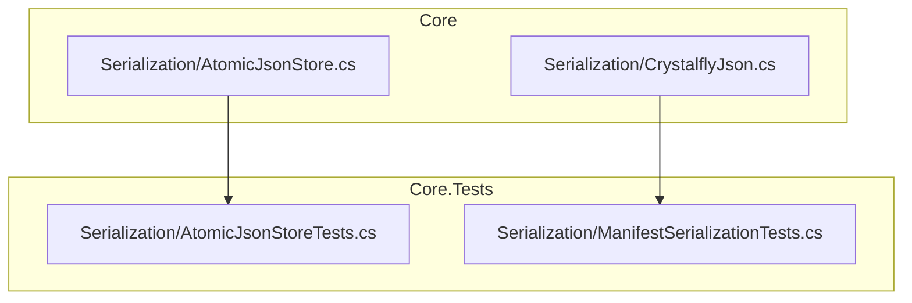
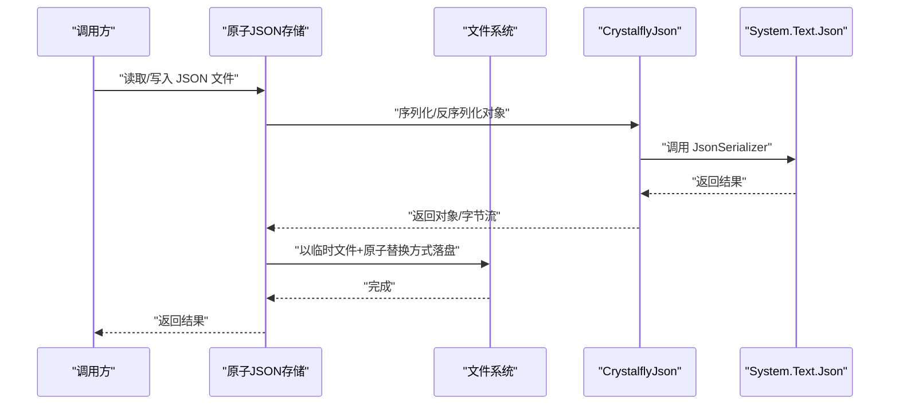
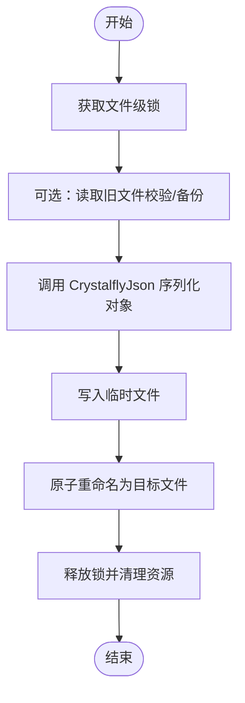
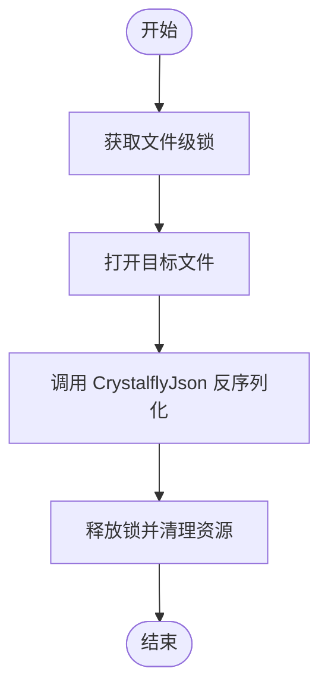
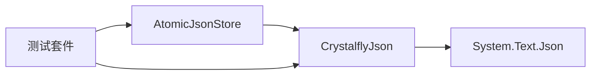

# JSON 序列化系统

<cite>
**本文引用的文件**   
- [AtomicJsonStore.cs](file://src/Crystalfly.Core/Serialization/AtomicJsonStore.cs)
- [CrystalflyJson.cs](file://src/Crystalfly.Core/Serialization/CrystalflyJson.cs)
- [AtomicJsonStoreTests.cs](file://tests/Crystalfly.Core.Tests/Serialization/AtomicJsonStoreTests.cs)
- [ManifestSerializationTests.cs](file://tests/Crystalfly.Core.Tests/Serialization/ManifestSerializationTests.cs)
</cite>

## 目录
1. [简介](#简介)
2. [项目结构](#项目结构)
3. [核心组件](#核心组件)
4. [架构总览](#架构总览)
5. [详细组件分析](#详细组件分析)
6. [依赖关系分析](#依赖关系分析)
7. [性能考虑](#性能考虑)
8. [故障排查指南](#故障排查指南)
9. [结论](#结论)
10. [附录：API 参考与使用示例](#附录api-参考与使用示例)

## 简介
本文件面向 Crystalfly 的 JSON 序列化子系统，聚焦以下目标：
- 原子 JSON 存储的实现原理：文件锁机制、并发访问控制与数据完整性保证。
- CrystalflyJson 序列化工具类的功能说明：自定义序列化器、版本兼容处理与错误恢复机制。
- 公共 API 接口、参数与返回值格式的记录。
- 安全读写配置文件的实践示例。
- 性能优化建议与最佳实践。
- 与 .NET 原生 System.Text.Json 的集成方式与扩展点。

## 项目结构
JSON 序列化相关代码位于 Core 层的 Serialization 目录，测试用例位于 Core.Tests 的对应目录中。

图表来源
- [AtomicJsonStore.cs](file://src/Crystalfly.Core/Serialization/AtomicJsonStore.cs)
- [CrystalflyJson.cs](file://src/Crystalfly.Core/Serialization/CrystalflyJson.cs)
- [AtomicJsonStoreTests.cs](file://tests/Crystalfly.Core.Tests/Serialization/AtomicJsonStoreTests.cs)
- [ManifestSerializationTests.cs](file://tests/Crystalfly.Core.Tests/Serialization/ManifestSerializationTests.cs)

章节来源
- [AtomicJsonStore.cs](file://src/Crystalfly.Core/Serialization/AtomicJsonStore.cs)
- [CrystalflyJson.cs](file://src/Crystalfly.Core/Serialization/CrystalflyJson.cs)
- [AtomicJsonStoreTests.cs](file://tests/Crystalfly.Core.Tests/Serialization/AtomicJsonStoreTests.cs)
- [ManifestSerializationTests.cs](file://tests/Crystalfly.Core.Tests/Serialization/ManifestSerializationTests.cs)

## 核心组件
- 原子 JSON 存储（AtomicJsonStore）
  - 提供线程安全的 JSON 文件读写能力，确保写入操作的原子性与一致性。
  - 通过文件级互斥与临时文件策略，避免并发写导致的损坏或半写状态。
- CrystalflyJson 工具类
  - 封装 System.Text.Json 的常用操作，提供统一的序列化/反序列化入口。
  - 支持注册自定义 JsonConverter<T>，实现字段映射、默认值、版本兼容与容错解析。

章节来源
- [AtomicJsonStore.cs](file://src/Crystalfly.Core/Serialization/AtomicJsonStore.cs)
- [CrystalflyJson.cs](file://src/Crystalfly.Core/Serialization/CrystalflyJson.cs)

## 架构总览
下图展示了“调用方 → 原子存储 → 文件系统”的交互路径，以及“调用方 → 序列化工具 → System.Text.Json”的调用链。

图表来源
- [AtomicJsonStore.cs](file://src/Crystalfly.Core/Serialization/AtomicJsonStore.cs)
- [CrystalflyJson.cs](file://src/Crystalfly.Core/Serialization/CrystalflyJson.cs)

## 详细组件分析

### 原子 JSON 存储（AtomicJsonStore）
职责与特性
- 并发安全：对同一文件的读写进行互斥，防止竞态条件。
- 原子写入：采用“先写临时文件，再原子替换”的策略，避免部分写入导致的数据损坏。
- 幂等与回滚：在异常路径下清理临时文件，确保不会留下脏数据。
- 可插拔序列化：内部委托 CrystalflyJson 完成具体序列化/反序列化。

关键流程（写入）

图表来源
- [AtomicJsonStore.cs](file://src/Crystalfly.Core/Serialization/AtomicJsonStore.cs)

关键流程（读取）

图表来源
- [AtomicJsonStore.cs](file://src/Crystalfly.Core/Serialization/AtomicJsonStore.cs)

并发与一致性要点
- 读-写互斥：同一时刻仅允许一个写者；多读者可与无写者的场景共存（取决于底层锁语义）。
- 原子性：操作系统级的文件重命名保证目标文件要么是新版本，要么是旧版本，不会出现中间态。
- 异常安全：任何阶段失败都会触发清理逻辑，避免残留临时文件。

章节来源
- [AtomicJsonStore.cs](file://src/Crystalfly.Core/Serialization/AtomicJsonStore.cs)

### CrystalflyJson 工具类
职责与特性
- 统一入口：对外暴露简洁的序列化/反序列化方法。
- 自定义转换器：支持注册 JsonConverter<T>，用于字段映射、默认值、弃用字段兼容等。
- 版本兼容：通过转换器或选项，在不破坏现有数据的前提下演进模型。
- 错误恢复：在反序列化时可选择忽略未知字段、提供默认值或降级策略。

典型用法模式
- 全局初始化：在应用启动时注册必要的转换器与序列化选项。
- 业务调用：直接调用工具类方法进行序列化/反序列化，无需关心底层细节。
- 扩展点：新增字段或变更类型时，优先通过转换器实现向后兼容。

章节来源
- [CrystalflyJson.cs](file://src/Crystalfly.Core/Serialization/CrystalflyJson.cs)

## 依赖关系分析
- 运行时依赖
  - System.Text.Json：作为实际序列化引擎。
  - 文件系统 API：用于临时文件创建与原子重命名。
- 组件耦合
  - 原子存储依赖 CrystalflyJson 完成序列化/反序列化。
  - 测试用例覆盖原子写入与反序列化行为，验证正确性与健壮性。

图表来源
- [AtomicJsonStore.cs](file://src/Crystalfly.Core/Serialization/AtomicJsonStore.cs)
- [CrystalflyJson.cs](file://src/Crystalfly.Core/Serialization/CrystalflyJson.cs)
- [AtomicJsonStoreTests.cs](file://tests/Crystalfly.Core.Tests/Serialization/AtomicJsonStoreTests.cs)
- [ManifestSerializationTests.cs](file://tests/Crystalfly.Core.Tests/Serialization/ManifestSerializationTests.cs)

章节来源
- [AtomicJsonStore.cs](file://src/Crystalfly.Core/Serialization/AtomicJsonStore.cs)
- [CrystalflyJson.cs](file://src/Crystalfly.Core/Serialization/CrystalflyJson.cs)
- [AtomicJsonStoreTests.cs](file://tests/Crystalfly.Core.Tests/Serialization/AtomicJsonStoreTests.cs)
- [ManifestSerializationTests.cs](file://tests/Crystalfly.Core.Tests/Serialization/ManifestSerializationTests.cs)

## 性能考虑
- 批量写入合并：尽量将多次更新合并为一次原子写入，减少磁盘 I/O 与锁竞争。
- 序列化选项调优：关闭不必要的格式化输出、启用缓存的 JsonTypeInfo（若适用），以降低 CPU 开销。
- 大对象分块：超大配置可考虑拆分为多个小文件，降低单次序列化成本。
- 异步化：在高并发场景下，结合异步 I/O 与任务队列，避免阻塞主线程。
- 锁粒度：仅在必要时持有文件锁，缩短临界区时间。

[本节为通用指导，不直接分析具体文件]

## 故障排查指南
常见问题与定位思路
- 文件被占用/锁冲突
  - 现象：写入超时或抛出锁相关异常。
  - 排查：检查是否存在长时间持有的写锁；确认是否有未释放的资源。
- 数据不一致或损坏
  - 现象：读取到空对象或部分字段缺失。
  - 排查：查看是否发生异常路径下的临时文件残留；确认原子替换是否成功。
- 反序列化失败
  - 现象：未知字段或类型变更导致解析异常。
  - 排查：确认是否已注册相应转换器；检查兼容性策略是否生效。

章节来源
- [AtomicJsonStoreTests.cs](file://tests/Crystalfly.Core.Tests/Serialization/AtomicJsonStoreTests.cs)
- [ManifestSerializationTests.cs](file://tests/Crystalfly.Core.Tests/Serialization/ManifestSerializationTests.cs)

## 结论
该 JSON 序列化子系统通过“原子写入 + 统一序列化入口”的组合，提供了高可靠、易扩展的配置持久化能力。借助自定义转换器与兼容性策略，可在不破坏既有数据的前提下平滑演进模型。配合合理的性能优化与错误恢复策略，可满足生产环境对稳定性与吞吐的要求。

[本节为总结性内容，不直接分析具体文件]

## 附录：API 参考与使用示例

### 原子 JSON 存储（AtomicJsonStore）
- 主要能力
  - 读取：从指定路径加载 JSON 并反序列化为对象。
  - 写入：将对象原子地持久化为 JSON 文件。
- 参数与返回值（概念说明）
  - 读取
    - 输入：文件路径、反序列化选项（可选）。
    - 输出：目标对象实例。
  - 写入
    - 输入：文件路径、待持久化对象、序列化选项（可选）。
    - 输出：写入成功标志或异常信息。
- 并发与一致性
  - 同一文件上的写入是互斥的；读取通常可与无写者并发。
  - 写入失败会清理临时文件，保证目标文件一致性。

章节来源
- [AtomicJsonStore.cs](file://src/Crystalfly.Core/Serialization/AtomicJsonStore.cs)

### CrystalflyJson 工具类
- 主要能力
  - 序列化：对象 → JSON 字符串/字节数组。
  - 反序列化：JSON → 对象。
  - 转换器注册：支持添加/移除自定义 JsonConverter<T>。
- 参数与返回值（概念说明）
  - 序列化
    - 输入：对象、序列化选项（可选）。
    - 输出：JSON 字符串或字节数组。
  - 反序列化
    - 输入：JSON 字符串/字节数组、目标类型、反序列化选项（可选）。
    - 输出：目标对象实例。
- 版本兼容与错误恢复
  - 通过转换器实现字段映射、默认值填充、弃用字段忽略等。
  - 可配置忽略未知字段、提供降级默认值等策略。

章节来源
- [CrystalflyJson.cs](file://src/Crystalfly.Core/Serialization/CrystalflyJson.cs)

### 使用示例（步骤式）
- 安全读取配置文件
  1. 调用原子存储的读取方法，传入目标文件路径。
  2. 若文件不存在或为空，返回默认配置对象。
  3. 捕获并记录异常，必要时回退到上次已知有效配置。
- 安全写入配置文件
  1. 构造或更新配置对象。
  2. 调用原子存储的写入方法，自动完成序列化与原子替换。
  3. 若写入失败，保留原文件不变并记录错误日志。

章节来源
- [AtomicJsonStoreTests.cs](file://tests/Crystalfly.Core.Tests/Serialization/AtomicJsonStoreTests.cs)
- [ManifestSerializationTests.cs](file://tests/Crystalfly.Core.Tests/Serialization/ManifestSerializationTests.cs)

### 与 .NET 原生 JSON 库的集成与扩展点
- 集成方式
  - 通过 CrystalflyJson 统一封装 System.Text.Json，屏蔽底层差异。
  - 在工具类内部集中配置 JsonSerializerOptions，便于全局管理。
- 扩展点
  - 自定义转换器：继承 JsonConverter<T>，注册到工具类，用于字段映射、默认值、兼容处理。
  - 序列化选项：集中调整属性命名策略、忽略空值、大小写敏感等。
  - 钩子与拦截：在工具类中预留扩展点，以便注入日志、指标或审计逻辑。

章节来源
- [CrystalflyJson.cs](file://src/Crystalfly.Core/Serialization/CrystalflyJson.cs)