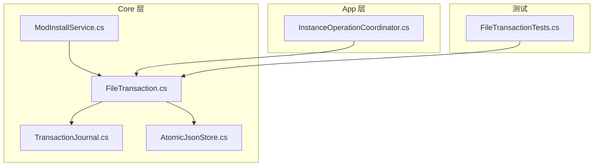
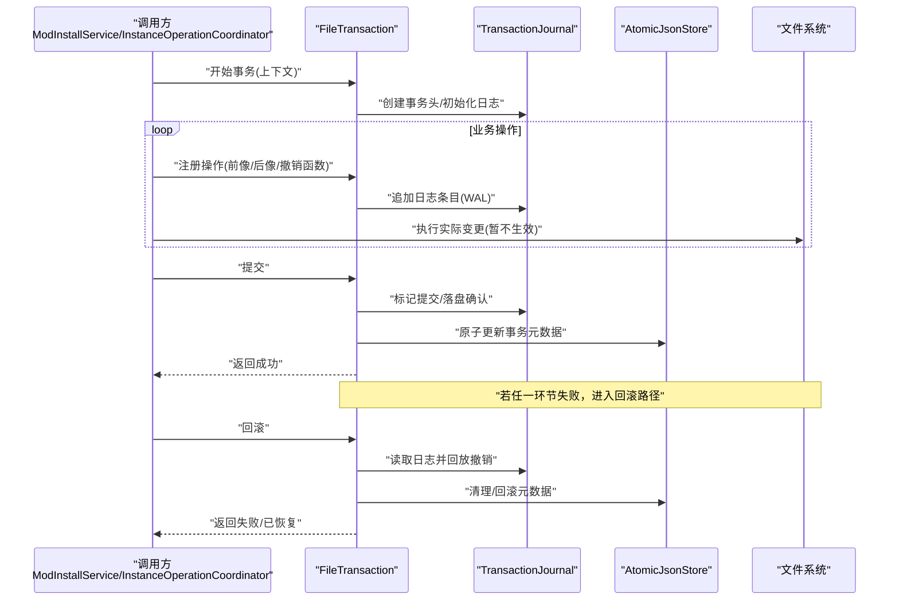
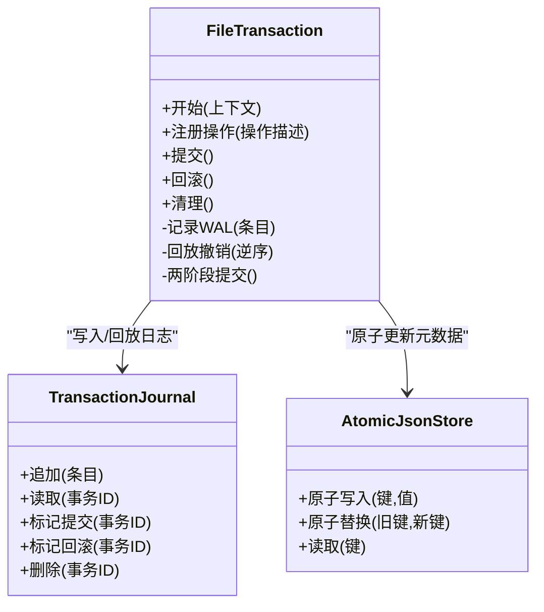
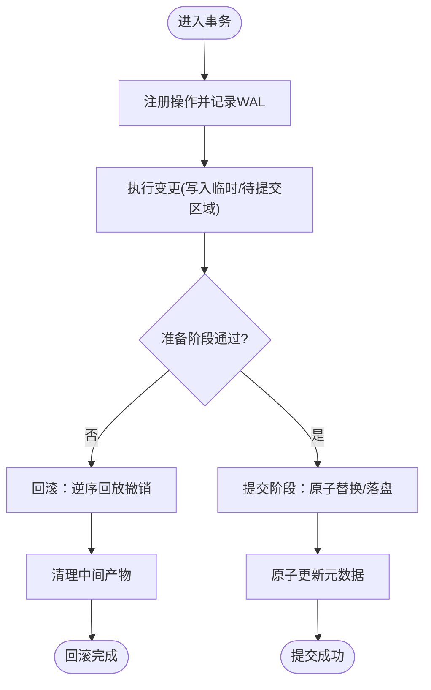
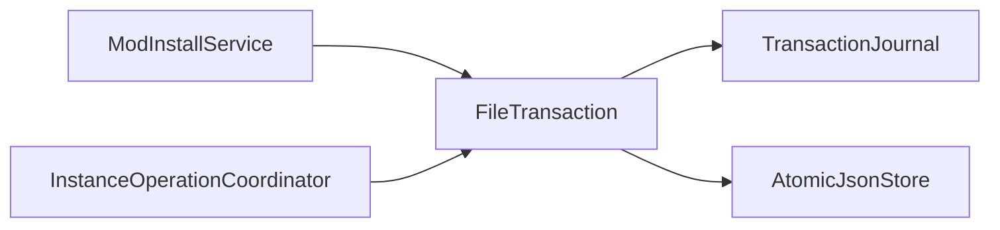

# 事务处理系统

<cite>
**本文引用的文件**   
- [FileTransaction.cs](file://src/Crystalfly.Core/Transactions/FileTransaction.cs)
- [TransactionJournal.cs](file://src/Crystalfly.Core/Models/TransactionJournal.cs)
- [AtomicJsonStore.cs](file://src/Crystalfly.Core/Serialization/AtomicJsonStore.cs)
- [ModInstallService.cs](file://src/Crystalfly.Core/Mods/ModInstallService.cs)
- [InstanceOperationCoordinator.cs](file://src/Crystalfly.App/Assets/Downloads/InstanceOperationCoordinator.cs)
- [FileTransactionTests.cs](file://tests/Crystalfly.Core.Tests/Transactions/FileTransactionTests.cs)
</cite>

## 目录
1. [简介](#简介)
2. [项目结构](#项目结构)
3. [核心组件](#核心组件)
4. [架构总览](#架构总览)
5. [详细组件分析](#详细组件分析)
6. [依赖关系分析](#依赖关系分析)
7. [性能考虑](#性能考虑)
8. [故障排查指南](#故障排查指南)
9. [结论](#结论)
10. [附录](#附录)

## 简介
本文件面向事务处理系统的实现与使用，重点围绕 FileTransaction 事务类展开，解释其事务边界、操作日志记录与回滚机制，说明文件操作的原子性保证（预写日志 WAL 模式与两阶段提交协议），并给出在模组安装、实例操作等场景中的使用示例。同时涵盖异常处理策略、错误恢复机制，以及与持久化组件的集成方式和性能考量。

## 项目结构
事务相关代码主要位于 Core 层，提供可复用的事务能力；应用层在需要时调用该能力完成复杂业务操作的原子性保障。

图表来源
- [FileTransaction.cs](file://src/Crystalfly.Core/Transactions/FileTransaction.cs)
- [TransactionJournal.cs](file://src/Crystalfly.Core/Models/TransactionJournal.cs)
- [AtomicJsonStore.cs](file://src/Crystalfly.Core/Serialization/AtomicJsonStore.cs)
- [ModInstallService.cs](file://src/Crystalfly.Core/Mods/ModInstallService.cs)
- [InstanceOperationCoordinator.cs](file://src/Crystalfly.App/Assets/Downloads/InstanceOperationCoordinator.cs)
- [FileTransactionTests.cs](file://tests/Crystalfly.Core.Tests/Transactions/FileTransactionTests.cs)

章节来源
- [FileTransaction.cs](file://src/Crystalfly.Core/Transactions/FileTransaction.cs)
- [TransactionJournal.cs](file://src/Crystalfly.Core/Models/TransactionJournal.cs)
- [AtomicJsonStore.cs](file://src/Crystalfly.Core/Serialization/AtomicJsonStore.cs)
- [ModInstallService.cs](file://src/Crystalfly.Core/Mods/ModInstallService.cs)
- [InstanceOperationCoordinator.cs](file://src/Crystalfly.App/Assets/Downloads/InstanceOperationCoordinator.cs)
- [FileTransactionTests.cs](file://tests/Crystalfly.Core.Tests/Transactions/FileTransactionTests.cs)

## 核心组件
- FileTransaction：定义事务边界，封装“开始—执行—提交/回滚—清理”的生命周期，负责 WAL 日志写入与撤销操作回放。
- TransactionJournal：描述事务日志条目结构与状态机，用于持久化记录每个操作的前像/后像或撤销指令。
- AtomicJsonStore：提供 JSON 数据的原子写入能力，确保元数据更新具备幂等与一致性。
- ModInstallService / InstanceOperationCoordinator：上层业务服务，通过 FileTransaction 将多步文件操作包装为单一事务，保证整体成功或整体回滚。

章节来源
- [FileTransaction.cs](file://src/Crystalfly.Core/Transactions/FileTransaction.cs)
- [TransactionJournal.cs](file://src/Crystalfly.Core/Models/TransactionJournal.cs)
- [AtomicJsonStore.cs](file://src/Crystalfly.Core/Serialization/AtomicJsonStore.cs)
- [ModInstallService.cs](file://src/Crystalfly.Core/Mods/ModInstallService.cs)
- [InstanceOperationCoordinator.cs](file://src/Crystalfly.App/Assets/Downloads/InstanceOperationCoordinator.cs)

## 架构总览
下图展示了事务从业务发起、进入事务边界、记录 WAL、执行变更、提交或回滚，以及最终清理的完整流程。

图表来源
- [FileTransaction.cs](file://src/Crystalfly.Core/Transactions/FileTransaction.cs)
- [TransactionJournal.cs](file://src/Crystalfly.Core/Models/TransactionJournal.cs)
- [AtomicJsonStore.cs](file://src/Crystalfly.Core/Serialization/AtomicJsonStore.cs)

## 详细组件分析

### FileTransaction 事务类
- 事务边界定义
  - 通过显式开始/提交/回滚方法界定事务范围，所有受保护的文件操作必须在边界内注册并执行。
  - 支持嵌套事务语义（如外层失败则整体回滚，内层仅影响局部）。
- 操作日志记录（WAL）
  - 每个操作以日志条目形式追加到事务日志，包含操作类型、目标路径、前像/后像快照或撤销指令。
  - 日志采用顺序追加与原子落盘，确保崩溃后可恢复。
- 提交与两阶段提交
  - 第一阶段：准备阶段校验所有已注册操作，确保资源可用且无冲突。
  - 第二阶段：提交阶段按序回放后像或执行原子替换，最后持久化事务状态为“已提交”。
- 回滚机制
  - 当任意步骤抛出异常或显式触发回滚时，按日志逆序回放撤销指令，恢复到事务开始前状态。
  - 回滚完成后清理临时文件与中间状态，保证文件系统整洁。
- 生命周期管理
  - 开始：分配事务 ID、初始化日志缓冲区、创建元数据占位。
  - 执行：注册操作、记录 WAL、执行变更（可能先写入临时位置）。
  - 提交：两阶段提交、原子落盘、更新元数据。
  - 回滚：回放撤销、清理中间产物、释放资源。
  - 清理：无论成功或失败，均确保日志与临时文件被正确回收。

图表来源
- [FileTransaction.cs](file://src/Crystalfly.Core/Transactions/FileTransaction.cs)
- [TransactionJournal.cs](file://src/Crystalfly.Core/Models/TransactionJournal.cs)
- [AtomicJsonStore.cs](file://src/Crystalfly.Core/Serialization/AtomicJsonStore.cs)

章节来源
- [FileTransaction.cs](file://src/Crystalfly.Core/Transactions/FileTransaction.cs)
- [TransactionJournal.cs](file://src/Crystalfly.Core/Models/TransactionJournal.cs)
- [AtomicJsonStore.cs](file://src/Crystalfly.Core/Serialization/AtomicJsonStore.cs)

### 事务日志模型（TransactionJournal）
- 日志条目结构
  - 字段包括：事务 ID、操作序号、操作类型、目标路径、前像/后像引用、撤销指令、时间戳等。
  - 通过序号保证回放顺序与逆序回滚的正确性。
- 状态机
  - 未提交 → 已提交 / 已回滚 / 进行中（崩溃恢复时可识别）。
- 持久化策略
  - 顺序追加、批量落盘、必要时 fsync 确保持久化。
  - 提交成功后进行日志归档或删除，避免无限增长。

章节来源
- [TransactionJournal.cs](file://src/Crystalfly.Core/Models/TransactionJournal.cs)

### 原子写入（AtomicJsonStore）
- 原子性保证
  - 通过“写入临时文件 + 原子重命名”的方式实现键值对的原子更新。
  - 读路径优先读取最新有效版本，避免读到半写状态。
- 幂等与一致性
  - 重复提交不会产生副作用。
  - 元数据与日志保持一致，便于崩溃恢复。

章节来源
- [AtomicJsonStore.cs](file://src/Crystalfly.Core/Serialization/AtomicJsonStore.cs)

### 使用示例：模组安装（ModInstallService）
- 典型流程
  - 解析依赖与安装计划。
  - 开启事务，逐条注册“下载/解压/复制/校验/更新清单”等操作。
  - 提交事务：两阶段确认后，原子更新模组清单与索引。
  - 失败回滚：按日志逆序撤销已完成的文件变更，保持模组环境一致。
- 关键要点
  - 大文件操作建议先写入临时目录，提交阶段再原子替换。
  - 对关键清单使用 AtomicJsonStore 原子更新，避免部分更新导致不一致。

章节来源
- [ModInstallService.cs](file://src/Crystalfly.Core/Mods/ModInstallService.cs)
- [FileTransaction.cs](file://src/Crystalfly.Core/Transactions/FileTransaction.cs)
- [AtomicJsonStore.cs](file://src/Crystalfly.Core/Serialization/AtomicJsonStore.cs)

### 使用示例：实例操作（InstanceOperationCoordinator）
- 典型流程
  - 协调多个子任务（如启动前检查、配置切换、运行时会话管理）。
  - 将一系列文件与配置变更纳入同一事务，确保实例状态的一致性。
  - 提交后对外暴露稳定状态；回滚时恢复至变更前状态。
- 并发与隔离
  - 通过事务边界限制并发访问，避免脏读与竞态条件。
  - 结合锁或队列控制，保证同一实例的串行化操作。

章节来源
- [InstanceOperationCoordinator.cs](file://src/Crystalfly.App/Assets/Downloads/InstanceOperationCoordinator.cs)
- [FileTransaction.cs](file://src/Crystalfly.Core/Transactions/FileTransaction.cs)

### 算法流程图：提交与回滚

图表来源
- [FileTransaction.cs](file://src/Crystalfly.Core/Transactions/FileTransaction.cs)
- [TransactionJournal.cs](file://src/Crystalfly.Core/Models/TransactionJournal.cs)
- [AtomicJsonStore.cs](file://src/Crystalfly.Core/Serialization/AtomicJsonStore.cs)

## 依赖关系分析
- 内部依赖
  - FileTransaction 依赖 TransactionJournal 进行日志持久化，依赖 AtomicJsonStore 进行元数据原子更新。
  - 上层服务（ModInstallService、InstanceOperationCoordinator）通过 FileTransaction 获得事务能力。
- 外部依赖
  - 文件系统 API（读写、重命名、同步）。
  - 序列化库（JSON 编解码）。
- 耦合与内聚
  - FileTransaction 聚焦事务编排与一致性，内聚性强；与具体业务解耦，易于复用。
  - TransactionJournal 与 AtomicJsonStore 作为基础设施，职责清晰，低耦合。

图表来源
- [ModInstallService.cs](file://src/Crystalfly.Core/Mods/ModInstallService.cs)
- [InstanceOperationCoordinator.cs](file://src/Crystalfly.App/Assets/Downloads/InstanceOperationCoordinator.cs)
- [FileTransaction.cs](file://src/Crystalfly.Core/Transactions/FileTransaction.cs)
- [TransactionJournal.cs](file://src/Crystalfly.Core/Models/TransactionJournal.cs)
- [AtomicJsonStore.cs](file://src/Crystalfly.Core/Serialization/AtomicJsonStore.cs)

章节来源
- [ModInstallService.cs](file://src/Crystalfly.Core/Mods/ModInstallService.cs)
- [InstanceOperationCoordinator.cs](file://src/Crystalfly.App/Assets/Downloads/InstanceOperationCoordinator.cs)
- [FileTransaction.cs](file://src/Crystalfly.Core/Transactions/FileTransaction.cs)
- [TransactionJournal.cs](file://src/Crystalfly.Core/Models/TransactionJournal.cs)
- [AtomicJsonStore.cs](file://src/Crystalfly.Core/Serialization/AtomicJsonStore.cs)

## 性能考虑
- WAL 写入优化
  - 批量合并日志条目，减少磁盘 I/O 次数。
  - 异步落盘与 fsync 策略权衡，兼顾吞吐与可靠性。
- 原子替换成本
  - 尽量在同一分区内进行重命名，避免跨设备移动带来的额外拷贝。
  - 大文件采用增量校验与断点续传，降低重试成本。
- 元数据更新
  - 使用 AtomicJsonStore 的原子替换，避免长事务持有锁。
- 并发控制
  - 对同一实例或同一目录的操作进行串行化，减少竞争与锁开销。
- 监控与度量
  - 记录事务耗时、日志大小、回滚次数等指标，辅助容量规划与问题定位。

[本节为通用指导，无需特定文件来源]

## 故障排查指南
- 常见异常与处理
  - 写入失败：检查磁盘空间、权限与路径有效性；必要时触发回滚并清理临时文件。
  - 元数据损坏：基于最近一次已提交的事务日志重建元数据。
  - 长时间阻塞：检测是否因跨设备重命名或锁竞争导致，调整策略或重试间隔。
- 恢复策略
  - 启动时扫描未完成事务，根据日志状态决定继续提交或回滚。
  - 对不可恢复的错误，保留日志以便人工审计与修复。
- 诊断信息
  - 输出事务 ID、操作序列号、目标路径、错误码与堆栈，便于快速定位。
  - 定期归档事务日志，保留足够窗口用于回溯。

章节来源
- [FileTransaction.cs](file://src/Crystalfly.Core/Transactions/FileTransaction.cs)
- [TransactionJournal.cs](file://src/Crystalfly.Core/Models/TransactionJournal.cs)
- [AtomicJsonStore.cs](file://src/Crystalfly.Core/Serialization/AtomicJsonStore.cs)

## 结论
FileTransaction 通过 WAL 与两阶段提交协议，为文件操作提供了强一致性与可恢复性。配合 AtomicJsonStore 的原子元数据更新，系统在模组安装、实例操作等复杂场景中能够保证整体成功或整体回滚。合理的性能优化与完善的异常处理策略，进一步提升了系统的稳定性与可维护性。

[本节为总结性内容，无需特定文件来源]

## 附录
- 单元测试参考
  - 通过 FileTransactionTests 验证事务边界、回滚路径与日志完整性，可作为集成时的参考用例。

章节来源
- [FileTransactionTests.cs](file://tests/Crystalfly.Core.Tests/Transactions/FileTransactionTests.cs)