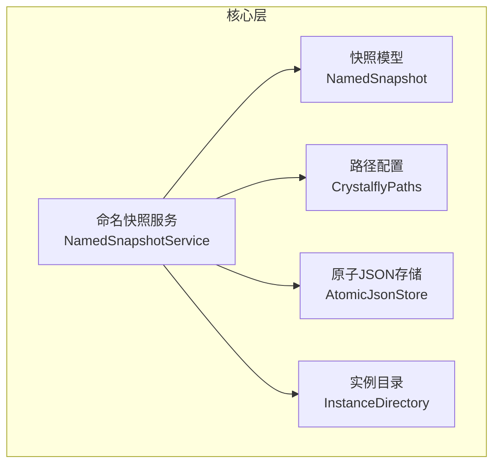
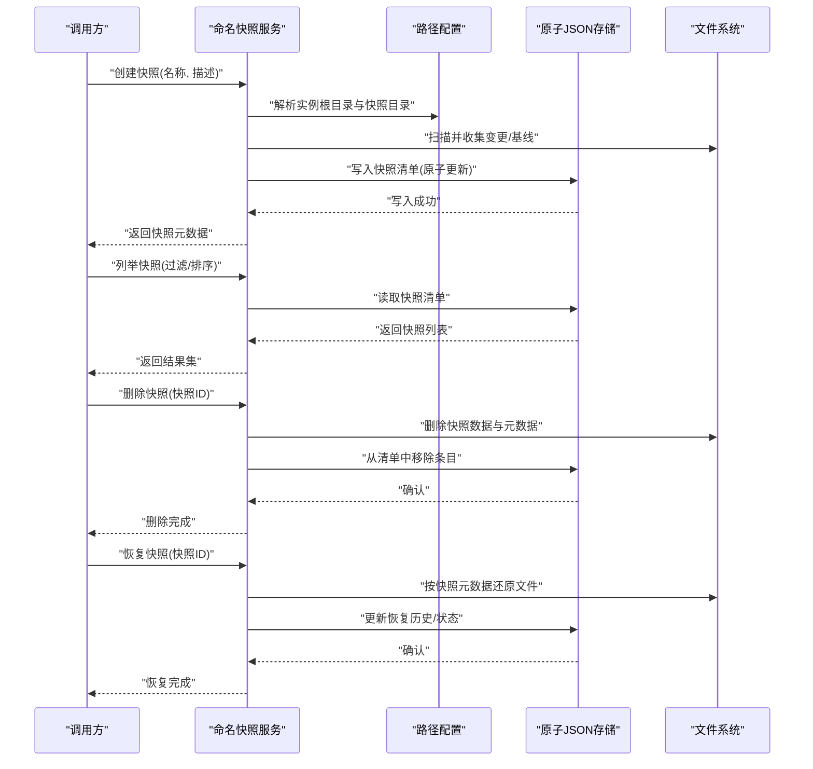
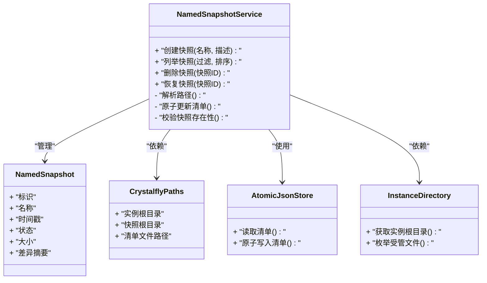
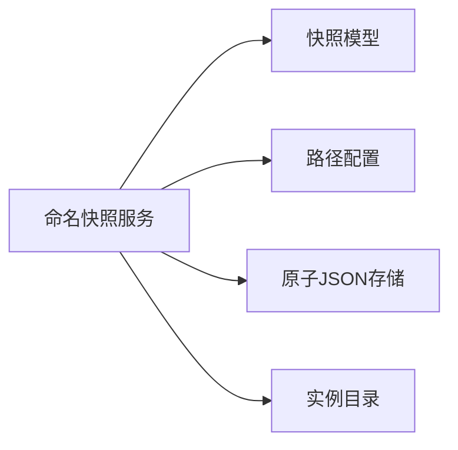

# 快照系统

<cite>
**本文引用的文件**   
- [NamedSnapshotService.cs](file://src/Crystalfly.Core/Snapshots/NamedSnapshotService.cs)
- [NamedSnapshot.cs](file://src/Crystalfly.Core/Models/NamedSnapshot.cs)
- [CrystalflyPaths.cs](file://src/Crystalfly.Core/Configuration/CrystalflyPaths.cs)
- [AtomicJsonStore.cs](file://src/Crystalfly.Core/Serialization/AtomicJsonStore.cs)
- [InstanceDirectory.cs](file://src/Crystalfly.Core/Instances/InstanceDirectory.cs)
- [NamedSnapshotServiceTests.cs](file://tests/Crystalfly.Core.Tests/Snapshots/NamedSnapshotServiceTests.cs)
</cite>

## 目录
1. [简介](#简介)
2. [项目结构](#项目结构)
3. [核心组件](#核心组件)
4. [架构总览](#架构总览)
5. [详细组件分析](#详细组件分析)
6. [依赖关系分析](#依赖关系分析)
7. [性能与存储优化](#性能与存储优化)
8. [故障排查指南](#故障排查指南)
9. [结论](#结论)
10. [附录](#附录)

## 简介
本文件为“快照系统”的权威技术文档，聚焦命名快照服务 NamedSnapshotService 的实现与使用。内容涵盖：
- 命名快照服务的创建、列出、删除与恢复能力
- 快照模型 NamedSnapshot 的数据结构与元数据语义
- 快照在文件系统上的组织方式与存储位置
- 批量管理与快照对比的使用示例
- 增量存储策略与存储空间优化思路
- 版本兼容性与迁移机制
- 与游戏实例管理的集成方式与最佳实践

## 项目结构
快照相关代码位于 Core 层，主要包含：
- 服务实现：命名快照服务
- 数据模型：命名快照实体
- 路径配置：全局路径解析
- 序列化：原子化 JSON 持久化
- 实例目录：与实例根目录的关联

图表来源
- [NamedSnapshotService.cs](file://src/Crystalfly.Core/Snapshots/NamedSnapshotService.cs)
- [NamedSnapshot.cs](file://src/Crystalfly.Core/Models/NamedSnapshot.cs)
- [CrystalflyPaths.cs](file://src/Crystalfly.Core/Configuration/CrystalflyPaths.cs)
- [AtomicJsonStore.cs](file://src/Crystalfly.Core/Serialization/AtomicJsonStore.cs)
- [InstanceDirectory.cs](file://src/Crystalfly.Core/Instances/InstanceDirectory.cs)

章节来源
- [NamedSnapshotService.cs](file://src/Crystalfly.Core/Snapshots/NamedSnapshotService.cs)
- [NamedSnapshot.cs](file://src/Crystalfly.Core/Models/NamedSnapshot.cs)
- [CrystalflyPaths.cs](file://src/Crystalfly.Core/Configuration/CrystalflyPaths.cs)
- [AtomicJsonStore.cs](file://src/Crystalfly.Core/Serialization/AtomicJsonStore.cs)
- [InstanceDirectory.cs](file://src/Crystalfly.Core/Instances/InstanceDirectory.cs)

## 核心组件
- 命名快照服务（NamedSnapshotService）
  - 职责：提供对某一游戏实例的命名快照的创建、列举、删除与恢复等高级操作；维护快照清单与元数据一致性。
  - 关键能力：
    - 创建快照：基于当前实例状态生成命名快照，记录时间戳、描述、差异信息等元数据。
    - 列举快照：返回按时间或名称排序的快照列表，支持过滤与分页。
    - 删除快照：安全移除指定快照及其关联数据，保证清单一致性。
    - 恢复快照：将实例回滚到指定快照状态，确保幂等与可重入。
- 快照模型（NamedSnapshot）
  - 职责：描述一次快照的元数据，包括唯一标识、名称、时间戳、状态、大小、差异摘要等。
  - 关键字段（概念性说明）：
    - 标识与名称：用于用户识别与检索
    - 时间戳：创建时间与可选更新时间
    - 状态：如成功、失败、进行中等
    - 大小与差异：用于空间统计与对比
    - 扩展字段：便于未来演进
- 路径配置（CrystalflyPaths）
  - 职责：统一解析应用与实例相关的路径，包括快照根目录、清单文件位置等。
- 原子JSON存储（AtomicJsonStore）
  - 职责：以原子方式读写清单与元数据，避免并发写入导致的不一致。
- 实例目录（InstanceDirectory）
  - 职责：定位实例根目录与子目录，协助快照服务确定需要快照化的范围。

章节来源
- [NamedSnapshotService.cs](file://src/Crystalfly.Core/Snapshots/NamedSnapshotService.cs)
- [NamedSnapshot.cs](file://src/Crystalfly.Core/Models/NamedSnapshot.cs)
- [CrystalflyPaths.cs](file://src/Crystalfly.Core/Configuration/CrystalflyPaths.cs)
- [AtomicJsonStore.cs](file://src/Crystalfly.Core/Serialization/AtomicJsonStore.cs)
- [InstanceDirectory.cs](file://src/Crystalfly.Core/Instances/InstanceDirectory.cs)

## 架构总览
命名快照服务围绕“实例根目录 + 快照存储区 + 清单索引”的组织模式工作。典型流程如下：

图表来源
- [NamedSnapshotService.cs](file://src/Crystalfly.Core/Snapshots/NamedSnapshotService.cs)
- [CrystalflyPaths.cs](file://src/Crystalfly.Core/Configuration/CrystalflyPaths.cs)
- [AtomicJsonStore.cs](file://src/Crystalfly.Core/Serialization/AtomicJsonStore.cs)
- [InstanceDirectory.cs](file://src/Crystalfly.Core/Instances/InstanceDirectory.cs)

## 详细组件分析

### 命名快照服务（NamedSnapshotService）
- 设计要点
  - 以实例为单位隔离快照数据，通过实例根目录派生快照存储路径。
  - 使用原子写保障清单与元数据的强一致性。
  - 对外暴露简洁的 API，内部封装复杂的状态机与错误处理。
- 关键流程
  - 创建：校验名称唯一性 -> 计算基线与差异 -> 持久化元数据 -> 更新清单
  - 列举：加载清单 -> 过滤/排序 -> 返回视图对象
  - 删除：校验存在性 -> 删除数据与元数据 -> 原子更新清单
  - 恢复：校验目标快照 -> 执行文件级回滚 -> 更新状态与审计信息
- 并发与幂等
  - 同一实例的快照操作串行化，避免竞态条件。
  - 恢复操作具备幂等特性，重复恢复不会产生副作用。
- 错误处理
  - 针对无效参数、磁盘空间不足、权限问题、清单损坏等情况进行明确分类与提示。

图表来源
- [NamedSnapshotService.cs](file://src/Crystalfly.Core/Snapshots/NamedSnapshotService.cs)
- [NamedSnapshot.cs](file://src/Crystalfly.Core/Models/NamedSnapshot.cs)
- [CrystalflyPaths.cs](file://src/Crystalfly.Core/Configuration/CrystalflyPaths.cs)
- [AtomicJsonStore.cs](file://src/Crystalfly.Core/Serialization/AtomicJsonStore.cs)
- [InstanceDirectory.cs](file://src/Crystalfly.Core/Instances/InstanceDirectory.cs)

章节来源
- [NamedSnapshotService.cs](file://src/Crystalfly.Core/Snapshots/NamedSnapshotService.cs)
- [NamedSnapshot.cs](file://src/Crystalfly.Core/Models/NamedSnapshot.cs)
- [CrystalflyPaths.cs](file://src/Crystalfly.Core/Configuration/CrystalflyPaths.cs)
- [AtomicJsonStore.cs](file://src/Crystalfly.Core/Serialization/AtomicJsonStore.cs)
- [InstanceDirectory.cs](file://src/Crystalfly.Core/Instances/InstanceDirectory.cs)

### 快照模型（NamedSnapshot）
- 数据结构语义
  - 标识：全局唯一，用于引用与去重
  - 名称：用户可读，建议遵循命名规范
  - 时间戳：创建时间、更新时间等
  - 状态：成功、失败、进行中、已归档等
  - 大小：快照占用空间，便于容量规划
  - 差异摘要：文件集合哈希或变更指纹，用于对比与增量
- 扩展性
  - 预留扩展字段，向后兼容旧版清单
  - 版本号字段用于迁移与降级判断

章节来源
- [NamedSnapshot.cs](file://src/Crystalfly.Core/Models/NamedSnapshot.cs)

### 路径与存储组织
- 存储位置
  - 快照根目录由实例根目录派生，确保多实例隔离
  - 清单文件位于快照根目录下，采用原子写入
- 目录结构（概念性）
  - 实例根目录
    - 快照根目录
      - 清单文件
      - 快照条目目录（每个快照一个目录）
        - 元数据文件
        - 数据块/差异文件
- 文件命名与索引
  - 快照条目目录以快照标识命名
  - 清单文件集中索引所有快照条目

章节来源
- [CrystalflyPaths.cs](file://src/Crystalfly.Core/Configuration/CrystalflyPaths.cs)
- [AtomicJsonStore.cs](file://src/Crystalfly.Core/Serialization/AtomicJsonStore.cs)
- [InstanceDirectory.cs](file://src/Crystalfly.Core/Instances/InstanceDirectory.cs)

### 批量管理与快照对比
- 批量管理
  - 批量创建：循环调用创建接口，结合事务式清单更新，失败时回滚
  - 批量删除：先收集待删快照，再顺序删除并更新清单
  - 批量清理：根据保留策略（数量/时间/大小）自动清理过期快照
- 快照对比
  - 基于差异摘要计算两个快照之间的文件差异
  - 输出差异报告（新增、修改、删除的文件集合）
  - 支持可视化展示与导出

章节来源
- [NamedSnapshotService.cs](file://src/Crystalfly.Core/Snapshots/NamedSnapshotService.cs)
- [NamedSnapshot.cs](file://src/Crystalfly.Core/Models/NamedSnapshot.cs)

### 增量存储策略与空间优化
- 增量策略
  - 首次全量备份，后续仅保存差异块
  - 差异块去重，相同内容只存一份
- 空间优化
  - 压缩与分块存储
  - 定期合并碎片，减少小文件数量
  - 回收不可达数据，释放空间

章节来源
- [NamedSnapshotService.cs](file://src/Crystalfly.Core/Snapshots/NamedSnapshotService.cs)
- [AtomicJsonStore.cs](file://src/Crystalfly.Core/Serialization/AtomicJsonStore.cs)

### 版本兼容性与迁移机制
- 兼容性
  - 清单与模型包含版本号
  - 读取时根据版本选择解析器
- 迁移
  - 启动时检测版本不一致，触发迁移流程
  - 迁移完成后更新版本号并重建索引

章节来源
- [NamedSnapshot.cs](file://src/Crystalfly.Core/Models/NamedSnapshot.cs)
- [AtomicJsonStore.cs](file://src/Crystalfly.Core/Serialization/AtomicJsonStore.cs)

### 与游戏实例管理的集成与最佳实践
- 集成点
  - 通过实例目录定位受管文件集合
  - 与实例生命周期事件（创建、更新、销毁）联动
- 最佳实践
  - 在重大变更前自动创建快照
  - 限制快照数量与保留周期
  - 对敏感目录排除快照，提升性能与安全性
  - 监控磁盘空间与快照健康度

章节来源
- [InstanceDirectory.cs](file://src/Crystalfly.Core/Instances/InstanceDirectory.cs)
- [CrystalflyPaths.cs](file://src/Crystalfly.Core/Configuration/CrystalflyPaths.cs)

## 依赖关系分析
- 内聚与耦合
  - 服务层高内聚，依赖清晰：路径、存储、实例目录
  - 模型与存储解耦，便于替换与测试
- 外部依赖
  - 文件系统访问
  - JSON 序列化与原子写入
- 潜在环依赖
  - 当前无直接环依赖，保持单向依赖链

图表来源
- [NamedSnapshotService.cs](file://src/Crystalfly.Core/Snapshots/NamedSnapshotService.cs)
- [NamedSnapshot.cs](file://src/Crystalfly.Core/Models/NamedSnapshot.cs)
- [CrystalflyPaths.cs](file://src/Crystalfly.Core/Configuration/CrystalflyPaths.cs)
- [AtomicJsonStore.cs](file://src/Crystalfly.Core/Serialization/AtomicJsonStore.cs)
- [InstanceDirectory.cs](file://src/Crystalfly.Core/Instances/InstanceDirectory.cs)

章节来源
- [NamedSnapshotService.cs](file://src/Crystalfly.Core/Snapshots/NamedSnapshotService.cs)
- [NamedSnapshot.cs](file://src/Crystalfly.Core/Models/NamedSnapshot.cs)
- [CrystalflyPaths.cs](file://src/Crystalfly.Core/Configuration/CrystalflyPaths.cs)
- [AtomicJsonStore.cs](file://src/Crystalfly.Core/Serialization/AtomicJsonStore.cs)
- [InstanceDirectory.cs](file://src/Crystalfly.Core/Instances/InstanceDirectory.cs)

## 性能与存储优化
- 性能
  - 并发控制：单实例串行化快照操作
  - IO 优化：批量扫描、跳过无关目录、并行差异计算
  - 缓存：热点清单与元数据缓存
- 存储
  - 增量与去重降低空间占用
  - 压缩与分块提高吞吐
  - 定期整理与回收碎片

[本节为通用指导，不直接分析具体文件]

## 故障排查指南
- 常见问题
  - 清单损坏：尝试重建索引或回滚至最近可用版本
  - 磁盘空间不足：清理过期快照或扩容
  - 权限问题：检查进程对快照目录的读写权限
  - 恢复失败：核对快照完整性与目标实例状态
- 诊断步骤
  - 查看清单文件与快照元数据是否一致
  - 验证快照条目目录是否存在且完整
  - 检查日志中的错误码与堆栈信息

章节来源
- [AtomicJsonStore.cs](file://src/Crystalfly.Core/Serialization/AtomicJsonStore.cs)
- [NamedSnapshotService.cs](file://src/Crystalfly.Core/Snapshots/NamedSnapshotService.cs)

## 结论
命名快照服务为游戏实例提供了可靠的版本管理能力。通过清晰的模型定义、原子化清单与合理的存储组织，实现了高效的创建、列举、删除与恢复流程。配合增量策略与空间优化，可在保证一致性的同时兼顾性能与成本。建议在业务侧建立自动化快照策略与监控告警，以提升稳定性与可运维性。

[本节为总结性内容，不直接分析具体文件]

## 附录
- 使用示例（概念性）
  - 批量创建：在发布前对多个实例批量创建快照，并设置保留策略
  - 快照对比：比较两次构建的差异，辅助回归测试与发布评审
  - 快速恢复：在异常后一键恢复到上一个稳定快照
- 参考测试
  - 单元测试覆盖核心流程与边界情况，可作为行为契约参考

章节来源
- [NamedSnapshotServiceTests.cs](file://tests/Crystalfly.Core.Tests/Snapshots/NamedSnapshotServiceTests.cs)