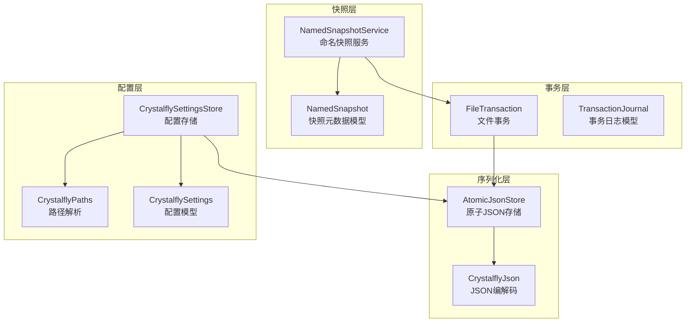
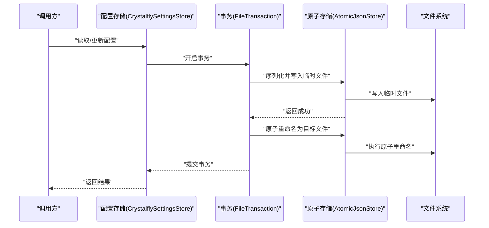
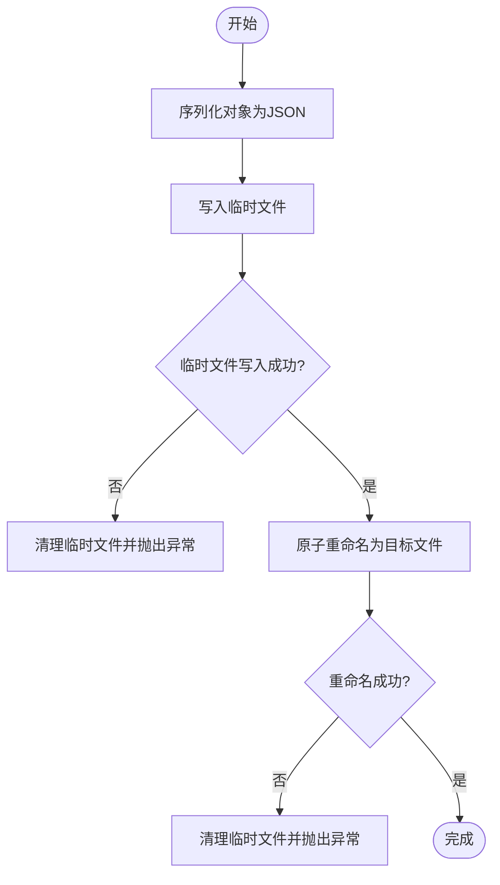
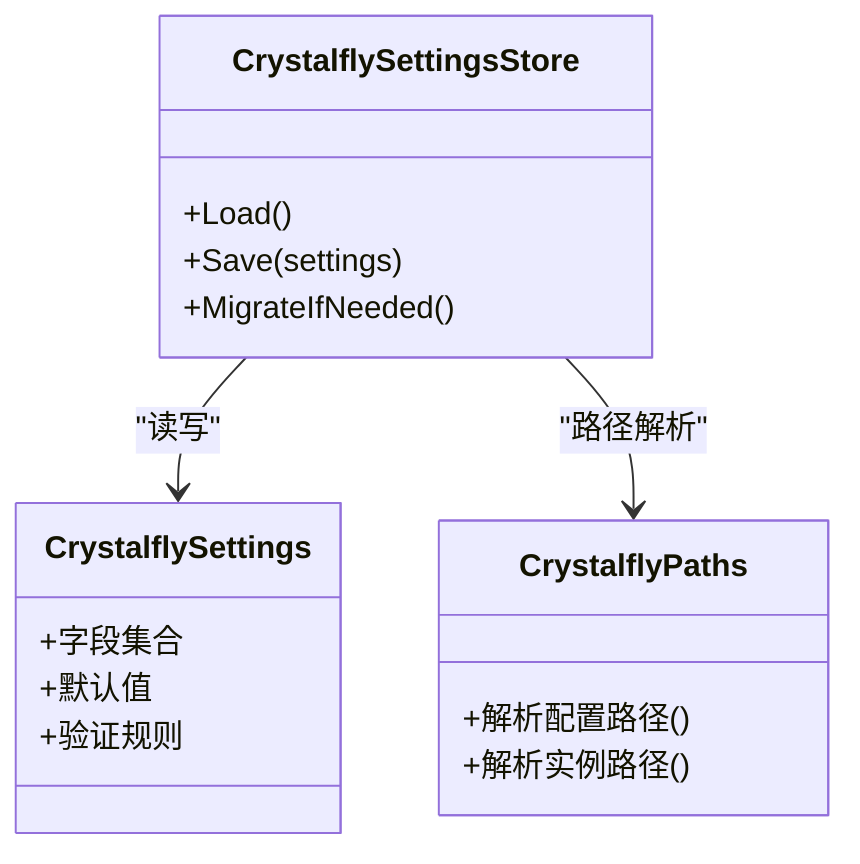
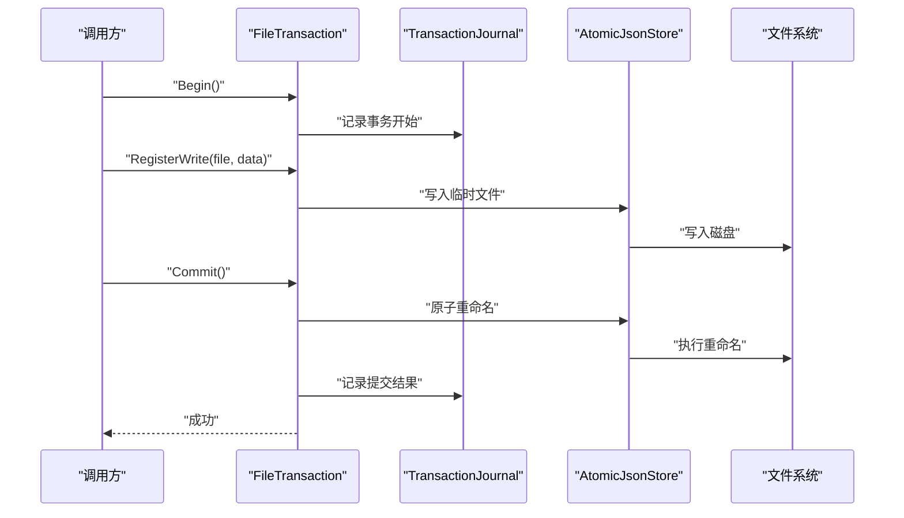
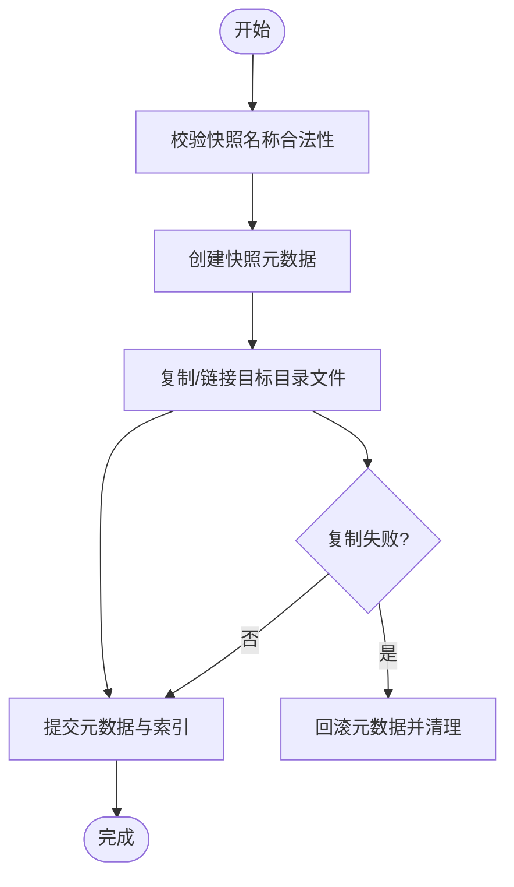
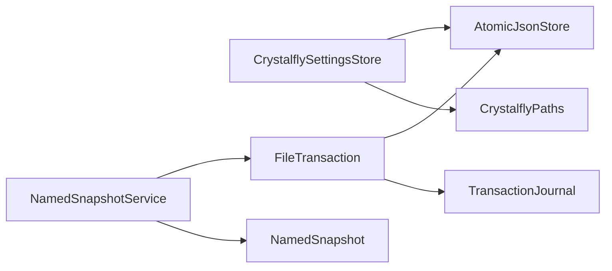

# 数据持久化

<cite>
**本文引用的文件**   
- [AtomicJsonStore.cs](file://src/Crystalfly.Core/Serialization/AtomicJsonStore.cs)
- [CrystalflyJson.cs](file://src/Crystalfly.Core/Serialization/CrystalflyJson.cs)
- [NamedSnapshotService.cs](file://src/Crystalfly.Core/Snapshots/NamedSnapshotService.cs)
- [FileTransaction.cs](file://src/Crystalfly.Core/Transactions/FileTransaction.cs)
- [CrystalflySettingsStore.cs](file://src/Crystalfly.Core/Configuration/CrystalflySettingsStore.cs)
- [CrystalflyPaths.cs](file://src/Crystalfly.Core/Configuration/CrystalflyPaths.cs)
- [CrystalflySettings.cs](file://src/Crystalfly.Core/Configuration/CrystalflySettings.cs)
- [NamedSnapshot.cs](file://src/Crystalfly.Core/Models/NamedSnapshot.cs)
- [TransactionJournal.cs](file://src/Crystalfly.Core/Models/TransactionJournal.cs)
- [AtomicJsonStoreTests.cs](file://tests/Crystalfly.Core.Tests/Serialization/AtomicJsonStoreTests.cs)
- [NamedSnapshotServiceTests.cs](file://tests/Crystalfly.Core.Tests/Snapshots/NamedSnapshotServiceTests.cs)
- [FileTransactionTests.cs](file://tests/Crystalfly.Core.Tests/Transactions/FileTransactionTests.cs)
</cite>

## 目录
1. [简介](#简介)
2. [项目结构](#项目结构)
3. [核心组件](#核心组件)
4. [架构总览](#架构总览)
5. [详细组件分析](#详细组件分析)
6. [依赖关系分析](#依赖关系分析)
7. [性能考虑](#性能考虑)
8. [故障排查指南](#故障排查指南)
9. [结论](#结论)
10. [附录](#附录)

## 简介
本文件面向数据持久化子系统，系统性说明以下能力：
- 原子 JSON 存储：保证写入的原子性与一致性，避免部分写入导致的数据损坏。
- 配置管理系统：提供强类型、可迁移的配置读写与默认值策略。
- 事务处理机制：以文件级事务封装多步变更，支持回滚与日志记录。
- 命名快照系统：对任意目标目录创建、恢复与管理命名快照，保障关键状态可回溯。
- 数据模型与序列化：定义核心模型、JSON 序列化约定与版本兼容策略。
- 完整性、并发与错误恢复：确保跨进程/线程访问安全与异常场景下的自愈能力。
- 使用示例与最佳实践：给出典型用法模式与注意事项。
- 数据迁移、备份与恢复：结合快照与事务实现可靠的数据演进与灾难恢复。
- 文件系统集成：基于底层文件系统语义（如重命名）实现高可靠性持久化。

## 项目结构
与数据持久化相关的核心代码位于 Crystalfly.Core 模块中，主要分布在如下子目录：
- Serialization：原子 JSON 存储与通用 JSON 工具
- Snapshots：命名快照服务
- Transactions：文件事务
- Configuration：配置路径与设置存储
- Models：数据模型（含快照与事务日志）

图表来源
- [AtomicJsonStore.cs:1-200](file://src/Crystalfly.Core/Serialization/AtomicJsonStore.cs#L1-L200)
- [CrystalflyJson.cs:1-200](file://src/Crystalfly.Core/Serialization/CrystalflyJson.cs#L1-L200)
- [FileTransaction.cs:1-200](file://src/Crystalfly.Core/Transactions/FileTransaction.cs#L1-L200)
- [TransactionJournal.cs:1-200](file://src/Crystalfly.Core/Models/TransactionJournal.cs#L1-L200)
- [NamedSnapshotService.cs:1-200](file://src/Crystalffly.Core/Snapshots/NamedSnapshotService.cs#L1-L200)
- [NamedSnapshot.cs:1-200](file://src/Crystalfly.Core/Models/NamedSnapshot.cs#L1-L200)
- [CrystalflySettingsStore.cs:1-200](file://src/Crystalfly.Core/Configuration/CrystalflySettingsStore.cs#L1-L200)
- [CrystalflyPaths.cs:1-200](file://src/Crystalfly.Core/Configuration/CrystalflyPaths.cs#L1-L200)
- [CrystalflySettings.cs:1-200](file://src/Crystalfly.Core/Configuration/CrystalflySettings.cs#L1-L200)

章节来源
- [AtomicJsonStore.cs:1-200](file://src/Crystalfly.Core/Serialization/AtomicJsonStore.cs#L1-L200)
- [CrystalflyJson.cs:1-200](file://src/Crystalfly.Core/Serialization/CrystalflyJson.cs#L1-L200)
- [FileTransaction.cs:1-200](file://src/Crystalfly.Core/Transactions/FileTransaction.cs#L1-L200)
- [NamedSnapshotService.cs:1-200](file://src/Crystalfly.Core/Snapshots/NamedSnapshotService.cs#L1-L200)
- [CrystalflySettingsStore.cs:1-200](file://src/Crystalfly.Core/Configuration/CrystalflySettingsStore.cs#L1-L200)
- [CrystalflyPaths.cs:1-200](file://src/Crystalfly.Core/Configuration/CrystalflyPaths.cs#L1-L200)
- [CrystalflySettings.cs:1-200](file://src/Crystalfly.Core/Configuration/CrystalflySettings.cs#L1-L200)
- [NamedSnapshot.cs:1-200](file://src/Crystalfly.Core/Models/NamedSnapshot.cs#L1-L200)
- [TransactionJournal.cs:1-200](file://src/Crystalfly.Core/Models/TransactionJournal.cs#L1-L200)

## 核心组件
- 原子 JSON 存储（AtomicJsonStore）
  - 职责：以“临时文件 + 原子重命名”的方式写入 JSON，保证读到的要么是全量旧数据，要么是全量新数据。
  - 并发控制：通过锁或互斥机制保护同一键的并发写；读操作通常无锁或轻量锁。
  - 容错：写入失败时不污染目标文件；支持幂等覆盖。
- 配置管理系统（CrystalflySettingsStore + CrystalflySettings + CrystalflyPaths）
  - 职责：加载/保存应用配置，提供默认值、字段映射与路径解析。
  - 兼容性：通过版本字段与迁移逻辑实现向前/向后兼容。
  - 原子性：借助原子 JSON 存储完成配置更新。
- 事务处理（FileTransaction + TransactionJournal）
  - 职责：将多个文件操作包装为单一事务，提交时一次性生效，失败时回滚。
  - 日志：记录事务开始、操作序列、结果与时间戳，便于审计与恢复。
- 命名快照（NamedSnapshotService + NamedSnapshot）
  - 职责：对指定目录创建命名快照，支持列出、删除与恢复到指定快照。
  - 实现：利用文件系统复制/链接与元数据管理，配合事务保证一致性。
- 序列化（CrystalflyJson）
  - 职责：统一 JSON 序列化/反序列化选项，包括日期格式、空值处理、大小写策略等。

章节来源
- [AtomicJsonStore.cs:1-200](file://src/Crystalfly.Core/Serialization/AtomicJsonStore.cs#L1-L200)
- [CrystalflySettingsStore.cs:1-200](file://src/Crystalfly.Core/Configuration/CrystalflySettingsStore.cs#L1-L200)
- [CrystalflySettings.cs:1-200](file://src/Crystalfly.Core/Configuration/CrystalflySettings.cs#L1-L200)
- [CrystalflyPaths.cs:1-200](file://src/Crystalfly.Core/Configuration/CrystalflyPaths.cs#L1-L200)
- [FileTransaction.cs:1-200](file://src/Crystalfly.Core/Transactions/FileTransaction.cs#L1-L200)
- [TransactionJournal.cs:1-200](file://src/Crystalfly.Core/Models/TransactionJournal.cs#L1-L200)
- [NamedSnapshotService.cs:1-200](file://src/Crystalfly.Core/Snapshots/NamedSnapshotService.cs#L1-L200)
- [NamedSnapshot.cs:1-200](file://src/Crystalfly.Core/Models/NamedSnapshot.cs#L1-L200)
- [CrystalflyJson.cs:1-200](file://src/Crystalfly.Core/Serialization/CrystalflyJson.cs#L1-L200)

## 架构总览
下图展示了从调用方到持久化的整体流程：上层服务通过配置存储或快照服务发起操作，内部经由事务与原子 JSON 存储落盘，必要时结合命名快照进行状态回溯。

图表来源
- [CrystalflySettingsStore.cs:1-200](file://src/Crystalfly.Core/Configuration/CrystalflySettingsStore.cs#L1-L200)
- [FileTransaction.cs:1-200](file://src/Crystalfly.Core/Transactions/FileTransaction.cs#L1-L200)
- [AtomicJsonStore.cs:1-200](file://src/Crystalfly.Core/Serialization/AtomicJsonStore.cs#L1-L200)

## 详细组件分析

### 原子 JSON 存储（AtomicJsonStore）
- 设计要点
  - 写入路径：先写临时文件，再原子重命名为目标文件，避免部分写入。
  - 并发控制：对同一键加锁，防止竞态条件。
  - 幂等性：重复写入相同内容不会产生不一致。
  - 错误隔离：任何中间步骤异常均不会破坏目标文件。
- 复杂度
  - 时间：O(n) 与数据大小线性相关（序列化与 I/O）。
  - 空间：O(n) 额外临时文件占用。
- 优化建议
  - 批量写入合并
  - 压缩大对象
  - 异步写入队列

图表来源
- [AtomicJsonStore.cs:1-200](file://src/Crystalfly.Core/Serialization/AtomicJsonStore.cs#L1-L200)

章节来源
- [AtomicJsonStore.cs:1-200](file://src/Crystalfly.Core/Serialization/AtomicJsonStore.cs#L1-L200)
- [AtomicJsonStoreTests.cs:1-200](file://tests/Crystalfly.Core.Tests/Serialization/AtomicJsonStoreTests.cs#L1-L200)

### 配置管理系统（CrystalflySettingsStore / CrystalflySettings / CrystalflyPaths）
- 职责分工
  - CrystalflySettings：强类型配置模型，包含字段、默认值与可选验证。
  - CrystalflyPaths：解析配置文件的实际路径（用户目录、应用目录等）。
  - CrystalflySettingsStore：负责加载、保存、迁移与缓存配置。
- 版本兼容
  - 通过版本字段与迁移策略实现向前/向后兼容。
  - 缺失字段采用默认值，新增字段平滑过渡。
- 原子性
  - 所有写操作经原子 JSON 存储完成，确保崩溃后配置一致。

图表来源
- [CrystalflySettings.cs:1-200](file://src/Crystalfly.Core/Configuration/CrystalflySettings.cs#L1-L200)
- [CrystalflyPaths.cs:1-200](file://src/Crystalfly.Core/Configuration/CrystalflyPaths.cs#L1-L200)
- [CrystalflySettingsStore.cs:1-200](file://src/Crystalfly.Core/Configuration/CrystalflySettingsStore.cs#L1-L200)

章节来源
- [CrystalflySettingsStore.cs:1-200](file://src/Crystalfly.Core/Configuration/CrystalflySettingsStore.cs#L1-L200)
- [CrystalflySettings.cs:1-200](file://src/Crystalfly.Core/Configuration/CrystalflySettings.cs#L1-L200)
- [CrystalflyPaths.cs:1-200](file://src/Crystalfly.Core/Configuration/CrystalflyPaths.cs#L1-L200)

### 事务处理机制（FileTransaction / TransactionJournal）
- 设计要点
  - 事务边界：Begin/Commit/Abort 明确生命周期。
  - 操作注册：在事务内登记文件增删改操作。
  - 提交阶段：按顺序执行，任一失败则回滚已执行操作。
  - 日志记录：使用 TransactionJournal 记录事务元数据与操作清单。
- 错误恢复
  - 未提交的事务不影响最终一致性。
  - 可通过日志重建未完成事务的状态。

图表来源
- [FileTransaction.cs:1-200](file://src/Crystalfly.Core/Transactions/FileTransaction.cs#L1-L200)
- [TransactionJournal.cs:1-200](file://src/Crystalfly.Core/Models/TransactionJournal.cs#L1-L200)
- [AtomicJsonStore.cs:1-200](file://src/Crystalfly.Core/Serialization/AtomicJsonStore.cs#L1-L200)

章节来源
- [FileTransaction.cs:1-200](file://src/Crystalfly.Core/Transactions/FileTransaction.cs#L1-L200)
- [TransactionJournal.cs:1-200](file://src/Crystalfly.Core/Models/TransactionJournal.cs#L1-L200)
- [FileTransactionTests.cs:1-200](file://tests/Crystalfly.Core.Tests/Transactions/FileTransactionTests.cs#L1-L200)

### 命名快照系统（NamedSnapshotService / NamedSnapshot）
- 功能概述
  - 创建：对目标目录生成命名快照，保存元数据与文件集合。
  - 恢复：根据快照名称将目录恢复到对应时间点状态。
  - 管理：列出、删除快照，清理过期快照。
- 一致性保证
  - 使用事务包裹快照创建/恢复过程，确保元数据与文件集一致。
  - 失败时自动回滚，避免半快照状态。
- 性能考量
  - 大目录建议使用增量或硬链接策略（若平台支持）。
  - 并行复制与去重可减少 I/O 压力。

图表来源
- [NamedSnapshotService.cs:1-200](file://src/Crystalfly.Core/Snapshots/NamedSnapshotService.cs#L1-L200)
- [NamedSnapshot.cs:1-200](file://src/Crystalfly.Core/Models/NamedSnapshot.cs#L1-L200)

章节来源
- [NamedSnapshotService.cs:1-200](file://src/Crystalfly.Core/Snapshots/NamedSnapshotService.cs#L1-L200)
- [NamedSnapshot.cs:1-200](file://src/Crystalfly.Core/Models/NamedSnapshot.cs#L1-L200)
- [NamedSnapshotServiceTests.cs:1-200](file://tests/Crystalfly.Core.Tests/Snapshots/NamedSnapshotServiceTests.cs#L1-L200)

### 序列化与版本兼容（CrystalflyJson）
- 统一序列化选项
  - 日期/时间格式、空值处理、属性名大小写策略。
  - 自定义转换器用于复杂类型或枚举。
- 版本兼容策略
  - 在模型中引入版本字段，读取时根据版本进行适配。
  - 新增字段提供默认值，移除字段保留兼容读取。
  - 迁移脚本在启动或首次写入时执行。

章节来源
- [CrystalflyJson.cs:1-200](file://src/Crystalfly.Core/Serialization/CrystalflyJson.cs#L1-L200)

## 依赖关系分析
- 组件耦合
  - 配置存储依赖原子 JSON 存储与路径解析。
  - 事务依赖原子 JSON 存储与日志模型。
  - 快照服务依赖事务与模型。
- 外部依赖
  - 文件系统 API（创建、写入、重命名、复制/链接）。
  - JSON 库（由 CrystalflyJson 统一封装）。

图表来源
- [CrystalflySettingsStore.cs:1-200](file://src/Crystalfly.Core/Configuration/CrystalflySettingsStore.cs#L1-L200)
- [CrystalflyPaths.cs:1-200](file://src/Crystalfly.Core/Configuration/CrystalflyPaths.cs#L1-L200)
- [AtomicJsonStore.cs:1-200](file://src/Crystalfly.Core/Serialization/AtomicJsonStore.cs#L1-L200)
- [FileTransaction.cs:1-200](file://src/Crystalfly.Core/Transactions/FileTransaction.cs#L1-L200)
- [TransactionJournal.cs:1-200](file://src/Crystalfly.Core/Models/TransactionJournal.cs#L1-L200)
- [NamedSnapshotService.cs:1-200](file://src/Crystalfly.Core/Snapshots/NamedSnapshotService.cs#L1-L200)
- [NamedSnapshot.cs:1-200](file://src/Crystalfly.Core/Models/NamedSnapshot.cs#L1-L200)

章节来源
- [CrystalflySettingsStore.cs:1-200](file://src/Crystalfly.Core/Configuration/CrystalflySettingsStore.cs#L1-L200)
- [AtomicJsonStore.cs:1-200](file://src/Crystalfly.Core/Serialization/AtomicJsonStore.cs#L1-L200)
- [FileTransaction.cs:1-200](file://src/Crystalfly.Core/Transactions/FileTransaction.cs#L1-L200)
- [NamedSnapshotService.cs:1-200](file://src/Crystalfly.Core/Snapshots/NamedSnapshotService.cs#L1-L200)

## 性能考虑
- 减少频繁小写：合并多次配置更新，降低 I/O 次数。
- 大对象处理：启用压缩或分块写入，避免内存峰值。
- 并发控制：合理划分锁粒度，避免热点键竞争。
- 快照优化：使用硬链接或增量复制，减少磁盘占用与耗时。
- 批处理：批量事务提交，减少日志与同步开销。

## 故障排查指南
- 常见问题
  - 配置文件损坏：检查是否存在未完成的临时文件或事务日志。
  - 快照不完整：查看快照元数据与文件索引是否一致。
  - 并发冲突：确认是否存在同一键的高频并发写。
- 诊断手段
  - 启用事务日志审计，定位失败点。
  - 对比快照前后差异，确认回滚是否生效。
  - 监控临时文件残留，及时清理。
- 恢复策略
  - 使用最近一次成功提交的快照恢复。
  - 依据事务日志重放或撤销未完成操作。

章节来源
- [FileTransaction.cs:1-200](file://src/Crystalfly.Core/Transactions/FileTransaction.cs#L1-L200)
- [TransactionJournal.cs:1-200](file://src/Crystalfly.Core/Models/TransactionJournal.cs#L1-L200)
- [NamedSnapshotService.cs:1-200](file://src/Crystalfly.Core/Snapshots/NamedSnapshotService.cs#L1-L200)

## 结论
该数据持久化子系统通过原子 JSON 存储、事务与命名快照三大支柱，提供了高可靠、可回溯、易维护的持久化方案。配合统一的序列化与版本兼容策略，可在复杂业务场景中保持数据一致性与演进能力。建议在生产环境结合监控与日志完善可观测性，并制定定期备份与演练计划。

## 附录
- 使用示例与最佳实践
  - 配置更新：在事务中加载配置、修改字段、保存并提交，捕获异常并回滚。
  - 快照创建：在重要变更前创建命名快照，失败时自动清理。
  - 恢复流程：选择目标快照，执行恢复并在完成后验证关键数据。
  - 迁移策略：在应用启动时检测版本并执行迁移脚本，确保向后兼容。
- 数据迁移与备份
  - 迁移：基于版本字段与迁移脚本逐步升级数据结构。
  - 备份：定期导出快照与事务日志，异地留存。
  - 恢复：优先从快照恢复，再回放事务日志以补齐最新状态。
- 文件系统集成
  - 原子重命名：利用操作系统提供的原子语义保证一致性。
  - 权限与安全：确保运行账户具备读写与重命名权限。
  - 磁盘空间：预留足够空间用于临时文件与快照副本。