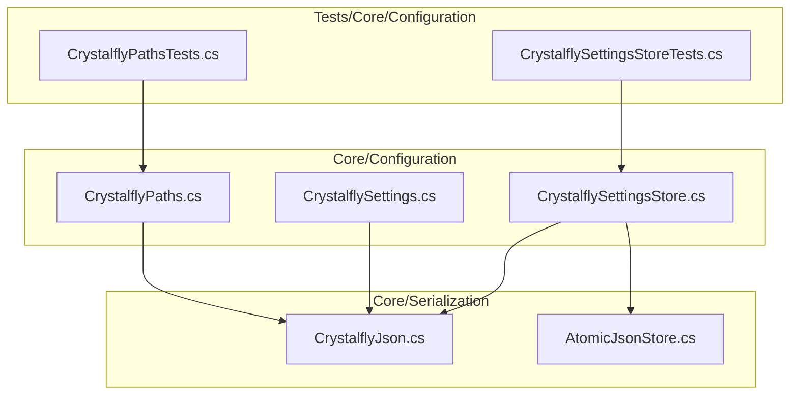
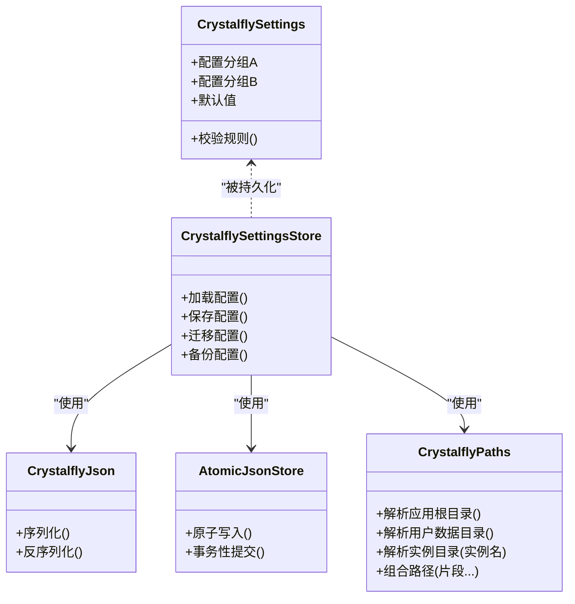
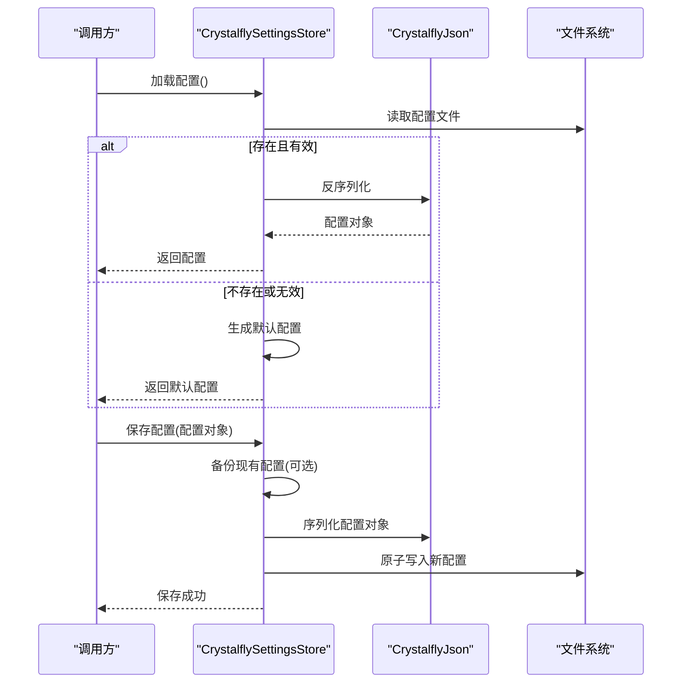
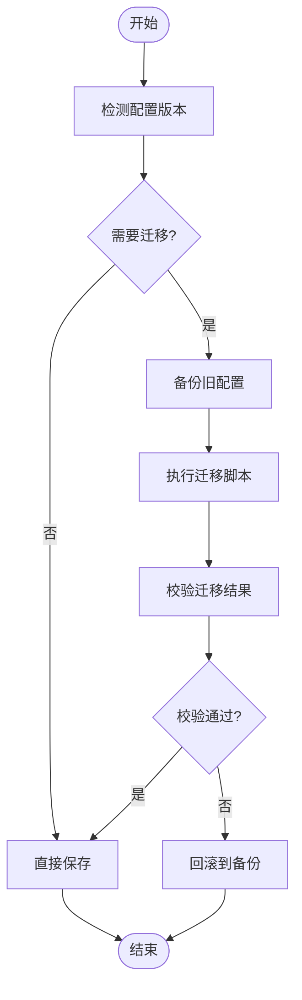
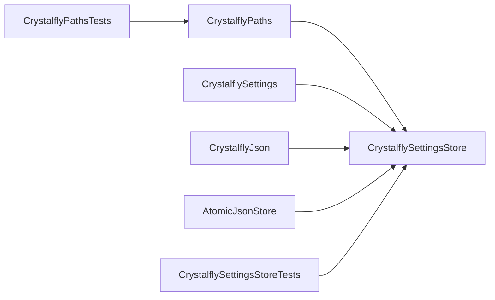

# 配置管理系统

<cite>
**本文引用的文件**   
- [CrystalflyPaths.cs](file://src/Crystalfly.Core/Configuration/CrystalflyPaths.cs)
- [CrystalflySettings.cs](file://src/Crystalfly.Core/Configuration/CrystalflySettings.cs)
- [CrystalflySettingsStore.cs](file://src/Crystalfly.Core/Configuration/CrystalflySettingsStore.cs)
- [CrystalflyJson.cs](file://src/Crystalfly.Core/Serialization/CrystalflyJson.cs)
- [AtomicJsonStore.cs](file://src/Crystalfly.Core/Serialization/AtomicJsonStore.cs)
- [CrystalflyPathsTests.cs](file://tests/Crystalfly.Core.Tests/Configuration/CrystalflyPathsTests.cs)
- [CrystalflySettingsStoreTests.cs](file://tests/Crystalfly.Core.Tests/Configuration/CrystalflySettingsStoreTests.cs)
</cite>

## 目录
1. [简介](#简介)
2. [项目结构](#项目结构)
3. [核心组件](#核心组件)
4. [架构总览](#架构总览)
5. [详细组件分析](#详细组件分析)
6. [依赖关系分析](#依赖关系分析)
7. [性能考虑](#性能考虑)
8. [故障排查指南](#故障排查指南)
9. [结论](#结论)
10. [附录](#附录)

## 简介
本文件为 Crystalfly 配置管理系统的全面技术文档，聚焦以下目标：
- 路径管理器 CrystalflyPaths：应用程序目录结构、用户数据路径与游戏实例路径的组织方式。
- 配置模型 CrystalflySettings：配置项分类、默认值设置与数据验证规则。
- 配置存储 CrystalflySettingsStore：配置的加载、保存、迁移与备份机制。
- 配置文件结构与格式说明。
- 配置项枚举定义与使用示例（以源码路径引用形式提供）。
- 多环境配置支持与配置热重载机制的说明与建议。

## 项目结构
配置相关代码位于 Core 层的 Configuration 子目录，序列化基础设施位于 Serialization 子目录；测试用例位于 Tests 对应目录。

图表来源
- [CrystalflyPaths.cs](file://src/Crystalfly.Core/Configuration/CrystalflyPaths.cs)
- [CrystalflySettings.cs](file://src/Crystalfly.Core/Configuration/CrystalflySettings.cs)
- [CrystalflySettingsStore.cs](file://src/Crystalfly.Core/Configuration/CrystalflySettingsStore.cs)
- [CrystalflyJson.cs](file://src/Crystalfly.Core/Serialization/CrystalflyJson.cs)
- [AtomicJsonStore.cs](file://src/Crystalfly.Core/Serialization/AtomicJsonStore.cs)
- [CrystalflyPathsTests.cs](file://tests/Crystalfly.Core.Tests/Configuration/CrystalflyPathsTests.cs)
- [CrystalflySettingsStoreTests.cs](file://tests/Crystalfly.Core.Tests/Configuration/CrystalflySettingsStoreTests.cs)

章节来源
- [CrystalflyPaths.cs](file://src/Crystalfly.Core/Configuration/CrystalflyPaths.cs)
- [CrystalflySettings.cs](file://src/Crystalfly.Core/Configuration/CrystalflySettings.cs)
- [CrystalflySettingsStore.cs](file://src/Crystalfly.Core/Configuration/CrystalflySettingsStore.cs)
- [CrystalflyJson.cs](file://src/Crystalfly.Core/Serialization/CrystalflyJson.cs)
- [AtomicJsonStore.cs](file://src/Crystalfly.Core/Serialization/AtomicJsonStore.cs)
- [CrystalflyPathsTests.cs](file://tests/Crystalfly.Core.Tests/Configuration/CrystalflyPathsTests.cs)
- [CrystalflySettingsStoreTests.cs](file://tests/Crystalfly.Core.Tests/Configuration/CrystalflySettingsStoreTests.cs)

## 核心组件
- CrystalflyPaths：集中管理应用根目录、用户数据目录、实例目录等关键路径解析与构造，屏蔽平台差异并提供一致的访问点。
- CrystalflySettings：描述应用配置的数据模型，包含配置项分组、默认值与校验逻辑。
- CrystalflySettingsStore：负责配置的持久化，包括读取、写入、迁移与备份策略。
- CrystalflyJson / AtomicJsonStore：提供 JSON 序列化工具与原子写入能力，保障配置文件的完整性与一致性。

章节来源
- [CrystalflyPaths.cs](file://src/Crystalfly.Core/Configuration/CrystalflyPaths.cs)
- [CrystalflySettings.cs](file://src/Crystalfly.Core/Configuration/CrystalflySettings.cs)
- [CrystalflySettingsStore.cs](file://src/Crystalfly.Core/Configuration/CrystalflySettingsStore.cs)
- [CrystalflyJson.cs](file://src/Crystalfly.Core/Serialization/CrystalflyJson.cs)
- [AtomicJsonStore.cs](file://src/Crystalfly.Core/Serialization/AtomicJsonStore.cs)

## 架构总览
配置系统由“路径解析 + 配置模型 + 配置存储 + 序列化”四层构成。上层模块通过 CrystalflySettingsStore 获取当前配置，并通过 CrystalflyPaths 访问与构建各类路径；底层由 CrystalflyJson 与 AtomicJsonStore 完成安全可靠的 JSON 读写。

图表来源
- [CrystalflyPaths.cs](file://src/Crystalfly.Core/Configuration/CrystalflyPaths.cs)
- [CrystalflySettings.cs](file://src/Crystalfly.Core/Configuration/CrystalflySettings.cs)
- [CrystalflySettingsStore.cs](file://src/Crystalfly.Core/Configuration/CrystalflySettingsStore.cs)
- [CrystalflyJson.cs](file://src/Crystalfly.Core/Serialization/CrystalflyJson.cs)
- [AtomicJsonStore.cs](file://src/Crystalfly.Core/Serialization/AtomicJsonStore.cs)

## 详细组件分析

### 路径管理器 CrystalflyPaths
职责与特性
- 统一解析应用根目录、用户数据目录、实例目录等关键路径。
- 提供路径组合与规范化方法，屏蔽平台差异。
- 为实例目录提供按实例名的派生路径，便于多实例隔离。

典型用法要点
- 通过单一入口获取用户数据目录，避免在多处拼接路径。
- 使用实例名作为子目录，确保不同实例之间的数据隔离。
- 对外暴露稳定的路径 API，降低上层耦合度。

章节来源
- [CrystalflyPaths.cs](file://src/Crystalfly.Core/Configuration/CrystalflyPaths.cs)
- [CrystalflyPathsTests.cs](file://tests/Crystalfly.Core.Tests/Configuration/CrystalflyPathsTests.cs)

### 配置模型 CrystalflySettings
职责与特性
- 定义应用配置的数据结构，按功能域进行分组。
- 内置默认值，保证首次运行或配置缺失时的可用性。
- 提供校验规则，对非法输入进行拦截并给出明确错误信息。

配置项分类建议
- 通用设置：语言、主题、日志级别等。
- 实例管理：默认实例目录、实例数量限制等。
- 下载与网络：代理、超时、并发数等。
- 高级选项：调试开关、实验性功能标志等。

数据验证规则建议
- 必填字段检查。
- 范围与格式校验（如端口号、路径合法性）。
- 互斥与依赖约束（如启用某功能时要求其他配置满足条件）。

章节来源
- [CrystalflySettings.cs](file://src/Crystalfly.Core/Configuration/CrystalflySettings.cs)

### 配置存储 CrystalflySettingsStore
职责与特性
- 加载：从磁盘读取配置，若不存在则创建默认配置。
- 保存：将内存中的配置写回磁盘，支持原子写入以避免损坏。
- 迁移：当配置版本升级时，执行必要的字段增删与格式转换。
- 备份：在覆盖前生成备份文件，便于回滚。

加载与保存流程（顺序图）

图表来源
- [CrystalflySettingsStore.cs](file://src/Crystalfly.Core/Configuration/CrystalflySettingsStore.cs)
- [CrystalflyJson.cs](file://src/Crystalfly.Core/Serialization/CrystalflyJson.cs)
- [AtomicJsonStore.cs](file://src/Crystalfly.Core/Serialization/AtomicJsonStore.cs)

迁移与备份流程图

图表来源
- [CrystalflySettingsStore.cs](file://src/Crystalfly.Core/Configuration/CrystalflySettingsStore.cs)
- [AtomicJsonStore.cs](file://src/Crystalfly.Core/Serialization/AtomicJsonStore.cs)

章节来源
- [CrystalflySettingsStore.cs](file://src/Crystalfly.Core/Configuration/CrystalflySettingsStore.cs)
- [CrystalflySettingsStoreTests.cs](file://tests/Crystalfly.Core.Tests/Configuration/CrystalflySettingsStoreTests.cs)

### 序列化与原子写入
- CrystalflyJson：封装 JSON 序列化/反序列化细节，统一编码、缩进与异常处理。
- AtomicJsonStore：实现原子写入，先写入临时文件再替换目标文件，避免部分写入导致配置损坏。

章节来源
- [CrystalflyJson.cs](file://src/Crystalfly.Core/Serialization/CrystalflyJson.cs)
- [AtomicJsonStore.cs](file://src/Crystalfly.Core/Serialization/AtomicJsonStore.cs)

## 依赖关系分析
- CrystalflySettingsStore 依赖 CrystalflyJson 与 AtomicJsonStore 完成序列化与原子写入。
- CrystalflySettingsStore 依赖 CrystalflyPaths 定位配置文件所在的用户数据目录。
- 测试用例分别验证路径解析与配置存储行为，确保边界条件与异常路径正确。

图表来源
- [CrystalflyPaths.cs](file://src/Crystalfly.Core/Configuration/CrystalflyPaths.cs)
- [CrystalflySettings.cs](file://src/Crystalfly.Core/Configuration/CrystalflySettings.cs)
- [CrystalflySettingsStore.cs](file://src/Crystalfly.Core/Configuration/CrystalflySettingsStore.cs)
- [CrystalflyJson.cs](file://src/Crystalfly.Core/Serialization/CrystalflyJson.cs)
- [AtomicJsonStore.cs](file://src/Crystalfly.Core/Serialization/AtomicJsonStore.cs)
- [CrystalflyPathsTests.cs](file://tests/Crystalfly.Core.Tests/Configuration/CrystalflyPathsTests.cs)
- [CrystalflySettingsStoreTests.cs](file://tests/Crystalfly.Core.Tests/Configuration/CrystalflySettingsStoreTests.cs)

章节来源
- [CrystalflyPaths.cs](file://src/Crystalfly.Core/Configuration/CrystalflyPaths.cs)
- [CrystalflySettings.cs](file://src/Crystalfly.Core/Configuration/CrystalflySettings.cs)
- [CrystalflySettingsStore.cs](file://src/Crystalfly.Core/Configuration/CrystalflySettingsStore.cs)
- [CrystalflyJson.cs](file://src/Crystalfly.Core/Serialization/CrystalflyJson.cs)
- [AtomicJsonStore.cs](file://src/Crystalfly.Core/Serialization/AtomicJsonStore.cs)
- [CrystalflyPathsTests.cs](file://tests/Crystalfly.Core.Tests/Configuration/CrystalflyPathsTests.cs)
- [CrystalflySettingsStoreTests.cs](file://tests/Crystalfly.Core.Tests/Configuration/CrystalflySettingsStoreTests.cs)

## 性能考虑
- 减少频繁 I/O：合并多次配置变更，批量保存以降低磁盘写入次数。
- 原子写入开销：原子写入会带来额外拷贝成本，建议在非高频路径中启用。
- 缓存策略：对只读配置可在进程内缓存，避免重复解析。
- 大对象序列化：避免在配置中存放大型二进制数据，必要时采用外部文件引用。

[本节为通用指导，不直接分析具体文件]

## 故障排查指南
常见问题与定位思路
- 配置文件损坏：优先恢复最近备份；检查是否发生异常中断导致的原子写入失败。
- 权限问题：确认用户数据目录可写；在受限环境中调整目录位置。
- 迁移失败：查看迁移日志与校验步骤，必要时回滚至备份。
- 路径解析异常：核对平台环境变量与用户目录映射，使用路径管理器提供的 API 而非自行拼接。

章节来源
- [CrystalflySettingsStore.cs](file://src/Crystalfly.Core/Configuration/CrystalflySettingsStore.cs)
- [AtomicJsonStore.cs](file://src/Crystalfly.Core/Serialization/AtomicJsonStore.cs)

## 结论
Crystalffly 配置管理系统通过清晰的分层设计，将路径解析、配置建模与持久化解耦，结合原子写入与迁移备份机制，提供了稳定可靠的配置管理能力。建议在上层业务中严格遵循路径管理与配置模型的约定，以获得一致性与可维护性。

[本节为总结性内容，不直接分析具体文件]

## 附录

### 配置文件结构与格式
- 文件格式：JSON。
- 文件位置：位于用户数据目录下，由 CrystalflyPaths 解析得到。
- 命名约定：主配置文件名称固定，备份文件带时间戳或版本号后缀。
- 版本控制：配置对象中包含版本字段，用于迁移判断。

章节来源
- [CrystalflyPaths.cs](file://src/Crystalfly.Core/Configuration/CrystalflyPaths.cs)
- [CrystalflySettings.cs](file://src/Crystalfly.Core/Configuration/CrystalflySettings.cs)
- [CrystalflySettingsStore.cs](file://src/Crystalfly.Core/Configuration/CrystalflySettingsStore.cs)

### 配置项枚举定义与使用示例
- 枚举定义位置：参见配置模型文件中的枚举类型定义。
- 使用示例：在配置对象中以强类型字段引用枚举，避免字符串硬编码。
- 参考路径：
  - [CrystalflySettings.cs](file://src/Crystalfly.Core/Configuration/CrystalflySettings.cs)

章节来源
- [CrystalflySettings.cs](file://src/Crystalfly.Core/Configuration/CrystalflySettings.cs)

### 多环境配置支持
- 方案一：基于环境变量选择配置文件路径，启动时注入不同的用户数据目录。
- 方案二：在同一用户数据目录下按环境划分子目录（如 dev、prod），由运行时决定。
- 方案三：使用外部配置源（如命令行参数或远程配置中心）覆盖本地配置。

[本节为概念性说明，不直接分析具体文件]

### 配置热重载机制
- 监听策略：监控配置文件变化事件，触发重新加载。
- 线程安全：在更新全局配置快照时使用不可变对象或锁保护。
- 降级策略：若新配置无效，保持上一份可用配置并记录告警。
- 适用场景：仅适用于低频变更的配置项，避免影响运行期稳定性。

[本节为概念性说明，不直接分析具体文件]