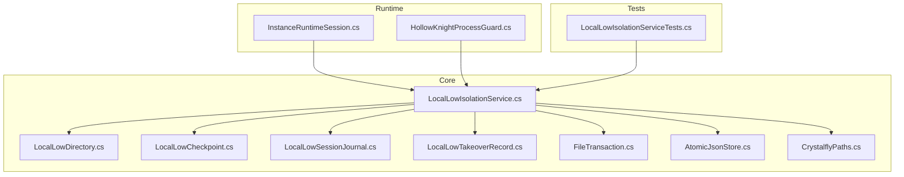
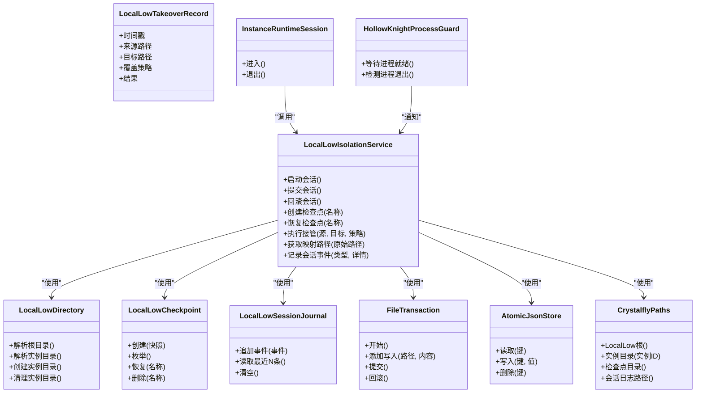
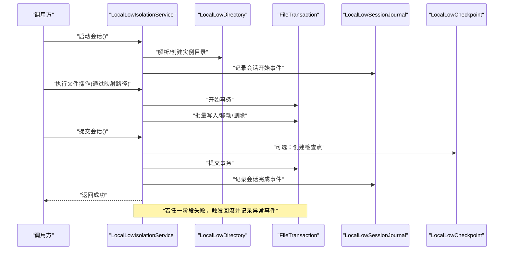
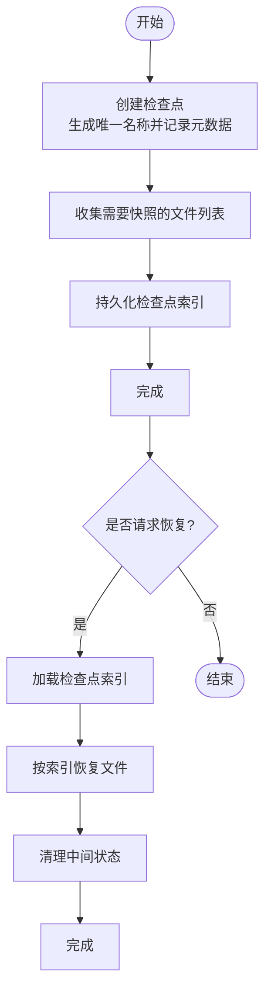
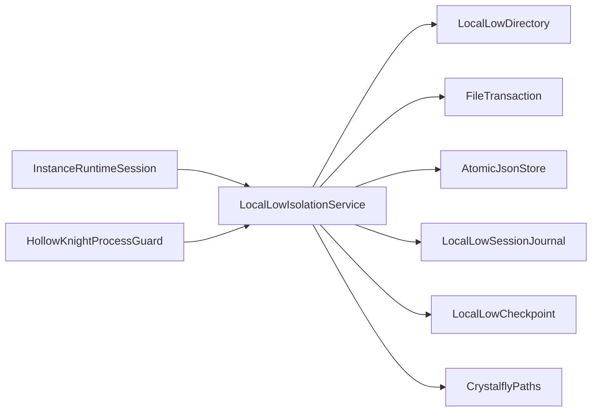

# 本地存储隔离

<cite>
**本文引用的文件**   
- [LocalLowIsolationService.cs](file://src/Crystalfly.Core/LocalLow/LocalLowIsolationService.cs)
- [LocalLowDirectory.cs](file://src/Crystalfly.Core/LocalLow/LocalLowDirectory.cs)
- [LocalLowCheckpoint.cs](file://src/Crystalfly.Core/LocalLow/LocalLowCheckpoint.cs)
- [LocalLowSessionJournal.cs](file://src/Crystalfly.Core/Models/LocalLowSessionJournal.cs)
- [LocalLowTakeoverRecord.cs](file://src/Crystalfly.Core/Models/LocalLowTakeoverRecord.cs)
- [FileTransaction.cs](file://src/Crystalfly.Core/Transactions/FileTransaction.cs)
- [AtomicJsonStore.cs](file://src/Crystalfly.Core/Serialization/AtomicJsonStore.cs)
- [CrystalflyPaths.cs](file://src/Crystalfly.Core/Configuration/CrystalflyPaths.cs)
- [InstanceRuntimeSession.cs](file://src/Crystalfly.Core/Runtime/InstanceRuntimeSession.cs)
- [HollowKnightProcessGuard.cs](file://src/Crystalfly.Core/Runtime/HollowKnightProcessGuard.cs)
- [LocalLowIsolationServiceTests.cs](file://tests/Crystalfly.Core.Tests/LocalLow/LocalLowIsolationServiceTests.cs)
</cite>

## 目录
1. [简介](#简介)
2. [项目结构](#项目结构)
3. [核心组件](#核心组件)
4. [架构总览](#架构总览)
5. [详细组件分析](#详细组件分析)
6. [依赖关系分析](#依赖关系分析)
7. [性能与一致性](#性能与一致性)
8. [故障排查指南](#故障排查指南)
9. [结论](#结论)
10. [附录：使用示例与最佳实践](#附录使用示例与最佳实践)

## 简介
本文件围绕 Crystalfly 的“本地存储隔离系统”展开，重点阐述 LocalLow 目录隔离服务的实现原理与使用方式。内容涵盖：
- 会话日志记录与接管机制
- 隔离策略、路径映射与权限管理
- 检查点机制、会话状态跟踪与冲突解决
- 与游戏进程的集成和数据同步策略
- 文件锁定、并发访问与数据一致性保证
- 接管记录的格式与生命周期管理
- 面向开发者的使用示例与最佳实践

## 项目结构
与 LocalLow 隔离相关的代码主要位于 Core 层的 LocalLow 目录及其模型、事务与序列化模块中，同时通过运行时模块与游戏进程交互。

图表来源
- [LocalLowIsolationService.cs](file://src/Crystalfly.Core/LocalLow/LocalLowIsolationService.cs)
- [LocalLowDirectory.cs](file://src/Crystalfly.Core/LocalLow/LocalLowDirectory.cs)
- [LocalLowCheckpoint.cs](file://src/Crystalfly.Core/LocalLow/LocalLowCheckpoint.cs)
- [LocalLowSessionJournal.cs](file://src/Crystalfly.Core/Models/LocalLowSessionJournal.cs)
- [LocalLowTakeoverRecord.cs](file://src/Crystalfly.Core/Models/LocalLowTakeoverRecord.cs)
- [FileTransaction.cs](file://src/Crystalfly.Core/Transactions/FileTransaction.cs)
- [AtomicJsonStore.cs](file://src/Crystalfly.Core/Serialization/AtomicJsonStore.cs)
- [CrystalflyPaths.cs](file://src/Crystalfly.Core/Configuration/CrystalflyPaths.cs)
- [InstanceRuntimeSession.cs](file://src/Crystalfly.Core/Runtime/InstanceRuntimeSession.cs)
- [HollowKnightProcessGuard.cs](file://src/Crystalfly.Core/Runtime/HollowKnightProcessGuard.cs)
- [LocalLowIsolationServiceTests.cs](file://tests/Crystalfly.Core.Tests/LocalLow/LocalLowIsolationServiceTests.cs)

章节来源
- [LocalLowIsolationService.cs](file://src/Crystalfly.Core/LocalLow/LocalLowIsolationService.cs)
- [LocalLowDirectory.cs](file://src/Crystalfly.Core/LocalLow/LocalLowDirectory.cs)
- [LocalLowCheckpoint.cs](file://src/Crystalfly.Core/LocalLow/LocalLowCheckpoint.cs)
- [LocalLowSessionJournal.cs](file://src/Crystalfly.Core/Models/LocalLowSessionJournal.cs)
- [LocalLowTakeoverRecord.cs](file://src/Crystalfly.Core/Models/LocalLowTakeoverRecord.cs)
- [FileTransaction.cs](file://src/Crystalfly.Core/Transactions/FileTransaction.cs)
- [AtomicJsonStore.cs](file://src/Crystalfly.Core/Serialization/AtomicJsonStore.cs)
- [CrystalflyPaths.cs](file://src/Crystalfly.Core/Configuration/CrystalflyPaths.cs)
- [InstanceRuntimeSession.cs](file://src/Crystalfly.Core/Runtime/InstanceRuntimeSession.cs)
- [HollowKnightProcessGuard.cs](file://src/Crystalfly.Core/Runtime/HollowKnightProcessGuard.cs)
- [LocalLowIsolationServiceTests.cs](file://tests/Crystalfly.Core.Tests/LocalLow/LocalLowIsolationServiceTests.cs)

## 核心组件
- LocalLowIsolationService：提供 LocalLow 目录的隔离能力，包括会话级日志记录、接管（takeover）机制、路径映射、检查点与回滚、以及并发控制。
- LocalLowDirectory：封装 LocalLow 根目录与实例子目录的解析、创建与清理逻辑。
- LocalLowCheckpoint：定义检查点的创建、枚举、恢复与删除操作。
- LocalLowSessionJournal：以原子持久化的方式记录会话事件（开始、结束、异常等），用于审计与排障。
- LocalLowTakeoverRecord：描述一次“接管”的元信息（如时间戳、来源、目标、覆盖策略等）。
- FileTransaction：提供跨多个文件的原子写入与回滚语义，保障一致性。
- AtomicJsonStore：对 JSON 数据进行原子读写，避免部分写入导致的数据损坏。
- CrystalflyPaths：集中管理路径常量与计算规则。
- InstanceRuntimeSession / HollowKnightProcessGuard：与游戏进程生命周期协同，确保在正确时机进行隔离与同步。

章节来源
- [LocalLowIsolationService.cs](file://src/Crystalfly.Core/LocalLow/LocalLowIsolationService.cs)
- [LocalLowDirectory.cs](file://src/Crystalfly.Core/LocalLow/LocalLowDirectory.cs)
- [LocalLowCheckpoint.cs](file://src/Crystalfly.Core/LocalLow/LocalLowCheckpoint.cs)
- [LocalLowSessionJournal.cs](file://src/Crystalfly.Core/Models/LocalLowSessionJournal.cs)
- [LocalLowTakeoverRecord.cs](file://src/Crystalfly.Core/Models/LocalLowTakeoverRecord.cs)
- [FileTransaction.cs](file://src/Crystalfly.Core/Transactions/FileTransaction.cs)
- [AtomicJsonStore.cs](file://src/Crystalfly.Core/Serialization/AtomicJsonStore.cs)
- [CrystalflyPaths.cs](file://src/Crystalfly.Core/Configuration/CrystalflyPaths.cs)
- [InstanceRuntimeSession.cs](file://src/Crystalfly.Core/Runtime/InstanceRuntimeSession.cs)
- [HollowKnightProcessGuard.cs](file://src/Crystalfly.Core/Runtime/HollowKnightProcessGuard.cs)

## 架构总览
下图展示了隔离服务与相关组件之间的协作关系，以及与会话、事务和持久化层的关系。

图表来源
- [LocalLowIsolationService.cs](file://src/Crystalfly.Core/LocalLow/LocalLowIsolationService.cs)
- [LocalLowDirectory.cs](file://src/Crystalfly.Core/LocalLow/LocalLowDirectory.cs)
- [LocalLowCheckpoint.cs](file://src/Crystalfly.Core/LocalLow/LocalLowCheckpoint.cs)
- [LocalLowSessionJournal.cs](file://src/Crystalfly.Core/Models/LocalLowSessionJournal.cs)
- [LocalLowTakeoverRecord.cs](file://src/Crystalfly.Core/Models/LocalLowTakeoverRecord.cs)
- [FileTransaction.cs](file://src/Crystalfly.Core/Transactions/FileTransaction.cs)
- [AtomicJsonStore.cs](file://src/Crystalfly.Core/Serialization/AtomicJsonStore.cs)
- [CrystalflyPaths.cs](file://src/Crystalfly.Core/Configuration/CrystalflyPaths.cs)
- [InstanceRuntimeSession.cs](file://src/Crystalfly.Core/Runtime/InstanceRuntimeSession.cs)
- [HollowKnightProcessGuard.cs](file://src/Crystalfly.Core/Runtime/HollowKnightProcessGuard.cs)

## 详细组件分析

### LocalLowIsolationService：隔离服务核心
职责
- 会话生命周期管理：开始、提交、回滚；在会话期间将写操作重定向到隔离目录。
- 路径映射：将应用期望的“真实路径”映射到“隔离路径”，并在提交时合并或替换。
- 接管机制：支持将外部数据（例如用户存档）安全地复制到隔离环境，并记录接管元数据。
- 检查点：在关键操作前创建检查点，失败时可快速恢复。
- 会话日志：记录会话内关键事件，便于审计与问题定位。
- 并发与一致性：基于事务与原子写入，避免部分更新导致的损坏。

关键流程（序列图）

图表来源
- [LocalLowIsolationService.cs](file://src/Crystalfly.Core/LocalLow/LocalLowIsolationService.cs)
- [LocalLowDirectory.cs](file://src/Crystalfly.Core/LocalLow/LocalLowDirectory.cs)
- [FileTransaction.cs](file://src/Crystalfly.Core/Transactions/FileTransaction.cs)
- [LocalLowSessionJournal.cs](file://src/Crystalfly.Core/Models/LocalLowSessionJournal.cs)
- [LocalLowCheckpoint.cs](file://src/Crystalfly.Core/LocalLow/LocalLowCheckpoint.cs)

章节来源
- [LocalLowIsolationService.cs](file://src/Crystalfly.Core/LocalLow/LocalLowIsolationService.cs)

### LocalLowDirectory：目录解析与实例隔离
职责
- 解析 LocalLow 根目录与具体实例的子目录。
- 负责实例目录的创建、存在性校验与清理。
- 为路径映射提供基础目录结构。

典型用法要点
- 在会话开始前确保实例目录存在。
- 在会话结束后按需清理临时文件。

章节来源
- [LocalLowDirectory.cs](file://src/Crystalfly.Core/LocalLow/LocalLowDirectory.cs)

### LocalLowCheckpoint：检查点机制
职责
- 在关键操作前创建检查点（快照），包含必要元数据与文件集合。
- 支持按名称枚举、恢复与删除检查点。
- 与事务配合，确保检查点的一致性。

流程图（检查点创建与恢复）

图表来源
- [LocalLowCheckpoint.cs](file://src/Crystalfly.Core/LocalLow/LocalLowCheckpoint.cs)

章节来源
- [LocalLowCheckpoint.cs](file://src/Crystalfly.Core/LocalLow/LocalLowCheckpoint.cs)

### LocalLowSessionJournal：会话日志记录
职责
- 以追加模式记录会话事件（开始、结束、异常、警告等）。
- 提供读取最近 N 条事件的接口，便于诊断。
- 与原子写入结合，保证日志不丢失且不损坏。

章节来源
- [LocalLowSessionJournal.cs](file://src/Crystalfly.Core/Models/LocalLowSessionJournal.cs)

### LocalLowTakeoverRecord：接管记录
职责
- 描述一次接管操作的元信息，包括时间戳、来源路径、目标路径、覆盖策略与结果。
- 作为审计与回溯的依据，也可用于冲突解决策略的选择。

字段说明（概念性）
- 时间戳：接管发生的时间。
- 来源路径：被接管数据的原始位置。
- 目标路径：接管后的存放位置。
- 覆盖策略：当目标已存在时的处理策略（如跳过、覆盖、合并等）。
- 结果：成功或失败及错误信息摘要。

章节来源
- [LocalLowTakeoverRecord.cs](file://src/Crystalfly.Core/Models/LocalLowTakeoverRecord.cs)

### FileTransaction：文件事务
职责
- 提供多文件操作的原子语义：开始、批量写入、提交、回滚。
- 内部采用临时目录与原子替换策略，确保一致性。

章节来源
- [FileTransaction.cs](file://src/Crystalfly.Core/Transactions/FileTransaction.cs)

### AtomicJsonStore：JSON 原子持久化
职责
- 对 JSON 数据进行原子读写，避免部分写入导致的数据损坏。
- 常用于保存检查点索引、会话元数据等。

章节来源
- [AtomicJsonStore.cs](file://src/Crystalfly.Core/Serialization/AtomicJsonStore.cs)

### CrystalflyPaths：路径配置
职责
- 集中管理 LocalLow 根目录、实例目录、检查点目录、会话日志路径等。
- 提供统一的计算规则，减少硬编码。

章节来源
- [CrystalflyPaths.cs](file://src/Crystalfly.Core/Configuration/CrystalflyPaths.cs)

### 与游戏进程集成：InstanceRuntimeSession 与 HollowKnightProcessGuard
职责
- InstanceRuntimeSession：封装进入/退出运行时的边界，协调隔离服务的启动与提交。
- HollowKnightProcessGuard：监控游戏进程状态，确保在进程运行期间进行必要的同步与保护。

章节来源
- [InstanceRuntimeSession.cs](file://src/Crystalfly.Core/Runtime/InstanceRuntimeSession.cs)
- [HollowKnightProcessGuard.cs](file://src/Crystalfly.Core/Runtime/HollowKnightProcessGuard.cs)

## 依赖关系分析
- 低耦合高内聚：隔离服务通过接口化的目录、事务与持久化组件组合，降低对外部实现的依赖。
- 关键依赖链：
  - LocalLowIsolationService → LocalLowDirectory / FileTransaction / AtomicJsonStore / LocalLowSessionJournal / LocalLowCheckpoint / CrystalflyPaths
  - InstanceRuntimeSession / HollowKnightProcessGuard → LocalLowIsolationService

图表来源
- [LocalLowIsolationService.cs](file://src/Crystalffly.Core/LocalLow/LocalLowIsolationService.cs)
- [LocalLowDirectory.cs](file://src/Crystalfly.Core/LocalLow/LocalLowDirectory.cs)
- [FileTransaction.cs](file://src/Crystalfly.Core/Transactions/FileTransaction.cs)
- [AtomicJsonStore.cs](file://src/Crystalfly.Core/Serialization/AtomicJsonStore.cs)
- [LocalLowSessionJournal.cs](file://src/Crystalfly.Core/Models/LocalLowSessionJournal.cs)
- [LocalLowCheckpoint.cs](file://src/Crystalfly.Core/LocalLow/LocalLowCheckpoint.cs)
- [CrystalflyPaths.cs](file://src/Crystalfly.Core/Configuration/CrystalflyPaths.cs)
- [InstanceRuntimeSession.cs](file://src/Crystalfly.Core/Runtime/InstanceRuntimeSession.cs)
- [HollowKnightProcessGuard.cs](file://src/Crystalfly.Core/Runtime/HollowKnightProcessGuard.cs)

章节来源
- [LocalLowIsolationService.cs](file://src/Crystalfly.Core/LocalLow/LocalLowIsolationService.cs)
- [LocalLowDirectory.cs](file://src/Crystalfly.Core/LocalLow/LocalLowDirectory.cs)
- [FileTransaction.cs](file://src/Crystalfly.Core/Transactions/FileTransaction.cs)
- [AtomicJsonStore.cs](file://src/Crystalfly.Core/Serialization/AtomicJsonStore.cs)
- [LocalLowSessionJournal.cs](file://src/Crystalfly.Core/Models/LocalLowSessionJournal.cs)
- [LocalLowCheckpoint.cs](file://src/Crystalfly.Core/LocalLow/LocalLowCheckpoint.cs)
- [CrystalflyPaths.cs](file://src/Crystalfly.Core/Configuration/CrystalflyPaths.cs)
- [InstanceRuntimeSession.cs](file://src/Crystalfly.Core/Runtime/InstanceRuntimeSession.cs)
- [HollowKnightProcessGuard.cs](file://src/Crystalfly.Core/Runtime/HollowKnightProcessGuard.cs)

## 性能与一致性
- 原子写入与事务：通过 FileTransaction 与 AtomicJsonStore 的组合，避免部分写入造成的数据不一致。
- 批量操作：在会话内尽量聚合文件操作，减少磁盘 IO 次数。
- 检查点优化：仅对关键文件建立检查点，避免全量快照带来的开销。
- 并发控制：建议在同一实例上串行化写操作，或在更高层引入锁机制以避免竞争。
- 日志滚动：会话日志应限制大小或定期归档，防止无限增长影响性能。

[本节为通用指导，无需特定文件引用]

## 故障排查指南
常见问题与建议
- 会话未正常提交：检查会话日志中的异常事件，确认是否在提交前发生回滚。
- 接管失败：查看接管记录中的错误信息，确认覆盖策略与目标路径权限。
- 检查点无法恢复：验证检查点索引完整性与文件存在性。
- 并发冲突：确认是否存在多线程并发写入同一实例目录的情况。
- 进程退出导致数据不一致：利用进程守护与隔离服务的生命周期钩子，确保在进程退出前完成提交。

章节来源
- [LocalLowIsolationServiceTests.cs](file://tests/Crystalfly.Core.Tests/LocalLow/LocalLowIsolationServiceTests.cs)
- [LocalLowSessionJournal.cs](file://src/Crystalfly.Core/Models/LocalLowSessionJournal.cs)
- [LocalLowTakeoverRecord.cs](file://src/Crystalfly.Core/Models/LocalLowTakeoverRecord.cs)
- [LocalLowCheckpoint.cs](file://src/Crystalfly.Core/LocalLow/LocalLowCheckpoint.cs)
- [FileTransaction.cs](file://src/Crystalfly.Core/Transactions/FileTransaction.cs)

## 结论
LocalLow 隔离服务通过会话化、事务化与检查点机制，提供了稳定可靠的本地存储隔离能力。结合接管记录与会话日志，可实现完整的审计与回溯。与游戏进程的生命周期协同，进一步保障了数据一致性与用户体验。

[本节为总结性内容，无需特定文件引用]

## 附录：使用示例与最佳实践

### 基本使用流程（步骤式）
- 准备路径：通过路径配置获取 LocalLow 根目录与实例目录。
- 启动会话：调用隔离服务启动会话，记录开始事件。
- 执行操作：通过映射路径进行文件读写，所有变更暂存于隔离环境。
- 创建检查点（可选）：在关键变更前创建检查点，以便失败恢复。
- 提交会话：提交事务并将变更应用到目标位置。
- 记录完成：记录会话完成事件，必要时清理临时资源。

章节来源
- [LocalLowIsolationService.cs](file://src/Crystalfly.Core/LocalLow/LocalLowIsolationService.cs)
- [CrystalflyPaths.cs](file://src/Crystalfly.Core/Configuration/CrystalflyPaths.cs)

### 接管操作（步骤式）
- 确定来源与目标路径。
- 选择覆盖策略（跳过、覆盖、合并）。
- 执行接管并记录接管记录。
- 在会话结束时统一提交或回滚。

章节来源
- [LocalLowIsolationService.cs](file://src/Crystalfly.Core/LocalLow/LocalLowIsolationService.cs)
- [LocalLowTakeoverRecord.cs](file://src/Crystalfly.Core/Models/LocalLowTakeoverRecord.cs)

### 检查点操作（步骤式）
- 创建检查点：生成唯一名称，收集文件清单并持久化索引。
- 恢复检查点：加载索引并按清单恢复文件。
- 清理检查点：在不需要时删除旧检查点释放空间。

章节来源
- [LocalLowCheckpoint.cs](file://src/Crystalfly.Core/LocalLow/LocalLowCheckpoint.cs)

### 与游戏进程集成（步骤式）
- 在进入运行时前启动隔离会话。
- 在进程运行期间监听关键事件（如崩溃、异常退出）。
- 在进程退出前提交或回滚会话，确保数据一致性。

章节来源
- [InstanceRuntimeSession.cs](file://src/Crystalfly.Core/Runtime/InstanceRuntimeSession.cs)
- [HollowKnightProcessGuard.cs](file://src/Crystalfly.Core/Runtime/HollowKnightProcessGuard.cs)

### 并发与一致性建议
- 单实例串行化：对同一实例的写操作进行串行化处理。
- 细粒度锁：如需并行，针对不同文件或目录加锁。
- 幂等操作：设计可重试的写入逻辑，避免重复写入造成不一致。
- 事务边界：明确事务的开始与提交点，避免长事务占用资源。

章节来源
- [FileTransaction.cs](file://src/Crystalfly.Core/Transactions/FileTransaction.cs)
- [AtomicJsonStore.cs](file://src/Crystalfly.Core/Serialization/AtomicJsonStore.cs)