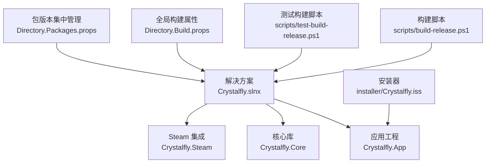
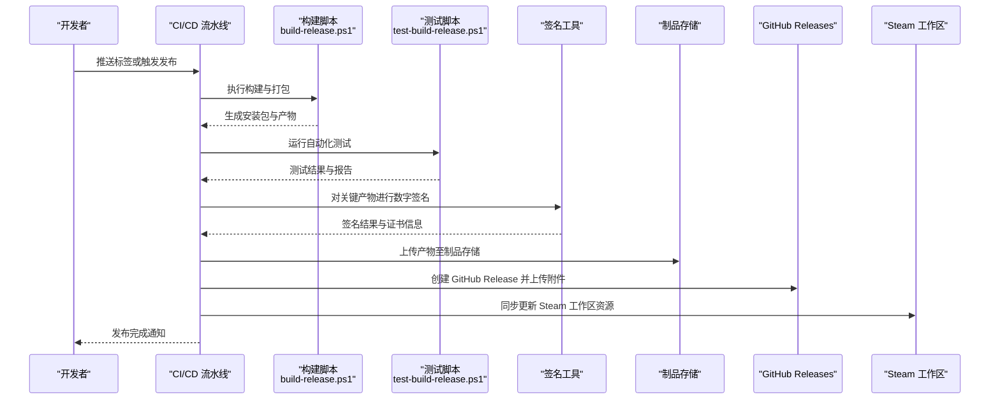
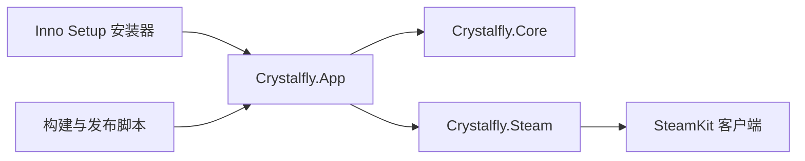

# 发布策略

<cite>
**本文引用的文件**   
- [Crystalfly.slnx](file://Crystalfly.slnx)
- [Directory.Build.props](file://Directory.Build.props)
- [Directory.Packages.props](file://Directory.Packages.props)
- [scripts/build-release.ps1](file://scripts/build-release.ps1)
- [scripts/test-build-release.ps1](file://scripts/test-build-release.ps1)
- [installer/Crystalfly.iss](file://installer/Crystalfly.iss)
- [src/Crystalfly.App/Program.cs](file://src/Crystalfly.App/Program.cs)
- [src/Crystalfly.Core/Instances/BuildFingerprintService.cs](file://src/Crystalfly.Core/Instances/BuildFingerprintService.cs)
- [src/Crystalfly.Core/Models/GameChannel.cs](file://src/Crystalfly.Core/Models/GameChannel.cs)
- [src/Crystalfly.Steam/Downloads/SteamKitContentDeliveryClient.cs](file://src/Crystalfly.Steam/Downloads/SteamKitContentDeliveryClient.cs)
</cite>

## 目录
1. [简介](#简介)
2. [项目结构](#项目结构)
3. [核心组件](#核心组件)
4. [架构总览](#架构总览)
5. [详细组件分析](#详细组件分析)
6. [依赖分析](#依赖分析)
7. [性能考虑](#性能考虑)
8. [故障排查指南](#故障排查指南)
9. [结论](#结论)
10. [附录](#附录)

## 简介
本文件为 Crystalffly 项目的发布策略文档，覆盖版本管理、语义化版本控制、分支与标签模型、变更日志生成、代码签名与安全、发布前检查清单、自动化测试与质量门禁、多渠道发布（GitHub Releases、Steam Workshop）、回滚与热修复流程、紧急发布程序，以及性能基准测试、兼容性矩阵与平台特定优化。目标是让开发者与维护者能够以一致、可重复且安全的方式完成从开发到发布的完整闭环。

## 项目结构
仓库采用多工程结构，包含应用层、核心库与 Steam 集成模块；构建与发布脚本集中于 scripts 目录；安装器使用 Inno Setup；全局构建属性通过 Directory.Build.props 和 Directory.Packages.props 集中管理。

图表来源
- [Crystalfly.slnx](file://Crystalfly.slnx)
- [Directory.Build.props](file://Directory.Build.props)
- [Directory.Packages.props](file://Directory.Packages.props)
- [scripts/build-release.ps1](file://scripts/build-release.ps1)
- [scripts/test-build-release.ps1](file://scripts/test-build-release.ps1)
- [installer/Crystalfly.iss](file://installer/Crystalfly.iss)

章节来源
- [Crystalfly.slnx](file://Crystalfly.slnx)
- [Directory.Build.props](file://Directory.Build.props)
- [Directory.Packages.props](file://Directory.Packages.props)
- [scripts/build-release.ps1](file://scripts/build-release.ps1)
- [scripts/test-build-release.ps1](file://scripts/test-build-release.ps1)
- [installer/Crystalfly.iss](file://installer/Crystalfly.iss)

## 核心组件
- 构建与打包
  - 构建入口：PowerShell 脚本负责编译、打包与产物归档。
  - 安装器：Inno Setup 脚本定义安装包元数据、安装路径与启动项。
- 版本与指纹
  - 应用入口：Program.cs 作为应用启动点，承载运行时行为。
  - 构建指纹服务：BuildFingerprintService 用于生成与读取构建指纹，辅助版本识别与一致性校验。
- 渠道与分发
  - 游戏渠道枚举：GameChannel 抽象不同发行渠道（如官方、Steam）。
  - Steam 下载客户端：SteamKitContentDeliveryClient 对接 Steam 内容分发能力。

章节来源
- [scripts/build-release.ps1](file://scripts/build-release.ps1)
- [scripts/test-build-release.ps1](file://scripts/test-build-release.ps1)
- [installer/Crystalfly.iss](file://installer/Crystalfly.iss)
- [src/Crystalfly.App/Program.cs](file://src/Crystalfly.App/Program.cs)
- [src/Crystalfly.Core/Instances/BuildFingerprintService.cs](file://src/Crystalfly.Core/Instances/BuildFingerprintService.cs)
- [src/Crystalfly.Core/Models/GameChannel.cs](file://src/Crystalfly.Core/Models/GameChannel.cs)
- [src/Crystalfly.Steam/Downloads/SteamKitContentDeliveryClient.cs](file://src/Crystalfly.Steam/Downloads/SteamKitContentDeliveryClient.cs)

## 架构总览
下图展示从“触发发布”到“产物签名与分发”的整体流程，涵盖构建、测试、打包、签名、上传与发布。

图表来源
- [scripts/build-release.ps1](file://scripts/build-release.ps1)
- [scripts/test-build-release.ps1](file://scripts/test-build-release.ps1)
- [installer/Crystalfly.iss](file://installer/Crystalfly.iss)

## 详细组件分析

### 版本管理与语义化版本控制
- 版本格式遵循语义化版本（主版本.次版本.修订号），其中：
  - 主版本：不兼容的 API/行为变更
  - 次版本：向后兼容的功能新增
  - 修订号：向后兼容的问题修复
- 版本号来源建议：
  - 通过 Git 标签驱动版本号注入
  - 在构建阶段将标签解析为 SemVer，并写入构建元数据
- 构建指纹：
  - 使用 BuildFingerprintService 生成唯一构建指纹，便于追踪与回滚定位
  - 指纹应包含时间戳、提交哈希、构建配置等不可变信息

章节来源
- [src/Crystalfly.Core/Instances/BuildFingerprintService.cs](file://src/Crystalfly.Core/Instances/BuildFingerprintService.cs)

### 发布分支模型与标签管理
- 分支模型
  - main：稳定分支，仅接受合并与打标签
  - develop：日常开发集成分支
  - feature/*：功能分支，完成后合并至 develop
  - release/*：预发布分支，用于回归测试与补丁准备
  - hotfix/*：紧急修复分支，直接从 main 切出，修复后合并回 main 与 develop
- 标签规范
  - v{SemVer}：正式版本标签
  - v{SemVer}-rc.{n}：候选发布标签
  - v{SemVer}-beta.{n}：Beta 标签
- 标签与分支关系
  - 所有正式版本必须基于 main 打标签
  - 预发布可在 release/* 分支上打 rc/beta 标签

章节来源
- [src/Crystalfly.Core/Models/GameChannel.cs](file://src/Crystalfly.Core/Models/GameChannel.cs)

### 变更日志生成
- 自动生成规则
  - 基于两个标签之间的提交消息生成变更摘要
  - 按类型分类（新功能、修复、破坏性变更、文档、样式、重构、性能、测试、构建、持续集成）
- 人工审核
  - 自动生成的日志需由维护者审核与润色
  - 重要修复与破坏性变更需在标题中突出显示

章节来源
- [scripts/build-release.ps1](file://scripts/build-release.ps1)

### 代码签名证书配置与数字签名验证
- 证书要求
  - 使用受信任的代码签名证书（EV 证书优先）
  - 确保证书有效期覆盖整个发布周期
- 配置要点
  - 在 CI 环境中安全存储证书与密码
  - 构建脚本调用签名工具对安装包与关键二进制进行签名
- 验证步骤
  - 本地与 CI 均执行签名验证
  - 安装器在安装过程中可提示用户验证发布者信息

章节来源
- [scripts/build-release.ps1](file://scripts/build-release.ps1)
- [installer/Crystalfly.iss](file://installer/Crystalfly.iss)

### 发布前检查清单
- 代码与质量
  - 所有单元测试与集成测试通过
  - 静态分析与安全扫描无阻断问题
- 构建与产物
  - 构建成功且产物完整性校验通过
  - 安装包与关键文件已签名
- 文档与合规
  - 变更日志已生成并审核
  - 许可证与第三方依赖声明齐全
- 渠道就绪
  - GitHub Releases 权限与令牌有效
  - Steam 工作区凭据与发布通道可用

章节来源
- [scripts/test-build-release.ps1](file://scripts/test-build-release.ps1)
- [scripts/build-release.ps1](file://scripts/build-release.ps1)

### 自动化测试执行与质量门禁
- 测试范围
  - 单元测试：核心逻辑与模型
  - UI 渲染与交互测试：界面结构与主题渲染
  - 下载队列与依赖修复相关测试
- 质量门禁
  - 测试覆盖率阈值
  - 失败即中止发布流程
  - 生成测试报告并归档

章节来源
- [scripts/test-build-release.ps1](file://scripts/test-build-release.ps1)

### 多渠道发布配置
- GitHub Releases
  - 使用 GitHub CLI 或 API 创建 Release 并上传附件
  - 设置发布说明与标签关联
- Steam 工作区
  - 通过 SteamKit 客户端上传工作区内容
  - 确保产品 ID、Depot 与凭据正确配置

章节来源
- [src/Crystalfly.Steam/Downloads/SteamKitContentDeliveryClient.cs](file://src/Crystalfly.Steam/Downloads/SteamKitContentDeliveryClient.cs)
- [src/Crystalfly.Core/Models/GameChannel.cs](file://src/Crystalfly.Core/Models/GameChannel.cs)

### 回滚策略、热修复流程与紧急发布程序
- 回滚策略
  - 支持通过标签快速回滚到上一个稳定版本
  - 提供一键恢复脚本，还原实例与侧车文件
- 热修复流程
  - 从 main 切出 hotfix/* 分支
  - 最小化变更，补充回归测试
  - 合并后打修订号标签并发布
- 紧急发布程序
  - 跳过非必要检查，但保留签名与基础测试
  - 发布后立即安排复盘与后续改进

章节来源
- [src/Crystalfly.Core/Instances/BuildFingerprintService.cs](file://src/Crystalfly.Core/Instances/BuildFingerprintService.cs)
- [src/Crystalfly.App/Program.cs](file://src/Crystalfly.App/Program.cs)

### 性能基准测试、兼容性矩阵与平台特定优化
- 性能基准
  - 下载与解压吞吐、依赖解析耗时、UI 渲染帧率
  - 在不同硬件与网络条件下采集指标
- 兼容性矩阵
  - Windows 版本、.NET 运行时版本、Steam 客户端版本
  - 记录已知限制与规避方案
- 平台特定优化
  - 针对 Windows 的文件事务与原子写入
  - 针对 Steam 的并发下载与断点续传优化

章节来源
- [src/Crystalfly.Core/Transactions/FileTransaction.cs](file://src/Crystalfly.Core/Transactions/FileTransaction.cs)
- [src/Crystalfly.Steam/Downloads/SteamKitContentDeliveryClient.cs](file://src/Crystalfly.Steam/Downloads/SteamKitContentDeliveryClient.cs)

## 依赖分析
- 工程耦合
  - Crystalfly.App 依赖 Crystalfly.Core 与 Crystalfly.Steam
  - Crystalfly.Core 提供通用能力（实例、加载器、序列化、事务等）
  - Crystalfly.Steam 封装 Steam 认证与内容分发
- 外部依赖
  - SteamKit 用于 Steam 内容交付
  - Inno Setup 用于安装包构建
  - PowerShell 脚本协调构建与发布流程

图表来源
- [Crystalfly.slnx](file://Crystalfly.slnx)
- [src/Crystalfly.App/Program.cs](file://src/Crystalfly.App/Program.cs)
- [src/Crystalfly.Steam/Downloads/SteamKitContentDeliveryClient.cs](file://src/Crystalfly.Steam/Downloads/SteamKitContentDeliveryClient.cs)
- [installer/Crystalfly.iss](file://installer/Crystalfly.iss)
- [scripts/build-release.ps1](file://scripts/build-release.ps1)

章节来源
- [Crystalfly.slnx](file://Crystalfly.slnx)
- [src/Crystalfly.App/Program.cs](file://src/Crystalfly.App/Program.cs)
- [src/Crystalfly.Steam/Downloads/SteamKitContentDeliveryClient.cs](file://src/Crystalfly.Steam/Downloads/SteamKitContentDeliveryClient.cs)
- [installer/Crystalfly.iss](file://installer/Crystalfly.iss)
- [scripts/build-release.ps1](file://scripts/build-release.ps1)

## 性能考虑
- 构建性能
  - 并行编译与增量构建
  - 缓存 NuGet 包与中间产物
- 运行时性能
  - 下载队列并发度调优
  - 大文件分块与断点续传
- 稳定性
  - 重试与退避策略
  - 超时与熔断保护

[本节为通用指导，无需引用具体文件]

## 故障排查指南
- 常见问题
  - 构建失败：检查 .NET SDK 版本与全局属性配置
  - 签名失败：确认证书与密码在 CI 环境变量中正确配置
  - Steam 发布失败：核对凭据、产品 ID 与 Depot 配置
- 诊断手段
  - 启用详细日志输出
  - 收集构建产物与测试报告
  - 使用构建指纹定位问题版本

章节来源
- [Directory.Build.props](file://Directory.Build.props)
- [scripts/build-release.ps1](file://scripts/build-release.ps1)
- [scripts/test-build-release.ps1](file://scripts/test-build-release.ps1)
- [src/Crystalfly.Core/Instances/BuildFingerprintService.cs](file://src/Crystalfly.Core/Instances/BuildFingerprintService.cs)

## 结论
通过统一的版本与分支模型、严格的签名与安全策略、完善的自动化测试与质量门禁，以及多渠道发布与回滚机制，Crystalffly 能够实现高效、可靠且安全的发布流程。建议在 CI 中固化上述流程，并在每次发布后进行复盘与度量，持续改进发布效率与质量。

[本节为总结，无需引用具体文件]

## 附录
- 术语表
  - 语义化版本：SemVer
  - 构建指纹：Build Fingerprint
  - 工作区：Steam Workshop
- 参考链接
  - 解决方案与工程定义
  - 构建与测试脚本
  - 安装器配置

章节来源
- [Crystalfly.slnx](file://Crystalfly.slnx)
- [scripts/build-release.ps1](file://scripts/build-release.ps1)
- [scripts/test-build-release.ps1](file://scripts/test-build-release.ps1)
- [installer/Crystalfly.iss](file://installer/Crystalfly.iss)