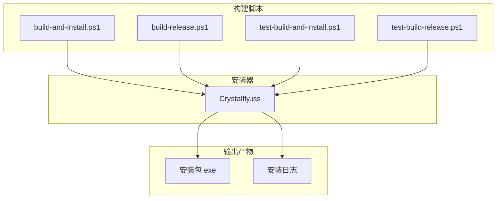
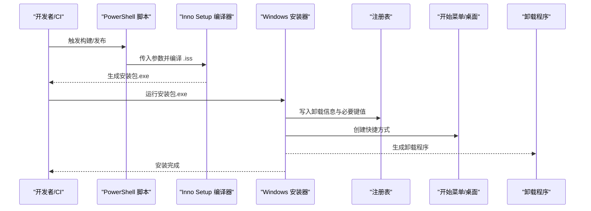
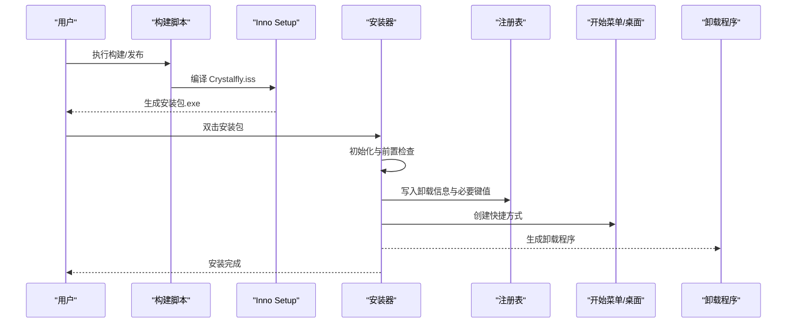
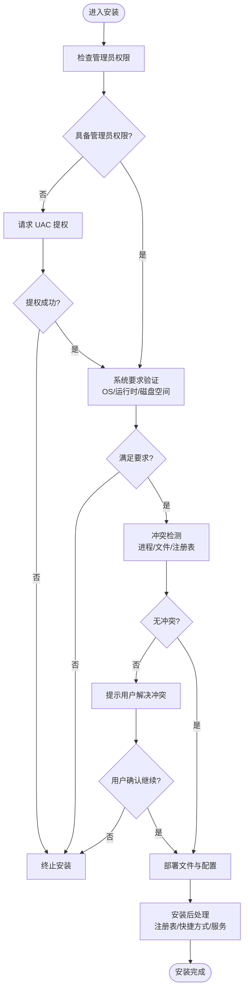
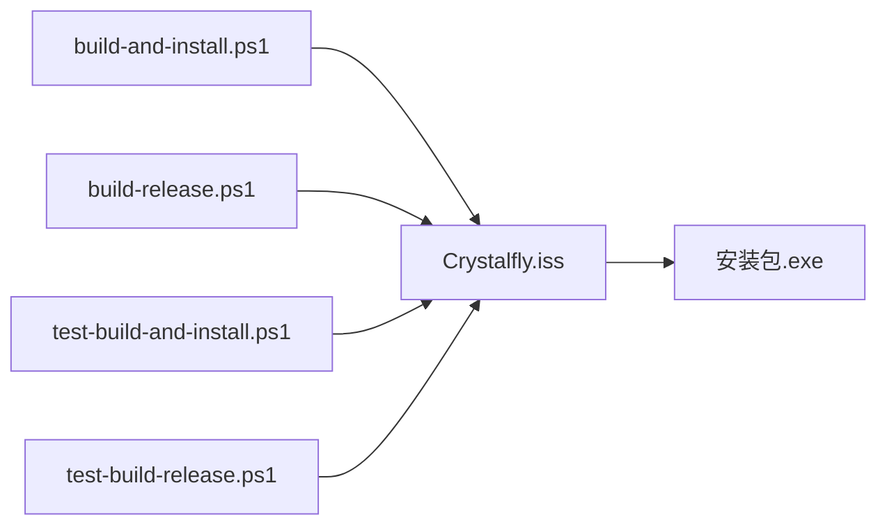

# 安装程序制作

<cite>
**本文引用的文件**   
- [Crystalfly.iss](file://installer/Crystalfly.iss)
- [build-and-install.ps1](file://scripts/build-and-install.ps1)
- [build-release.ps1](file://scripts/build-release.ps1)
- [test-build-and-install.ps1](file://scripts/test-build-and-install.ps1)
- [test-build-release.ps1](file://scripts/test-build-release.ps1)
</cite>

## 目录
1. [简介](#简介)
2. [项目结构](#项目结构)
3. [核心组件](#核心组件)
4. [架构总览](#架构总览)
5. [详细组件分析](#详细组件分析)
6. [依赖分析](#依赖分析)
7. [性能考虑](#性能考虑)
8. [故障排查指南](#故障排查指南)
9. [结论](#结论)
10. [附录](#附录)

## 简介
本文件面向 Crystalfly 项目的安装包制作与维护，聚焦于 Inno Setup 配置与脚本化构建流程。文档覆盖以下主题：
- Inno Setup 配置文件结构与自定义脚本编写要点
- 安装包打包流程、文件组织与依赖项处理
- Windows 注册表操作、开始菜单快捷方式创建与卸载程序生成
- 用户权限处理、UAC 提权与系统服务注册（如需）
- 安装包定制选项、语言包集成与主题应用
- 安装前检查、系统要求验证与冲突检测
- 安装包压缩优化、增量更新支持与损坏恢复机制

## 项目结构
与安装程序相关的代码集中在 installer 与 scripts 两个目录中：
- installer/Crystalfly.iss：Inno Setup 主配置文件，定义安装包元数据、文件部署、注册表项、快捷方式、卸载行为等
- scripts/*.ps1：PowerShell 构建与测试脚本，负责编译产物准备、调用 Inno Setup 生成安装包、执行本地安装/卸载验证等

图表来源
- [Crystalfly.iss](file://installer/Crystalfly.iss)
- [build-and-install.ps1](file://scripts/build-and-install.ps1)
- [build-release.ps1](file://scripts/build-release.ps1)
- [test-build-and-install.ps1](file://scripts/test-build-and-install.ps1)
- [test-build-release.ps1](file://scripts/test-build-release.ps1)

章节来源
- [Crystalfly.iss](file://installer/Crystalfly.iss)
- [build-and-install.ps1](file://scripts/build-and-install.ps1)
- [build-release.ps1](file://scripts/build-release.ps1)
- [test-build-and-install.ps1](file://scripts/test-build-and-install.ps1)
- [test-build-release.ps1](file://scripts/test-build-release.ps1)

## 核心组件
- Inno Setup 配置（Crystalfly.iss）
  - 定义应用名称、版本、发布者、图标、安装路径、目标平台（x64/x86）、压缩算法、语言包、预处理器变量等
  - 声明要部署的文件与目录结构，包括应用二进制、资源、运行时依赖等
  - 配置注册表项（如卸载信息、关联类型、启动参数等）
  - 配置开始菜单/桌面快捷方式、卸载入口
  - 可选：安装前后事件钩子（初始化、完成、卸载前/后），用于执行额外逻辑（如写入配置、清理旧版本残留）
- PowerShell 构建脚本
  - build-and-install.ps1：构建应用并调用 Inno Setup 生成安装包，随后自动运行安装以进行本地验证
  - build-release.ps1：按发布流程生成安装包（可能包含签名、归档等步骤）
  - test-build-and-install.ps1 / test-build-release.ps1：在 CI 或本地快速验证构建与安装流程

章节来源
- [Crystalfly.iss](file://installer/Crystalfly.iss)
- [build-and-install.ps1](file://scripts/build-and-install.ps1)
- [build-release.ps1](file://scripts/build-release.ps1)
- [test-build-and-install.ps1](file://scripts/test-build-and-install.ps1)
- [test-build-release.ps1](file://scripts/test-build-release.ps1)

## 架构总览
下图展示了从源码到可分发安装包的端到端流程，以及安装时关键子系统交互（注册表、快捷方式、卸载程序）。

图表来源
- [Crystalfly.iss](file://installer/Crystalfly.iss)
- [build-and-install.ps1](file://scripts/build-and-install.ps1)
- [build-release.ps1](file://scripts/build-release.ps1)

## 详细组件分析

### Inno Setup 配置（Crystalfly.iss）
- 配置段与关键字
  - 应用元数据：名称、版本、发布者、版权、图标、默认安装路径、目标架构
  - 压缩与语言：压缩算法选择、多语言支持（.isl 语言包引入）
  - 文件部署：Source/Dest 映射、是否只读、是否隐藏、是否存档标志
  - 注册表：添加/删除键值、设置默认程序、卸载信息
  - 快捷方式：开始菜单/桌面条目、工作目录、运行参数
  - 卸载：卸载图标、卸载命令、卸载前提示
  - 事件钩子：InitializeSetup、CurStepChanged、DeinitializeSetup 等（按需实现）
- 典型扩展点
  - 安装前检查：通过 InitializeSetup 返回布尔值控制是否继续安装
  - 系统要求验证：读取系统信息（如操作系统版本、.NET 运行时、磁盘空间）并给出提示
  - 冲突检测：扫描已存在进程/文件/注册表项，阻止不兼容安装
  - UAC 提权：使用 Run 任务或管理员权限运行特定步骤（例如写入 Program Files）
  - 服务注册：在安装完成后以管理员身份注册/启动系统服务（若需要）
  - 语言包集成：根据用户区域或命令行参数加载对应 .isl
  - 主题应用：将 UI 主题资源随包部署，并在首次运行或安装后生效

章节来源
- [Crystalfly.iss](file://installer/Crystalfly.iss)

### 构建与发布脚本（PowerShell）
- build-and-install.ps1
  - 职责：构建应用产物、调用 iscc 编译 .iss、生成安装包、自动运行安装进行本地验证
  - 关键点：传递版本号、目标平台、压缩级别、语言包开关等参数；捕获错误码并输出日志
- build-release.ps1
  - 职责：按发布规范生成安装包（可包含签名、归档、制品上传等）
  - 关键点：环境变量注入（如证书路径、签名工具链）、产物命名约定
- test-build-and-install.ps1 / test-build-release.ps1
  - 职责：在自动化环境中复现构建与安装流程，断言关键结果（安装包存在、安装成功、卸载可用）

章节来源
- [build-and-install.ps1](file://scripts/build-and-install.ps1)
- [build-release.ps1](file://scripts/build-release.ps1)
- [test-build-and-install.ps1](file://scripts/test-build-and-install.ps1)
- [test-build-release.ps1](file://scripts/test-build-release.ps1)

### 安装流程时序（结合脚本与 Inno Setup）

图表来源
- [Crystalfly.iss](file://installer/Crystalfly.iss)
- [build-and-install.ps1](file://scripts/build-and-install.ps1)
- [build-release.ps1](file://scripts/build-release.ps1)

### 复杂逻辑流程图（安装前检查与冲突检测）

[此图为概念性流程，无需图表来源]

## 依赖分析
- 外部依赖
  - Inno Setup 编译器（iscc.exe）：由构建脚本调用
  - 可选：数字签名工具（发布流程）
  - 可选：运行时依赖（如 .NET 运行时、VC++ 运行时），可在安装前检查并引导安装
- 内部依赖
  - Crystalfly.iss 作为唯一安装描述源，被所有构建脚本引用
  - 构建脚本之间相互独立，分别承担“开发调试”和“发布流水线”的职责

图表来源
- [Crystalfly.iss](file://installer/Crystalfly.iss)
- [build-and-install.ps1](file://scripts/build-and-install.ps1)
- [build-release.ps1](file://scripts/build-release.ps1)
- [test-build-and-install.ps1](file://scripts/test-build-and-install.ps1)
- [test-build-release.ps1](file://scripts/test-build-release.ps1)

章节来源
- [Crystalfly.iss](file://installer/Crystalfly.iss)
- [build-and-install.ps1](file://scripts/build-and-install.ps1)
- [build-release.ps1](file://scripts/build-release.ps1)
- [test-build-and-install.ps1](file://scripts/test-build-and-install.ps1)
- [test-build-release.ps1](file://scripts/test-build-release.ps1)

## 性能考虑
- 压缩策略
  - 选择合适的压缩算法与级别，平衡安装包体积与解压速度
  - 对大文件采用分块或延迟解压策略（如适用）
- 并行与缓存
  - 在构建阶段并行拷贝/预处理资源文件
  - 利用 Inno Setup 的缓存特性减少重复计算
- 增量更新
  - 基于差异补丁或版本对比，仅传输变更内容
  - 校验完整性（哈希）并支持断点续传与失败重试
- 损坏恢复
  - 安装过程中记录事务日志，失败时可回滚
  - 提供修复模式，校验关键文件完整性并自动修复

[本节为通用指导，不涉及具体文件分析]

## 故障排查指南
- 常见问题定位
  - 权限不足：确认是否以管理员身份运行；必要时启用 UAC 提权
  - 路径冲突：检查目标目录是否存在只读文件或占用进程
  - 注册表写入失败：核对 HKLM/HKCU 权限与键值格式
  - 快捷方式无效：检查工作目录与启动参数是否正确
  - 卸载失败：检查卸载程序是否存在且未被占用
- 日志与诊断
  - 启用详细安装日志，定位失败步骤
  - 在构建脚本中输出关键中间产物与错误码
  - 在 CI 中保留安装包与日志以便回溯

章节来源
- [Crystalfly.iss](file://installer/Crystalfly.iss)
- [build-and-install.ps1](file://scripts/build-and-install.ps1)
- [build-release.ps1](file://scripts/build-release.ps1)
- [test-build-and-install.ps1](file://scripts/test-build-and-install.ps1)
- [test-build-release.ps1](file://scripts/test-build-release.ps1)

## 结论
通过统一的 Inno Setup 配置与幂等的 PowerShell 构建脚本，Crystalffly 的安装包生产与验证流程清晰可控。建议在持续集成中固化构建与安装验证步骤，确保每次发布都经过一致的质量门禁。对于企业级场景，建议补充数字签名、灰度发布与增量更新能力，以提升分发效率与用户体验。

[本节为总结性内容，不涉及具体文件分析]

## 附录
- 术语
  - UAC：用户账户控制
  - ISL：Inno Setup 语言包
  - HKLM/HKCU：Windows 注册表主键
- 参考实践
  - 安装前检查与冲突检测模板
  - 多语言与主题资源的打包策略
  - 服务注册与自启动的最佳实践

[本节为补充说明，不涉及具体文件分析]