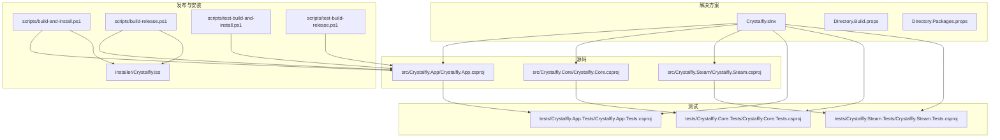
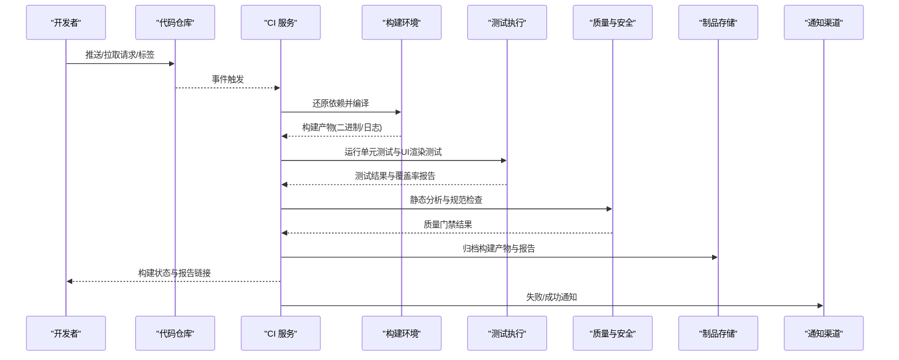
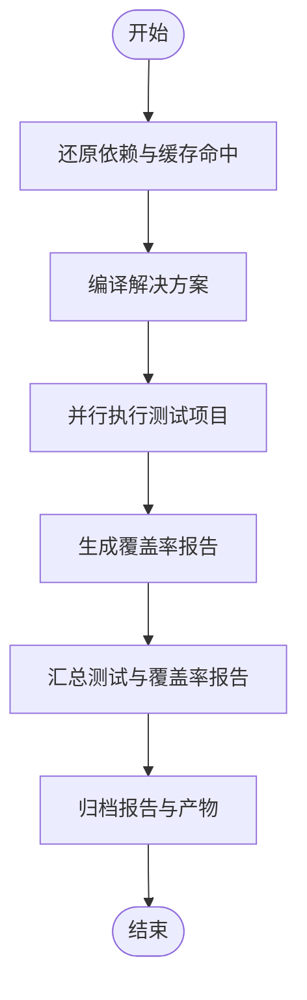
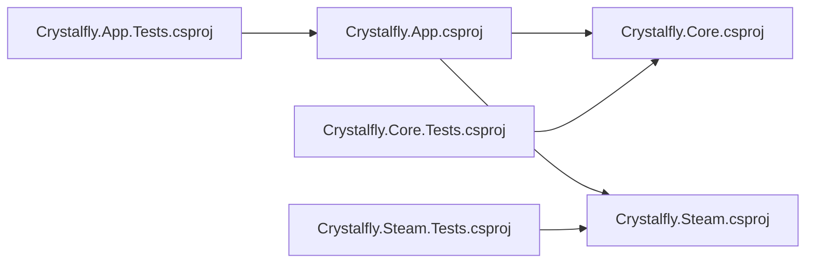

# 持续集成

<cite>
**本文引用的文件**   
- [Crystalfly.slnx](file://Crystalfly.slnx)
- [Directory.Build.props](file://Directory.Build.props)
- [Directory.Packages.props](file://Directory.Packages.props)
- [scripts/build-and-install.ps1](file://scripts/build-and-install.ps1)
- [scripts/build-release.ps1](file://scripts/build-release.ps1)
- [scripts/test-build-and-install.ps1](file://scripts/test-build-and-install.ps1)
- [scripts/test-build-release.ps1](file://scripts/test-build-release.ps1)
- [installer/Crystalfly.iss](file://installer/Crystalfly.iss)
- [src/Crystalfly.App/Crystalfly.App.csproj](file://src/Crystalfly.App/Crystalfly.App.csproj)
- [src/Crystalfly.Core/Crystalfly.Core.csproj](file://src/Crystalfly.Core/Crystalfly.Core.csproj)
- [src/Crystalfly.Steam/Crystalffly.Steam.csproj](file://src/Crystalfly.Steam/Crystalfly.Steam.csproj)
- [tests/Crystalfly.App.Tests/Crystalfly.App.Tests.csproj](file://tests/Crystalfly.App.Tests/Crystalfly.App.Tests.csproj)
- [tests/Crystalfly.Core.Tests/Crystalfly.Core.Tests.csproj](file://tests/Crystalfly.Core.Tests/Crystalfly.Core.Tests.csproj)
- [tests/Crystalfly.Steam.Tests/Crystalfly.Steam.Tests.csproj](file://tests/Crystalfly.Steam.Tests/Crystalfly.Steam.Tests.csproj)
</cite>

## 目录
1. [简介](#简介)
2. [项目结构](#项目结构)
3. [核心组件](#核心组件)
4. [架构总览](#架构总览)
5. [详细组件分析](#详细组件分析)
6. [依赖分析](#依赖分析)
7. [性能考虑](#性能考虑)
8. [故障排查指南](#故障排查指南)
9. [结论](#结论)
10. [附录](#附录)

## 简介
本文件为 Crystalfly 项目的持续集成（CI/CD）设计文档，聚焦于流水线阶段划分、触发条件、自动化测试与覆盖率收集、代码质量与静态分析、多平台构建矩阵与并行执行、缓存策略、失败通知与状态跟踪、回滚机制、制品管理与版本关联，以及性能回归检测、安全扫描与合规性检查的集成方式。文档面向开发者与维护者，既提供高层流程说明，也给出可落地的实现建议与图示。

## 项目结构
仓库采用 .NET 解决方案组织，包含应用层、核心库与 Steam 集成库，以及对应的单元测试项目；同时提供打包脚本与安装器配置。CI 将基于这些工程进行编译、测试、打包与产物归档。

图表来源
- [Crystalfly.slnx](file://Crystalfly.slnx)
- [Directory.Build.props](file://Directory.Build.props)
- [Directory.Packages.props](file://Directory.Packages.props)
- [src/Crystalfly.App/Crystalfly.App.csproj](file://src/Crystalfly.App/Crystalfly.App.csproj)
- [src/Crystalfly.Core/Crystalfly.Core.csproj](file://src/Crystalfly.Core/Crystalfly.Core.csproj)
- [src/Crystalfly.Steam/Crystalfly.Steam.csproj](file://src/Crystalfly.Steam/Crystalfly.Steam.csproj)
- [tests/Crystalfly.App.Tests/Crystalfly.App.Tests.csproj](file://tests/Crystalfly.App.Tests/Crystalfly.App.Tests.csproj)
- [tests/Crystalfly.Core.Tests/Crystalfly.Core.Tests.csproj](file://tests/Crystalfly.Core.Tests/Crystalfly.Core.Tests.csproj)
- [tests/Crystalfly.Steam.Tests/Crystalfly.Steam.Tests.csproj](file://tests/Crystalfly.Steam.Tests/Crystalfly.Steam.Tests.csproj)
- [scripts/build-and-install.ps1](file://scripts/build-and-install.ps1)
- [scripts/build-release.ps1](file://scripts/build-release.ps1)
- [scripts/test-build-and-install.ps1](file://scripts/test-build-and-install.ps1)
- [scripts/test-build-release.ps1](file://scripts/test-build-release.ps1)
- [installer/Crystalfly.iss](file://installer/Crystalfly.iss)

章节来源
- [Crystalfly.slnx](file://Crystalfly.slnx)
- [Directory.Build.props](file://Directory.Build.props)
- [Directory.Packages.props](file://Directory.Packages.props)

## 核心组件
- 构建与打包脚本：用于在 CI 中驱动编译、测试与安装包生成。
- 安装器配置：定义 Windows 安装包结构与行为。
- 解决方案与全局属性：统一包版本、目标框架、公共构建选项与测试输出格式。
- 测试工程：覆盖 UI、ViewModel、核心逻辑与 Steam 集成的关键路径。

章节来源
- [scripts/build-and-install.ps1](file://scripts/build-and-install.ps1)
- [scripts/build-release.ps1](file://scripts/build-release.ps1)
- [scripts/test-build-and-install.ps1](file://scripts/test-build-and-install.ps1)
- [scripts/test-build-release.ps1](file://scripts/test-build-release.ps1)
- [installer/Crystalfly.iss](file://installer/Crystalfly.iss)
- [Directory.Build.props](file://Directory.Build.props)
- [Directory.Packages.props](file://Directory.Packages.props)

## 架构总览
下图展示 CI 流水线的端到端流程：从代码提交触发，到构建、测试、质量门禁、打包与制品归档，再到发布与回滚支持。

图表来源
- [scripts/build-and-install.ps1](file://scripts/build-and-install.ps1)
- [scripts/build-release.ps1](file://scripts/build-release.ps1)
- [scripts/test-build-and-install.ps1](file://scripts/test-build-and-install.ps1)
- [scripts/test-build-release.ps1](file://scripts/test-build-release.ps1)
- [Directory.Build.props](file://Directory.Build.props)

## 详细组件分析

### 触发条件与阶段划分
- 触发条件
  - 分支推送：对主分支与特性分支的 push 事件触发常规流水线。
  - 拉取请求：PR 合并前强制通过构建、测试与质量门禁。
  - 标签发布：匹配语义化版本标签时触发发布流水线。
- 阶段划分
  - 准备：恢复工具链与 NuGet 包缓存。
  - 构建：按解决方案编译所有项目，输出中间产物。
  - 测试：执行单元测试与 UI 渲染测试，生成覆盖率与测试报告。
  - 质量：静态分析、规则校验与安全检查。
  - 打包：生成安装包与发布压缩包。
  - 归档：上传制品与报告至制品库。
  - 通知：向团队发送构建状态与报告链接。

章节来源
- [scripts/build-and-install.ps1](file://scripts/build-and-install.ps1)
- [scripts/build-release.ps1](file://scripts/build-release.ps1)
- [scripts/test-build-and-install.ps1](file://scripts/test-build-and-install.ps1)
- [scripts/test-build-release.ps1](file://scripts/test-build-release.ps1)

### 自动化测试执行与覆盖率
- 测试范围
  - 核心逻辑：目录、实例、加载器、依赖解析、序列化、事务等。
  - UI 与 ViewModel：窗口结构、主题渲染、下载队列、市场安装对话框等。
  - Steam 集成：下载路径、进度聚合、内容交付客户端与令牌存储。
- 执行策略
  - 使用 dotnet test 并行执行测试项目，指定输出格式以兼容 CI 报告。
  - 启用覆盖率收集，输出 Cobertura 或 OpenCover 格式以便后续聚合。
- 报告与归档
  - 将测试 XML 与覆盖率报告作为工件归档，便于查看历史趋势。
  - 在 PR 评论中插入关键指标摘要（通过率、覆盖率阈值）。

图表来源
- [tests/Crystalfly.App.Tests/Crystalfly.App.Tests.csproj](file://tests/Crystalfly.App.Tests/Crystalfly.App.Tests.csproj)
- [tests/Crystalfly.Core.Tests/Crystalfly.Core.Tests.csproj](file://tests/Crystalfly.Core.Tests/Crystalfly.Core.Tests.csproj)
- [tests/Crystalfly.Steam.Tests/Crystalfly.Steam.Tests.csproj](file://tests/Crystalfly.Steam.Tests/Crystalfly.Steam.Tests.csproj)
- [Directory.Build.props](file://Directory.Build.props)

章节来源
- [tests/Crystalfly.App.Tests/Crystalfly.App.Tests.csproj](file://tests/Crystalfly.App.Tests/Crystalfly.App.Tests.csproj)
- [tests/Crystalfly.Core.Tests/Crystalfly.Core.Tests.csproj](file://tests/Crystalfly.Core.Tests/Crystalfly.Core.Tests.csproj)
- [tests/Crystalfly.Steam.Tests/Crystalfly.Steam.Tests.csproj](file://tests/Crystalfly.Steam.Tests/Crystalfly.Steam.Tests.csproj)
- [Directory.Build.props](file://Directory.Build.props)

### 代码质量检查与静态分析
- 静态分析
  - 使用 Roslyn 分析器与 StyleCop 等工具进行代码风格与规则校验。
  - 在构建阶段开启警告即错误，确保问题可见且阻断不合格变更。
- 规范验证
  - 通过 Directory.Build.props 统一分析器版本与规则集，保证一致性。
  - 可选引入格式化预检（如 EditorConfig），在 PR 阶段提示不一致。
- 质量门禁
  - 设置最低覆盖率阈值与严重级别告警，未达标则标记失败。

章节来源
- [Directory.Build.props](file://Directory.Build.props)
- [Directory.Packages.props](file://Directory.Packages.props)

### 多平台构建矩阵与并行执行
- 构建矩阵
  - Windows 桌面：当前主要目标平台，配合安装器生成安装包。
  - 可选扩展：若未来支持跨平台，可在矩阵中添加 Linux/macOS 构建节点。
- 并行执行
  - 利用 CI 并发作业并行构建不同平台与测试项目，缩短整体耗时。
  - 针对大解决方案启用增量构建与并行测试以减少等待时间。

章节来源
- [scripts/build-and-install.ps1](file://scripts/build-and-install.ps1)
- [scripts/build-release.ps1](file://scripts/build-release.ps1)
- [installer/Crystalfly.iss](file://installer/Crystalfly.iss)

### 缓存策略
- 依赖缓存
  - 缓存 NuGet 包目录，避免重复下载，提升还原速度。
- 构建缓存
  - 缓存 obj/bin 目录或使用增量构建，减少重复编译。
- 工具链缓存
  - 缓存 .NET SDK 与外部工具（如 Inno Setup），加速环境准备。

章节来源
- [Directory.Build.props](file://Directory.Build.props)
- [scripts/build-and-install.ps1](file://scripts/build-and-install.ps1)

### 失败通知、状态跟踪与回滚机制
- 失败通知
  - 在流水线失败时向企业聊天工具或邮件列表发送告警，附带失败原因与报告链接。
- 状态跟踪
  - 将每次构建的状态与指标持久化，支持趋势分析与回溯。
- 回滚机制
  - 发布流水线仅对语义化版本标签触发，保留历史制品与签名信息，支持快速回滚到上一稳定版本。

章节来源
- [scripts/build-release.ps1](file://scripts/build-release.ps1)
- [scripts/test-build-release.ps1](file://scripts/test-build-release.ps1)

### Artifact 管理、构建产物存储与版本关联
- 产物清单
  - 安装包（.exe/.msi）、压缩归档、测试报告与覆盖率报告。
- 命名与版本
  - 产物名称包含版本号与构建号，便于追踪与定位问题。
- 存储与访问
  - 将产物上传至制品库，设置保留策略与访问权限，供下游部署与审计使用。

章节来源
- [scripts/build-and-install.ps1](file://scripts/build-and-install.ps1)
- [scripts/build-release.ps1](file://scripts/build-release.ps1)
- [installer/Crystalfly.iss](file://installer/Crystalfly.iss)

### 性能回归检测、安全扫描与合规性检查
- 性能回归检测
  - 在基准测试套件中加入关键路径的性能用例，CI 对比基线阈值，超阈报警。
- 安全扫描
  - 集成依赖漏洞扫描与源代码安全分析，阻断高危问题进入主干。
- 合规性检查
  - 许可证与第三方组件合规校验，确保发布符合公司政策。

章节来源
- [Directory.Build.props](file://Directory.Build.props)
- [Directory.Packages.props](file://Directory.Packages.props)

## 依赖分析
下图展示解决方案内各工程之间的依赖关系，有助于理解构建顺序与并行优化点。

图表来源
- [src/Crystalfly.App/Crystalfly.App.csproj](file://src/Crystalfly.App/Crystalfly.App.csproj)
- [src/Crystalfly.Core/Crystalffly.Steam.csproj](file://src/Crystalfly.Core/Crystalfly.Core.csproj)
- [src/Crystalfly.Steam/Crystalfly.Steam.csproj](file://src/Crystalfly.Steam/Crystalfly.Steam.csproj)
- [tests/Crystalfly.App.Tests/Crystalfly.App.Tests.csproj](file://tests/Crystalfly.App.Tests/Crystalfly.App.Tests.csproj)
- [tests/Crystalfly.Core.Tests/Crystalfly.Core.Tests.csproj](file://tests/Crystalfly.Core.Tests/Crystalfly.Core.Tests.csproj)
- [tests/Crystalfly.Steam.Tests/Crystalfly.Steam.Tests.csproj](file://tests/Crystalfly.Steam.Tests/Crystalfly.Steam.Tests.csproj)

章节来源
- [Crystalfly.slnx](file://Crystalfly.slnx)
- [src/Crystalfly.App/Crystalfly.App.csproj](file://src/Crystalfly.App/Crystalfly.App.csproj)
- [src/Crystalfly.Core/Crystalfly.Core.csproj](file://src/Crystalfly.Core/Crystalfly.Core.csproj)
- [src/Crystalfly.Steam/Crystalfly.Steam.csproj](file://src/Crystalfly.Steam/Crystalfly.Steam.csproj)
- [tests/Crystalfly.App.Tests/Crystalfly.App.Tests.csproj](file://tests/Crystalfly.App.Tests/Crystalfly.App.Tests.csproj)
- [tests/Crystalfly.Core.Tests/Crystalfly.Core.Tests.csproj](file://tests/Crystalfly.Core.Tests/Crystalfly.Core.Tests.csproj)
- [tests/Crystalfly.Steam.Tests/Crystalfly.Steam.Tests.csproj](file://tests/Crystalfly.Steam.Tests/Crystalfly.Steam.Tests.csproj)

## 性能考虑
- 并行化
  - 使用多核构建与并行测试，合理拆分任务以降低总时长。
- 缓存命中
  - 精细化缓存键，避免误命中导致的不一致构建。
- 增量构建
  - 保持干净的中间目录与稳定的输入，最大化增量收益。
- 资源隔离
  - 为重型任务分配独立工作节点，避免相互干扰。

## 故障排查指南
- 构建失败
  - 检查依赖还原日志与编译器输出，确认目标框架与分析器版本一致。
- 测试失败
  - 查看测试报告与截图（UI 渲染测试），定位断言失败与环境差异。
- 覆盖率不达标
  - 核对覆盖率收集开关与报告格式，确认阈值配置与实际统计口径一致。
- 安装包生成失败
  - 验证安装器脚本参数与 Inno Setup 环境，检查签名证书与路径权限。

章节来源
- [scripts/build-and-install.ps1](file://scripts/build-and-install.ps1)
- [scripts/build-release.ps1](file://scripts/build-release.ps1)
- [scripts/test-build-and-install.ps1](file://scripts/test-build-and-install.ps1)
- [scripts/test-build-release.ps1](file://scripts/test-build-release.ps1)
- [installer/Crystalfly.iss](file://installer/Crystalfly.iss)

## 结论
本 CI/CD 方案围绕 .NET 解决方案与 PowerShell 脚本展开，通过标准化构建、全面测试、严格质量门禁与完善的制品管理，保障 Crystalfly 的稳定迭代与高质量发布。建议在后续演进中逐步引入性能基线、安全扫描与合规检查，进一步提升交付可靠性与安全性。

## 附录
- 术语
  - 制品：构建过程中产生的可分发文件与报告。
  - 质量门禁：在流水线中设置的硬性门槛，未通过则阻断后续步骤。
  - 语义化版本：遵循 Major.Minor.Patch 的版本约定，用于发布控制。