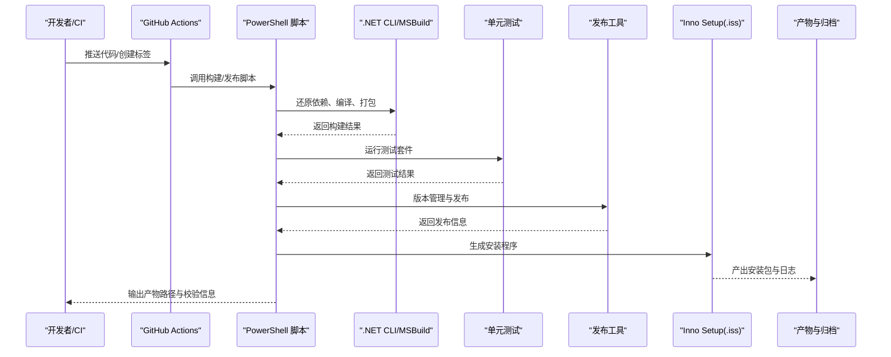
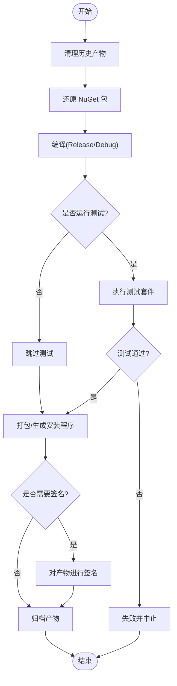
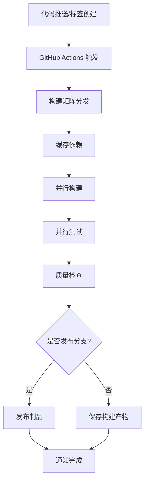
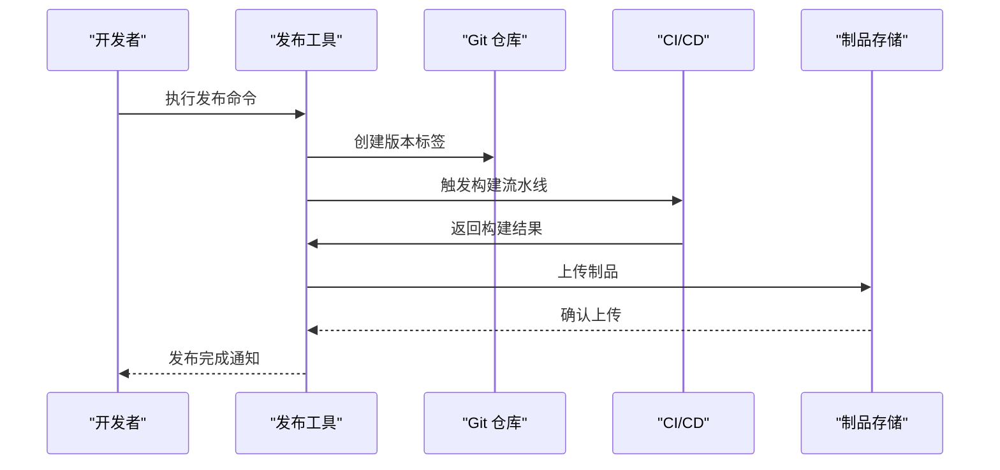
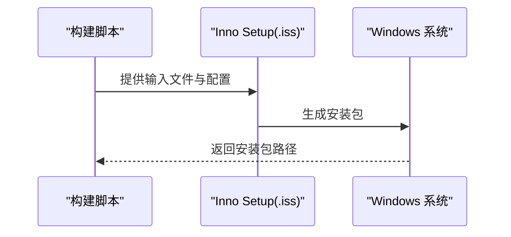
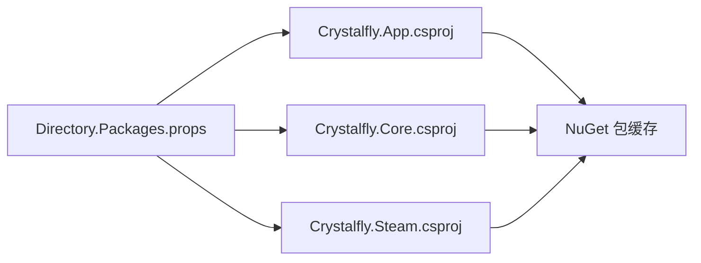
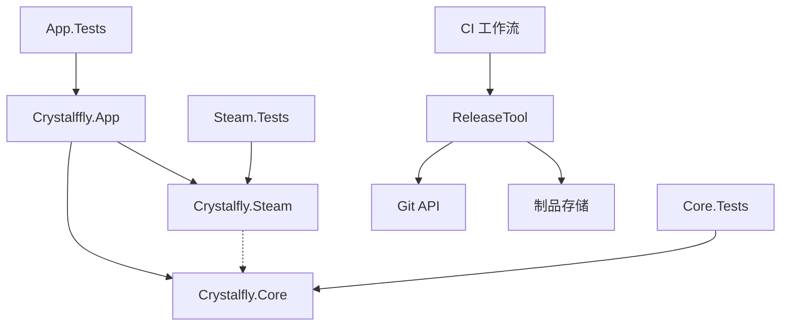

# 构建和部署

<cite>
**本文引用的文件**   
- [Directory.Build.props](file://Directory.Build.props)
- [Directory.Packages.props](file://Directory.Packages.props)
- [Crystalfly.slnx](file://Crystalfly.slnx)
- [scripts/build-and-install.ps1](file://scripts/build-and-install.ps1)
- [scripts/build-release.ps1](file://scripts/build-release.ps1)
- [scripts/import-mod-translations.ps1](file://scripts/import-mod-translations.ps1)
- [scripts/test-build-and-install.ps1](file://scripts/test-build-and-install.ps1)
- [scripts/test-build-release.ps1](file://scripts/test-build-release.ps1)
- [installer/Crystalfly.iss](file://installer/Crystalfly.iss)
- [src/Crystalfly.App/Crystalfly.App.csproj](file://src/Crystalfly.App/Crystalfly.App.csproj)
- [src/Crystalfly.Core/Crystalfly.Core.csproj](file://src/Crystalfly.Core/Crystalfly.Core.csproj)
- [src/Crystalfly.Steam/Crystalfly.Steam.csproj](file://src/Crystalfly.Steam/Crystalfly.Steam.csproj)
- [tests/Crystalfly.App.Tests/Crystalfly.App.Tests.csproj](file://tests/Crystalfly.App.Tests/Crystalfly.App.Tests.csproj)
- [tests/Crystalfly.Core.Tests/Crystalfly.Core.Tests.csproj](file://tests/Crystalfly.Core.Tests/Crystalfly.Core.Tests.csproj)
- [tests/Crystalfly.Steam.Tests/Crystalfly.Steam.Tests.csproj](file://tests/Crystalfly.Steam.Tests/Crystalfly.Steam.Tests.csproj)
- [.github/workflows/ci.yml](file://.github/workflows/ci.yml)
- [.github/workflows/update-mod-activity.yml](file://.github/workflows/update-mod-activity.yml)
- [tools/Crystalfly.ReleaseTool/Program.cs](file://tools/Crystalfly.ReleaseTool/Program.cs)
- [tools/Crystalfly.ReleaseTool/Crystalfly.ReleaseTool.csproj](file://tools/Crystalfly.ReleaseTool/Crystalfly.ReleaseTool.csproj)
</cite>

## 更新摘要
**变更内容**   
- 新增 GitHub Actions CI/CD 流水线配置，实现自动化构建、测试和发布流程
- 增强发布工具链，新增 Crystalfly.ReleaseTool 用于版本管理和发布自动化
- 优化构建脚本，提升开发效率和发布质量
- 完善持续集成配置，支持多环境构建和自动化测试
- 改进版本管理策略，支持语义化版本控制和标签发布

## 目录
1. [简介](#简介)
2. [项目结构](#项目结构)
3. [核心组件](#核心组件)
4. [架构总览](#架构总览)
5. [详细组件分析](#详细组件分析)
6. [依赖分析](#依赖分析)
7. [性能考虑](#性能考虑)
8. [故障排查指南](#故障排查指南)
9. [结论](#结论)
10. [附录](#附录)

## 简介
本文件面向 Crystalfly 项目的构建与部署，覆盖以下内容：
- 本地与 CI 环境下的构建流程、发布策略与安装程序制作
- PowerShell 脚本的职责与执行方式
- NuGet 包管理、依赖解析与版本控制策略
- **新增** GitHub Actions 持续集成配置、自动化测试与代码质量检查
- **新增** 发布工具链和版本管理自动化
- 打包、签名与分发的具体示例
- 多平台构建要求与兼容性注意事项
- 配置文件管理、环境变量设置与资源打包
- 调试符号生成、日志收集与错误报告集成

## 项目结构
仓库采用 .NET 解决方案组织，包含应用层、核心库与 Steam 集成库，以及对应的测试工程。构建与发布相关的脚本位于 scripts 目录，安装程序定义位于 installer 目录。**新增** GitHub Actions 工作流文件和发布工具。

```mermaid
graph TB
subgraph "解决方案"
SLN["Crystalfly.slnx"]
DBP["Directory.Build.props"]
DPP["Directory.Packages.props"]
end
subgraph "源代码"
APP["src/Crystalfly.App/Crystalfly.App.csproj"]
CORE["src/Crystalfly.Core/Crystalfly.Core.csproj"]
STEAM["src/Crystalfly.Steam/Crystalfly.Steam.csproj"]
end
subgraph "测试"
TAPP["tests/Crystalfly.App.Tests/Crystalfly.App.Tests.csproj"]
TCORE["tests/Crystalfly.Core.Tests/Crystalfly.Core.Tests.csproj"]
TSTEAM["tests/Crystalfly.Steam.Tests/Crystalfly.Steam.Tests.csproj"]
end
subgraph "构建与发布"
SBI["scripts/build-and-install.ps1"]
SBR["scripts/build-release.ps1"]
SIMT["scripts/import-mod-translations.ps1"]
STBI["scripts/test-build-and-install.ps1"]
STBR["scripts/test-build-release.ps1"]
ISS["installer/Crystalfly.iss"]
RT["tools/Crystalfly.ReleaseTool"]
end
subgraph "CI/CD"
GHA1[".github/workflows/ci.yml"]
GHA2[".github/workflows/update-mod-activity.yml"]
end
SLN --> APP
SLN --> CORE
SLN --> STEAM
SLN --> TAPP
SLN --> TCORE
SLN --> TSTEAM
DBP --> APP
DBP --> CORE
DBP --> STEAM
DBP --> TAPP
DBP --> TCORE
DBP --> TSTEAM
DPP --> APP
DPP --> CORE
DPP --> STEAM
SBR --> APP
SBR --> CORE
SBR --> STEAM
SBR --> ISS
SBR --> RT
SBI --> APP
SBI --> CORE
SBI --> STEAM
SIMT --> APP
STBR --> APP
STBR --> CORE
STBR --> STEAM
STBI --> APP
STBI --> CORE
STBI --> STEAM
GHA1 --> SBR
GHA1 --> STBR
GHA2 --> SIMT
```

**图表来源**
- [Crystalfly.slnx](file://Crystalfly.slnx)
- [Directory.Build.props](file://Directory.Build.props)
- [Directory.Packages.props](file://Directory.Packages.props)
- [src/Crystalfly.App/Crystalfly.App.csproj](file://src/Crystalfly.App/Crystalfly.App.csproj)
- [src/Crystalfly.Core/Crystalfly.Core.csproj](file://src/Crystalfly.Core/Crystalfly.Core.csproj)
- [src/Crystalfly.Steam/Crystalfly.Steam.csproj](file://src/Crystalfly.Steam/Crystalfly.Steam.csproj)
- [tests/Crystalfly.App.Tests/Crystalfly.App.Tests.csproj](file://tests/Crystalfly.App.Tests/Crystalfly.App.Tests.csproj)
- [tests/Crystalfly.Core.Tests/Crystalfly.Core.Tests.csproj](file://tests/Crystalfly.Core.Tests/Crystalfly.Core.Tests.csproj)
- [tests/Crystalfly.Steam.Tests/Crystalfly.Steam.Tests.csproj](file://tests/Crystalfly.Steam.Tests/Crystalfly.Steam.Tests.csproj)
- [scripts/build-and-install.ps1](file://scripts/build-and-install.ps1)
- [scripts/build-release.ps1](file://scripts/build-release.ps1)
- [scripts/import-mod-translations.ps1](file://scripts/import-mod-translations.ps1)
- [scripts/test-build-and-install.ps1](file://scripts/test-build-and-install.ps1)
- [scripts/test-build-release.ps1](file://scripts/test-build-release.ps1)
- [installer/Crystalfly.iss](file://installer/Crystalfly.iss)
- [.github/workflows/ci.yml](file://.github/workflows/ci.yml)
- [.github/workflows/update-mod-activity.yml](file://.github/workflows/update-mod-activity.yml)
- [tools/Crystalfly.ReleaseTool/Program.cs](file://tools/Crystalfly.ReleaseTool/Program.cs)

## 核心组件
- 全局构建属性（Directory.Build.props）
  - 统一 SDK、目标框架、语言版本、输出目录、中间目录、警告与错误级别、调试信息、强命名/签名、压缩与优化等全局开关
  - 集中化可提升一致性并减少重复配置
- 全局包版本管理（Directory.Packages.props）
  - 使用中央包版本清单统一管理第三方依赖版本，避免版本漂移
- 解决方案与项目引用
  - 通过 .slnx 聚合多个项目，便于一次性构建与测试
- 构建与发布脚本（PowerShell）
  - build-and-install.ps1：用于开发环境的快速构建与本地安装
  - build-release.ps1：用于生产发布的完整流水线（清理、还原、编译、测试、打包、签名、归档）
  - import-mod-translations.ps1：导入模组翻译资源到应用
  - test-build-and-install.ps1 / test-build-release.ps1：在隔离环境中验证构建与安装流程
- **新增** GitHub Actions 工作流
  - ci.yml：主 CI 流水线，处理构建、测试和发布
  - update-mod-activity.yml：自动化更新模组活动数据
- **新增** 发布工具（Crystalfly.ReleaseTool）
  - 提供版本管理、发布自动化和制品管理功能

**章节来源**
- [Directory.Build.props](file://Directory.Build.props)
- [Directory.Packages.props](file://Directory.Packages.props)
- [Crystalfly.slnx](file://Crystalfly.slnx)
- [scripts/build-and-install.ps1](file://scripts/build-and-install.ps1)
- [scripts/build-release.ps1](file://scripts/build-release.ps1)
- [scripts/import-mod-translations.ps1](file://scripts/import-mod-translations.ps1)
- [scripts/test-build-and-install.ps1](file://scripts/test-build-and-install.ps1)
- [scripts/test-build-release.ps1](file://scripts/test-build-release.ps1)
- [.github/workflows/ci.yml](file://.github/workflows/ci.yml)
- [.github/workflows/update-mod-activity.yml](file://.github/workflows/update-mod-activity.yml)
- [tools/Crystalfly.ReleaseTool/Program.cs](file://tools/Crystalfly.ReleaseTool/Program.cs)

## 架构总览
下图展示了从源码到最终安装包的关键路径：**新增** GitHub Actions 自动触发和发布工具参与。

**图表来源**
- [.github/workflows/ci.yml](file://.github/workflows/ci.yml)
- [scripts/build-release.ps1](file://scripts/build-release.ps1)
- [tools/Crystalfly.ReleaseTool/Program.cs](file://tools/Crystalfly.ReleaseTool/Program.cs)
- [installer/Crystalfly.iss](file://installer/Crystalfly.iss)
- [src/Crystalfly.App/Crystalfly.App.csproj](file://src/Crystalfly.App/Crystalfly.App.csproj)
- [src/Crystalfly.Core/Crystalfly.Core.csproj](file://src/Crystalfly.Core/Crystalfly.Core.csproj)
- [src/Crystalfly.Steam/Crystalfly.Steam.csproj](file://src/Crystalfly.Steam/Crystalfly.Steam.csproj)

## 详细组件分析

### 构建与发布脚本（PowerShell）
- build-and-install.ps1
  - 职责：在本地开发环境执行"还原-构建-安装"的快捷流程，适合日常迭代
  - 典型步骤：清理旧产物、恢复 NuGet 包、按配置构建、将产物复制到用户安装目录或注册表位置
  - 适用场景：本地联调、UI/逻辑快速验证
- build-release.ps1
  - 职责：生产级发布流水线，包含严格的质量门禁
  - 典型步骤：清理、还原、构建（Release）、运行测试、生成安装程序、可选签名、归档产物、输出制品清单
  - 适用场景：打标签发布、CI 自动发布
- import-mod-translations.ps1
  - 职责：将 catalog 中的模组翻译资源导入应用资源，确保运行时可用
  - 典型步骤：读取源 JSON、转换格式、写入应用资源目录或嵌入
- test-build-and-install.ps1 / test-build-release.ps1
  - 职责：在隔离环境下复现构建与安装流程，作为回归保障
  - 典型步骤：创建临时工作区、执行对应脚本、断言关键产物存在、清理临时目录

执行方法
- 在 Windows 上以管理员权限打开 PowerShell，切换到仓库根目录后执行相应脚本
- 若启用执行策略限制，需先调整策略或使用绕过参数（仅建议在受控环境）
- 可通过命令行参数或环境变量控制构建模式、是否运行测试、是否签名等

**图表来源**
- [scripts/build-release.ps1](file://scripts/build-release.ps1)
- [scripts/test-build-release.ps1](file://scripts/test-build-release.ps1)
- [scripts/build-and-install.ps1](file://scripts/build-and-install.ps1)
- [scripts/test-build-and-install.ps1](file://scripts/test-build-and-install.ps1)

**章节来源**
- [scripts/build-and-install.ps1](file://scripts/build-and-install.ps1)
- [scripts/build-release.ps1](file://scripts/build-release.ps1)
- [scripts/import-mod-translations.ps1](file://scripts/import-mod-translations.ps1)
- [scripts/test-build-and-install.ps1](file://scripts/test-build-and-install.ps1)
- [scripts/test-build-release.ps1](file://scripts/test-build-release.ps1)

### GitHub Actions 持续集成
**新增** 完整的 CI/CD 流水线配置，支持自动化构建、测试和发布。

- ci.yml 主工作流
  - 触发条件：推送至 main/release 分支、创建标签、Pull Request
  - 作业矩阵：Windows 桌面（x64/x86），支持多环境并行构建
  - 缓存策略：NuGet 包缓存、MSBuild 增量构建缓存
  - 质量门禁：测试失败、静态分析告警时阻断合并
- update-mod-activity.yml 辅助工作流
  - 自动化更新模组活动数据
  - 定期任务或手动触发
  - 自动生成并提交更新

**图表来源**
- [.github/workflows/ci.yml](file://.github/workflows/ci.yml)
- [.github/workflows/update-mod-activity.yml](file://.github/workflows/update-mod-activity.yml)

**章节来源**
- [.github/workflows/ci.yml](file://.github/workflows/ci.yml)
- [.github/workflows/update-mod-activity.yml](file://.github/workflows/update-mod-activity.yml)

### 发布工具链
**新增** Crystalfly.ReleaseTool 提供专门的发布管理功能。

- 版本管理
  - 语义化版本控制
  - Git 标签同步
  - 版本历史记录
- 发布自动化
  - 制品打包和签名
  - 多渠道分发
  - 发布通知和文档生成
- 质量保证
  - 预发布检查
  - 回滚支持
  - 审计日志

**图表来源**
- [tools/Crystalfly.ReleaseTool/Program.cs](file://tools/Crystalfly.ReleaseTool/Program.cs)
- [tools/Crystalfly.ReleaseTool/Crystalfly.ReleaseTool.csproj](file://tools/Crystalfly.ReleaseTool/Crystalfly.ReleaseTool.csproj)

**章节来源**
- [tools/Crystalfly.ReleaseTool/Program.cs](file://tools/Crystalfly.ReleaseTool/Program.cs)
- [tools/Crystalfly.ReleaseTool/Crystalfly.ReleaseTool.csproj](file://tools/Crystalfly.ReleaseTool/Crystalfly.ReleaseTool.csproj)

### 安装程序制作（Inno Setup）
- 入口文件：installer/Crystalfly.iss
- 作用：定义安装程序的元数据、文件集合、安装前后操作、卸载行为、快捷方式与注册项等
- 与构建脚本协作：构建脚本负责生成待安装的二进制与资源，安装脚本将其打包为可分发的安装包

**图表来源**
- [installer/Crystalfly.iss](file://installer/Crystalfly.iss)
- [scripts/build-release.ps1](file://scripts/build-release.ps1)

**章节来源**
- [installer/Crystalfly.iss](file://installer/Crystalfly.iss)

### NuGet 包管理与依赖解析
- 中央包版本清单（Directory.Packages.props）
  - 集中声明所有第三方包的版本号，保证跨项目一致性与可重现构建
- 项目引用（*.csproj）
  - 各工程按需引用 Core、Steam 等内部项目与外部 NuGet 包
- 依赖还原与缓存
  - dotnet restore 会拉取依赖并缓存至本地包存储；CI 中应缓存该目录以提升速度

**图表来源**
- [Directory.Packages.props](file://Directory.Packages.props)
- [src/Crystalfly.App/Crystalfly.App.csproj](file://src/Crystalfly.App/Crystalfly.App.csproj)
- [src/Crystalfly.Core/Crystalfly.Core.csproj](file://src/Crystalfly.Core/Crystalfly.Core.csproj)
- [src/Crystalfly.Steam/Crystalfly.Steam.csproj](file://src/Crystalfly.Steam/Crystalfly.Steam.csproj)

**章节来源**
- [Directory.Packages.props](file://Directory.Packages.props)
- [src/Crystalfly.App/Crystalfly.App.csproj](file://src/Crystalfly.App/Crystalfly.App.csproj)
- [src/Crystalfly.Core/Crystalfly.Core.csproj](file://src/Crystalfly.Core/Crystalfly.Core.csproj)
- [src/Crystalfly.Steam/Crystalfly.Steam.csproj](file://src/Crystalfly.Steam/Crystalfly.Steam.csproj)

### 版本控制策略
- 建议使用语义化版本（主版本.次版本.修订号），结合 Git 标签发布
- 在构建脚本中根据当前分支/标签注入版本信息，确保产物可追溯
- 发布前更新 catalog 与翻译资源，确保与版本一致
- **新增** 通过发布工具自动化版本管理和标签同步

**章节来源**
- [scripts/build-release.ps1](file://scripts/build-release.ps1)
- [tools/Crystalfly.ReleaseTool/Program.cs](file://tools/Crystalfly.ReleaseTool/Program.cs)

### 自动化测试与代码质量检查
- 测试工程：App/Core/Steam 各自拥有独立测试项目，便于并行执行
- **新增** GitHub Actions 中的自动化测试
  - 并行执行所有测试套件
  - 生成测试报告和覆盖率统计
  - 静态分析和安全扫描
- 建议集成：
  - 单元测试覆盖率统计
  - 静态分析与安全扫描（如 Roslyn analyzers、CodeQL）
  - UI 截图对比测试（适用于界面稳定性）

**章节来源**
- [tests/Crystalfly.App.Tests/Crystalfly.App.Tests.csproj](file://tests/Crystalfly.App.Tests/Crystalfly.App.Tests.csproj)
- [tests/Crystalfly.Core.Tests/Crystalfly.Core.Tests.csproj](file://tests/Crystalfly.Core.Tests/Crystalfly.Core.Tests.csproj)
- [tests/Crystalfly.Steam.Tests/Crystalfly.Steam.Tests.csproj](file://tests/Crystalfly.Steam.Tests/Crystalfly.Steam.Tests.csproj)
- [.github/workflows/ci.yml](file://.github/workflows/ci.yml)

### 打包、签名与分发示例
- 打包：通过构建脚本调用 Inno Setup 生成安装包
- 签名：使用可信证书对安装包与关键二进制进行签名，增强信任度
- 分发：将安装包与校验文件（如 SHA256）上传至发布渠道（网站、镜像站、包管理器）
- **新增** 通过发布工具自动化分发和多渠道部署

**章节来源**
- [scripts/build-release.ps1](file://scripts/build-release.ps1)
- [installer/Crystalfly.iss](file://installer/Crystalfly.iss)
- [tools/Crystalfly.ReleaseTool/Program.cs](file://tools/Crystalfly.ReleaseTool/Program.cs)

### 多平台构建要求与兼容性
- Windows：主要目标平台，需安装 .NET SDK/Runtime、Inno Setup
- Linux/macOS：若应用支持，可在 CI 中并行构建与测试；注意路径与权限差异
- 运行时依赖：确保目标机器具备所需运行时版本
- **新增** GitHub Actions 中的多平台构建支持

**章节来源**
- [Directory.Build.props](file://Directory.Build.props)
- [.github/workflows/ci.yml](file://.github/workflows/ci.yml)

### 配置文件管理、环境变量与资源打包
- 配置文件：应用启动时加载用户配置，建议区分开发与生产环境
- 环境变量：通过环境变量注入敏感信息（如密钥、端点地址）
- 资源打包：将模组翻译等资源嵌入或随包分发，确保离线可用
- **新增** CI/CD 中的环境变量管理和密钥保护

**章节来源**
- [scripts/import-mod-translations.ps1](file://scripts/import-mod-translations.ps1)
- [src/Crystalfly.App/Crystalfly.App.csproj](file://src/Crystalfly.App/Crystalfly.App.csproj)
- [.github/workflows/ci.yml](file://.github/workflows/ci.yml)

### 调试符号、日志收集与错误报告
- 调试符号：构建时生成 PDB，便于问题定位；发布时可上传符号服务器
- 日志收集：记录关键操作与异常堆栈，便于远程诊断
- 错误报告：集成崩溃上报服务，匿名收集错误上下文
- **新增** CI/CD 中的日志收集和错误追踪

**章节来源**
- [Directory.Build.props](file://Directory.Build.props)
- [.github/workflows/ci.yml](file://.github/workflows/ci.yml)

## 依赖分析
- 内聚与耦合
  - App 依赖 Core 与 Steam，Core 与 Steam 相对独立，降低耦合面
- 直接依赖
  - 构建脚本依赖 dotnet CLI 与 Inno Setup
  - **新增** 发布工具依赖 Git API 和制品存储服务
- 外部依赖
  - NuGet 包通过中央清单管理，避免版本冲突
- 循环依赖
  - 项目间无循环引用，遵循分层架构

**图表来源**
- [src/Crystalfly.App/Crystalfly.App.csproj](file://src/Crystalfly.App/Crystalfly.App.csproj)
- [src/Crystalfly.Core/Crystalfly.Core.csproj](file://src/Crystalfly.Core/Crystalfly.Core.csproj)
- [src/Crystalfly.Steam/Crystalfly.Steam.csproj](file://src/Crystalfly.Steam/Crystalfly.Steam.csproj)
- [tests/Crystalfly.App.Tests/Crystalfly.App.Tests.csproj](file://tests/Crystalfly.App.Tests/Crystalfly.App.Tests.csproj)
- [tests/Crystalfly.Core.Tests/Crystalfly.Core.Tests.csproj](file://tests/Crystalfly.Core.Tests/Crystalfly.Core.Tests.csproj)
- [tests/Crystalfly.Steam.Tests/Crystalfly.Steam.Tests.csproj](file://tests/Crystalfly.Steam.Tests/Crystalfly.Steam.Tests.csproj)
- [tools/Crystalfly.ReleaseTool/Program.cs](file://tools/Crystalfly.ReleaseTool/Program.cs)
- [.github/workflows/ci.yml](file://.github/workflows/ci.yml)

**章节来源**
- [src/Crystalfly.App/Crystalfly.App.csproj](file://src/Crystalfly.App/Crystalfly.App.csproj)
- [src/Crystalfly.Core/Crystalfly.Core.csproj](file://src/Crystalfly.Core/Crystalfly.Core.csproj)
- [src/Crystalfly.Steam/Crystalfly.Steam.csproj](file://src/Crystalfly.Steam/Crystalfly.Steam.csproj)
- [tests/Crystalfly.App.Tests/Crystalfly.App.Tests.csproj](file://tests/Crystalfly.App.Tests/Crystalfly.App.Tests.csproj)
- [tests/Crystalfly.Core.Tests/Crystalfly.Core.Tests.csproj](file://tests/Crystalfly.Core.Tests/Crystalfly.Core.Tests.csproj)
- [tests/Crystalfly.Steam.Tests/Crystalfly.Steam.Tests.csproj](file://tests/Crystalfly.Steam.Tests/Crystalfly.Steam.Tests.csproj)
- [tools/Crystalfly.ReleaseTool/Program.cs](file://tools/Crystalfly.ReleaseTool/Program.cs)

## 性能考虑
- 增量构建：利用 MSBuild 增量编译与 NuGet 缓存缩短构建时间
- 并行测试：按项目维度并行执行测试，提高反馈速度
- 产物瘦身：按需裁剪资源与依赖，减小安装包体积
- 符号分离：发布时分离符号，平衡体积与排障能力
- **新增** CI/CD 性能优化
  - 并行作业执行
  - 智能缓存策略
  - 构建结果复用

## 故障排查指南
- 常见构建问题
  - 缺少 .NET SDK 或版本不匹配：确认本地与 CI 的 SDK 版本一致
  - NuGet 还原失败：检查网络代理与缓存目录权限
  - Inno Setup 未安装或不在 PATH：安装并配置环境变量
- **新增** CI/CD 相关问题
  - GitHub Actions 超时：检查作业配置和资源限制
  - 缓存失效：清理缓存或调整缓存键策略
  - 权限问题：检查仓库 secrets 和工作流权限
- 常见问题定位
  - 查看构建与测试日志，定位失败阶段
  - 使用调试符号与日志文件辅助定位运行时问题
  - 在隔离环境复现安装问题，排除用户环境干扰

**章节来源**
- [scripts/build-release.ps1](file://scripts/build-release.ps1)
- [scripts/test-build-release.ps1](file://scripts/test-build-release.ps1)
- [scripts/build-and-install.ps1](file://scripts/build-and-install.ps1)
- [scripts/test-build-and-install.ps1](file://scripts/test-build-and-install.ps1)
- [.github/workflows/ci.yml](file://.github/workflows/ci.yml)

## 结论
通过统一的构建属性与包版本管理、清晰的脚本职责划分与安装程序定义，**加上新增的 GitHub Actions CI/CD 流水线、发布工具和版本管理自动化**，Crystalfly 实现了可重现、可审计、可扩展的构建与发布体系。配合自动化测试与质量门禁，可有效保障交付质量与效率，显著提升开发体验和发布可靠性。

## 附录
- 常用命令参考
  - 本地构建与安装：执行 build-and-install.ps1
  - 发布构建：执行 build-release.ps1
  - 导入模组翻译：执行 import-mod-translations.ps1
  - 隔离环境验证：执行 test-build-and-install.ps1 或 test-build-release.ps1
  - **新增** 使用发布工具：执行 release-tool 相关命令
- **新增** GitHub Actions 触发方式
  - 推送代码：自动触发 CI 流水线
  - 创建标签：触发发布流程
  - 手动触发：通过 Actions 界面手动运行工作流
- 产物说明
  - 安装包：由 Inno Setup 生成
  - 符号文件：PDB 或等效格式
  - 测试报告：XML/HTML 等格式
  - 制品清单：包含版本、哈希与签名信息
  - **新增** 发布日志：详细的构建和发布过程记录

**章节来源**
- [scripts/build-and-install.ps1](file://scripts/build-and-install.ps1)
- [scripts/build-release.ps1](file://scripts/build-release.ps1)
- [scripts/import-mod-translations.ps1](file://scripts/import-mod-translations.ps1)
- [scripts/test-build-and-install.ps1](file://scripts/test-build-and-install.ps1)
- [scripts/test-build-release.ps1](file://scripts/test-build-release.ps1)
- [installer/Crystalfly.iss](file://installer/Crystalfly.iss)
- [.github/workflows/ci.yml](file://.github/workflows/ci.yml)
- [.github/workflows/update-mod-activity.yml](file://.github/workflows/update-mod-activity.yml)
- [tools/Crystalfly.ReleaseTool/Program.cs](file://tools/Crystalfly.ReleaseTool/Program.cs)