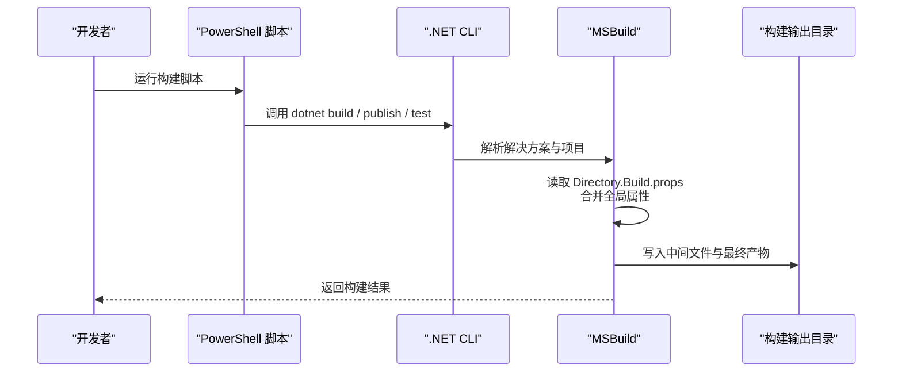
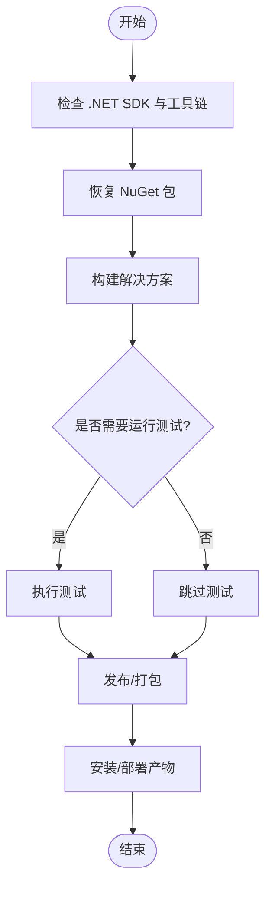
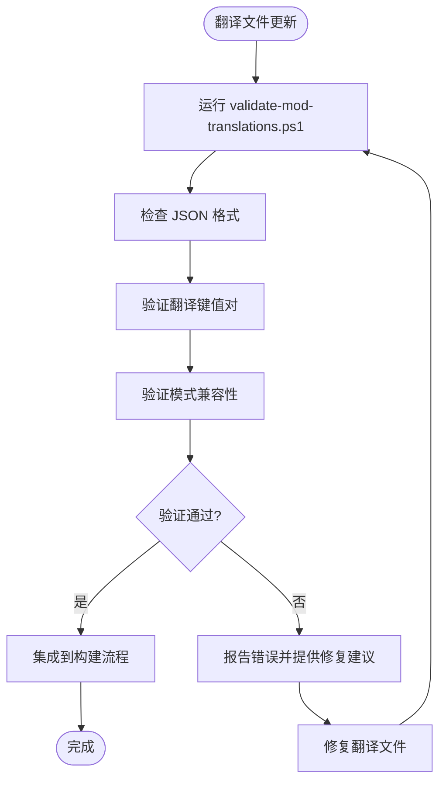
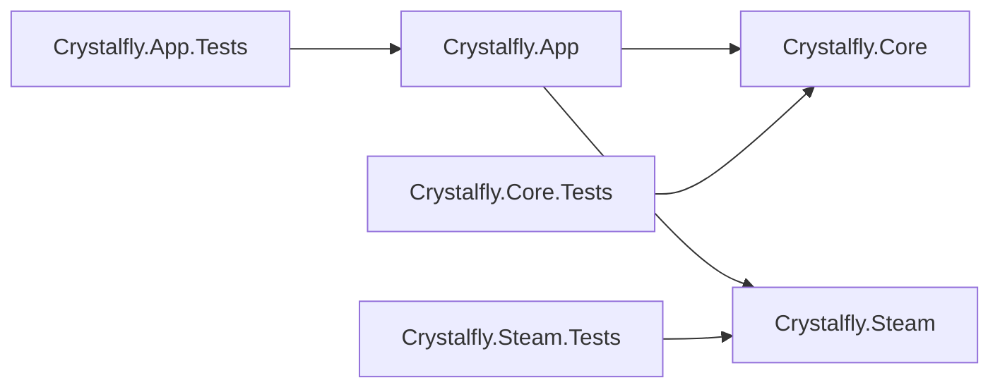

# 构建流程

<cite>
**本文引用的文件**   
- [Directory.Build.props](file://Directory.Build.props)
- [Directory.Packages.props](file://Directory.Packages.props)
- [Crystalfly.slnx](file://Crystalfly.slnx)
- [build-and-install.ps1](file://scripts/build-and-install.ps1)
- [build-release.ps1](file://scripts/build-release.ps1)
- [test-build-and-install.ps1](file://scripts/test-build-and-install.ps1)
- [test-build-release.ps1](file://scripts/test-build-release.ps1)
- [validate-mod-translations.ps1](file://scripts/validate-mod-translations.ps1)
- [update-mod-activity.ps1](file://scripts/update-mod-activity.ps1)
- [mod-translations.zh-CN.md](file://docs/mod-translations.zh-CN.md)
- [catalog.v1.schema.json](file://catalog/catalog.v1.schema.json)
- [mod-translations.zh-CN.v1.schema.json](file://catalog/mod-translations.zh-CN.v1.schema.json)
- [ci.yml](file://.github/workflows/ci.yml)
</cite>

## 更新摘要
**所做更改**   
- 更新了翻译工作流程部分，反映 import-mod-translations.ps1 脚本的移除
- 新增 validate-mod-translations.ps1 脚本的使用说明
- 更新了翻译验证流程和贡献指南
- 完善了构建脚本与翻译验证的集成说明

## 目录
1. [简介](#简介)
2. [项目结构](#项目结构)
3. [核心组件](#核心组件)
4. [架构总览](#架构总览)
5. [详细组件分析](#详细组件分析)
6. [依赖分析](#依赖分析)
7. [性能考虑](#性能考虑)
8. [故障排查指南](#故障排查指南)
9. [结论](#结论)
10. [附录](#附录)

## 简介
本文件面向 Crystalfly 项目的构建与打包流程，覆盖 .NET 项目构建配置、全局属性、PowerShell 构建脚本执行流程与参数、NuGet 包管理与版本控制策略、多目标框架编译与条件编译、资源文件处理、本地开发环境搭建、增量构建优化、并行编译与缓存机制、构建输出目录结构与清理策略等。目标是帮助开发者快速理解并高效参与构建与发布工作。

**更新** 翻译工作流程已更新，现在使用 validate-mod-translations.ps1 进行翻译文件验证，替代了之前的 import-mod-translations.ps1 脚本。

## 项目结构
仓库采用典型 .NET 解决方案结构：
- src 下包含应用与库项目（App、Core、Steam）
- tests 下包含对应测试项目
- scripts 下提供构建与安装相关的 PowerShell 脚本
- catalog 下包含各种清单和模式定义文件
- docs 下包含文档和翻译相关文件
- 根级 Directory.Build.props 与 Directory.Packages.props 用于全局构建与包版本管理
- Crystalfly.slnx 为解决方案定义文件

```mermaid
graph TB
subgraph "根级"
DBP["Directory.Build.props"]
DPP["Directory.Packages.props"]
SLN["Crystalfly.slnx"]
end
subgraph "源代码"
APP["Crystalfly.App.csproj"]
CORE["Crystalfly.Core.csproj"]
STEAM["Crystalfly.Steam.csproj"]
end
subgraph "测试"
TAPP["Crystalfly.App.Tests.csproj"]
TCORE["Crystalfly.Core.Tests.csproj"]
TSTEAM["Crystalfly.Steam.Tests.csproj"]
end
subgraph "脚本"
S1["build-and-install.ps1"]
S2["build-release.ps1"]
S3["test-build-and-install.ps1"]
S4["test-build-release.ps1"]
SV["validate-mod-translations.ps1"]
SA["update-mod-activity.ps1"]
end
subgraph "目录"
CAT["catalog/"]
DOC["docs/"]
end
DBP --> APP
DBP --> CORE
DBP --> STEAM
DBP --> TAPP
DBP --> TCORE
DBP --> TSTEAM
DPP --> APP
DPP --> CORE
DPP --> STEAM
DPP --> TAPP
DPP --> TCORE
DPP --> TSTEAM
SLN --> APP
SLN --> CORE
SLN --> STEAM
SLN --> TAPP
SLN --> TCORE
SLN --> TSTEAM
S1 --> APP
S1 --> CORE
S1 --> STEAM
S2 --> APP
S2 --> CORE
S2 --> STEAM
S3 --> APP
S3 --> CORE
S3 --> STEAM
S4 --> APP
S4 --> CORE
S4 --> STEAM
SV --> CAT
SA --> DOC
```

**图表来源**
- [Directory.Build.props](file://Directory.Build.props)
- [Directory.Packages.props](file://Directory.Packages.props)
- [Crystalfly.slnx](file://Crystalfly.slnx)
- [build-and-install.ps1](file://scripts/build-and-install.ps1)
- [build-release.ps1](file://scripts/build-release.ps1)
- [test-build-and-install.ps1](file://scripts/test-build-and-install.ps1)
- [test-build-release.ps1](file://scripts/test-build-release.ps1)
- [validate-mod-translations.ps1](file://scripts/validate-mod-translations.ps1)
- [update-mod-activity.ps1](file://scripts/update-mod-activity.ps1)

## 核心组件
- 全局构建属性（Directory.Build.props）
  - 统一设置语言版本、目标框架、生成选项、中间/输出目录、符号信息、强名称或签名相关属性、警告级别、冗余代码移除等。
  - 通过条件属性区分 Debug/Release 行为，例如是否启用优化、是否生成调试符号、是否进行完整分析等。
  - 集中化可提升一致性并减少各项目重复配置。

- 全局包版本管理（Directory.Packages.props）
  - 使用中央包版本管理（Central Package Management），在根级集中声明 NuGet 包的版本号，供所有项目引用，避免版本漂移。
  - 便于统一升级、锁定关键依赖版本，降低冲突风险。

- 解决方案文件（Crystalfly.slnx）
  - 组织项目集合，定义构建顺序与依赖关系，驱动 dotnet build/dotnet test 的解析。

- 项目文件（*.csproj）
  - 各业务模块与测试项目继承全局属性，并在必要时覆盖特定项（如平台、SDK、资源嵌入、条件编译符号等）。

**章节来源**
- [Directory.Build.props](file://Directory.Build.props)
- [Directory.Packages.props](file://Directory.Packages.props)
- [Crystalfly.slnx](file://Crystalfly.slnx)

## 架构总览
下图展示从脚本到 MSBuild/.NET SDK 的调用链以及产物落盘路径的关系。

**图表来源**
- [build-and-install.ps1](file://scripts/build-and-install.ps1)
- [build-release.ps1](file://scripts/build-release.ps1)
- [test-build-and-install.ps1](file://scripts/test-build-and-install.ps1)
- [test-build-release.ps1](file://scripts/test-build-release.ps1)
- [Directory.Build.props](file://Directory.Build.props)
- [Crystalfly.slnx](file://Crystalfly.slnx)

## 详细组件分析

### 全局构建属性（Directory.Build.props）
- 作用范围
  - 对仓库内所有 .NET 项目生效，除非在项目文件中显式覆盖。
- 常见设置维度
  - 语言与 SDK：C# 语言版本、TargetFramework、SDK 版本约束。
  - 生成选项：是否生成 XML 文档、是否启用严格检查、是否开启分析器规则集。
  - 输出与中间目录：bin/obj 的统一位置，便于清理与 CI 缓存。
  - 调试与优化：Debug/Release 分支下的优化、符号生成、断点支持。
  - 打包与签名：是否生成安装包、是否启用强名称或证书签名（视项目需要）。
- 条件编译
  - 基于 Configuration（Debug/Release）、Platform、TargetFramework 的条件属性影响编译行为。
- 建议
  - 将跨项目一致的规则收敛在此文件中，保持最小化差异。
  - 谨慎使用全局强名或签名，避免引入不必要的密钥依赖。

**章节来源**
- [Directory.Build.props](file://Directory.Build.props)

### 全局包版本管理（Directory.Packages.props）
- 作用
  - 集中声明 NuGet 包及其版本，供所有项目引用，确保版本一致性与可追溯性。
- 优势
  - 统一升级：修改一处即可影响全仓。
  - 冲突治理：避免不同项目引用不同版本导致的运行时不一致。
  - 审计友好：变更历史清晰，便于回滚与审查。
- 实践
  - 仅在此处声明版本，项目中以包名引用而不指定版本。
  - 对关键依赖（安全相关）建立固定版本基线。

**章节来源**
- [Directory.Packages.props](file://Directory.Packages.props)

### 解决方案与项目组织（Crystalfly.slnx 与各 *.csproj）
- 解决方案
  - 聚合 App、Core、Steam 及对应测试项目，定义构建顺序与依赖。
- 项目职责
  - Crystalfly.App：桌面应用入口与 UI 层。
  - Crystalfly.Core：核心业务逻辑、数据模型、服务实现。
  - Crystalfly.Steam：Steam 集成与下载能力。
  - 测试项目：分别覆盖 UI、ViewModel、核心逻辑与 Steam 功能。
- 多目标框架
  - 若需同时支持多个 TargetFramework，可在项目文件中声明；全局属性可提供默认值。
- 条件编译
  - 通过 DefineConstants 或 Platform 条件控制不同平台的特性开关。

**章节来源**
- [Crystalfly.slnx](file://Crystalfly.slnx)

### PowerShell 构建脚本
- 脚本清单
  - build-and-install.ps1：构建并安装（通常用于本地开发）。
  - build-release.ps1：构建发布包（用于交付与分发）。
  - test-build-and-install.ps1：测试环境的构建与安装。
  - test-build-release.ps1：测试环境的发布构建。
  - validate-mod-translations.ps1：验证模组翻译文件的格式和内容。
  - update-mod-activity.ps1：更新模组活动清单。
- 通用流程
  - 校验工具链（dotnet SDK 版本、必要工具）。
  - 恢复 NuGet 包（dotnet restore）。
  - 构建解决方案（dotnet build，按 Configuration/Platform）。
  - 可选：运行测试（dotnet test）。
  - 发布/打包（dotnet publish 或调用打包工具）。
  - 安装/部署（复制产物至目标目录或执行安装程序）。
- 参数选项（示例）
  - --configuration：Debug/Release
  - --framework：目标框架（如 net8.0-windows）
  - --platform：x64/x86/AnyCPU
  - --no-restore：跳过还原（CI 中常用）
  - --verbosity：日志详细程度
  - --output：自定义输出目录
  - --self-contained：是否自包含运行
  - --runtime：目标运行时标识符（RID）
- 错误处理
  - 捕获非零退出码并输出上下文信息。
  - 记录关键步骤时间戳，便于定位慢点。
- 幂等与可重复性
  - 先清理再构建，或使用增量构建；确保每次构建可复现。

**图表来源**
- [build-and-install.ps1](file://scripts/build-and-install.ps1)
- [build-release.ps1](file://scripts/build-release.ps1)
- [test-build-and-install.ps1](file://scripts/test-build-and-install.ps1)
- [test-build-release.ps1](file://scripts/test-build-release.ps1)

**章节来源**
- [build-and-install.ps1](file://scripts/build-and-install.ps1)
- [build-release.ps1](file://scripts/build-release.ps1)
- [test-build-and-install.ps1](file://scripts/test-build-and-install.ps1)
- [test-build-release.ps1](file://scripts/test-build-release.ps1)

### 翻译工作流程更新

**重要更新** 翻译工作流程已发生重大变化，import-mod-translations.ps1 脚本已被移除，取而代之的是新的 validate-mod-translations.ps1 脚本进行翻译文件验证。

#### 新的翻译验证流程
- validate-mod-translations.ps1 脚本功能
  - 验证模组翻译文件的 JSON 格式正确性
  - 检查翻译键值对的完整性
  - 验证翻译内容与模式定义的兼容性
  - 提供详细的错误报告和修复建议

- 翻译文件结构
  - 翻译文件位于 catalog/ 目录下
  - 支持多种语言的翻译文件（如 mod-translations.zh-CN.v1.json）
  - 每个语言都有对应的模式定义文件（.schema.json）

- 构建集成
  - 翻译验证作为构建流程的一部分自动执行
  - 失败的翻译验证会导致构建失败
  - 提供清晰的错误信息指导开发者修复问题

**图表来源**
- [validate-mod-translations.ps1](file://scripts/validate-mod-translations.ps1)
- [mod-translations.zh-CN.v1.schema.json](file://catalog/mod-translations.zh-CN.v1.schema.json)
- [mod-translations.zh-CN.md](file://docs/mod-translations.zh-CN.md)

**章节来源**
- [validate-mod-translations.ps1](file://scripts/validate-mod-translations.ps1)
- [mod-translations.zh-CN.md](file://docs/mod-translations.zh-CN.md)
- [mod-translations.zh-CN.v1.schema.json](file://catalog/mod-translations.zh-CN.v1.schema.json)

### 资源文件与内容嵌入
- 资源类型
  - 静态资源（图片、样式、主题文件等）通常作为 Content 或 None 加入项目。
  - 可通过 <EmbeddedResource> 将资源嵌入到程序集，或通过 CopyToOutputDirectory 复制到输出目录。
- 条件处理
  - 根据平台或配置选择性包含资源（例如 Windows 专用资源）。
- 最佳实践
  - 大型资源建议使用外部文件并按需加载，减小程序集体积。
  - 对国际化资源（如翻译 JSON）采用独立文件与运行时加载策略。

**章节来源**
- [Crystalfly.App.csproj](file://src/Crystalfly.App/Crystalfly.App.csproj)
- [Crystalfly.Core.csproj](file://src/Crystalfly.Core/Crystalfly.Core.csproj)
- [Crystalfly.Steam.csproj](file://src/Crystalfly.Steam/Crystalfly.Steam.csproj)

### 多目标框架与条件编译
- 多目标
  - 在 csproj 中声明多个 TargetFramework，配合全局属性提供默认值。
- 条件编译
  - 使用 #if/#else 结合 DefineConstants 控制平台/配置相关逻辑。
  - 针对 Windows 专属 API 或第三方库进行条件引用。

**章节来源**
- [Directory.Build.props](file://Directory.Build.props)
- [Crystalfly.App.csproj](file://src/Crystalfly.App/Crystalfly.App.csproj)
- [Crystalfly.Core.csproj](file://src/Crystalfly.Core/Crystalfly.Core.csproj)
- [Crystalfly.Steam.csproj](file://src/Crystalfly.Steam/Crystalfly.Steam.csproj)

## 依赖分析
- 包源与版本
  - 通过 Directory.Packages.props 集中管理版本，确保全仓一致。
  - 如需私有源或镜像，请在 NuGet.config 或环境变量中配置（不在本仓库范围内时由用户自行维护）。
- 项目间依赖
  - App 依赖 Core 与 Steam；测试项目分别依赖对应源码项目。
- 外部依赖
  - 第三方库通过 NuGet 引用，版本受中央管理。

**图表来源**
- [Crystalfly.slnx](file://Crystalfly.slnx)
- [Crystalfly.App.csproj](file://src/Crystalfly.App/Crystalfly.App.csproj)
- [Crystalfly.Core.csproj](file://src/Crystalfly.Core/Crystalfly.Core.csproj)
- [Crystalfly.Steam.csproj](file://src/Crystalfly.Steam/Crystalfly.Steam.csproj)
- [Crystalfly.App.Tests.csproj](file://tests/Crystalfly.App.Tests/Crystalfly.App.Tests.csproj)
- [Crystalfly.Core.Tests.csproj](file://tests/Crystalfly.Core.Tests/Crystalfly.Core.Tests.csproj)
- [Crystalfly.Steam.Tests.csproj](file://tests/Crystalfly.Steam.Tests/Crystalfly.Steam.Tests.csproj)

**章节来源**
- [Directory.Packages.props](file://Directory.Packages.props)
- [Crystalfly.slnx](file://Crystalfly.slnx)

## 性能考虑
- 增量构建
  - 利用 MSBuild 增量编译，仅重新编译受影响的项目与文件。
  - 合理组织输入文件，避免频繁改动导致全量重建。
- 并行编译
  - 使用 dotnet build -m 或 MSBuild 的并行度参数，充分利用多核 CPU。
- 缓存机制
  - 使用 dotnet cache 或 CI 缓存 bin/obj 与 NuGet 包缓存目录，缩短冷启动时间。
- 发布优化
  - Release 配置下启用优化与裁剪，减少产物体积与启动时间。
- 分析器与警告
  - 在 Debug 下适度开启分析器，Release 下按需关闭以提升构建速度。

## 故障排查指南
- 常见问题
  - 工具链缺失：确认已安装匹配的 .NET SDK 版本。
  - 包还原失败：检查网络与 NuGet 源配置，必要时手动还原。
  - 权限问题：安装/部署阶段可能需要管理员权限。
  - 平台不匹配：确保 RID 与目标平台一致（x64/ARM64）。
  - 翻译验证失败：检查翻译文件格式和键值对完整性。
- 诊断手段
  - 提高日志详细程度（--verbosity detailed）。
  - 单独运行 dotnet restore/build/test/publish 定位失败步骤。
  - 清理中间文件后重试（删除 obj/bin 或执行清理命令）。
  - 使用 validate-mod-translations.ps1 单独验证翻译文件。
- 脚本错误
  - 查看脚本输出的上下文信息与错误码。
  - 在本地以交互模式逐步执行脚本步骤，观察异常堆栈。

**章节来源**
- [build-and-install.ps1](file://scripts/build-and-install.ps1)
- [build-release.ps1](file://scripts/build-release.ps1)
- [test-build-and-install.ps1](file://scripts/test-build-and-install.ps1)
- [test-build-release.ps1](file://scripts/test-build-release.ps1)
- [validate-mod-translations.ps1](file://scripts/validate-mod-translations.ps1)

## 结论
通过全局构建属性与中央包版本管理，Crystalfly 实现了高度一致的构建体验与可维护的依赖治理。PowerShell 脚本封装了标准构建流水线，使本地开发与 CI 保持一致。新的翻译验证流程确保了翻译文件的质量和一致性。遵循本文的性能与排错建议，可进一步提升构建效率与稳定性。

## 附录

### 本地开发环境搭建
- 必备工具
  - .NET SDK（与项目目标框架匹配）
  - PowerShell 5.1 或更高版本（Windows）
  - 可选：Visual Studio 或 Rider（IDE 集成）
- 推荐配置
  - 启用 .NET 缓存与并行构建
  - 配置 NuGet 源（公司代理或镜像）
- 首次构建
  - 克隆仓库后，运行构建脚本完成还原、构建与安装。

### 构建输出目录结构
- 典型产物
  - bin/：编译输出（含 DLL、EXE、依赖）
  - obj/：中间文件（增量构建缓存）
  - 发布目录：publish/ 或自定义输出路径（含自包含或框架依赖型）
- 清理策略
  - 清理 obj/bin 可强制全量重建
  - 发布前建议清理以避免旧产物残留

### 翻译贡献指南
- 翻译文件位置
  - 翻译文件位于 catalog/ 目录下
  - 每种语言有独立的 JSON 文件
- 翻译格式要求
  - 遵循 JSON 格式规范
  - 保持键值对的一致性
  - 参考现有翻译文件的结构
- 验证流程
  - 使用 validate-mod-translations.ps1 验证翻译文件
  - 确保所有必需的键值对都存在
  - 验证与模式定义的兼容性

**章节来源**
- [validate-mod-translations.ps1](file://scripts/validate-mod-translations.ps1)
- [mod-translations.zh-CN.md](file://docs/mod-translations.zh-CN.md)
- [mod-translations.zh-CN.v1.schema.json](file://catalog/mod-translations.zh-CN.v1.schema.json)