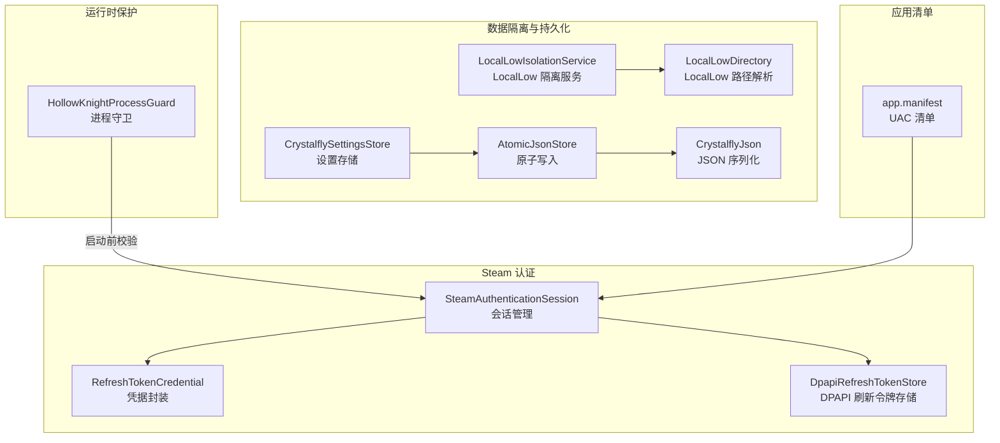
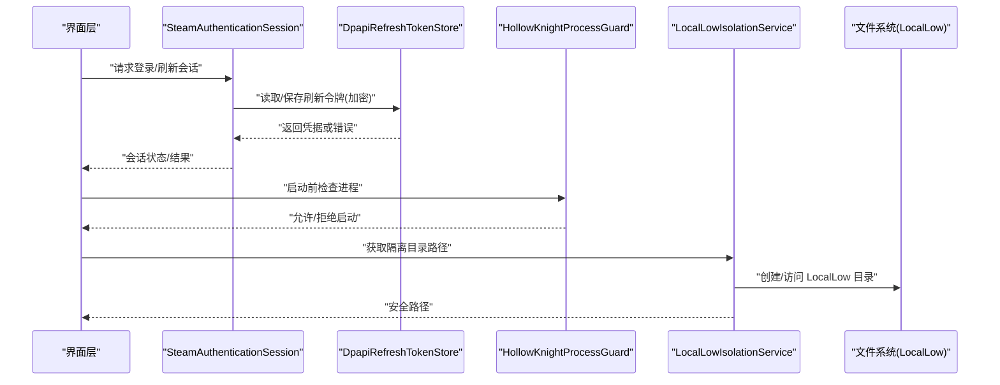
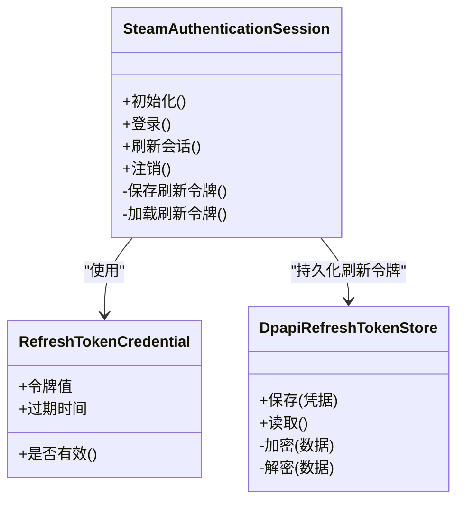
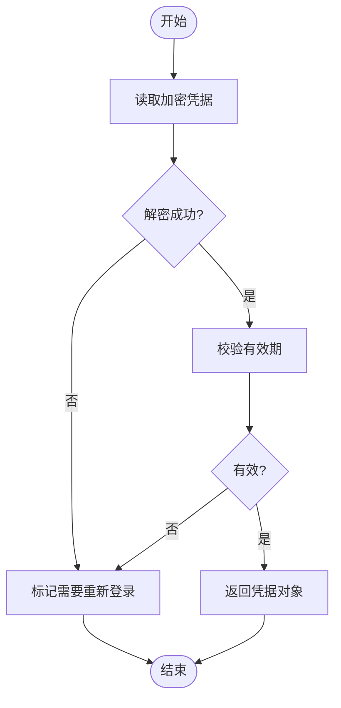
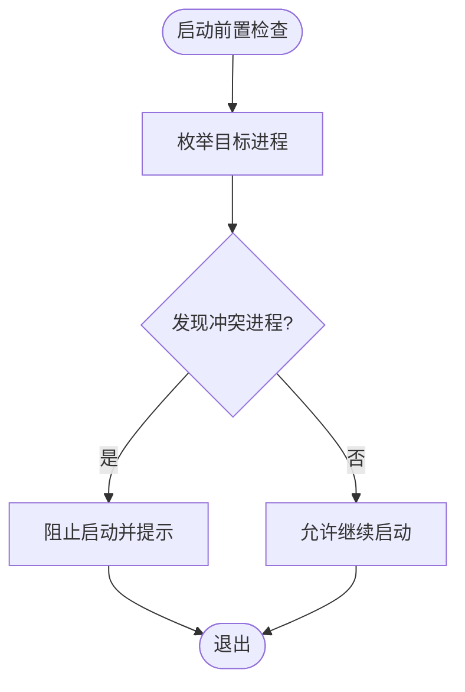
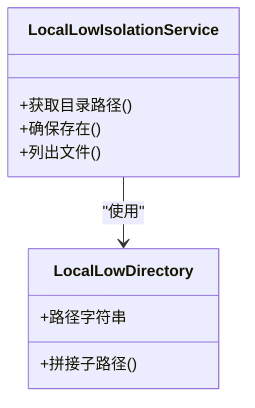
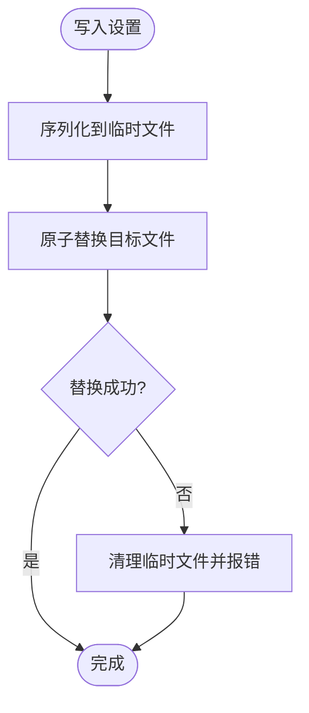
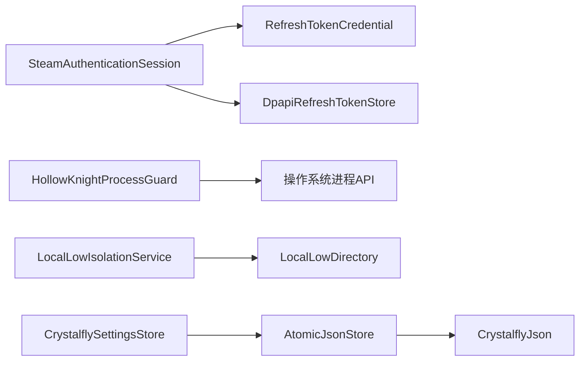

# 安全策略

<cite>
**本文引用的文件**   
- [SteamAuthenticationSession.cs](file://src/Crystalfly.Steam/Authentication/SteamAuthenticationSession.cs)
- [DpapiRefreshTokenStore.cs](file://src/Crystalfly.Steam/Security/DpapiRefreshTokenStore.cs)
- [RefreshTokenCredential.cs](file://src/Crystalfly.Steam/Security/RefreshTokenCredential.cs)
- [LocalLowIsolationService.cs](file://src/Crystalfly.Core/LocalLow/LocalLowIsolationService.cs)
- [LocalLowDirectory.cs](file://src/Crystalfly.Core/LocalLow/LocalLowDirectory.cs)
- [HollowKnightProcessGuard.cs](file://src/Crystalfly.Core/Runtime/HollowKnightProcessGuard.cs)
- [CrystalflySettingsStore.cs](file://src/Crystalfly.Core/Configuration/CrystalflySettingsStore.cs)
- [CrystalflyPaths.cs](file://src/Crystalfly.Core/Configuration/CrystalflyPaths.cs)
- [AtomicJsonStore.cs](file://src/Crystalfly.Core/Serialization/AtomicJsonStore.cs)
- [CrystalflyJson.cs](file://src/Crystalfly.Core/Serialization/CrystalflyJson.cs)
- [app.manifest](file://src/Crystalfly.App/app.manifest)
</cite>

## 目录
1. [简介](#简介)
2. [项目结构](#项目结构)
3. [核心组件](#核心组件)
4. [架构总览](#架构总览)
5. [详细组件分析](#详细组件分析)
6. [依赖关系分析](#依赖关系分析)
7. [性能与安全权衡](#性能与安全权衡)
8. [故障排查指南](#故障排查指南)
9. [结论](#结论)
10. [附录：配置与最佳实践](#附录配置与最佳实践)

## 简介
本安全策略文档面向 Crystalfly 项目的安全设计与实现，聚焦以下关键领域：
- Steam 认证与会话管理
- 刷新令牌的安全存储
- 进程保护与未授权访问防护
- LocalLow 目录隔离与数据持久化安全
- 权限控制模型、输入验证与错误处理
- 敏感数据的加密存储与传输安全
- 安全审计日志记录与威胁检测机制（建议）
- 安全配置指南与安全最佳实践
- 常见安全威胁的防护措施与应急响应流程

## 项目结构
从安全视角看，本项目将安全相关能力分布在如下模块：
- Steam 认证与会话：位于 Steam 子项目中，负责会话生命周期管理与凭据封装。
- 安全存储：使用 Windows DPAPI 对刷新令牌进行本地加密存储。
- 运行时保护：在启动前检查并阻止非预期进程运行，避免冲突与注入风险。
- 数据隔离：通过 LocalLow 目录提供用户级隔离的数据存储路径。
- 配置与序列化：设置项与 JSON 序列化的原子写入与一致性保障。
- 应用清单：以 UAC 清单控制提升权限行为，降低提权面。

图表来源
- [SteamAuthenticationSession.cs](file://src/Crystalfly.Steam/Authentication/SteamAuthenticationSession.cs)
- [DpapiRefreshTokenStore.cs](file://src/Crystalfly.Steam/Security/DpapiRefreshTokenStore.cs)
- [RefreshTokenCredential.cs](file://src/Crystalfly.Steam/Security/RefreshTokenCredential.cs)
- [HollowKnightProcessGuard.cs](file://src/Crystalfly.Core/Runtime/HollowKnightProcessGuard.cs)
- [LocalLowIsolationService.cs](file://src/Crystalfly.Core/LocalLow/LocalLowIsolationService.cs)
- [LocalLowDirectory.cs](file://src/Crystalfly.Core/LocalLow/LocalLowDirectory.cs)
- [CrystalflySettingsStore.cs](file://src/Crystalfly.Core/Configuration/CrystalflySettingsStore.cs)
- [AtomicJsonStore.cs](file://src/Crystalfly.Core/Serialization/AtomicJsonStore.cs)
- [CrystalflyJson.cs](file://src/Crystalfly.Core/Serialization/CrystalflyJson.cs)
- [app.manifest](file://src/Crystalfly.App/app.manifest)

章节来源
- [SteamAuthenticationSession.cs](file://src/Crystalfly.Steam/Authentication/SteamAuthenticationSession.cs)
- [DpapiRefreshTokenStore.cs](file://src/Crystalfly.Steam/Security/DpapiRefreshTokenStore.cs)
- [RefreshTokenCredential.cs](file://src/Crystalfly.Steam/Security/RefreshTokenCredential.cs)
- [HollowKnightProcessGuard.cs](file://src/Crystalfly.Core/Runtime/HollowKnightProcessGuard.cs)
- [LocalLowIsolationService.cs](file://src/Crystalfly.Core/LocalLow/LocalLowIsolationService.cs)
- [LocalLowDirectory.cs](file://src/Crystalfly.Core/LocalLow/LocalLowDirectory.cs)
- [CrystalflySettingsStore.cs](file://src/Crystalfly.Core/Configuration/CrystalflySettingsStore.cs)
- [AtomicJsonStore.cs](file://src/Crystalfly.Core/Serialization/AtomicJsonStore.cs)
- [CrystalflyJson.cs](file://src/Crystalfly.Core/Serialization/CrystalflyJson.cs)
- [app.manifest](file://src/Crystalfly.App/app.manifest)

## 核心组件
- Steam 认证会话管理
  - 负责发起认证、维护会话状态、处理回调与过期续期。
  - 与刷新令牌存储协作，确保无感续期与失败回退。
- 刷新令牌安全存储
  - 基于 Windows DPAPI 对刷新令牌进行系统级加密，限制仅当前用户可解密。
  - 提供最小暴露面的读写接口，避免明文落盘。
- 进程保护
  - 在启动前扫描目标游戏进程，防止多实例或受干扰环境导致的不一致与安全风险。
- LocalLow 目录隔离
  - 使用用户专属的 LocalLow 目录存放会话与敏感数据，避免跨用户泄露。
- 配置与序列化
  - 设置项通过原子写入保证一致性，减少并发竞争导致的损坏。
  - JSON 序列化统一入口，便于后续扩展安全选项（如额外校验）。
- 应用清单
  - 通过 UAC 清单控制是否需要管理员权限，默认不提升，降低攻击面。

章节来源
- [SteamAuthenticationSession.cs](file://src/Crystalfly.Steam/Authentication/SteamAuthenticationSession.cs)
- [DpapiRefreshTokenStore.cs](file://src/Crystalfly.Steam/Security/DpapiRefreshTokenStore.cs)
- [RefreshTokenCredential.cs](file://src/Crystalfly.Steam/Security/RefreshTokenCredential.cs)
- [HollowKnightProcessGuard.cs](file://src/Crystalfly.Core/Runtime/HollowKnightProcessGuard.cs)
- [LocalLowIsolationService.cs](file://src/Crystalfly.Core/LocalLow/LocalLowIsolationService.cs)
- [LocalLowDirectory.cs](file://src/Crystalfly.Core/LocalLow/LocalLowDirectory.cs)
- [CrystalflySettingsStore.cs](file://src/Crystalfly.Core/Configuration/CrystalfflySettingsStore.cs)
- [AtomicJsonStore.cs](file://src/Crystalfly.Core/Serialization/AtomicJsonStore.cs)
- [CrystalflyJson.cs](file://src/Crystalfly.Core/Serialization/CrystalflyJson.cs)
- [app.manifest](file://src/Crystalfly.App/app.manifest)

## 架构总览
下图展示了认证、存储、运行时保护与数据隔离之间的交互关系。

图表来源
- [SteamAuthenticationSession.cs](file://src/Crystalfly.Steam/Authentication/SteamAuthenticationSession.cs)
- [DpapiRefreshTokenStore.cs](file://src/Crystalfly.Steam/Security/DpapiRefreshTokenStore.cs)
- [HollowKnightProcessGuard.cs](file://src/Crystalfly.Core/Runtime/HollowKnightProcessGuard.cs)
- [LocalLowIsolationService.cs](file://src/Crystalfly.Core/LocalLow/LocalLowIsolationService.cs)

## 详细组件分析

### Steam 认证与会话管理
- 职责边界
  - 会话建立、续期、失效处理。
  - 与刷新令牌存储协同，实现无感刷新。
- 关键流程
  - 首次登录：引导用户完成认证，成功后保存刷新令牌。
  - 自动续期：当会话即将过期时，尝试使用刷新令牌更新。
  - 异常回退：刷新失败时提示重新登录。
- 安全要点
  - 会话状态仅在内存中持有，避免持久化明文会话。
  - 刷新令牌通过 DPAPI 加密存储，限制为当前用户。
  - 网络通信遵循平台 SDK 的安全约定（TLS 等）。

图表来源
- [SteamAuthenticationSession.cs](file://src/Crystalfly.Steam/Authentication/SteamAuthenticationSession.cs)
- [RefreshTokenCredential.cs](file://src/Crystalfly.Steam/Security/RefreshTokenCredential.cs)
- [DpapiRefreshTokenStore.cs](file://src/Crystalfly.Steam/Security/DpapiRefreshTokenStore.cs)

章节来源
- [SteamAuthenticationSession.cs](file://src/Crystalfly.Steam/Authentication/SteamAuthenticationSession.cs)
- [RefreshTokenCredential.cs](file://src/Crystalfly.Steam/Security/RefreshTokenCredential.cs)
- [DpapiRefreshTokenStore.cs](file://src/Crystalfly.Steam/Security/DpapiRefreshTokenStore.cs)

### 刷新令牌的安全存储（DPAPI）
- 设计目标
  - 仅当前用户可解密，避免跨用户窃取。
  - 最小暴露面：只暴露保存/读取接口。
- 安全特性
  - 使用系统 DPAPI 进行对称加密。
  - 结合文件名与路径混淆，降低直接定位难度。
- 错误处理
  - 解密失败视为凭据无效，触发重新登录流程。
  - 写入失败采用幂等重试与原子替换策略。

图表来源
- [DpapiRefreshTokenStore.cs](file://src/Crystalfly.Steam/Security/DpapiRefreshTokenStore.cs)
- [RefreshTokenCredential.cs](file://src/Crystalfly.Steam/Security/RefreshTokenCredential.cs)

章节来源
- [DpapiRefreshTokenStore.cs](file://src/Crystalfly.Steam/Security/DpapiRefreshTokenStore.cs)
- [RefreshTokenCredential.cs](file://src/Crystalfly.Steam/Security/RefreshTokenCredential.cs)

### 进程保护（防止未授权访问与冲突）
- 功能说明
  - 在启动前检测目标游戏进程是否存在，避免多实例或外部注入干扰。
- 策略
  - 若检测到冲突进程，则中止启动并给出明确提示。
  - 支持白名单模式（可选），允许特定场景下的例外。
- 安全收益
  - 降低被恶意进程劫持的风险。
  - 提高运行环境的一致性与可预测性。

图表来源
- [HollowKnightProcessGuard.cs](file://src/Crystalfly.Core/Runtime/HollowKnightProcessGuard.cs)

章节来源
- [HollowKnightProcessGuard.cs](file://src/Crystalfly.Core/Runtime/HollowKnightProcessGuard.cs)

### LocalLow 目录隔离（数据安全）
- 设计目标
  - 将会话与敏感数据保存在用户专属的 LocalLow 目录，避免与其他用户共享。
- 关键点
  - 路径解析由专用服务统一管理，避免硬编码路径。
  - 目录不存在时自动创建，并确保权限正确。
- 安全收益
  - 利用操作系统提供的用户隔离语义，降低越权访问风险。

图表来源
- [LocalLowIsolationService.cs](file://src/Crystalfly.Core/LocalLow/LocalLowIsolationService.cs)
- [LocalLowDirectory.cs](file://src/Crystalfly.Core/LocalLow/LocalLowDirectory.cs)

章节来源
- [LocalLowIsolationService.cs](file://src/Crystalfly.Core/LocalLow/LocalLowIsolationService.cs)
- [LocalLowDirectory.cs](file://src/Crystalfly.Core/LocalLow/LocalLowDirectory.cs)

### 配置与序列化（原子写入与一致性）
- 设置存储
  - 提供统一的设置读写接口，内部使用原子写入避免部分写入导致的损坏。
- 原子写入
  - 先写入临时文件，再原子替换目标文件，确保读端始终看到完整内容。
- JSON 序列化
  - 统一入口便于扩展字段校验、版本兼容与脱敏输出。

图表来源
- [CrystalflySettingsStore.cs](file://src/Crystalfly.Core/Configuration/CrystalflySettingsStore.cs)
- [AtomicJsonStore.cs](file://src/Crystalfly.Core/Serialization/AtomicJsonStore.cs)
- [CrystalflyJson.cs](file://src/Crystalfly.Core/Serialization/CrystalflyJson.cs)

章节来源
- [CrystalflySettingsStore.cs](file://src/Crystalfly.Core/Configuration/CrystalflySettingsStore.cs)
- [AtomicJsonStore.cs](file://src/Crystalfly.Core/Serialization/AtomicJsonStore.cs)
- [CrystalflyJson.cs](file://src/Crystalfly.Core/Serialization/CrystalflyJson.cs)

### 应用清单与权限控制（UAC）
- 清单作用
  - 声明应用程序是否需要管理员权限，默认不提升以降低攻击面。
- 权限模型
  - 普通用户权限即可运行；仅在必要时才请求提升。
- 安全收益
  - 减少提权窗口与潜在滥用。

章节来源
- [app.manifest](file://src/Crystalfly.App/app.manifest)

## 依赖关系分析
- 组件耦合
  - 认证会话依赖刷新令牌存储与凭据模型。
  - 进程守卫独立于认证链路，作为启动前置条件。
  - 数据隔离与设置存储共同构成持久化层。
- 外部依赖
  - Windows DPAPI 用于本地加密。
  - 操作系统进程枚举 API 用于进程保护。
  - 文件系统用于 LocalLow 目录操作。

图表来源
- [SteamAuthenticationSession.cs](file://src/Crystalfly.Steam/Authentication/SteamAuthenticationSession.cs)
- [RefreshTokenCredential.cs](file://src/Crystalfly.Steam/Security/RefreshTokenCredential.cs)
- [DpapiRefreshTokenStore.cs](file://src/Crystalfly.Steam/Security/DpapiRefreshTokenStore.cs)
- [HollowKnightProcessGuard.cs](file://src/Crystalfly.Core/Runtime/HollowKnightProcessGuard.cs)
- [LocalLowIsolationService.cs](file://src/Crystalfly.Core/LocalLow/LocalLowIsolationService.cs)
- [LocalLowDirectory.cs](file://src/Crystalfly.Core/LocalLow/LocalLowDirectory.cs)
- [CrystalflySettingsStore.cs](file://src/Crystalfly.Core/Configuration/CrystalflySettingsStore.cs)
- [AtomicJsonStore.cs](file://src/Crystalfly.Core/Serialization/AtomicJsonStore.cs)
- [CrystalflyJson.cs](file://src/Crystalfly.Core/Serialization/CrystalflyJson.cs)

章节来源
- [SteamAuthenticationSession.cs](file://src/Crystalfly.Steam/Authentication/SteamAuthenticationSession.cs)
- [DpapiRefreshTokenStore.cs](file://src/Crystalfly.Steam/Security/DpapiRefreshTokenStore.cs)
- [RefreshTokenCredential.cs](file://src/Crystalfly.Steam/Security/RefreshTokenCredential.cs)
- [HollowKnightProcessGuard.cs](file://src/Crystalfly.Core/Runtime/HollowKnightProcessGuard.cs)
- [LocalLowIsolationService.cs](file://src/Crystalfly.Core/LocalLow/LocalLowIsolationService.cs)
- [LocalLowDirectory.cs](file://src/Crystalfly.Core/LocalLow/LocalLowDirectory.cs)
- [CrystalflySettingsStore.cs](file://src/Crystalfly.Core/Configuration/CrystalflySettingsStore.cs)
- [AtomicJsonStore.cs](file://src/Crystalfly.Core/Serialization/AtomicJsonStore.cs)
- [CrystalflyJson.cs](file://src/Crystalfly.Core/Serialization/CrystalflyJson.cs)

## 性能与安全权衡
- 刷新令牌缓存
  - 在内存中缓存短期有效的刷新令牌可减少频繁磁盘 IO，但需确保进程终止后及时清除。
- 原子写入开销
  - 原子替换带来少量额外 IO，但显著提升可靠性与一致性，适合配置与凭据类数据。
- 进程扫描频率
  - 启动前一次性扫描即可，避免周期性扫描带来的性能损耗。

[本节为通用指导，无需具体文件引用]

## 故障排查指南
- 刷新令牌解密失败
  - 现象：无法自动续期，提示重新登录。
  - 排查：确认当前用户上下文与 DPAPI 可用性；检查 LocalLow 目录权限。
- 会话过期频繁
  - 现象：短时间内多次要求重新登录。
  - 排查：检查网络连通性与服务端响应；确认刷新逻辑是否正确调用。
- 进程保护误拦截
  - 现象：正常启动被阻止。
  - 排查：确认目标进程名称与白名单策略；查看进程枚举结果。
- 设置文件损坏
  - 现象：启动时报错或配置丢失。
  - 排查：检查原子写入是否成功；恢复备份文件并观察问题复现。

章节来源
- [DpapiRefreshTokenStore.cs](file://src/Crystalfly.Steam/Security/DpapiRefreshTokenStore.cs)
- [SteamAuthenticationSession.cs](file://src/Crystalfly.Steam/Authentication/SteamAuthenticationSession.cs)
- [HollowKnightProcessGuard.cs](file://src/Crystalfly.Core/Runtime/HollowKnightProcessGuard.cs)
- [CrystalflySettingsStore.cs](file://src/Crystalfly.Core/Configuration/CrystalflySettingsStore.cs)
- [AtomicJsonStore.cs](file://src/Crystalfly.Core/Serialization/AtomicJsonStore.cs)

## 结论
Crystalfly 在认证与会话、凭据存储、进程保护与数据隔离方面形成了较为完善的安全基线。通过 DPAPI、LocalLow 隔离与原子写入等机制，系统在可用性与安全性之间取得良好平衡。建议后续引入更完善的安全审计与威胁检测能力，进一步提升整体安全水位。

[本节为总结性内容，无需具体文件引用]

## 附录：配置与最佳实践

- 安全配置指南
  - 保持应用清单默认不提升权限，仅在必要功能处显式请求提升。
  - 将敏感数据限定在 LocalLow 目录，避免写入公共位置。
  - 启用并保留刷新令牌的加密存储，禁止明文导出。
  - 在启动前执行进程保护检查，避免与冲突进程共存。

- 输入验证机制（建议）
  - 对所有外部输入（路径、用户名、URL 等）进行严格校验与白名单过滤。
  - 对配置文件与凭据文件进行格式与长度限制，防止畸形数据导致异常。

- 错误处理策略（建议）
  - 区分可恢复与不可恢复错误，提供明确的回退与重试策略。
  - 对用户可见的错误信息进行脱敏，避免泄露内部细节。

- 敏感数据加密与传输安全（建议）
  - 本地敏感数据使用 DPAPI 或等效方案加密。
  - 网络通信强制使用 TLS，校验证书有效性，禁用弱密码套件。

- 安全审计日志与威胁检测（建议）
  - 记录认证事件（登录、刷新、失败）、凭据访问与进程保护决策。
  - 对异常模式（频繁失败、异常路径访问）进行告警与限流。

- 常见威胁与防护
  - 凭据窃取：通过 DPAPI 与最小暴露面降低风险。
  - 进程注入：通过进程保护与完整性检查阻断。
  - 数据泄露：通过 LocalLow 隔离与权限控制减少泄露面。
  - 配置篡改：通过原子写入与校验机制增强完整性。

- 应急响应流程（建议）
  - 发现异常：立即停止受影响会话并撤销刷新令牌。
  - 隔离影响：冻结相关用户上下文与本地凭据。
  - 取证分析：收集审计日志与系统快照。
  - 修复与恢复：更新策略与补丁，逐步恢复服务。

[本节为通用指导，无需具体文件引用]